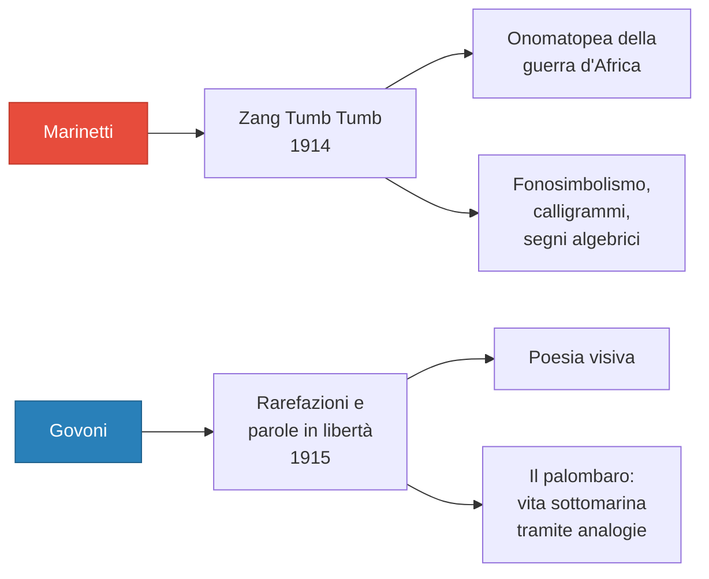

# Il Futurismo — Ripasso veloce

> [!NOTE] Aggiornamento 09/04/26
> ***Contro i professori*** è stato letto e analizzato in classe. Vedi sezione 9 di questo ripasso.

---

## 1. Che cos'è

- **Primo movimento d'avanguardia** italiano
- Periodo: ca. **1909–1920**
- Fondatore: **Filippo Tommaso Marinetti**
- Data fondativa: **20 febbraio 1909** — *Manifesto del Futurismo* su ***Le Figaro*** (rivista francese)
- Rivista: ***Lacerba*** (Firenze, 1913)
- Movimento **globale**: letteratura, arte, teatro, musica, cucina
- *Avanguardia* = termine militare (chi va in avanscoperta)

---

## 2. Contesto

- Contestazione della **società borghese** (indifferente all'arte)
- Attrazione per la **modernità**: progresso, industria, urbanizzazione
- FIAT fondata nel **1899** — automobile = simbolo della modernità
- Baudelaire: **"eroismo della vita moderna"** — la letteratura abbandona l'idillio agreste
- Collegamento con i **poeti maledetti** (emarginazione del poeta) e con **D'Annunzio** (esaltazione della forza)

---

## 3. Ideologia

| Esaltano | Rifiutano |
|---|---|
| Velocità, dinamismo | Immobilismo, contemplazione |
| Aggressività, coraggio, istinto | Debolezza, umiltà, ragione |
| Guerra, lotta | Pace, moralismo |
| Modernità, macchina | Tradizione, natura |

**Formule chiave:**
- La guerra = **«sola igiene del mondo»**
- **«Bruciamo i musei»** — il passato non ha più niente da dire
- **«Uccidiamo il chiaro di luna»** — rifiuto della tradizione lirica (Petrarca → Leopardi)
- **«Nessuna opera senza carattere aggressivo può essere un capolavoro»**
- Artista nella società capitalistica: **disgustato, declassato, disoccupato**
- Posizione politica: **interventisti** → poi vicini al **fascismo**

---

## 4. Manifesto del Futurismo (1909) — Punti chiave

1. Amor del pericolo, energia, temerità
2. Coraggio, audacia, ribellione come essenza della poesia
3. Movimento aggressivo: «il passo di corsa, il salto mortale, lo schiaffo e il pugno»
4. **Bellezza della velocità**
7. Nessun capolavoro senza aggressività
9. Glorificazione della guerra
10. Distruggere musei, biblioteche, accademie; anti-femminismo
11. Locomotive e aeroplani; manifesto lanciato dall'Italia

---

## 5. Manifesto tecnico della letteratura futurista (1912) — Cosa abolire

| Abolire | Perché |
|---|---|
| **Sintassi** | Ingabbia le parole → **paroliberismo** (parole in libertà) |
| **Aggettivo** | Rallenta, suppone una sosta |
| **Avverbio** | «Vecchia fibbia» che blocca |
| **Punteggiatura** | «Soste assurde» |
| **Verbi coniugati** | Imprigionano nell'io → usare solo l'**infinito** (elimina soggettività, esprime dinamismo) |
| **L'io** | L'uomo è «avariato» dalla cultura |
| **Ordine** | Serve il **maximum di disordine** |

**Tecniche da ricordare:**
- **Paroliberismo** = parole in libertà
- **Immaginazione senza fili** = immaginazione libera da vincoli logici
- **Doppio sostantivo per analogia**: uomo-torpediniera, donna-golfo, folla-risacca (versione radicale: solo il secondo sostantivo)
- **Onomatopea**, **calligramma**, **fonosimbolismo**
- **Asindeto** e **climax ascendente**

---

## 6. Opere principali

**Marinetti — *Zang Tumb Tumb* (1914)**: titolo = onomatopea; "Marcia futurista" con onomatopee, ripetizioni, variazioni tipografiche, segni algebrici

**Govoni — *Il palombaro* (1915)**: medusa = «ombrello dimenticante»; attinia = «capelli serpentini delle sirene decapitate»

**Pittura/scultura**: *Dinamismo di un cane al guinzaglio* (Balla) — *Forme uniche della continuità nello spazio* (Boccioni, bronzo, sui 20 cent)

---

## 7. Checklist esame

- [ ] Primo movimento d'avanguardia italiano
- [ ] **20 febbraio 1909**, ***Le Figaro***
- [ ] Guerra = **«sola igiene del mondo»**
- [ ] **Paroliberismo** e **immaginazione senza fili**
- [ ] Verbo all'infinito: no soggettività + dinamismo
- [ ] Doppio sostantivo per analogia
- [ ] **Disgustato, declassato, disoccupato**
- [ ] «Bruciamo i musei», «Uccidiamo il chiaro di luna»
- [ ] ***Lacerba*** (Firenze, 1913)
- [ ] *Zang Tumb Tumb* (1914), *Il palombaro* (1915)
- [ ] Interventismo → Fascismo
- [ ] ***Contro i professori***: Nietzsche = passatista (Superuomo su «cadaveri putrefatti» greco-classici); uomo moltiplicato (allievo della macchina, istinto selvaggio); imitazione+prudenza+denaro = **viltà**; scuola «castra gli spiriti»; scuola futurista = corso di «rischi e pericoli fisici»

---

## 8. Da integrare

| Cosa | Dove |
|---|---|
| Parte generale Futurismo + testi | **Libro di testo** |
| Biografia Marinetti | Libro |
| Manifesto pittori futuristi (1911) | Libro / Arte |
| Rapporto Futurismo–Fascismo | Libro / Storia |

---

## 9. *Contro i professori* — Punti chiave

- Rifiuto di Nietzsche: Superuomo = passatista (Apollo, Marte, Bacco = «**cadaveri putrefatti**»)
- **Uomo moltiplicato**: nemico del libro, allievo della macchina, istinto selvaggio, temerità
- 3 nemici dell'arte: **imitazione + prudenza + denaro = viltà**
- La scuola «**castra gli spiriti**» e tramanda sapere obsoleto
- Scuola futurista ideale: **corso di rischi e pericoli fisici** (incendi, annegamenti, crolli)
- Prosa ritmica e agguerrita → in linea con il Manifesto tecnico
