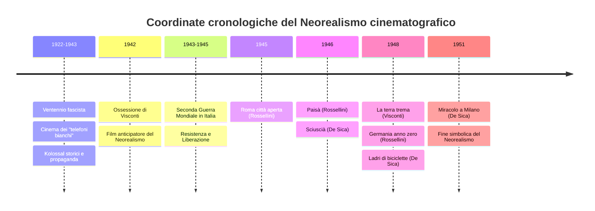
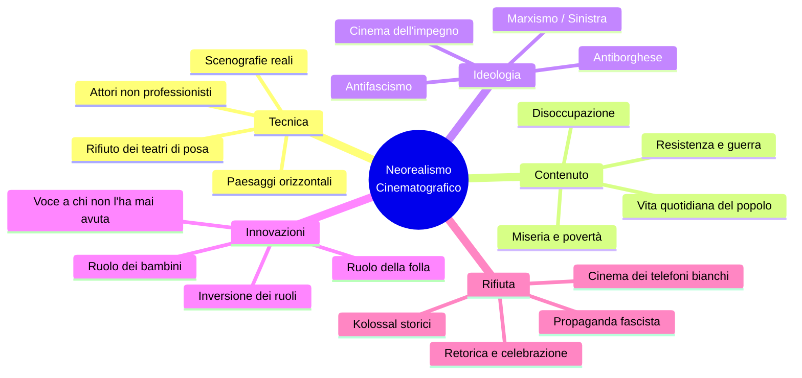
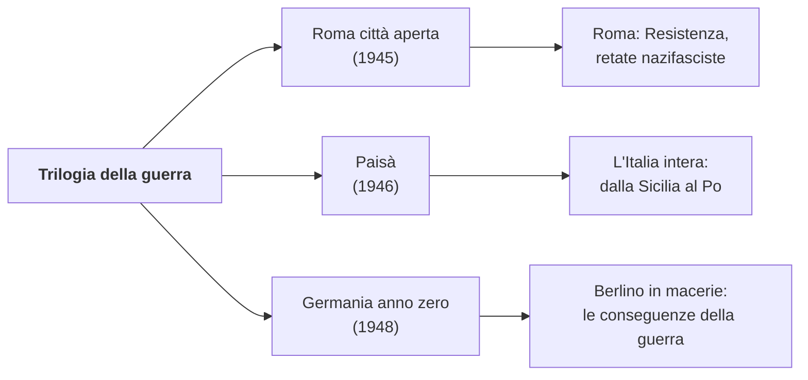
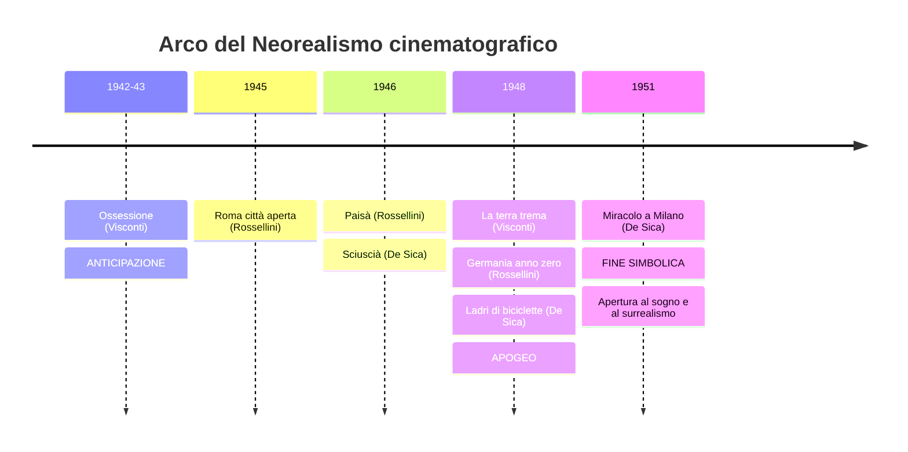
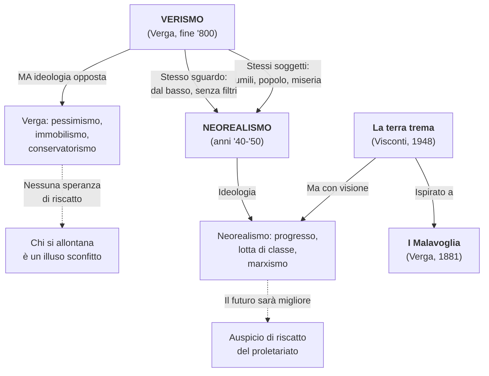
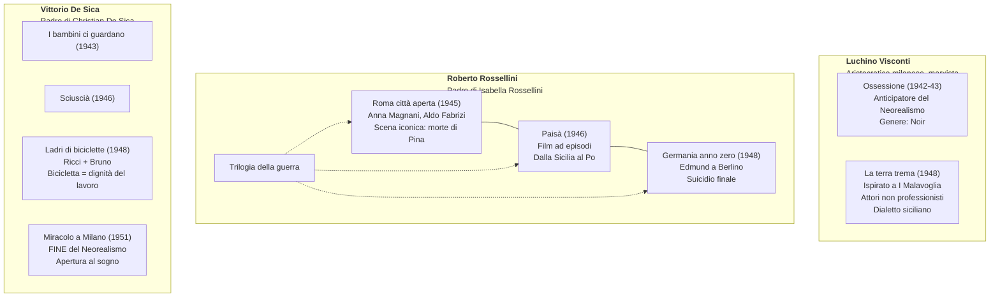
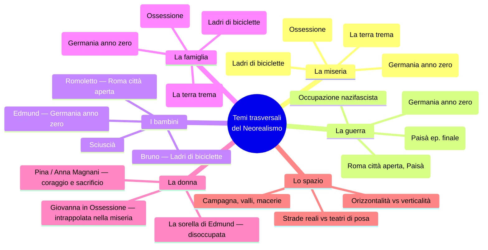
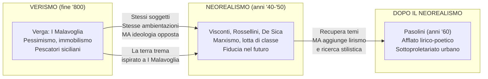

# MEGA-SCHEMA: Il Neorealismo Cinematografico

> **Schema di studio esaustivo per l'esame di Italiano**
> Basato sulle lezioni della prof.ssa Liliana — A.S. 2025-2026

---

## Indice

1. [Definizione e coordinate storiche](#1-definizione-e-coordinate-storiche)
2. [Il contesto: dal Fascismo alla Liberazione](#2-il-contesto-dal-fascismo-alla-liberazione)
3. [Cinema fascista vs. cinema neorealista](#3-cinema-fascista-vs-cinema-neorealista)
4. [I caratteri generali del Neorealismo](#4-i-caratteri-generali-del-neorealismo)
5. [I tre grandi registi](#5-i-tre-grandi-registi)
6. [Luchino Visconti](#6-luchino-visconti)
7. [Roberto Rossellini](#7-roberto-rossellini)
8. [Vittorio De Sica](#8-vittorio-de-sica)
9. [La fine del Neorealismo cinematografico](#9-la-fine-del-neorealismo-cinematografico)
10. [Il rapporto Verismo → Neorealismo](#10-il-rapporto-verismo--neorealismo)
11. [Pasolini e il Neorealismo](#11-pasolini-e-il-neorealismo)
12. [Calvino e il Neorealismo (cenni dalla Prefazione 1964)](#12-calvino-e-il-neorealismo-cenni-dalla-prefazione-1964)
13. [Q&A dalle interrogazioni orali](#13-qa-dalle-interrogazioni-orali)
14. [Date fondamentali](#14-date-fondamentali)
15. [Citazioni da memorizzare](#15-citazioni-da-memorizzare)
16. [Lacune e materiale mancante](#16-lacune-e-materiale-mancante)
17. [Mappe concettuali (Mermaid)](#17-mappe-concettuali-mermaid)

---

## 1. Definizione e coordinate storiche

Il **Neorealismo** è una corrente **prima di tutto cinematografica**, poi letteraria, che si sviluppa in Italia **tra gli anni '40 e '50** del Novecento — cioè durante il Fascismo, la Seconda Guerra Mondiale e il primo dopoguerra.

> *«Il primo atto di coscienza critica, dal punto di vista politico e ideologico, che l'Italia ha avuto di se stessa.»*
> — **Pier Paolo Pasolini**, in un'intervista televisiva

Il Neorealismo si propone di mostrare **la realtà così com'è**, senza filtri, senza abbellimenti, riducendo al minimo la finzione.

### Perché "neo"-realismo?

Significa un **nuovo sguardo sul mondo** che veicola una certa **morale** e una certa **ideologia** che rifiutano quelle del totalitarismo nazifascista. Non è un semplice ritorno al realismo ottocentesco, ma un'operazione culturale nuova che nasce dall'urgenza storica della guerra e della Resistenza.

---

## 2. Il contesto: dal Fascismo alla Liberazione

La prof. dedica tempo a delineare il quadro storico perché è **imprescindibile** per capire il Neorealismo.

### Gli eventi chiave (anni '20–'50)

| Periodo | Evento |
|---------|--------|
| 1922–1943 | **Dittatura fascista** |
| 1940–1945 | **Seconda Guerra Mondiale** |
| 1943–1945 | **Resistenza** (partigiani + Alleati anglo-americani contro il nazifascismo) |
| 4 dicembre 1944 | Liberazione di **Ravenna** |
| 10 aprile 1945 | Liberazione di **Alfonsine** (ultimo baluardo sul fiume Senio, tra le fasi più cruente) |
| **25 aprile 1945** | **Liberazione dell'Italia** — festa nazionale |

### L'Italia prima e dopo

La prof. insiste su questo punto: il fascismo ha dato di sé un'immagine di **Italia prospera, forte, virile, trionfale** (parate della gioventù fascista, inaugurazioni, bonifiche). In realtà, ha portato l'Italia alla **povertà, alla miseria, alla fame, alla distruzione materiale e morale**.

> **Nota della prof.:** *«L'Italia fino a quel punto aveva avuto una storia non unitaria, non una storia di una nazione, ma storie di un insieme di piccoli popoli. Gli ultimi vent'anni poi erano una storia fascista, cioè una storia di un'unità aberrante. Soltanto con la Resistenza è cominciata la storia italiana.»* — Pasolini, dalla stessa intervista proiettata in classe.

### La Resistenza nella nostra zona

La prof. fa riferimenti molto precisi al territorio ravennate:
- **Valli di Comacchio** e **Pialassa**: teatro della Resistenza
- **Isola degli Spinaroni**: da lì partì la liberazione di Ravenna col comandante **Bulow (Arrigo Boldrini)**
- La zona si raggiunge percorrendo la Baiona verso Porto Corsini
- **Alfonsine** fu una delle ultime località ad essere liberata; le fasi finali furono le più **cruente**
- Esiste tuttora il **Museo della Resistenza** ad Alfonsine

> **Aneddoto personale della prof.:** Ha fatto ascoltare alla classe la **testimonianza audio** di una partigiana/staffetta romagnola, registrata circa otto anni prima, che racconta in prima persona: le consegne in bicicletta, le pistole nascoste sotto il riso, l'incontro con un uomo travestito da donna sull'argine del Reno, i bombardamenti di Pippo, le mine che uccisero suo padre (42 anni) e suo fratello (19 anni), e il rapporto con il regista Montaldo durante le riprese de *L'Agnese va a morire*.

---

## 3. Cinema fascista vs. cinema neorealista

Uno dei punti su cui la prof. insiste maggiormente è il **contrasto radicale** tra il cinema del Ventennio e quello neorealista.

| Aspetto | Cinema fascista | Cinema neorealista |
|---------|----------------|-------------------|
| **Scopo** | Propaganda, evasione | Denuncia, impegno civile |
| **Immagine dell'Italia** | Prospera, trionfale, fasulla | Misera, distrutta, autentica |
| **Luoghi** | Teatri di posa, studi di Cinecittà | Strade, paesi, scenografie reali |
| **Soggetti** | Eroi, comandanti, kolossal storici (es. *Scipione l'Africano*, *Cleopatra*) | Disoccupati, pescatori, bambini, la folla |
| **Attori** | Professionisti | Spesso **non professionisti** |
| **Paesaggi** | **Verticalità** (templi, obelischi, colonne) | **Orizzontalità** (strade, campagne, valli) |
| **Tono** | Celebrativo, retorico | Documentaristico, scarno |
| **Generi** | Kolossal storici, "telefoni bianchi" | Dramma sociale, cinema d'impegno |
| **Finanziamenti** | Statali (Cinecittà, Istituto Luce) | Spesso a spese dei registi stessi |

### L'Istituto Luce e Cinecittà

La prof. nota (con la precisazione *«lungi da me voler fare il panegirico di Mussolini»*) che Mussolini fu il fondatore dell'**Istituto Luce** e di **Cinecittà**, contribuendo all'industria cinematografica italiana, ma **per scopi propagandistici**. I cinegiornali mostravano *«un'Italia prospera, fatta di parate, di celebrazioni, di inaugurazioni, di bonifiche, della gioventù fascista tutta agghindata con le divise»*.

### I "telefoni bianchi"

Il cinema dei **telefoni bianchi** era quello **disimpegnato, sentimentale, d'evasione**: *«una bella signora di un salotto borghese, con le unghie laccate, alzava la cornetta del telefono e intratteneva lunghe conversazioni col suo amato»*. Il Neorealismo **rifiuta** radicalmente questo tipo di cinema.

---

## 4. I caratteri generali del Neorealismo

### I principi fondamentali

1. **Attori non professionisti**, presi dalla strada, che interpretano se stessi
2. **Scenografie reali**: il regista esce dagli studi e gira in esterno, nei luoghi reali — **rifiuto dei teatri di posa**
3. **Inversione dei ruoli tradizionali**:
   - Il ruolo della **folla** e della **massa** diventa privilegiato (vs. gli eroi individuali del cinema fascista)
   - Il ruolo dei **bambini** è centrale: spesso si caricano delle responsabilità e del buon senso che manca agli adulti
4. **Paesaggi orizzontali**: domina l'orizzontalità (strade, campagne, valli), in contrasto con la verticalità del cinema fascista
5. **Cinema dell'impegno**: rifiuta il cinema d'evasione; porta in luce ciò che non deve rimanere nascosto — miseria, disoccupazione, violenze della guerra, denuncia dell'antifascismo
6. **Voce a chi non l'ha mai avuta**: i protagonisti sono coloro che nella storia e nella gestione sociale non avevano mai avuto voce — pescatori, disoccupati, bambini, donne
7. **Visione documentaria della realtà**: i film rimangono quanto più possibile aderenti alla realtà così com'è, senza filtri e senza abbellimenti

### L'ideologia

I registi neorealisti sono **tutti di sinistra**: marxisti, d'ispirazione gramsciana. Il Neorealismo si manifesta come:

- Lotta **contro la guerra**
- Lotta **contro il disordine e l'ingiustizia sociale**
- Lotta **contro il fascismo**
- Lotta **contro la corruzione e l'immoralità**

È un cinema **antiborghese**, al servizio degli **umili e degli oppressi**.

> **Parole di Pasolini** (proiettato in classe): *«Quasi tutte le opere neorealistiche si fondano sull'idea che il futuro sarà migliore. Sarà migliore in quanto ci sarà addirittura una rivoluzione che non si sa quale fosse poi...»*

Il Neorealismo **rifiuta** l'immagine fasulla, trionfale dell'Italia celebrata dal fascismo. Come dice la prof.: *«Il fascismo ha portato l'Italia alla povertà, alla miseria, alla fame.»*

---

## 5. I tre grandi registi

> **Da ricordare** (parole della prof.): *«Per quanto riguarda il cinema, i nomi che vorrei ricordaste sono tre: Visconti, De Sica e Roberto Rossellini.»*

| Regista | Dati biografici | Film neorealisti principali | Cifra distintiva |
|---------|----------------|----------------------------|-------------------|
| **Luchino Visconti** | Famiglia aristocratica milanese, uomo di sinistra | *Ossessione* (1942–43), *La terra trema* (1948) | Ispirazione marxista, lotta di classe, opera culturale tra Verga e impegno politico |
| **Roberto Rossellini** | Padre di Isabella Rossellini, marito di Ingrid Bergman | *Roma città aperta* (1945), *Paisà* (1946), *Germania anno zero* (1948) | Trilogia della guerra, visione documentaria |
| **Vittorio De Sica** | Attore e regista, padre di Christian De Sica | *I bambini ci guardano* (1943), *Sciuscià* (1946), *Ladri di biciclette* (1948), *Miracolo a Milano* (1951) | Attenzione ai bambini, umanesimo |

> **Nota della prof. su Rossellini:** *«Non so se avete presente Isabella Rossellini, attrice, è stata moglie di David Lynch, che è morto l'anno scorso... era il padre di Isabella Rossellini e marito di Ingrid Bergman, che è stata una delle attrici di culto, una delle donne più belle del cinema mondiale di tutti i tempi.»*

> **Nota della prof. su De Sica:** *«Vittorio De Sica, il padre di Christian De Sica. Christian De Sica ha fatto più i cinepanettoni, invece suo padre è stato attore ma soprattutto regista che ha fatto la storia del cinema italiano non solo in Italia ma in tutto il mondo. Quel momento lì della storia del cinema italiano è stata quella che ha fatto da apripista a tantissimi registi americani: Spielberg, Scorsese...»*

---

## 6. Luchino Visconti

### 6.1. *Ossessione* (1942–43) — L'anticipatore del Neorealismo

| Elemento | Dettaglio |
|----------|-----------|
| **Titolo** | *Ossessione* |
| **Regista** | Luchino Visconti |
| **Anno** | 1942–43 (girato nel pieno della Seconda Guerra Mondiale) |
| **Genere** | **Noir** |
| **Fonte letteraria** | *Il postino suona sempre due volte*, romanzo americano |
| **Attori** | **Clara Calamai** e **Massimo Girotti** (professionisti) |
| **Primo titolo pensato** | **Palude** |

#### La trama

Una **donna sposata** (Giovanna) che gestisce un'osteria-stazione di rifornimento accanto al Po con il marito (**Bragana**), si innamora di un **vagabondo meccanico** (**Gino**). Intreccia con lui una relazione e insieme ordiscono e realizzano il piano di **uccidere il marito**.

#### Perché anticipa il Neorealismo?

La prof. pone esplicitamente la domanda (*«Cosa c'entra questa storia rispetto a quello che abbiamo detto?»*) e risponde così:

1. **Scenografie naturali**: Visconti non gira nei teatri di posa ma in esterno, lungo il Po, in un paesaggio **rurale, umile**, fatto di sentieri sterrati, strade che attraversano la campagna emiliana
2. **Orizzontalità dei paesaggi**: strade di campagna, il fiume, una vecchia dogana → paesaggi piatti, schiacciati verso il basso
3. **Italia misera e rassegnata**: pone come protagonista un'Italia povera, marginale — la miseria di chi vive in questi luoghi
4. **Rifiuto della demagogia fascista**: non nasconde la povertà e lo squallore

#### I personaggi come destrutturazione del fascismo

| Personaggio | Ruolo | Significato |
|-------------|-------|-------------|
| **Bragana** (il marito) | Personaggio apparentemente positivo, la vittima | Incarna il **perfetto uomo fascista**: maschilista, autoritario, grasso. Esprime la retorica della "maschia virilità italica" |
| **Giovanna** (la moglie) | Ha sposato Bragana per sfuggire alla miseria | Matrimonio senza amore, vita intrappolata |
| **Gino** (il vagabondo) | Meccanico errante, vive fuori dalle regole | Estraneo al sistema, spirito libero |

#### La ricezione scandalosa

- **Bloccato dopo pochissime proiezioni**
- Una sala cinematografica a **Salsomaggiore Terme** fu **esorcizzata con l'acqua santa** dopo la proiezione
- Nessun produttore volle finanziarlo → Visconti **lo produsse a sue spese**, vendendo gioielli di famiglia, cavalli, scuderie
- Fu **dissacratorio** del sacro valore della **famiglia** (uno dei pilastri del fascismo) e della staticità del regime

> **Parole della prof.:** *«Quindi Ossessione, per l'epoca, fu un film altamente provocatorio e dissacratorio. Dissacratorio del sacro valore della famiglia, su cui si poggia proprio il fascismo, dissacratorio della staticità del fascismo, rispetto all'immagine di un'Italia fasulla, non autentica.»*

#### Analisi delle scene viste in classe

La prof. ha proiettato le **scene iniziali**. Elementi notati:

- Il canto lirico *«E lucean le stelle»* in sottofondo (Tosca di Puccini)
- L'arrivo di Gino affamato, senza soldi → il marito lo vuole cacciare (*«Facce da galera! Maledetti vagabondi!»*), poi cede
- L'ammiccamento immediato tra Giovanna e Gino
- La povertà degli interni, la bassa padana polverosa
- Il linguaggio popolare con inflessioni dialettali
- La centralità degli **spazi reali**: non la Ferrara rinascimentale dei monumenti, ma le realtà marginali — *«stradine lungo il Po, sterrate, polverose, una vecchia dogana»*

---

### 6.2. *La terra trema* (1948) — Verga al cinema

| Elemento | Dettaglio |
|----------|-----------|
| **Titolo** | *La terra trema* |
| **Regista** | Luchino Visconti |
| **Anno** | 1948 |
| **Ispirazione** | *I Malavoglia* di Giovanni Verga |
| **Attori** | **Non professionisti** — i pescatori di Aci Trezza interpretano se stessi |
| **Lingua** | I personaggi **parlano la loro lingua**: dialetto siciliano stretto |

#### La trama

La vicenda è quella della **famiglia Valastro** e degli scontri tra i **pescatori** e i **grossisti del pesce**. I pescatori lavorano ore e ore in mare, portano le reti piene di pesce ai grossisti e ricevono in cambio un denaro miseramente scarso. Visconti parla di questa **ingiustizia sociale**.

#### L'operazione culturale di Visconti

La prof. pone due domande fondamentali:

1. **Il punto di vista di Visconti è lo stesso di Verga o è diverso?**
2. **A quali principi si ispira Visconti?**

La risposta è cruciale:

| Aspetto | Verga (*I Malavoglia*, 1881) | Visconti (*La terra trema*, 1948) |
|---------|-------------------------------|-------------------------------------|
| **Ideologia** | Conservatrice, antistoricistica | **Progressista**, marxista |
| **Visione** | Pessimismo, immobilismo | Auspicio di **riscatto del proletariato** |
| **Posizione** | Lo scrittore non interviene, non giudica | Il regista denuncia lo **sfruttamento**, prende posizione |
| **Modello** | Determinismo di Taine | **Marxismo**, ispirazione gramsciana |
| **Speranza** | Nessuna: chi tenta di mutare stato è un illuso | **Lotta di classe** per un futuro migliore |

> **Parole della prof.:** *«Visconti recupera quell'ambiente, quelle situazioni, cala la vicenda all'interno delle lotte tra pescatori e grossisti, e sta parlando — recuperando un romanzo dell'Ottocento — del suo tempo. E sta mettendo in campo la sua visione del mondo, che auspica un riscatto del proletariato attraverso la lotta di classe.»*

#### Le didascalie iniziali del film

Il film si apre con queste parole:

> *«I fatti rappresentati in questo film accadono in Italia, dove uomini sfruttano altri uomini.»*

E poi:

> *«La lingua italiana non è in Sicilia la lingua dei poveri.»*

Queste dichiarazioni programmatiche collocano subito il film in un orizzonte di **denuncia sociale**.

#### Elementi verghiani nel film

La prof. ha letto l'**incipit de I Malavoglia** in parallelo col film, evidenziando i richiami:

- *«Li avevano sempre conosciuti per Malavoglia, di padre in figlio»* → il concetto dell'**immobilità**
- *«Avevano sempre avuto delle barche sull'acqua e delle tegole al sole»* → pescatori e piccoli proprietari
- Le barche ormeggiate (viste nel film di Visconti)
- L'espressione proverbiale di Padron 'Ntoni: *«Per menare il remo bisogna che le cinque dita s'aiutino l'un l'altro»* → la **religione della famiglia**

#### Nota personale della prof. su Aci Trezza

> *«Se ci andate ad Aci Trezza... il mare è d'argento la sera sotto la luna e poi ci sono quei faraglioni... è un paesaggio incredibile. È ancora riconoscibile la chiesa, la struttura del paese così com'era in Visconti. Io mi sono emozionata quando ci sono andata. Il paesaggio è mozzafiato.»*

---

## 7. Roberto Rossellini

### La Trilogia della guerra

Rossellini realizza tre film che offrono una **visione documentaria della realtà**: rimangono quanto più possibile aderenti alla realtà così com'è.

---

### 7.1. *Roma città aperta* (1945)

| Elemento | Dettaglio |
|----------|-----------|
| **Anno** | 1945 (ultimo anno della Seconda Guerra Mondiale) |
| **Attori professionisti** | **Anna Magnani** (Pina) e **Aldo Fabrizi** (Don Pietro) |
| **Ambientazione** | Le strade di Roma, luoghi reali |

#### La trama

Rossellini scende con la macchina da presa in strada, per le vie di Roma, e racconta la storia di **Pina** (Anna Magnani), nel giorno in cui deve sposare **Francesco**, un ideologo della Resistenza (marxista/comunista). Ma quel giorno viene fatta una **retata**: Francesco viene portato via e Pina viene **uccisa da un colpo di fucile** dei nazifascisti mentre corre per inseguire la camionetta.

#### Il sacerdote antifascista

Don Pietro è un sacerdote che partecipa alla Resistenza e che farà **sacrificio di sé** per la difesa dei propri ideali. Il figlio piccolo di Pina, Romoletto, assiste alla morte della madre ed è confortato dal prete.

#### Il messaggio politico

Rossellini mostra che l'**antifascismo fu un fenomeno trasversale** che superò le divisioni ideologiche. Nel film:

- **Francesco** = marxista/comunista
- **Don Pietro** = sacerdote cattolico antifascista

Al **Comitato di Liberazione Nazionale** parteciparono comunisti, cattolici, repubblicani — tutte le forze politiche.

#### La scena paradigmatica — la morte di Pina

> **Parole della prof.:** *«C'è qualcuno che la conosce o non la conoscete nessuno? Meno male. È una delle scene più iconiche del cinema italiano di tutti i tempi. Chi si dica appassionato di cinema, se non conosce questa, almeno questa, non conosce niente.»*

La scena è **paradigmatica di tutto il Neorealismo** perché contiene:

| Elemento neorealista | Nella scena |
|---------------------|-------------|
| Coraggio di una donna del popolo | Pina si oppone al regime e ne diventa vittima |
| Luoghi reali | Le strade di Roma |
| Comparse reali | I cittadini romani addossati ai muri erano persone che avevano **vissuto l'occupazione** fino a pochi mesi prima |
| Improvvisazione | **La caduta di Anna Magnani non era prevista** — avvenne casualmente e il regista decise di tenerla |
| Il ruolo del bambino | Romoletto corre verso la madre morta |

> **Nota della prof.:** *«Queste persone che parteciparono al film come comparse rilasciarono delle dichiarazioni e dissero di essere rimaste molto turbate dal fatto di dover impersonare un ruolo che in realtà avevano vissuto in prima persona fino a pochi mesi prima.»*

#### Battute significative (dal film proiettato in classe)

> *«Lottiamo per una cosa che deve venire, che non può non venire. Forse la strada sarà un po' lunga e difficile, ma arriveremo, e lo vedremo un mondo migliore!»*

---

### 7.2. *Paisà* (1946)

| Elemento | Dettaglio |
|----------|-----------|
| **Anno** | 1946 |
| **Struttura** | Film **ad episodi** |
| **Significato del titolo** | *Paisà* = appellativo con cui i soldati, soprattutto del sud, si chiamavano tra loro: "paesano", "compaesano" |
| **Tema conduttore** | La guerra, la miseria, la povertà, le condizioni di vita degli italiani |
| **Percorso** | Dalla **Sicilia** fino al **Po** — un mosaico dell'Italia in guerra |

#### L'episodio "Inverno 1944" (l'ultimo episodio)

L'episodio è ambientato nelle **Valli di Comacchio** e lungo il **Po** — una zona vicinissima a Ravenna. Racconta la Resistenza nella fase **conclusiva e più cruenta** della guerra.

**Perché è significativo:**
- Mostra la Resistenza in un **paesaggio atipico**: solitamente la lotta partigiana è associata alla montagna e alla collina, mentre qui siamo in un paesaggio **piatto, esposto**, quello delle valli
- Mostra le **difficoltà** dei partigiani: poco armati, male armati, sprovvisti di viveri
- Mostra la **collaborazione** tra partigiani italiani e soldati americani dell'OSS
- Mostra la **rappresaglia** e la **vendetta** nazifascista

**La voce fuori campo del film:**

> *«Al di là delle linee, partigiani italiani e soldati americani dell'OSS, fraternamente uniti, combattono una battaglia di ogni giorno, una delle più dure e difficili di tutta la campagna d'Italia...»*

**Il finale:**

> *«L'inverno del 1944. All'inizio della primavera, la guerra era finita.»*

#### Il collegamento con *L'Agnese va a morire*

La prof. segnala un collegamento importante: questo episodio sarà il **modello** a cui si ispirerà negli anni '70 il regista **Giuliano Montaldo** per la realizzazione del film *L'Agnese va a morire*, tratto dal romanzo neorealista di **Renata Viganò**. Il collegamento dimostra come il Neorealismo abbia creato un linguaggio cinematografico che ha influenzato le generazioni successive.

> **Nota della prof.:** Montaldo ha ricevuto la **cittadinanza onoraria di Alfonsine**.

---

### 7.3. *Germania anno zero* (1948)

| Elemento | Dettaglio |
|----------|-----------|
| **Anno** | 1948 |
| **Ambientazione** | **Berlino in macerie** — le rovine sono **reali** |
| **Protagonista** | **Edmund**, un ragazzino |

> **⚠️ NOTA**: La lezione del 13-01-26 **non ha trascrizione audio**. Le informazioni su questo film provengono dagli appunti manuali (schema.md) e dal mega-schema precedente. Potrebbero esserci dettagli mancanti.

#### La situazione familiare di Edmund

| Membro | Condizione |
|--------|-----------|
| **Edmund** | Ragazzino, protagonista |
| **Padre** | Invalido e malato |
| **Fratello** | Disertore (deve nascondersi) |
| **Sorella** | Disoccupata |

#### La trama

Il film si apre con Edmund che **scava fosse per i morti** in cambio di una paga misera. La Berlino presentata è **reale**: Rossellini gira tra le rovine autentiche della città distrutta.

**L'incontro fatale col maestro**: Edmund incontra un **ex maestro delle scuole elementari**, presentato in modo **sinistro** (probabilmente un pedofilo). Quando Edmund gli confida le difficoltà di mantenere il padre invalido, il maestro gli ripete l'**ideologia nazista**: la **legge del più forte** applicata alla società.

Edmund interpreta queste parole come un consiglio ad **avvelenare il padre** — cosa che effettivamente compie. Ma quando confessa l'accaduto al maestro, questi lo **allontana con disgusto**, rinnegando ogni responsabilità.

#### Il finale tragico: il suicidio di Edmund

Rifiutato da tutti, Edmund **vaga per le strade** di Berlino. La macchina da presa **segue il suo peregrinare** tra le macerie.

| Scena | Dettaglio |
|-------|-----------|
| Tentativo di giocare | Edmund cerca di aggregarsi a dei bambini che giocano, ma **fallisce** |
| L'organista | Un organista suona in cima a una chiesa bombardata — forse un simbolo di **salvezza irraggiungibile** |
| La chiamata della sorella | La sorella chiama Edmund, mentre il cadavere del padre viene portato via dal carro funebre |
| Il suicidio | Edmund si **getta da un edificio in rovina** |

#### Lo stile

| Elemento | Descrizione |
|----------|-------------|
| **Visuale** | Primi piani e **chiaroscuri** molto intensi |
| **Movimento** | La macchina da presa segue il "peregrinare" del protagonista |
| **Finale** | **Sobrio**, presentato senza alcun espediente narrativo drammatico |

#### Il significato

Il film mostra come l'**ideologia nazista** continui a fare vittime anche dopo la fine della guerra. Edmund è vittima di adulti corrotti che lo manipolano e poi lo abbandonano. La sua morte rappresenta la **fine dell'innocenza** in una Germania devastata non solo materialmente ma anche moralmente.

---

## 8. Vittorio De Sica

### Il tratto distintivo: l'attenzione ai bambini

Un elemento ricorrente nel cinema di De Sica è il **ruolo centrale dei bambini**, che osservano e imitano gli adulti, e che spesso si caricano delle responsabilità e del buon senso che manca proprio agli adulti.

| Film | Anno | Tema |
|------|------|------|
| ***I bambini ci guardano*** | 1943 | Bambino testimone della crisi matrimoniale dei genitori |
| ***Sciuscià*** | 1946 | Due ragazzini lustrascarpe finiti in riformatorio |
| ***Ladri di biciclette*** | 1948 | Rapporto padre-figlio nella Roma della miseria |
| ***Miracolo a Milano*** | 1951 | Favola sociale con elementi fiabeschi |

---

### 8.1. *Ladri di biciclette* (1948)

| Elemento | Dettaglio |
|----------|-----------|
| **Anno** | 1948 |
| **Attori** | **Non professionisti** |
| **Protagonisti** | **Antonio Ricci** (disoccupato) e il figlio **Bruno** |
| **Ambientazione** | Quartieri popolari di Roma |

> **⚠️ NOTA**: Le informazioni dettagliate su questo film provengono in parte dalla lezione del 13-01-26 (senza trascrizione), quindi potrebbero mancare osservazioni della prof.

#### La trama — scena per scena

**1. L'ufficio di collocamento**: Ricci, un **disoccupato**, ottiene finalmente un lavoro come **attacchino di manifesti cinematografici** lungo le strade di Roma — un lavoro comunale.

**2. La bicicletta**: Per svolgere il lavoro gli serve una bicicletta. La moglie impegna le **lenzuola** al Monte di Pietà per riscattarla. La scena mostra **cataste enormi** di sacchi con la roba data in pegno dalla gente povera — perché la gente era praticamente costretta a farlo per tirare avanti.

> **Dettaglio dagli appunti**: Anche il figlioletto Bruno lavora: fa il **benzinaio**. L'acqua probabilmente era razionata (il pozzo è circondato da filo spinato). Gli uffici hanno degli sportellini per parlare con la gente.

**3. Il furto**: Proprio il **primo giorno di lavoro**, la bicicletta viene **rubata** da un giovane bullo mentre Ricci sta appendendo un manifesto.

**4. Il pellegrinaggio**: Inizia un **pellegrinaggio** (la prof. usa proprio questa parola) tra i quartieri popolari di Roma, padre e figlio insieme, alla disperata ricerca della bicicletta.

**5. L'inversione dei ruoli**: Durante la ricerca, Bruno (il bambino) dimostra spesso più **buon senso** e maturità del padre. È lui a trattenere il padre dalla disperazione — rappresenta la dignità che il padre rischia di perdere.

**6. Il furto di Ricci**: Verso la fine, non avendo trovato la bicicletta, Ricci si trova **costretto a cercar di rubarne un'altra**. Viene scoperto e quasi **linciato** dalla folla.

**7. Il pianto di Bruno**: Si salva solo per l'intervento del piccolo Bruno che piange per l'**umiliazione del padre**. Il proprietario lo lascia andare vedendo il bambino in lacrime.

**8. Il finale**: Padre e figlio camminano **mano nella mano**, confusi nella folla.

> **Parole della prof.:** *«A volte Ladri di biciclette ha anche i toni della commedia, ma soprattutto quelli della tragedia, del dramma. Che poi ha una conclusione molto poetica.»*

> **Dall'interrogazione di Diego (30-01-26):** *«Ladri di biciclette rappresenta la realtà dei quartieri popolari di Roma e una realtà sotto una profonda depressione, come i molti disoccupati che vivono in condizioni misere e sono costretti a impegnare le proprie cose solo per svolgere un lavoro, come la bicicletta, che non era soltanto un bene di svago.»*

#### Il significato

La **bicicletta** diventa simbolo della **dignità del lavoro** e della **sopravvivenza economica**. Il furto trasforma la vittima in carnefice, mostrando come la **miseria degradi l'uomo**. La vicenda del disoccupato assume una **valenza universale**: quella di un uomo che cerca di uscire da una condizione di miseria e che sembra condannato al fallimento.

Il finale, pur amaro, è **un poco speranzoso** (come dicono gli appunti): padre e figlio si tengono per mano.

---

## 9. La fine del Neorealismo cinematografico

### *Miracolo a Milano* (1951) di De Sica

| Elemento | Dettaglio |
|----------|-----------|
| **Anno** | 1951 |
| **Regista** | Vittorio De Sica |
| **Genere** | Commedia fantastica / Favola sociale |

*Miracolo a Milano* è considerato simbolicamente la **conclusione del Neorealismo cinematografico** in senso stretto.

**Perché segna la fine?** Nel finale del film compare un'apertura al **sogno**, alla **fantasia**, al **surrealismo**:

- I protagonisti (dei poveri radunati in Piazza Duomo a Milano) **volano via su scope magiche** verso un mondo migliore, *«dove ogni giorno sia davvero un buon giorno»*
- Intervengono elementi **fiabeschi**, **onirici** e **miracolosi**
- Questa apertura alla fantasia **rompe il patto neorealista** con la realtà "nuda e schietta"

> **Parole della prof. (lezione 22-01-26):** *«Ossessione del '42 può essere considerato il film che anticipa il movimento, mentre Miracolo a Milano, con quell'apertura al sogno, al surrealismo, può essere considerato simbolicamente la conclusione.»*

### I confini cronologici

| Estremo | Film | Anno |
|---------|------|------|
| **Inizio** (anticipazione) | *Ossessione* di Visconti | 1942–43 |
| **Fine simbolica** | *Miracolo a Milano* di De Sica | 1951 |
| **Durata** | Circa **un decennio** | |

Il Neorealismo in senso **stretto** dura un decennio. In senso **lato** (più ampio), molti film successivi proseguono idealmente su questo filone.

---

## 10. Il rapporto Verismo → Neorealismo

La prof. costruisce esplicitamente un **ponte** tra Verismo e Neorealismo, che è il filo conduttore di tutto il programma.

### Le affinità

| Aspetto | Verismo (Verga) | Neorealismo |
|---------|-----------------|-------------|
| **Protagonisti** | Pescatori, contadini, umili | Disoccupati, poveri, bambini, folla |
| **Ambientazione** | Aci Trezza, Sicilia rurale | Strade di Roma, Berlino in macerie, valli di Comacchio |
| **Sguardo** | Dal basso, sulla realtà popolare | Dal basso, sulla realtà popolare |
| **Lingua** | Italiano che ricalca il dialetto | Dialetto puro (*La terra trema*) o italiano popolare |
| **Tecnica** | Impersonalità, eclissi del narratore | Visione documentaria, assenza di filtri |
| **Rifiuto** | Della letteratura romantica e idealizzante | Del cinema fascista e d'evasione |

### Le differenze fondamentali

| Aspetto | Verismo | Neorealismo |
|---------|---------|-------------|
| **Ideologia** | Conservatrice, antistoricistica | **Progressista**, marxista |
| **Visione della storia** | Pessimismo, **immobilismo** — chi tenta di mutare stato è un illuso | Fiducia nel futuro, auspicio di **lotta di classe** |
| **Posizione dell'autore** | Non interviene, non giudica | Denuncia, prende posizione |
| **Speranza** | Nessuna | *«Il futuro sarà migliore»* (Pasolini su) |

> **Schema fondamentale**: Verga rappresenta la stessa realtà popolare del Neorealismo, ma con una visione opposta. Visconti recupera *I Malavoglia* ma li reinterpreta in chiave marxista.

---

## 11. Pasolini e il Neorealismo

### Il giudizio di Pasolini sul Neorealismo

La prof. ha proiettato in classe un'intervista a Pasolini in cui risponde alla domanda: *«Che cos'è per lei il Neorealismo?»*

> *«Ha rappresentato il primo atto di coscienza critica, dal punto di vista politico e ideologico, che l'Italia ha avuto di se stessa.»*
> 
> *«L'Italia fino a quel punto aveva avuto una storia non unitaria. Gli ultimi vent'anni poi erano una storia fascista, cioè una storia di un'unità aberrante. Soltanto con la Resistenza è cominciata la storia italiana.»*
> 
> *«Prima di tutto è la riscoperta dell'Italia. Il primo sguardo che l'Italia dà a se stessa senza veli retorici, senza falsità, col piacere di scoprire i difetti.»*
> 
> *«Quasi tutte le opere neorealistiche si fondano sull'idea che il futuro sarà migliore. Sarà migliore in quanto ci sarà addirittura una rivoluzione che non si sa quale fosse poi.»*

### Il rapporto di Pasolini col Neorealismo

| Aspetto | Dettaglio |
|---------|-----------|
| **Cosa recupera** | L'attenzione agli umili, agli emarginati, al sottoproletariato; gli attori non professionisti; la realtà senza filtri |
| **Cosa aggiunge** | Un **afflato lirico e poetico** che il Neorealismo in senso stretto non ha; una ricerca stilistica forte; l'accostamento di immagini di realtà squallida con musica classica |
| **Differenza fondamentale** | L'uso della musica e delle immagini in Pasolini ha un effetto diverso rispetto al cinema neorealista, dove gli orpelli/abbellimenti sono ridotti al minimo |
| **Cronologia** | Pasolini fa uscire il suo primo film (*Accattone*) nel **1961** — quasi vent'anni dopo l'inizio del Neorealismo |

> **Precisazione della prof.:** *«Pasolini riconosce il neorealismo come il primo atto dell'Italia di presa di coscienza della sua situazione. Sicuramente Pasolini molto recupera dal neorealismo, ma l'afflato lirico, poetico che troviamo in Pasolini è rifiutato dal neorealismo.»*

> **Nota sulla domanda di uno studente (18-12-25):** Uno studente chiede *«Come Pasolini nel Neorealismo?»*. La prof. risponde che Pasolini non è propriamente neorealista: c'è una ricerca stilistica che non è documentaristica come quella del Neorealismo. *«Lui vuole inventare un linguaggio, adotta il linguaggio delle immagini perché ritiene che sia più puro per rimanere aderente alla realtà.»*

---

## 12. Calvino e il Neorealismo (cenni dalla Prefazione 1964)

Nella lezione del 22-01-26 la prof. passa dal cinema alla letteratura neorealista, leggendo la **Prefazione del 1964** di Calvino al *Sentiero dei nidi di ragno*. Alcuni concetti fondamentali sulla **definizione** del Neorealismo emergono da questa prefazione:

> *«Il Neorealismo non fu una scuola.»* — Calvino

A differenza della Scuola Siciliana, dove tutti seguono canoni precisi, il Neorealismo letterario lascia ogni scrittore libero di esprimersi secondo la propria sensibilità.

> *«Un insieme di voci in gran parte periferiche, una molteplice scoperta delle diverse Italie, anche o specialmente delle Italie fino allora più inedite per la letteratura.»*

Calvino individua una **triade di modelli** per gli scrittori neorealisti:
1. ***I Malavoglia*** di **Verga**
2. ***Paesi tuoi*** di **Pavese** (1941)
3. ***Conversazione in Sicilia*** di **Elio Vittorini** (1941)

> **Nota**: Questi sono cenni relativi alla transizione dal cinema alla letteratura. Per il Neorealismo letterario (Calvino, Fenoglio, Pavese, Viganò) servirebbe un mega-schema separato.

---

## 13. Q&A dalle interrogazioni orali

### Interrogazione del 30-01-26

> **DOMANDA della prof. a Luca:** *«Quali sono le caratteristiche del Neorealismo cinematografico?»*

**Risposta valutata positivamente (8 e mezzo):**

Il Neorealismo cinematografico è una corrente che si sviluppa tra gli anni '40 e '50 del '900, a cavallo tra la fine della Seconda Guerra Mondiale e il dopoguerra. È un cinema **impegnato** che affronta i **problemi reali dell'Italia**, a differenza del cinema del totalitarismo fascista incentrato su kolossal storici, Cinecittà e lusso. Affronta i temi della guerra, della lotta antifascista e della Resistenza, ambientando le scene direttamente in strada.

---

> **DOMANDA della prof.:** *«Qual è il film considerato precursore del Neorealismo? Non ha temi che riguardano la guerra, non riguarda l'antifascismo, ma perché viene considerato l'anticipatore?»*

**Risposta (da Luca):**

*Ossessione* di Visconti (1942) è ambientato lungo il Po, in campagna, in un'osteria gestita da una coppia. Ha suscitato critiche dalla Chiesa perché ha **rotto il ruolo della famiglia tradizionale** (la moglie intreccia una relazione con Gino e insieme uccidono il marito). Cade il **mito della famiglia** — il film fa vedere le cose così come sono, senza idealizzazioni.

**Integrazione della prof.:** *«Non è che si distrae un po' di più. Intreccia una relazione diabolica che li conduce a fare che cosa? A uccidere il marito. Questo film è scandaloso perché cade il mito della famiglia.»*

---

> **DOMANDA della prof.:** *«L'ultimo episodio di Paisà di Rossellini, come lo inserisci nei canoni del Neorealismo?»*

**Risposta:**

Rappresenta la Resistenza nelle valli di Comacchio. Il film sembra quasi un **documentario** perché rappresenta come si svolgeva la Resistenza, le difficoltà e la miseria della guerra.

**Integrazione della prof.:** *«C'è un'apertura verso il cielo, un andamento verso il cielo, che vuole segnare l'inizio di una nuova epoca.»*

---

> **DOMANDA della prof. a Diego:** *«Qual è la storia raccontata da De Sica in Ladri di biciclette?»*

**Risposta (valutata tra il 7 e l'8):**

*Ladri di biciclette* di Vittorio De Sica, 1948. Il protagonista è Antonio Ricci, disoccupato, che trova lavoro come attacchino di manifesti cinematografici. Per svolgerlo necessita di una bicicletta, che compra dando in pegno le lenzuola della moglie. Viene rubata da un giovane bullo mentre appende un manifesto. Inizia un pellegrinaggio tra i quartieri popolari di Roma; alla fine cerca di rubarne un'altra, viene colto in flagrante e quasi linciato, e si salva per l'intervento del piccolo Bruno in lacrime.

**Integrazione della prof.:** *«Cosa voleva rappresentare De Sica? La realtà dei quartieri popolari, una realtà sotto una profonda depressione.»*

---

### Interrogazione del 03-03-26

> **DOMANDA della prof. a Cairidi:** *«Quali sono i riferimenti cronologici del Neorealismo cinematografico?»*

**Risposta (valutata 7-):**

Si colloca alla fine del periodo fascista in Italia, tra il '45 e il '50.

---

> **DOMANDA della prof.:** *«Qual è la volontà che accomuna tutti i registi del Neorealismo?»*

**Risposta:**

C'è una volontà di ribaltamento delle ideologie fasciste, un rifiuto dei film incentrati su eroi, comandanti, sulla "Grande Italia" — *«una cosa nulla e falsa perché l'Italia in realtà l'avevano ridotta alla miseria»*. Il Neorealismo pone al centro la **massa popolare**, le vicende dei più poveri. C'è l'utilizzo di attori non professionisti e un ribaltamento per cui anche i **bambini** diventano protagonisti (es. Edmund in *Germania anno zero*).

---

> **DOMANDA della prof.:** *«A quale film possiamo far risalire la fine del Neorealismo e perché?»*

**Risposta:**

*Miracolo a Milano* di De Sica. Nel finale compaiono tratti **fiabeschi** e **onirici**: in Piazza Duomo a Milano i poveri si librano in volo con delle scope verso un mondo migliore, dove ogni giorno sia davvero un buon giorno.

**Integrazione della prof.:** *«La novità risiede proprio in questo finale onirico, sognante, fiabesco, che rinuncia al neorealismo, cioè alla rappresentazione realistica della realtà.»*

---

## 14. Date fondamentali

| Anno | Evento |
|------|--------|
| **1881** | *I Malavoglia* di Verga (fonte di ispirazione per Visconti) |
| **1942–43** | ***Ossessione*** di Visconti — **anticipatore** del Neorealismo |
| **1943** | *I bambini ci guardano* di De Sica |
| **4 dic. 1944** | Liberazione di Ravenna |
| **10 apr. 1945** | Liberazione di Alfonsine |
| **25 apr. 1945** | **Liberazione dell'Italia** |
| **1945** | ***Roma città aperta*** di Rossellini |
| **1946** | ***Paisà*** di Rossellini / ***Sciuscià*** di De Sica |
| **1948** | ***La terra trema*** di Visconti |
| **1948** | ***Germania anno zero*** di Rossellini |
| **1948** | ***Ladri di biciclette*** di De Sica |
| **1951** | ***Miracolo a Milano*** di De Sica — **fine simbolica** del Neorealismo |
| **1961** | *Accattone* di Pasolini (primo film, non neorealista in senso stretto) |

---

## 15. Citazioni da memorizzare

1. **Pasolini sul Neorealismo:**
   > *«Il primo atto di coscienza critica, dal punto di vista politico e ideologico, che l'Italia ha avuto di se stessa.»*

2. **Pasolini sulla scoperta dell'Italia:**
   > *«Il primo sguardo che l'Italia dà a se stessa senza veli retorici, senza falsità, col piacere di scoprire i difetti.»*

3. **Pasolini sulla prospettiva marxista:**
   > *«Quasi tutte le opere neorealistiche si fondano sull'idea che il futuro sarà migliore.»*

4. **Didascalia iniziale de *La terra trema*:**
   > *«I fatti rappresentati in questo film accadono in Italia, dove uomini sfruttano altri uomini.»*

5. **Calvino (Prefazione 1964):**
   > *«Il Neorealismo non fu una scuola.»*

6. **Calvino:**
   > *«La rinata libertà di parlarci fu per la gente al principio smania di raccontare.»*

---

## 16. Lacune e materiale mancante

> **⚠️ ATTENZIONE**: Questa sezione segnala ciò che manca o è incompleto.

### Trascrizione mancante: lezione del 13-01-26

La lezione del 13 gennaio 2026 **non ha trascrizione audio**. Le informazioni su *Germania anno zero* e *Ladri di biciclette* provengono da:
- Appunti manuali (schema.md) — incompleti (la sorella di Edmund è indicata con "???")
- Il mega-schema precedente (APPUNTI-NATURALISMO-VERISMO-VERGA-MEGA.md)

**Possibili lacune:**
- Osservazioni personali della prof. durante la visione delle scene
- Dettagli sulle scene proiettate di *Germania anno zero* e *Ladri di biciclette*
- Commenti della prof. sugli sportellini degli uffici, sull'acqua razionata, sul Monte di Pietà
- Eventuali parallelismi o aneddoti non registrati

### Materiale assegnato dalla prof. ma non trattato in dettaglio

- **Scheda sulla *Terra Trema***: la prof. dice *«vi mando una scheda, un confronto tra il libro e il film»* (18-12-25) — non presente nelle trascrizioni
- **Analisi del film *Paisà***: *«Vi ho già mandato sul gruppo l'analisi del film da studiare»* (12-01-26) — non disponibile
- **Film *Ossessione* completo**: viste solo le scene iniziali in classe
- **Film *Roma città aperta* completo**: viste alcune scene
- La prof. menziona la volontà di far vedere più scene di *Ladri di biciclette* (*«adesso per adesso tenetelo lì che poi se riusciamo lo guardiamo qualcosa»*)

### Contenuti citati ma non spiegati in classe

- *Miracolo a Milano*: la prof. ne parla come **fine del Neorealismo** ma non dedica una lezione all'analisi del film
- Il rapporto tra *Ossessione* e il romanzo americano *Il postino suona sempre due volte*: la trama è solo accennata
- **Massimo Girotti**: la prof. dice *«lo ritroveremo in un altro film che adesso vi dico»* ma non specifica quale

---

## 17. Mappe concettuali (Mermaid)

### Mappa dei registi e dei film

### Temi trasversali nei film

### Il flusso dal Verismo al Neorealismo al Post-Neorealismo

---

> **Ultima nota**: Questo mega-schema copre esclusivamente il **Neorealismo cinematografico**. Per il Neorealismo **letterario** (Calvino, Fenoglio, Pavese, Viganò) e per Pasolini come autore sarebbe necessario un mega-schema dedicato. La lezione del 22-01-26 segna il **punto di passaggio** dal cinema alla letteratura (*«Adesso ragazzi proviamo ad andare un po' avanti e proviamo a parlare della letteratura neorealista»*).
