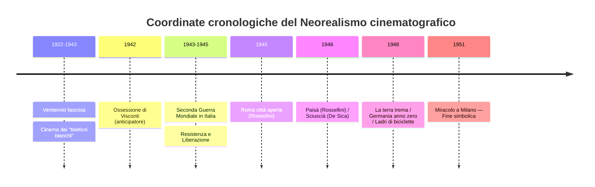
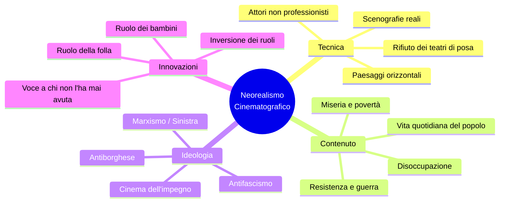
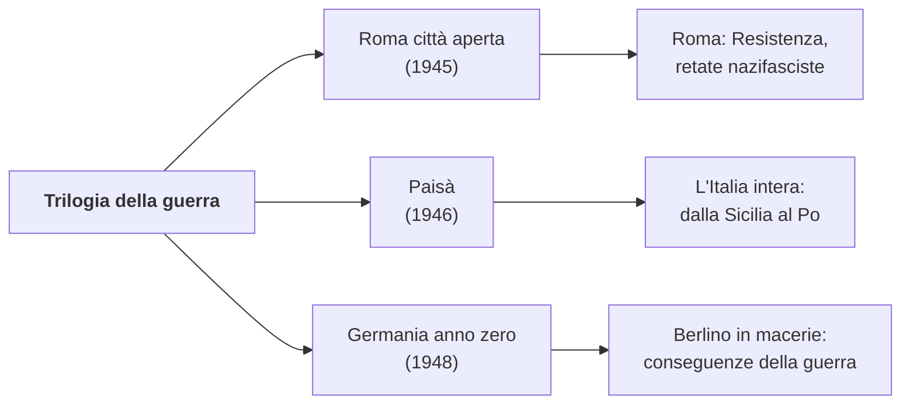
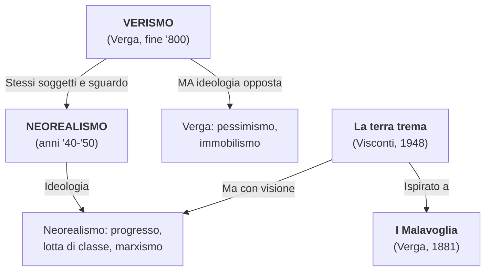

# RIASSUNTO: Il Neorealismo Cinematografico

> **Schema di studio condensato** — Lezioni della prof.ssa Liliana, A.S. 2025-2026

---

## 1. Definizione e coordinate storiche

Il **Neorealismo** è una corrente **prima di tutto cinematografica**, poi letteraria, sviluppatasi in Italia **tra gli anni '40 e '50** del Novecento — durante il Fascismo, la Seconda Guerra Mondiale e il primo dopoguerra.

> *«Il primo atto di coscienza critica, dal punto di vista politico e ideologico, che l'Italia ha avuto di se stessa.»* — **Pier Paolo Pasolini**, intervista televisiva proiettata in classe

Si propone di mostrare **la realtà così com'è**, senza filtri né abbellimenti, riducendo al minimo la finzione.

### Perché "neo"-realismo?

Significa un **nuovo sguardo sul mondo** che veicola una certa **morale** e una certa **ideologia** che rifiutano quelle del totalitarismo nazifascista. Non è un semplice ritorno al realismo ottocentesco, ma un'operazione culturale nuova che nasce dall'**urgenza storica** della guerra e della Resistenza.

---

## 2. Contesto storico: dal Fascismo alla Liberazione

La prof. dedica tempo a questo quadro storico perché è **imprescindibile** per capire il Neorealismo.

| Periodo | Evento |
|---------|--------|
| 1922–1943 | **Dittatura fascista** |
| 1940–1945 | **Seconda Guerra Mondiale** |
| 1943–1945 | **Resistenza** (partigiani + Alleati anglo-americani contro il nazifascismo) |
| 4 dic. 1944 | Liberazione di **Ravenna** |
| 10 apr. 1945 | Liberazione di **Alfonsine** (ultimo baluardo sul fiume Senio, tra le fasi più cruente) |
| **25 apr. 1945** | **Liberazione dell'Italia** — festa nazionale |

### L'Italia prima e dopo

Il fascismo diede di sé un'immagine di **Italia prospera, forte, virile, trionfale** (parate della gioventù fascista, inaugurazioni, bonifiche). In realtà, portò l'Italia alla **povertà, alla miseria, alla fame, alla distruzione materiale e morale**.

> Pasolini: *«L'Italia fino a quel punto aveva avuto una storia non unitaria, non una storia di una nazione, ma storie di un insieme di piccoli popoli. Gli ultimi vent'anni poi erano una storia fascista, cioè una storia di un'unità aberrante. Soltanto con la Resistenza è cominciata la storia italiana.»*

### La Resistenza nel ravennate

- **Valli di Comacchio** e **Pialassa**: teatro della Resistenza
- **Isola degli Spinaroni**: da lì partì la liberazione di Ravenna col comandante **Bulow (Arrigo Boldrini)**
- La zona si raggiunge percorrendo la Baiona verso Porto Corsini
- **Alfonsine**: tra le ultime località liberate; le fasi finali furono le più **cruente**
- Esiste tuttora il **Museo della Resistenza** ad Alfonsine

> **Aneddoto della prof.**: ha fatto ascoltare la testimonianza audio di una partigiana/staffetta romagnola che racconta le consegne in bicicletta, le pistole nascoste sotto il riso, i bombardamenti di Pippo, le mine che uccisero suo padre (42 anni) e suo fratello (19 anni), e il rapporto con il regista Montaldo durante le riprese de *L'Agnese va a morire*.

---

## 3. Cinema fascista vs. cinema neorealista

Uno dei punti su cui la prof. insiste di più è il **contrasto radicale** tra i due tipi di cinema.

| Aspetto | Cinema fascista | Cinema neorealista |
|---------|----------------|-------------------|
| **Scopo** | Propaganda, evasione | Denuncia, impegno civile |
| **Immagine dell'Italia** | Prospera, trionfale, fasulla | Misera, distrutta, autentica |
| **Luoghi** | Teatri di posa, studi di Cinecittà | Strade, paesi, scenografie reali |
| **Soggetti** | Eroi, comandanti, kolossal storici (es. *Scipione l'Africano*) | Disoccupati, pescatori, bambini, la folla |
| **Attori** | Professionisti | Spesso **non professionisti** |
| **Paesaggi** | **Verticalità** (templi, obelischi, colonne) | **Orizzontalità** (strade, campagne, valli) |
| **Tono** | Celebrativo, retorico | Documentaristico, scarno |
| **Generi** | Kolossal storici, "telefoni bianchi" | Dramma sociale, cinema d'impegno |
| **Finanziamenti** | Statali (Cinecittà, Istituto Luce) | Spesso a spese dei registi stessi |

### Istituto Luce, Cinecittà e "telefoni bianchi"

Mussolini fondò l'**Istituto Luce** e **Cinecittà**, contribuendo all'industria cinematografica italiana, ma **per scopi propagandistici**. I cinegiornali mostravano un'Italia fasulla fatta di parate e celebrazioni.

Il cinema dei **telefoni bianchi** era quello disimpegnato, sentimentale, d'evasione: una bella signora borghese che intratteneva conversazioni telefoniche col suo amato. Il Neorealismo **rifiuta radicalmente** questo tipo di cinema.

---

## 4. Caratteri generali del Neorealismo

### I sette principi fondamentali

1. **Attori non professionisti**, presi dalla strada, che interpretano se stessi
2. **Scenografie reali**: il regista esce dagli studi e gira in esterno — **rifiuto dei teatri di posa**
3. **Inversione dei ruoli tradizionali**: il ruolo della **folla** e della **massa** diventa privilegiato; il ruolo dei **bambini** è centrale (spesso si caricano delle responsabilità che manca agli adulti)
4. **Paesaggi orizzontali**: domina l'orizzontalità (strade, campagne, valli), contrasto con la verticalità del cinema fascista
5. **Cinema dell'impegno**: rifiuta il cinema d'evasione; porta in luce miseria, disoccupazione, violenze della guerra
6. **Voce a chi non l'ha mai avuta**: i protagonisti sono coloro che nella storia non avevano mai avuto voce — pescatori, disoccupati, bambini, donne
7. **Visione documentaria della realtà**: i film rimangono quanto più possibile aderenti alla realtà così com'è

### L'ideologia

I registi neorealisti sono **tutti di sinistra**: marxisti, d'ispirazione gramsciana. Il Neorealismo si manifesta come lotta **contro la guerra**, **contro il disordine e l'ingiustizia sociale**, **contro il fascismo**, **contro la corruzione e l'immoralità**. È un cinema **antiborghese**, al servizio degli umili e degli oppressi.

> Pasolini: *«Quasi tutte le opere neorealistiche si fondano sull'idea che il futuro sarà migliore. Sarà migliore in quanto ci sarà addirittura una rivoluzione che non si sa quale fosse poi...»*

---

## 5. I tre grandi registi

> **Parole della prof.:** *«Per quanto riguarda il cinema, i nomi che vorrei ricordaste sono tre: Visconti, De Sica e Roberto Rossellini.»*

| Regista | Dati biografici | Film principali | Cifra distintiva |
|---------|----------------|-----------------|-------------------|
| **Luchino Visconti** | Famiglia aristocratica milanese, uomo di sinistra | *Ossessione* (1942–43), *La terra trema* (1948) | Ispirazione marxista, lotta di classe, opera tra Verga e impegno politico |
| **Roberto Rossellini** | Padre di Isabella Rossellini, marito di Ingrid Bergman | *Roma città aperta* (1945), *Paisà* (1946), *Germania anno zero* (1948) | Trilogia della guerra, visione documentaria |
| **Vittorio De Sica** | Attore e regista, padre di Christian De Sica | *Sciuscià* (1946), *Ladri di biciclette* (1948), *Miracolo a Milano* (1951) | Attenzione ai bambini, umanesimo |

> **Nota della prof. su De Sica:** *«Quel momento lì della storia del cinema italiano è stata quella che ha fatto da apripista a tantissimi registi americani: Spielberg, Scorsese...»*

---

## 6. Luchino Visconti

### 6.1. *Ossessione* (1942–43) — L'anticipatore del Neorealismo

| Elemento | Dettaglio |
|----------|-----------|
| **Genere** | **Noir** |
| **Fonte letteraria** | *Il postino suona sempre due volte* (romanzo americano) |
| **Attori** | **Clara Calamai** e **Massimo Girotti** (professionisti) |
| **Primo titolo pensato** | **Palude** |

**Trama**: Giovanna, sposata con Bragana (gestore di un'osteria-stazione di rifornimento accanto al Po), si innamora del vagabondo meccanico Gino. Intreccia con lui una relazione e insieme ordiscono e realizzano il piano di **uccidere il marito**.

**Perché anticipa il Neorealismo:**
1. **Scenografie naturali**: lungo il Po, paesaggio rurale e umile, sentieri sterrati, campagna emiliana
2. **Orizzontalità dei paesaggi**: strade di campagna, il fiume, una vecchia dogana — paesaggi piatti, schiacciati verso il basso
3. **Italia misera e rassegnata**: pone come protagonista un'Italia povera e marginale
4. **Rifiuto della demagogia fascista**: non nasconde povertà e squallore

**I personaggi come destrutturazione del fascismo:**

| Personaggio | Ruolo | Significato |
|-------------|-------|-------------|
| **Bragana** (il marito) | Apparentemente positivo, la vittima | Incarna il **perfetto uomo fascista**: maschilista, autoritario, grasso. Retorica della "maschia virilità italica" |
| **Giovanna** (la moglie) | Ha sposato Bragana per sfuggire alla miseria | Matrimonio senza amore, vita intrappolata |
| **Gino** (il vagabondo) | Meccanico errante | Estraneo al sistema, spirito libero |

**Ricezione scandalosa:**
- Bloccato dopo pochissime proiezioni
- Una sala a **Salsomaggiore Terme** fu **esorcizzata con l'acqua santa**
- Nessun produttore volle finanziarlo → Visconti **lo produsse a sue spese** (vendendo gioielli di famiglia, cavalli, scuderie)
- Fu **dissacratorio** del sacro valore della **famiglia** (pilastro del fascismo) e della staticità del regime

**Analisi delle scene viste in classe:**
- Il canto lirico *«E lucean le stelle»* (Tosca di Puccini) in sottofondo
- L'arrivo di Gino affamato, senza soldi — il marito lo vuole cacciare, poi cede
- La povertà degli interni, la bassa padana polverosa
- Il linguaggio popolare con inflessioni dialettali
- Non la Ferrara rinascimentale dei monumenti, ma le realtà marginali: stradine lungo il Po, sterrate, polverose

### 6.2. *La terra trema* (1948) — Verga al cinema

| Elemento | Dettaglio |
|----------|-----------|
| **Ispirazione** | *I Malavoglia* di Giovanni Verga |
| **Attori** | **Non professionisti** — i pescatori di Aci Trezza interpretano se stessi |
| **Lingua** | I personaggi parlano la loro lingua: **dialetto siciliano stretto** |

**Trama**: La famiglia **Valastro** e gli scontri tra **pescatori** e **grossisti del pesce**. I pescatori lavorano ore in mare, portano le reti piene ai grossisti e ricevono in cambio un denaro miseramente scarso. Visconti parla di questa **ingiustizia sociale**.

**Visconti vs. Verga — la differenza cruciale:**

| Aspetto | Verga (*I Malavoglia*, 1881) | Visconti (*La terra trema*, 1948) |
|---------|-------------------------------|-------------------------------------|
| **Ideologia** | Conservatrice, antistoricistica | **Progressista**, marxista |
| **Visione** | Pessimismo, immobilismo | Auspicio di **riscatto del proletariato** |
| **Posizione** | Non interviene, non giudica | Denuncia lo **sfruttamento**, prende posizione |
| **Modello** | Determinismo di Taine | **Marxismo**, ispirazione gramsciana |
| **Speranza** | Nessuna: chi tenta di mutare stato è un illuso | **Lotta di classe** per un futuro migliore |

> **La prof.:** *«Visconti recupera quell'ambiente, quelle situazioni [...] e sta mettendo in campo la sua visione del mondo, che auspica un riscatto del proletariato attraverso la lotta di classe.»*

**Didascalie iniziali del film:**
> *«I fatti rappresentati in questo film accadono in Italia, dove uomini sfruttano altri uomini.»*
> *«La lingua italiana non è in Sicilia la lingua dei poveri.»*

**Elementi verghiani nel film** (parallelo con l'incipit de *I Malavoglia* letto in classe):
- *«Li avevano sempre conosciuti per Malavoglia, di padre in figlio»* → concetto dell'**immobilità**
- *«Avevano sempre avuto delle barche sull'acqua e delle tegole al sole»* → pescatori e piccoli proprietari
- L'espressione di Padron 'Ntoni: *«Per menare il remo bisogna che le cinque dita s'aiutino l'un l'altro»* → la **religione della famiglia**

---

## 7. Roberto Rossellini — La Trilogia della guerra

Rossellini realizza tre film che offrono una **visione documentaria della realtà**, quanto più possibile aderente al vero.

### 7.1. *Roma città aperta* (1945)

**Attori professionisti**: **Anna Magnani** (Pina) e **Aldo Fabrizi** (Don Pietro) | **Ambientazione**: strade di Roma, luoghi reali

**Trama**: Rossellini scende con la macchina da presa nelle vie di Roma. Racconta la storia di **Pina**, nel giorno in cui deve sposare **Francesco** (ideologo della Resistenza, marxista/comunista). Ma quel giorno viene fatta una **retata**: Francesco è portato via e Pina viene **uccisa da un colpo di fucile** dei nazifascisti mentre corre per inseguire la camionetta. Don Pietro, sacerdote antifascista, farà **sacrificio di sé** per la difesa dei propri ideali. Il figlio piccolo di Pina, **Romoletto**, assiste alla morte della madre.

**Messaggio politico — antifascismo trasversale**: al **Comitato di Liberazione Nazionale** parteciparono comunisti (Francesco), cattolici (Don Pietro), repubblicani — tutte le forze politiche.

**La scena della morte di Pina — paradigmatica di tutto il Neorealismo:**

> La prof.: *«È una delle scene più iconiche del cinema italiano di tutti i tempi. Chi si dica appassionato di cinema, se non conosce questa, almeno questa, non conosce niente.»*

| Elemento neorealista | Nella scena |
|---------------------|-------------|
| Coraggio di una donna del popolo | Pina si oppone al regime e ne diventa vittima |
| Luoghi reali | Le strade di Roma |
| Comparse reali | I cittadini romani addossati ai muri avevano **vissuto l'occupazione** fino a pochi mesi prima |
| Improvvisazione | **La caduta di Anna Magnani non era prevista** — avvenne casualmente e il regista decise di tenerla |
| Il ruolo del bambino | Romoletto corre verso la madre morta |

Le comparse rilasciarono dichiarazioni dicendo di essere rimaste molto turbate dal dover impersonare un ruolo che avevano **vissuto in prima persona** poco prima.

**Battuta significativa dal film:**
> *«Lottiamo per una cosa che deve venire, che non può non venire. Forse la strada sarà un po' lunga e difficile, ma arriveremo, e lo vedremo un mondo migliore!»*

### 7.2. *Paisà* (1946)

| Elemento | Dettaglio |
|----------|-----------|
| **Struttura** | Film **ad episodi** |
| **Significato del titolo** | *Paisà* = appellativo tra soldati del sud: "paesano", "compaesano" |
| **Percorso** | Dalla **Sicilia** fino al **Po** — mosaico dell'Italia in guerra |

**L'episodio "Inverno 1944"** (l'ultimo): ambientato nelle **Valli di Comacchio** e lungo il **Po**, zona vicinissima a Ravenna. Racconta la Resistenza nella fase **conclusiva e più cruenta** della guerra.

Perché è significativo:
- Resistenza in un **paesaggio atipico**: piatto, esposto (non la montagna solitamente associata ai partigiani)
- Mostra le **difficoltà** dei partigiani: poco armati, male armati, senza viveri
- **Collaborazione** tra partigiani italiani e soldati americani dell'OSS
- **Rappresaglia** e **vendetta** nazifascista

**Voce fuori campo**: *«Al di là delle linee, partigiani italiani e soldati americani dell'OSS, fraternamente uniti, combattono una battaglia di ogni giorno...»*

**Collegamento con *L'Agnese va a morire***: questo episodio sarà il **modello** per il regista **Giuliano Montaldo** (anni '70) nel film tratto dal romanzo neorealista di **Renata Viganò**. Montaldo ha ricevuto la cittadinanza onoraria di Alfonsine.

### 7.3. *Germania anno zero* (1948)

**Ambientazione**: **Berlino in macerie** (le rovine sono reali) | **Protagonista**: **Edmund**, un ragazzino

| Membro famiglia | Condizione |
|-----------------|-----------|
| **Edmund** | Ragazzino, protagonista |
| **Padre** | Invalido e malato |
| **Fratello** | Disertore (deve nascondersi) |
| **Sorella** | Disoccupata |

**Trama**: Edmund **scava fosse per i morti** in cambio di una paga misera. Incontra un **ex maestro delle scuole elementari**, presentato in modo sinistro (probabilmente un pedofilo). Quando Edmund gli confida le difficoltà di mantenere il padre, il maestro gli ripete l'**ideologia nazista**: la **legge del più forte**. Edmund interpreta queste parole come consiglio ad **avvelenare il padre** — cosa che compie. Ma quando confessa, il maestro lo **allontana con disgusto**, rinnegando ogni responsabilità.

**Il finale tragico**: rifiutato da tutti, Edmund vaga per le strade. Cerca di aggregarsi a dei bambini che giocano ma fallisce. Un organista suona in cima a una chiesa bombardata (forse simbolo di salvezza irraggiungibile). La sorella lo chiama mentre il carro funebre porta via il padre. Edmund si **getta da un edificio in rovina**.

**Stile**: primi piani e chiaroscuri molto intensi; la macchina da presa segue il peregrinare del protagonista; finale **sobrio**, senza espedienti drammatici.

**Significato**: l'ideologia nazista continua a fare vittime anche dopo la guerra. Edmund è vittima di adulti corrotti che lo manipolano e abbandonano. La sua morte = **fine dell'innocenza** in una Germania devastata materialmente e moralmente.

---

## 8. Vittorio De Sica

Tratto distintivo: il **ruolo centrale dei bambini**, che osservano e imitano gli adulti, e che spesso si caricano delle responsabilità e del buon senso che manca proprio agli adulti.

| Film | Anno | Tema |
|------|------|------|
| *I bambini ci guardano* | 1943 | Bambino testimone della crisi matrimoniale dei genitori |
| *Sciuscià* | 1946 | Due ragazzini lustrascarpe finiti in riformatorio |
| *Ladri di biciclette* | 1948 | Rapporto padre-figlio nella Roma della miseria |
| *Miracolo a Milano* | 1951 | Favola sociale con elementi fiabeschi |

### 8.1. *Ladri di biciclette* (1948)

**Attori**: non professionisti | **Protagonisti**: **Antonio Ricci** (disoccupato) e il figlio **Bruno** | **Ambientazione**: quartieri popolari di Roma

**Trama — scena per scena:**

1. **L'ufficio di collocamento**: Ricci ottiene finalmente lavoro come **attacchino di manifesti cinematografici** lungo le strade di Roma (lavoro comunale)
2. **La bicicletta**: per svolgerlo gli serve una bicicletta. La moglie impegna le **lenzuola** al Monte di Pietà per riscattarla. La scena mostra cataste enormi di sacchi dati in pegno dalla gente povera. Anche Bruno lavora: fa il **benzinaio**
3. **Il furto**: il primo giorno di lavoro la bicicletta viene **rubata** da un giovane bullo
4. **Il pellegrinaggio**: padre e figlio attraversano i quartieri popolari di Roma alla disperata ricerca
5. **L'inversione dei ruoli**: Bruno dimostra più **buon senso** e maturità del padre — rappresenta la dignità che il padre rischia di perdere
6. **Il furto di Ricci**: disperato, tenta di **rubarne un'altra** → scoperto, quasi **linciato** dalla folla
7. **Il pianto di Bruno**: si salva solo per l'intervento del piccolo Bruno in lacrime. Il proprietario lo lascia andare
8. **Il finale**: padre e figlio camminano **mano nella mano**, confusi nella folla

> La prof.: *«A volte Ladri di biciclette ha anche i toni della commedia, ma soprattutto quelli della tragedia, del dramma. Che poi ha una conclusione molto poetica.»*

**Significato**: la bicicletta = **dignità del lavoro** e sopravvivenza economica. Il furto trasforma la vittima in carnefice, mostrando come la **miseria degradi l'uomo**. La vicenda assume **valenza universale**: un uomo che cerca di uscire dalla miseria e sembra condannato al fallimento. Finale amaro ma con un filo di speranza.

---

## 9. La fine del Neorealismo cinematografico

### *Miracolo a Milano* (1951) di De Sica — Fine simbolica

Nel finale i protagonisti (poveri radunati in Piazza Duomo a Milano) **volano via su scope magiche** verso un mondo migliore, *«dove ogni giorno sia davvero un buon giorno»*. Intervengono elementi **fiabeschi, onirici, miracolosi**. Questa apertura alla fantasia **rompe il patto neorealista** con la realtà "nuda e schietta".

> La prof. (22-01-26): *«Ossessione del '42 può essere considerato il film che anticipa il movimento, mentre Miracolo a Milano, con quell'apertura al sogno, al surrealismo, può essere considerato simbolicamente la conclusione.»*

| Estremo | Film | Anno |
|---------|------|------|
| **Inizio** (anticipazione) | *Ossessione* di Visconti | 1942–43 |
| **Fine simbolica** | *Miracolo a Milano* di De Sica | 1951 |
| **Durata** | Circa **un decennio** | |

In senso **stretto** il Neorealismo dura un decennio. In senso **lato**, molti film successivi proseguono su questo filone.

---

## 10. Il rapporto Verismo → Neorealismo

La prof. costruisce esplicitamente un **ponte** tra Verismo e Neorealismo, filo conduttore del programma.

### Le affinità

| Aspetto | Verismo (Verga) | Neorealismo |
|---------|-----------------|-------------|
| **Protagonisti** | Pescatori, contadini, umili | Disoccupati, poveri, bambini, folla |
| **Sguardo** | Dal basso, sulla realtà popolare | Dal basso, sulla realtà popolare |
| **Lingua** | Italiano che ricalca il dialetto | Dialetto puro o italiano popolare |
| **Tecnica** | Impersonalità, eclissi del narratore | Visione documentaria, assenza di filtri |
| **Rifiuto** | Della letteratura romantica | Del cinema fascista e d'evasione |

### Le differenze fondamentali

| Aspetto | Verismo | Neorealismo |
|---------|---------|-------------|
| **Ideologia** | Conservatrice, antistoricistica | **Progressista**, marxista |
| **Visione** | Pessimismo, **immobilismo** — chi tenta di mutare stato è un illuso | Fiducia nel futuro, auspicio di **lotta di classe** |
| **Posizione** | Non interviene, non giudica | Denuncia, prende posizione |
| **Speranza** | Nessuna | *«Il futuro sarà migliore»* |

---

## 11. Pasolini e il Neorealismo

### Il giudizio di Pasolini (intervista proiettata in classe)

> *«Ha rappresentato il primo atto di coscienza critica, dal punto di vista politico e ideologico, che l'Italia ha avuto di se stessa.»*
>
> *«Prima di tutto è la riscoperta dell'Italia. Il primo sguardo che l'Italia dà a se stessa senza veli retorici, senza falsità, col piacere di scoprire i difetti.»*

### Il rapporto di Pasolini col Neorealismo

| Aspetto | Dettaglio |
|---------|-----------|
| **Cosa recupera** | Attenzione agli umili, emarginati, sottoproletariato; attori non professionisti; realtà senza filtri |
| **Cosa aggiunge** | Un **afflato lirico e poetico** che il Neorealismo non ha; ricerca stilistica forte; accostamento di immagini squallide con musica classica |
| **Differenza fondamentale** | L'uso della musica e delle immagini ha un effetto diverso; gli "orpelli" sono ridotti al minimo nel Neorealismo, non in Pasolini |
| **Cronologia** | Primo film: *Accattone* (**1961**) — quasi vent'anni dopo |

> La prof.: *«Pasolini non è propriamente neorealista: c'è una ricerca stilistica che non è documentaristica. Lui vuole inventare un linguaggio, adotta il linguaggio delle immagini perché ritiene che sia più puro per rimanere aderente alla realtà.»*

---

## 12. Calvino e il Neorealismo (cenni dalla Prefazione 1964)

> *«Il Neorealismo non fu una scuola.»* — Calvino

A differenza della Scuola Siciliana (con canoni precisi), il Neorealismo letterario lascia ogni scrittore libero di esprimersi.

> *«Un insieme di voci in gran parte periferiche, una molteplice scoperta delle diverse Italie, anche o specialmente delle Italie fino allora più inedite per la letteratura.»*

**Triade di modelli** individuata da Calvino:
1. *I Malavoglia* di **Verga**
2. *Paesi tuoi* di **Pavese** (1941)
3. *Conversazione in Sicilia* di **Elio Vittorini** (1941)

---

## 13. Q&A dalle interrogazioni orali

### Interrogazione del 30-01-26

**D: Quali sono le caratteristiche del Neorealismo cinematografico?** (Luca, voto **8½**)
R: Corrente anni '40-'50, cinema impegnato che affronta problemi reali dell'Italia (vs. kolossal fascisti e Cinecittà). Temi: guerra, lotta antifascista, Resistenza. Scene girate in strada.

**D: Perché Ossessione è anticipatore?** (Luca)
R: Ambientato lungo il Po, in campagna. Ha rotto il ruolo della famiglia tradizionale — la moglie intreccia una relazione diabolica col vagabondo e insieme uccidono il marito. Cade il **mito della famiglia**. La prof. precisa: *«Questo film è scandaloso perché cade il mito della famiglia.»*

**D: L'ultimo episodio di Paisà, come lo inserisci nel Neorealismo?**
R: Resistenza nelle valli di Comacchio, sembra un documentario. La prof. aggiunge: *«C'è un'apertura verso il cielo che vuole segnare l'inizio di una nuova epoca.»*

**D: Racconta Ladri di biciclette.** (Diego, voto **7-8**)
R: Ricci disoccupato ottiene lavoro da attacchino; bicicletta comprata dando in pegno le lenzuola; rubata il primo giorno; pellegrinaggio con Bruno; tentato furto; quasi linciato; salvato dal pianto di Bruno. La prof.: *«Cosa voleva rappresentare De Sica? La realtà dei quartieri popolari, una realtà sotto una profonda depressione.»*

### Interrogazione del 03-03-26

**D: Riferimenti cronologici del Neorealismo?** (Cairidi, voto **7-**)
R: Fine del periodo fascista, tra il '45 e il '50.

**D: Volontà che accomuna tutti i registi?** (Cairidi)
R: Ribaltamento delle ideologie fasciste, rifiuto dei film su eroi e "Grande Italia" fasulla. Centralità della **massa popolare**, attori non professionisti, **bambini** protagonisti (es. Edmund).

**D: Fine del Neorealismo e perché?** (Cairidi)
R: *Miracolo a Milano* di De Sica — finale fiabesco e onirico, i poveri volano con scope in Piazza Duomo. La prof.: *«La novità risiede proprio in questo finale onirico, sognante, fiabesco, che rinuncia al neorealismo.»*

---

## 14. Date fondamentali

| Anno | Evento |
|------|--------|
| **1881** | *I Malavoglia* di Verga |
| **1942–43** | ***Ossessione*** di Visconti — **anticipatore** |
| **1943** | *I bambini ci guardano* di De Sica |
| **4 dic. 1944** | Liberazione di Ravenna |
| **10 apr. 1945** | Liberazione di Alfonsine |
| **25 apr. 1945** | **Liberazione dell'Italia** |
| **1945** | ***Roma città aperta*** di Rossellini |
| **1946** | ***Paisà*** di Rossellini / ***Sciuscià*** di De Sica |
| **1948** | ***La terra trema*** / ***Germania anno zero*** / ***Ladri di biciclette*** |
| **1951** | ***Miracolo a Milano*** di De Sica — **fine simbolica** |
| **1961** | *Accattone* di Pasolini |

---

## 15. Citazioni da memorizzare

1. **Pasolini**: *«Il primo atto di coscienza critica, dal punto di vista politico e ideologico, che l'Italia ha avuto di se stessa.»*
2. **Pasolini**: *«Il primo sguardo che l'Italia dà a se stessa senza veli retorici, senza falsità, col piacere di scoprire i difetti.»*
3. **Pasolini**: *«Quasi tutte le opere neorealistiche si fondano sull'idea che il futuro sarà migliore.»*
4. **Didascalia de *La terra trema***: *«I fatti rappresentati in questo film accadono in Italia, dove uomini sfruttano altri uomini.»*
5. **Calvino**: *«Il Neorealismo non fu una scuola.»*
6. **Calvino**: *«La rinata libertà di parlarci fu per la gente al principio smania di raccontare.»*

---

## 16. Lacune e materiale mancante

- **Trascrizione mancante**: lezione del 13-01-26 (dettagli su *Germania anno zero* e *Ladri di biciclette* incompleti)
- **Scheda sulla *Terra trema***: confronto libro-film menzionato dalla prof. (18-12-25) ma non disponibile
- **Analisi del film *Paisà***: inviata sul gruppo (12-01-26) ma non disponibile
- *Miracolo a Milano*: citato come fine del Neorealismo ma non analizzato in dettaglio in classe
- **Massimo Girotti**: la prof. dice *«lo ritroveremo in un altro film»* ma non specifica quale
