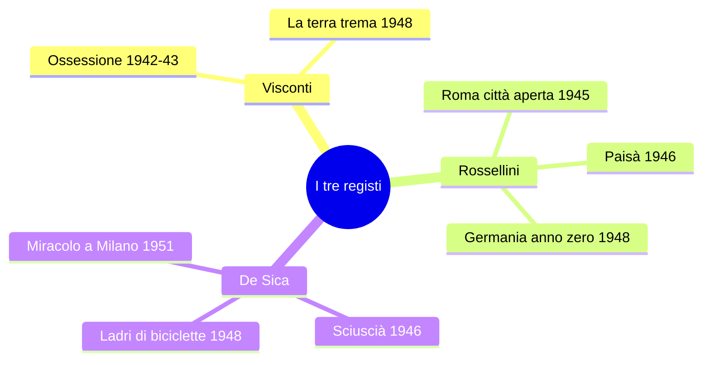

# RIPASSO VELOCE: Il Neorealismo Cinematografico

> Per un ripasso rapido prima dell'interrogazione/esame

---

## Definizione

- Corrente **prima di tutto cinematografica**, poi letteraria
- Italia, **anni '40–'50** (Fascismo → Guerra → Dopoguerra)
- Mostra la **realtà così com'è**, senza filtri né abbellimenti
- "Neo" = **nuovo sguardo** sul mondo che rifiuta l'ideologia nazifascista
- Non è un semplice ritorno al realismo ottocentesco, ma nasce dall'urgenza storica della guerra e della Resistenza

> *«Il primo atto di coscienza critica, dal punto di vista politico e ideologico, che l'Italia ha avuto di se stessa.»* — **Pasolini**

---

## Contesto storico essenziale

| Data | Evento |
|------|--------|
| 1922–1943 | Dittatura fascista |
| 1940–1945 | Seconda Guerra Mondiale |
| 1943–1945 | Resistenza (partigiani + Alleati) |
| 4 dic. 1944 | Liberazione di **Ravenna** |
| 10 apr. 1945 | Liberazione di **Alfonsine** (ultimo baluardo, fasi più cruente) |
| **25 apr. 1945** | **Liberazione dell'Italia** |

### Resistenza nel ravennate
- **Isola degli Spinaroni** → partì la liberazione di Ravenna (comandante **Bulow / Arrigo Boldrini**)
- **Valli di Comacchio** e **Pialassa**: teatro della Resistenza (episodio finale di *Paisà*)
- **Alfonsine**: tra le ultime liberate, **Museo della Resistenza**
- Il fascismo diede un'immagine fasulla di Italia prospera → in realtà portò **povertà, miseria, fame**

> Pasolini: *«Soltanto con la Resistenza è cominciata la storia italiana.»*

---

## Cinema fascista vs. neorealista

| | **Fascista** | **Neorealista** |
|---|---|---|
| **Scopo** | Propaganda, evasione | Denuncia, impegno civile |
| **Italia** | Prospera, fasulla | Misera, autentica |
| **Luoghi** | Cinecittà, teatri di posa | Strade reali, esterni |
| **Soggetti** | Eroi, comandanti, kolossal | Disoccupati, bambini, folla |
| **Attori** | Professionisti | Non professionisti |
| **Paesaggi** | **Verticalità** (templi, colonne) | **Orizzontalità** (strade, campagne, valli) |
| **Tono** | Celebrativo, retorico | Documentaristico, scarno |
| **Finanziamenti** | Statali | Spesso a spese dei registi |

- **Istituto Luce** e **Cinecittà** = fondati da Mussolini per propaganda
- **Telefoni bianchi** = cinema disimpegnato, sentimentale, d'evasione → **rifiutato** dal Neorealismo

---

## I 7 caratteri generali

1. Attori **non professionisti** (presi dalla strada)
2. **Scenografie reali** (rifiuto dei teatri di posa)
3. Centralità della **folla** e dei **bambini** (inversione dei ruoli)
4. **Paesaggi orizzontali** (vs. verticalità fascista)
5. Cinema **dell'impegno** (denuncia di miseria, disoccupazione, guerra)
6. **Voce a chi non l'ha mai avuta** (pescatori, donne, bambini)
7. **Visione documentaria** della realtà (aderenza al vero)

### Ideologia
- Registi **tutti di sinistra** (marxisti, gramsciani)
- Lotta contro: guerra, ingiustizia sociale, fascismo, corruzione
- Cinema **antiborghese**, al servizio degli umili

> Pasolini: *«Quasi tutte le opere neorealistiche si fondano sull'idea che il futuro sarà migliore.»*

---

## I tre registi — scheda sinottica

| Regista | Chi è | Film principali | Cifra |
|---------|-------|-----------------|-------|
| **Luchino Visconti** | Aristocratico milanese, marxista | *Ossessione* (1942–43), *La terra trema* (1948) | Lotta di classe, Verga al cinema |
| **Roberto Rossellini** | Padre di Isabella R., marito di Ingrid Bergman | *Roma città aperta* (1945), *Paisà* (1946), *Germania anno zero* (1948) | Trilogia della guerra, visione documentaria |
| **Vittorio De Sica** | Attore/regista, padre di Christian De Sica | *Sciuscià* (1946), *Ladri di biciclette* (1948), *Miracolo a Milano* (1951) | Bambini protagonisti, umanesimo |

De Sica: **apripista per Spielberg e Scorsese**.

---

## Film per film — punti chiave

### VISCONTI — *Ossessione* (1942–43)
- **Anticipatore** del Neorealismo | Genere: **noir**
- Fonte: *Il postino suona sempre due volte* (romanzo americano)
- Attori: **Clara Calamai**, **Massimo Girotti** (professionisti)
- Primo titolo pensato: *Palude*
- **Trama**: Giovanna (sposata con Bragana, gestore osteria sul Po) + vagabondo Gino → **uccidono il marito**
- Ambientazione: lungo il **Po**, campagna emiliana, strade sterrate, paesaggi piatti
- **Bragana** = incarna il perfetto uomo fascista (maschilista, autoritario)
- **Dissacratorio** del sacro valore della **famiglia** (pilastro del fascismo)
- Sala a Salsomaggiore **esorcizzata con l'acqua santa** dopo la proiezione
- Prodotto **a spese di Visconti** (venduti gioielli, cavalli, scuderie)
- Scene viste in classe: *«E lucean le stelle»* (Tosca), arrivo di Gino affamato, povertà degli interni

### VISCONTI — *La terra trema* (1948)
- Ispirato a ***I Malavoglia*** di **Verga**
- Attori: **non professionisti** (i veri pescatori di **Aci Trezza**)
- Lingua: **dialetto siciliano stretto**
- **Trama**: famiglia **Valastro**, pescatori vs. grossisti → **ingiustizia sociale**
- Didascalia iniziale: *«I fatti rappresentati in questo film accadono in Italia, dove uomini sfruttano altri uomini.»*
- Seconda didascalia: *«La lingua italiana non è in Sicilia la lingua dei poveri.»*
- **Verga** (pessimismo, immobilismo, conservatore) vs. **Visconti** (marxismo, riscatto del proletariato, lotta di classe)
- Elementi verghiani: barche, pescatori, religione della famiglia, Padron 'Ntoni

### ROSSELLINI — *Roma città aperta* (1945)
- Attori: **Anna Magnani** (Pina), **Aldo Fabrizi** (Don Pietro)
- **Trama**: Pina uccisa nella retata; Don Pietro sacerdote antifascista si sacrifica; figlio **Romoletto** assiste
- **Antifascismo trasversale**: comunisti (Francesco) + cattolici (Don Pietro) nel **CLN**
- Scena iconica: **morte di Pina** → caduta di Magnani **non prevista**, tenuta dal regista
- Comparse = persone che avevano **vissuto l'occupazione** fino a pochi mesi prima
- Battuta: *«Lottiamo per una cosa che deve venire, che non può non venire.»*

### ROSSELLINI — *Paisà* (1946)
- Film **ad episodi**, dalla **Sicilia** al **Po** (mosaico dell'Italia in guerra)
- "Paisà" = "paesano" (appellativo tra soldati del sud)
- Ep. finale **"Inverno 1944"**: **Valli di Comacchio**
  - Resistenza in paesaggio **piatto e atipico** (non montagna)
  - Partigiani poco armati, senza viveri
  - Collaborazione partigiani + americani dell'**OSS**
  - Rappresaglia nazifascista
- Modello per *L'Agnese va a morire* di **Giuliano Montaldo** (romanzo di **Renata Viganò**)

### ROSSELLINI — *Germania anno zero* (1948)
- Berlino **in macerie** (reali) | Protagonista: **Edmund** (ragazzino)
- Famiglia: padre invalido, fratello disertore, sorella disoccupata
- Edmund scava fosse per i morti
- **Ex maestro nazista** (figura sinistra) → ideologia della **legge del più forte**
- Edmund **avvelena il padre** → maestro lo rifiuta → **si suicida** (si getta da un edificio)
- Significato: ideologia nazista continua a fare vittime = **fine dell'innocenza**
- Stile: primi piani, chiaroscuri, macchina da presa che segue il peregrinare

### DE SICA — *Ladri di biciclette* (1948)
- Attori **non professionisti** | **Antonio Ricci** (disoccupato) + figlio **Bruno**
- Quartieri popolari di Roma
- Trama in 8 punti:
  1. Ricci trova lavoro da **attacchino di manifesti**
  2. Moglie impegna **lenzuola** al Monte di Pietà per la bicicletta
  3. Bicicletta **rubata** il primo giorno da un giovane bullo
  4. **Pellegrinaggio** padre-figlio per Roma
  5. **Inversione dei ruoli**: Bruno più maturo del padre
  6. Ricci tenta di **rubarne un'altra** → scoperto, quasi **linciato**
  7. Salvato dal **pianto di Bruno**
  8. Finale: **mano nella mano** nella folla (amaro ma con speranza)
- **Bicicletta = dignità del lavoro**; la miseria degrada l'uomo (vittima → carnefice)
- Anche Bruno lavora: fa il **benzinaio**

### DE SICA — *Miracolo a Milano* (1951)
- **Fine simbolica del Neorealismo**
- Finale: poveri in Piazza Duomo **volano via su scope magiche** → *«dove ogni giorno sia davvero un buon giorno»*
- Apertura a **sogno, fantasia, surrealismo** → rompe il **patto neorealista** con la realtà

---

## Cronologia — arco del Neorealismo

| Anno | Film | Fase |
|------|------|------|
| 1881 | *I Malavoglia* (Verga) | Fonte di ispirazione |
| **1942–43** | *Ossessione* (Visconti) | **ANTICIPAZIONE** |
| 1943 | *I bambini ci guardano* (De Sica) | |
| **1945** | *Roma città aperta* (Rossellini) | |
| **1946** | *Paisà* (Rossellini) / *Sciuscià* (De Sica) | |
| **1948** | *La terra trema* / *Germania anno zero* / *Ladri di biciclette* | **APOGEO** |
| **1951** | *Miracolo a Milano* (De Sica) | **FINE SIMBOLICA** |
| 1961 | *Accattone* (Pasolini) | Post-Neorealismo |

**Durata in senso stretto**: circa **un decennio** (1942–1951)

---

## Verismo → Neorealismo — confronto

### Affinità
- Stessi **protagonisti**: umili, pescatori, popolo
- Stesso **sguardo dal basso**, senza filtri
- Stesse **ambientazioni** popolari, uso del **dialetto**
- Stesso **rifiuto** dell'idealizzazione (letteratura romantica / cinema fascista)

### Differenze fondamentali

| | **Verismo (Verga)** | **Neorealismo** |
|---|---|---|
| Ideologia | **Conservatrice**, antistoricistica | **Progressista**, marxista |
| Visione | Pessimismo, **immobilismo** | Fiducia nel futuro, **lotta di classe** |
| Speranza | Nessuna (chi tenta = illuso) | *«Il futuro sarà migliore»* |
| Autore | **Non interviene**, non giudica | **Denuncia**, prende posizione |
| Modello | Determinismo di Taine | Marxismo, Gramsci |

**La terra trema** recupera *I Malavoglia* ma li **reinterpreta in chiave marxista**.

---

## Pasolini e il Neorealismo

| | |
|---|---|
| **Recupera** | Umili, emarginati, sottoproletariato; attori non professionisti; realtà senza filtri |
| **Aggiunge** | Afflato **lirico-poetico**; ricerca stilistica; musica classica su realtà squallida |
| **NON è** | Propriamente neorealista → vuole **inventare un linguaggio** |
| **Primo film** | ***Accattone*** (**1961**) — quasi vent'anni dopo |

La prof.: *«L'afflato lirico, poetico che troviamo in Pasolini è rifiutato dal neorealismo.»*

---

## Calvino e il Neorealismo

- *«Il Neorealismo non fu una scuola.»* (Prefazione 1964 al *Sentiero dei nidi di ragno*)
- *«Un insieme di voci in gran parte periferiche, una molteplice scoperta delle diverse Italie.»*
- **Triade di modelli**: *I Malavoglia* (Verga), *Paesi tuoi* (Pavese, 1941), *Conversazione in Sicilia* (Vittorini, 1941)

---

## Risposte alle domande tipiche da interrogazione

**"Caratteristiche del Neorealismo cinematografico?"**
→ Corrente anni '40-'50, cinema impegnato, problemi reali dell'Italia, scene in strada, attori non professionisti, rifiuto del cinema fascista (kolossal, Cinecittà, lusso). Temi: guerra, Resistenza, miseria.

**"Perché Ossessione è anticipatore?"**
→ Scenografie naturali (Po, campagna), orizzontalità, Italia misera. Cade il **mito della famiglia** (moglie + amante uccidono il marito). Dissacratorio del fascismo.

**"Ultimo episodio di Paisà nel Neorealismo?"**
→ Valli di Comacchio, sembra un documentario, Resistenza in paesaggio piatto atipico. La prof.: apertura verso il cielo = inizio di una nuova epoca.

**"La storia di Ladri di biciclette?"**
→ Ricci disoccupato, lavoro attacchino, lenzuola in pegno, bicicletta rubata, pellegrinaggio padre-figlio, tentato furto, quasi linciato, salvato dal pianto di Bruno. Miseria dei quartieri popolari di Roma.

**"Fine del Neorealismo e perché?"**
→ *Miracolo a Milano* (1951) — finale fiabesco-onirico (poveri volano su scope da Piazza Duomo). Rinuncia alla rappresentazione realistica → rompe il patto neorealista.

**"Volontà che accomuna i registi?"**
→ Ribaltamento ideologie fasciste, rifiuto di eroi e "Grande Italia" fasulla. Centralità della massa popolare, attori non professionisti, bambini protagonisti.

---

## 6 citazioni da ricordare

1. Pasolini: *«Il primo atto di coscienza critica [...] che l'Italia ha avuto di se stessa.»*
2. Pasolini: *«Il primo sguardo che l'Italia dà a se stessa senza veli retorici, senza falsità, col piacere di scoprire i difetti.»*
3. Pasolini: *«Quasi tutte le opere neorealistiche si fondano sull'idea che il futuro sarà migliore.»*
4. *La terra trema*: *«I fatti rappresentati in questo film accadono in Italia, dove uomini sfruttano altri uomini.»*
5. Calvino: *«Il Neorealismo non fu una scuola.»*
6. Calvino: *«La rinata libertà di parlarci fu per la gente al principio smania di raccontare.»*

---

## Lacune da colmare

- **Trascrizione mancante**: lezione 13-01-26 (*Germania anno zero* e *Ladri di biciclette* parziali)
- **Scheda confronto** *La terra trema* / *I Malavoglia* (menzionata dalla prof. il 18-12-25, non disponibile)
- **Analisi di *Paisà*** (inviata sul gruppo il 12-01-26, non disponibile)
- *Miracolo a Milano*: non analizzato in dettaglio, solo citato come fine del Neorealismo
- **Massimo Girotti**: la prof. dice che lo ritroveremo in un altro film, non specificato
