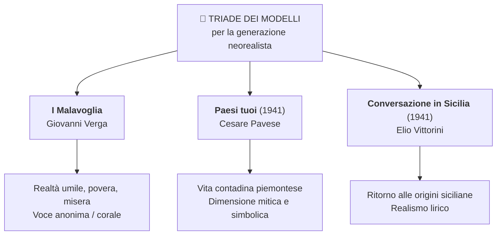
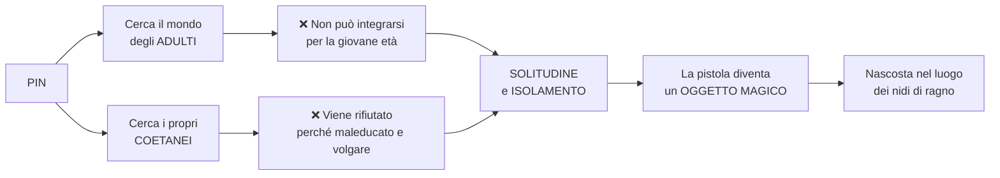
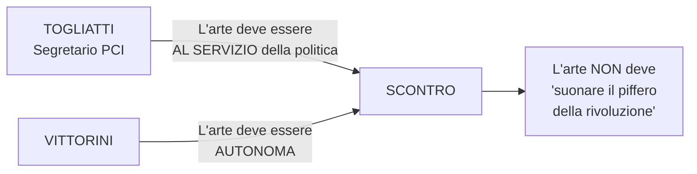
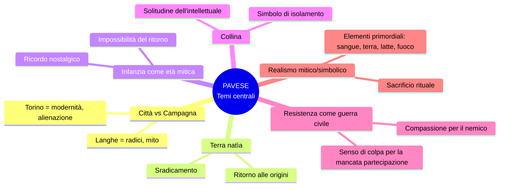
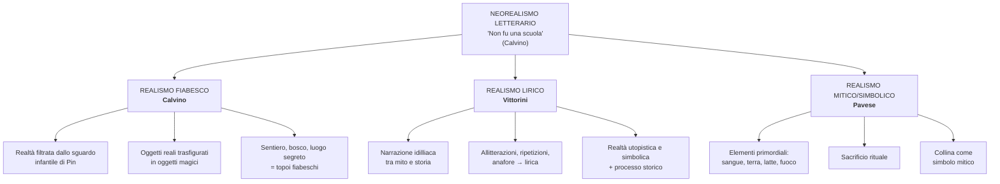
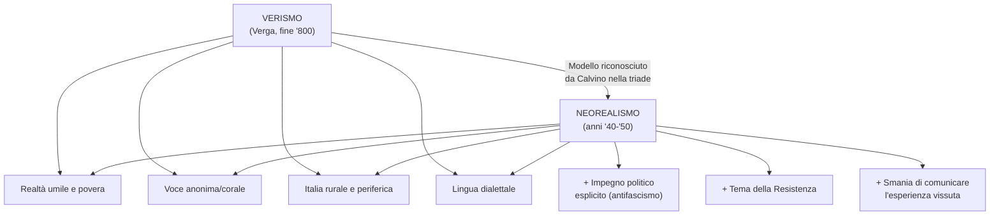
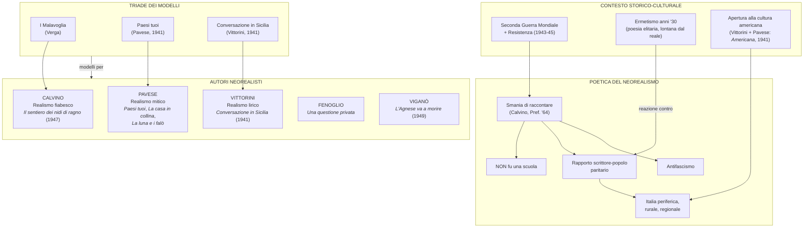

# 📚 MEGA-SCHEMA: Il Neorealismo Letterario

> **Fonti**: Lezioni del 22/01, 26/01, 27/01, 29/01, 30/01, 02/02, 09/02/2026
> **Scopo**: Preparazione esame di Italiano — Maturità

---

## Indice

1. [Quadro generale del Neorealismo letterario](#1-quadro-generale-del-neorealismo-letterario)
2. [La Prefazione del '64 di Calvino — Manifesto del Neorealismo](#2-la-prefazione-del-64-di-calvino--manifesto-del-neorealismo)
3. [Italo Calvino — Il sentiero dei nidi di ragno](#3-italo-calvino--il-sentiero-dei-nidi-di-ragno)
4. [Elio Vittorini — Conversazione in Sicilia e il Politecnico](#4-elio-vittorini--conversazione-in-sicilia-e-il-politecnico)
5. [Cesare Pavese — Dal realismo mitico al dramma esistenziale](#5-cesare-pavese--dal-realismo-mitico-al-dramma-esistenziale)
6. [Beppe Fenoglio — Una questione privata](#6-beppe-fenoglio--una-questione-privata)
7. [Renata Viganò — L'Agnese va a morire](#7-renata-viganò--lagnese-va-a-morire)
8. [Confronti tra autori e declinazioni del realismo](#8-confronti-tra-autori-e-declinazioni-del-realismo)
9. [Domande reali da interrogazione (Q&A)](#9-domande-reali-da-interrogazione-qa)
10. [Lacune e materiale da integrare](#10-lacune-e-materiale-da-integrare)

---

## 1. Quadro generale del Neorealismo letterario

### 1.1 Definizione e confini

La prof sottolinea una **distinzione fondamentale** tra neorealismo cinematografico e letterario:

| | Neorealismo **cinematografico** | Neorealismo **letterario** |
|---|---|---|
| **Confini** | Più definiti e netti | Più sfumati e controversi |
| **Durata** | ~10 anni (*Ossessione* 1942 → *Miracolo a Milano*) | Dagli anni '40 agli anni '50+ |
| **Omogeneità** | Contenuti, stile e cronologia condivisi | Personalità eterogenee con tratti peculiari |
| **Denominatore comune** | Realtà quotidiana, attori non professionisti, location reali | Disponibilità al dibattito civile, sociale e politico |

### 1.2 Obiettivi del Neorealismo in letteratura

La prof li elenca esplicitamente:

1. **Occuparsi dei problemi reali del Paese**
2. **Creare un dialogo con il pubblico** (vs. elitarismo dell'Ermetismo)
3. **Rifiutare il classicismo e le forme estetizzanti** per privilegiare i contenuti
4. **Direzione politico-sociale dell'antifascismo**
5. **Adeguamento della lingua**: prosa che va nella direzione del parlato, con lessico e sintassi che ricalcano i dialetti

### 1.3 La citazione di Carlo Bo

> *"La parola neorealismo usata in letteratura non definisce niente di intrinseco che sia comune a tutti i nostri scrittori o anche solo a una gran parte di essi. Via via che dici la parola, tu la devi riempire di un significato speciale. In sostanza, tu hai tanti neorealismi quanti sono i principali narratori."*
> — **Carlo Bo**, critico letterario

**Significato**: il neorealismo letterario non è un blocco monolitico; ogni autore lo declina in modo diverso.

### 1.4 La triade dei modelli (secondo Calvino, Prefazione '64)

### 1.5 I principali autori neorealisti trattati in classe

| Autore | Opera/e neorealista/e | Tipo di realismo | Ambientazione |
|---|---|---|---|
| **Italo Calvino** | *Il sentiero dei nidi di ragno* (1947) | **Realismo fiabesco** | Liguria |
| **Elio Vittorini** | *Conversazione in Sicilia* (1941), *Uomini e No* (1945) | **Realismo lirico** | Sicilia, Milano |
| **Cesare Pavese** | *Paesi tuoi* (1941), *Il compagno* (1947), *Il carcere* (1938-39), *La casa in collina* (1948), *La luna e i falò* (1950) | **Realismo mitico/simbolico** | Piemonte, Langhe |
| **Beppe Fenoglio** | *Una questione privata*, *Il partigiano Johnny* | — | Piemonte, Langhe, Alba |
| **Renata Viganò** | *L'Agnese va a morire* (1949) | Neorealismo documentaristico | Romagna, Valli di Comacchio |

> **Osservazione della prof**: Pavese e Fenoglio sono entrambi delle Langhe (colline vicino ad Alba, Alessandria). La prof racconta di aver visitato personalmente Santo Stefano Belbo (casa natale di Pavese, con museo) e Alba (casa di Fenoglio) il 25 aprile dell'anno scorso.

---

## 2. La Prefazione del '64 di Calvino — Manifesto del Neorealismo

> **Testo di riferimento**: Prefazione alla riedizione del 1964 de *Il sentiero dei nidi di ragno*
> **Pagina sul libro**: p. 319
> **La prof la definisce**: *"una sorta di dichiarazione di poetica del neorealismo in letteratura"*

### 2.1 Analisi passo per passo

#### Passo 1 — Il libro come prodotto collettivo

> *"Questo romanzo è il primo che ho scritto, quasi posso dire la prima cosa che ho scritto [...] Più che come un'opera mia, lo leggo come un libro nato anonimamente da un **clima generale** di un'epoca, da una **tensione morale**, da un **gusto letterario** che era quello in cui la nostra generazione si riconosceva dopo la fine della Seconda Guerra Mondiale."*

**Commento della prof:**
- Calvino rilegge il romanzo a quasi **vent'anni di distanza** (1947 → 1964)
- Non lo riconosce come un libro "suo", ma come un libro scritto da una **collettività anonima**
- Tre elementi-chiave: **clima generale**, **tensione morale**, **gusto letterario**
- **Collegamento con Verga**: anche Verga dà spazio a una voce anonima nella narrazione (il coro del paese)
- La prof invita a notare *"l'eleganza, la raffinatezza, la ricchezza della prosa di Calvino che è veramente inarrivabile"*

#### Passo 2 — L'esplosione letteraria come fatto collettivo

> *"L'esplosione letteraria di quegli anni in Italia fu, prima che un fatto d'arte, un fatto fisiologico, esistenziale, collettivo."*

> *"Avevamo vissuto la guerra e noi più giovani, che avevamo fatto in tempo a fare il partigiano, non ce ne sentivamo schiacciati, vinti, bruciati, ma vincitori, spinti dalla carica propulsiva della battaglia appena conclusa, depositari esclusivi di una sua eredità."*

**Commento della prof:**
- Non è solo letteratura: è un'esigenza **fisiologica**, **esistenziale**, **collettiva**
- I giovani scrittori si sentono **vincitori**, non vittime — c'è una "carica propulsiva"

#### Passo 3 — Immediatezza di comunicazione scrittore-pubblico

> *"L'essere usciti da un'esperienza — guerra, guerra civile — che non aveva risparmiato nessuno, stabiliva un'immediatezza di comunicazione tra lo scrittore e il suo pubblico."*

**Commento della prof** (parentesi fondamentale sull'**Ermetismo**):
- Negli anni '30 si sviluppa l'**Ermetismo**: poesia difficile, oscura, levigata stilisticamente, ma **lontana dai problemi reali del Paese**, estetizzante, destinata a un **pubblico di élite**
- La generazione neorealista vuole **recuperare il rapporto tra scrittore e popolo**
- Scrittore e pubblico sono in una **posizione paritaria**: accomunati dalle stesse esperienze

> *"Si era faccia a faccia, alla pari, carichi di storie da raccontare, ognuno aveva avuto la sua, ognuno aveva vissuto vite irregolari, drammatiche, avventurose. Ci si strappava la parola di bocca."*

#### Passo 4 — La "smania di raccontare"

> *"La rinata libertà di parlarci fu per la gente al principio **smania di raccontare**. Nei treni che riprendevano a funzionare, gremiti di persone, di sacchi di farina e bidoni d'olio, ogni passeggero raccontava agli sconosciuti le vicissitudini che gli erano occorse, e così ogni avventore ai tavoli delle mense del popolo, ogni donna nelle code ai negozi."*

**Commento della prof:**
- La **smania di comunicare** = forza interiore che porta a condividere esperienze tragiche, avventurose, emotivamente coinvolgenti
- Dopo il grigiore del regime e della guerra, la vita riprende e si manifesta quest'ansia di condividere

#### Passo 5 — Non documentare, ma esprimere

> *"Il segreto di come si scriveva allora non era soltanto in questa elementare universalità di contenuti [...] La carica esplosiva di libertà che animava il giovane scrittore non era tanto nella sua volontà di documentare e informare, quanto in quella di **esprimere**."*

**Commento della prof** (analisi etimologica):
- **Esprimere** < lat. *ex-premo* → *ex* = moto di allontanamento → "ciò che preme da dentro e che ha bisogno di uscire"
- Differenza tra **documentare** (oggettivo, informativo) ed **esprimere** (soggettivo, emotivo, personale)
- Esprimere: *"noi stessi, il sapore aspro della vita che avevamo appreso allora allora"*

#### Passo 6 — "Il Neorealismo non fu una scuola"

> *"Il neorealismo non fu una scuola."*

**Commento della prof** (da ripetere più volte — **"stampatevelo bene in testa"**):
- A differenza della **Scuola Siciliana** (canoni, regole, codici precisi), il neorealismo **non aveva regole codificate**
- Ogni scrittore era libero di esprimersi secondo la propria sensibilità
- Fu piuttosto *"un insieme di voci in gran parte **periferiche**, una molteplice scoperta delle diverse Italie, anche o specialmente delle Italie fino allora più inedite per la letteratura"*

#### Passo 7 — Le Italie periferiche

**Commento della prof:**
- Entrano nella letteratura le **aree mai toccate prima**: le realtà regionali, non le grandi città
- La Liguria di Calvino, il Piemonte di Pavese e Fenoglio, le Langhe
- Un'Italia **rurale, contadina, operaia, regionale, marginale, periferica**
- Questo era già successo solo col **romanzo verista** → ecco il legame con la triade dei modelli
- *"Ognuno sulla base del proprio lessico locale e del proprio paesaggio"*

#### Passo 8 — La Resistenza come imperativo narrativo

> *"Creare una letteratura della Resistenza era ancora un problema aperto. Scrivere il romanzo della Resistenza si poneva come un **imperativo**."*

**Commento della prof:**
- Era difficile raccontare fatti così brucianti a così breve distanza
- **Parallelo con Primo Levi**: *Se questo è un uomo*, quando uscì nell'immediato dopoguerra, nessuno voleva pubblicarlo. Fu un successo solo 10-15 anni dopo. Perché? **Rimozione** → le vicende andavano metabolizzate

#### Passo 9 — Affrontare il tema "di scorcio"

> *"A me questa responsabilità finiva per farmi sentire il tema come troppo impegnativo e solenne per le mie forze. E allora, proprio per non lasciarmi mettere in soggezione dal tema, decisi che l'avrei affrontato non di petto, ma **di scorcio**."*

**Commento della prof:**
- **Di petto** = frontalmente → rischio di retorica e celebrazione
- **Di scorcio** = tangenzialmente → la scelta di un bambino, Pin
- *"Tutto doveva essere visto dagli occhi di un bambino, in un ambiente di monelli e vagabondi"*
- *"Già nella scelta del tema c'è un'ostentazione di spavalderia quasi provocatoriamente"*

---

## 3. Italo Calvino — *Il sentiero dei nidi di ragno*

### 3.1 Inquadramento dell'autore

- Uno dei **maggiori scrittori e intellettuali del Novecento**
- Produzione estremamente **variegata ed eterogenea**: dagli anni '40 agli anni '80
- La produzione neorealista è quella **iniziale**
- **Ha partecipato alla Resistenza** (esperienza autobiografica nel romanzo)

### 3.2 Trama

| Elemento | Dettaglio |
|---|---|
| **Pubblicazione** | 1947 |
| **Ambientazione** | Liguria, dopo l'8 settembre 1943, epoca della Resistenza |
| **Protagonista** | **Pin**, ragazzino orfano di madre |
| **Situazione** | Vive con la sorella che si prostituisce (la Nera) |
| **Evento scatenante** | Ruba una pistola a un soldato tedesco, cliente della sorella |
| **Il luogo segreto** | Nasconde la pistola dove fanno i nidi i ragni → titolo |
| **Sviluppo** | In carcere entra in contatto coi partigiani, si aggrega a loro dopo la fuga |
| **Tema** | Resistenza vista attraverso gli occhi di un bambino |

### 3.3 Pin: il personaggio e la sua funzione

**Caratteristiche di Pin** (dalla prof):
- Ragazzino **smaliziato, maleducato**, frequenta l'osteria degli adulti
- Canta le canzoni sporche dei grandi
- **Troppo maturo** per giocare coi bambini, **estraneo** per età al mondo degli adulti
- Ha "due braccine smilze smilze", è il più debole di tutti
- Le madri vietano ai figli di frequentarlo: *"Costanzo, Giacomino, quante volte te l'ho detto che non devi andare con quel ragazzo così maleducato?"*

### 3.4 Il "realismo fiabesco" di Calvino

**Perché "fiabesco"?**
- La **pistola** (strumento di morte) diventa nelle mani di Pin un **oggetto magico**, come nelle fiabe
- Il **sentiero**, il **bosco**, il **luogo segreto** → topoi fiabeschi
- Non è una visione documentaristica della guerra, ma un punto di vista **trasfigurato dall'immaginazione infantile**

**Perché "realismo"?**
- Racconta un periodo storico preciso (Resistenza, 1943-1945)
- Stile che ricalca il parlato
- Protagonista dalle condizioni sociali misere e realistiche

> **Apparente contraddizione**: come può il realismo essere fiabesco? La fiaba è invenzione, il realismo è aderenza alla realtà. Ma in Calvino queste due dimensioni **coesistono**: il reale viene filtrato attraverso lo sguardo di un bambino che lo trasfigura.

### 3.5 Scelta antiretorica e antiagiografica

**Concetto-chiave della prof** (ripetuto più volte):

- Calvino sceglie Pin per **non offrire un ritratto agiografico della Resistenza**
- **Agiografia** = scritti delle vite dei santi → evitare la "santificazione" dei protagonisti della lotta partigiana
- Raccontare la Resistenza da scrittore adulto e borghese sarebbe stato **mentire**: mettere una sovrastruttura, interpretare i fatti
- Il punto di vista di un bambino consente di raccontare con **maggiore autenticità** la lotta partigiana, con:
  - Il suo **eroismo**
  - Ma soprattutto le sue **incertezze, fragilità, disorganizzazione, conflitti interni**

> **Avvertimento della prof**: *"Il vostro libro ne parla bene di questo aspetto, quindi **studiatelo perché ve lo chiederò all'esame**."*

### 3.6 Analisi del brano "La solitudine di Pin" (tipologia A - esame)

**Testo**: da p. 325 a p. 327 del manuale (brano letto e analizzato in classe il 27/01)

#### Contenuto del brano

Pin si trova solo nei vicoli dopo aver fatto uno scherzo cattivo. Tutti gli gridano improperi e lo cacciano via. Vorrebbe compagni della sua età ma viene rifiutato. Non gli resta che rifugiarsi nel mondo dei grandi dell'osteria. Si chiude con l'immagine della *"nebbia di solitudine che ti si condensa nel petto"*.

#### Indicazioni della prof per l'analisi del testo (metodo esame)

**1. Riassunto (comprensione)**:
- Dividere il testo in **sequenze**
- Usare una **frase nominale** per ciascuna sequenza
- Costruire un testo **breve**, al **presente**, con i **connettivi**
- Test: *"Chi non ha letto il testo riesce a capire quello che c'è nel testo dal mio riassunto?"*

**2. Analisi — Figure retoriche e stile**:
- **Ripetizioni** ed **enumerazioni**
- **Metafore** (es. "nebbia di solitudine che ti si condensa nel petto")
- **Usi morfologici**: singolare/plurale, maschile/femminile, particolarità
- **Usi sintattici**: calchi dal dialetto, usi impropri del "che", forme del parlato
- **Scelte lessicali**: registro, parole dialettali, lingue straniere, termini aulici

**3. Analisi della metafora "nebbia di solitudine che ti si condensa nel petto"**:
- **Nebbia** → smarrimento, perdita del senso dell'orientamento, indeterminatezza, mancanza di confini, impossibilità di trovare una strada
- **Si condensa** → si aggruma nel petto, crea come un groviglio, un peso
- Associata alla **solitudine** come condizione opprimente e disorientante

**4. Interpretazione complessiva (la domanda più importante)**:

> *"Il sentiero dei nidi di ragno parla della tragedia della Seconda Guerra Mondiale e della lotta partigiana, ma racconta anche la vicenda universale di un ragazzino che passa drammaticamente dal mondo dell'infanzia a quello della maturità."*

**Come impostare la risposta** (indicazioni precise della prof):
1. **Introduzione**: collocare il romanzo nel **Neorealismo** di Calvino (caratteri: attenzione a guerra, Resistenza, antifascismo)
2. **Tema centrale**: il **passaggio traumatico dall'infanzia alla maturità**
3. **Collegamenti** (per analogia o differenza):
   - **Neorealismo cinematografico**: *Germania anno zero* (Edmund, ingresso nella vita adulta negato dal trauma storico), *Ladri di biciclette* (Bruno, bambino che svolge il ruolo di adulto)
   - *Mamma Roma* di Pasolini (passaggio negato)
   - Tema esistenziale **sempre attuale**: cinema e letteratura moderni
4. **Conclusione**: rielaborazione che **aggiunge qualcosa**, non mera ripetizione

> **Indicazioni pratiche per l'esame** (dalla prof):
> - Minimo **4 colonne**, massimo **5 colonne**
> - Comprensione + analisi: ~2,5 colonne
> - Interpretazione complessiva: ~2-2,5 colonne
> - La conclusione è **l'ultima cosa che si legge**, deve essere **efficace**
> - Mai introdurre nella conclusione qualcosa di nuovo non trattato prima
> - Restare **aderenti al testo** nelle parti di comprensione e analisi; i **collegamenti** vanno nell'interpretazione

### 3.7 Pagine da studiare sul libro

| Contenuto | Pagine |
|---|---|
| Vita di Calvino (lettura veloce) | pp. 308-309 |
| Letteratura esistenziale, trama del *Sentiero* | pp. 315-317 |
| Prefazione del '64 (testo + analisi) | pp. 319 ss. |
| Brano "La solitudine di Pin" + analisi | pp. 325-327 |

---

## 4. Elio Vittorini — *Conversazione in Sicilia* e *Il Politecnico*

### 4.1 Profilo dell'autore

| Elemento | Dettaglio |
|---|---|
| **Origine** | Nasce in Sicilia, si trasferisce al Nord |
| **Impegno politico** | Azioni clandestine per il **Partito Comunista** durante la guerra |
| **Ruolo culturale** | Scrittore e **animatore culturale** |
| **Rapporto col PCI** | Polemica con **Togliatti** (1946-47) sull'autonomia dell'arte |

### 4.2 Il Politecnico (1945)

Vittorini fonda a Milano, alla fine della guerra, la rivista **Il Politecnico**, con cui propone:

1. Uno **svecchiamento della cultura italiana** (come Madame de Staël nel 1816)
2. **Apertura alla psicanalisi** (Freud, 1900 — disciplina ancora nuova)
3. **Collegamento tra intellettuali e popolo** (tema gramsciano)
4. **Apertura alla cultura americana** → con **Cesare Pavese** realizza nel 1941 l'antologia ***Americana***
   - Censurata dal regime perché contrastava il **mito della superiorità italica**

### 4.3 La polemica Vittorini-Togliatti (1946-47)

- **Togliatti**: la letteratura come **strumento di propaganda ideologica**
- **Vittorini**: l'arte è **naturalmente impegnata** e non deve essere sottomessa ai dettami del partito
- Espressione celebre: l'arte **"non deve suonare il piffero della rivoluzione"**

> **Parallelo della prof**: anche Pasolini ebbe rapporti difficili col PCI → fu **espulso** perché omosessuale (il partito non voleva compromettersi)

### 4.4 Opere neorealiste

| Opera | Anno | Note |
|---|---|---|
| ***Conversazione in Sicilia*** | 1941 | Capolavoro, inaugura la stagione neorealista |
| ***Uomini e No*** | 1945 | Secondo romanzo neorealista |

**Giudizio critico**: Vittorini ha un ruolo importantissimo come **figura culturale**, ma come scrittore la critica riconosce *Conversazione in Sicilia* come **l'unico e autentico capolavoro** (le altre opere sono considerate mediocri).

### 4.5 *Conversazione in Sicilia* — Analisi approfondita

#### Trama

- Il protagonista è **Silvestro Ferrauto**, un uomo trasferitosi dalla Sicilia al Nord
- Decide di tornare nella terra d'origine per far visita alla **madre**, infermiera che fa iniezioni a domicilio
- Il giro delle iniezioni diventa occasione per **incontrare diversi personaggi del popolo**

#### Il "realismo lirico"

La critica definisce il realismo di Vittorini come **realismo lirico** o **realismo idilliaco**:

- Narrazione che oscilla tra **mito** e **storia**
- Coniuga una **realtà utopistica, simbolica** con il **processo storico in atto**
- **Rivelazioni di una forma di narrazione idilliaca**, appoggiata su suggestioni e sfumature segrete
- Rapporti di tipo **analogico** tra figure e situazioni
- Procedimenti tipici della **lirica**: **allitterazioni**, **ripetizioni**, **anafore**

#### Analisi dell'incipit — Gli "astratti furori" (p. 62 del manuale)

> *"Io ero, quell'inverno, preda ad **astratti furori**. Non dirò quali, non di questo mi sono messo a raccontare, ma bisogna dita che erano astratti, non eroici, non vivi. Furori, in qualche modo per il genere umano perduto. Da molto tempo questo, ed ero col capo chino."*

**Analisi verso per verso della prof:**

| Espressione | Analisi |
|---|---|
| *"astratti furori"* | Espressione **divenuta proverbiale**. "Furori" → rabbia, profonda inquietudine. "Astratti" → **non direzionati**, senza un apparente motivo, non diretti verso qualcosa |
| *"non eroici, non vivi"* | **Climax discendente**: non trovano manifestazione, non conducono a nessuna reazione |
| *"genere umano perduto"* | Causa suggerita ma non esplicita: la **guerra**, la **dittatura**. Contesto: **Guerra Civile di Spagna** (anni '30-'40), Francisco Franco vs. forze democratiche |
| *"col capo chino"* | Gesto che indica **rassegnazione**, **inerzia** |

> *"Vedevo manifesti di giornali squillanti e chinavo il capo."*

- **"Giornali squillanti"** = **sinestesia** (dato visivo "giornali" + dato uditivo "squillanti")
- Significato: giornali che riportano notizie forti, d'impatto — notizie di guerra, uccisioni, violenza, distruzioni
- Riferimento in particolare alla **Guerra Civile di Spagna**

> *"Vedevo amici per un'ora, due ore e stavo con loro senza dire una parola, chinavo il capo. Avevo una ragazza o moglie che mi aspettava, ma neanche con lei dicevo una parola, anche con lei chinavo il capo."*

- **"Chinavo il capo"** ripetuto a fine periodo = **epifora** (ripetizione a fine periodo/verso)
- Significa una condizione di **distacco**, mancanza di partecipazione emotiva rispetto a ciò che rende vivi: **amicizia** e **amore**

> *"Pioveva intanto e passavano i giorni, i mesi, e io avevo le scarpe rotte. L'acqua che mi entrava nelle scarpe e non vi era più altro che questo: pioggia, massacri sui manifesti dei giornali e acqua nelle mie scarpe rotte."*

- **Scarpe rotte**: simbolo della **povertà** e della **fatica del vivere**, aggravata dalla pioggia incessante (= la guerra)
- Campo semantico dell'**inerzia**: quiete, sordo, muti

> *"Muti amici, la vita è in me come un sordo sogno e non speranza, quiete."*

- La **quiete nella non speranza** → condizione che Petrarca chiama **accidia**: non aver voglia di nulla, indifferenza totale verso tutto

> *"Non aver voglia di nulla [...] come se non avessi mai avuto un giorno di vita [...] come se mai avessi avuto un'infanzia in Sicilia tra i fichidindia e lo zolfo nelle montagne."*

- Negazione totale della vita precedente: amicizia, amore, infanzia in Sicilia
- Ma: *"mi agitavo entro di me per **astratti furori** e pensavo il genere umano perduto"*

> **Giudizio della prof**: *"Questa è una pagina bellissima, memorabile, veramente di una bellezza indescrivibile, notevolissima."*

**Pagine da studiare sul libro**: pp. 60-63 (testo + analisi del testo)

---

## 5. Cesare Pavese — Dal realismo mitico al dramma esistenziale

### 5.1 Profilo dell'autore

| Elemento | Dettaglio |
|---|---|
| **Origine** | Santo Stefano Belbo (Langhe, Piemonte) |
| **Attività** | Romanziere, poeta, traduttore, editore |
| **Casa editrice** | Lavora per **Einaudi** a Torino |
| **Traduzione** | Traduce opere capitali della letteratura americana (es. ***Moby Dick***) |
| **Antologia** | Con Vittorini: ***Americana*** (1941) — antologia di scrittori americani |
| **Iscrizione PCI** | 1948 (dopo la guerra, quasi a "risarcimento" del mancato impegno) |
| **Non partecipa alla Resistenza** | A differenza di Calvino |
| **Suicidio** | Estate **1950**, Hotel Roma, Torino. Aveva 42 anni |
| **Biglietto d'addio** | *"Perdono tutti e a tutti chiedo perdono. Va bene? Non fate troppi pettegolezzi."* (dentro una copia di *Dialoghi con Leucò*) |

### 5.2 Temi centrali della poetica

### 5.3 *Paesi tuoi* (1941) — Il primo romanzo

#### Trama

- **Berto** e **Talino** escono dal carcere a Torino
- Si recano nella casa di campagna di Talino nelle Langhe
- Famiglia contadina tipica della prima metà del '900
- Si consuma una vicenda di **violenza, incesto e morte**
- **Gisella** (sorella di Talino) viene uccisa da Talino, accecato dalla **gelosia** (relazione incestuosa)

> Nota della prof: Talino era in carcere perché **piromane** (accusato di aver incendiato cascine vicine).

#### Analisi della scena dell'uccisione di Gisella (testo fornito dalla prof, non sul libro)

**Contesto**: lavoro nei campi (scarico dei covoni dal carro). Gisella porge l'acqua a Berto ed Ernesto. Talino reagisce con gelosia.

**Dialogo rivelatore**:
> — *"Là si lavora e qui si veglia"* (Talino, con la voce del padre)
> — *"C'è chi veglia di notte e chi veglia di giorno"* (Gisella — allusione agli incendi notturni di Talino)

**L'uccisione**:
> *"Talino aveva fatto due occhi da bestia e, dando indietro un salto, le aveva piantato il tridente nel collo."*

**Elementi simbolici individuati dalla prof**:

| Elemento | Significato simbolico |
|---|---|
| **Sangue** | Violenza primordiale, sacrificio |
| **Fango** | Morte, putrefazione, materia primigenia |
| **Sudore** | Fatica, lavoro, corpo |
| **Acqua / secchio** | Vita, purificazione, ma anche innesco della gelosia |
| **Mammelle scoperte** | Maternità, vita della natura (anche nell'iconografia cristiana) |
| **Tridente** | Ricorrenza ossessiva, strumento di lavoro divenuto arma, anticipazione inquietante |
| **Terra** | Elemento primordiale |
| **Latte** | Vita, nutrimento |

**La morte come sacrificio rituale**:
- La morte di Gisella è presentata come una sorta di **sacrificio rituale** (come i sacrifici per ingraziarsi gli dèi)
- Dimensione **selvaggia, ancestrale, violenta**
- Il romanzo è sì **realistico**, ma costellato da **elementi simbolici** che rimandano a una **realtà primigenia e ancestrale**

**Stile**:
- Stile **scarno, rapido**
- Prevale la **paratassi** (frasi brevi e coordinate)
- Frequenti **sequenze dialogiche**
- Lessico **semplice**, nella direzione del parlato, con frasi idiomatiche
- Linguaggio vicino alla realtà contadina

**Caratteri del popolo messi in luce**: **barbarie, violenza, bestialità** — senza alcuna idealizzazione.

### 5.4 L'ideale trilogia neorealista di Pavese

| Opera | Anno | Caratteristiche |
|---|---|---|
| ***Il carcere*** | 1938-39 | Composizione; fra le primissime opere |
| ***Il compagno*** | 1947 | **Romanzo di formazione** (*Bildungsroman*): Pablo, giovane sfaccendato → adesione al comunismo → lotta clandestina → piena coscienza politica. È il più **discutibile** (romanzo a tesi, esiti formali e d'ispirazione deboli) |
| ***La casa in collina*** | 1948 | **Capolavoro assoluto** (insieme a *La luna e i falò*) |

### 5.5 *La casa in collina* (1948) — Analisi approfondita

#### Trama

- **Corrado**, intellettuale, nel pieno della guerra **si rifugia in collina** rifiutando di prendere posizione
- Incontra **Cate**, donna con cui aveva avuto una relazione, che ha un figlio piccolo (**Dino**)
- Non può fare a meno di chiedersi se Dino sia suo figlio
- Rimane in una situazione di **stallo** e **inerzia**
- Il conflitto rimane **interiore**

#### Autobiografia

- Corrado **è** Pavese: intellettuale incapace di agire, di incidere sulla realtà
- Pavese **non partecipò alla Resistenza** (a differenza di Calvino)
- Si iscrisse al PCI nel '48 *"quasi a risarcimento del mancato impegno"*
- L'inquietudine di Corrado è quella di Pavese
- Amori brucianti ma infelici → una delle cause del **suicidio nel 1950**

#### Analisi del brano (p. 51 del manuale)

##### "Niente è accaduto"

> *"Niente è accaduto. Sono a casa da sei mesi e la guerra continua."*

- Corrado si trova in una situazione di **marginalità** rispetto agli orrori della storia
- Posizione di **isolamento**: li sente, ma lontani
- **"Nulla accade"**, **"niente è accaduto"** → espressioni reiterate con cadenza quasi lirica

> *"Tolto questo e gli allarmi e le scomode fughe nelle forre [...] tolto il fastidio e la vergogna, niente accade."*

- *"Tolto... tolto..."*: andamento lirico, struttura anaforica
- La guerra gli procura solo qualche **fastidio** e **vergogna**

##### La Resistenza come impresa dei giovani

> *"Gli eroi di queste valli sono tutti ragazzi, hanno lo sguardo grigio e cocciuto dei ragazzi."*

> *"Questa guerra ci brucia le case, ci semina di morti fucilati piazze e strade [...] finirà per costringerci a combattere anche noi [...] E verrà il giorno che nessuno sarà fuori della guerra, né i vigliacchi, né i tristi, né i soli."*

- Anche nella marginalità, espressione indiretta di un **senso di colpa**

##### Il tema del ritorno e dell'infanzia

> *"Per me la collina resta tuttora un paese d'infanzia, di falò e di scappate, di giochi."*

- Il ritorno all'infanzia come **età mitica** → tema sviluppato al massimo grado in *La luna e i falò*
- La **collina** = simbolo dell'isolamento e della **solitudine dell'intellettuale incapace di agire**

##### L'isolamento come condizione permanente

> *"M'accorgo che ho vissuto un solo **lungo isolamento**, una **futile vacanza**, come un ragazzo che giocando a nascondersi entra dentro un cespuglio e ci sta bene, guarda il cielo da sotto le foglie e si dimentica di uscire mai più."*

- **Espressione significativa** evidenziata dalla prof: l'isolamento non è solo della guerra, ma di tutta la vita

##### "Ogni guerra è una guerra civile"

> *"Sono questi che mi hanno svegliato. Se un ignoto, un nemico, diventa morendo una cosa simile, se ci si arresta e si ha paura a scavallarlo, vuol dire che anche vinto il nemico è qualcuno."*

**La prof sottolinea con forza** (***"vi prego di tenere a mente"***):

> *"Per questo **ogni guerra è una guerra civile**: ogni caduto somiglia a chi resta, e gliene chiede ragione."*

**Doppio significato**:
1. **Storico**: la Resistenza è guerra tra italiani (partigiani vs. repubblichini della Repubblica di Salò)
2. **Universale**: ogni guerra è "civile" perché ogni essere umano appartiene alla stessa umanità; il nemico morto "somiglia a chi resta"

**Sentimento verso il nemico**: profonda **compassione**

> *"Si ha l'impressione che lo stesso destino che ha messo a terra quei corpi tenga noi altri inchiodati a vederli, a riempircene gli occhi. Non è paura, non è la solita viltà. Ci si sente umiliati perché si capisce [...] che al posto del morto potremmo essere noi."*

### 5.6 *La luna e i falò* (1950) — Ultimo romanzo

| Elemento | Dettaglio |
|---|---|
| **Pubblicazione** | 1950 (stesso anno del suicidio) |
| **Protagonista** | **Anguilla**, dopo anni lontano torna nelle Langhe |
| **Tema** | Ritorno alla terra natale, tempo che ha consumato e cambiato cose e persone |
| **I falò** | I falò **rituali** (per propiziare raccolti) sono stati sostituiti dai **falò di distruzione** (della guerra): non solo delle cose, ma anche delle persone |
| **Temi** | Sradicamento, ricordo, isolamento, estraneità |
| **Giudizio** | Considerato uno dei **capolavori assoluti** di Pavese |

---

## 6. Beppe Fenoglio — *Una questione privata*

### 6.1 Profilo

- Delle **Langhe**, come Pavese (zona di Alba)
- Partecipa alla Resistenza
- La prof ne ha visitato la casa ad Alba

### 6.2 *Una questione privata* — Analisi del brano (lezione 02/02)

#### Trama (dal brano letto in classe)

- **Milton**, partigiano, è ossessionato da una **questione privata**: il dubbio che **Fulvia**, la donna amata, abbia avuto una relazione con **Giorgio**, un altro partigiano
- Questa ossessione irrompe nella vita militare, rendendolo disinteressato a tutto il resto
- Il comandante **Leo** gli chiede informazioni su un giro di ricognizione ad Alba, ma Milton è assente, distratto

#### Analisi del brano — Passo per passo

##### Il conflitto tra dimensione pubblica e privata

> *"Non ne posso più", pensava, "se mi fa ancora domande io, io lo...". [...] Il fatto è che più niente mi importa, di colpo più niente: la guerra, la libertà, i compagni, i nemici. Solo più quella verità."*

**Commento della prof**: La **questione privata** irrompe e occupa tutti i pensieri, diventando un'**ossessione**. Milton è infastidito persino dalle domande del suo comandante Leo.

##### Il flashback rivelatore

> *"Fulvia ci giocava con Giorgio, sempre in singolo. [...] Milton, lui sedeva sulla panchina scordando o confondendo il punteggio che Fulvia gli aveva comandato di tenere. Sedeva scomodo, smuovendo senza sosta le lunghe gambe, i pugni serrati nelle tasche per non dar tensione e mascherare la piattezza delle cosce. Senza i soldi per pagarsi una bibita [...] Con in fondo alla tasca un foglietto con la versione di una poesia di Yeats."*

**Cosa capiamo del protagonista** (dalla discussione in classe):
- Milton è **povero** (non ha soldi per una bibita), Fulvia è **benestante**
- Prova **disagio**, **insicurezza** rispetto al proprio aspetto fisico
- È **timido**, **sognatore**, **sentimentale**
- Ama la **poesia del romanticismo inglese** (Yeats: *"When you are old and grey and full of sleep"*)
- Povero di mezzi economici, ma di grande **profondità intellettuale**

##### Tecniche narrative individuate dalla prof

Il brano presenta un'**alternanza notevolissima** di tecniche:

1. **Sequenze dialogiche**: linguaggio naturale, autentico, che ricalca il parlato
2. **Sequenze narrative brevi**: *"Milton varcò appena la soglia e si tenne ai bordi della zona di luce"*
3. **Pensieri del protagonista** (discorso indiretto libero)
4. **Flashback** (flash del passato): il ricordo di Fulvia e Giorgio al campo da tennis

##### L'amarezza della guerra

> *"Ti interessa sapere che oggi compio trent'anni? È un record. Vuol dire che se anche crepassi domani, creperei vergognosamente vecchio."*

**Commento della prof**: sembra una battuta leggera, ma ha un risvolto **drammatico e amaro**:
- Morire a 30 anni in quel momento storico = morire vecchi
- La crudezza è espressa dalle **scelte lessicali**: **"crepassi"**, **"creperei"** — verbi crudi che esprimono la vicinanza quotidiana alla morte
- Queste due parole costituiscono una figura retorica: la stessa parola **coniugata in modo diverso** (poliptoto)

---

## 7. Renata Viganò — *L'Agnese va a morire*

### 7.1 Inquadramento

| Elemento | Dettaglio |
|---|---|
| **Pubblicazione** | 1949 |
| **Ambientazione** | Romagna, Valli di Comacchio |
| **Genere** | Romanzo neorealista |
| **Film** | Trasposizione cinematografica di **Giuliano Montaldo** (anni '70) |

### 7.2 Trama

- **Agnese**: contadina analfabeta di mezza età
- Il marito **Palita** viene deportato nei campi di concentramento tedeschi (dove morirà)
- L'uccisione del suo gatto da parte di un soldato tedesco la spinge a diventare **staffetta partigiana**
- Diventa per tutti **"mamma Agnese"**

### 7.3 Caratteristiche neorealiste (dalla correzione dei compiti, 09/02)

- Agnese è mossa da **sentimenti emotivi** (rabbia, vendetta per ciò che le hanno tolto) e **non da un'ideologia politica precisa**
- La Viganò esprime appieno i temi e lo stile del **Neorealismo letterario**:
  - **Verità** e tratti caratteristici del **territorio romagnolo**
  - Uso dell'**articolo prima di un nome proprio femminile** ("l'Agnese") — caratteristico del luogo
  - **Lessico che ricalca la struttura del parlato**

### 7.4 Il personaggio di Agnese

> **Osservazione dalla prof** (correzione compiti): Agnese **non è una figura femminile di rottura** rispetto al passato. Si inserisce nel filone della **donna materna, prudente**. Bisogna chiarirlo esplicitamente quando se ne parla.

### 7.5 Testimonianza reale e film

La prof ha fatto ascoltare in classe la **testimonianza della partigiana Viera Geminiani** (poi diventata Anna Marini), che aveva collaborato con Montaldo durante le riprese del film:
- Aveva insegnato a **Ingrid Thulin** (l'attrice) ad andare in bicicletta
- Le aveva insegnato a *"mandare un accidente"* in dialetto romagnolo (*"T'venga un cancar"*)
- Le riprese furono fatte alla Ca' de Gero, ad Alfonsine
- Montaldo ricevette la cittadinanza onoraria di Alfonsine

---

## 8. Confronti tra autori e declinazioni del realismo

### 8.1 Le tre declinazioni del realismo

### 8.2 Rapporto con la Resistenza

| Autore | Rapporto con la Resistenza |
|---|---|
| **Calvino** | **Partecipa** alla Resistenza → la racconta "di scorcio", attraverso Pin |
| **Pavese** | **Non partecipa** → senso di colpa, isolamento, inerzia di Corrado |
| **Vittorini** | **Partecipa** ad azioni clandestine per il PCI → rivendica poi l'autonomia dell'arte |
| **Fenoglio** | **Partecipa** alla Resistenza → la racconta intrecciandola con la questione privata |
| **Viganò** | **Esperienza diretta** nella Resistenza romagnola → romanzo quasi documentaristico |

### 8.3 Rapporto con il Verismo

### 8.4 Rapporto con l'Ermetismo (anni '30)

| | **Ermetismo** (anni '30) | **Neorealismo** (anni '40-'50) |
|---|---|---|
| **Linguaggio** | Difficile, oscuro, levigato | Parlato, dialettale, diretto |
| **Pubblico** | Intellettuali, élite | Popolo, collettività |
| **Temi** | Lontani dai problemi reali | Problemi reali del Paese |
| **Stile** | Estetizzante | Privilegia i contenuti |
| **Rapporto scrittore-pubblico** | Distante | **Paritario** (stesse esperienze) |

---

## 9. Domande reali da interrogazione (Q&A)

> Estratte dalle interrogazioni delle lezioni del 30/01, 09/02 e 09/04/26

### Q&A — Neorealismo e contesto

**D: Quali sono le caratteristiche del Neorealismo cinematografico?**
**R** (risposta dello studente, valutata positivamente): Il Neorealismo cinematografico è una corrente che si sviluppa tra gli anni '40 e '50, a cavallo tra la fine della Seconda Guerra Mondiale e il dopoguerra. È un cinema impegnato che affronta i problemi reali dell'Italia, a differenza del cinema del totalitarismo fascista (colossal storici, Cinecittà, lusso). Affronta temi legati a guerra, lotta antifascista, Resistenza, ambientando le scene direttamente in strada.

**D: Qual è il film considerato precursore del Neorealismo? Perché, se non ha temi di guerra?**
**R**: *Ossessione* di Visconti (1942). Ambientato lungo il Po, in campagna. Rompe il **mito della famiglia** tradizionale (la moglie intreccia una relazione con Gino, insieme uccidono il marito). Ha suscitato critiche dalla Chiesa. Far vedere le cose così come sono, senza idealizzazioni, è già considerato scandaloso.

**D: In che modo Pasolini rappresenta il popolo?**
**R**: In *Ragazzi di vita* (1955) e poi in *Accattone* (1961, film). Vuole ritrarre la realtà delle **borgate romane**, dove secondo lui vive l'**anima autentica del popolo**: il **sottoproletariato urbano**. Si esprime attraverso violenza e crudeltà, ma è un'autenticità non falsa come quella della borghesia. Gli attori sono selezionati direttamente dalle borgate.
- **Precisazione della prof**: Pasolini vuole descrivere la **verità** più che raccontarla realisticamente. C'è una forte **ricerca stilistica** (accosta immagini squallide a musica classica → inventa un linguaggio).

**D: Siamo all'interno del neorealismo con Pasolini?**
(Domanda della prof a Diego — la risposta non è esplicitata ma il tema è sollevato come problematico)

### Q&A — Renata Viganò e *L'Agnese va a morire*

**D: Qual è il successo del romanzo? Perché funziona?**
**R**: Agnese è mossa da sentimenti emotivi (rabbia, vendetta) e **non da un'ideologia politica precisa**. Questo la rende universale. La Viganò esprime i temi del Neorealismo letterario: verità, tratti del territorio romagnolo, articolo prima del nome proprio femminile, lessico del parlato.

**D: Agnese è una figura femminile di rottura?**
**R** (correzione della prof): **No**. Non è una figura di rottura rispetto al passato. Si inserisce nel filone della **donna materna, prudente**. Bisogna spiegarlo esplicitamente.

### Q&A — Verismo (chieste all'interrogazione del 09/02, da sapere per i collegamenti)

**D: Quali sono le principali differenze tra Naturalismo e Verismo?**
**R**: Il Naturalismo si sviluppa in Francia (metà '800), il Verismo in Italia (fine '800). Entrambi sostengono il **determinismo sociale** (tre fattori di Taine: ereditarietà, ambiente sociale, contesto storico). Ma: i Naturalisti (Zola) vogliono denunciare per **migliorare la società**; Verga ha una **concezione negativa del progresso** e un estremo conservatorismo.

**D: Cos'è l'ideale dell'ostrica?**
**R**: Come l'ostrica è ancorata allo scoglio, tutti i componenti della famiglia devono rimanere all'interno di essa. Allontanarsi = morire, essere sconfitti. Il mondo esterno è un "pesce vorace" che divora i pesci piccoli.

**D: Come si chiude il romanzo *I Malavoglia*?**
**R**: Il giovane 'Ntoni torna ad Aci Trezza e non viene riconosciuto nemmeno dal cane (parallelo con Ulisse, ma **negato**). La porta/uscio rappresenta un confine invalicabile. Si sente estraneo e se ne va. Alessi rappresenta la ciclicità. Il finale rimane **aperto**.

### Q&A — Interrogazione del 09/04/26 (ripasso)

**D: Inquadra Elio Vittorini all'interno del Neorealismo letterario, con riferimento a *Conversazione in Sicilia*.**
**R** (studente Enrico, valutata positivamente dalla prof):
Vittorini è nato in Sicilia e si trasferisce successivamente al Nord, come il protagonista Silvestro del romanzo del 1941. Silvestro compie un viaggio di ritorno al Sud: accompagna la madre nelle iniezioni di beneficenza ai poveri. Il passo letto mostra Silvestro in preda agli **«astratti furori»** — «astratti» perché interiori, «furori» perché causati dalla guerra civile spagnola (i fascisti aiutano Franco). Silvestro non riesce ad agire contro la dittatura. Le **scarpe rotte** del protagonista sono un **correlativo oggettivo**: segno di povertà e di debolezza.

*Ruolo di Vittorini nel Neorealismo*: è antifascista; combatte nella Resistenza; è animatore di cultura nel periodo post-bellico; Calvino lo inserisce nella triade dei romanzi-modello per il Neorealismo.

**D: Quali sono gli altri due romanzi della triade citata da Calvino?**
**R**: *I Malavoglia* di Verga (1881) e *Paesi tuoi* di Pavese (1941).

**D: In *Paesi tuoi* di Pavese, come si manifesta la «dimensione animale e ancestrale»? Perché Calvino lo include nella triade?**
**R** (studente Luca): I protagonisti Berto e Talino escono di prigione. Talino invita Berto nella sua famiglia contadina. Il romanzo insiste su elementi come il sudore, il sangue, la terra, il fango — e soprattutto il tridente, che sarà l'arma con cui Talino uccide la sorella Gisella per gelosia verso Berto. Calvino lo include perché Pavese riesce a trasmettere la **crudeltà** della scena e mostra l'**Italia contadina** — i temi principali del Neorealismo: povertà, miseria, dibattito sociale/politico.

**D: In che senso il Neorealismo non è una scuola?**
**R** (Luca): Ogni autore esprime la sua opinione diversamente; sono accomunati dal dibattito sui problemi reali dell'Italia (occupazione, miseria, povertà), in contrapposizione al fascismo che mostrava un'Italia trionfale. Questo si riflette anche nella scelta di tradurre letteratura americana (Pavese, Vittorini, Fenoglio).

**D: Quali sono l'opera di apertura e di chiusura del Neorealismo letterario secondo Calvino?**
**R**: *Il sentiero dei nidi di ragno* di Calvino (1947) come apertura; *Una questione privata* di Fenoglio (1963) come «massima espressione», «il romanzo che arriva quando nessuno se lo aspettava più».

**D: In *Una questione privata*, come si intreccia la questione collettiva con quella privata di Milton?**
**R**: Milton è in un distaccamento partigiano «sbandato e inesperto» (Fenoglio insiste su questo). Si ferma alla villa di Fulvia, sua ex ragazza. La custode gli dice che Fulvia frequentava anche Giorgio — il suo miglior amico. Milton è geloso: vuole sapere la verità. Giorgio è già stato catturato dai fascisti. La vicenda personale (la gelosia, la questione privata) si sovrappone a quella collettiva (la Resistenza).

---

### Q&A — Indicazioni per l'esame scritto

**D: Come si affronta una tipologia A su un autore noto con testo non noto?**
**R della prof**: Restare **aderenti al testo** che si ha davanti. Mai attribuire al testo caratteristiche che appartengono ad altre opere dell'autore. Esempio: se esce un testo pre-verista di Verga, **non** dimostrare che sia verista. Se esce una poesia non ermetica di Quasimodo, **non** dimostrare che sia ermetica.

**D: Le tracce dell'esame quante sono?**
**R della prof**: 7 tracce totali:
- **2 tipologia A** (analisi del testo): tendenzialmente 1 autore noto con testo non noto + 1 autore non noto
- **3 tipologia B** (testo argomentativo): temi vari, anche storici
- **2 tipologia C** (tema espositivo-informativo): tema di attualità da sviluppare in toto

---

## 10. Lacune e materiale da integrare

### ⚠️ Contenuti citati ma non spiegati in classe

| Contenuto | Dove è citato | Status |
|---|---|---|
| **Beppe Fenoglio — approfondimento** | La prof dice di averlo già assegnato sul libro | 🔴 Non spiegato nelle lezioni trascritte; solo il brano di *Una questione privata* (02/02) |
| **Fenoglio — *Il partigiano Johnny*** | Mai analizzato nelle lezioni | 🔴 Da studiare autonomamente |
| **Calvino — vita completa** | Assegnata lettura pp. 308-309 | 🟡 Solo accennata, da leggere sul libro |
| **Calvino — pp. 315-317** (letteratura esistenziale, trama del *Sentiero*) | Assegnato | 🟡 Da studiare sul libro |
| **Pavese — *La luna e i falò*** (analisi completa) | Citato più volte, non letto in classe | 🟡 Solo accenni sui temi (sradicamento, falò rituali vs. distruttivi) |
| **Pavese — poesia** | Citata ma non affrontata | 🔴 La prof menziona che è anche poeta |
| **Pavese — conclusione del brano de *La casa in collina*** | *"Concludete da soli la lettura del brano"* | 🟡 Da leggere autonomamente |
| **Vittorini — *Uomini e No*** | Solo citato | 🔴 Nessuna analisi |
| **Vittorini — pagine sul libro 60-63** | Assegnate | 🟡 Contengono testo + analisi di *Conversazione in Sicilia* |

### ⚠️ Compiti assegnati dalla prof

| Compito | Data assegnazione | Scadenza |
|---|---|---|
| Leggere *Il sentiero dei nidi di ragno* (intero, o almeno il brano pp. 325-327) | 22/01 | — |
| Studiare Calvino: pp. 308-309, 315-317, prefazione + analisi, brano pp. 325-327 | 22/01 | Lunedì successivo |
| Studiare Vittorini: pp. 60-63 | 26/01 | Lezione successiva |
| Pagine su Renata Viganò e Beppe Fenoglio (già assegnate in precedenza) | Pre-22/01 | — |
| Compito scritto: risposte 1, 2.1, 2.2 sul brano "La solitudine di Pin" | 27/01 | Giovedì (29/01) |
| Leggere *Paesi tuoi* di Pavese | Assegnato in precedenza | — |
| Concludere autonomamente la lettura del brano de *La casa in collina* | 29/01 | — |

### ⚠️ Avvertimenti espliciti della prof per l'esame

> 1. *"Studiatelo perché ve lo chiederò all'esame"* → il realismo fiabesco di Calvino e il punto di vista antiagiografico
> 2. *"Vi prego di tenere a mente"* → il passo "ogni guerra è una guerra civile" di Pavese
> 3. *"Ripassate, studiate benissimo perché questo è tutto in funzione dell'esame"*
> 4. **Non cadere nell'errore** di attribuire caratteristiche errate a un testo dell'esame (es. testo non verista di Verga dichiarato verista)
> 5. Fare sempre la **scaletta** prima di scrivere
> 6. Procedere con **ordine cronologico**
> 7. **Commentare** le citazioni, non limitarsi a citare

---

## Mappa concettuale finale

---

> **Ultimo consiglio della prof ai suoi studenti** (dalla partigiana Viera Geminiani):
> *"Cercate di studiare, imparare bene, che la vita è anche bella. E la libertà è bella, ma **deve essere guidata**."*
