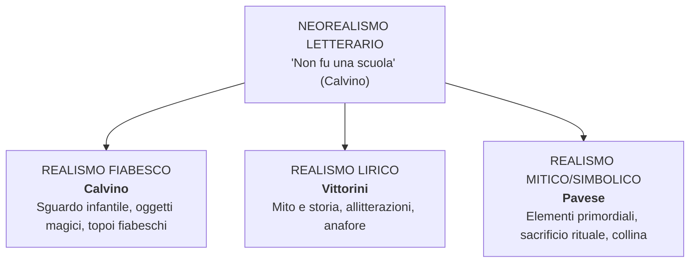

# RIASSUNTO: Il Neorealismo Letterario

> **Fonti**: Lezioni del 22/01, 26/01, 27/01, 29/01, 30/01, 02/02, 09/02/2026
> **Scopo**: Preparazione esame di Italiano — Maturità

---

## Indice

1. [Quadro generale](#1-quadro-generale-del-neorealismo-letterario)
2. [Prefazione del '64 di Calvino](#2-la-prefazione-del-64-di-calvino--manifesto-del-neorealismo)
3. [Calvino — Il sentiero dei nidi di ragno](#3-italo-calvino--il-sentiero-dei-nidi-di-ragno)
4. [Vittorini — Conversazione in Sicilia e il Politecnico](#4-elio-vittorini--conversazione-in-sicilia-e-il-politecnico)
5. [Pavese — Dal realismo mitico al dramma esistenziale](#5-cesare-pavese--dal-realismo-mitico-al-dramma-esistenziale)
6. [Fenoglio — Una questione privata](#6-beppe-fenoglio--una-questione-privata)
7. [Viganò — L'Agnese va a morire](#7-renata-viganò--lagnese-va-a-morire)
8. [Confronti tra autori](#8-confronti-tra-autori-e-declinazioni-del-realismo)
9. [Q&A da interrogazione](#9-domande-reali-da-interrogazione-qa)
10. [Lacune e materiale da integrare](#10-lacune-e-materiale-da-integrare)

---

## 1. Quadro generale del Neorealismo letterario

### 1.1 Definizione e confini

| | Neorealismo **cinematografico** | Neorealismo **letterario** |
|---|---|---|
| **Confini** | Più definiti e netti | Più sfumati e controversi |
| **Durata** | ~10 anni (*Ossessione* 1942 → *Miracolo a Milano*) | Dagli anni '40 agli anni '50+ |
| **Omogeneità** | Contenuti, stile e cronologia condivisi | Personalità eterogenee con tratti peculiari |
| **Denominatore comune** | Realtà quotidiana, attori non professionisti, location reali | Disponibilità al dibattito civile, sociale e politico |

### 1.2 Obiettivi

1. **Occuparsi dei problemi reali del Paese**
2. **Creare un dialogo con il pubblico** (vs. elitarismo dell'Ermetismo)
3. **Rifiutare il classicismo e le forme estetizzanti** per privilegiare i contenuti
4. **Direzione politico-sociale dell'antifascismo**
5. **Adeguamento della lingua**: prosa verso il parlato, lessico e sintassi che ricalcano i dialetti

### 1.3 Citazione di Carlo Bo

> *"La parola neorealismo usata in letteratura non definisce niente di intrinseco che sia comune a tutti i nostri scrittori [...] tu hai tanti neorealismi quanti sono i principali narratori."*

Il neorealismo letterario non è un blocco monolitico: ogni autore lo declina in modo diverso.

### 1.4 Triade dei modelli (Calvino, Prefazione '64)

- **I Malavoglia** (Verga) → realtà umile, voce anonima/corale
- **Paesi tuoi** (Pavese, 1941) → vita contadina piemontese, dimensione mitica
- **Conversazione in Sicilia** (Vittorini, 1941) → ritorno alle origini, realismo lirico

### 1.5 Autori principali

| Autore | Opera/e | Tipo di realismo | Ambientazione |
|---|---|---|---|
| **Calvino** | *Il sentiero dei nidi di ragno* (1947) | Fiabesco | Liguria |
| **Vittorini** | *Conversazione in Sicilia* (1941), *Uomini e No* (1945) | Lirico | Sicilia, Milano |
| **Pavese** | *Paesi tuoi* (1941), *La casa in collina* (1948), *La luna e i falò* (1950) | Mitico/simbolico | Piemonte, Langhe |
| **Fenoglio** | *Una questione privata*, *Il partigiano Johnny* | — | Langhe, Alba |
| **Viganò** | *L'Agnese va a morire* (1949) | Documentaristico | Romagna, Valli di Comacchio |

---

## 2. La Prefazione del '64 di Calvino — Manifesto del Neorealismo

> Testo: Prefazione alla riedizione del 1964 de *Il sentiero dei nidi di ragno* (p. 319)
> La prof la definisce: *"una sorta di dichiarazione di poetica del neorealismo in letteratura"*

### Passi-chiave e commento

**1. Il libro come prodotto collettivo**
Calvino rilegge il romanzo a vent'anni di distanza e non lo riconosce come "suo", ma come nato da una **collettività anonima**: *"un clima generale, una tensione morale, un gusto letterario"*. Collegamento con Verga: anche Verga dà spazio a una voce anonima (il coro del paese).

**2. L'esplosione letteraria come fatto collettivo**
> *"L'esplosione letteraria fu, prima che un fatto d'arte, un fatto fisiologico, esistenziale, collettivo."*

I giovani scrittori si sentono **vincitori**, non vittime — c'è una "carica propulsiva" della battaglia appena conclusa.

**3. Immediatezza di comunicazione**
L'esperienza condivisa di guerra stabilisce un **rapporto paritario** scrittore-pubblico, contro l'**Ermetismo** degli anni '30 (poesia difficile, oscura, destinata a un'élite, lontana dai problemi reali). *"Si era faccia a faccia, alla pari, carichi di storie da raccontare."*

**4. La "smania di raccontare"**
La libertà ritrovata genera una **smania di comunicare**: nei treni, nelle mense del popolo, nelle code ai negozi — tutti raccontano le proprie vicissitudini.

**5. Non documentare, ma esprimere**
- **Esprimere** < lat. *ex-premo* → "ciò che preme da dentro e ha bisogno di uscire"
- Differenza tra **documentare** (oggettivo) ed **esprimere** (soggettivo, emotivo): *"noi stessi, il sapore aspro della vita"*

**6. "Il Neorealismo non fu una scuola"** (la prof: *"stampatevelo bene in testa"*)
A differenza della Scuola Siciliana, non aveva regole codificate. Fu *"un insieme di voci in gran parte periferiche, una molteplice scoperta delle diverse Italie"*.

**7. Le Italie periferiche**
Entrano nella letteratura le aree mai toccate: la Liguria di Calvino, il Piemonte di Pavese e Fenoglio, le Langhe. Un'Italia **rurale, contadina, operaia, regionale, marginale**. Legame col romanzo verista.

**8. La Resistenza come imperativo narrativo**
Raccontare fatti così brucianti era difficile. **Parallelo con Primo Levi**: *Se questo è un uomo* fu rifiutato nell'immediato dopoguerra e divenne un successo solo 10-15 anni dopo (rimozione collettiva).

**9. Affrontare il tema "di scorcio"**
Calvino sceglie di non raccontare la Resistenza **di petto** (frontalmente → rischio di retorica) ma **di scorcio** (tangenzialmente), attraverso gli occhi di un bambino: Pin.

---

## 3. Italo Calvino — *Il sentiero dei nidi di ragno*

### Trama

| Elemento | Dettaglio |
|---|---|
| **Pubblicazione** | 1947 |
| **Ambientazione** | Liguria, dopo l'8 settembre 1943 |
| **Protagonista** | **Pin**, ragazzino orfano di madre, vive con la sorella che si prostituisce |
| **Evento scatenante** | Ruba una pistola a un soldato tedesco |
| **Il luogo segreto** | Nasconde la pistola dove fanno i nidi i ragni |
| **Sviluppo** | In carcere entra in contatto coi partigiani, si aggrega dopo la fuga |

### Pin: il personaggio

Pin è **troppo maturo** per i bambini e **estraneo** per età al mondo degli adulti → condannato alla **solitudine**. La pistola diventa un **oggetto magico** (come nelle fiabe), nascosto nel luogo segreto dei nidi di ragno.

### Il "realismo fiabesco"

- **Fiabesco**: la pistola = oggetto magico; sentiero, bosco, luogo segreto = topoi fiabeschi; realtà filtrata dall'immaginazione infantile
- **Realistico**: periodo storico preciso (Resistenza), stile del parlato, condizioni sociali misere

Le due dimensioni **coesistono**: il reale viene filtrato e trasfigurato dallo sguardo del bambino.

### Scelta antiretorica e antiagiografica ⚠️ *"ve lo chiederò all'esame"*

- **Agiografia** = scritti delle vite dei santi → Calvino vuole evitare la "santificazione" della Resistenza
- Il punto di vista di Pin consente di raccontare con **maggiore autenticità** la lotta partigiana: il suo eroismo, ma soprattutto le sue **incertezze, fragilità, disorganizzazione, conflitti interni**

### Analisi del brano "La solitudine di Pin" (pp. 325-327)

Pin, solo nei vicoli, rifiutato dai coetanei, si rifugia nel mondo degli adulti. Chiusura con *"la nebbia di solitudine che ti si condensa nel petto"*:
- **Nebbia** → smarrimento, indeterminatezza
- **Si condensa** → si aggruma, crea un peso nel petto

**Metodo per l'analisi del testo (esame):**
1. **Riassunto**: dividere in sequenze, frasi nominali, testo breve al presente con connettivi
2. **Analisi**: figure retoriche (ripetizioni, metafore), usi morfologici/sintattici, scelte lessicali
3. **Interpretazione complessiva**: collocare nel Neorealismo, tema del passaggio infanzia → maturità, collegamenti (cinema neorealista: *Germania anno zero*, *Ladri di biciclette*)

> **Indicazioni esame**: 4-5 colonne; comprensione + analisi ~2,5; interpretazione ~2-2,5; conclusione efficace; mai introdurre novità nella conclusione; restare **aderenti al testo**

---

## 4. Elio Vittorini — *Conversazione in Sicilia* e *Il Politecnico*

### Profilo

Nasce in Sicilia, si trasferisce al Nord. Azioni clandestine per il **PCI** durante la guerra. Scrittore e **animatore culturale**.

### Il Politecnico (1945)

Rivista fondata a Milano con cui propone: svecchiamento della cultura italiana, apertura alla psicanalisi, collegamento intellettuali-popolo, apertura alla **cultura americana** → con Pavese realizza l'antologia ***Americana*** (1941, censurata dal regime).

### Polemica Vittorini-Togliatti (1946-47)

- **Togliatti**: l'arte deve essere **al servizio** della politica
- **Vittorini**: l'arte deve essere **autonoma** — **"non deve suonare il piffero della rivoluzione"**

> Parallelo: anche Pasolini ebbe rapporti difficili col PCI → fu espulso perché omosessuale.

### *Conversazione in Sicilia* (1941) — Capolavoro

**Trama**: Silvestro Ferrauto torna in Sicilia per visitare la madre infermiera. Il giro delle iniezioni diventa occasione per incontrare diversi personaggi del popolo.

**Realismo lirico**: narrazione tra mito e storia, realtà utopistica e simbolica, procedimenti lirici (allitterazioni, ripetizioni, anafore).

#### Analisi dell'incipit — Gli "astratti furori" (p. 62)

| Espressione | Analisi |
|---|---|
| *"astratti furori"* | Espressione proverbiale. Rabbia profonda ma **non direzionata**, senza motivo apparente |
| *"non eroici, non vivi"* | **Climax discendente**: non trovano manifestazione |
| *"genere umano perduto"* | Causa implicita: guerra, dittatura, Guerra Civile di Spagna |
| *"col capo chino"* | Rassegnazione, inerzia |
| *"giornali squillanti"* | **Sinestesia** (visivo + uditivo) |
| *"chinavo il capo"* ripetuto | **Epifora** — distacco emotivo da amicizia e amore |
| *"scarpe rotte"* | Povertà, fatica del vivere |
| *"quiete nella non speranza"* | **Accidia** (Petrarca): indifferenza totale verso tutto |

---

## 5. Cesare Pavese — Dal realismo mitico al dramma esistenziale

### Profilo

| Elemento | Dettaglio |
|---|---|
| **Origine** | Santo Stefano Belbo (Langhe) |
| **Attività** | Romanziere, poeta, traduttore per **Einaudi** |
| **Traduzione** | *Moby Dick* e altri capolavori americani |
| **Non partecipa alla Resistenza** | A differenza di Calvino |
| **Iscrizione PCI** | 1948, quasi a "risarcimento" del mancato impegno |
| **Suicidio** | Estate **1950**, Hotel Roma, Torino. Aveva 42 anni |

### Temi centrali

Città vs campagna (Torino/Langhe), terra natìa e sradicamento, infanzia come età mitica, collina come simbolo di isolamento, Resistenza come guerra civile e senso di colpa, **realismo mitico/simbolico** (elementi primordiali: sangue, terra, latte, fuoco, sacrificio rituale).

### *Paesi tuoi* (1941)

**Trama**: Berto e Talino escono dal carcere, vanno nella cascina di Talino nelle Langhe. Gisella (sorella di Talino) viene uccisa dal fratello, accecato dalla gelosia per una relazione incestuosa. *"Talino le aveva piantato il tridente nel collo."*

**Elementi simbolici**: sangue, fango, sudore, acqua, mammelle scoperte, tridente, terra, latte → la morte di Gisella come **sacrificio rituale**, dimensione selvaggia e ancestrale.

**Stile**: scarno, rapido, paratattico, sequenze dialogiche, lessico semplice vicino al parlato. Mette in luce **barbarie, violenza, bestialità** senza idealizzazione.

### Trilogia neorealista

| Opera | Anno | Note |
|---|---|---|
| *Il carcere* | 1938-39 | Fra le primissime opere |
| *Il compagno* | 1947 | Romanzo di formazione, il più discutibile |
| *La casa in collina* | 1948 | **Capolavoro assoluto** |

### *La casa in collina* (1948) — Analisi

**Trama**: Corrado, intellettuale, si rifugia in collina durante la guerra rifiutando di agire. Incontra Cate (ex relazione) con il figlio Dino. Rimane in stallo e inerzia. **Corrado = Pavese**: intellettuale incapace di incidere sulla realtà.

**Passi-chiave**:
- *"Niente è accaduto"* → marginalità, isolamento; la guerra procura solo "fastidio e vergogna"
- *"Gli eroi di queste valli sono tutti ragazzi"* → la Resistenza come impresa dei giovani
- *"La collina resta un paese d'infanzia, di falò e di scappate"* → infanzia come età mitica
- *"Ho vissuto un solo lungo isolamento, una futile vacanza"* → isolamento come condizione permanente

**⚠️ Passo fondamentale** (*"vi prego di tenere a mente"*):
> *"Ogni guerra è una guerra civile: ogni caduto somiglia a chi resta, e gliene chiede ragione."*

**Doppio significato**: (1) storico — la Resistenza è guerra tra italiani; (2) universale — ogni essere umano appartiene alla stessa umanità. Il sentimento verso il nemico è profonda **compassione**.

### *La luna e i falò* (1950) — Ultimo romanzo

**Anguilla** torna nelle Langhe dopo anni. I falò **rituali** (per propiziare raccolti) sono stati sostituiti dai **falò di distruzione** della guerra. Temi: sradicamento, ricordo, estraneità. **Capolavoro assoluto** di Pavese.

---

## 6. Beppe Fenoglio — *Una questione privata*

### Profilo

Delle Langhe come Pavese (zona di Alba). Partecipa alla Resistenza.

### Analisi del brano

**Milton**, partigiano, è ossessionato dal dubbio che **Fulvia** (donna amata) abbia avuto una relazione con **Giorgio** (altro partigiano). L'ossessione irrompe nella vita militare: *"Più niente mi importa [...] la guerra, la libertà, i compagni, i nemici. Solo più quella verità."*

**Flashback**: Milton al campo da tennis con Fulvia e Giorgio. È **povero** (non può pagarsi una bibita), Fulvia è benestante. È timido, sognatore, con una poesia di Yeats in tasca — povero di mezzi, ma di grande profondità intellettuale.

**Tecniche narrative**: alternanza di sequenze dialogiche, sequenze narrative brevi, discorso indiretto libero, flashback.

**"Crepassi... creperei"**: morire a 30 anni = morire vecchi in tempo di guerra. **Poliptoto** con scelta lessicale cruda che esprime la vicinanza quotidiana alla morte.

---

## 7. Renata Viganò — *L'Agnese va a morire*

### Inquadramento

Pubblicazione 1949. Ambientazione: Romagna, Valli di Comacchio. Film di Giuliano Montaldo (anni '70).

### Trama

**Agnese**: contadina analfabeta di mezza età. Il marito Palita viene deportato e morirà. L'uccisione del suo gatto da parte di un soldato tedesco la spinge a diventare **staffetta partigiana** ("mamma Agnese").

### Caratteristiche neorealiste

- Mossa da **sentimenti emotivi** (rabbia, vendetta), **non da ideologia politica**
- Verità e tratti del territorio romagnolo, articolo prima del nome proprio ("l'Agnese"), lessico del parlato
- **Non è una figura femminile di rottura**: si inserisce nel filone della donna materna, prudente

---

## 8. Confronti tra autori e declinazioni del realismo

### Tre declinazioni

### Rapporto con la Resistenza

| Autore | Rapporto |
|---|---|
| **Calvino** | Partecipa → racconta "di scorcio", attraverso Pin |
| **Pavese** | Non partecipa → senso di colpa, isolamento, inerzia |
| **Vittorini** | Partecipa ad azioni clandestine → rivendica autonomia dell'arte |
| **Fenoglio** | Partecipa → intreccia con la questione privata |
| **Viganò** | Esperienza diretta → romanzo quasi documentaristico |

### Rapporto con Verismo e con Ermetismo

**Col Verismo** (Verga, fine '800): condividono realtà umile, voce corale, Italia rurale, lingua dialettale. Il Neorealismo aggiunge: impegno politico antifascista, tema della Resistenza, smania di comunicare.

**Con l'Ermetismo** (anni '30): il Neorealismo si oppone in tutto — linguaggio diretto vs. oscuro, pubblico popolare vs. élite, temi reali vs. astratti, contenuto vs. estetica, rapporto paritario vs. distante.

---

## 9. Domande reali da interrogazione (Q&A)

**D: Caratteristiche del Neorealismo cinematografico?**
R: Corrente anni '40-'50, cinema impegnato sui problemi reali dell'Italia (vs. cinema fascista), temi di guerra, Resistenza, scene in strada.

**D: Film precursore? Perché, se non ha temi di guerra?**
R: *Ossessione* di Visconti (1942). Rompe il mito della famiglia tradizionale. Mostrare la realtà senza idealizzazioni è già scandaloso.

**D: Pasolini e il popolo?**
R: In *Ragazzi di vita* (1955) e *Accattone* (1961) ritrae il **sottoproletariato urbano** delle borgate romane come anima autentica del popolo. Forte **ricerca stilistica** (immagini squallide + musica classica).

**D: Agnese è una figura femminile di rottura?**
R: **No**. Si inserisce nel filone della donna materna, prudente. Va detto esplicitamente.

**D: Naturalismo vs. Verismo?**
R: Francia vs. Italia. Entrambi determinismo sociale (Taine). Ma: i Naturalisti (Zola) vogliono migliorare la società; Verga ha concezione negativa del progresso.

**D: Ideale dell'ostrica?**
R: Restare ancorati alla famiglia come l'ostrica allo scoglio. Allontanarsi = essere sconfitti.

**D: Tipologia A su autore noto con testo non noto?**
R: Restare **aderenti al testo**. Mai attribuire caratteristiche di altre opere.

**D: Tracce dell'esame?**
R: 7 totali: 2 tipologia A, 3 tipologia B, 2 tipologia C.

---

## 10. Lacune e materiale da integrare

### Contenuti da studiare autonomamente

| Contenuto | Status |
|---|---|
| **Fenoglio — approfondimento e *Il partigiano Johnny*** | 🔴 Non spiegato, da studiare sul libro |
| **Calvino — vita** (pp. 308-309) e trama del *Sentiero* (pp. 315-317) | 🟡 Da leggere |
| **Pavese — *La luna e i falò*** (analisi completa) | 🟡 Solo accenni |
| **Pavese — poesia** | 🔴 Solo citata |
| **Vittorini — *Uomini e No*** | 🔴 Solo citato |
| **Vittorini — pp. 60-63** | 🟡 Testo + analisi assegnato |

### ⚠️ Avvertimenti della prof per l'esame

1. *"Studiatelo perché ve lo chiederò all'esame"* → **realismo fiabesco** di Calvino e punto di vista **antiagiografico**
2. *"Vi prego di tenere a mente"* → **"ogni guerra è una guerra civile"** (Pavese)
3. Non attribuire caratteristiche errate a un testo dell'esame
4. Fare sempre la **scaletta** prima di scrivere
5. Procedere con **ordine cronologico**
6. **Commentare** le citazioni, non limitarsi a citare
