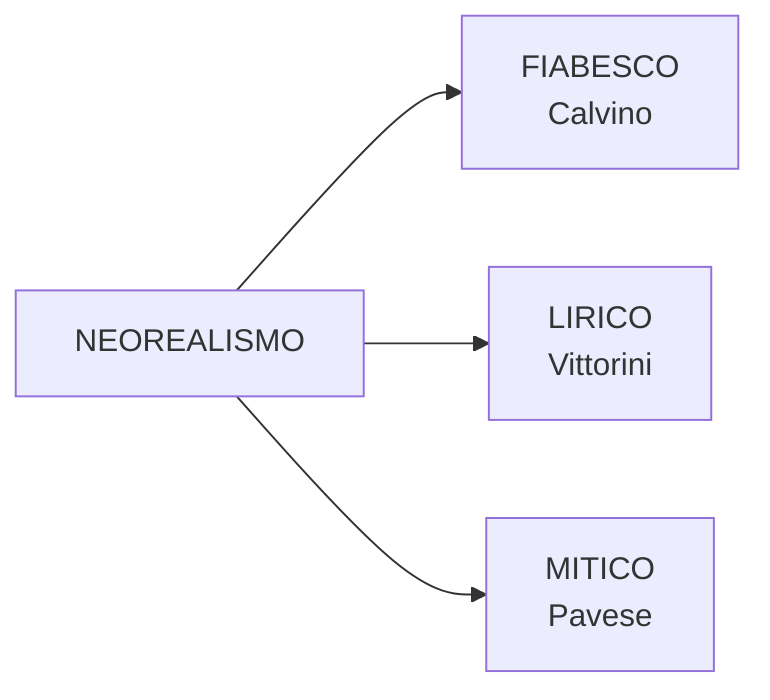

# RIPASSO VELOCE: Il Neorealismo Letterario

---

## 1. Definizione e caratteri generali

- **Non fu una scuola** (Calvino, Prefazione '64) — nessuna regola codificata
- Confini più sfumati del neorealismo cinematografico
- Ogni autore lo declina diversamente (Carlo Bo: *"tanti neorealismi quanti sono i narratori"*)

**5 obiettivi**:
1. Problemi reali del Paese
2. Dialogo con il pubblico (vs. Ermetismo elitario)
3. Rifiuto del classicismo → privilegio ai contenuti
4. Direzione politica antifascista
5. Lingua verso il parlato e i dialetti

**Triade dei modelli**:
- *I Malavoglia* (Verga) — voce corale, realtà umile
- *Paesi tuoi* (Pavese, 1941) — vita contadina, dimensione mitica
- *Conversazione in Sicilia* (Vittorini, 1941) — realismo lirico

---

## 2. Prefazione del '64 di Calvino — Concetti-chiave

| Concetto | Sintesi |
|---|---|
| Libro come prodotto collettivo | Nato da clima generale, tensione morale, gusto letterario |
| Esplosione letteraria | Fatto fisiologico, esistenziale, collettivo — non solo arte |
| Rapporto scrittore-pubblico | **Paritario** (stesse esperienze di guerra) vs. Ermetismo |
| Smania di raccontare | Forza interiore post-liberazione, tutti narrano le proprie vicissitudini |
| Non documentare, ma **esprimere** | *Ex-premo* = ciò che preme da dentro e deve uscire |
| Non fu una scuola | Voci periferiche, scoperta delle diverse Italie |
| Italie periferiche | Aree rurali, regionali, marginali → legame col Verismo |
| Resistenza come imperativo | Tema solenne, difficile da trattare (cfr. Primo Levi rifiutato) |
| Affrontare "di scorcio" | Tangenzialmente, tramite Pin bambino, per evitare retorica |

---

## 3. Autori — Sinossi

| Autore | Opera principale | Realismo | Resistenza | Ambientazione |
|---|---|---|---|---|
| **Calvino** | *Il sentiero dei nidi di ragno* (1947) | **Fiabesco** | Partecipa | Liguria |
| **Vittorini** | *Conversazione in Sicilia* (1941) | **Lirico** | Azioni clandestine PCI | Sicilia |
| **Pavese** | *Paesi tuoi*, *La casa in collina*, *La luna e i falò* | **Mitico/simbolico** | Non partecipa | Langhe |
| **Fenoglio** | *Una questione privata* | — | Partecipa | Langhe, Alba |
| **Viganò** | *L'Agnese va a morire* (1949) | Documentaristico | Esperienza diretta | Romagna |

---

## 4. Calvino — *Il sentiero dei nidi di ragno*

- **Pin**: ragazzino orfano, troppo maturo per i bambini, estraneo agli adulti → **solitudine**
- Ruba una pistola a un tedesco → la pistola = **oggetto magico** (fiabesco)
- Sentiero, bosco, luogo segreto = **topoi fiabeschi**
- **Realismo fiabesco**: realtà della Resistenza filtrata dallo sguardo infantile
- **Scelta antiagiografica** ⚠️ *chiesto all'esame*: evitare la "santificazione", mostrare incertezze e fragilità della lotta partigiana
- Metafora-chiave: *"nebbia di solitudine che ti si condensa nel petto"*

---

## 5. Vittorini — *Conversazione in Sicilia*

- Silvestro Ferrauto torna in Sicilia dalla madre infermiera → incontra personaggi del popolo
- **Realismo lirico**: mito + storia, allitterazioni, ripetizioni, anafore
- Incipit: **"astratti furori"** = rabbia profonda ma non direzionata, inerzia, accidia
- Figure retoriche: sinestesia (*"giornali squillanti"*), epifora (*"chinavo il capo"*)
- *"Scarpe rotte"* = povertà e fatica del vivere
- **Il Politecnico** (1945): rivista per svecchiare la cultura, apertura all'America
- **Polemica con Togliatti**: l'arte **non deve "suonare il piffero della rivoluzione"**
- Con Pavese: antologia ***Americana*** (1941, censurata)

---

## 6. Pavese

### Profilo essenziale

- Santo Stefano Belbo (Langhe), traduttore di *Moby Dick*, editore Einaudi
- **Non partecipa alla Resistenza** → senso di colpa → iscrizione PCI 1948
- **Suicidio**: estate 1950, Hotel Roma, Torino, a 42 anni

### Temi centrali

- Città (alienazione) vs. campagna (radici/mito)
- Infanzia come età mitica, impossibilità del ritorno
- Collina = isolamento dell'intellettuale
- Elementi primordiali: sangue, terra, latte, fuoco
- Ogni guerra è una guerra civile

### Opere-chiave

| Opera | Anno | Punto essenziale |
|---|---|---|
| *Paesi tuoi* | 1941 | Morte di Gisella = sacrificio rituale; barbarie e violenza senza idealizzazione |
| *Il compagno* | 1947 | Romanzo di formazione, il più discutibile |
| *La casa in collina* | 1948 | **Capolavoro**. Corrado = Pavese: intellettuale inerte. |
| *La luna e i falò* | 1950 | Anguilla torna nelle Langhe; falò rituali → falò di distruzione |

### Passo da ricordare ⚠️

> *"Ogni guerra è una guerra civile: ogni caduto somiglia a chi resta, e gliene chiede ragione."*

Doppio significato: (1) storico — Resistenza = italiani vs. italiani; (2) universale — compassione per il nemico, comune umanità.

---

## 7. Fenoglio — *Una questione privata*

- **Milton**: partigiano ossessionato dal dubbio che Fulvia ami Giorgio
- La questione privata invade e cancella tutto il resto (guerra, libertà, compagni)
- Milton è povero, timido, intellettuale (poesia di Yeats in tasca) vs. Fulvia benestante
- Tecniche: dialogo, narrazione breve, discorso indiretto libero, flashback
- **"Crepassi... creperei"** = poliptoto, morire a 30 anni = morire vecchi in guerra

---

## 8. Viganò — *L'Agnese va a morire*

- Contadina analfabeta → staffetta partigiana dopo deportazione del marito e uccisione del gatto
- Mossa da **emozioni** (rabbia, vendetta), **non da ideologia**
- **Non è una figura femminile di rottura** (donna materna, prudente)
- Tratti romagnoli: "l'Agnese" (articolo + nome proprio), lessico del parlato

---

## 9. Confronti sinottici

### Tre declinazioni del realismo

### Neorealismo vs. Ermetismo

| | Ermetismo (anni '30) | Neorealismo (anni '40-'50) |
|---|---|---|
| Linguaggio | Oscuro, levigato | Parlato, dialettale |
| Pubblico | Élite | Popolo |
| Temi | Astratti | Reali |
| Rapporto scrittore-pubblico | Distante | Paritario |

### Neorealismo vs. Verismo

Condivisioni: realtà umile, voce corale, Italia periferica, lingua dialettale.
Aggiunte del Neorealismo: impegno antifascista, Resistenza, smania di comunicare.

---

## 10. Per l'esame — Checklist

- [ ] **Realismo fiabesco** di Calvino e scelta **antiagiografica** → *"ve lo chiederò"*
- [ ] **"Ogni guerra è una guerra civile"** di Pavese → *"vi prego di tenere a mente"*
- [ ] Non attribuire caratteristiche errate a un testo (es. Verga pre-verista ≠ verista)
- [ ] Restare **aderenti al testo** in comprensione e analisi
- [ ] Collegamenti solo nell'interpretazione complessiva
- [ ] Fare la **scaletta** prima di scrivere
- [ ] Ordine cronologico
- [ ] **Commentare** le citazioni, non solo citarle
- [ ] 4-5 colonne; comprensione+analisi ~2,5; interpretazione ~2-2,5

### Lacune da colmare 🔴

- Fenoglio — approfondimento e *Il partigiano Johnny*
- Pavese — *La luna e i falò* (analisi completa) e poesia
- Vittorini — *Uomini e No* e pp. 60-63 del manuale
- Calvino — vita (pp. 308-309) e trama *Sentiero* (pp. 315-317)
