# MEGA-SCHEMA DI STUDIO — GIOVANNI PASCOLI

> **Fonti**: lezioni del 16/02/26, 17/02/26, 23/02/26, 24/02/26, 26/02/26, 02/03/26
> **Ultimo aggiornamento**: compilato dalle trascrizioni di tutte le lezioni in classe

---

## INDICE

1. [Contesto: dal Simbolismo francese al Decadentismo italiano](#1-contesto-dal-simbolismo-francese-al-decadentismo-italiano)
2. [Biografia di Giovanni Pascoli](#2-biografia-di-giovanni-pascoli)
3. [Il "caso clinico" Pascoli — Vittorino Andreoli](#3-il-caso-clinico-pascoli--vittorino-andreoli)
4. [Poetica: Il Fanciullino](#4-poetica-il-fanciullino)
5. [Lingua e stile](#5-lingua-e-stile)
6. [Le raccolte poetiche](#6-le-raccolte-poetiche)
7. [Analisi dei testi poetici](#7-analisi-dei-testi-poetici)
   - 7.1 [Arano (*Myricae*)](#71-arano-myricae)
   - 7.2 [Lavandare (*Myricae*)](#72-lavandare-myricae)
   - 7.3 [X Agosto (*Myricae*)](#73-x-agosto-myricae)
   - 7.4 [Temporale (*Myricae*)](#74-temporale-myricae)
   - 7.5 [L'assiuolo (*Myricae*)](#75-lassiuolo-myricae)
   - 7.6 [Il gelsomino notturno (*Canti di Castelvecchio*)](#76-il-gelsomino-notturno-canti-di-castelvecchio)
   - 7.7 [La tovaglia (*Canti di Castelvecchio*)](#77-la-tovaglia-canti-di-castelvecchio)
   - 7.8 [Nebbia (*Canti di Castelvecchio*)](#78-nebbia-canti-di-castelvecchio)
8. [Pascoli e D'Annunzio: confronto sinottico](#8-pascoli-e-dannunzio-confronto-sinottico)
9. [Mappa tematica complessiva](#9-mappa-tematica-complessiva)
10. [Compiti, pagine da studiare e riferimenti al libro](#10-compiti-pagine-da-studiare-e-riferimenti-al-libro)
11. [Domande da interrogazione](#11-domande-da-interrogazione)

---

## 1. Contesto: dal Simbolismo francese al Decadentismo italiano

### Il ruolo del poeta nel Simbolismo

La prof ha ricapitolato il percorso dal **Simbolismo francese** al **Decadentismo italiano**:

- **Baudelaire**, **Verlaine**, **Rimbaud** gettano le basi per il Decadentismo italiano (ultimi decenni dell'Ottocento).
- Il ruolo del poeta è stato analizzato attraverso due testi di Baudelaire:
  1. ***La perdita dell'aureola*** (dallo *Spleen di Parigi*) — prosa: **perdita di sacralità** del poeta in una società improntata solo all'utile
  2. ***L'albatro*** (da *I fiori del male*) — poesia: il poeta come grande uccello marino, re dell'azzurro nei cieli ma goffo e deriso quando costretto a terra → **isolamento e marginalità** del poeta nella società borghese
- **Corrispondenze** di Baudelaire: testo fondamentale per la concezione della realtà come rete di **simboli** da decifrare

### La "Lettera del Veggente" di Rimbaud

> Il poeta deve farsi **veggente**: deve essere in grado di vedere ciò che l'uomo comune non vede, disvelando il mistero dell'esistenza e della realtà.

La realtà **non è indagabile razionalmente** ma è un **mistero** da disvelare attraverso l'**irrazionalità**, l'**illuminazione**, l'**intuizione**.

### La matrice comune Pascoli–D'Annunzio

Nonostante poetiche apparentemente opposte, Pascoli e D'Annunzio condividono:

- **Sfiducia nella scienza** e nella conoscenza razionale
- Concezione della realtà come **misteriosa, complessa, allusiva**
- La convinzione che la realtà si conosca attraverso **intuizione e illuminazione**, non attraverso causa ed effetto
- Entrambi partono dallo stesso presupposto del Simbolismo, ma gli **esiti sono opposti**

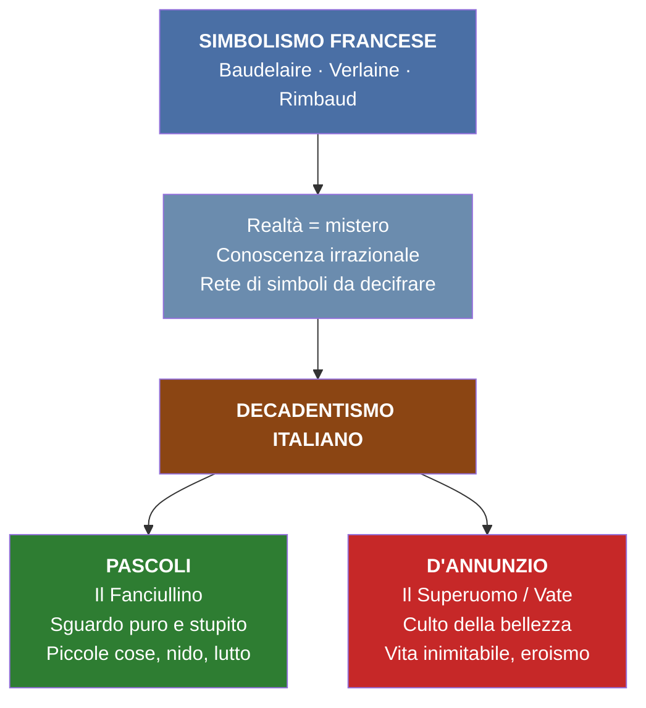

---

## 2. Biografia di Giovanni Pascoli

### Timeline biografica

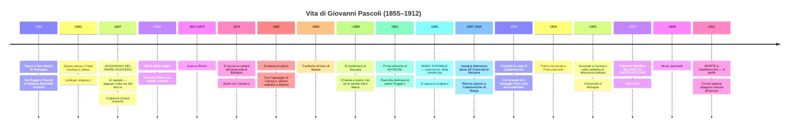

### I luoghi di Pascoli

| Luogo | Periodo | Significato |
|-------|---------|-------------|
| **San Mauro di Romagna** | Nascita e infanzia | Romagna: mondo rurale, flora e fauna tra collina e mare. La Romagna ritorna frequentemente nella sua poesia. "Scrive anche un'ode alla piadina" (cit. prof) |
| **Urbino** | Studi giovanili | Collegio religioso dei Padri Scolopi |
| **Bologna** | Università | Studia Lettere, si laurea in greco. Poi vi torna come successore di Carducci (1905) |
| **Matera** → **Massa** | Insegnamento liceale | Prima esperienza professionale, ottenuta con l'interessamento di Carducci |
| **Castelvecchio di Barga** (Lucca) | Maturità | Casa di campagna acquistata con le medaglie d'oro. Vi vive con la sorella Maria (Mariù). Luogo della morte |

### La morte del padre — evento fondante

- **Ruggero Pascoli** era amministratore della tenuta "**La Torre**" dei principi Torlonia (visitabile ancora oggi, all'interno di un parco della poesia con museo dedicato a Pascoli)
- La carica era **ben remunerata** e ambita
- Fu probabilmente assassinato da **due sicari** per conto di un uomo che aspirava a quel ruolo
- La Romagna dell'epoca era "una terra violenta di banditi, di fuorilegge" (cit. prof)
- I colpevoli **rimasero impuniti**: nessuna giustizia
- La morte arriva **inaspettata**, con un colpo di fucile, mentre tornava a casa la sera del **10 agosto 1867**
- L'anno successivo muore anche la **madre**; poi in successione una sorella e un fratello
- Per la critica letteraria, **tutta la produzione di Pascoli** è interpretabile come tentativo di **rielaborazione del lutto**

> **Nota della prof** (16/02/26): il film *Zvanì* di Giuseppe Piccioni (andato in onda sulla Rai) racconta la vicenda umana di Pascoli. "Zvanì" è il soprannome dialettale = Giovannino. La prof non lo consiglia: "non sono neanche riuscita a guardarlo tutto".

### Il nido e le sorelle

Il tentativo di **ricostituzione del nido familiare** è un tema centrale:

1. Pascoli chiama a vivere con sé le sorelle **Ida** e **Maria** in Toscana
2. Nel 1895 Ida si sposa a Sogliano → per Pascoli è l'**"anno terribile"**
3. A livello psichico, Pascoli investe la sorella maggiore Ida della figura della **madre**
4. Il tentativo di ricreare il nido esprime una **resistenza al cambiamento**, al mondo esterno, alla possibilità di costruirsi una famiglia propria
5. Dopo il matrimonio di Ida, resta con la sorella minore **Maria (Mariù)** — presenza "costante e ossessionante"

### Posizione politica

- Inizialmente vicino al **socialismo** di **Andrea Costa** → breve parentesi politica, **incarcerato a Bologna** e poi liberato
- Successivamente orientato verso il **nazionalismo**
- A differenza di D'Annunzio, **non partecipa attivamente** alle vicende del suo tempo

---

## 3. Il "caso clinico" Pascoli — Vittorino Andreoli

> **Riferimento bibliografico**: Vittorino Andreoli, *I segreti di casa Pascoli. Il poeta e lo psichiatra*

Lo psichiatra **Vittorino Andreoli** ha condotto un'indagine a posteriori sulla vita di Pascoli, trattandola come un **caso clinico**:

### Metodo d'indagine

- Studio di **scritti privati**, lettere, appunti, abbozzi
- Analisi di **oggetti, fotografie, indumenti** (ha aperto gli armadi di casa Pascoli)
- Visita dei luoghi in cui visse con la sorella
- Interpretazione di fatti **stravolti dalle versioni ufficiali**
- Consultazione della **documentazione sanitaria** dell'archivio di Castelvecchio

### Risultati dell'indagine

#### 1. Il trauma

La morte del padre rappresenta una **frattura** (trauma = rottura). Fondamentale è che rimase **senza colpevoli**: nessuna giustizia, morte del tutto inaspettata.

#### 2. L'ipotesi dell'alcolismo

- Andreoli avanza l'ipotesi a partire anche dall'analisi dei **documenti fotografici**: la **circonferenza dell'addome** nelle foto era tipica di un consumatore assiduo di alcol
- **Lettera a Maria** (documento privato): *"Vado a letto quasi sempre con la **testa piena di cognac**. Non sono sereno. Questo è l'anno terribile. Dell'anno terribile questo è il mese più terribile."*
- Nella stessa lettera: *"Dimmi Mariù: tu mi ami da sorella, perché ti dà dispiacere che io ami una donna da amante, da sposa, da marito?"*

#### 3. Rapporto morboso con le sorelle

- Pascoli nutre sentimenti verso Ida che sfociano forse in qualcosa di **morboso, incestuoso** (tesi di Andreoli)
- **Gelosia ossessiva di Mariù**: considerava il fratello non come un fratello, ma come un **marito** da tenere sotto controllo
- Episodio: Mariù aveva stabilito che le camere da letto fossero adiacenti e metteva un **filo ancorato a un dito del piede** di ciascuno per verificare che non ci fossero spostamenti notturni
- Maria non ha mai cercato un fidanzato né pensato di sposarsi
- Il **cane Gulì** è interpretato da Andreoli come "il **figlio di una coppia sterile**" — perno dell'unione affettiva tra Giovanni e Mariù

#### 4. La morte — cirrosi epatica

> "Giovanni Pascoli muore alle 15:20 del 6 aprile 1912 di **cirrosi epatica**" — Andreoli, sulla base dei documenti ospedalieri

- Cirrosi epatica = malattia del fegato legata all'abuso di alcol → rapporto di **dipendenza**
- La diagnosi fu **taciuta** all'epoca per non macchiare la commozione nazionale per la morte del poeta
- Testimoniata anche dalle **pancere** ("fasce enormi per altezza e circonferenza") trovate nei cassetti
- Documentazione sanitaria (febbraio 1912): "mostrano tutti i segni delle complicazioni generali di una tale malattia"

#### 5. Il ruolo di Maria dopo la morte

- Diventa **depositaria di tutta l'eredità letteraria** e fornitrice delle "versioni ufficiali"
- Fece seppellire il fratello in una **cappella privata** annessa alla casa di Castelvecchio
- Nel sepolcro lasciò **due aperture** per poter mettere le mani e **toccare i piedi e la testa** del fratello

### Rivalutazione del poeta

> Per molto tempo Pascoli è stato ritenuto il "poeta del fanciullino" in un'aura serena, arcadica. **In realtà** si avvicina molto ai **poeti maledetti** francesi per inquietudini, interiorità e sensibilità. (cit. prof)

La rivalutazione è avvenuta a partire dagli **anni '50**, ma c'è ancora molto da indagare.

> D'Annunzio scrisse: *"Giovanni Pascoli è il più grande e originale poeta apparso in Italia dopo il Petrarca"*

---

## 4. Poetica: Il Fanciullino

### Il testo

- **Anno**: 1897
- **Genere**: prosa poetica — dialogo tra un poeta adulto e la sua anima di fanciullo
- **Definizione**: dichiarazione di poetica

### I passi letti in classe

> *"È dentro noi un fanciullino che non solo ha brividi, ma lagrime e ancora, ancora i gridi suoi. Quando la nostra età è tuttavia tenera, egli confonde la sua voce con la nostra, e dei due fanciulli che ruzzano e contendono tra loro, e insieme sempre temono, sperano, godono, piangono, si sente un palpito solo, uno strillare e un guarire solo."*

**Interpretazione della prof**: dentro di noi c'è un fanciullino; quando siamo piccoli la nostra voce coincide con la sua — due fanciulli che **ruzzano** (scherzano, giocano), temono, sperano, godono, piangono.

> *"Noi accendiamo negli occhi un nuovo desiderare, ed egli vi tiene fissa la sua antica serena **maraviglia**."*

Il fanciullino conserva ciò che l'adulto perde: la **meraviglia**, la capacità di stupirsi.

> *"Noi ingrossiamo e arrugginiamo la voce, ed egli fa sentire tuttavia e sempre il suo tinnulo squillo come di campanello."*

| L'adulto | Il fanciullino |
|----------|----------------|
| Ingrossa e arrugginisce la voce | **Tinnulo squillo come di campanello** |
| Voce profonda, roca | Voce squillante, limpida, cristallina |
| Condizionato da educazione, convenzioni | Sguardo puro, innocente, senza artifici |

**Analisi stilistica di "tinnulo squillo"** (spiegata dalla prof):
- Sono parole **onomatopeiche**: il significante (le lettere) corrisponde al significato
- "Tinnulo" evoca un suono cristallino, non cupo
- "Come di campanello" = **similitudine**
- Insieme: **fonosimbolismo** — il suono richiama un simbolo, esprime un significato simbolico

> *"Il nuovo non si inventa, si scopre."*

Il fanciullino ha la capacità di vedere il **nuovo nelle cose di tutti i giorni** e di meravigliarsene.

> *"Il poeta, se è e quando è veramente poeta, cioè tale che significhi solo ciò che il fanciullo detta dentro [...] riesce ispiratore di buoni civili costumi [...] ma il poeta non deve farlo apposta."*

- Il poeta scrive solo ciò che il **fanciullino gli detta**
- I valori morali e civili emergono **naturalmente**, non come scopo intenzionale
- La poesia di Pascoli **non ha uno scopo educativo deliberato**, ma la dimensione morale emerge come intrinsecamente propria della poesia

> *"Il poeta è poeta, non oratore o predicatore, non filosofo, non istorico, non maestro, non tribuno o demagogo, non uomo di Stato o di corte."*

### Il fanciullino di Pascoli vs. il fanciullo di Leopardi

| Pascoli | Leopardi |
|---------|----------|
| Fanciullino **ferito** | Fanciullo vitale, energico |
| Angosciato, turbato, ripiegato su sé stesso | Immaginativo, attivo |
| Ricerca dolorosa della pace perduta | Capacità immaginativa legata alla giovinezza |

Il fanciullino di Pascoli è un **rimpianto**, un **ricordo**, la **dimensione perduta** che ricerca per tutta la vita: la pace che ha perso e di cui va alla ricerca dolorosa.

### Punti cardine del Fanciullino (sintesi della prof)

1. **Natura irrazionale e intuitiva della poesia** — coerente con il Decadentismo
2. **Potere analogico e suggestivo della poesia** — l'analogia esprime i segreti legami della realtà (metafora ardita, difficile da decifrare)
3. **Poesia come scoperta** — al centro le **umili cose**
4. **Simbolismo** — la realtà è complessa, oscura, misteriosa, fatta di simboli da decifrare (Baudelaire, *Corrispondenze*)
5. **Uso non strumentale della poesia** — nessuna finalità educativa deliberata, solo **funzione consolatrice**

```mermaid
mindmap
  root((**IL FANCIULLINO**))
    Natura irrazionale
      Intuizione
      Illuminazione
      No ragione
    Potere analogico
      Analogia
      Metafora ardita
      Segreti legami
    Scoperta
      Umili cose
      Meraviglia
      Nuovo nelle cose quotidiane
    Simbolismo
      Realtà misteriosa
      Simboli da decifrare
      Baudelaire — Corrispondenze
    Funzione consolatrice
      Non educativa
      Non strumentale
      Valori emergono naturalmente
```

---

## 5. Lingua e stile

### Pascoli fondatore della poesia del Novecento

Secondo lo storico della lingua **Pier Vincenzo Mengaldo**, Pascoli e D'Annunzio sono i **fondatori della poesia del Novecento** — una frattura rispetto al periodo precedente.

**Tre giudizi critici** (citati dalla prof):

| Critico | Definizione |
|---------|-------------|
| (anonimo, citato dalla prof) | **"Disintegratore della forma poetica tradizionale"** — portata innovativa rispetto al passato |
| **Gianfranco Contini** | **"Rivoluzionario nella tradizione"** — recupera modelli tradizionali ma li reinventa |
| **Pier Paolo Pasolini** | Pascoli è "uno degli autori che più di tutti incide sulle **sperimentazioni** di questo secolo" (il Novecento) |

### Il plurilinguismo

Pascoli utilizza registri linguistici diversi mescolati insieme:

| Registro | Esempi |
|----------|--------|
| **Basso/colloquiale/gergale** | Linguaggio familiare, quotidiano |
| **Tecnico/settoriale** | Botanica (flora e fauna): *tamerici, viburni, pampano, marra, porche, maggese, valeriane* |
| **Vernacolare/dialettale** | Romagnolo (zona d'origine) e toscano (Castelvecchio di Barga) |
| **Latino** | Cultore della classicità greca e latina (titoli: *Myricae*) |

### Le tre categorie di Contini

**Gianfranco Contini** teorizza tre categorie del linguaggio pascoliano:

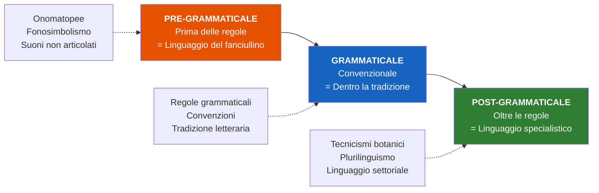

#### Linguaggio pre-grammaticale — il fonosimbolismo

Il linguaggio pre-grammaticale è quello del **fanciullino**: prima delle regole, il bambino si esprime con **suoni**.

**Fonosimbolismo**: procedimento stilistico per cui il **suono** (significante) di una parola **allude a un elemento di contenuto simbolico** (significato).

> **Esempio chiave — L'assiuolo**: il rapace notturno emette il verso "**chiù**". Questo suono si chiude sulla "u" accentata → evoca **angoscia, lutto, inquietudine**. Nella poesia, il verso dell'assiuolo diventa **simbolo dell'angoscia** per la perdita del padre.

> **Esempio — i viburni**: piante (comunemente dette "palle di neve") il cui nome è scelto per il **suono** — le vocali "u" e "o" evocano **oscurità, cupezza, mistero**. Collocati nell'atmosfera notturna de *Il gelsomino notturno*.

- **Onomatopea propria**: riproduce direttamente il suono (*tic tac, chiù, don don, miao*)
- **Onomatopea impropria**: parola che richiama il suono (*ticchettare, miagolare, sciabordare*)
- **Allitterazione**: ripetizione di suoni consonantici (*siepi, s'ode, suo, sottil*)

#### Linguaggio post-grammaticale — i tecnicismi

Il linguaggio specialistico, i nomi delle piante, i termini della botanica, dell'agricoltura. Esempi: *viburni, tamerici, marra, porche, maggese, pampano, valeriane, gora*.

### Il ritmo

Il verso pascoliano è **franto**, frammentato:

- **Lineette** per isolare termini
- **Parentesi** all'interno dei versi (mai visto in Petrarca o Leopardi)
- Grande **variabilità di segni d'interpunzione**: virgola, punto e virgola, due punti, punto fermo
- **Pause** di diversa lunghezza che spezzano il ritmo dell'endecasillabo

### Il linguaggio metaforico

#### Ampliamento della valenza semantica

Una parola assume **più significati** simultaneamente. Esempi dalla prof:

| Parola | Significato letterale | Significato simbolico |
|--------|----------------------|----------------------|
| **"fosse"** | Fossati, avvallamenti | **Sepolture**, tombe |
| **"urna"** | Urna cineraria (morte) | **Calice del fiore** impollinato (vita) |

> *"Cresce l'erba sopra le fosse"* — letteralmente: l'erba cresce sui fossati. Simbolicamente: l'erba cresce sulle **tombe**. → **Vita e morte** come ciclo di produzione e distruzione (parallelo con Leopardi).

> La parola "urna" contiene **Eros e Thanatos**, **vita e morte**: dimensione mortuaria + dimensione vitale della nascita.

**Osservazione fondamentale della prof**: per molti anni la poesia pascoliana è stata intesa come **bozzetto naturalistico**, semplice descrizione di paesaggi. In realtà è **densissima di rimandi analogici**.

#### Le figure retoriche più ricorrenti

| Figura | Definizione | Esempio pascoliano |
|--------|-------------|-------------------|
| **Analogia** | Metafora ardita, difficile da decifrare | Legami nascosti tra elementi lontani |
| **Sinestesia** | Associazione di sfere sensoriali diverse | *"Odore di fragole **rosse**"* (olfatto + vista) |
| **Onomatopea** | Riproduzione del suono | *chiù, don don, tin tin, sciabordare* |
| **Allitterazione** | Ripetizione consonantica | *siepi, s'ode, suo, sottil* |
| **Fonosimbolismo** | Suono → significato simbolico | *chiù* = angoscia; *viburni* = oscurità |
| **Anastrofe** | Inversione dell'ordine sintattico | *"roggio nel filare / qualche pampano brilla"* |
| **Enallage / Ipallage** | Scambio di funzioni logiche | *"marra pazïente"* (paziente = il contadino) |

### La musica del verso

> Pascoli intuitivamente arriva a una conclusione: **la poesia debba essere anche musica**, simile a quella dei poeti simbolisti. "La musica prima di ogni cosa" (eco di Verlaine).

Le poesie sono pensate per essere lette **ad alta voce**: insistita trama fonetica che rende i versi **musicali**.

---

## 6. Le raccolte poetiche

### Panoramica delle opere

| Opera | Anno | Note |
|-------|------|------|
| ***Myricae*** | 1891 (1ª ed.) | Prima raccolta. Dedicata al padre Ruggero. Titolo da Virgilio |
| ***Il Fanciullino*** | 1897 | Prosa poetica — dichiarazione di poetica |
| ***Poemi conviviali*** | 1904 | — |
| ***Primi poemetti*** | 1904 | — |
| ***Odi e Inni*** | ~1905 | — |
| ***Canti di Castelvecchio*** | 1907 (ed. def.) | Seconda raccolta principale |
| ***Nuovi poemetti*** | ~1909 | — |
| ***Canzoni di re Enzio*** | ~1910 | — |

### *Myricae*

- **Titolo**: dal latino, recupero virgiliano (Virgilio: *Bucoliche*, *Georgiche*, *Eneide* — poeta augusteo, guida di Dante)
- **Significato**: le **tamerici** — arbusti che crescono lungo le dune sabbiose, in territori difficili per la vita vegetale
- **Simbolo**: poesia fatta di **piccole cose**, oggetti umili (vs. rosa, giglio, alloro = tradizione letteraria elevata)
- **Dedicata a**: Ruggero Pascoli (il padre)
- **Temi centrali**: natura, umili cose, nido, assenza, lutto, i morti
- **Forma**: spesso il **madrigale** (due terzine + una quartina), versi endecasillabi

### *Canti di Castelvecchio*

- **Anno**: 1903 (edizione definitiva 1907)
- Rappresentano un'**ideale continuazione** di *Myricae*: si propongono di continuare il filone della prima raccolta
- Anche qui troviamo immagini della **vita di campagna**, solo che non è più la campagna **romagnola** (San Mauro) ma quella **toscana**, della **Garfagnana**
- Canti d'uccelli, alberi, fiori: i temi sono simili a quelli di *Myricae*
- I componimenti si susseguono secondo uno schema che rimanda al **succedere delle stagioni** → riferimenti al ciclo naturale dello scorrere del tempo, che rappresenta una sorta di **consolazione rassicurante** rispetto ai dolori dell'esistenza
- Ricorre con **frequenza ossessiva** il tema dei **cari morti**, della tragedia familiare e del tentativo di ricostituire un legame d'affetti (famiglia d'origine) → compare ancora una volta il **tema del nido**
- **Tema nuovo** rispetto a *Myricae*: il rapporto tra **Eros** e **Thanatos**
  - **Eros** = la **spinta vitale**, il desiderio, la procreazione — termine ripreso nel Novecento da **Freud** per indicare la **pulsione di vita**, quella che spinge al susseguirsi delle generazioni
  - **Thanatos** = parola greca che significa **morte** — per Freud, nella psiche sono presenti anche istanze di morte che conducono alla **distruzione, all'autodistruzione**
  - Questo rapporto è al centro de *Il gelsomino notturno*

La nebbia è elemento ricorrente in **entrambe** le raccolte (presente sia nel paesaggio romagnolo che in quello toscano)

**Nota della prof** (02/03/26): *"Quando vi chiedo le poesie di Pascoli vi chiedo anche a quale raccolta appartengono: se appartengono a Myricae, se appartengono ai Canti di Castelvecchio; quali sono le caratteristiche dell'una, quali sono le caratteristiche dell'altra raccolta e quali sono poi anche gli elementi in comune."*

#### Confronto *Myricae* — *Canti di Castelvecchio*

| Aspetto | *Myricae* (1891) | *Canti di Castelvecchio* (1903/1907) |
|---------|------------------|--------------------------------------|
| **Paesaggio** | Campagna **romagnola** (San Mauro) | Campagna **toscana** (Garfagnana) |
| **Temi comuni** | Natura, umili cose, nido, lutto, i morti | Natura, umili cose, nido, lutto, i morti |
| **Tema nuovo** | — | **Eros e Thanatos** (es. *Il gelsomino notturno*) |
| **Struttura** | — | Componimenti ordinati secondo il **ciclo delle stagioni** |
| **Forma** | Spesso il madrigale, versi brevi | Quartine, novenari, forme varie |
| **Tonalità** | Indeterminatezza, vaghezza | Stessi tratti + presenza più ossessiva dei **cari morti** |

---

## 7. Analisi dei testi poetici

---

### 7.1 *Arano* (*Myricae*)

**Raccolta**: *Myricae*
**Struttura**: due terzine + una quartina (**madrigale**). Versi endecasillabi.
**Lezione**: 23/02/26
**Pagine libro**: 315–316

#### Testo

> *Al campo, dove roggio nel filare*
> *qualche pampano brilla, e dalle fratte*
> *sembra la nebbia mattinal fumare,*
>
> *arano: a lente grida, uno le lente*
> *vacche spinge; altri semina; un ribatte*
> *le porche con sua marra pazïente;*
>
> *ché il passero saputo in cor già gode,*
> *e tutto spia dai rami irti del moro;*
> *e il pettirosso: nelle siepi s'ode*
> *il suo sottil tintinno come d'oro.*

#### Analisi verso per verso

**v. 1**: *"Al campo"* — indicazione spaziale **indeterminata**. Non dice "quel campo" o "il campo di X".

**vv. 1-3**: *"dove roggio nel filare / qualche pampano brilla"* — **anastrofe** (inversione): "roggio" è aggettivo concordato con "pampano" (non con "filare"). Il **filare** è quello delle viti; il **pampano** è la foglia della vite, diventata rossa → stagione **autunnale**. Apertura su un **dato visivo**.

**v. 3**: *"e dalle fratte sembra la nebbia mattinal fumare"* — le **fratte** = cespugli. La nebbia mattutina sembra alzarsi come fumo. Altra **anastrofe**. Dato **visivo**: un mare di nebbia costellato dalla luce delle foglie rosse.

**v. 4**: *"arano"* — primo verbo, i cui soggetti sono esplicitati **solo dopo**. Scelta che esprime **sospensione, indeterminatezza**. Non dice "i contadini": dice solo "arano".

**vv. 4-5**: *"a lente grida, uno le lente / vacche spinge"* — passaggio dal dato visivo a quello **uditivo**. "Lente" riferito sia alle grida sia alle vacche → **monotonia**, **fatica** del lavoro ripetitivo.

**v. 5**: *"altri semina"* — azione simultanea alla prima.

**vv. 5-6**: *"un ribatte / le porche con sua marra pazïente"* — **ribatte** = rivolta; **porche** = zolle di terra (termine tecnico agricolo); **marra** = zappa (termine tecnico).

- **"pazïente"**: concordato con "marra" (la zappa) ma si riferisce logicamente a "un" (il contadino) → **enallage / ipallage** (scambio di funzioni logiche) → effetto di **straniamento**.
- I **due puntini** sulla i = **dieresi**, che segna uno **iato**: separa la i dalla e nel computo metrico delle sillabe → il verso resta un **endecasillabo** (le-por-che-con-sua-mar-ra-paz-ï-en-te = 11 sillabe).
- Semanticamente, "paziente" si ricollega a "lente" → dimensione della **monotonia, ripetizione**.

**vv. 7-8**: *"ché il passero saputo in cor già gode, / e tutto spia dai rami irti del moro"* — **saputo** = accorto, avveduto. Il passero gode perché **c'è stata la semina** → occasione di cibo. **Moro** = gelso. "Rami **irti** del moro" → aspetto **fonosimbolico** dato dall'**allitterazione** (r-t, suoni aspri).

**vv. 9-10**: *"e il pettirosso: nelle siepi s'ode / il suo sottil tintinno come d'oro"* — "**e, e**" = **polisindeto**. Percezione **uditiva**:
- **Allitterazione**: *siepi, s'ode, suo, sottil* (ripetizione della "s")
- **Onomatopea**: *tintinno* (tin tin)
- **"Come d'oro"**: **similitudine** + **sinestesia** (dato uditivo "tintinno" associato a dato visivo "oro")
- Il suono è dolce, cristallino, limpido → apertura alla **speranza, solarità** rispetto all'indeterminatezza della prima parte

#### Schema strutturale

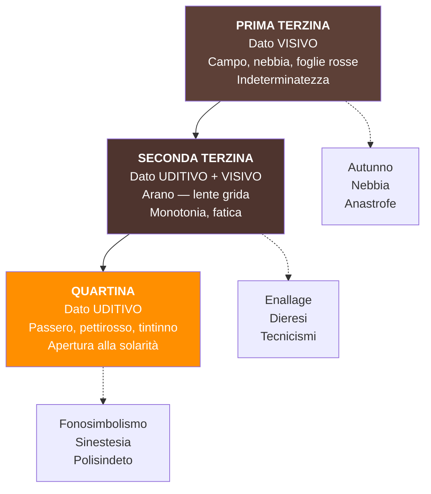

---

### 7.2 *Lavandare* (*Myricae*)

**Raccolta**: *Myricae*
**Struttura**: due terzine + una quartina (**madrigale**)
**Lezione**: 24/02/26
**Pagine libro**: fino a p. 318

#### Testo

> *Nel campo mezzo grigio e mezzo nero*
> *resta un aratro senza buoi, che pare*
> *dimenticato tra il vapor leggero.*
>
> *E cadenzato dalla gora viene*
> *lo sciabordare delle lavandare*
> *con tonfi spessi e lunghe cantilene.*
>
> *Il vento soffia e nevica la frasca*
> *e tu non torni ancora al tuo paese:*
> *quando partisti, come son rimasta!*
> *Come l'aratro in mezzo alla maggese.*

#### Analisi verso per verso

**vv. 1-3 — PRIMA TERZINA: percezione VISIVA**

- *"Nel campo mezzo grigio e mezzo nero"*: due dati cromatici. Mezzo grigio = terra ancora intatta; mezzo nero = zolle rivoltate dall'aratura → campo **a metà arato**.
- *"Resta un aratro senza buoi"*: **solitudine** (senza buoi), **abbandono** (dimenticato).
- *"Che pare dimenticato tra il vapor leggero"*: atmosfera **indefinita**, contorni non netti, tutto avvolto dalla nebbia.

**La nebbia** in Pascoli ha un **doppio significato**:
1. **Muro protettivo** rispetto al mondo esterno
2. **Ostacolo** che impedisce di andare oltre, di uscire dall'isolamento

**vv. 4-6 — SECONDA TERZINA: percezione UDITIVA**

- *"E cadenzato dalla gora viene"*: **gora** = canale. "Cadenzato" è concordato con "lo sciabordare".
- *"Lo sciabordare delle lavandare"*: **sciabordare** = parola **onomatopeica**, il suono delle donne che lavano i panni al fiume.
- *"Con tonfi spessi e lunghe cantilene"*: **tonfi** = altra parola **onomatopeica**. "Lunghe cantilene" riproduce la cadenza e la **monotonia** del canto.
- Rima interna: -are / -are (*sciabordare / lavandare*)
- Stato d'animo: **fatica, monotonia** di un gesto ripetitivo

**vv. 7-10 — QUARTINA: le parole del canto popolare**

- *"Il vento soffia"*: **soffia** = verbo onomatopeico. Allitterazione: *soffia, frasca*.
- *"E nevica la frasca"*: **"nevica"** usato transitivamente = far cadere le foglie → **licenza poetica**.
- *"E tu non torni ancora al tuo paese"*: il **"tu"** si riferisce a un affetto, un amore lontano → canto di **abbandono**.
- *"Quando partisti, come son rimasta!"*: espressione di **malinconia, nostalgia, rimpianto**.
- *"Come l'aratro in mezzo alla maggese"*: **struttura circolare** — il componimento si chiude sull'immagine dell'aratro della prima strofa. L'aratro = simbolo della **solitudine, dell'abbandono**.

**Maggese**: nella **rotazione triennale** dei campi, una parte del terreno viene lasciata **incolta** perché le sostanze nutritive si rigenerino. → simbolo di **solitudine, abbandono**.

#### Conclusione della prof

> Le poesie di Pascoli **non** sono solo quadretti naturalistici di vita rurale: rappresentano una **fitta trama di riferimenti simbolici**.

---

### 7.3 *X Agosto* (*Myricae*)

**Raccolta**: *Myricae*
**Lezione**: 24/02/26
**Tema**: la morte del padre Ruggero, avvenuta il **10 agosto 1867** (giorno di San Lorenzo, le stelle cadenti)

#### Struttura compositiva

La poesia è costruita su un **parallelismo simmetrico** tra la **rondine** uccisa e il **padre** ucciso:

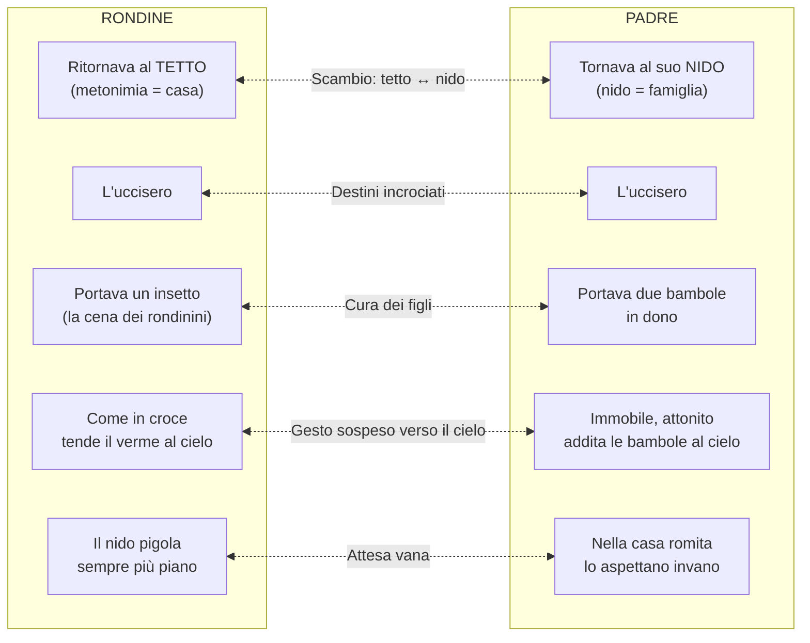

**Osservazione della prof**: è "una delle poesie più **costruite** di Pascoli" — tutta elaborata sulla **simmetria**. "Non è la mia preferita" (cit. prof).

#### Analisi verso per verso

**Strofa 1** (vv. 1-4): *"San Lorenzo, io lo so perché tanto / di stelle per l'aria tranquilla / arde e cade, perché sì gran pianto / nel concavo cielo sfavilla."*

- **"San Lorenzo"**: **apostrofe** — il poeta si rivolge direttamente a un interlocutore
- **"Tanto di stelle"**: "tanto" è il **soggetto** (sostantivo astratto) + "di stelle" = complemento **partitivo**. "Tanto" anziché "tante stelle" → effetto di **vastità cosmica** che il plurale non renderebbe
- **"Per l'aria tranquilla"**: complemento di **moto per luogo** (= attraverso)
- **"Arde e cade"**: le stelle bruciano e cadono
- **"Sì gran pianto"**: le stelle cadenti = **pianto del cielo** → presagio sinistro, luttuoso. Noi vediamo le stelle cadenti come meraviglia; per Pascoli sono anche **lacrime**

**Strofa 2** (vv. 5-8): *"Ritornava una rondine al tetto: / l'uccisero: cadde tra spini: / ella aveva nel becco un insetto: / la cena dei suoi rondinini."*

- **"al tetto"**: **metonimia** (tetto = casa), ma riferito alla rondine — scambio con "nido"
- **"cadde tra spini"**: le **spine** + poi "croce" → rimando alla **Passione di Cristo** → dimensione del **sacrificio, della sofferenza**
- Pascoli **non è un credente**, ma recupera la dimensione cristologica per esemplificare il **dolore del mondo**
- **"Rondinini"**: sfumatura **affettuosa** (diminutivo)
- **"La cena"**: **personificazione** — non si dice "pasto" o "cibo" ma "cena", come per una famiglia

**Strofa 3** (vv. 9-12): *"Ora è là, come in croce, che tende / quel verme a quel cielo lontano; / e il suo nido è nell'ombra, che attende, / che pigola sempre più piano."*

- **"Come in croce"**: la rondine caduta con le ali aperte → immagine cristologica
- **"Cielo lontano"**: il cielo è **irraggiungibile** → le preghiere degli uomini rimangono **inascoltate**; non c'è possibilità di salvezza o consolazione → posizione simile a **Leopardi** (Luna indifferente al dolore)
- **"Pigola sempre più piano"**: i rondinini stanno **morendo**, privati di chi doveva dar loro cibo e protezione. **Pigola** = onomatopea; **più piano** = allitterazione

**Strofa 4** (vv. 13-16): *"Anche un uomo tornava al suo nido: / l'uccisero: disse: Perdono; / e restò negli aperti occhi un grido: / portava due bambole in dono."*

- **"un uomo"**: indeterminato, ma è il padre Ruggero → **riflesso autobiografico**
- **"al suo nido"**: scambio con "tetto" (umano ↔ animale). **Nido** = unione familiare, affetti, calore, sicurezza
- **"Perdono"**: le ultime parole immaginate, verso un assassino di cui non conosce neppure le ragioni
- **"Restò negli aperti occhi un grido"**: **sinestesia** (grido = uditivo, negli occhi = visivo) — il mistero della morte rimase negli occhi; il grido di aiuto rimase inascoltato
- **"Portava due bambole in dono"**: destinate alle figlie — parallelo perfetto con la rondine che portava la cena
- Tra "perdono" e "portava": i **tre puntini** = **reticenza** — Pascoli non dice tutto il dolore della disgregazione familiare

**Strofa 5** (vv. 17-20): *"Ora là, nella casa romita, / lo aspettano, aspettano in vano: / egli immobile, attonito, addita / le bambole al cielo lontano."*

- **"Romita"**: isolata, abbandonata, solitaria
- **"Lo aspettano, aspettano invano"**: ripetizione del verbo → **chiasmo** (non completo). L'attesa è **inutile**: non c'è fede in un mondo ultraterreno di ricongiungimento
- **"Attonito"**: immobilizzato, atterrito dalla paura
- **"Addita le bambole al cielo lontano"**: porge le bambole al cielo che **non risponde** al dolore

**Strofa 6** (vv. 21-24): *"E tu, Cielo, dall'alto dei mondi / sereni, infinito, immortale, / oh! d'un pianto di stelle lo inondi / quest'atomo opaco del male!"*

- **"Cielo"** con C maiuscola: **personificazione** che rimanda a Dio → "e tu Cielo" ≈ "e tu Dio"
- Il cielo è **sereno, infinito, immortale**: non è toccato dai dolori degli uomini, non conosce la morte e la finitudine
- **"Pianto di stelle"**: riprende la prima strofa → **struttura circolare**
- **"Quest'atomo opaco del male"**: **perifrasi** per indicare la Terra:
  - **Atomo** → piccolezza, insignificanza
  - **Opaco** → mancanza di luce
  - **Del male** → il mondo come regno del dolore

#### Temi fondamentali

| Tema | Come si manifesta |
|------|------------------|
| **Sofferenza universale** | Accomuna rondine e uomo — tutti gli esseri senzienti soffrono |
| **Dolore cosmico** | Modello: Leopardi, *La Ginestra* |
| **Cielo indifferente** | Lontano, irraggiungibile, sordo al dolore |
| **Il nido distrutto** | La famiglia disgregata dalla violenza |
| **Assenza di giustizia** | Morte inaspettata, colpevoli impuniti |
| **Rielaborazione del lutto** | Il padre idealizzato nel gesto paterno |

---

### 7.4 *Temporale* (*Myricae*)

**Raccolta**: *Myricae*
**Struttura**: **ballata minima** di **settenari**. Un verso isolato (prima strofa) + sei versi (seconda strofa).
**Lezione**: 26/02/26

#### Testo

> *Un bubbolio lontano...*
>
> *Rosseggia l'orizzonte,*
> *come affocato a mare;*
> *nero di pece, a monte,*
> *stracci di nubi chiare:*
> *tra il nero un casolare:*
> *un'ala di gabbiano.*

#### Analisi verso per verso

**v. 1**: *"Un bubbolio lontano..."*

La lirica si apre su un **dato uditivo**. "Bubbolio" è una parola **onomatopeica** che, secondo la definizione di **Contini**, appartiene al **linguaggio pregrammaticale**. Indica il **mormorio minaccioso** che pare anticipare un temporale. Il temporale non viene esplicitamente dichiarato, ma soltanto **evocato** in una dimensione di **lontananza**.

La lontananza insiste sulla **vaghezza, sull'indeterminatezza**, enfatizzata anche dall'uso della **reticenza** (i puntini di sospensione) tra i due versi → effetto espressivo **allusivo**.

**v. 2**: *"Rosseggia l'orizzonte"*

Al dato uditivo ne segue uno **visivo**: l'orizzonte è rosso, forse per i lampi. Suona piuttosto **inquietante**, quasi un **presagio**.

**v. 3**: *"come affocato a mare"*

Come di fuoco, come incendiato verso il mare.

**v. 4**: *"nero di pece, a monte"*

Nero come la pece invece verso il monte. Su di esso si stagliano...

**v. 5**: *"stracci di nubi chiare"*

Lembi di nuvole chiare. Le nubi hanno una **forma irregolare** simile a degli stracci.

**Contrasti cromatici molto violenti**: da una parte l'orizzonte **rosseggiante**, dall'altra il **nero** intervallato da **stracci bianchi**.

**v. 6**: *"tra il nero un casolare"*

In quell'orizzonte scuro si vede un casolare.

**v. 7**: *"un'ala di gabbiano"*

Sul cielo nero si innalza un casolare simile ad un'ala di gabbiano. Un casolare **bianco** che si staglia sul nero delle nubi richiama un'ala di gabbiano.

Questo accostamento è un esempio di **linguaggio analogico**: tra l'ala di gabbiano e il casolare c'è una sorta di **somiglianza dovuta al colore bianco**, ma non si tratta di una metafora tradizionale. Il lettore deve coglierla da un punto di vista **intuitivo**, tirando in campo l'**immaginazione** che disvela i **rapporti segreti** tra i dati della realtà.

#### Interpretazione complessiva

Quello che può sembrare un quadretto impressionistico è in realtà un'**evocazione** (niente è esplicito) che rimanda a una **dimensione interiore** legata a:
- **Inquietudine**
- **Mistero**
- **Vaga minaccia** espressa attraverso i contrasti cromatici violenti

**Dal punto di vista concettuale**: perché il casolare è associato all'ala di gabbiano? In tutto quel nero e quell'orizzonte rosso di fuoco, l'unico dato che rappresenta una **pacificazione** è il casolare, associato per analogia all'ala di gabbiano. L'ala di gabbiano è immagine di:
- **Protezione** (richiamo al nido)
- **Leggerezza** → rimanda al volo, al fatto di potersi elevare dalle miserie della vita, dalle sofferenze, per accedere a una **dimensione altra**

#### Caratteristiche stilistiche tipicamente pascoliane

- Il **verso breve** (settenario) e **franto** → uso di virgole, due punti che introducono l'analogia
- La **reticenza** (puntini di sospensione dopo il primo verso)
- Il **linguaggio pregrammaticale** ("bubbolio" = onomatopea)
- L'**analogia** come procedimento stilistico fondamentale
- I **contrasti cromatici violenti** (rosso / nero / bianco)
- L'**indeterminatezza** e la **vaghezza** dell'evocazione

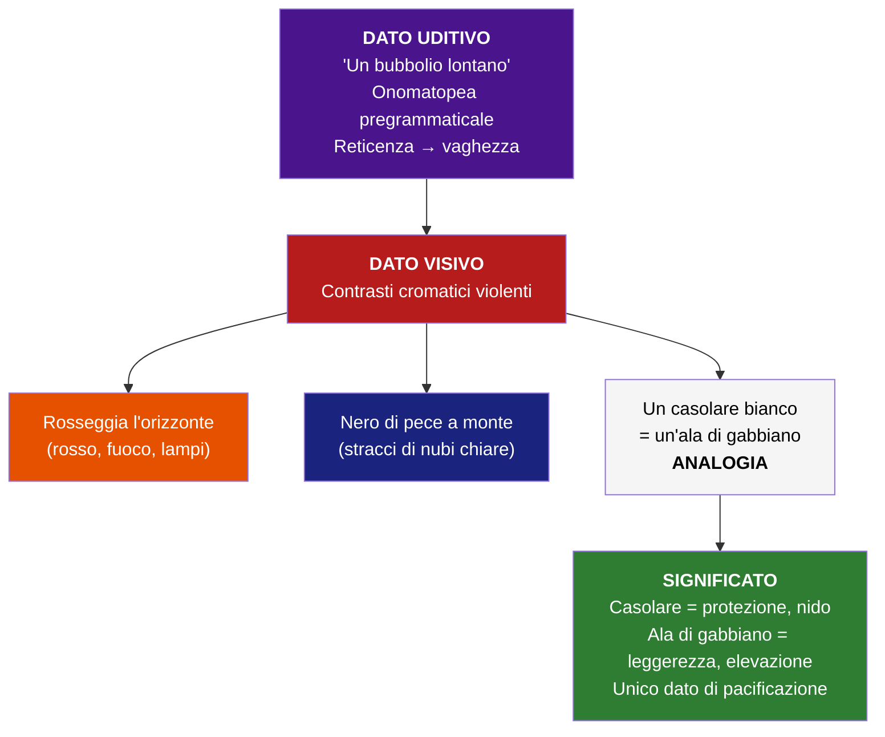

---

### 7.5 *L'assiuolo* (*Myricae*)

**Raccolta**: *Myricae*
**Struttura**: tre strofe di **novenari**, ciascuna chiusa dall'**onomatopea "chiù"**
**Lezione**: 26/02/26
**Materiale aggiuntivo**: saggio di **Marco Santagata "Un piccolo io"** — da studiare (materiale d'esame)

> **Nota della prof**: "Su questo io vi manderò un saggio di Santagata da studiare proprio tutto incentrato su L'Assiuolo che si intitola Un piccolo io. Dopo ve lo mando e questo è da studiare."

L'assiuolo è un **rapace notturno**, simile al gufo, che emette un suono piuttosto **lugubre e malinconico** che sembra un lamento, reso da Pascoli attraverso l'**onomatopea propria**: **chiù**.

#### Testo

> *Dov'era la luna? ché il cielo*
> *nuotava in un'alba di perla,*
> *ed ergersi il mandorlo e il melo*
> *parevano a meglio vederla.*
> *Venivano soffi di lampi*
> *da un nero di nubi laggiù;*
> *veniva una voce dai campi:*
> *chiù.*
>
> *Le stelle lucevano rare*
> *tra mezzo alla nebbia di latte:*
> *sentivo il cullare del mare,*
> *sentivo un fru fru tra le fratte;*
> *sentivo nel cuore un sussulto,*
> *com'eco d'un grido che fu.*
> *Sonava lontano il singulto:*
> *chiù.*
>
> *Su tutte le lucide vette*
> *tremava un sospiro di vento:*
> *squassavano le cavallette*
> *finissimi sistri d'argento*
> *tintinni a invisibili porte*
> *che forse non s'aprono più?…*
> *e c'era quel pianto di morte…*
> *chiù.*

#### Struttura portante: il climax ascendente

Il testo è tutto costruito su un **climax ascendente** — la figura retorica fondante dell'intera poesia:

| Strofa | Come viene definito il "chiù" | Grado |
|--------|-------------------------------|-------|
| **1ª** | Una **voce** dai campi | Dato neutro, indeterminato |
| **2ª** | Un **singulto** | Verso lamentoso |
| **3ª** | Un **pianto** di morte | Profezia luttuosa |

→ Da voce a singulto a pianto: **progressione dell'angoscia**.

#### Analisi verso per verso

##### STROFA 1 — Paesaggio sereno, primi segni di inquietudine

**v. 1**: *"Dov'era la luna?"*

La strofa si apre su una **domanda** che implica l'esistenza di una **voce** di cui non si esplicita la provenienza. Questa voce si interroga sulla presenza della luna → siamo in un paesaggio **notturno**.

**v. 2**: *"ché il cielo nuotava in un'alba di perla"*

"Alba di perla" è un'espressione **analogica**: il cielo è immerso in una luce **madreperlacea**, iridescente. Come la perla colpita da un bagliore di luce → il cielo è avvolto in un alone di luce perlacea, iridescente, per cui è difficile distinguere i contorni della luna.

**vv. 3-4**: *"ed ergersi il mandorlo e il melo / parevano a meglio vederla"*

Costruzione: il mandorlo e il melo sembravano ergersi (innalzarsi) verso il cielo per scorgerla (la luna) meglio.

- **Personificazione**: il mandorlo e il melo compiono un gesto umano (tendere verso qualcosa per vederla meglio)
- Attenzione per il **lessico tecnico**: Pascoli non dice "un albero e un altro" ma specifica "il mandorlo e il melo" → linguaggio **post-grammaticale**
- C'è una sorta di **partecipazione attiva della natura**, legata da rapporti misteriosi e complessi

**vv. 5-6**: *"Venivano soffi di lampi / da un nero di nubi laggiù"*

"Soffi di lampi" = **sinestesia** ("soffi" → dato uditivo; "lampi" → dato visivo) = lampi silenziosi di luce che provengono da una dimensione remota e oscura.

"Da un **nero** di **nubi** **laggiù**" → **allitterazione della N** + prevalere di suoni cupi ("nero", "nubi", "laggiù" con la U accentata) = **fonosimbolismo**. Il paesaggio inizia a caricarsi di elementi di **inquietudine**.

**vv. 7-8**: *"veniva una voce dai campi: / chiù."*

Da una dimensione **indeterminata** giungono suoni riconducibili a una "voce". Anche "voce" è un termine che si riferisce a persona: qui invece è riferito al verso dell'assiuolo, che proviene da un punto incerto, lontano.

L'onomatopea "chiù" presenta una **vocale cupa** (la U accentata), seguita da una **reticenza** → allusivo a una realtà misteriosa da decifrare, piuttosto **luttuosa** per l'acutezza del suono.

##### STROFA 2 — Cerniera: dai sensi all'interiorità

**vv. 1-2**: *"Le stelle lucevano rare / tra mezzo alla nebbia di latte"*

La strofa si apre su un **dato visivo** e rappresenta una sorta di **cerniera** rispetto alla prima. Rare stelle brillano. "Nebbia di latte" = espressione **analogica** che indica l'alone del **lume bianco della luna**, il chiarore diffuso nel quale si intravvedono rare luci stellari.

**v. 3**: *"sentivo il cullare del mare"*

Iniziano i **dati uditivi**. "Cullare" = in senso proprio il rifrangersi ritmico e monotono delle onde; ma è un verbo che rimanda anche alla dimensione dell'**infanzia**, della **cura materna**. Il rumore del mare è simile al muoversi di una culla.

**v. 4**: *"sentivo un fru fru tra le fratte"*

"Sentivo, sentivo, sentivo" = **anafora**. "Fru fru" = **onomatopea propria**. L'**allitterazione del gruppo consonantico FR** (fru fru, fratte) è un esempio di **fonosimbolismo**: corrispondenza tra significante e significato. Un fruscio indistinto tra i cespugli che presuppone una **presenza nascosta** (qualche animale).

**v. 5**: *"sentivo nel cuore un sussulto"*

**Differenza fondamentale** rispetto ai primi due "sentivo": i primi due rimandano a una **percezione sensoriale** (mare, fruscio); il terzo rimanda a una **dimensione interiore, soggettiva**. Quei suoni producono nell'io lirico una sorta di **risveglio interiore** perché probabilmente gli ricordano qualcosa.

**v. 6**: *"com'eco d'un grido che fu"*

Sente un sussulto determinato dal ricordo, come l'eco di un grido → **similitudine**. "Un grido che fu", che c'è stato → rimanda alla **morte del padre**. L'eco è il ricordo traumatico che riaffiora.

**vv. 7-8**: *"Sonava lontano il singulto: / chiù."*

La "voce" della prima strofa si è trasformata in un **singulto** (verso lamentoso) → **secondo passaggio del climax ascendente**.

##### STROFA 3 — Culmine: la morte

**vv. 1-2**: *"Su tutte le lucide vette / tremava un sospiro di vento"*

"Lucide vette" = le cime delle foglie che sono **lucide** per il riflesso della luna. Sulle cime degli alberi illuminati dalla luna tremava un sospiro di vento → il vento è come un **sospiro** che fa tremare le foglie.

**vv. 3-4**: *"squassavano le cavallette / finissimi sistri d'argento"*

Le cavallette, sfregando e scuotendo le ali, emettevano un suono acuto simile a quello dei **sistri**. I sistri sono **strumenti musicali egiziani** che venivano utilizzati per il **culto dei morti** ed erano propri del culto di **Iside**. Iside è la dea egizia della fecondità, moglie di **Osiride**, il dio dei morti.

→ Quei "finissimi sistri d'argento" rimandano al **culto dei morti**.

**"Finissimi sistri"**: esempio chiarissimo di **fonosimbolismo**. L'accostamento di queste due parole produce un suono **veloce** e **sottile**, per la presenza di tutte quelle "i". Il suono sottile è il corrispettivo fonetico del significato → perfetta **corrispondenza significante/significato**.

**vv. 5-6**: *"tintinni a invisibili porte / che forse non s'aprono più?…"*

Le **invisibili porte** che forse non si aprono più sono le porte dell'**aldilà**, del mondo dei morti (**Osiride**).

**Innovazione metrica**: l'**interrogativa all'interno di una parentetica**. Pascoli inventa il linguaggio poetico del Novecento attraverso queste innovazioni: l'uso di **incidentali, parentetiche**.

**vv. 7-8**: *"e c'era quel pianto di morte… / chiù."*

La voce, da singulto, si è trasformata in **pianto**. Il verso dell'assiuolo è assimilato a un pianto **lugubre, lamentoso**, che sembra una **profezia luttuosa** → **terzo e ultimo passaggio del climax**.

#### Il problema dell'oggettivo e del soggettivo

> **Osservazione della prof**: si può parlare di un quadretto naturalistico? È molto difficile capire quale sia il dato **oggettivo** e quale il dato **soggettivo**. Proprio per l'indeterminatezza e l'uso dell'analogia, Pascoli riesce a rendere una sorta di **continua oscillazione** tra il dato della realtà concreta (esterno) e il dato psichico, interiore, della realtà soggettiva.

#### Schema delle figure retoriche ne *L'assiuolo*

| Figura | Dove | Testo |
|--------|------|-------|
| **Climax ascendente** | Struttura portante | voce → singulto → pianto |
| **Analogia** | v. 2, str. 1 | "alba di perla" |
| **Analogia** | v. 2, str. 2 | "nebbia di latte" |
| **Personificazione** | vv. 3-4, str. 1 | mandorlo e melo si ergono per vedere |
| **Sinestesia** | vv. 5-6, str. 1 | "soffi di lampi" (udito + vista) |
| **Fonosimbolismo** | vv. 5-6, str. 1 | allitterazione della N + vocali cupe |
| **Anafora** | vv. 3-5, str. 2 | "sentivo... sentivo... sentivo" |
| **Onomatopea propria** | v. 4, str. 2 | "fru fru" |
| **Fonosimbolismo** | v. 4, str. 2 | allitterazione del gruppo FR |
| **Similitudine** | v. 6, str. 2 | "com'eco d'un grido che fu" |
| **Fonosimbolismo** | vv. 3-4, str. 3 | "finissimi sistri" (suono sottile) |
| **Innovazione metrica** | vv. 5-6, str. 3 | Interrogativa in parentetica |

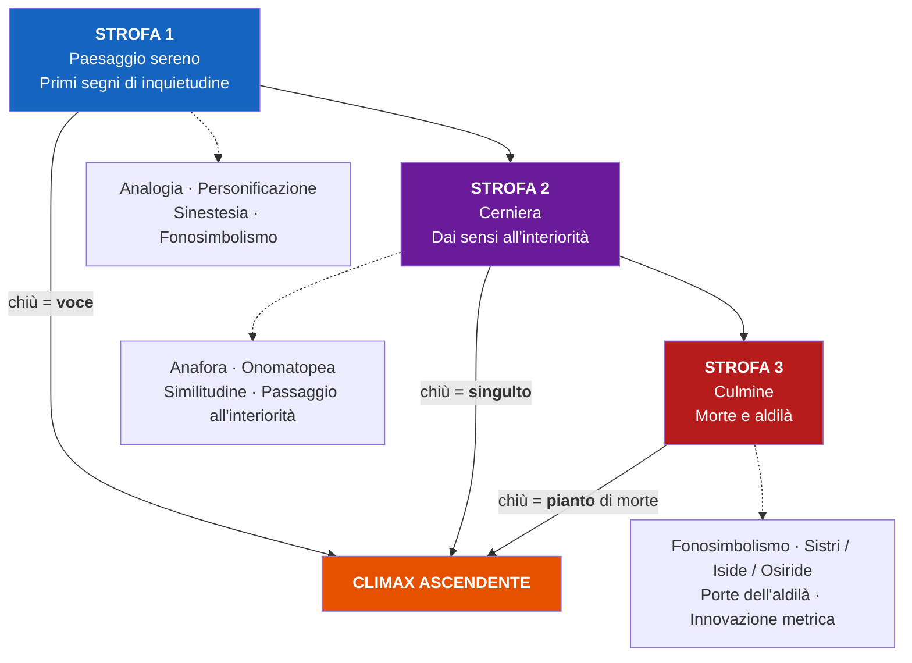

---

### 7.6 *Il gelsomino notturno* (*Canti di Castelvecchio*)

**Raccolta**: *Canti di Castelvecchio*
**Struttura**: **quartine di novenari**
**Lezione**: 26/02/26
**Tema centrale**: **Eros e Thanatos** — la spinta vitale e la morte intrecciate

#### Contesto

La poesia è una **poesia d'occasione**: fu composta per le nozze dell'amico **Gabriele Briganti**. L'io lirico (la voce di Pascoli) **osserva dall'esterno** la casa degli sposi la prima notte di nozze. La poesia si concentra su:

1. Gli elementi della **natura** (in particolare il gelsomino notturno che apre la sua corolla per favorire l'impollinazione nelle ore notturne)
2. L'immagine della **casa** in cui a un certo punto il lume si spegne → allude alla dimensione dell'**Eros**

**Il rapporto di Pascoli con l'Eros** (osservazione della prof):

Pascoli osserva il legame sessuale tra due sposi **da lontano**, con un sentimento misto di:
- **Paura** — come se sapesse che quella condizione gli è estranea
- **Curiosità** — interesse per qualcosa che non conosce

Dalla critica, questa dimensione è definita **voyeuristica**:
- Il **voyeur** = colui che trae piacere dall'**osservare** una situazione da fuori, rimanendone **estraneo**
- Questo misto di voyeurismo e curiosità è assimilabile all'atteggiamento che può avere nei confronti dell'Eros **un bambino** → tipico dell'infanzia
- Questo ci dice qualcosa della **dimensione psichica** di Pascoli

**Struttura del testo**: giocato sul **parallelismo** tra la **vita della natura** e quella degli **sposi**. Dove c'è la vita, c'è anche la morte: **Eros e Thanatos** compresenti.

#### Testo

> *E s'aprono i fiori notturni*
> *nell'ora che penso ai miei cari.*
> *Sono apparse in mezzo ai viburni*
> *le farfalle crepuscolari.*
>
> *Da un pezzo si tacquero i gridi:*
> *là sola una casa bisbiglia.*
> *Sotto l'ali dormono i nidi,*
> *come gli occhi sotto le ciglia.*
>
> *Dai calici aperti si esala*
> *l'odore di fragole rosse.*
> *Splende un lume là nella sala.*
> *Nasce l'erba sopra le fosse.*
>
> *Un'ape tardiva sussurra*
> *trovando già prese le celle.*
> *La Chioccetta per l'aia azzurra*
> *va col suo pigolio di stelle.*
>
> *Per tutta la notte s'esala*
> *l'odore che passa col vento.*
> *Passa il lume su per la scala;*
> *brilla al primo piano: s'è spento...*
>
> *È l'alba: si chiudono i petali*
> *un poco gualciti; si cova*
> *dentro l'urna molle e segreta,*
> *non so che felicità nuova.*

#### Analisi verso per verso

##### STROFA 1 — Eros e Thanatos fin dall'inizio

**v. 1**: *"E s'aprono i fiori notturni"*

Il testo si apre con la congiunzione **"e"**, come se il discorso fosse già stato iniziato, come fosse il **proseguio di una riflessione già avviata**. I fiori notturni sono i gelsomini che aprono la loro corolla al **tramonto**.

**v. 2**: *"nell'ora che penso ai miei cari"*

L'ora del tramonto è l'ora della **nostalgia** (ricordare anche ciò che dice **Dante** sul tramonto). Il pensiero è rivolto ai suoi cari, cioè ai **morti, ai defunti**.

→ Già in questi due versi abbiamo **Eros e Thanatos**: la dimensione della vita (il fiore che si apre) e la dimensione della morte (il pensiero ai defunti) **convivono**.

**vv. 3-4**: *"Sono apparse in mezzo ai viburni / le farfalle crepuscolari"*

Le farfalle crepuscolari = le **falene**, che si levano dopo il crepuscolo. I **viburni** sono i cespugli con fiori bianchi (le "palle di neve"): Pascoli sceglie di definirli attraverso un nome **settoriale** (lessico specialistico) scelto per la sua **musicalità**. "Viburno", con la vocale **"u"**, rimanda a un'atmosfera **notturna, cupa**.

##### STROFA 2 — Il parallelismo natura/sposi

**v. 5**: *"Da un pezzo si tacquero i gridi"*

Da lungo tempo non si sentono più le grida degli uccelli → riferimento alla vita della natura.

**v. 6**: *"là sola una casa bisbiglia"*

Il silenzio della vita naturale è accostato per **opposizione** ma anche per **analogia** al bisbiglio che si avverte in una casa. Il **bisbiglio**, nel silenzio della notte, tradisce la presenza di qualcuno ancora sveglio.

→ Inizia il **parallelismo** tra vita della natura e vita degli sposi.

**vv. 7-8**: *"Sotto l'ali dormono i nidi, / come gli occhi sotto le ciglia"*

**Nidi**: parola chiave. I piccoli degli uccelli dormono protetti dalle ali dei loro genitori. **Similitudine** bellissima: così come gli occhi dormono protetti dalle ciglia. Ancora una volta accostamento tra la vita della natura e la vita degli uomini → dimensione di **pace, tranquillità, silenzio**.

##### STROFA 3 — Vita e morte simultanee

**vv. 9-10**: *"Dai calici aperti si esala / l'odore di fragole rosse"*

"Calici aperti" = la corolla aperta dei gelsomini. Si sprigiona un profumo di fragole **rosse**, cioè di fragole **mature**. Pascoli utilizza una **sinestesia**: dato **olfattivo** (odore) + dato **visivo** (rosse).

**v. 11**: *"Splende un lume là nella sala"*

Nella sala della casa splende un lume che tradisce una presenza (o più presenze).

**v. 12**: *"Nasce l'erba sopra le fosse"*

Nell'ora in cui l'erba nasce sopra i **fossati** — che però, con l'**ampliamento della valenza semantica**, diventano **tombe** → dimensione **simultanea** di vita e di morte.

##### STROFA 4 — L'aia azzurra e il pigolio di stelle

**vv. 13-14**: *"Un'ape tardiva sussurra / trovando già prese le celle"*

Un'ape ritornata troppo tardi al suo alveare si aggira intorno col suo ronzio, trovando le celle tutte occupate → ancora una volta richiamo alla natura che **sussurra, bisbiglia** nel silenzio.

**vv. 15-16**: *"La Chioccetta per l'aia azzurra / va col suo pigolio di stelle"*

Una delle **immagini poetiche più belle del Novecento** (cit. prof).

- **"Chioccetta"** = nome con cui i contadini chiamano la costellazione delle **Pleiadi**
- **"Aia azzurra"** = il cielo. L'aia è l'area del cortile dove razzolano gli animali → il cielo (la meraviglia del cielo) è associato a un cortile, a un'aia
- Le **Pleiadi** sono associate a una **chioccia** che percorre l'aia (il cielo) con il suo **"pigolio di stelle"**

**"Pigolio di stelle"**: dato **uditivo** (onomatopea "pigolio") riferito a un elemento **visivo** (stelle) = **sinestesia**. Le stelle nel cielo scurissimo sbrilluccicano **palpitando**, e Pascoli associa quel movimento luminoso a un dato uditivo. È una sinestesia che si può solo **intuire**: "o si ha la sensibilità per intuirla o non si ha" (cit. prof) → la grandezza di questa immagine sta nella sua indicibilità.

##### STROFA 5 — Il lume si spegne

**vv. 17-18**: *"Per tutta la notte s'esala / l'odore che passa col vento"*

Per tutta la notte il profumo dei gelsomini viene diffuso dal vento.

**vv. 19-20**: *"Passa il lume su per la scala; / brilla al primo piano: s'è spento..."*

Ancora una volta il passaggio dalla **vita della natura** alla **vita della casa**. Un lume — visto **da fuori**, da una certa distanza — passa su per la scala. Brilla al primo piano. Si è spento.

Con quel **"s'è spento"** e la **reticenza** (i puntini di sospensione), il poeta allude all'**unione dei due sposi**, alle nozze.

##### STROFA 6 — L'urna molle e segreta

**v. 21**: *"È l'alba"*

Stacco temporale. È l'alba.

**vv. 21-22**: *"si chiudono i petali / un poco gualciti"*

I petali dei fiori chiudono la loro corolla un poco **sgualciti** per via dell'**impollinazione** delle api. L'impollinazione segna il susseguirsi delle generazioni, la nascita di vite nuove. Ma l'immagine dell'ape che **sgualcisce** i petali ha anche una sottile forma di **aggressività, di violenza** → i petali sono un po' **rovinati**. Nella dimensione dell'Eros c'è anche questa componente di **aggressività, di violenza sottile**.

**vv. 22-24**: *"si cova / dentro l'urna molle e segreta, / non so che felicità nuova"*

Costruzione: "non so che felicità nuova si cova dentro l'urna molle e segreta" = una **nuova felicità**, cioè una **nuova vita**, si cela dentro l'urna molle e segreta.

**"L'urna molle e segreta"** ha **tre livelli di significato** simultanei:

1. Il **calice del fiore** (molle e misterioso) → vita della natura
2. L'**urna cineraria** → nella vita è già contenuta la morte
3. Il **grembo della sposa** → dimensione di una nuova vita, della maternità

→ L'urna assembla in sé tutti questi significati: **Eros e Thanatos insieme**.

#### Mappa strutturale del *Gelsomino notturno*

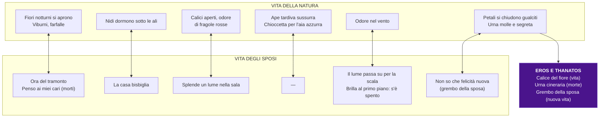

#### Figure retoriche nel *Gelsomino notturno*

| Figura | Dove | Testo |
|--------|------|-------|
| **Parallelismo** | Struttura portante | Vita della natura ↔ vita degli sposi |
| **Sinestesia** | Str. 3 | "odore di fragole rosse" (olfatto + vista) |
| **Sinestesia** | Str. 4 | "pigolio di stelle" (udito + vista) |
| **Similitudine** | Str. 2 | "come gli occhi sotto le ciglia" |
| **Analogia** | Str. 2 | silenzio della natura ↔ bisbiglio della casa |
| **Ampliamento semantico** | Str. 3 | "fosse" = fossati + tombe |
| **Ampliamento semantico** | Str. 6 | "urna" = calice + urna cineraria + grembo |
| **Reticenza** | Str. 5 | "s'è spento..." → unione degli sposi |
| **Lessico settoriale** | Str. 1 | "viburni" (nome botanico scelto per il suono) |

---

### 7.7 *La tovaglia* (*Canti di Castelvecchio*)

**Raccolta**: *Canti di Castelvecchio*
**Lezione**: 26/02/26
**Andamento**: **narrativo** — racconta una vicenda dalla bambina alla donna adulta
**Tema centrale**: i **morti** come presenze consolatorie; il ricordo della vita quotidiana perduta

#### Contesto: la superstizione contadina

La poesia si fonda su una **superstizione contadina popolare**, molto diffusa nelle campagne (la prof testimonia: "I miei nonni la ricordavano"): la tavola la sera doveva essere **sparecchiata**, altrimenti sarebbero venuti i **morti** — intesi come presenze **minacciose**.

Pascoli **recupera** questa superstizione e la inserisce in un contesto quasi narrativo, **rovesciandola**: racconta di una bambina che, diventata adulta, si rifiuta di sparecchiare la mensa perché **aspetta** l'arrivo dei defunti, che non sono presenze minacciose ma **consolatorie**.

**Notazione linguistica della prof**: la donna che "regge la casa" in dialetto **romagnolo** si chiama **"l'azdora"** (la reggitrice). L'uso del verbo "regge" nel testo è una sorta di **recupero italianizzato** di un termine dialettale.

#### Testo

> *Le dicevano: Bambina,*
> *che tu non lasci mai stesa*
> *dalla sera alla mattina,*
> *ma porta dove l'hai presa,*
> *la tovaglia bianca appena*
> *che è terminata la cena.*
>
> *Bada che vengono i morti,*
> *i tristi, i pallidi morti:*
> *entrano, ansano muti,*
> *ognuno è tanto mai stanco,*
> *e si fermano seduti*
> *la notte intorno a quel bianco.*
>
> *Stanno lì sino al domani*
> *col capo tra le due mani,*
> *senza che nulla si senta*
> *sotto la lampada spenta.*
>
> *È già grande la bambina,*
> *la casa regge e lavora,*
> *fa il bucato e la cucina,*
> *fa tutto al modo d'allora.*
> *Pensa a tutto, ma non pensa*
> *sparecchiare la mensa.*
>
> *Lascia che vengano i morti,*
> *i buoni, i poveri morti.*
>
> *O la notte nera nera,*
> *di vento, d'acqua, di neve,*
> *lascia che entrino da sera*
> *col loro anelito lieve,*
> *che alla mensa torno torno*
> *riposino fino a giorno,*
>
> *cercando i fatti lontani*
> *col capo tra le due mani.*
>
> *Dalla sera alla mattina*
> *cercando cose lontane*
> *stanno fissi a fronte china*
> *su qualche briciola di pane,*
>
> *e volendo ricordare*
> *bevono lacrime amare.*
>
> *O non ricordano i morti*
> *i cari, i cari suoi morti.*
>
> *Pane? sì, pane si chiama*
> *che noi spezzammo concordi.*
> *Ricordate? È tela, è dama,*
> *ce n'era tanta. Ricordi?*
>
> *Queste, queste sono due*
> *come le vostre e le tue,*
> *due nostre lacrime amare*
> *cadute nel ricordare.*

#### Analisi verso per verso

##### Parte 1 — La bambina e la superstizione (vv. 1-16)

**vv. 1-6**: *"Le dicevano: Bambina, / che tu non lasci mai stesa / dalla sera alla mattina, / ma porta dove l'hai presa, / la tovaglia bianca appena / che è terminata la cena."*

"Le dicevano" → rimanda ai genitori, alla famiglia, al contesto rurale, contadino. Alla bambina viene detto: **non lasciare mai** stesa la tovaglia dalla sera alla mattina, ma riponila dove l'hai presa, appena terminata la cena.

**vv. 7-8**: *"Bada che vengono i morti, / i tristi, i pallidi morti"*

Gli adulti danno dei morti un'immagine **minacciosa**: tristi, pallidi — un po' **spaventosa**.

**vv. 9-12**: *"entrano, ansano muti, / ognuno è tanto mai stanco, / e si fermano seduti / la notte intorno a quel bianco"*

"Quel bianco" = il bianco della **tovaglia**. I morti entrano, ansiamano in silenzio, stanchi, e si siedono intorno a quel bianco. La dimensione più evidente è quella del **silenzio**, della **quiete**.

**vv. 13-16**: *"Stanno lì sino al domani / col capo tra le due mani, / senza che nulla si senta / sotto la lampada spenta"*

Come sono i morti? **Silenziosi**, **pensierosi** (col capo tra le mani), **immobili** nell'oscurità ("lampada spenta"). → Silenzio e buio.

##### Parte 2 — La bambina è cresciuta (vv. 17-24)

**vv. 17-22**: *"È già grande la bambina, / la casa regge e lavora, / fa il bucato e la cucina, / fa tutto al modo d'allora. / Pensa a tutto, ma non pensa / sparecchiare la mensa."*

La bambina è cresciuta, è diventata donna. "La casa **regge**" = l'**azdora** (reggitrice) in dialetto romagnolo → recupero italianizzato di un termine dialettale. È rimasta la stessa di quando era bambina: **fa tutto al modo d'allora** ma non pensa a sparecchiare → il punto di vista è cambiato.

**vv. 23-24**: *"Lascia che vengano i morti, / i buoni, i poveri morti."*

Il cambio di prospettiva è fondamentale. Prima erano "i **tristi**, i **pallidi** morti" (visione degli adulti, minacciosa); ora sono "i **buoni**, i **poveri** morti" → **presenze consolatorie**. La figura femminile è l'**alter ego di Pascoli**: per Pascoli **i morti sono più vivi dei vivi**.

##### Parte 3 — I morti e il ricordo (vv. 25-36)

**vv. 25-30**: *"O la notte nera nera, / di vento, d'acqua, di neve, / lascia che entrino da sera / col loro anelito lieve, / che alla mensa torno torno / riposino fino a giorno"*

"Anelito" = soffio leggero. I morti sono accompagnati come da un'**aura**, una brezza leggera. "Torno torno" = intorno. Intorno alla mensa riposino fino al giorno.

**vv. 31-32**: *"cercando i fatti lontani / col capo tra le due mani"*

Ripensando alla loro **vita passata** col capo tra le mani → gesto di **raccoglimento, riflessione**, ma anche di **tristezza**.

**vv. 33-36**: *"Dalla sera alla mattina / cercando cose lontane / stanno fissi a fronte china / su qualche briciola di pane"*

**vv. 37-38**: *"e volendo ricordare / bevono lacrime amare"*

L'effetto del ricordo: la **tristezza, il pianto** per la vita che è andata perduta ed è **irrecuperabile**. Non c'è **nessuna consolazione cristiana**.

**vv. 39-40**: *"O non ricordano i morti / i cari, i cari suoi morti"*

I morti sembrano caduti in una dimensione di **oblio, di dimenticanza**, come se la loro mente si fosse cancellata.

##### Parte 4 — Il dialogo con i morti (vv. 41-48)

**vv. 41-44**: *"Pane? sì, pane si chiama / che noi spezzammo concordi. / Ricordate? È tela, è dama, / ce n'era tanta. Ricordi?"*

A chi appartengono queste parole, presentate sotto forma di **discorso diretto**? Alla **ragazza**, che prova a **risvegliare** il ricordo dei morti, il loro passato. "Pane, sì, pane si chiama, che noi spezzammo concordi." "Ricordate? È tela a dama (tela a quadri), ce n'era tanta, ricordi?"

**Osservazione fondamentale**: su cosa si soffermano i ricordi? Non su grandi eventi, ma su **cose materiali** — elementi **quotidiani** della vita di tutti i giorni: la **tovaglia**, il **pane**, le **briciole**. Il ricordo delle piccole cose.

**vv. 45-48**: *"Queste, queste sono due / come le vostre e le tue, / due nostre lacrime amare / cadute nel ricordare."*

Cos'è che accomuna i vivi e i morti? Il **dolore del ricordo**: per chi è presente e per chi non c'è più, il ricordare produce **lacrime amare** condivise.

#### Temi chiave de *La tovaglia*

| Tema | Come si manifesta |
|------|------------------|
| **I cari morti** | Presenze consolatorie, non minacciose. Per Pascoli "i morti sono più vivi dei vivi" |
| **Superstizione contadina** | Rovesciata: la bambina diventata donna lascia la tovaglia apposta |
| **Cambio di prospettiva** | "Tristi, pallidi" (visione adulta) → "buoni, poveri" (visione della donna/Pascoli) |
| **Silenzio e buio** | I morti sono silenziosi, pensierosi, immobili nell'oscurità |
| **Il ricordo delle piccole cose** | Pane, tovaglia, briciole — non grandi eventi ma oggetti quotidiani |
| **Lacrime condivise** | Il dolore del ricordo accomuna vivi e morti |
| **Nessuna consolazione cristiana** | La vita perduta è irrecuperabile; il ricordo produce solo pianto |
| **Alter ego** | La donna = Pascoli, consolato dalla presenza dei morti |
| **Lessico dialettale** | "Regge" = azdora (reggitrice, dialetto romagnolo) |

---

### 7.8 *Nebbia* (*Canti di Castelvecchio*)

**Raccolta**: *Canti di Castelvecchio*
**Lezione**: 02/03/26
**Nota**: probabilmente non presente sul libro di testo. La prof ha detto che avrebbe inviato un'analisi da un altro libro.

#### Testo

> *Nascondi le cose lontane,*
> *tu, nebbia impalpabile e scialba,*
> *tu, fumo che ancora rampolli*
> *su l'alba*
> *da' lampi notturni e da' crolli*
> *d'aeree frane.*
>
> *Nascondi le cose lontane,*
> *nascondimi quello ch'è morto!*
> *ch'io veda soltanto la siepe*
> *dell'orto,*
> *la mura ch'ha piene le crepe*
> *di valeriane.*
>
> *Nascondi le cose lontane,*
> *le cose son ebbre di pianto!*
> *ch'io veda i due peschi, i due meli*
> *soltanto,*
> *che danno soave lor miele*
> *pel nero mio pane.*
>
> *Nascondi le cose lontane*
> *che vogliono ch'ami e che vada!*
> *ch'io veda là solo quel bianco*
> *di strada,*
> *che un giorno ho da fare tra stanco*
> *don don di campane.*
>
> *Nascondi le cose lontane,*
> *nascondile, involale al volo*
> *del cuore! ch'io veda il cipresso*
> *là solo,*
> *qui solo quest'orto, cui presso*
> *sonnecchia il mio cane.*

#### Struttura della poesia

- **Invocazione alla nebbia**: il poeta si rivolge alla nebbia come interlocutrice
- Ogni strofa apre con l'**anafora**: *"Nascondi le cose lontane"*
- La nebbia è invocata a creare un **muro protettivo** intorno al nido domestico

#### Analisi strofa per strofa

**Strofa 1**

| Verso | Analisi |
|-------|---------|
| *"Nascondi le cose lontane"* | Invocazione — **anafora** che si ripete in ogni strofa |
| *"tu, nebbia impalpabile e scialba"* | **Impalpabile** = inconsistente; **scialba** = biancastra, senza colore → **sinonimia** (significato simile: indeterminato, indefinito) |
| *"tu, fumo che ancora rampolli"* | Nebbia = fumo (associazione già vista in *Arano*: "la nebbia mattinal fumare"). **Rampolli** = ti sollevi |
| *"su l'alba / da' lampi notturni e da' crolli / d'aeree frane"* | "Crolli d'aeree frane" = metafora per una **tempesta** che si acquieta sul far del giorno |

**Strofa 2**

| Verso | Analisi |
|-------|---------|
| *"Nascondi le cose lontane, / nascondimi quello ch'è morto!"* | **Poliptoto**: *nascondi / nascondimi*. "Quello ch'è morto" = ciò che è perduto → il passato, i lutti |
| *"ch'io veda soltanto la siepe / dell'orto"* | La **siepe**: parola di memoria **leopardiana**, ma con significato **opposto**. In Leopardi (*L'infinito*) = ostacolo che consente di immaginare l'infinito. In Pascoli = **funzione protettiva**, delimita lo spazio del nido |
| *"la mura ch'ha piene le crepe / di valeriane"* | **Anastrofe**: il muro dell'orto ha crepe piene di valeriane. La **valeriana** = pianta che induce il sonno → idea di **pace, serenità**. L'unica serenità possibile è dentro quello spazio ridotto |

**Strofa 3**

| Verso | Analisi |
|-------|---------|
| *"le cose son ebbre di pianto!"* | **"Ebbre di pianto"**: letteralmente "ubriache di lacrime" — tutto ciò che è fuori dal nido è impregnato di **dolore** |
| *"ch'io veda i due peschi, i due meli soltanto"* | Si augura di vedere solo quegli alberi dell'orto → dimensione **ridotta** |
| *"che danno soave lor miele / pel nero mio pane"* | **Antitesi**: i dolci mieli (consolazione del nido) vs. il nero pane (sofferenza, angoscia, fatica della vita). I "mieli" = marmellate, dolci prodotti dall'orto |

**Strofa 4**

| Verso | Analisi |
|-------|---------|
| *"che vogliono ch'ami e che vada!"* | Le **pressioni sociali**: "lascia la famiglia, fatti una vita, allontanati" — ma forse anche un desiderio interiore di ciò che non conosce. **Rifiuto + attrazione** convivono |
| *"ch'io veda là solo quel bianco / di strada"* | **Strada bianca** = sentiero di campagna. Ma **quale** strada? Quella che porta al **cimitero** |
| *"che un giorno ho da fare"* | = è destino che un giorno io percorra |
| *"tra stanco / don don di campane"* | **Onomatopea propria** (*don don*); "stanco" = monotono. Campane **a morto**. Prevalere di **vocali cupe/oscure** |
| (dopo "campane") | **Reticenza** (i puntini impliciti) — la fine che per Pascoli è un **nulla eterno** (come Foscolo) |

**Strofa 5**

| Verso | Analisi |
|-------|---------|
| *"nascondile, involale al volo / del cuore!"* | **"Involale"** = rubale. Ruba queste cose lontane al desiderio del cuore → c'è un **sussulto**, un desiderio di vedere oltre, ma si chiede alla nebbia di soffocarlo |
| *"ch'io veda il cipresso là solo"* | Il **cipresso** = albero cimiteriale per antonomasia → **prospettiva sul futuro**: la morte |
| *"qui solo quest'orto, cui presso / sonnecchia il mio cane"* | **Considerazione sul presente**: l'orto = la casa, la famiglia. Il **cane** = **custode degli affetti familiari** (ricordo del cane Gulì) |

#### Mappa della simbologia in *Nebbia*

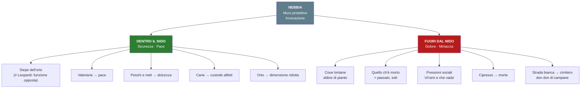

#### Confronto: la siepe in Leopardi e in Pascoli

| | Leopardi (*L'Infinito*) | Pascoli (*Nebbia*) |
|---|---|---|
| **Funzione** | Ostacolo fisico che **stimola** l'immaginazione | Barriera che **protegge** e delimita |
| **Effetto** | Il poeta va **oltre** con il pensiero | Il poeta si augura di **non uscire** |
| **Significato** | Trampolino verso l'infinito | Recinto del nido |

---

## 8. Pascoli e D'Annunzio: confronto sinottico

| Aspetto | **PASCOLI** | **D'ANNUNZIO** |
|---------|-------------|----------------|
| **Ruolo del poeta** | Fanciullino interiore | Vate / Superuomo |
| **Come si realizza** | Sguardo puro e stupito | Culto della bellezza, personalità straordinaria |
| **Poetica** | Piccole cose, umili, quotidiane | Vita inimitabile, imprese eroiche |
| **Vita** | Ritirata, nido familiare | Primo influencer della storia |
| **Temi** | Natura, morte, lutto, nido, perdita | Amori, bello, lotta |
| **Politica** | Socialismo (Andrea Costa) → nazionalismo | Nazionalismo, poeta-soldato |
| **Biografia** | Orfano, alcolista, vita domestica | Relazione con Eleonora Duse, impresa di Fiume |
| **Ambiente** | Agreste, rurale, semplice | Lussuoso, mondano, estetizzante |
| **Matrice comune** | Sfiducia nella scienza, realtà come mistero, conoscenza irrazionale | Sfiducia nella scienza, realtà come mistero, conoscenza irrazionale |
| **Ruolo storico** | Fondatori della poesia del Novecento (Mengaldo) | Fondatori della poesia del Novecento (Mengaldo) |

### D'Annunzio in pillole (dalla prof)

- **Primo influencer della storia**: imprese fuori dal comune
- Occupò **Fiume** con un esercito, fondando la **Reggenza del Carnaro** (dopo la Prima Guerra Mondiale)
- **Poeta-soldato**: partecipa attivamente alle vicende del suo tempo
- Propone un'immagine di sé **eroica**, fuori dal comune
- Relazione celebre con **Eleonora Duse** (la più grande attrice drammatica del primo Novecento)
- **Esteta**: vuol fare della vita un'opera d'arte → **vita inimitabile**
- Il "vate" = uomo di straordinarie capacità, che vede ciò che gli altri non vedono, si erge al di sopra dell'uomo comune

> **Nota della prof sull'estetismo**: "Se siete a Joyce, avrete già parlato di estetismo nella letteratura inglese, di Oscar Wilde" — collegamento interdisciplinare con Inglese.

---

## 9. Mappa tematica complessiva

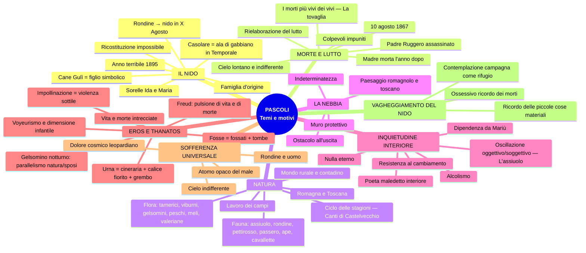

---

## 10. Compiti, pagine da studiare e riferimenti al libro

### Pagine assegnate dalla prof

| Argomento | Pagine | Lezione |
|-----------|--------|---------|
| **Biografia** | pp. 296 e seguenti | 17/02/26 |
| **Poetica** | pp. 298–305 (Fanciullino compreso) | 17/02/26, 24/02/26 |
| **Il Fanciullino** (testo + analisi) | pp. 306–308 | 17/02/26 |
| **Myricae** (introduzione) | pp. 309–312 | 24/02/26 |
| **Arano** (testo + analisi) | pp. 315–316 | 23/02/26 |
| **Lavandare** (testo + analisi) | fino a p. 318 | 24/02/26 |
| Escluso: "La grande proletaria si è mossa" | — | 17/02/26 |

### Materiale aggiuntivo

| Materiale | Fonte | Note |
|-----------|-------|------|
| Saggio di **Marco Santagata** sull'*Assiuolo* ("Un piccolo io") | Indicato dalla prof | Materiale d'esame (citato 02/03/26) |
| Analisi di **Nebbia** | Inviata dalla prof (da un altro libro) | Probabilmente non sul libro di testo |
| Tutti i testi poetici con le relative analisi | Libro + appunti | — |

### Indicazioni per l'interrogazione (02/03/26)

> *"Ricordate che quando vi chiedo le poesie di Pascoli vi chiedo anche a quale raccolta appartengono: se appartengono a Myricae, se appartengono ai Canti di Castelvecchio; quali sono le caratteristiche dell'una, quali sono le caratteristiche dell'altra raccolta e quali sono poi anche gli elementi in comune."*

> *"Per Pascoli dovete concludere lo studio dell'autore sugli appunti e sul libro. Tutta la parte teorica sul libro, integrare con gli appunti, la parte della poetica, i testi e l'analisi del testo."*

> [!WARNING] Da studiare a casa
> - La prof indica di studiare anche **l'analisi del libro** per ogni testo, non solo gli appunti di classe
> - Integrare sempre libro + appunti
> - Distinguere chiaramente *Myricae* dai *Canti di Castelvecchio* (caratteristiche, temi, differenze)

---

## 11. Domande da interrogazione

Domande ricavate dalle dinamiche di classe e dalle indicazioni della prof:

### Domande generali

1. **Qual è il contesto culturale in cui si colloca Pascoli?** (Simbolismo francese → Decadentismo italiano; Baudelaire, Verlaine, Rimbaud; ruolo del poeta veggente)
2. **Qual è la matrice comune tra Pascoli e D'Annunzio?** (Sfiducia nella scienza, realtà come mistero, conoscenza irrazionale — ma esiti opposti)
3. **Quali sono i fatti biografici più rilevanti per la poetica?** (Morte del padre, morte della madre, nido con le sorelle, anno terribile, Castelvecchio)
4. **Perché Andreoli parla di Pascoli come "caso clinico"?** (Trauma, alcolismo, rapporto morboso con le sorelle, cirrosi epatica)

### Domande sulla poetica

5. **Che cos'è il Fanciullino?** (Prosa del 1897; il poeta = voce del fanciullino interiore; sguardo puro e stupito; scoperta, non invenzione)
6. **Qual è la differenza tra il fanciullino di Pascoli e il fanciullo di Leopardi?** (Ferito vs. vitale; angosciato vs. immaginativo)
7. **La poesia di Pascoli ha un fine educativo?** (No, non deliberato — ma i valori morali emergono naturalmente)
8. **Che cos'è il fonosimbolismo?** (Procedimento per cui il suono allude a un contenuto simbolico. Es: "chiù" = angoscia)
9. **Che cosa intende Contini con le tre categorie?** (Pre-grammaticale = onomatopee; grammaticale = tradizione; post-grammaticale = tecnicismi)
10. **Perché Pascoli è definito "fondatore della poesia del Novecento"?** (Mengaldo; disintegratore della forma tradizionale; rivoluzionario nella tradizione)

### Domande sui testi

11. **A quale raccolta appartiene [poesia X]?** (Distinguere *Myricae* dai *Canti di Castelvecchio*)
12. **Qual è il significato della nebbia in Pascoli?** (Doppio: muro protettivo + ostacolo all'uscita)
13. **Che cos'è l'ampliamento della valenza semantica?** (Una parola assume più significati: "fosse" = fossati + tombe; "urna" = calice del fiore + urna cineraria + grembo della sposa)
14. **Qual è il significato del "nido" in Pascoli?** (Famiglia d'origine, sicurezza, protezione — ma anche chiusura, resistenza al cambiamento)
15. **Qual è la funzione della siepe in Pascoli rispetto a Leopardi?** (Opposta: in Leopardi stimola l'immaginazione, in Pascoli protegge dal mondo esterno)
16. **Che cos'è il madrigale?** (Due terzine + una quartina — forma legata alla poesia popolare)
17. **Come si manifesta il parallelismo in X Agosto?** (Rondine ↔ padre; tetto ↔ nido; insetto ↔ bambole; rondinini ↔ figli)
18. **Perché le poesie di Pascoli non sono semplici quadretti naturalistici?** (Fitta trama di riferimenti simbolici; ampliamento semantico; ogni verso ha più livelli di lettura)
19. **Su quale figura retorica è costruito *L'assiuolo*?** (Climax ascendente: voce → singulto → pianto di morte. Progressione dell'angoscia attraverso le tre strofe)
20. **Che cos'è l'analogia in *Temporale*?** (Casolare bianco = ala di gabbiano; somiglianza non esplicita ma intuitiva; rapporti segreti tra le cose. Protezione e leggerezza)
21. **Qual è il rapporto tra Eros e Thanatos ne *Il gelsomino notturno*?** (Parallelismo natura/sposi; il fiore si apre nell'ora dei morti; "fosse" = tombe; "urna" = calice + cineraria + grembo; impollinazione = violenza sottile; dove c'è vita c'è morte)
22. **In che senso Pascoli ha un atteggiamento "voyeuristico" nel *Gelsomino notturno*?** (Osserva dall'esterno la prima notte di nozze; paura + curiosità; estraneità all'Eros; dimensione infantile)
23. **Che cosa sono i "sistri d'argento" ne *L'assiuolo*?** (Strumenti musicali egiziani del culto dei morti, propri del culto di Iside/Osiride → le cavallette producono un suono che rimanda alla morte; "finissimi sistri" = fonosimbolismo: suono sottile per le "i")
24. **Come sono presentati i morti ne *La tovaglia*?** (Da "tristi, pallidi" (visione adulta, minacciosa) a "buoni, poveri" (visione della donna/Pascoli, consolatoria). I morti sono più vivi dei vivi. Nessuna consolazione cristiana)
25. **Quali sono le caratteristiche dei *Canti di Castelvecchio*?** (Continuazione di *Myricae*; campagna toscana anziché romagnola; ciclo delle stagioni; tema dei cari morti con frequenza ossessiva; tema nuovo: Eros e Thanatos)
26. **Qual è il significato di "pigolio di stelle"?** (Sinestesia: dato uditivo "pigolio" + visivo "stelle"; la Chioccetta = le Pleiadi; l'aia azzurra = il cielo. Il tremolio delle stelle associato intuitivamente a un suono)
27. **Quali sono i temi pascoliani fondamentali?** (Vagheggiamento del nido; contemplazione della campagna come rifugio; ossessivo ricordo dei morti; rapporto Eros e Thanatos — riepilogo della prof, 26/02/26)

---

> [!NOTE] Nota finale
> Questo schema è stato compilato dalle trascrizioni di tutte le 6 lezioni indicate. Per una preparazione completa all'esame, integrare con:
> - **Libro di testo** (pp. 296–318 + analisi dei singoli testi)
> - **Analisi di Nebbia** inviata dalla prof
> - **Saggio di Marco Santagata "Un piccolo io"** su *L'assiuolo* (materiale d'esame)
> - Eventuale ulteriore lezione citata dalla prof (02/03/26): "Forse leggeremo un altro testo poetico, poi Pascoli lo chiudiamo lì"
