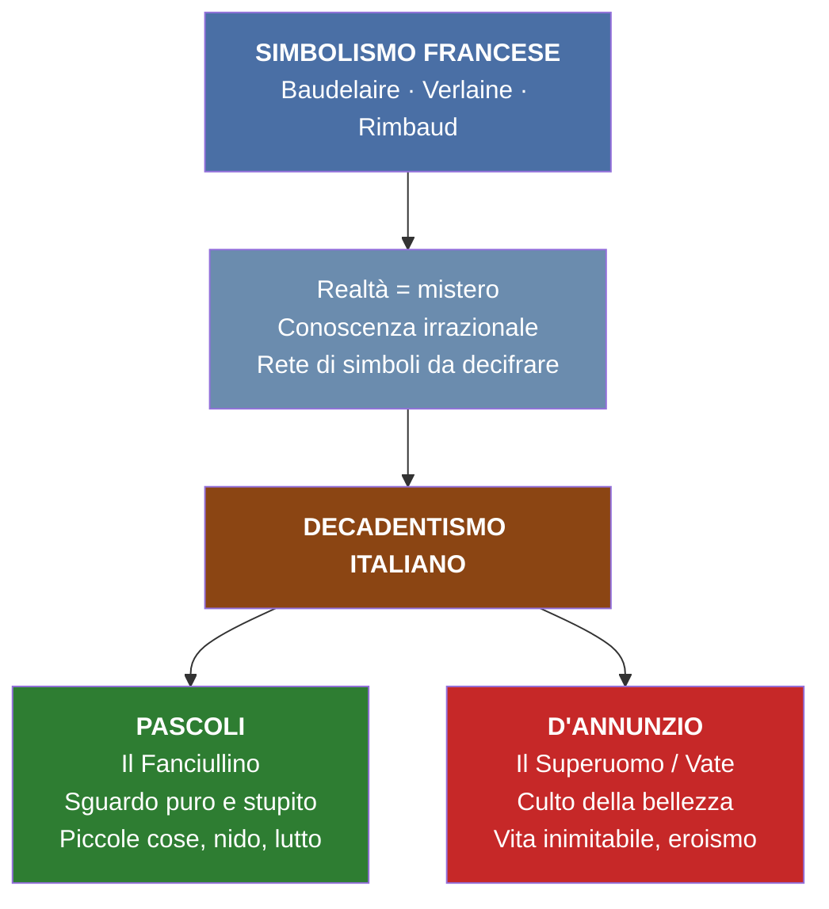
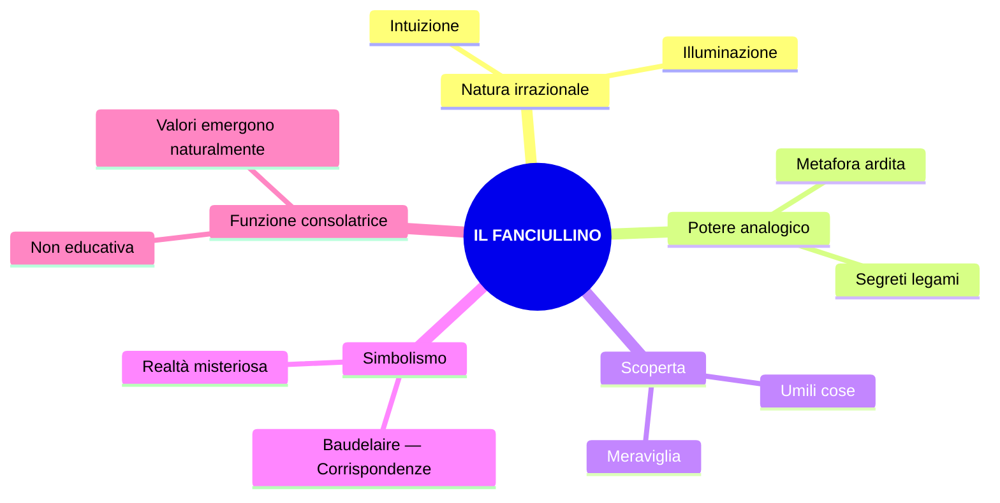

# RIASSUNTO — GIOVANNI PASCOLI

> **Fonti**: lezioni del 16/02/26, 17/02/26, 23/02/26, 24/02/26, 26/02/26, 02/03/26
> **Ultimo aggiornamento**: compilato dalle trascrizioni di tutte le lezioni in classe

---

## 1. Contesto: dal Simbolismo francese al Decadentismo italiano

### Il ruolo del poeta nel Simbolismo

Dal **Simbolismo francese** (**Baudelaire**, **Verlaine**, **Rimbaud**) nasce il **Decadentismo italiano** (ultimi decenni dell'Ottocento). Il ruolo del poeta è stato analizzato attraverso due testi di Baudelaire:

1. ***La perdita dell'aureola*** (dallo *Spleen di Parigi*) — prosa: **perdita di sacralità** del poeta in una società improntata solo all'utile
2. ***L'albatro*** (da *I fiori del male*) — poesia: il poeta come grande uccello marino, re dell'azzurro ma goffo e deriso a terra → **isolamento e marginalità** nella società borghese
3. ***Corrispondenze***: testo fondamentale — la realtà come rete di **simboli** da decifrare

### La "Lettera del Veggente" di Rimbaud

> Il poeta deve farsi **veggente**: deve essere in grado di vedere ciò che l'uomo comune non vede, disvelando il mistero dell'esistenza.

La realtà **non è indagabile razionalmente** ma è un **mistero** da disvelare attraverso **irrazionalità**, **illuminazione**, **intuizione**.

### Matrice comune Pascoli–D'Annunzio

Nonostante poetiche apparentemente opposte, condividono:
- **Sfiducia nella scienza** e nella conoscenza razionale
- Realtà come **misteriosa, complessa, allusiva**
- Conoscenza per **intuizione e illuminazione**, non per causa ed effetto
- Entrambi partono dal Simbolismo, ma gli **esiti sono opposti**

---

## 2. Biografia di Giovanni Pascoli

### Timeline biografica

| Anno | Evento |
|------|--------|
| **1855** | Nasce a **San Mauro di Romagna** da Ruggero Pascoli e Caterina Allocatelli Vincenzi |
| **1862** | Studia presso i Padri Scolopi a **Urbino** (collegio religioso) |
| **1867** | **Assassinio del padre Ruggero** — 10 agosto, agguato sulla via del ritorno. Colpevoli impuniti |
| **1868** | Morte della **madre**. Rimane orfano con fratelli e sorelle |
| **1871–1873** | Liceo a Rimini |
| **1873** | Si iscrive a Lettere all'Università di **Bologna** — studi con **Carducci** |
| **1882** | Si laurea in greco. Con l'appoggio di Carducci ottiene cattedra a **Matera** |
| **1884** | Trasferito al liceo di **Massa** |
| ~**1885** | Si trasferisce in Toscana, chiama a vivere con sé le sorelle **Ida** e **Maria** |
| **1891** | Prima edizione di ***Myricae*** — dedicata al padre Ruggero |
| **1895** | **Anno terribile** — matrimonio della sorella Ida a Sogliano |
| **1897–1903** | Insegna letteratura latina a **Messina**; ritorna spesso a Castelvecchio |
| **1902** | Acquista la casa di **Castelvecchio di Barga** col ricavato di 5 medaglie d'oro vinte ad Amsterdam |
| **1905** | Succede a Carducci nella cattedra di letteratura italiana a **Bologna** |
| **1907** | Edizione definitiva dei ***Canti di Castelvecchio*** |
| **1912** | Morte a Castelvecchio — 6 aprile. **Cirrosi epatica** (diagnosi taciuta all'epoca) |

### I luoghi di Pascoli

| Luogo | Periodo | Significato |
|-------|---------|-------------|
| **San Mauro di Romagna** | Nascita e infanzia | Mondo rurale, flora e fauna tra collina e mare. La Romagna ritorna nella poesia. "Scrive anche un'ode alla piadina" (cit. prof) |
| **Urbino** | Studi giovanili | Collegio religioso dei Padri Scolopi |
| **Bologna** | Università e poi cattedra | Allievo e poi successore di Carducci (1905) |
| **Matera → Massa** | Insegnamento liceale | Prima esperienza professionale |
| **Castelvecchio di Barga** | Maturità | Casa acquistata con le medaglie d'oro. Vive con Mariù. Luogo della morte |

### La morte del padre — evento fondante

- **Ruggero Pascoli** era amministratore della tenuta "**La Torre**" dei principi Torlonia (visitabile ancora oggi)
- La carica era **ben remunerata** e ambita
- Fu probabilmente assassinato da **due sicari** per conto di un uomo che aspirava a quel ruolo
- La Romagna dell'epoca era "una terra violenta di banditi, di fuorilegge" (cit. prof)
- Colpevoli **rimasti impuniti**: nessuna giustizia
- Morte **inaspettata**, con un colpo di fucile, la sera del **10 agosto 1867**
- L'anno successivo muore la **madre**; poi in successione una sorella e un fratello
- Per la critica letteraria, **tutta la produzione** è interpretabile come tentativo di **rielaborazione del lutto**

> **Nota**: il film *Zvanì* di Giuseppe Piccioni racconta la vicenda umana di Pascoli. "Zvanì" = soprannome dialettale = Giovannino. La prof non lo consiglia.

### Il nido e le sorelle

1. Pascoli chiama a vivere con sé le sorelle **Ida** e **Maria** in Toscana
2. Nel 1895 Ida si sposa → per Pascoli è l'**"anno terribile"**
3. A livello psichico, investe Ida della figura della **madre**
4. Il tentativo di ricreare il nido esprime **resistenza al cambiamento**, al mondo esterno
5. Dopo il matrimonio di Ida, resta con **Maria (Mariù)** — presenza "costante e ossessionante"

### Posizione politica

- Inizialmente vicino al **socialismo** di **Andrea Costa** → breve parentesi politica, **incarcerato a Bologna** e poi liberato
- Successivamente orientato verso il **nazionalismo**
- A differenza di D'Annunzio, **non partecipa attivamente** alle vicende del suo tempo

---

## 3. Il "caso clinico" Pascoli — Vittorino Andreoli

> **Rif.**: Andreoli, *I segreti di casa Pascoli. Il poeta e lo psichiatra*

Lo psichiatra ha condotto un'indagine a posteriori (scritti privati, lettere, fotografie, armadi, documentazione sanitaria di Castelvecchio):

### 1. Il trauma

La morte del padre = **frattura** (trauma = rottura). Fondamentale: rimase **senza colpevoli**, nessuna giustizia, morte del tutto inaspettata.

### 2. L'ipotesi dell'alcolismo

- Andreoli la avanza anche dall'analisi delle **fotografie**: la **circonferenza dell'addome** era tipica di un consumatore assiduo di alcol
- **Lettera a Maria**: *"Vado a letto quasi sempre con la **testa piena di cognac**. Non sono sereno. Questo è l'anno terribile."*
- Nella stessa lettera: *"Dimmi Mariù: tu mi ami da sorella, perché ti dà dispiacere che io ami una donna da amante, da sposa, da marito?"*

### 3. Rapporto morboso con le sorelle

- Sentimenti verso Ida che sfociano forse in qualcosa di **morboso, incestuoso** (tesi di Andreoli)
- **Gelosia ossessiva di Mariù**: considerava il fratello come un **marito**
- Episodio: Mariù aveva messo un **filo ancorato al piede** di ciascuno per verificare assenza di spostamenti notturni
- Il **cane Gulì** = interpretato come "il **figlio di una coppia sterile**"

### 4. La morte — cirrosi epatica

> "Giovanni Pascoli muore alle 15:20 del 6 aprile 1912 di **cirrosi epatica**" — Andreoli

La diagnosi fu **taciuta** all'epoca. Testimoniata anche dalle **pancere** trovate nei cassetti.

### 5. Il ruolo di Maria dopo la morte

- Diventa **depositaria di tutta l'eredità letteraria** e fornitrice delle "versioni ufficiali"
- Fece seppellire il fratello con **aperture** nel sepolcro per **toccare i piedi e la testa**

### Rivalutazione del poeta

Per molto tempo ritenuto il "poeta del fanciullino" in un'aura serena. **In realtà** si avvicina ai **poeti maledetti** francesi per inquietudini, interiorità e sensibilità. Rivalutazione dagli **anni '50**.

> D'Annunzio scrisse: *"Giovanni Pascoli è il più grande e originale poeta apparso in Italia dopo il Petrarca"*

---

## 4. Poetica: Il Fanciullino

### Il testo

- **Anno**: 1897 — **Genere**: prosa poetica — **Definizione**: dichiarazione di poetica

### I passi letti in classe

> *"È dentro noi un fanciullino [...] Quando la nostra età è tuttavia tenera, egli confonde la sua voce con la nostra, e dei due fanciulli che ruzzano e contendono tra loro [...] si sente un palpito solo."*

Il fanciullino conserva ciò che l'adulto perde: la **meraviglia**, la capacità di stupirsi.

> *"Noi ingrossiamo e arrugginiamo la voce, ed egli fa sentire tuttavia e sempre il suo **tinnulo squillo** come di campanello."*

| L'adulto | Il fanciullino |
|----------|----------------|
| Ingrossa e arrugginisce la voce | **Tinnulo squillo come di campanello** |
| Voce profonda, roca | Voce squillante, limpida, cristallina |
| Condizionato da educazione e convenzioni | Sguardo puro, innocente, senza artifici |

**"Tinnulo squillo"**: parole **onomatopeiche** (significante = significato). "Come di campanello" = similitudine. Insieme: **fonosimbolismo** — il suono richiama un simbolo.

> *"Il nuovo non si inventa, si scopre."*

Il fanciullino vede il **nuovo nelle cose di tutti i giorni** e se ne meraviglia.

> *"Il poeta è poeta, non oratore o predicatore, non filosofo, non istorico, non maestro, non tribuno o demagogo."*

La poesia **non ha scopo educativo deliberato**, ma i valori morali emergono **naturalmente** → funzione **consolatrice**.

### Fanciullino di Pascoli vs. fanciullo di Leopardi

| Pascoli | Leopardi |
|---------|----------|
| Fanciullino **ferito**, angosciato, ripiegato su sé stesso | Fanciullo **vitale**, energico, immaginativo |
| Ricerca dolorosa della pace perduta | Capacità immaginativa legata alla giovinezza |

Il fanciullino di Pascoli è un **rimpianto**, un **ricordo**, la **dimensione perduta** che ricerca per tutta la vita.

### 5 punti cardine (sintesi della prof)

1. **Natura irrazionale e intuitiva** della poesia — coerente con il Decadentismo
2. **Potere analogico e suggestivo** — l'analogia esprime i segreti legami della realtà (metafora ardita)
3. **Poesia come scoperta** — al centro le **umili cose**
4. **Simbolismo** — realtà complessa, oscura, misteriosa, fatta di simboli (Baudelaire, *Corrispondenze*)
5. **Funzione consolatrice** — nessuna finalità educativa deliberata

---

## 5. Lingua e stile

### Pascoli fondatore della poesia del Novecento

Secondo **Mengaldo**, Pascoli e D'Annunzio sono i **fondatori della poesia del Novecento**.

| Critico | Definizione |
|---------|-------------|
| (anonimo) | **"Disintegratore della forma poetica tradizionale"** |
| **Gianfranco Contini** | **"Rivoluzionario nella tradizione"** — recupera modelli tradizionali ma li reinventa |
| **Pier Paolo Pasolini** | Pascoli incide sulle **sperimentazioni** del Novecento |

### Il plurilinguismo

| Registro | Esempi |
|----------|--------|
| **Basso/colloquiale** | Linguaggio familiare, quotidiano |
| **Tecnico/settoriale** | Botanica: *tamerici, viburni, pampano, marra, porche, maggese, valeriane* |
| **Vernacolare/dialettale** | Romagnolo e toscano |
| **Latino** | Titoli (*Myricae*), classicità greca e latina |

### Le tre categorie di Contini

| Categoria | Significato | Esempi |
|-----------|-------------|--------|
| **Pre-grammaticale** | Prima delle regole = linguaggio del fanciullino | Onomatopee, fonosimbolismo, suoni non articolati |
| **Grammaticale** | Convenzionale = dentro la tradizione | Regole grammaticali, tradizione letteraria |
| **Post-grammaticale** | Oltre le regole = specialistico | Tecnicismi botanici, plurilinguismo |

### Il fonosimbolismo

Il **suono** (significante) di una parola **allude a un contenuto simbolico** (significato).

> **Esempio chiave — L'assiuolo**: il verso "**chiù**" si chiude sulla "u" accentata → evoca **angoscia, lutto, inquietudine**. Diventa **simbolo dell'angoscia** per la perdita del padre.

> **Esempio — i viburni**: nome scelto per il **suono** — vocali "u" e "o" evocano **oscurità, cupezza, mistero**.

- **Onomatopea propria**: riproduce direttamente il suono (*tic tac, chiù, don don*)
- **Onomatopea impropria**: parola che richiama il suono (*ticchettare, sciabordare*)
- **Allitterazione**: ripetizione consonantica (*siepi, s'ode, suo, sottil*)

### Il ritmo

Verso **franto**, frammentato:
- **Lineette** per isolare termini
- **Parentesi** all'interno dei versi (mai visto in Petrarca o Leopardi)
- Grande **variabilità di segni d'interpunzione**
- **Pause** che spezzano il ritmo dell'endecasillabo

### Linguaggio metaforico — ampliamento della valenza semantica

Una parola assume **più significati** simultaneamente:

| Parola | Significato letterale | Significato simbolico |
|--------|----------------------|----------------------|
| **"fosse"** | Fossati, avvallamenti | **Sepolture**, tombe |
| **"urna"** | Urna cineraria (morte) | **Calice del fiore** impollinato (vita) |

> *"Cresce l'erba sopra le fosse"* → letteralmente l'erba sui fossati; simbolicamente sulle **tombe** → **Vita e morte** come ciclo.

> La parola "urna" contiene **Eros e Thanatos**, vita e morte.

**Osservazione fondamentale della prof**: per molti anni la poesia pascoliana è stata intesa come **bozzetto naturalistico**. In realtà è **densissima di rimandi analogici**.

### Figure retoriche più ricorrenti

| Figura | Definizione | Esempio |
|--------|-------------|---------|
| **Analogia** | Metafora ardita | Legami nascosti tra elementi lontani |
| **Sinestesia** | Sfere sensoriali diverse | *"Odore di fragole rosse"* (olfatto + vista) |
| **Onomatopea** | Riproduzione del suono | *chiù, don don, sciabordare* |
| **Allitterazione** | Ripetizione consonantica | *siepi, s'ode, suo, sottil* |
| **Fonosimbolismo** | Suono → significato simbolico | *chiù* = angoscia; *viburni* = oscurità |
| **Anastrofe** | Inversione sintattica | *"roggio nel filare / qualche pampano brilla"* |
| **Enallage/Ipallage** | Scambio di funzioni logiche | *"marra pazïente"* (paziente = il contadino) |

### La musica del verso

> La poesia deve essere anche **musica** (eco di Verlaine: "la musica prima di ogni cosa"). Insistita trama fonetica che rende i versi musicali.

---

## 6. Le raccolte poetiche

### Panoramica delle opere

| Opera | Anno | Note |
|-------|------|------|
| ***Myricae*** | 1891 (1ª ed.) | Dedicata al padre. Titolo da Virgilio |
| ***Il Fanciullino*** | 1897 | Prosa poetica — dichiarazione di poetica |
| ***Poemi conviviali*** | 1904 | — |
| ***Primi poemetti*** | 1904 | — |
| ***Odi e Inni*** | ~1905 | — |
| ***Canti di Castelvecchio*** | 1907 (ed. def.) | Seconda raccolta principale |
| ***Nuovi poemetti*** | ~1909 | — |

### *Myricae*

- **Titolo**: dal latino, recupero virgiliano (Virgilio: *Bucoliche*, *Georgiche*, *Eneide*)
- **Significato**: le **tamerici** — arbusti che crescono lungo le dune sabbiose, in territori difficili
- **Simbolo**: poesia fatta di **piccole cose**, oggetti umili (vs. rosa, giglio, alloro della tradizione)
- **Dedicata a**: Ruggero Pascoli
- **Temi centrali**: natura, umili cose, nido, assenza, lutto, i morti
- **Forma**: spesso il **madrigale** (2 terzine + 1 quartina), versi endecasillabi

### *Canti di Castelvecchio*

- **Anno**: 1903 (ed. def. 1907) — **ideale continuazione** di *Myricae*
- Stessi temi: vita di campagna, canti d'uccelli, alberi, fiori — ma non la campagna **romagnola** (San Mauro) bensì quella **toscana** (Garfagnana)
- I componimenti si susseguono secondo il **ciclo delle stagioni** → consolazione rassicurante rispetto ai dolori dell'esistenza
- Ricorre con **frequenza ossessiva** il tema dei **cari morti**, della tragedia familiare e del tentativo di ricostituire il nido
- **Tema nuovo**: **Eros e Thanatos** — la spinta vitale (desiderio, procreazione — termine ripreso da Freud per la pulsione di vita) intrecciata con le istanze di morte (distruzione, autodistruzione). Al centro de *Il gelsomino notturno*
- La nebbia è elemento ricorrente in **entrambe** le raccolte
- Per l'interrogazione: distinguere le due raccolte (caratteristiche, temi, differenze, elementi in comune)

---

## 7. Analisi dei testi poetici

---

### 7.1 *Arano* (*Myricae*)

**Struttura**: madrigale (2 terzine + 1 quartina), endecasillabi | **Pag. libro**: 315–316

#### Testo

> *Al campo, dove roggio nel filare*
> *qualche pampano brilla, e dalle fratte*
> *sembra la nebbia mattinal fumare,*
>
> *arano: a lente grida, uno le lente*
> *vacche spinge; altri semina; un ribatte*
> *le porche con sua marra pazïente;*
>
> *ché il passero saputo in cor già gode,*
> *e tutto spia dai rami irti del moro;*
> *e il pettirosso: nelle siepi s'ode*
> *il suo sottil tintinno come d'oro.*

#### Analisi

**vv. 1-3 — Prima terzina** (dato VISIVO): *"Al campo"* — indicazione spaziale **indeterminata**. **Anastrofe**: "roggio" concorda con "pampano" (foglia della vite, diventata rossa → **autunno**), non con "filare". Nebbia che sembra fumare dalle fratte (cespugli) → atmosfera **indefinita**, un mare di nebbia con luci di foglie rosse.

**vv. 4-6 — Seconda terzina** (dato UDITIVO + VISIVO): *"arano"* — primo verbo, soggetti esplicitati **solo dopo** → **sospensione, indeterminatezza**. "A lente grida, uno le lente vacche spinge" → **monotonia, fatica** del lavoro ripetitivo. **"Pazïente"**: concordato con "marra" (zappa) ma si riferisce logicamente al contadino → **enallage/ipallage** → straniamento. I due puntini sulla i = **dieresi** (iato per mantenere l'endecasillabo: pa-zï-en-te). Tecnicismi: *porche* = zolle, *marra* = zappa.

**vv. 7-10 — Quartina** (dato UDITIVO → apertura): passero "saputo" (accorto) che gode perché **c'è stata la semina**. "Rami **irti** del moro" → fonosimbolismo (r-t, suoni aspri). **"E il pettirosso: nelle siepi s'ode / il suo sottil tintinno come d'oro"**: **allitterazione** (*siepi, s'ode, suo, sottil*); **onomatopea** (*tintinno*); **"come d'oro"** = similitudine + **sinestesia** (suono "tintinno" + visivo "oro"). Apertura alla **speranza, solarità**.

---

### 7.2 *Lavandare* (*Myricae*)

**Struttura**: madrigale | **Pag. libro**: fino a p. 318

#### Testo

> *Nel campo mezzo grigio e mezzo nero*
> *resta un aratro senza buoi, che pare*
> *dimenticato tra il vapor leggero.*
>
> *E cadenzato dalla gora viene*
> *lo sciabordare delle lavandare*
> *con tonfi spessi e lunghe cantilene.*
>
> *Il vento soffia e nevica la frasca*
> *e tu non torni ancora al tuo paese:*
> *quando partisti, come son rimasta!*
> *Come l'aratro in mezzo alla maggese.*

#### Analisi

**vv. 1-3 — Prima terzina** (VISIVO): "mezzo grigio e mezzo nero" = terra intatta + zolle rivoltate → campo **a metà arato**. Aratro "senza buoi" = **solitudine, abbandono**. "Vapor leggero" = nebbia → atmosfera **indefinita**. Doppio significato della nebbia: **muro protettivo** + **ostacolo** all'uscita.

**vv. 4-6 — Seconda terzina** (UDITIVO): **gora** = canale. **"Sciabordare"** = onomatopea (suono del lavare i panni). **"Tonfi"** = onomatopea. "Lunghe cantilene" = cadenza e **monotonia** del canto. Rima interna: -are / -are.

**vv. 7-10 — Quartina** (canto popolare): "soffia" = onomatopeico. **"Nevica la frasca"** = "nevica" usato transitivamente (far cadere le foglie) → **licenza poetica**. "Tu non torni" = affetto lontano, canto di **abbandono**. "Quando partisti, come son rimasta!" = malinconia, nostalgia, rimpianto. **Struttura circolare**: si chiude sull'aratro della prima strofa. **Maggese**: nella rotazione triennale, campo lasciato **incolto** → simbolo di **solitudine, abbandono**.

> Le poesie di Pascoli **non** sono quadretti naturalistici: rappresentano una **fitta trama di riferimenti simbolici**.

---

### 7.3 *X Agosto* (*Myricae*)

**Tema**: morte del padre Ruggero, **10 agosto 1867** (giorno di San Lorenzo, stelle cadenti).

#### Parallelismo simmetrico rondine ↔ padre

| Rondine | Padre |
|---------|-------|
| Ritornava al **tetto** (metonimia = casa) | Tornava al suo **nido** (= famiglia) |
| L'uccisero | L'uccisero |
| Portava un **insetto** (la cena dei rondinini) | Portava **due bambole** in dono |
| Come in **croce**, tende il verme al cielo | Immobile, **addita** le bambole al cielo |
| Il nido **pigola** sempre più piano | Nella casa **romita** lo aspettano invano |

È "una delle poesie più **costruite** di Pascoli" — tutta elaborata sulla simmetria (cit. prof).

#### Analisi strofa per strofa

**Strofa 1**: *"San Lorenzo, io lo so perché tanto / di stelle per l'aria tranquilla / arde e cade"* — **apostrofe**. "Tanto di stelle": "tanto" come soggetto sostantivo + partitivo → **vastità cosmica**. Stelle cadenti = **pianto del cielo**, presagio luttuoso.

**Strofa 2**: *"Ritornava una rondine al tetto: / l'uccisero: cadde tra spini"* — **metonimia** (tetto = casa). "Spini" + poi "croce" → rimando alla **Passione di Cristo** → sacrificio, sofferenza. Pascoli **non è credente** ma recupera l'immagine cristologica. "Rondinini" = diminutivo affettuoso. "La cena" = **personificazione**.

**Strofa 3**: *"come in croce, che tende / quel verme a quel cielo lontano"* — cielo **irraggiungibile**, preghiere inascoltate → posizione simile a **Leopardi** (Luna indifferente). "Pigola sempre più piano" = i rondinini **muoiono**.

**Strofa 4**: *"Anche un uomo tornava al suo nido"* — indeterminato ma è il padre → riflesso autobiografico. **"Nido"** = unione familiare. **"Perdono"**: ultime parole immaginate. *"Restò negli aperti occhi un grido"* = **sinestesia** (uditivo/visivo). Tre puntini tra "perdono" e "portava" = **reticenza**.

**Strofa 5**: "romita" = isolata. *"Lo aspettano, aspettano invano"* = ripetizione → attesa **inutile**. Nessuna fede nel ricongiungimento ultraterreno.

**Strofa 6**: *"E tu, Cielo, dall'alto dei mondi / sereni, infinito, immortale, / oh! d'un pianto di stelle lo inondi / quest'atomo opaco del male!"* — **"Cielo"** con C maiuscola = personificazione (≈ Dio). **"Quest'atomo opaco del male"** = perifrasi per la Terra: *atomo* (piccolezza), *opaco* (senza luce), *del male* (dolore). **Struttura circolare**: "pianto di stelle" riprende la prima strofa.

#### Temi fondamentali

| Tema | Come si manifesta |
|------|------------------|
| **Sofferenza universale** | Accomuna rondine e uomo |
| **Dolore cosmico** | Modello: Leopardi, *La Ginestra* |
| **Cielo indifferente** | Lontano, irraggiungibile, sordo |
| **Nido distrutto** | Famiglia disgregata dalla violenza |
| **Assenza di giustizia** | Morte inaspettata, colpevoli impuniti |
| **Rielaborazione del lutto** | Padre idealizzato nel gesto paterno |

---

### 7.4 *Nebbia* (*Canti di Castelvecchio*)

**Nota**: probabilmente non sul libro di testo. La prof ha inviato un'analisi da un altro libro.

#### Testo

> *Nascondi le cose lontane,*
> *tu, nebbia impalpabile e scialba,*
> *tu, fumo che ancora rampolli*
> *su l'alba*
> *da' lampi notturni e da' crolli*
> *d'aeree frane.*
>
> *Nascondi le cose lontane,*
> *nascondimi quello ch'è morto!*
> *ch'io veda soltanto la siepe*
> *dell'orto,*
> *la mura ch'ha piene le crepe*
> *di valeriane.*
>
> *Nascondi le cose lontane,*
> *le cose son ebbre di pianto!*
> *ch'io veda i due peschi, i due meli*
> *soltanto,*
> *che danno soave lor miele*
> *pel nero mio pane.*
>
> *Nascondi le cose lontane*
> *che vogliono ch'ami e che vada!*
> *ch'io veda là solo quel bianco*
> *di strada,*
> *che un giorno ho da fare tra stanco*
> *don don di campane.*
>
> *Nascondi le cose lontane,*
> *nascondile, involale al volo*
> *del cuore! ch'io veda il cipresso*
> *là solo,*
> *qui solo quest'orto, cui presso*
> *sonnecchia il mio cane.*

#### Analisi strofa per strofa

**Strofa 1**: "impalpabile e scialba" = **sinonimia** (indeterminato, indefinito). Nebbia = fumo (come in *Arano*). "Crolli d'aeree frane" = metafora per una **tempesta** che si acquieta.

**Strofa 2**: **Poliptoto** (*nascondi/nascondimi*). "Quello ch'è morto" = il passato, i lutti. La **siepe**: in Leopardi (*L'infinito*) = ostacolo che stimola l'immaginazione → in Pascoli = **protezione**, delimitazione del nido (funzione **opposta**). **Valeriane** = pianta che induce il sonno → **pace, serenità**. L'unica serenità possibile è dentro lo spazio ridotto.

**Strofa 3**: "Ebbre di pianto" = tutto ciò che è fuori dal nido è impregnato di **dolore**. **Antitesi**: soave miele (consolazione del nido) vs. nero pane (sofferenza, fatica della vita).

**Strofa 4**: "ch'ami e che vada" = **pressioni sociali** (ma forse anche desiderio interiore → **rifiuto + attrazione**). "Strada bianca" = sentiero verso il **cimitero**. **"Don don"** = onomatopea propria; "stanco" = monotono; campane **a morto**. Vocali cupe/oscure. La fine = un **nulla eterno** (come Foscolo).

**Strofa 5**: "involale" = rubale — c'è un **sussulto**, un desiderio di vedere oltre, ma chiede alla nebbia di soffocarlo. **Cipresso** = albero cimiteriale → la **morte**. **Cane** = custode degli affetti (Gulì). Orto = dimensione **ridotta** del nido.

#### Siepe: Leopardi vs. Pascoli

| | Leopardi (*L'Infinito*) | Pascoli (*Nebbia*) |
|---|---|---|
| **Funzione** | Ostacolo che **stimola** l'immaginazione | Barriera che **protegge** e delimita |
| **Effetto** | Il poeta va **oltre** col pensiero | Il poeta si augura di **non uscire** |
| **Significato** | Trampolino verso l'infinito | Recinto del nido |

---

### 7.5 *Temporale* (*Myricae*)

**Struttura**: ballata minima di **settenari** (1 verso isolato + 6 versi)

#### Testo

> *Un bubbolio lontano...*
> *Rosseggia l'orizzonte, come affocato a mare; nero di pece, a monte, stracci di nubi chiare: tra il nero un casolare: un'ala di gabbiano.*

#### Analisi

Si apre su un **dato uditivo**: "bubbolio" = onomatopea **pregrammaticale** (Contini), mormorio minaccioso. Il temporale non è dichiarato ma **evocato** nella lontananza → **reticenza** (puntini di sospensione).

Poi **dati visivi** con **contrasti cromatici violenti**: orizzonte rosso (fuoco, lampi) / nero di pece a monte / stracci di nubi chiare (lembi irregolari).

Ultimo verso: *"tra il nero un casolare: un'ala di gabbiano"* → **analogia** tipicamente pascoliana. Il casolare bianco sul nero delle nubi richiama un'ala di gabbiano. Somiglianza dovuta al colore, ma non è metafora tradizionale: va colta **intuitivamente**, disvela i **rapporti segreti** tra le cose.

**Significato**: il casolare è l'unico dato di **pacificazione** (richiamo al nido). L'ala di gabbiano = **protezione** + **leggerezza** (elevarsi dalle sofferenze per accedere a una dimensione altra).

**Stile**: verso breve e franto (settenario), virgole, due punti, reticenza, linguaggio pregrammaticale, analogia, contrasti cromatici → tutti elementi tipici di Pascoli.

---

### 7.6 *L'assiuolo* (*Myricae*)

**Struttura**: tre strofe di **novenari**, ciascuna chiusa dall'onomatopea **"chiù"**
**Materiale d'esame**: saggio di **Marco Santagata "Un piccolo io"** — da studiare

L'assiuolo = rapace notturno simile al gufo; suono lugubre e malinconico reso con l'onomatopea propria "chiù".

#### Testo

> *Dov'era la luna? ché il cielo / nuotava in un'alba di perla, / ed ergersi il mandorlo e il melo / parevano a meglio vederla. / Venivano soffi di lampi / da un nero di nubi laggiù; / veniva una voce dai campi: / chiù.*
>
> *Le stelle lucevano rare / tra mezzo alla nebbia di latte: / sentivo il cullare del mare, / sentivo un fru fru tra le fratte; / sentivo nel cuore un sussulto, / com'eco d'un grido che fu. / Sonava lontano il singulto: / chiù.*
>
> *Su tutte le lucide vette / tremava un sospiro di vento: / squassavano le cavallette / finissimi sistri d'argento / tintinni a invisibili porte / che forse non s'aprono più?… / e c'era quel pianto di morte… / chiù.*

#### Struttura portante: climax ascendente

| Strofa | Il "chiù" è definito come | Grado |
|--------|---------------------------|-------|
| 1ª | Una **voce** dai campi | Neutro |
| 2ª | Un **singulto** | Lamentoso |
| 3ª | Un **pianto** di morte | Lugubre, luttuoso |

#### Analisi strofa per strofa

**Strofa 1** — Paesaggio sereno, primi segni di inquietudine:
- *"alba di perla"* = **analogia** (luce madreperlacea, iridescente del cielo)
- Il mandorlo e il melo "parevano ergersi" = **personificazione** + attenzione per il **lessico tecnico** (non dice "alberi" ma specifica le specie)
- *"soffi di lampi"* = **sinestesia** (soffi → udito; lampi → vista)
- *"da un nero di nubi laggiù"* = **allitterazione della N** + vocali cupe → **fonosimbolismo** (inquietudine)
- "Voce dai campi" → il verso dell'assiuolo da dimensione **indeterminata**; "chiù" con U accentata = vocale **cupa**, **luttuosa**

**Strofa 2** — Cerniera: dai sensi all'interiorità:
- *"nebbia di latte"* = **analogia** (chiarore diffuso della luna)
- *"cullare del mare"* = rimanda all'**infanzia**, alla cura materna
- *"sentivo... sentivo... sentivo"* = **anafora**. I primi due = percezione **sensoriale**; il terzo (*"nel cuore un sussulto"*) = dimensione **interiore, soggettiva**
- *"fru fru tra le fratte"* = **onomatopea propria** + allitterazione del gruppo FR → **fonosimbolismo**
- *"com'eco d'un grido che fu"* = **similitudine** → rimanda alla **morte del padre**
- "Singulto" = secondo passaggio del **climax**

**Strofa 3** — Culmine: la morte:
- *"lucide vette"* = cime delle foglie lucide per il riflesso della luna
- *"finissimi sistri d'argento"*: i **sistri** = strumenti musicali egiziani del **culto dei morti** (culto di **Iside**, sposa di **Osiride**, dio dei morti). "Finissimi sistri" = **fonosimbolismo** chiarissimo: suono **sottile** per le molte "i"
- *"invisibili porte / che forse non s'aprono più"* = porte dell'**aldilà**. Innovazione metrica: **interrogativa in parentetica** → Pascoli inventa il linguaggio del Novecento
- *"quel pianto di morte"* = **terzo passaggio del climax** (voce → singulto → pianto)

**Osservazione della prof**: è molto difficile distinguere il dato **oggettivo** da quello **soggettivo**; Pascoli rende una **continua oscillazione** tra realtà esterna e realtà interiore.

---

### 7.7 *Il gelsomino notturno* (*Canti di Castelvecchio*)

**Struttura**: quartine di novenari | **Tema**: **Eros e Thanatos**

**Contesto**: poesia d'occasione per le nozze dell'amico **Gabriele Briganti**. L'io lirico osserva **dall'esterno** la casa degli sposi la prima notte di nozze. Testo giocato sul **parallelismo** tra vita della **natura** e vita degli **sposi**.

**Rapporto di Pascoli con l'Eros**: osserva da lontano con **paura + curiosità**; quella condizione gli è estranea → atteggiamento **voyeuristico** (dalla critica), assimilabile a quello di un **bambino** nei confronti dell'Eros → dice qualcosa della dimensione psichica di Pascoli.

#### Testo

> *E s'aprono i fiori notturni / nell'ora che penso ai miei cari. / Sono apparse in mezzo ai viburni / le farfalle crepuscolari.*
>
> *Da un pezzo si tacquero i gridi: / là sola una casa bisbiglia. / Sotto l'ali dormono i nidi, / come gli occhi sotto le ciglia.*
>
> *Dai calici aperti si esala / l'odore di fragole rosse. / Splende un lume là nella sala. / Nasce l'erba sopra le fosse.*
>
> *Un'ape tardiva sussurra / trovando già prese le celle. / La Chioccetta per l'aia azzurra / va col suo pigolio di stelle.*
>
> *Per tutta la notte s'esala / l'odore che passa col vento. / Passa il lume su per la scala; / brilla al primo piano: s'è spento...*
>
> *È l'alba: si chiudono i petali / un poco gualciti; si cova / dentro l'urna molle e segreta, / non so che felicità nuova.*

#### Analisi strofa per strofa

**Str. 1**: Si apre con **"e"** (discorso già avviato). I fiori notturni (gelsomini) si aprono al **tramonto** = ora della **nostalgia** (cfr. Dante). *"Penso ai miei cari"* = ai **morti**. → **Eros e Thanatos** fin dal primo verso: vita (fiore) e morte (defunti) convivono. **Viburni**: nome settoriale scelto per il suono (U cupa → atmosfera notturna). Farfalle crepuscolari = **falene**.

**Str. 2**: Inizia il **parallelismo** natura/sposi. Silenzio della natura vs. bisbiglio della casa = **analogia**. *"Sotto l'ali dormono i nidi, come gli occhi sotto le ciglia"* = **similitudine** bellissima: vita della natura ↔ vita degli uomini → pace, silenzio. **"Nidi"**: parola chiave pascoliana.

**Str. 3**: *"Odore di fragole rosse"* = **sinestesia** (olfatto + vista; rosse = mature). "Splende un lume nella sala" = presenza umana. *"Nasce l'erba sopra le fosse"* = **ampliamento semantico**: fosse = fossati + **tombe** → **vita e morte simultanee**.

**Str. 4**: Ape tardiva = natura che sussurra. *"La Chioccetta per l'aia azzurra va col suo pigolio di stelle"* = immagine tra le più belle del Novecento (cit. prof). Chioccetta = le **Pleiadi** (nome contadino); aia azzurra = il **cielo**; "pigolio di stelle" = **sinestesia** (udito + vista): lo sbrilluccicare palpitante delle stelle associato a un dato uditivo.

**Str. 5**: *"Passa il lume su per la scala; brilla al primo piano: s'è spento..."* — dalla natura alla casa. Lume visto **da fuori** (distanza). **"S'è spento"** + **reticenza** (puntini) → allude all'**unione dei due sposi**.

**Str. 6**: I petali si chiudono **gualciti** per l'impollinazione → susseguirsi delle generazioni, ma anche componente di **aggressività, violenza sottile** (petali rovinati dall'ape). *"L'urna molle e segreta"* ha **tre significati**: 1) calice del fiore; 2) urna cineraria (nella vita è già contenuta la morte); 3) **grembo della sposa** (nuova vita, maternità). → **Eros e Thanatos insieme**.

---

### 7.8 *La tovaglia* (*Canti di Castelvecchio*)

**Andamento narrativo** | **Tema**: i **morti** come presenze consolatorie; il ricordo delle piccole cose

**Contesto**: si fonda su una **superstizione contadina popolare** (la tavola la sera doveva essere sparecchiata, altrimenti sarebbero venuti i morti). Pascoli la **rovescia**: la bambina diventata donna lascia apposta la tovaglia per accogliere i defunti.

**Notazione linguistica**: "la casa **regge**" = l'**azdora** in dialetto romagnolo (reggitrice) → recupero italianizzato di un termine dialettale.

#### Analisi

**Parte 1 — La bambina**: "Le dicevano" (genitori, contesto rurale): non lasciare la tovaglia stesa. "Bada che vengono i morti, i **tristi**, i **pallidi** morti" → immagine **minacciosa**. I morti entrano, silenziosi, stanchi, si siedono intorno al bianco (tovaglia), col capo tra le mani, sotto la lampada spenta → **silenzio e buio**.

**Parte 2 — La donna**: la bambina è cresciuta, regge la casa, fa tutto al modo d'allora, ma **non sparecchia** la mensa. "Lascia che vengano i morti, i **buoni**, i **poveri** morti" → **cambio di prospettiva fondamentale**: da "tristi, pallidi" (visione adulta, minacciosa) a "buoni, poveri" (presenze **consolatorie**). La donna = **alter ego** di Pascoli. Per Pascoli **i morti sono più vivi dei vivi**.

**Parte 3 — Il ricordo**: i morti riposano intorno alla mensa col capo tra le mani → gesto di **raccoglimento, riflessione, tristezza**. Cercano di ricordare la vita passata, "e volendo ricordare bevono lacrime amare" → **nessuna consolazione cristiana**, la vita è irrecuperabile. Cadono nell'**oblio**.

**Parte 4 — Il dialogo con i morti**: la ragazza prova a **risvegliare** il ricordo (discorso diretto): "Pane? sì, pane si chiama"; "È tela, è dama, ce n'era tanta". I ricordi si soffermano su **cose materiali, quotidiane** (tovaglia, pane, briciole) — non su grandi eventi. Ciò che accomuna vivi e morti = il **dolore del ricordo**: "due nostre lacrime amare cadute nel ricordare".

---

## 9. Pascoli e D'Annunzio: confronto sinottico

| Aspetto | **Pascoli** | **D'Annunzio** |
|---------|-------------|----------------|
| **Ruolo del poeta** | Fanciullino interiore | Vate / Superuomo |
| **Poetica** | Piccole cose, umili, quotidiane | Vita inimitabile, bellezza |
| **Vita** | Ritirata, nido familiare | "Primo influencer della storia" |
| **Temi** | Natura, morte, lutto, nido, perdita | Amori, bello, lotta |
| **Politica** | Socialismo → nazionalismo | Nazionalismo, poeta-soldato |
| **Biografia** | Orfano, alcolista, vita domestica | Relazione con Duse, impresa di Fiume |
| **Ambiente** | Agreste, rurale, semplice | Lussuoso, mondano, estetizzante |
| **Matrice comune** | Sfiducia nella scienza, realtà come mistero, conoscenza irrazionale |
| **Ruolo storico** | Fondatori della poesia del Novecento (Mengaldo) |

### D'Annunzio in pillole

- Occupò **Fiume** con un esercito, fondando la **Reggenza del Carnaro**
- **Poeta-soldato**: partecipa attivamente alle vicende del suo tempo
- Relazione con **Eleonora Duse** (la più grande attrice drammatica del primo Novecento)
- **Esteta**: vuol fare della vita un'opera d'arte → **vita inimitabile**
- Il "vate" = uomo di straordinarie capacità, che vede ciò che gli altri non vedono

> **Collegamento interdisciplinare**: estetismo nella letteratura inglese, Oscar Wilde.

---

## 10. Compiti, pagine da studiare e riferimenti al libro

### Pagine assegnate

| Argomento | Pagine |
|-----------|--------|
| Biografia | pp. 296 e seguenti |
| Poetica + Fanciullino (testo + analisi) | pp. 298–308 |
| Myricae (introduzione) | pp. 309–312 |
| Arano (testo + analisi) | pp. 315–316 |
| Lavandare (testo + analisi) | fino a p. 318 |
| Escluso: "La grande proletaria si è mossa" | — |

### Materiale aggiuntivo

| Materiale | Note |
|-----------|------|
| Saggio di **Marco Santagata** sull'*Assiuolo* ("Un piccolo io") | Materiale d'esame |
| Analisi di **Nebbia** | Inviata dalla prof (da un altro libro) |

### Indicazioni per l'interrogazione

> Per ogni poesia indicare la **raccolta** di appartenenza; distinguere *Myricae* dai *Canti di Castelvecchio* (caratteristiche, temi, differenze, elementi in comune). Integrare **libro + appunti**; studiare anche l'**analisi del libro** per ogni testo.

---

## 11. Domande da interrogazione

### Generali

1. **Qual è il contesto culturale in cui si colloca Pascoli?** — Simbolismo francese → Decadentismo italiano; Baudelaire, Verlaine, Rimbaud; poeta veggente
2. **Qual è la matrice comune tra Pascoli e D'Annunzio?** — Sfiducia nella scienza, realtà come mistero, conoscenza irrazionale — esiti opposti
3. **Quali fatti biografici sono più rilevanti per la poetica?** — Morte del padre, morte della madre, nido con le sorelle, anno terribile, Castelvecchio
4. **Perché Andreoli parla di "caso clinico"?** — Trauma, alcolismo, rapporto morboso con le sorelle, cirrosi epatica

### Poetica

5. **Che cos'è il Fanciullino?** — Prosa 1897; voce del fanciullino interiore; sguardo puro e stupito; scoperta, non invenzione
6. **Differenza fanciullino Pascoli / fanciullo Leopardi?** — Ferito vs. vitale; angosciato vs. immaginativo
7. **La poesia ha un fine educativo?** — No deliberato; valori emergono naturalmente; funzione consolatrice
8. **Che cos'è il fonosimbolismo?** — Il suono allude a un contenuto simbolico (es: "chiù" = angoscia)
9. **Tre categorie di Contini?** — Pre-grammaticale (onomatopee), grammaticale (tradizione), post-grammaticale (tecnicismi)
10. **Perché "fondatore della poesia del Novecento"?** — Mengaldo; disintegratore della forma tradizionale; rivoluzionario nella tradizione (Contini)

### Testi

11. **A quale raccolta appartiene [poesia X]?** — Distinguere *Myricae* / *Canti di Castelvecchio*
12. **Significato della nebbia?** — Doppio: muro protettivo + ostacolo all'uscita
13. **Ampliamento della valenza semantica?** — Una parola = più significati ("fosse" = fossati + tombe; "urna" = calice + cineraria + grembo)
14. **Significato del "nido"?** — Famiglia, sicurezza, protezione — ma anche chiusura, resistenza al cambiamento
15. **Siepe in Pascoli vs. Leopardi?** — Opposta: Leopardi stimola l'immaginazione; Pascoli protegge
16. **Che cos'è il madrigale?** — 2 terzine + 1 quartina
17. **Parallelismo in X Agosto?** — Rondine ↔ padre; tetto ↔ nido; insetto ↔ bambole
18. **Perché non quadretti naturalistici?** — Fitta trama di riferimenti simbolici; ampliamento semantico; più livelli
19. **Climax ne *L'assiuolo*?** — Voce → singulto → pianto di morte. Progressione dell'angoscia
20. **Analogia in *Temporale*?** — Casolare bianco = ala di gabbiano: somiglianza intuitiva, non esplicita. Protezione + leggerezza
21. **Eros e Thanatos nel *Gelsomino*?** — Parallelismo natura/sposi; "urna" = calice + cineraria + grembo; impollinazione = violenza; dove c'è vita c'è morte
22. **Voyeurismo nel *Gelsomino*?** — Pascoli osserva dall'esterno; paura + curiosità; estraneità all'Eros; dimensione infantile
23. **Sistri d'argento ne *L'assiuolo*?** — Strumenti egiziani del culto dei morti (Iside/Osiride); fonosimbolismo (suono sottile)
24. **I morti ne *La tovaglia*?** — Da "tristi, pallidi" a "buoni, poveri"; alter ego di Pascoli; i morti sono più vivi dei vivi
25. **Caratteristiche dei *Canti di Castelvecchio*?** — Continuazione di *Myricae*; campagna toscana; ciclo delle stagioni; cari morti; tema nuovo: Eros e Thanatos
26. **Temi pascoliani fondamentali?** — Vagheggiamento del nido; campagna come rifugio; ossessivo ricordo dei morti; Eros e Thanatos

---

> [!NOTE] Per la preparazione completa: integrare con il **libro di testo** (pp. 296–318 + analisi), l'**analisi di Nebbia** inviata dalla prof e il **saggio di Santagata "Un piccolo io"** (materiale d'esame).
