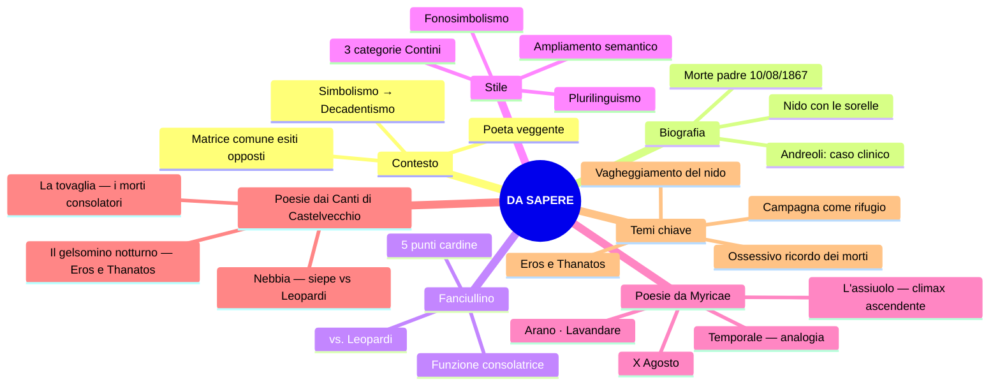

# RIPASSO VELOCE — GIOVANNI PASCOLI

> Fonti: lezioni 16/02, 17/02, 23/02, 24/02, 26/02, 02/03/26

---

## 1. Contesto culturale

- **Simbolismo francese** (Baudelaire, Verlaine, Rimbaud) → **Decadentismo italiano** (ultimi decenni dell'Ottocento)
- Baudelaire: *La perdita dell'aureola* (poeta perde sacralità) | *L'albatro* (poeta isolato nella società borghese) | *Corrispondenze* (realtà = rete di **simboli**)
- Rimbaud, *Lettera del Veggente*: poeta = **veggente** → conoscenza per **intuizione**, non ragione. La realtà è un **mistero** da disvelare
- **Pascoli e D'Annunzio**: stessa matrice (sfiducia nella scienza, realtà = mistero, conoscenza irrazionale) ma **esiti opposti**:
  - Pascoli → fanciullino, piccole cose, nido, lutto
  - D'Annunzio → superuomo/vate, bellezza, vita inimitabile

---

## 2. Biografia — punti chiave

| Cosa | Quando |
|------|--------|
| Nasce a **San Mauro di Romagna** | 1855 |
| **Padre assassinato** (10 agosto, colpo di fucile, impuniti) | 1867 |
| Morte della **madre** | 1868 |
| Università a **Bologna**, allievo di **Carducci** | 1873 |
| Laurea in greco, cattedra a Matera (con appoggio di Carducci) | 1882 |
| In Toscana con le sorelle **Ida** e **Maria** | ~1885 |
| ***Myricae*** (1ª ed., dedicata al padre) | 1891 |
| **Anno terribile** (matrimonio di Ida → "tradimento") | 1895 |
| Casa di **Castelvecchio di Barga** con Mariù (5 medaglie d'oro Amsterdam) | 1902 |
| Succede a Carducci a Bologna | 1905 |
| ***Canti di Castelvecchio*** (ed. def.) | 1907 |
| Morte per **cirrosi epatica** (6 aprile) | 1912 |

### Nodo centrale

- **Ruggero Pascoli**: amministratore della tenuta "La Torre" dei Torlonia → assassinato da sicari, colpevoli **mai puniti**
- L'anno dopo muore la madre; poi una sorella e un fratello
- **Tutta la produzione** = rielaborazione del lutto per il padre
- **Nido familiare** con le sorelle → resistenza al mondo esterno, al cambiamento
- Matrimonio di Ida (1895) = anno terribile → resta con **Mariù** (presenza ossessiva)
- Politica: socialismo (Andrea Costa, incarcerato a Bologna) → poi nazionalismo; **non** partecipa attivamente

### Andreoli — il "caso clinico"

> Rif.: Vittorino Andreoli, *I segreti di casa Pascoli*

- **Trauma**: morte del padre = frattura senza giustizia, del tutto inaspettata
- **Alcolismo**: lettera a Maria (*"testa piena di cognac"*); fotografie (addome tipico); cirrosi epatica
- **Rapporto morboso con le sorelle**: Mariù = gelosia ossessiva (filo al piede di notte, camere adiacenti); il **cane Gulì** = "figlio di coppia sterile"
- **Cirrosi epatica**: causa della morte, **diagnosi taciuta** all'epoca
- **Maria dopo la morte**: depositaria dell'eredità letteraria; aperture nel sepolcro per toccargli piedi e testa
- **Rivalutazione**: non il poeta del "bozzetto sereno" → vicino ai **poeti maledetti** per inquietudini e sensibilità (rivalutazione dagli anni '50)
- D'Annunzio: *"Il più grande e originale poeta apparso in Italia dopo il Petrarca"*

---

## 3. Poetica: Il Fanciullino (1897)

Prosa poetica = dichiarazione di poetica. Dentro di noi c'è un **fanciullino** che conserva la **meraviglia** che l'adulto perde.

### 5 punti cardine

1. Poesia = **irrazionale, intuitiva** (coerente col Decadentismo)
2. **Potere analogico** → metafora ardita, segreti legami tra le cose
3. Poesia = **scoperta** delle **umili cose** → "Il nuovo non si inventa, si scopre"
4. **Simbolismo** → realtà misteriosa, simboli da decifrare (Baudelaire)
5. **Funzione consolatrice** — nessun fine educativo deliberato; valori emergono naturalmente

### Passi chiave

> *"Noi ingrossiamo e arrugginiamo la voce, ed egli fa sentire il suo **tinnulo squillo** come di campanello."*

"Tinnulo squillo" = **fonosimbolismo** (suono → significato simbolico). Adulto = voce roca, profonda. Fanciullino = squillo limpido, cristallino.

> *"Il poeta è poeta, non oratore o predicatore, non filosofo, non istorico, non maestro."*

### vs. Leopardi

| Pascoli | Leopardi |
|---------|----------|
| Fanciullino **ferito**, angosciato, ripiegato | Fanciullo **vitale**, energico, immaginativo |
| Ricerca dolorosa della pace perduta | Capacità immaginativa della giovinezza |

Il fanciullino di Pascoli = **rimpianto**, dimensione perduta che ricerca per tutta la vita.

---

## 4. Lingua e stile — in pillole

- Pascoli e D'Annunzio = **fondatori della poesia del Novecento** (Mengaldo)
- Contini: **"rivoluzionario nella tradizione"** — recupera modelli tradizionali e li reinventa
- Pasolini: incide sulle **sperimentazioni** del Novecento
- Definito: "disintegratore della forma poetica tradizionale"

### Plurilinguismo

Basso/colloquiale + **tecnico-botanico** (*viburni, marra, porche, maggese, tamerici, pampano, valeriane, gora*) + dialettale (romagnolo e toscano) + latino (*Myricae*)

### Tre categorie di Contini

| Pre-grammaticale | Grammaticale | Post-grammaticale |
|------------------|-------------|-------------------|
| Prima delle regole = linguaggio del fanciullino | Dentro la tradizione | Oltre le regole = specialistico |
| Onomatopee, fonosimbolismo | Regole, convenzioni letterarie | Tecnicismi botanici, plurilinguismo |

### Fonosimbolismo

Il **suono** di una parola **allude a un significato simbolico**:
- **"Chiù"** (assiuolo): "u" accentata → **angoscia, lutto** → simbolo della perdita del padre
- **"Viburni"**: vocali "u" e "o" → **oscurità, cupezza, mistero**
- **"Tinnulo squillo"**: suono cristallino → purezza del fanciullino
- **Onomatopea propria**: *chiù, don don, tin tin, sciabordare*
- **Onomatopea impropria**: *ticchettare, miagolare*
- **Allitterazione**: *siepi, s'ode, suo, sottil*

### Ritmo

Verso **franto**, frammentato: lineette, parentesi nei versi, variabilità d'interpunzione, pause che spezzano l'endecasillabo

### Ampliamento della valenza semantica

Una parola = **più significati** simultaneamente:

| Parola | Letterale | Simbolico |
|--------|-----------|-----------|
| "fosse" | Fossati | **Tombe**, sepolture |
| "urna" | Urna cineraria (morte) | **Calice del fiore** (vita) |

"Urna" contiene **Eros e Thanatos** (vita e morte). La poesia pascoliana **non** è bozzetto naturalistico ma è **densissima di rimandi analogici** (osservazione fondamentale della prof).

### Figure retoriche principali

| Figura | Esempio |
|--------|---------|
| **Analogia** | Metafora ardita, legami nascosti |
| **Sinestesia** | *"Odore di fragole rosse"* (olfatto + vista); *"tintinno come d'oro"* (udito + vista) |
| **Onomatopea** | *chiù, don don, sciabordare, tonfi* |
| **Allitterazione** | *siepi, s'ode, suo, sottil* |
| **Anastrofe** | *"roggio nel filare / qualche pampano brilla"* |
| **Enallage/Ipallage** | *"marra pazïente"* (paziente = il contadino) |

### La musica del verso

> La poesia deve essere anche **musica** (eco di Verlaine: "la musica prima di ogni cosa"). Insistita trama fonetica.

---

## 5. Le raccolte

| Raccolta | Anno | Carattere chiave |
|----------|------|-----------------|
| ***Myricae*** | 1891 | Tamerici = poesia di **piccole cose**, umili. Dedicata al padre. Titolo da Virgilio. Forma: **madrigale** (2 terzine + 1 quartina), endecasillabi |
| ***Il Fanciullino*** | 1897 | Dichiarazione di poetica |
| ***Poemi conviviali*** | 1904 | — |
| ***Canti di Castelvecchio*** | 1903 (ed. def. 1907) | Continuazione di *Myricae*; campagna **toscana** (Garfagnana); ciclo delle stagioni; cari morti ossessivi; **tema nuovo: Eros e Thanatos** (Freud: pulsione vita/morte) |

**La nebbia** è elemento ricorrente in **entrambe** le raccolte.

Per l'interrogazione: **sempre** indicare la raccolta + distinguere le due (caratteristiche, temi, differenze, elementi in comune).

---

## 6. Poesie

### *Arano* — Myricae (p. 315–316)

**Tema**: scena di aratura autunnale | **Struttura**: madrigale, endecasillabi | **Movimento**: indeterminatezza → solarità

> *"Al campo, dove roggio nel filare / qualche pampano brilla, e dalle fratte / sembra la nebbia mattinal fumare,"* — **anastrofe** (roggio concorda con pampano, non filare); pampano rosso = autunno; nebbia = atmosfera **indefinita**

> *"arano: a lente grida, uno le lente / vacche spinge; altri semina; un ribatte / le porche con sua marra pazïente;"* — "arano" con soggetti esplicitati **dopo** = sospensione; "lente" grida e "lente" vacche = **monotonia**; **"pazïente"** concordato con marra ma si riferisce al contadino = **enallage/ipallage**; i due puntini = **dieresi** (iato per mantenere l'endecasillabo); *porche* = zolle, *marra* = zappa

> *"e il pettirosso: nelle siepi s'ode / il suo sottil tintinno come d'oro."* — **allitterazione** (siepi, s'ode, suo, sottil); *tintinno* = **onomatopea**; "come d'oro" = similitudine + **sinestesia** (udito + vista); apertura alla **speranza**

**Schema**: VISIVO (nebbia, foglie rosse) → UDITIVO (monotonia, fatica) → UDITIVO luminoso (solarità, speranza)

---

### *Lavandare* — Myricae (fino a p. 318)

**Tema**: solitudine, abbandono | **Struttura**: madrigale | **Struttura circolare** (aratro → aratro)

> *"Nel campo mezzo grigio e mezzo nero / resta un aratro senza buoi, che pare / dimenticato tra il vapor leggero."* — grigio = terra intatta; nero = zolle rivoltate = campo **a metà arato**; aratro senza buoi = **solitudine, abbandono**; nebbia = doppio significato (**muro protettivo** + **ostacolo**)

> *"E cadenzato dalla gora viene / lo sciabordare delle lavandare / con tonfi spessi e lunghe cantilene."* — gora = canale; **sciabordare** e **tonfi** = onomatopee; "lunghe cantilene" = **monotonia**; rima interna -are/-are

> *"Il vento soffia e nevica la frasca / e tu non torni ancora al tuo paese"* — "soffia" = onomatopeico; **"nevica la frasca"** = nevica usato transitivamente = **licenza poetica**; "tu non torni" = affetto lontano, canto di abbandono

> *"Come l'aratro in mezzo alla maggese."* — **chiusura circolare**; **maggese** = campo lasciato incolto nella rotazione triennale → simbolo di abbandono

> Le poesie **non** sono quadretti naturalistici: sono una **fitta trama di riferimenti simbolici** (cit. prof).

---

### *X Agosto* — Myricae

**Tema**: morte del padre (10 agosto 1867, San Lorenzo, stelle cadenti) | **Parallelismo simmetrico** rondine ↔ padre

| Rondine | Padre |
|---------|-------|
| Ritornava al **tetto** (metonimia) | Tornava al **nido** (famiglia) |
| L'uccisero | L'uccisero |
| Portava un **insetto** (cena dei rondinini) | Portava **due bambole** in dono |
| Come in **croce** → tende il verme al cielo | Immobile, **addita** le bambole al cielo |
| Il nido **pigola** sempre più piano | Casa **romita**, attesa vana |

"Una delle poesie più **costruite** di Pascoli" — tutta sulla simmetria (cit. prof).

**Versi chiave con analisi**:

> *"San Lorenzo, io lo so perché tanto / di stelle per l'aria tranquilla / arde e cade, perché sì gran pianto / nel concavo cielo sfavilla."* — **apostrofe**; "tanto di stelle" (tanto = soggetto + partitivo) → **vastità cosmica**; stelle cadenti = **pianto del cielo**, presagio luttuoso

> *"cadde tra spini [...] come in croce"* — spini + croce → rimando alla **Passione di Cristo** (sacrificio). Pascoli non è credente ma recupera l'immagine cristologica. "Cielo lontano" = **irraggiungibile**, preghiere inascoltate (come Leopardi)

> *"Restò negli aperti occhi un grido: / portava due bambole in dono."* — **sinestesia** (grido = uditivo, negli occhi = visivo); tre puntini tra "perdono" e "portava" = **reticenza**

> *"E tu, Cielo [...] quest'atomo opaco del male!"* — "Cielo" maiuscolo = **personificazione** (≈ Dio); **"quest'atomo opaco del male"** = **perifrasi** per la Terra: *atomo* (piccolezza), *opaco* (senza luce), *del male* (dolore). **Struttura circolare** ("pianto di stelle" riprende la strofa 1)

**Temi**: sofferenza universale (accomuna rondine e uomo) | dolore cosmico (Leopardi) | cielo indifferente | nido distrutto | assenza di giustizia | rielaborazione del lutto

---

### *Nebbia* — Canti di Castelvecchio

**Tema**: invocazione alla nebbia come **muro protettivo**; contrasto nido (pace) vs. fuori (dolore) | **Anafora**: *"Nascondi le cose lontane"* in ogni strofa | **Nota**: probabilmente non sul libro; analisi inviata dalla prof

**Strofa per strofa**:

- **Str. 1**: "impalpabile e scialba" = **sinonimia**; nebbia = fumo (come in *Arano*)
- **Str. 2**: **poliptoto** (*nascondi/nascondimi*); "quello ch'è morto" = passato, lutti. La **siepe** in Pascoli = **protezione** del nido (vs. Leopardi dove stimola l'immaginazione). **Valeriane** = pianta del sonno → pace
- **Str. 3**: "ebbre di pianto" = fuori dal nido = dolore. **Antitesi**: soave miele (consolazione) vs. nero pane (sofferenza)
- **Str. 4**: "ch'ami e che vada" = **pressioni sociali** (rifiuto + attrazione). "Strada bianca" → **cimitero**. **"Don don"** = onomatopea; campane **a morto**; la fine = **nulla eterno** (Foscolo)
- **Str. 5**: "involale" = rubale → un **sussulto**, desiderio di vedere oltre, ma chiede alla nebbia di soffocarlo. **Cipresso** = morte. **Cane** = custode degli affetti (Gulì). Orto = dimensione ridotta

**Siepe — Leopardi vs. Pascoli**:

| Leopardi (*L'Infinito*) | Pascoli (*Nebbia*) |
|---|---|
| Stimola l'immaginazione, va **oltre** | **Protegge**, delimita il nido |
| Trampolino verso l'infinito | Recinto del nido |

---

### *Temporale* — Myricae

**Tema**: evocazione di un temporale → inquietudine, mistero | **Struttura**: ballata minima di settenari

> *"Un bubbolio lontano..."* — **onomatopea pregrammaticale** (Contini) + **reticenza** → vaghezza, indeterminatezza

> *"Rosseggia l'orizzonte, come affocato a mare; nero di pece, a monte, stracci di nubi chiare"* — **contrasti cromatici violenti**: rosso (lampi) / nero / bianco

> *"tra il nero un casolare: un'ala di gabbiano"* — **analogia**: casolare bianco sul nero = ala di gabbiano. Somiglianza intuitiva. Casolare = **pacificazione, protezione** (nido). Ala = **leggerezza**, elevarsi dalle sofferenze

**Da ricordare**: verso breve e franto, linguaggio pregrammaticale, analogia, contrasti cromatici

---

### *L'assiuolo* — Myricae

**Tema**: dall'inquietudine alla morte | **Struttura**: 3 strofe di novenari + "chiù" | **Da studiare**: saggio **Santagata "Un piccolo io"** (esame!)

**Struttura portante = climax ascendente**: chiù = **voce** (str. 1) → **singulto** (str. 2) → **pianto** di morte (str. 3)

> *"nuotava in un'alba di perla"* — **analogia** (luce madreperlacea); *"il mandorlo e il melo parevano ergersi"* = **personificazione** + **lessico tecnico**

> *"soffi di lampi"* = **sinestesia** (udito + vista); *"nero di nubi laggiù"* = **allitterazione N** + vocali cupe → **fonosimbolismo**

> *"sentivo... sentivo... sentivo"* = **anafora**; i primi due = percezione sensoriale, il terzo = **dimensione interiore**; *"com'eco d'un grido che fu"* = **similitudine** → rimando alla **morte del padre**

> *"finissimi sistri d'argento"* = **sistri** = strumenti egiziani del **culto dei morti** (Iside/Osiride); **fonosimbolismo** (suono sottile per le molte "i"); *"invisibili porte"* = porte dell'**aldilà**

**Da ricordare**: continua **oscillazione** tra dato oggettivo e soggettivo; l'interrogativa in parentetica = innovazione metrica del Novecento

---

### *Il gelsomino notturno* — Canti di Castelvecchio

**Tema**: **Eros e Thanatos** | **Struttura**: quartine di novenari | **Parallelismo** natura ↔ sposi

Poesia d'occasione per le nozze di **Gabriele Briganti**. Pascoli osserva **dall'esterno** la prima notte di nozze → atteggiamento **voyeuristico** (paura + curiosità, estraneità all'Eros, dimensione **infantile**)

> *"E s'aprono i fiori notturni / nell'ora che penso ai miei cari"* — Eros e Thanatos fin dall'inizio: fiore (vita) + miei cari = **morti**. "E" iniziale = discorso già avviato. Tramonto = ora della nostalgia (cfr. Dante)

> *"Sotto l'ali dormono i nidi, come gli occhi sotto le ciglia"* — **similitudine** bellissima, natura ↔ uomini

> *"odore di fragole rosse"* = **sinestesia** (olfatto + vista); *"Nasce l'erba sopra le fosse"* = **ampliamento semantico** (fossati + tombe → vita e morte simultanee)

> *"La Chioccetta per l'aia azzurra va col suo pigolio di stelle"* — immagine tra le più belle del Novecento. Chioccetta = **Pleiadi**; aia azzurra = cielo; *"pigolio di stelle"* = **sinestesia** (udito + vista)

> *"brilla al primo piano: s'è spento..."* — **reticenza** → unione degli sposi

> *"l'urna molle e segreta, non so che felicità nuova"* — **urna** = 3 significati: calice del fiore / urna cineraria / **grembo della sposa** → **Eros e Thanatos insieme**. Petali "gualciti" dall'impollinazione → componente di **violenza sottile** nell'Eros

---

### *La tovaglia* — Canti di Castelvecchio

**Tema**: i morti come presenze consolatorie; il ricordo delle piccole cose | **Andamento narrativo**

Superstizione contadina: la tavola va sparecchiata, altrimenti vengono i morti. Pascoli la **rovescia**.

- **Bambina**: le dicono di sparecchiare; i morti = "i **tristi**, i **pallidi** morti" → immagine **minacciosa**
- **Donna adulta**: non sparecchia; i morti = "i **buoni**, i **poveri** morti" → presenze **consolatorie**
- La donna = **alter ego di Pascoli**: per lui i morti sono **più vivi dei vivi**
- I morti: silenziosi, pensierosi (capo tra le mani), nell'oscurità; cercano di ricordare la vita passata → "bevono lacrime amare" → **nessuna consolazione cristiana**
- La ragazza prova a risvegliare il ricordo: "Pane? sì, pane si chiama" → i ricordi si soffermano su **cose materiali, quotidiane** (tovaglia, pane, briciole)
- "Due nostre lacrime amare cadute nel ricordare" → il **dolore del ricordo** accomuna vivi e morti
- "La casa **regge**" = l'**azdora** (dialetto romagnolo) → recupero italianizzato

---

## 8. Confronto Pascoli–D'Annunzio

| | **Pascoli** | **D'Annunzio** |
|---|---------|-----------|
| Poeta | Fanciullino interiore | Vate / Superuomo |
| Poetica | Piccole cose, umili, nido | Vita inimitabile, bellezza, eroismo |
| Vita | Ritirata, domestica | "Primo influencer della storia"; impresa di Fiume; Duse |
| Temi | Natura, morte, lutto, nido, perdita | Amori, bello, lotta |
| Politica | Socialismo → nazionalismo; non partecipa | Nazionalismo, poeta-soldato |
| Ambiente | Agreste, rurale, semplice | Lussuoso, mondano, estetizzante |
| **In comune** | Sfiducia nella scienza · realtà = mistero · conoscenza irrazionale · fondatori poesia '900 (Mengaldo) |

---

## 9. Domande da interrogazione

### Generali

1. **Contesto culturale?** — Simbolismo francese → Decadentismo italiano; Baudelaire, Verlaine, Rimbaud; poeta veggente
2. **Matrice comune Pascoli–D'Annunzio?** — Sfiducia nella scienza, realtà = mistero, conoscenza irrazionale — esiti opposti
3. **Fatti biografici rilevanti?** — Morte del padre (10/08/1867), morte della madre, nido con le sorelle, anno terribile (1895), Castelvecchio
4. **Pascoli "caso clinico" (Andreoli)?** — Trauma, alcolismo, rapporto morboso con le sorelle, cirrosi epatica taciuta

### Poetica

5. **Che cos'è il Fanciullino?** — Prosa 1897; voce del fanciullino interiore; sguardo puro e stupito; scoperta, non invenzione
6. **Differenza fanciullino/fanciullo Leopardi?** — Ferito vs. vitale; angosciato vs. immaginativo
7. **Fine educativo?** — No deliberato; valori emergono naturalmente; funzione consolatrice
8. **Fonosimbolismo?** — Il suono allude a un contenuto simbolico (es: "chiù" = angoscia; "viburni" = oscurità)
9. **Tre categorie di Contini?** — Pre-grammaticale (onomatopee), grammaticale (tradizione), post-grammaticale (tecnicismi)
10. **Perché "fondatore della poesia del Novecento"?** — Mengaldo; "disintegratore della forma tradizionale"; "rivoluzionario nella tradizione" (Contini)

### Testi

11. **A quale raccolta appartiene [poesia X]?** — Distinguere *Myricae* / *Canti di Castelvecchio*
12. **Significato della nebbia?** — Doppio: muro protettivo + ostacolo all'uscita
13. **Ampliamento della valenza semantica?** — Una parola = più significati ("fosse" = fossati + tombe; "urna" = calice + cineraria + grembo)
14. **Significato del "nido"?** — Famiglia, sicurezza, protezione — ma anche chiusura, resistenza al cambiamento
15. **Siepe in Pascoli vs. Leopardi?** — Opposta: Leopardi stimola l'immaginazione; Pascoli protegge
16. **Che cos'è il madrigale?** — 2 terzine + 1 quartina; endecasillabi
17. **Parallelismo in X Agosto?** — Rondine ↔ padre; tetto ↔ nido; insetto ↔ bambole
18. **Perché non quadretti naturalistici?** — Fitta trama di riferimenti simbolici; ampliamento semantico; più livelli
19. **Climax ne *L'assiuolo*?** — Voce → singulto → pianto di morte
20. **Analogia in *Temporale*?** — Casolare = ala di gabbiano (somiglianza intuitiva, protezione + leggerezza)
21. **Eros e Thanatos nel *Gelsomino*?** — Parallelismo natura/sposi; "urna" = calice + cineraria + grembo; voyeurismo; dove c'è vita c'è morte
22. **I morti ne *La tovaglia*?** — Da "tristi, pallidi" a "buoni, poveri"; presenze consolatorie; i morti più vivi dei vivi
23. **Caratteristiche dei *Canti di Castelvecchio*?** — Continuazione di *Myricae*; campagna toscana; cari morti; Eros e Thanatos
24. **Temi pascoliani?** — Vagheggiamento del nido; campagna come rifugio; ossessivo ricordo dei morti; Eros e Thanatos

---

---

**Pagine libro**: biografia pp. 296 ss. | poetica pp. 298–308 | Myricae pp. 309–312 | Arano pp. 315–316 | Lavandare fino a p. 318

**Materiale extra**: saggio Santagata sull'Assiuolo ("Un piccolo io" — esame!) | analisi Nebbia dalla prof

> [!NOTE] Integrare con: **libro di testo** (pp. 296–318 + analisi testi), saggio Santagata, analisi Nebbia.
