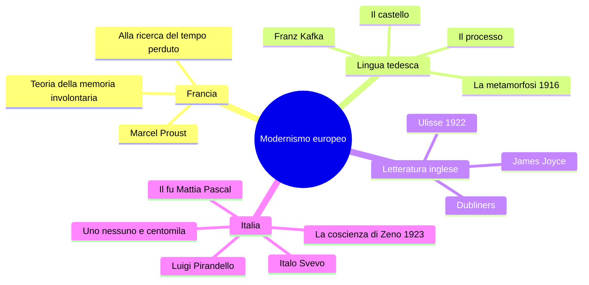
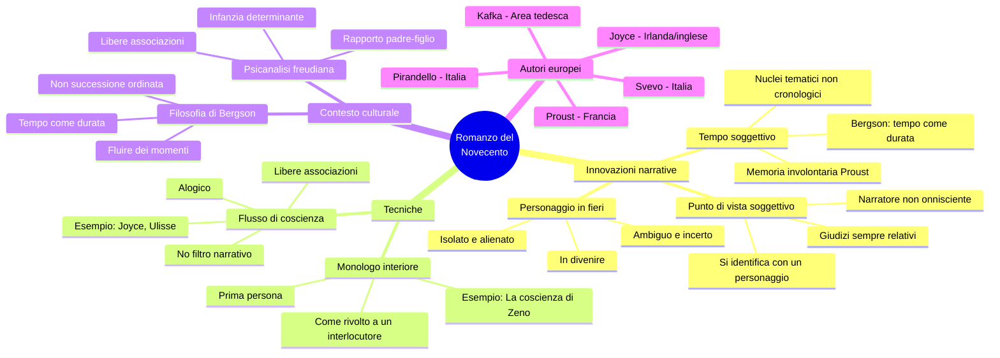
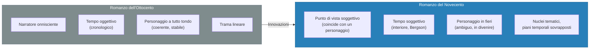
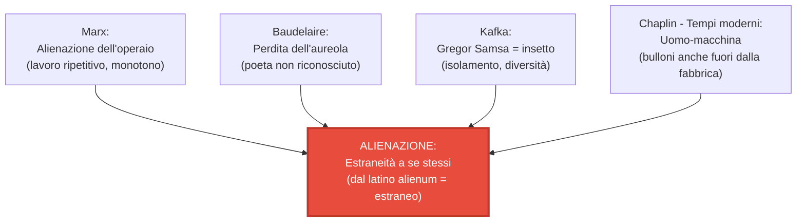

# Il Romanzo del Novecento — Mega-Schema di Studio

> **Fonti**: Lezione del 09/04/26 (intera seconda parte)
> **Docente**: appunti dalla Prof
> **Scopo**: preparazione esame di Italiano

> [!NOTE] Argomento nuovo
> Questo argomento è stato introdotto il 09/04/26. La prof ha annunciato il programma rimanente: *«ci mancano il romanzo del '900, Svevo, Pirandello, e poi chiudiamo con la triade Saba, Ungaretti e Montale»*.

---

## 1. Inquadramento generale

### 1.1 Il romanzo del Novecento vs. il romanzo dell'Ottocento

La prof introduce il romanzo del Novecento mettendolo a confronto con il romanzo ottocentesco tradizionale.

**Il romanzo ottocentesco** (es. *I Promessi Sposi* di Manzoni):

| Caratteristica | Descrizione |
|---|---|
| **Narratore** | **Onnisciente**: conosce vicende, pensieri dei personaggi, interviene a commentare; non si identifica con nessun personaggio |
| **Tempo** | **Oggettivo**: sviluppo cronologico lineare, misurato come l'orologio; non dipende dall'opinione del lettore |
| **Personaggio** | **A tutto tondo**: coerenza interna, solidità psicologica, inserito in un quadro cronologico certo |

> **Osservazione della prof**: «Quando pensiamo al romanzo ottocentesco, al romanzo storico, in questo tipo di romanzo l'autore domina la narrazione. Il narratore è onnisciente: conosce le vicende, gli accadimenti, i pensieri dei personaggi, interviene a commentare gli eventi e non si identifica con nessuno.»

### 1.2 Le novità del romanzo del Novecento

Il romanzo del Novecento porta tre cambiamenti fondamentali:

1. **Punto di vista**: il narratore non è più onnisciente, ma il campo visivo si restringe fino a coincidere con quello di un personaggio
2. **Tempo**: da oggettivo diventa **soggettivo** — il tempo interiore, della percezione
3. **Personaggio**: non più granitico e coerente, ma ambiguo, incerto, **in fieri** (in divenire)

---

## 2. Le tre grandi innovazioni

### 2.1 Il punto di vista: dal narratore onnisciente al narratore inattendibile

Il **campo visivo** del narratore si restringe fino a coincidere con quello di **un personaggio**.

> **Esempio della prof** (*La coscienza di Zeno*): «L'io narrante è Zeno, ma per meglio dire è la sua **coscienza**. Quando Zeno esprime dei giudizi, quei giudizi sono sempre relativi, perché dipendono dal suo punto di vista, dal modo in cui gli eventi vengono filtrati dalla sua coscienza.»

**Conseguenza**: i giudizi del narratore sono **sempre relativi**, mai assoluti — dipendono dalla prospettiva soggettiva del personaggio.

**Forme narrative** tipiche del romanzo novecentesco:
- Novella
- Autobiografia
- Memorie
- Diario

### 2.2 Il tempo soggettivo

> **Distinzione fondamentale della prof**:

| Tipo di tempo | Caratteristica | Esempio |
|---|---|---|
| **Oggettivo** | Misurato dall'orologio, indipendente dalla nostra opinione | L'ora di scuola |
| **Soggettivo** | Dipende dalla percezione, dai desideri, dalle aspettative | «Ho perso la cognizione del tempo» |

> **Spiegazione della prof**: «Il tempo, a seconda dei nostri desideri, delle nostre aspettative, della nostra percezione, rallenta oppure accelera. I cinque minuti in cui aspettiamo qualcuno che non vediamo l'ora di vedere sono lunghi quanto quelli che mancano all'intervallo? No.»

Il **tempo soggettivo** domina il romanzo del Novecento. I protagonisti non sono più inseriti in un quadro cronologico certo: il tempo viene **interiorizzato** e diventa **soggettivo**.

**Riferimento filosofico**: **Henri Bergson**, filosofo francese, teorizza il tempo come **durata** (non come successione ordinata di momenti, ma come un fluire in cui i momenti si compenetrano). È il **tempo dell'interiorità**.

> **Esempio** (*La coscienza di Zeno*): il romanzo è suddiviso in **nuclei tematici** (non capitoli cronologici): «Il fumo», «La morte di mio padre», «Storia del mio matrimonio», «Un'impresa commerciale». C'è una dialettica di piani temporali — presente, passato, futuro — che si compenetrano.

### 2.3 Il personaggio in fieri

Il personaggio del Novecento non è saldo e granitico come quello dell'Ottocento. È:

- **Ambiguo**
- **Incerto**
- **Complesso**
- **Sfumato**
- **In fieri** (= in divenire, in sviluppo — locuzione latina usata anche in italiano corrente)

Di conseguenza, si sente in una posizione di **estraniamento**, **isolamento** e **solitudine** rispetto alla società e al mondo.

> **Nota della prof**: «Il personaggio si sentirà in una posizione di estraniamento, di isolamento e solitudine. Non sempre, ma spesso sarà così.»

---

## 3. Il contesto culturale: Psicanalisi e Modernismo europeo

### 3.1 L'influenza della psicanalisi

Il romanzo del Novecento risente fortemente della nascita della **psicanalisi freudiana**.

> **Freud** (medico austriaco): i rapporti con i genitori e le figure di riferimento influenzano lo sviluppo psichico dell'individuo anche in età adulta. Gli anni dell'**infanzia** sono fondamentali per il futuro dell'individuo.

**Conseguenza letteraria**: il **tema padre-figlio** è uno dei temi fondamentali del romanzo del Novecento.

**Tecnica psicoanalitica**: le **libere associazioni** — un pensiero ne richiama un altro in una catena spontanea — diventano il modello del **flusso di coscienza** come tecnica narrativa.

### 3.2 Il Modernismo europeo

> **Nota della prof**: «In Italia i due maggiori autori sono sicuramente Luigi Pirandello e Italo Svevo con il genere del romanzo psicologico.»

---

## 4. Marcel Proust e la memoria involontaria

### 4.1 Profilo

| Dato | Dettaglio |
|---|---|
| **Nome** | Marcel Proust |
| **Nazionalità** | Francese |
| **Opera principale** | *Alla ricerca del tempo perduto* (ciclo di romanzi) |
| **Giudizio della prof** | «Per alcuni il più grande scrittore della modernità» |

### 4.2 L'episodio della Madeleine

L'episodio più celebre della letteratura mondiale a proposito del **tempo interiorizzato** si trova in *Dalla parte di Swann* (1913), primo volume del ciclo *Alla ricerca del tempo perduto*.

> [!IMPORTANT] Concetto chiave: la memoria involontaria
> **Memoria involontaria** = processo in cui un elemento sensoriale (soprattutto olfattivo) fa riemergere involontariamente non solo il ricordo di un momento del passato, ma le **sensazioni intere** vissute in quel momento.
>
> - «Accade e basta» — non è volontaria
> - Stimolo principale: l'**olfatto**
> - Non va confusa col **déjà vu** (sensazione di aver già vissuto qualcosa)

**Trama dell'episodio**: il protagonista, ormai adulto, intinge una madeleine (dolcetto francese a forma di conchiglia) in una tazza di tè. Il **sapore** della madeleine inzuppata fa riemergere intero il suo passato d'infanzia a **Combray**, quando la zia Léonie gli offriva la madeleine accompagnata dal tè. Riemergono non solo i ricordi visivi, ma la città intera, le strade, il giardino, le passeggiate.

### 4.3 Testo integrale — Episodio della Madeleine

*(Da: Marcel Proust, Dalla parte di Swann, 1913 — letto in classe il 09/04/26)*

> «Già da molti anni, di Combray tutto ciò che non era il teatro e il dramma del coricarmi non esisteva più per me, quando in una giornata d'inverno, rientrando a casa, mia madre vedendomi infreddolito mi propose di prendere, contrariamente alla mia abitudine, un po' di tè. Rifiutai dapprima e poi, non so perché, mutai d'avviso. Ella mandò a prendere una di quelle focacce pienotte e corte chiamate maddalenine, che paiono aver avuto come stampo la valva scanalata di una conchiglia.
>
> Ed ecco, macchinalmente, oppresso dalla giornata grigia, dalla previsione di un triste domani, portai alle labbra un cucchiaino di tè in cui avevo inzuppato un pezzo di maddalena. Ma nel momento stesso che quel sorso misto alle briciole di focaccia toccò il mio palato, trasalii, attento a quanto avveniva in me di straordinario. Un piacere delizioso m'aveva invaso, isolato, senza nozione della sua causa. M'aveva reso indifferenti le vicissitudini della vita, le sue calamità, la sua brevità illusoria, nel modo stesso che agisce l'amore, colmandomi d'un'essenza preziosa; o meglio questa essenza non era in me, era me stesso. Avevo cessato di sentirmi mediocre, contingente, mortale. Donde m'era potuta venire quella gioia violenta? Sentivo che era legata al sapore del tè e della focaccia, ma la sorpassava incommensurabilmente, non doveva essere della stessa natura. Donde veniva? Che significava? Dove afferrarla?
>
> Bevo un secondo sorso in cui non trovo nulla di più che nel primo, un terzo dal quale ricevo meno che dal secondo. È tempo che io mi fermi, la virtù della bevanda sembra diminuire. È chiaro che la verità che cerco non è in essa, ma in me. Essa l'ha risvegliata, ma non la conosce.
>
> Fino a quando ripete questa azione e ad un tratto il ricordo mi è apparso. Quel sapore era quello del pezzetto di maddalena che la domenica mattina a Combray, giacché quel giorno non uscivo prima della messa, quando andavo a salutarla nella sua camera, la zia Léonie mi offriva dopo averlo bagnato nel suo infuso di tè o di tiglio.
>
> La vista della focaccia, prima d'assaggiarla, non m'aveva ricordato niente; forse perché, avendone viste spesso, senza mangiarle, sui vassoi dei pasticceri, la loro immagine aveva lasciato quei giorni di Combray per unirsi ad altri giorni più recenti. Forse perché di quei ricordi così a lungo abbandonati fuori dalla memoria niente sopravviveva, tutto s'era disgregato. Le forme, anche quella della conchiglietta di pasta, così grassamente sensuale sotto la sua veste a pieghe severa e devota, erano abolite o sonnolente, avevano perduto la forza d'espansione che avrebbe loro permesso di raggiungere la coscienza.
>
> Ma quando niente sussiste d'un passato antico, dopo la morte degli esseri, dopo la distruzione delle cose, più tenue ma più vividi, più immateriali, più persistenti, più fedeli, **l'odore e il sapore lungo il tempo ancora perdurano, come anime a ricordare, ad attendere, a sperare, sopra la rovina di tutto il resto, portando sulla loro stilla quasi impalpabile, senza vacillare, l'immenso edificio del ricordo**.
>
> E appena ebbi riconosciuto il sapore del pezzetto di madeleine inzuppato nel tiglio che mi dava la zia, subito la vecchia casa grigia sulla strada nella quale era la sua stanza si adattò come uno scenario di teatro al piccolo padiglione sul giardino, dietro di essa, costruito per i miei genitori. E con la casa la città, la piazza dove mi mandavano prima di colazione, le vie dove andavo in escursione dalla mattina alla sera e con tutti i tempi, le passeggiate che si facevano se il tempo era bello.
>
> E come in quel gioco in cui i giapponesi si divertono a immergere in una scodella di porcellana piena d'acqua dei pezzetti di carta fino allora indistinti che appena immersi si distendono, prendono contorno, si colorano, si differenziano, diventano fiori, case, figure umane consistenti e riconoscibili; così ora tutti i fiori del nostro giardino e quelli del parco di Swann e le ninfee della Vivonne e la buona gente del villaggio e le loro casette e la chiesa e tutta Combray e i suoi dintorni, tutto quello che vien prendendo forma e solidità è sorto, città e giardini, dalla mia tazza di tè.»

### 4.4 Analisi dell'episodio

| Elemento | Analisi |
|---|---|
| **Stimolo sensoriale** | Il gusto della madeleine inzuppata nel tè (non la vista — la vista non aveva evocato nulla) |
| **Meccanismo** | Memoria **involontaria**: accade da sola, non cercata volontariamente |
| **Effetto immediato** | Smarrimento, piacere intenso, senso di non essere più «mediocre, contingente, mortale» |
| **Processo di ricerca** | Il narratore ripete l'azione, cerca di «afferrare» la sensazione; la verità non è nel tè, ma in lui |
| **Risultato** | Riemergono intere le sensazioni di Combray — non solo immagini, ma odori, luoghi, persone |
| **Metafora finale** | I **pezzetti di carta giapponesi** che si distendono nell'acqua → il ricordo si espande da una piccola sensazione |

> **Commento della prof sulla descrizione della madeleine**: «Guardate Proust quanto sia maestro delle descrizioni e dei dettagli più anche apparentemente insignificanti. Guardate come descrive un biscotto: "conchiglietta di pasta grassamente sensuale sotto la sua veste a pieghe severa e devota".»

> **Piani temporali che si intersecano**: «vedete i piani del tempo che si intersecano, si sovrappongono» — il passato di Combray e il presente si fondono nella sensazione.

---

## 5. Franz Kafka e la *Metamorfosi*

### 5.1 Profilo

| Dato | Dettaglio |
|---|---|
| **Nome** | Franz Kafka |
| **Nazionalità** | Ceca (lingua tedesca) |
| **Opera principale analizzata** | *La metamorfosi* (1916) |
| **Altra opera citata** | *Lettera al padre* |

### 5.2 *La Metamorfosi* (1916)

#### Trama

Il protagonista **Gregor Samsa**, commesso viaggiatore che sostiene economicamente la famiglia, una mattina si sveglia **trasformato in un enorme insetto**. La famiglia reagisce con spavento, disgusto, poi progressivo isolamento. Gregor muore (il padre gli tira una mela che gli rimane conficcata nella schiena).

> **Sintesi dello studente in classe**: «Parla di questo signore che vive con la famiglia attraverso il suo lavoro. Un giorno, la mattina, si sveglia trasformato in un enorme scarafaggio. La famiglia inizialmente è spaventata e disgustata e lo rinchiude nella sua stanza. La sorella cerca comunque di mantenerlo. Muore con il padre che gli tira una mela.»

#### Lo straniamento come tecnica

La metamorfosi viene raccontata **come se fosse un evento consueto**. Non c'è terrore o sconvolgimento nel protagonista: pensa di «fare un altro dormitino».

> [!IMPORTANT] Tecnica narrativa centrale
> **Straniamento** (ostranenie): presentare come **consueto** un evento fuori dal comune, e viceversa. L'effetto è lo **spaesamento** del lettore.

> **Domanda della prof**: «Come vive Gregor Samsa la metamorfosi?»
> **Risposta corretta**: La vive con **indifferenza**, quasi come un evento normale.

#### Testo integrale — Incipit de *La Metamorfosi*

*(Da: Franz Kafka, La metamorfosi, 1916 — letto in classe il 09/04/26)*

> «Un mattino, al risveglio da sogni inquieti, Gregor Samsa si trovò trasformato in un enorme insetto. Sdraiato nel letto sulla schiena dura come una corazza, bastava che alzasse un po' la testa per vedersi il ventre convesso, bruniccio, spartito da solchi arcuati. In cima al ventre la coperta, sul punto di scivolare per terra, si reggeva a malapena. Davanti agli occhi gli si agitavano le gambe, molto più numerose di prima ma di una sottigliezza desolante.
>
> Che cosa mi è capitato? pensò. Non stava sognando. La sua camera, una normale camera d'abitazione, anche se un po' piccola, gli appariva in luce quieta fra le quattro ben note pareti. Sopra al tavolo, sul quale era sparpagliato un campionario di telerie sballato da un pacco (Samsa faceva il commesso viaggiatore), stava appesa un'illustrazione che aveva ritagliata qualche giorno prima da un giornale montandola poi in una graziosa cornice dorata. Rappresentava una signora con un cappello e un boa di pelliccia che, seduta ben dritta, sollevava verso gli astanti un grosso manicotto nascondendovi dentro l'intero avambraccio.»

> *Gregor girò gli occhi verso la finestra e al vedere il brutto tempo (si udivano le gocce di pioggia battere sulla lamiera del davanzale) si sentì invadere dalla malinconia. "E se cercassi di dimenticare queste stravaganze facendo un altro dormitino?" pensò, ma non poté mandare ad effetto il suo proposito.*
>
> *Era abituato a dormire sul fianco destro e nello stato attuale gli era impossibile assumere tale posizione. Per quanta forza mettesse nel girarsi sul fianco, ogni volta ripiombava indietro. Tentò almeno cento volte, chiudendo gli occhi per non vedere quelle gambette divincolarsi, e a un certo punto smise perché un dolore leggero, sordo, mai provato prima, cominciò a pungergli il fianco.*

#### Analisi dell'incipit

| Elemento | Analisi |
|---|---|
| **Apertura** | La metamorfosi è dichiarata subito, come fatto compiuto — nessuna gradualità |
| **Tono** | Completamente piatto, neutro, privo di drammaticità |
| **Reazione di Gregor** | Cerca di fare un altro dormitino → **straniamento totale** |
| **Descrizione della stanza** | **Fortemente realistica** — campionario di telerie, cornice dorata, illustrazione ritagliata |
| **Effetto** | Accostamento surreale (metamorfosi) + contesto realistico → massimo straniamento |

> **Osservazione della prof**: «Questa descrizione della stanza è fortemente realistica. L'incipit è segnato da una metamorfosi quasi fiabesca; poi troviamo subito la descrizione degli ambienti assolutamente realistica. Qual è l'effetto? Proprio quello dello straniamento, che produce spaesamento nel lettore perché quel fatto così surreale viene inserito in un contesto realistico.»

### 5.3 I temi della *Metamorfosi*

La trasformazione di Gregor in insetto rappresenta:

1. **L'isolamento e la diversità**: il personaggio estraniato rispetto al mondo — tema dominante del romanzo del Novecento
2. **Dimensione autobiografica**: Kafka ha un rapporto conflittuale con il padre (→ *Lettera al padre*); si sente escluso dalla famiglia per la sua vocazione letteraria
3. **Dimensione universale**: il disagio dell'**intellettuale** che ha perduto il suo ruolo nella società
4. **L'alienazione dell'uomo moderno**

### 5.4 L'alienazione

> [!IMPORTANT] Concetto chiave: alienazione
> **Alienazione** (dal latino *alienum* = estraneo): estraneità a se stessi.

**Marx**: l'operaio si aliena nel lavoro ripetitivo e monotono, perde la sua umanità, non è più in contatto con se stesso.

> **Esempio della prof**: il personaggio di **Charlie Chaplin** in *Tempi moderni* (1936) che continua ad avvitare bulloni anche una volta uscito dalla fabbrica — simbolo dell'alienazione dovuta al lavoro.

> **Collegamento con Baudelaire**: l'alienazione dell'intellettuale si ricollega alla **perdita dell'aureola** (Baudelaire, *Lo spleen di Parigi*) — il poeta non è più riconosciuto come guida nella società moderna.

### 5.5 *Lettera al padre*

Opera autobiografica in cui Kafka si rivolge al padre con accuse dure, tra cui quella di aver ostacolato la sua unica aspirazione: diventare scrittore. Il padre non riconosce la sua identità in nome delle convenzioni sociali e della logica del profitto.

---

## 6. James Joyce e il flusso di coscienza

### 6.1 Profilo

| Dato | Dettaglio |
|---|---|
| **Nome** | James Joyce |
| **Nazionalità** | Irlandese |
| **Opera principale** | *Ulisse* (1922) |
| **Tecnica** | Flusso di coscienza |

### 6.2 Le due tecniche narrative principali

#### Monologo interiore

> **Definizione**: presentazione **in prima persona** dei pensieri del personaggio come se fossero rivolti a un interlocutore. Il personaggio parla, come se si rivolgesse a qualcuno, ma in realtà sta parlando a se stesso.

**Esempio** da studiare: **Preambolo de *La coscienza di Zeno*** (Svevo, 1923).

#### Flusso di coscienza

> **Definizione**: registrazione dei pensieri del personaggio secondo un flusso **spontaneo, alogico**, secondo un principio di disordine che è quello con cui i pensieri si presentano alla mente.

**Caratteristiche**:
- Assenza o riduzione della **punteggiatura**
- Violazione delle **regole convenzionali della grammatica**
- **Libere associazioni**: un pensiero ne richiama un altro in catena
- **Rappresentazione mimetica del pensiero** senza che il narratore funga da filtro su logica e sintassi

> **Collegamento con la psicanalisi**: le **libere associazioni** sono la base della tecnica psicoanalitica freudiana — da qui il legame tra flusso di coscienza e psicanalisi.

> [!IMPORTANT] Definizione da memorizzare
> **Flusso di coscienza** = rappresentazione **mimetica** del pensiero, **senza che il narratore funga da filtro** sul piano della logica e della sintassi.

### 6.3 Testo esemplificativo — *Ulisse* (Joyce, 1922)

*(Esempio letto in classe il 09/04/26)*

> «...se pensa di perché prima non ha mai fatto una cosa del genere chiedere la colazione a letto con due uova da quando eravamo all'albergo City Arms quando faceva finta di star male con la voce da sofferente e faceva il pascià per rendersi interessante eccetera eccetera»

> **Analisi della prof**: «Qui vediamo la registrazione di pensieri colti nel loro sorgere, nel loro dinamico scorrere attraverso libere associazioni di idee. Quella del flusso di coscienza è una rappresentazione mimetica del pensiero senza che il narratore funga da filtro sul piano della logica e della sintassi.»

### 6.4 Confronto: monologo interiore vs. flusso di coscienza

| Caratteristica | Monologo interiore | Flusso di coscienza |
|---|---|---|
| **Struttura** | Prima persona, come rivolto a un interlocutore | Registrazione spontanea, senza struttura |
| **Logica** | Mantiene una logica di base | Alogico, per libere associazioni |
| **Grammatica** | Rispetta le regole di base | Le viola (assenza di punteggiatura, ecc.) |
| **Filtro narrativo** | Presente | Assente |
| **Esempi** | Preambolo de *La coscienza di Zeno* | *Ulisse* di Joyce |

---

## 7. Italo Svevo e *La coscienza di Zeno*

### 7.1 Profilo (introduttivo)

| Dato | Dettaglio |
|---|---|
| **Nome** | Italo Svevo |
| **Opera principale** | *La coscienza di Zeno* (1923) |
| **Genere** | Romanzo psicologico |
| **Tecnica** | Monologo interiore / autobiografia fittizia |

### 7.2 Struttura del romanzo

*La coscienza di Zeno* è suddivisa in **nuclei tematici** (non cronologici):

1. Prefazione
2. Preambolo
3. «Il fumo»
4. «La morte di mio padre»
5. «Storia del mio matrimonio»
6. «La moglie e l'amante»
7. «Un'impresa commerciale»
8. «Psico-analisi»

> **Nota della prof**: «Il tempo si compenetra; c'è una dialettica di piani temporali che sono il presente, il passato e il futuro.»

---

## 8. Mappa concettuale del Romanzo del Novecento

---

## 9. Confronto: romanzo Ottocento vs. Novecento

---

## 10. Il tema dell'alienazione

---

## 11. Concetti chiave da ricordare all'esame

> [!IMPORTANT] Checklist dei concetti imprescindibili

- [ ] **Narratore onnisciente** (Ottocento) vs. **punto di vista soggettivo** (Novecento)
- [ ] **Tempo oggettivo** (orologio) vs. **tempo soggettivo** (Bergson: tempo come *durata*)
- [ ] **Personaggio in fieri** = in divenire (locuzione latina)
- [ ] **Memoria involontaria** (Proust): stimolo sensoriale → riemersione di sensazioni passate; non confondere col déjà vu
- [ ] Testo da conoscere: **episodio della Madeleine** (*Dalla parte di Swann*, Proust, 1913)
- [ ] **Straniamento** (Kafka): presentare come consueto l'evento straordinario → spaesamento del lettore
- [ ] Testo da conoscere: **incipit de *La metamorfosi*** (Kafka, 1916)
- [ ] *La metamorfosi* = isolamento dell'intellettuale + **alienazione** dell'uomo moderno
- [ ] **Alienazione** (dal latino *alienum* = estraneo): Marx (operaio) + Chaplin *Tempi moderni*
- [ ] **Monologo interiore** = prima persona, come rivolto a un interlocutore (es. *La coscienza di Zeno*)
- [ ] **Flusso di coscienza** = rappresentazione mimetica del pensiero, senza filtro narrativo (es. *Ulisse*)
- [ ] **Libere associazioni** = base sia del flusso di coscienza che della psicanalisi freudiana
- [ ] **Bergson**: tempo come *durata* — fluire in cui i momenti si compenetrano (≠ successione lineare)
- [ ] Testo da studiare: **Preambolo de *La coscienza di Zeno*** (monologo interiore) + incipit *Ulisse* (flusso di coscienza)
- [ ] Da studiare sul libro: **Modernismo europeo** — romanzo e poesia — p. 496 e seguenti

---

## 12. Assegnazioni della prof (09/04/26)

> **Da studiare per la lezione di lunedì** (11-12):

| Cosa | Dove |
|---|---|
| **Modernismo europeo** — romanzo e poesia | Libro, p. 496 e seguenti |
| **Kafka** — incipit *La metamorfosi* + *Lettera al padre* | Libro (antologia) |
| **Joyce** — incipit *Ulisse* | Libro (antologia) |
| **Proust** — episodio della Madeleine (incipit) | Libro (antologia) + testo sopra |
| **Virginia Woolf** | Libro (antologia) |

---

## 13. Lacune e materiale da approfondire

> [!NOTE] Argomento appena iniziato — le prossime lezioni approfondiranno

| Argomento | Stato |
|---|---|
| **Italo Svevo** — vita, poetica, *La coscienza di Zeno* (analisi completa) | Da trattare in classe |
| **Luigi Pirandello** — vita, poetica, *Il fu Mattia Pascal*, *Uno nessuno e centomila* | Da trattare in classe |
| **Virginia Woolf** — tecnica del flusso di coscienza | Assegnata su libro |
| **Triade lirica**: Saba, Ungaretti, Montale | Da trattare in classe |
| Proust — approfondimento su *Alla ricerca del tempo perduto* | Libro |
| Kafka — *Il processo*, *Il castello* | Lettura consigliata |
