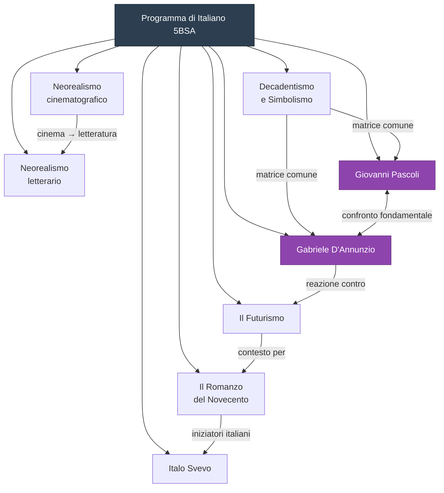

# Indice — Appunti di Letteratura Italiana (5BSA, 2025-26)

> **Ultimo aggiornamento:** 15 aprile 2026
> **Scopo:** Preparazione all'Esame di Stato (maturità)
> **Fonti:** Trascrizioni delle lezioni in classe (gennaio–aprile 2026)

---

## Struttura del sistema a tre livelli

Ogni argomento è organizzato in una cartella dedicata contenente tre file, pensati per momenti diversi dello studio:

| File | Funzione | Quando usarlo |
|------|----------|---------------|
| **mega-schema.md** | Studio completo e approfondito — tutto ciò che serve per l'esame, in forma narrativa e studiabile | Prima lettura, studio approfondito |
| **riassunto.md** | Condensazione al ~50% — concetti chiave mantenuti in forma narrativa ma più sintetica | Consolidamento, seconda passata |
| **ripasso.md** | Condensazione al ~30% — denso e rapido, con diagrammi Mermaid riepilogativi | Ripasso veloce prima dell'esame |

Lo stile è **narrativo e testuale**: paragrafi discorsivi, non elenchi puntati. Le citazioni dalla professoressa sono segnalate con `> [!note] Dalla lezione`. I diagrammi Mermaid visualizzano relazioni, confronti e cronologie.

---

## Mappa degli argomenti

---

## Ordine cronologico degli argomenti trattati in classe

La professoressa ha scelto di partire dal Novecento per poi tornare indietro, seguendo un ordine che non è quello cronologico della storia letteraria:

| # | Argomento | Periodo storico-letterario | Lezioni | Cartella |
|---|-----------|---------------------------|---------|----------|
| 1 | **Neorealismo cinematografico** | 1943–1952 | 12/01, 13/01*, 22/01 | `neorealismo-cinematografico/` |
| 2 | **Neorealismo letterario** | 1943–1960 | 22/01, 26/01, 27/01, 29/01, 02/02 | `neorealismo-letterario/` |
| 3 | **Decadentismo e Simbolismo** | 1857–1900 | 12/02, 16/02 | `decadentismo-simbolismo/` |
| 4 | **Giovanni Pascoli** | 1855–1912 | 16/02, 17/02, 23/02, 24/02, 26/02*, 02/03 | `pascoli/` |
| 5 | **Gabriele D'Annunzio** | 1863–1938 | 03/03, 05/03, 09/03, 10/03, 12/03, 16/03, 17/03 | `dannunzio/` |
| 6 | **Il Futurismo** | 1909–1920 | 17/03, 31/03, 09/04 | `futurismo/` |
| 7 | **Il Romanzo del Novecento** | Inizio '900 | 09/04 | `romanzo-novecento/` |
| 8 | **Italo Svevo** | 1893–1923 | 13/04 | `svevo/` |

\* Le lezioni del 13/01 e del 26/02 non dispongono di trascrizione valida; i contenuti sono stati integrati dalle fonti disponibili.

---

## Contenuto di ogni cartella

### 1. `neorealismo-cinematografico/`

Visconti (*Ossessione*, *La terra trema*), Rossellini (*Roma città aperta*, *Paisà*, *Germania anno zero*), De Sica (*Ladri di biciclette*, *Miracolo a Milano*). Rapporto tra cinema fascista e cinema neorealista, comparse non professioniste, riprese in esterni, lingua dialettale. La fine del Neorealismo.

### 2. `neorealismo-letterario/`

La Prefazione del '64 di Calvino come manifesto, i tre realismi (fiabesco, lirico, mitico-simbolico). Calvino (*Il sentiero dei nidi di ragno*, analisi de "La solitudine di Pin"), Vittorini (*Conversazione in Sicilia*, polemica col PCI), Pavese (*Paesi tuoi*, *La casa in collina*, *La luna e i falò*), Fenoglio (*Una questione privata*). La testimonianza della staffetta partigiana. Metodo per la tipologia A dell'esame.

### 3. `decadentismo-simbolismo/`

Caratteri generali del Decadentismo, i poeti maledetti. Baudelaire (*Corrispondenze*, *L'albatro*, *La caduta dell'aureola*), Verlaine (*Languore*, *Arte poetica*), Rimbaud (*Lettera del veggente*, *Vocali*). La crisi del ruolo del poeta nella modernità. Dalla matrice comune decadente a Pascoli e D'Annunzio.

### 4. `pascoli/`

Argomento più corposo del programma. Biografia con l'interpretazione di Andreoli (*I segreti di casa Pascoli*). La poetica del Fanciullino (lettura commentata). Lingua e stile: le tre categorie di Contini, fonosimbolismo, ritmo franto, ampliamento semantico. Otto poesie analizzate: *Arano*, *Lavandare*, *X Agosto*, *Temporale*, *L'assiuolo*, *Il gelsomino notturno*, *La tovaglia*, *Nebbia*. Confronto con Leopardi e D'Annunzio.

### 5. `dannunzio/`

Biografia dettagliata (il "primo influencer", le donne, le imprese militari, il Vittoriale). La poetica nelle tre dimensioni: estetismo, superomismo, panismo. *Il Piacere* con il ritratto di Andrea Sperelli. Quattro poesie dell'Alcyone: *Canta la gioia!*, *La pioggia nel pineto*, *Stabat nuda Aestas*, *La sera fiesolana*. Confronto con Pascoli, collegamenti con Wilde, Nietzsche, il Futurismo.

### 6. `futurismo/`

Contesto storico, il primo movimento d'avanguardia. *Manifesto del Futurismo* (1909) e *Manifesto tecnico della letteratura futurista* (1912): analisi dei principi. Le tecniche: paroliberismo, immaginazione senza fili, calligrammi. Marinetti (*Zang Tumb Tumb*, *Contro i professori*), Govoni (*Il palombaro*). Pittura futurista (Boccioni, Balla). Rapporto col passato e con D'Annunzio.

### 7. `romanzo-novecento/`

Argomento introdotto nella lezione del 09/04. Le tre innovazioni rispetto all'Ottocento: punto di vista soggettivo, tempo soggettivo (Bergson), personaggio in fieri. Proust e la memoria involontaria (episodio della Madeleine). Kafka e lo straniamento (*La metamorfosi*). Joyce e il flusso di coscienza (*Ulisse*). Svevo e *La coscienza di Zeno*. Monologo interiore vs flusso di coscienza.

### 8. `svevo/`

Trattazione completa di Italo Svevo (lezione del 13/04). Vita e formazione: Trieste città mitteleuropea, triplice identità linguistica (dialetto-tedesco-italiano), autodidatta, doppia vita da industriale e scrittore. Il rapporto con Joyce (insegnante d'inglese) e con la psicoanalisi di Freud (stimolo letterario, non cura). La scrittura come ossessione e terapia. La "malattia dell'uomo": disagio dell'individuo nella società borghese; la malattia è la vita stessa. I tre romanzi e i tre personaggi: Alfonso Nitti (*Una vita*, 1893), Emilio Brentani (*Senilità*, 1898), Zeno Cosini (*La coscienza di Zeno*, 1923). Il concetto di inetto (abulico, inadatto). Autoinganno e grandezza latente. Stile: scrittura di grado zero, monologo interiore, discorso indiretto libero, prima persona, struttura a blocchi tematici, tono ironico.

---

## Argomenti ancora da trattare

La professoressa ha annunciato il programma rimanente:

- **Luigi Pirandello** — vita, poetica, *Il fu Mattia Pascal*, *Uno, nessuno e centomila*
- **La triade lirica**: Saba, Ungaretti, Montale

---

## Dimensioni dei file

| Argomento | File | Righe | Caratteri | Byte |
|-----------|------|------:|----------:|-----:|
| Neorealismo cinematografico | mega-schema | 236 | 18 248 | 18 448 |
| Neorealismo cinematografico | riassunto | 60 | 4 207 | 4 247 |
| Neorealismo cinematografico | ripasso | 59 | 2 013 | 2 044 |
| Neorealismo letterario | mega-schema | 471 | 41 085 | 41 545 |
| Neorealismo letterario | riassunto | 221 | 22 147 | 22 472 |
| Neorealismo letterario | ripasso | 103 | 6 465 | 6 585 |
| Decadentismo e Simbolismo | mega-schema | 475 | 38 175 | 38 786 |
| Decadentismo e Simbolismo | riassunto | 285 | 19 641 | 19 971 |
| Decadentismo e Simbolismo | ripasso | 105 | 4 505 | 4 609 |
| Pascoli | mega-schema | 767 | 57 608 | 58 248 |
| Pascoli | riassunto | 439 | 29 584 | 29 891 |
| Pascoli | ripasso | 129 | 5 241 | 5 284 |
| D'Annunzio | mega-schema | 473 | 44 863 | 45 308 |
| D'Annunzio | riassunto | 233 | 22 847 | 23 040 |
| D'Annunzio | ripasso | 167 | 6 998 | 7 065 |
| Futurismo | mega-schema | 316 | 29 466 | 29 874 |
| Futurismo | riassunto | 150 | 15 110 | 15 371 |
| Futurismo | ripasso | 104 | 4 857 | 4 923 |
| Romanzo del Novecento | mega-schema | 274 | 25 603 | 25 848 |
| Romanzo del Novecento | riassunto | 152 | 13 343 | 13 478 |
| Romanzo del Novecento | ripasso | 67 | 3 302 | 3 334 |
| Svevo | mega-schema | 244 | 16 935 | 17 183 |
| Svevo | riassunto | 123 | 8 878 | 9 000 |
| Svevo | ripasso | 81 | 2 743 | 2 783 |
