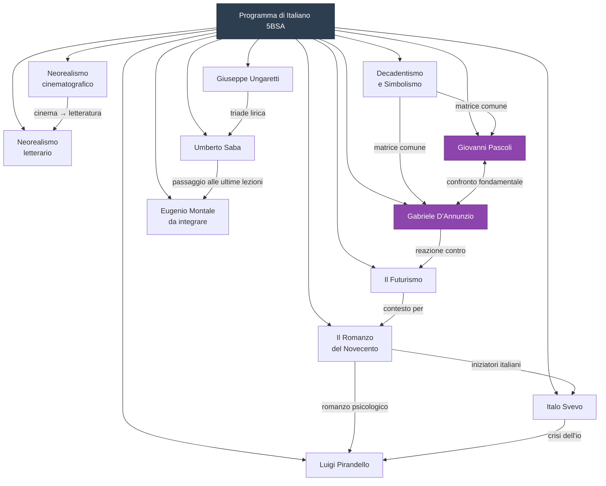

# Indice — Appunti di Letteratura Italiana (5BSA, 2025-26)

> **Ultimo aggiornamento:** 2 giugno 2026
> **Scopo:** Preparazione all'Esame di Stato (maturità)
> **Fonti:** Trascrizioni delle lezioni in classe (gennaio–maggio 2026)

---

## Struttura del sistema a tre livelli

Ogni argomento è organizzato in una cartella dedicata contenente tre file, pensati per momenti diversi dello studio:

| File | Funzione | Quando usarlo |
|------|----------|---------------|
| **mega-schema.md** | Studio completo e approfondito — tutto ciò che serve per l'esame, in forma narrativa e studiabile | Prima lettura, studio approfondito |
| **riassunto.md** | Condensazione al ~50% — concetti chiave mantenuti in forma narrativa ma più sintetica | Consolidamento, seconda passata |
| **ripasso.md** | Condensazione al ~30% — denso e rapido, con diagrammi Mermaid riepilogativi | Ripasso veloce prima dell'esame |

Lo stile è **narrativo e testuale**: paragrafi discorsivi, non elenchi puntati. Le citazioni dalla professoressa sono segnalate con `> [!note] Dalla lezione`. I diagrammi Mermaid visualizzano relazioni, confronti e cronologie.

---

## Mappa degli argomenti

```mermaid
flowchart TD
    A[Programma di Italiano 5BSA] --> B[Neorealismo<br/>cinematografico]
    A --> C[Neorealismo<br/>letterario]
    A --> D[Decadentismo<br/>e Simbolismo]
    A --> E[Giovanni Pascoli]
    A --> F[Gabriele D'Annunzio]
    A --> G[Il Futurismo]
    A --> H[Il Romanzo<br/>del Novecento]
    A --> I[Italo Svevo]
    A --> J[Luigi Pirandello]
    A --> K[Giuseppe Ungaretti]
    A --> L[Umberto Saba]
    A --> M[Eugenio Montale<br/>da integrare]

    D -->|"matrice comune"| E
    D -->|"matrice comune"| F
    E <-->|"confronto fondamentale"| F
    F -->|"reazione contro"| G
    G -->|"contesto per"| H
    H -->|"iniziatori italiani"| I
    H -->|"romanzo psicologico"| J
    I -->|"crisi dell'io"| J
    K -->|"triade lirica"| L
    B -->|"cinema → letteratura"| C
    L -->|"passaggio alle ultime lezioni"| M

    style A fill:#2c3e50,stroke:#1a252f,color:#fff
    style E fill:#8e44ad,stroke:#6c3483,color:#fff
    style F fill:#8e44ad,stroke:#6c3483,color:#fff
```

---

## Ordine cronologico degli argomenti trattati in classe

La professoressa ha scelto di partire dal Novecento per poi tornare indietro, seguendo un ordine che non è quello cronologico della storia letteraria:

| # | Argomento | Periodo storico-letterario | Lezioni | Cartella |
|---|-----------|---------------------------|---------|----------|
| 1 | **Neorealismo cinematografico** | 1943–1952 | 12/01, 13/01*, 22/01 | `neorealismo-cinematografico/` |
| 2 | **Neorealismo letterario** | 1943–1960 | 22/01, 26/01, 27/01, 29/01, 02/02 | `neorealismo-letterario/` |
| 3 | **Decadentismo e Simbolismo** | 1857–1900 | 12/02, 16/02 | `decadentismo-simbolismo/` |
| 4 | **Giovanni Pascoli** | 1855–1912 | 16/02, 17/02, 23/02, 24/02, 26/02*, 02/03 | `pascoli/` |
| 5 | **Gabriele D'Annunzio** | 1863–1938 | 03/03, 05/03, 09/03, 10/03, 12/03, 16/03, 17/03 | `dannunzio/` |
| 6 | **Il Futurismo** | 1909–1920 | 17/03, 31/03, 09/04 | `futurismo/` |
| 7 | **Il Romanzo del Novecento** | Inizio '900 | 09/04 | `romanzo-novecento/` |
| 8 | **Italo Svevo** | 1893–1923 | 13/04, 16/04, 20/04 | `svevo/` |
| 9 | **Luigi Pirandello** | 1867–1936 | 20/04, 21/04, 23/04, 27/04, 28/04, 04/05 | `pirandello/` |
| 10 | **Giuseppe Ungaretti** | 1888–1970 | 07/05, 11/05, 14/05, ripassi 21/05 e 25/05 | `ungaretti/` |
| 11 | **Umberto Saba** | 1883–1957 | 14/05, 18/05, 21/05, confronto con De André 28/05, ripassi 26/05 e 28/05 | `saba/` |
| 12 | **Eugenio Montale** | 1896–1981 | 26/05, 28/05 | `montale/` |

\* Le lezioni del 13/01 e del 26/02 non dispongono di trascrizione valida; i contenuti sono stati integrati dalle fonti disponibili.

---

## Contenuto di ogni cartella

### 1. `neorealismo-cinematografico/`

Visconti (*Ossessione*, *La terra trema*), Rossellini (*Roma città aperta*, *Paisà*, *Germania anno zero*), De Sica (*Ladri di biciclette*, *Miracolo a Milano*). Rapporto tra cinema fascista e cinema neorealista, comparse non professioniste, riprese in esterni, lingua dialettale. La fine del Neorealismo.

### 2. `neorealismo-letterario/`

La Prefazione del '64 di Calvino come manifesto, i tre realismi (fiabesco, lirico, mitico-simbolico). Calvino (*Il sentiero dei nidi di ragno*, analisi de "La solitudine di Pin"), Vittorini (*Conversazione in Sicilia*, polemica col PCI), Pavese (*Paesi tuoi*, *La casa in collina*, *La luna e i falò*), Fenoglio (*Una questione privata*). La testimonianza della staffetta partigiana. Metodo per la tipologia A dell'esame.

### 3. `decadentismo-simbolismo/`

Caratteri generali del Decadentismo, i poeti maledetti. Baudelaire (*Corrispondenze*, *L'albatro*, *La caduta dell'aureola*), Verlaine (*Languore*, *Arte poetica*), Rimbaud (*Lettera del veggente*, *Vocali*). La crisi del ruolo del poeta nella modernità. Dalla matrice comune decadente a Pascoli e D'Annunzio.

### 4. `pascoli/`

Argomento più corposo del programma. Biografia con l'interpretazione di Andreoli (*I segreti di casa Pascoli*). La poetica del Fanciullino (lettura commentata). Lingua e stile: le tre categorie di Contini, fonosimbolismo, ritmo franto, ampliamento semantico. Otto poesie analizzate: *Arano*, *Lavandare*, *X Agosto*, *Temporale*, *L'assiuolo*, *Il gelsomino notturno*, *La tovaglia*, *Nebbia*. Confronto con Leopardi e D'Annunzio.

### 5. `dannunzio/`

Biografia dettagliata (il "primo influencer", le donne, le imprese militari, il Vittoriale). La poetica nelle tre dimensioni: estetismo, superomismo, panismo. *Il Piacere* con il ritratto di Andrea Sperelli. Quattro poesie dell'Alcyone: *Canta la gioia!*, *La pioggia nel pineto*, *Stabat nuda Aestas*, *La sera fiesolana*. Confronto con Pascoli, collegamenti con Wilde, Nietzsche, il Futurismo.

### 6. `futurismo/`

Contesto storico, il primo movimento d'avanguardia. *Manifesto del Futurismo* (1909) e *Manifesto tecnico della letteratura futurista* (1912): analisi dei principi. Le tecniche: paroliberismo, immaginazione senza fili, calligrammi. Marinetti (*Zang Tumb Tumb*, *Contro i professori*), Govoni (*Il palombaro*). Pittura futurista (Boccioni, Balla). Rapporto col passato e con D'Annunzio.

### 7. `romanzo-novecento/`

Argomento introdotto nella lezione del 09/04 e rinforzato nei ripassi del 18/05, 25/05, 26/05 e 28/05. Le tre innovazioni rispetto all'Ottocento: punto di vista soggettivo, tempo soggettivo (Bergson), personaggio in fieri. Proust e la memoria involontaria (episodio della Madeleine). Kafka e lo straniamento (*La metamorfosi*). Joyce e il flusso di coscienza (*Ulisse*). Svevo e *La coscienza di Zeno*. Monologo interiore vs flusso di coscienza.

### 8. `svevo/`

Trattazione completa di Italo Svevo, integrata con i ripassi orali di fine maggio. Vita e formazione: Trieste città mitteleuropea, triplice identità linguistica, autodidatta, doppia vita da industriale e scrittore. Joyce, Freud e psicoanalisi. Concetto di inetto, ipertrofia della coscienza, lottatori e contemplatori. Analisi di *Una vita*, *Senilità* e *La coscienza di Zeno*: Prefazione, Preambolo, ultima sigaretta, morte del padre, matrimonio, atto mancato, finale apocalittico e vita come malattia.

### 9. `pirandello/`

Biografia e opera di Luigi Pirandello, integrata con i ripassi orali di fine maggio. *L'umorismo*, avvertimento e sentimento del contrario, scomposizione del reale. Vita e Forma, maschere, trappole sociali, identità e follia. Novelle: *Il treno ha fischiato*, *La carriola*, *La patente*. Romanzi: *Il fu Mattia Pascal* e *Uno, nessuno e centomila*. Teatro: *Così è (se vi pare)*, relativismo gnoseologico, *Sei personaggi in cerca d'autore*, quarta parete e teatro nel teatro.

### 10. `ungaretti/`

Biografia per luoghi di Giuseppe Ungaretti: Alessandria d'Egitto, Parigi, Carso/Isonzo, Roma, Brasile, Milano. Vicenda editoriale da *Il porto sepolto* a *L'Allegria*, poi *Sentimento del tempo* e *Il dolore*. Poetica del segreto, parola essenziale, versicoli, analogia, titolo come verso zero. Analisi di *Il porto sepolto*, *Veglia*, *Fratelli*, *I fiumi*, *Sono una creatura*, *San Martino del Carso*, *Soldati*, *Mattina* e *Non gridate più*. I ripassi del 21/05, 25/05 e 28/05 rafforzano il rapporto formale con il Futurismo e l'analisi di *Veglia*.

### 11. `saba/`

Trattazione di Umberto Saba aggiornata con le lezioni del 18/05, 21/05 e con il confronto del 28/05 tra *Città vecchia* e la canzone omonima di Fabrizio De André. Trieste come città di confine, biografia familiare, padre assente, madre, balia Peppa, psicoanalisi e trauma. Poetica della poesia onesta, lingua chiara e tradizionale ma moderna nell'interiorità. *Il Canzoniere* come autobiografia poetica. Analisi di *La capra*, *Mio padre è stato per me l'assassino*, *Ed amai nuovamente*, *Amai*, *A mia moglie*, *Trieste* e *Città vecchia*.

### 12. `montale/`

Trattazione di Eugenio Montale ricavata dalle lezioni del 26/05 e 28/05. Coordinate essenziali: Nobel 1975, produzione poetica ma anche giornalistica e saggistica, raccolte principali (*Ossi di seppia*, *Le occasioni*, *La bufera e altro*, *Satura/Xenia*). Focus su *Ossi di seppia*: pubblicazione da Gobetti nel 1925, valore antifascista, titolo originario *Rottami*, scarto/residualità, Liguria arida, esilio dalla vita, campana di vetro, muraglia, varco, poetica in negativo e correlativo oggettivo. Testi analizzati: *I limoni*, *Non chiederci la parola*, *Spesso il male di vivere ho incontrato*. *Meriggiare pallido e assorto* è solo nominata/rimandata.

---

## Argomenti ancora da trattare

La cartella ora include anche **Montale** con `mega-schema.md` e `riassunto.md`. Mancano solo eventuali schemi più brevi se si vuole creare anche un `ripasso.md`.

---

## Dimensioni dei file

| Argomento | File | Righe | Caratteri | Byte |
|-----------|------|------:|----------:|-----:|
| Neorealismo cinematografico | mega-schema | 236 | 18 248 | 18 448 |
| Neorealismo cinematografico | riassunto | 60 | 4 207 | 4 247 |
| Neorealismo cinematografico | ripasso | 59 | 2 013 | 2 044 |
| Neorealismo letterario | mega-schema | 471 | 41 085 | 41 545 |
| Neorealismo letterario | riassunto | 221 | 22 147 | 22 472 |
| Neorealismo letterario | ripasso | 103 | 6 465 | 6 585 |
| Decadentismo e Simbolismo | mega-schema | 475 | 38 175 | 38 786 |
| Decadentismo e Simbolismo | riassunto | 285 | 19 641 | 19 971 |
| Decadentismo e Simbolismo | ripasso | 105 | 4 505 | 4 609 |
| Pascoli | mega-schema | 767 | 57 608 | 58 248 |
| Pascoli | riassunto | 439 | 29 584 | 29 891 |
| Pascoli | ripasso | 129 | 5 241 | 5 284 |
| D'Annunzio | mega-schema | 473 | 44 863 | 45 308 |
| D'Annunzio | riassunto | 233 | 22 847 | 23 040 |
| D'Annunzio | ripasso | 167 | 6 998 | 7 065 |
| Futurismo | mega-schema | 316 | 29 466 | 29 874 |
| Futurismo | riassunto | 150 | 15 110 | 15 371 |
| Futurismo | ripasso | 104 | 4 857 | 4 923 |
| Romanzo del Novecento | mega-schema | 274 | 25 603 | 25 848 |
| Romanzo del Novecento | riassunto | 152 | 13 343 | 13 478 |
| Romanzo del Novecento | ripasso | 67 | 3 302 | 3 334 |
| Svevo | mega-schema | 477 | 28 666 | 28 918 |
| Svevo | riassunto | 99 | 8 129 | 8 210 |
| Svevo | ripasso | 193 | 7 766 | 7 820 |
| Pirandello | mega-schema | 746 | 51 432 | 51 969 |
| Pirandello | riassunto | 129 | 18 310 | 18 508 |
| Pirandello | ripasso | 294 | 18 611 | 18 828 |
| Ungaretti | mega-schema | 461 | 25 971 | 26 141 |
| Ungaretti | riassunto | 99 | 7 623 | 7 679 |
| Ungaretti | ripasso | 172 | 7 953 | 8 002 |
| Saba | mega-schema | 363 | 20 008 | 20 195 |
| Saba | riassunto | 96 | 7 066 | 7 133 |
| Saba | ripasso | 164 | 7 117 | 7 173 |
| Montale | mega-schema | 306 | 26 725 | 26 896 |
| Montale | riassunto | 136 | 13 032 | 13 116 |
