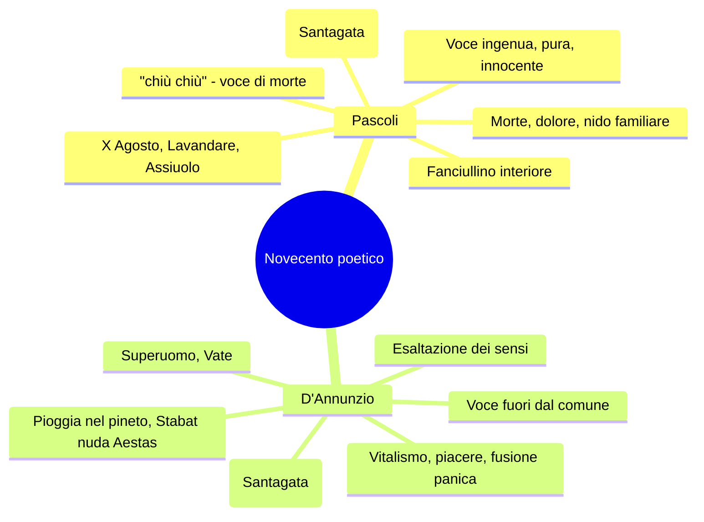
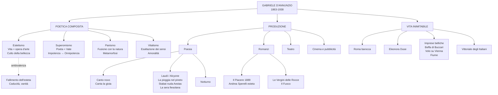

# Gabriele D'Annunzio — Studio completo

---

## Date fondamentali

| Anno | Evento |
|------|--------|
| **1863** | Nasce a Pescara, in Abruzzo |
| **1874** | Inizio studi liceali al Liceo Cicognini di Prato |
| **1879** | Pubblica *Primo vere*, prima raccolta poetica |
| **1881-1891** | Periodo romano: pubblica *Canto novo*, sposa Maria Hardouin di Gallese |
| **1889** | Pubblica *Il Piacere* (stesso anno di *Mastro-don Gesualdo* di Verga) |
| **1894** | Primo incontro con Eleonora Duse a Venezia |
| **1897** | Si ritira alla Capponcina (villa toscana vicino a Firenze) con la Duse |
| **1900** | Pubblica *Il Fuoco* |
| **1903** | Pubblica *Alcyone* (terzo libro delle *Laudi*), contenente *La pioggia nel pineto* |
| **1910-1915** | Esilio volontario in Francia per sfuggire ai creditori |
| **1914** | Collabora al film *Cabiria* (didascalie) |
| **1915** | Rientro in Italia, si schiera con gli interventisti |
| **1916** | Ferito all'occhio destro in un incidente aereo; compone il *Notturno* |
| **1918** | Beffa di Buccari (febbraio); Volo su Vienna (agosto) |
| **1919** | Occupa Fiume con un gruppo di legionari, fonda la Reggenza del Carnaro |
| **1920** | Natale di sangue: Fiume sgomberata con la forza |
| **1921-1938** | Si stabilisce al Vittoriale degli Italiani, sul Lago di Garda |
| **1937** | Nominato presidente dell'Accademia d'Italia |
| **1 marzo 1938** | Muore di emorragia cerebrale al tavolo da lavoro |

---

## 1. Biografia

### 1.1 Origini abruzzesi e formazione

Gabriele D'Annunzio nasce a Pescara nel 1863, appena due anni dopo l'Unità d'Italia, in un piccolo borgo di circa quattromila abitanti che fino al 1860 aveva fatto parte del Regno delle Due Sicilie. Il padre, Francesco Paolo, è un uomo di successo con il quale Gabriele ha un rapporto conflittuale, pur riconoscendo di aver ereditato da lui qualità decisive: "la potenza, l'impeto, la sensualità, la crudeltà, la prodigalità, l'amore dei cani e dei cavalli, quel bel profumo delle donne e dei frutti, il piacere dello sperpero". Cresce accudito dalla madre Luisa de Benedictis e dalle tre sorelle, che lo trattano come un principe.

A undici anni viene catapultato nelle aule austere del Reale Collegio Cicognini di Prato, uno dei licei più prestigiosi dell'epoca, che ricorderà come "un gran serraglio di cani, istituito per isterilire e inaridire le più fervide sementi". Fin dalla più tenera età, D'Annunzio cresce in un'Italia modesta che non osa proporsi come grande potenza, e sviluppa un fortissimo orgoglio personale che proietta in orgoglio nazionale ma che non trova corrispondenza nella realtà del Paese.

Già durante gli studi liceali si interessa di poesia e pubblica giovanissimo. La prima raccolta in assoluto, *Primo vere* (1879) — titolo latino che significa "primavera" — ottiene una certa risonanza e viene apprezzata dalla critica. In questa prima fase la produzione poetica segue un gusto letterario vicino al Verismo, raccontando una terra aspra, di pastori e uomini che lavorano duramente.

### 1.2 Il periodo romano (1881-1891): l'ascesa mondana

Nel 1881, terminati gli studi liceali, D'Annunzio si trasferisce a Roma dove si iscrive alla facoltà di Lettere e Filosofia, anche se nelle aule universitarie lo si vede pochissimo. Sono gli anni della crescita degli affari e delle banche, dello sviluppo edilizio. Ma tutto questo a Gabriele interessa poco: è incantato da quella che definirà "l'amore sensuale dell'eterna Roma".

Fisicamente, D'Annunzio è piccolo — un metro e sessantaquattro — con il naso pronunciato, la fronte alta, acuti occhi grigi, barba e baffetti biondi. Fin da subito si fa conoscere come conversatore impeccabile e poeta. I suoi scritti, recensioni e cronache mondane, escono sulle riviste romane, in particolare sulla *Cronaca Bizantina*, e raccontano con maestria il clima culturale del decadentismo.

> [!note] Dalla lezione
> Roma è diventata la capitale d'Italia ma non è una metropoli che ha la dignità delle grandi capitali europee. D'Annunzio la chiama la "Roma Bizantina", la Bisanzio di Roma, cioè la Roma decadente, ma anche una Roma che si sta modernizzando. È il palcoscenico sul quale D'Annunzio inizia la sua vita da protagonista, non solo della letteratura ma anche della scena, della moda e del costume.

In questi anni pubblica altre raccolte poetiche, tra cui *Canto novo*, e a vent'anni si innamora della diciannovenne duchessina Maria Hardouin di Gallese, di antica nobiltà. I due fuggono a Firenze — una fuga d'amore organizzata ad arte, con tutti i giornali avvertiti da D'Annunzio — e il matrimonio diventa inevitabile perché Maria è incinta. Avranno tre figli, ma la vita domestica si rivela ben presto un'angusta prospettiva. Il matrimonio in sé era avvenuto "in circostanze quasi tragiche, dopo una furiosa passione".

Nel 1889, a Francavilla al Mare (in Abruzzo), con una dedizione maniacale si ritira per cinque mesi a scrivere, riscrivere, scomporre e ritaglia articoli. Il risultato è *Il Piacere*, il romanzo che segna la sua consacrazione letteraria.

### 1.3 L'amore con Eleonora Duse e il periodo toscano

D'Annunzio conosce la "divina" Eleonora Duse, stella del teatro italiano e internazionale, a Venezia nel 1894. Nasce un idillio destinato a travolgere la vita di entrambi. La Duse non è bella in senso classico — mascella forte, labbra carnose, occhi grandi e pensosi — ma con lo sguardo esprime un temperamento travolgente. D'Annunzio la chiama con diversi nomi: "Anadiomene", "Ghisola". Alla fine della loro storia, Eleonora brucerà le lettere di Gabriele.

> [!note] Dalla lezione
> Eleonora Duse e D'Annunzio lavorano insieme a imprese teatrali costosissime. Si dice che lei si stesse rovinando per finanziare le opere teatrali di Gabriele. In realtà è felice di partecipare a quell'impresa culturale. "Ti perdono di avermi sfruttata, rovinata, umiliata. Ti perdono tutto, perché ho amato." — La professoressa aggiunge: "Ragazze, non prendete esempio da questo."

Nel 1897 si ritira alla Capponcina, una villa toscana vicino a Firenze. Eleonora, mentre gira per l'Europa con il suo teatro, invia spesso denaro a Gabriele, che lo dissipa per arredare la residenza. È in questo periodo che D'Annunzio compone le opere del suo periodo più prolifico: le raccolte poetiche delle *Laudi* (da cui proviene *Alcyone*, 1903), gran parte della drammaturgia e romanzi come *Il Fuoco* (1900). L'estate versiliese è al centro della lirica più celebre del poeta, *La pioggia nel pineto*.

La relazione con la Duse si incrina definitivamente quando Eleonora subisce l'umiliazione di essere dipinta ne *Il Fuoco* come un'attrice matura innamorata di un uomo più giovane che la maltratta. L'oltraggio finale è trovare nel letto di Gabriele una forcina appartenente alla nuova amante, Alessandra Starabba di Rudinì.

### 1.4 L'esilio francese e il ritorno in guerra

D'Annunzio si è indebitato a tal punto che nel 1910 deve lasciare l'Italia per sfuggire ai creditori che mettono all'asta la Capponcina. Va a Parigi, dove la sua fama lo precede. Quello che di fatto è un autoesilio forzato, lo definisce "esilio volontario", attribuendo un'aura di sacralità al suo allontanamento — le ragioni, in realtà, erano molto prosaiche.

In Francia compone in lingua francese *Le Martyre de Saint Sébastien*, musicato da Debussy, che suscita polemiche violente da parte della Chiesa cattolica (un santo interpretato da una donna, per di più ebrea). Il Vaticano mette all'indice l'intera opera di D'Annunzio.

> [!note] Dalla lezione
> D'Annunzio, prima ancora che inizi la Grande Guerra, nella primavera del 1914 già in Francia scrive della necessità che ci sia una grande guerra, perché la democrazia rischia di appiattire tutto. Per lui lo scoppio della guerra nell'agosto del '14 non è una sorpresa, ma quasi la realizzazione di una sua profezia.

Nel 1915 rientra in Italia e si schiera dalla parte degli interventisti con una campagna infuocata. Il 4 maggio 1915, pochi giorni prima dell'entrata in guerra, tiene dei discorsi appassionati incitando i giovani interventisti ad assaltare il Parlamento e perseguitare i neutralisti. "Beati quelli che più hanno perché più potranno dare, più potranno ardere" — il Comandante supremo dirà di lui: "Se si parlasse alle nostre truppe prima di ogni battaglia, la battaglia sarebbe per metà già vinta."

### 1.5 Le imprese belliche: dall'occhio ferito a Fiume

D'Annunzio partecipa alla guerra come soldato, compiendo imprese che ne accrescono il mito:

- **Volo su Trieste** (agosto 1915): lancia volantini con scritto "Coraggio fratelli, coraggio e costanza".
- **Ferita all'occhio** (gennaio 1916): al rientro da una missione aerea, l'impatto violento lo ferisce alla tempia e all'occhio destro. Si definisce **"l'Orbo Veggente"** — un ossimoro che esprime il suo superomismo: pur ferito, conserva la capacità di vedere ciò che gli altri non vedono. Durante la convalescenza compone il *Notturno* su striscioline di carta, scrivendo praticamente al buio.
- **Beffa di Buccari** (10-11 febbraio 1918): tre motoscafi MAS penetrano nella baia di Buccari sulla costa croata. L'azione è militarmente irrilevante ma dal grande impatto morale. D'Annunzio lascia bottigliette con messaggi beffardi legati con nastro tricolore. L'acronimo MAS sta per **"Memento Audere Semper"** — "Ricorda di osare sempre" — ripreso poi dal fascismo.
- **Volo su Vienna** (9 agosto 1918): undici aerei partono da San Pelagio; solo sette raggiungono Vienna, dove sganciano 390.000 volantini. L'incursione, irrilevante militarmente, desta enorme impressione.
- **Occupazione di Fiume** (12 settembre 1919): alla testa di un gruppo di legionari occupa la città, fonda la Reggenza Italiana del Carnaro con una costituzione (la Carta del Carnaro, scritta con il sindacalista rivoluzionario Alceste De Ambris). D'Annunzio rischia di far scoppiare un nuovo conflitto mondiale.

> [!note] Dalla lezione
> D'Annunzio conia l'espressione **"vittoria mutilata"** per descrivere l'esito della Prima Guerra Mondiale per l'Italia, che pur tra i vincitori non ottenne tutto ciò che sperava. I futuristi partecipano all'impresa di Fiume — Marinetti è tra i primi a raggiungere la città.

L'esperienza fiumana si conclude con il "Natale di sangue" (24 dicembre 1920), quando l'esercito italiano bombarda la città su ordine di Giolitti. D'Annunzio resiste fino al 18 gennaio 1921.

### 1.6 Il Vittoriale e gli ultimi anni

Scoraggiato ma orgoglioso, D'Annunzio si ritira sul Lago di Garda, a Villa Cargnacco, che trasforma nel **Vittoriale degli Italiani**: un monumento a se stesso e all'Italia, che occupa un'intera collina affacciata sul lago.

> [!note] Dalla lezione
> "Se non ci siete mai andati, andateci perché è una gita bellissima. Si affaccia sul lago, occupa tutta una collina. C'è l'anfiteatro, che oggi è utilizzato per i concerti estivi. C'è l'area mausoleo, dove è sepolto D'Annunzio e l'architetto Maroni. Nel giardino sono sepolti molti dei suoi levrieri."

La dimora riflette un **horror vacui** straordinario: tendaggi, arazzi, tappeti, circa 900 oggetti nel solo bagno. D'Annunzio stesso dichiarava: "Non soltanto ogni stanza da me studiosamente composta, ma ogni oggetto da me scelto e raccolto fu sempre per me un modo di espressione, un modo di rivelazione spirituale, come uno dei miei poemi".

Tra le stanze più significative:

- **Lo Studiolo**: luogo di raccoglimento per scrivere, con la **mano del monco** in gesso sulla porta — a indicare che D'Annunzio avrebbe risposto solo a chi voleva.
- **La Stanza della Cheli**: la sala da pranzo, con una tartaruga in bronzo (ricavata da una tartaruga morta per indigestione) come monito per gli ospiti ad essere parsimoniosi a tavola.
- **L'Officina**: lo studio dove lavorava notte e giorno, il "cuore del Vittoriale".
- **La Sala del Mappamondo**: biblioteca con organo, un galeone veneziano, busti di Dante.
- **La Stanza del Lebroso**: dove si raccoglieva in preghiera, con commistione tra sacro e profano.

> [!note] Dalla lezione
> D'Annunzio prendeva il sole nudo su un tappeto persiano sulle rive del Lago di Garda, anziché su un normale telo da mare. "Quando parlo di vita fuori dal comune, bisogna proprio saperla vivere."

I rapporti con Mussolini sono ambigui. D'Annunzio accetta le gratificazioni del regime (la presidenza dell'Accademia d'Italia nel 1937) ma mantiene un atteggiamento distaccato. Il fascismo attinge a piene mani dal suo repertorio: il saluto, l'"Eia Eia Alalà", i motti come "Memento Audere Semper". Mussolini diceva di lui: **"D'Annunzio è come un dente guasto: o lo si estirpa o lo si copre d'oro"**.

> [!note] Dalla lezione
> Quando Mussolini andò al Vittoriale nel 1925, D'Annunzio lo fece aspettare lunghissimo nella Sala del Mascheraio, su uno sgabello di legno. Sullo specchio aveva fatto scrivere per l'occasione: **"Ricordati che tu sei vetro e contro l'acciaio"**.

Negli ultimi anni, la cocaina ("la polvere folle") ha un ruolo devastante. La sessualità diventa maniacale, il deperimento fisico progressivo. Passa giorni interi recluso nella Prioria, scrivendo il *Libro segreto*, il suo unico vero tentativo autobiografico. Il 1 marzo 1938, alle 20:05, muore colpito da emorragia cerebrale al tavolo da lavoro.

---

## 2. La poetica

La poetica di D'Annunzio è una **poetica composita**, costituita da elementi eterogenei. Non è riducibile a un'unica etichetta, ma si articola in diverse dimensioni che attraversano tutta la sua produzione.

### 2.1 L'estetismo: la vita come opera d'arte

L'estetismo è la corrente di gusto che attraversa soprattutto il romanzo *Il Piacere* e che si fonda sull'equazione **vita = opera d'arte**. Questa equivalenza si realizza attraverso diversi principi:

Il **rifiuto della democrazia per ragioni di ordine estetico**: la democrazia, con il suo principio di uguaglianza, sommerge le cose belle. D'Annunzio parla di **"grigio diluvio democratico"** che finisce per annientare la bellezza. L'ideale di vita non è dunque democratico ma **aristocratico, elitario**. Teorizza il diritto di dominio dell'aristocrazia sul "grigiore borghese", perché l'uomo comune distrugge le cose belle, non è all'altezza dell'ideale dei pochi che sanno apprezzare e produrre bellezza.

L'**esaltazione del piacere**: la bellezza che si ricava dai sensi. L'arte di D'Annunzio è profondamente sensuale, insiste sul piacere che deriva dai cinque sensi. Non esiste separazione tra esperienza estetica ed esperienza erotica.

L'ideale di un **vivere inimitabile**: una vita fuori dal comune, lontana dalla quotidianità, dalla monotonia, dalla ripetizione. D'Annunzio stesso, nella sua vita, cerca di mettere in atto questi ideali conducendo un'esistenza di brillante mondanità — influenza i costumi della società italiana, detta le mode, dà notizie inventate pur di far parlare di sé.

> [!note] Dalla lezione
> "Un po' come Fabrizio Corona, ma un po' più colto il buon Gabriele."

### 2.2 Il superomismo

Il superomismo dannunziano nasce dall'incontro con la filosofia di Nietzsche, di cui però D'Annunzio dà un'**interpretazione piuttosto superficiale**. La figura dell'Übermensch nietzscheano (più correttamente tradotto come "oltreuomo") è più complessa rispetto alla declinazione che ne offre D'Annunzio.

Il poeta riconosce in sé un **superuomo**, un uomo fuori dal comune, che ha il compito di **rivelare alle folle il vero significato dell'esistenza**. Il poeta è **Vate** — una voce che ha verità misteriose e superiori da rivelare — e deve collocarsi ai vertici della gerarchia sociale perché dispone di una conoscenza negata a tutti gli altri.

Il superuomo ha il compito di **rovesciare l'impotenza in onnipotenza** attraverso l'esaltazione della lotta e del dominio. Qui emergono posizioni interventiste, militariste, che anticipano in un certo senso l'ideologia fascista. L'"Orbo Veggente" è un perfetto esempio di autorappresentazione superomistica: pur ferito all'occhio, D'Annunzio conserva la capacità di vedere ciò che gli altri non vedono.

### 2.3 Il panismo

Il panismo è un concetto che deriva dal greco *pas, pasa, pan* (= "tutto"), da cui anche il dio Pan della mitologia, divinità del bosco e della natura. Indica un **processo di fusione estatica tra il poeta e la natura**, che si articola in un duplice movimento di **metamorfosi**:

- **Arborizzazione dell'essere umano**: l'io lirico e la donna amata si trasformano in elementi vegetali, diventano parte della natura. Ne *La pioggia nel pineto*, Ermione "par da scorza tu esca" — sembra uscire dalla corteccia degli alberi.
- **Antropomorfizzazione della natura**: la natura assume tratti umani. Ne *La pioggia nel pineto*, le gocce di pioggia diventano "innumerevoli dita" che suonano strumenti diversi.

Il panismo è il più alto esempio della poetica dannunziana ed è al centro dei componimenti dell'*Alcyone*.

> [!note] Dalla lezione
> La professoressa spiega l'etimologia: "Pan-gea: *gea* = terra, la Pangea è il continente unico. Pan-teismo: Dio presente in tutte le forme della realtà. Pan-ismo: fusione con il tutto."

### 2.4 Gli altri elementi della poetica

Attorno ai tre pilastri dell'estetismo, del superomismo e del panismo, la poetica dannunziana accoglie anche:

L'**irrazionalismo**: la conoscenza della realtà non avviene attraverso la ragione ma attraverso i sensi, l'intuizione, l'illuminazione. La bellezza è valore supremo al di là di qualsiasi morale.

Il **vitalismo**: adesione a tutti gli aspetti della vita, al di là del bene e del male, al di là di qualsiasi distinzione morale. È una "vitalità amorale", come quella che troviamo anche nei personaggi del sottoproletariato pasoliniano.

Il mito del **barbarico e del primitivo**: tutto ciò che non è intaccato dall'educazione e dalle convenzioni. L'erotismo, l'esaltazione dell'Eros, la sensualità diventano espressione di questo ritorno all'ancestrale.

L'**esaltazione dell'io**: Santagata, nel suo saggio, parla per D'Annunzio di **"gigantismo dell'io"**, in opposizione al **"piccolo io"** di Pascoli. L'io dannunziano è grandioso, capace di esperienze fuori dal comune — si congiunge carnalmente con l'estate personificata (*Stabat nuda Aestas*), vive la fusione panica con la natura.

Il **volontarismo e l'audacia**: il messaggio di D'Annunzio è impregnato di esaltazione della forza, della lotta, del coraggio. "Memento audere semper" ne è la sintesi perfetta.

### 2.5 L'ambivalenza dannunziana

Un aspetto cruciale, che attraversa tutta la produzione di D'Annunzio, è la costante **ambivalenza** tra celebrazione vitalistica e senso della caducità. Non troviamo mai una celebrazione *tout court* del vitalismo: accanto all'esaltazione del piacere nel momento in cui "il frutto è più maturo" c'è sempre la consapevolezza che proprio quel frutto contiene i germi della fine.

In *Canta la gioia*, dopo l'inno alla gioia di vivere, D'Annunzio invita ad "adorare ogni fuggevole forma, ogni segno vago, ogni immagine vanante, ogni grazia caduca, ogni apparenza nell'ora breve" — una riflessione indiretta sulla brevità della vita e sulla morte. La parabola di Andrea Sperelli nel *Piacere* è l'incarnazione di questa ambiguità: l'estetismo conduce al fallimento esistenziale. La "favola bella" che illude oggi e illuse ieri è sempre il miraggio dell'amore destinato a svanire.

### 2.6 Lo stile: la poesia di secondo grado

La poesia dannunziana è **poesia di secondo grado**: letteratura fatta di altra letteratura, che si nutre di citazioni, recuperi stilistici, rielaborazioni della tradizione. D'Annunzio recupera tutto ciò che gli suona interessante — dalla poesia provenzale (il *senhal* per nascondere l'identità dell'amata) al *Cantico delle Creature* di San Francesco ("Laudata sii") — ma lo rilegge sempre in chiave puramente **estetica**, svuotandolo del significato religioso originario.

Dal punto di vista linguistico, D'Annunzio adotta un **linguaggio aulico, forbito, raffinato**, con termini ricercati scelti per la loro musicalità. L'andamento sintattico alterna ipotassi elegante e paratassi, con una prosa estremamente colta ed erudita, ricca di riferimenti alla storia dell'arte, alla mitologia, alla letteratura classica.

Gli strumenti stilistici principali sono:

- **Fonosimbolismo**: il significante assume un significato autonomo (il "crepitìo" della pioggia)
- **Musicalità**: allitterazioni, assonanze, consonanze, rime interne creano una tessitura fonica che riproduce le sensazioni
- **Onomatopee**: "crosciare", "crepitìo", "bruire"
- **Sinestesie**: "freschi pensieri" (tatto + intelletto)
- **Lessico botanico ricercato**: tamerici, mirti, ginepri, coccole aulenti, leandri
- **Polisindeto**: "e il pino... e il mirto... e il ginepro..."

---

## 3. D'Annunzio influencer: la sensibilità pubblicitaria

D'Annunzio è stato il **primo influencer della storia**. Con i suoi modi di vestire, comportarsi, atteggiarsi, ha fatto scuola e ha lanciato mode. Ma oltre all'influenza culturale, ha espresso una precoce sensibilità pubblicitaria, venendo pagato dalle aziende per "battezzare" i loro prodotti:

- **La Rinascente**: il celebre grande magazzino di lusso in Galleria a Milano
- **La penna Aurora**: il logo e il nome della marca di penne
- **L'Aurum**: il liquore abruzzese
- **L'automobile**: D'Annunzio decise che la parola dovesse essere di genere femminile — "questa ha la grazia, la snellezza, la vivacità di una seduttrice; ha inoltre una virtù ignota alle donne: la perfetta obbedienza"

Si interessò anche al cinema, un'arte appena nata nel 1895. Capì le potenzialità del mezzo e scrisse le didascalie per *Cabiria* (1914), un colossal della storia del cinema muto.

---

## 4. La produzione narrativa

### 4.1 Le fasi del romanzo dannunziano

La narrativa di D'Annunzio attraversa diverse fasi:

| Fase | Opere principali | Caratteristiche |
|------|-----------------|-----------------|
| **Verista** | *Novelle della Pescara* | Legame con il Verismo, gusto per il primitivo, il barbarico, l'Abruzzo |
| **Estetismo** | *Il Piacere* (1889) | Andrea Sperelli esteta, vita come opera d'arte, Roma barocca |
| **Bontà** | *Giovanni Episcopo*, *L'Innocente* | Ripiegamento interiore |
| **Superomistica** | *Le Vergini delle Rocce*, *Il Fuoco* (1900) | Superuomo, dominio dell'aristocrazia |
| **Intimista** | *Notturno* | Scrittura interiore, prosa crepuscolare |

### 4.2 *Il Piacere* (1889): il romanzo dell'esteta

*Il Piacere* è il romanzo cardine della fase estetica, pubblicato nello stesso anno di *Mastro-don Gesualdo* di Verga — un dato significativo che mostra quanto fossero distanti le due voci della narrativa italiana di fine Ottocento.

**La vicenda** è estremamente esile: si tratta di un intreccio amoroso che ha come protagonista **Andrea Sperelli**, un giovane conte che incarna la figura dell'esteta e rappresenta un **alter ego** di D'Annunzio. Andrea Sperelli è un uomo ricco, nel fiore degli anni, che si circonda di arte, lusso e oggetti raffinati, vivendo in un nobile palazzo del centro di Roma.

Lo **sfondo** è la Roma barocca del Seicento — non la Roma dei Cesari, degli archi, delle terme e dei fori, ma la Roma delle ville, delle fontane, delle chiese. "Egli avrebbe dato tutto il Colosseo per la Villa Medici, il Campo Vaccino per la Piazza di Spagna, l'Arco di Tito per la fontanella delle Tartarughe." Il Barocco è l'epoca di maggiore splendore artistico per la ricchezza di ornamenti, che però prelude anche alla decadenza — la solita ambivalenza dannunziana.

**I personaggi femminili** incarnano le due facce dell'ideale amoroso:

- **Elena Muti**: donna eccezionale, corrispettivo femminile dell'esteta. Rappresenta l'**Eros**, la passione sensuale a cui è impossibile resistere. Abbandona Andrea per sposare un lord inglese.
- **Maria Ferres**: moglie dell'ambasciatore guatemalteco. Rappresenta l'**amore puro**, la spiritualità.

Il sogno irrealizzabile di Andrea è riunire la sensualità di Elena e la purezza di Maria. Ed è proprio questo desiderio impossibile che lo conduce al fallimento: nel momento in cui è abbracciato con Maria, pronuncia il nome di Elena. Questo **lapsus** distrugge la relazione — Maria fugge disgustata e umiliata.

Il romanzo si chiude con una scena emblematica: tutti gli averi di Maria vengono messi all'asta (il marito si è ricoperto di debiti — specchio della stessa biografia di D'Annunzio). Andrea si reca all'asta per rivedere la casa e congedarsi da lei, ma in realtà si congeda da tutta la sua vita di esteta, che lo ha portato solo al **fallimento esistenziale**.

#### Il ritratto di Andrea Sperelli

La presentazione del protagonista è un manifesto dell'estetismo. Andrea appartiene per tradizione familiare a una stirpe eccezionale: "l'ideal tipo del giovine signore italiano del diciannovesimo secolo, il legittimo campione d'una stirpe di gentiluomini e d'artisti eleganti, l'ultimo discendente d'una razza intellettuale."

Il padre gli ha trasmesso "il gusto delle cose d'arte, il culto passionato della bellezza, il paradossale disprezzo de' pregiudizi, l'avidità del piacere" e soprattutto la **massima fondamentale**: **"Bisogna fare la propria vita come si fa un'opera d'arte."** Il principio educativo è completamente anticonvenzionale — una "straordinaria educazione estetica sotto la cura paterna, senza restrizioni e costrizioni di pedagoghi".

Un'altra massima paterna, in latino: **"Habere non haberi"** — **possedere, non essere posseduti**. Non posseduti dalle convenzioni, dall'omologazione, dal conformismo. E ancora: "il rimpianto è il vano pascolo d'uno spirito disoccupato" — chi vive appieno non ha tempo per rimuginare sul passato.

Ma c'è il **rovescio della medaglia**: "l'espansione di quella sua forza era la distruzione in lui di un'altra forza: della forza morale". Come si accresce la volontà di sperimentare il bello, si deprime il discernimento tra bene e male. Anche il **sofisma** — il gusto per la parola vuota e lambiccata — fruttifica nell'animo di Andrea: "la menzogna, non tanto verso gli altri quanto verso se stesso, divenne un abito così aderente alla coscienza ch'egli giunse a non poter mai essere interamente sincero".

#### Paralleli

*Il Piacere* si collega al *Ritratto di Dorian Gray* di Oscar Wilde: Andrea Sperelli è il Dorian Gray italiano, l'incarnazione dell'esteta che fa della propria vita un'opera d'arte.

#### Lo stile del romanzo

La lingua del *Piacere* è agli antipodi rispetto a quella di Verga. È un linguaggio **forbito, raffinato, aulico**, con termini ricercati, un andamento sintattico elegante, una prosa erudita piena di riferimenti alla storia dell'arte. Termini scelti per la loro **musicalità** (come "bussì", onomatopea per i colpi di battente dei grandi portoni seicenteschi). È una prosa in linea con i contenuti che veicola: l'aristocrazia, la Roma barocca, l'estetismo.

### 4.3 *Le Vergini delle Rocce* e *Il Fuoco*

Appartengono alla fase **superomistica**. Ne *Le Vergini delle Rocce* si trova il brano antologizzato "Uomini superiori", che esplicita la visione politica di D'Annunzio: il diritto dell'élite a dominare sulla massa.

*Il Fuoco* (1900) è il romanzo in cui D'Annunzio ritrae — in modo spietato — il suo rapporto con Eleonora Duse, presentata come un'attrice matura innamorata di un uomo più giovane che la maltratta.

---

## 5. La poesia: l'Alcyone e le Laudi

### 5.1 Le Laudi e la struttura dell'Alcyone

Le **Laudi del cielo del mare della terra e degli eroi** sono la grande opera poetica della maturità. **Alcyone** (1903), terzo libro delle Laudi, è la raccolta che contiene i vertici della lirica dannunziana ed è interamente legata all'**estate versiliese** trascorsa con Eleonora Duse.

### 5.2 *Canta la gioia* (da *Canto novo*)

Questo componimento, appartenente a una delle prime raccolte poetiche, è un manifesto dell'ideale estetico dannunziano: l'invocazione a celebrare la gioia di vivere.

> **Canta l'immensa gioia di vivere**, d'esser forte, d'esser giovane, di mordere i frutti terrestri con saldi e bianchi denti voraci, di porre le mani audaci e cupide su ogni dolce cosa tangibile, di tender l'arco su ogni preda novella che il desio miri, e di ascoltar tutte le musiche, e di guardar con occhi fiammei il volto divino del mondo, come l'amante guarda l'amata, e di adorare ogni fuggevole forma, ogni segno vago, ogni immagine vanante, ogni grazia caduca, ogni apparenza nell'ora breve.

Il componimento si apre con un'invocazione a celebrare la gioia, rivolta a un "tu" che potrebbe essere la gioia stessa oppure la donna amata, chiamata con il **senhal** "Ospite" — un espediente stilistico che D'Annunzio recupera dalla **lirica provenzale**, dove serviva a nascondere l'identità dell'amata (sempre una donna sposata). È un esempio di come la poesia dannunziana sia **poesia di secondo grado**, letteratura che si nutre di altra letteratura.

Il cuore del testo è l'esaltazione dei sensi: mordere i frutti con "saldi e bianchi denti voraci" (vitalismo e sensualità), "porre le mani audaci e cupide su ogni dolce cosa tangibile" (tatto e possesso), "ascoltar tutte le musiche" (udito), "guardar con occhi fiammei il volto divino del mondo" (vista). La **vita terrestre** è una divinità da ammirare.

Ma nella celebrazione si incrina qualcosa: "adorare ogni fuggevole forma, ogni segno vago, ogni immagine vanante, ogni grazia caduca, ogni apparenza nell'ora breve" introduce una riflessione sulla **brevità della vita**, sul tempo, sulla morte. Nella seconda parte, la "veste cineria" del dolore si oppone alle immagini accese della prima parte. Chi del dolore fa la sua veste è definito "un misero schiavo" — celebrazione della forza, del coraggio, dell'audacia, **volontà di potenza**.

### 5.3 *La pioggia nel pineto* (da *Alcyone*, 1903)

La lirica più celebre di D'Annunzio, il più alto esempio di **panismo** nella poesia italiana.

#### La situazione

L'io lirico passeggia con la donna amata — trasfigurata nella ninfa mitologica **Ermione** — nella pineta della Versilia, durante una pioggia estiva. L'intera poesia riproduce, attraverso il ritmo e la musicalità dei versi, il cadere incessante della pioggia sulla vegetazione.

#### Analisi del testo

**Prima strofa** — Si apre con l'imperativo "Taci": un'apostrofe rivolta sia al lettore (che così viene assorbito nella situazione) sia ad Ermione. Il primo elemento sensoriale è l'**udito**: "non odo parole che dici umane; ma odo parole più nuove che parlano gocciole e foglie lontane". Nel bosco non parlano esseri umani, ma gocce e foglie.

Segue l'invito "Ascolta" e la celebre sequenza delle piogge: "Piove su le tamerici salmastre ed arse" (con allitterazione della S), "piove su i pini scagliosi ed irti, piove su i mirti divini" (i mirti sono sacri a Venere, dea dell'amore), "su le ginestre fulgenti", "su i ginepri folti di coccole aulenti" (bacche profumate).

La pioggia cade "su i nostri volti **silvani**" (della selva — qui inizia la metamorfosi panica), "su le nostre mani ignude, su i nostri vestimenti leggieri" (la dimensione dell'eros), "su i freschi pensieri" (sinestesia), "su la favola bella che ieri t'illuse, che oggi m'illude, o Ermione" — la "favola bella" è l'**amore**, bello ma illusorio.

**Seconda strofa** — "Odi?" — sempre la sfera uditiva. "La pioggia cade su la solitaria verdura con un crepitìo che dura e varia nell'aria secondo le fronde più rade, men rade" — D'Annunzio registra le oscillazioni sonore della pioggia. Le cicale rispondono al "pianto" della pioggia (portata dall'austro, il vento). "E il pino ha un suono, e il mirto altro suono, e il ginepro altro ancora, strumenti diversi sotto innumerevoli dita" — le gocce sono **dita** che suonano strumenti diversi: **antropomorfizzazione della natura**. "E immersi noi siam nello spirto silvestre, d'arborea vita viventi" — l'io lirico e la donna partecipano della sostanza della natura: **arborizzazione dell'essere umano**. "E il tuo volto ebro è molle di pioggia come una foglia" — il viso inebriato, bagnato come una foglia (similitudine). "Le tue chiome auliscono come le chiare ginestre, o creatura terrestre che hai nome Ermione" — "terrestre": nata dalla terra, come una pianta.

**Terza strofa** — "Ascolta, ascolta". Il canto delle cicale ("aeree cicale" — immagine di leggerezza, perché il suono viene dall'alto) si fa più sordo sotto la pioggia che cresce. Un canto "più roco" sale dall'umida ombra: è la rana. "Sola una nota ancor trema, si spegne, risorge, trema, si spegne" — la registrazione di ogni minima oscillazione sonora. "Non s'ode voce del mare" — "voce" è una personificazione del mare. "La figlia dell'aria è muta" — bellissima metafora: la cicala, che ha cessato il canto. "Ma la figlia del limo lontana, la rana, canta nell'ombra più fonda, chi sa dove, chi sa dove!" — il limo è il fango; la rana canta da una lontananza favolosa.

**Quarta strofa** — Il culmine della metamorfosi panica. "Piove su le tue ciglia nere sì che par tu pianga ma di piacere" — un pianto estatico. "Non bianca ma quasi fatta **virente**, par da scorza tu esca" — Ermione è diventata verdeggiante, sembra uscire dalla corteccia degli alberi. La **fusione panica** è compiuta.

> [!note] Dalla lezione
> La professoressa collega questa metamorfosi all'**Apollo e Dafne** di Bernini: la ninfa che si trasforma in alloro. "Se noi dovessimo immaginarla nella storia dell'arte, forse quella sarebbe un'immagine calzante."

Poi una serie di similitudini tra tratti fisici della donna ed elementi naturali: "il cuor nel petto è come pesca intatta, tra le palpebre gli occhi son come polle tra l'erbe, i denti negli alveoli son come mandorle acerbe" — tutte immagini di freschezza e vigore. "E andiam di fratta in fratta" (di cespuglio in cespuglio), "or congiunti or disciolti, e il verde vigor rude ci allaccia i malleoli c'intrica i ginocchi" — la vegetazione li trattiene. La poesia si chiude con la ripresa della strofa iniziale, ma con un'inversione significativa: "che ieri **m'illuse**, che oggi **t'illude**" (prima era il contrario).

#### La struttura musicale

L'intera poesia è costruita su una **trama musicale** che riproduce il ritmo della pioggia:
- La ripetizione delle stesse parole in posizioni diverse ("piove", "ascolta", "Ermione")
- L'uso di parole-verso isolate ("lontane")
- Il polisindeto ("e il pino... e il mirto... e il ginepro...")
- Le allitterazioni e le rime interne
- I verbi uditivi ricorrenti ("odo", "ascolta", "odi")

#### La parodia di Montale

Nel 1971, Eugenio Montale scrive una **parodia** de *La pioggia nel pineto* intitolata semplicemente *Piove*. È un testo che rovescia la dimensione panica e l'esaltazione estetica di D'Annunzio, e che la professoressa ha condiviso su Classroom come collegamento.

### 5.4 *Stabat nuda Aestas* (da *Alcyone*)

Il titolo latino significa "L'estate giaceva nuda" — con *Aestas* scritto in maiuscola perché è l'estate **personificata**, una sorta di divinità.

Il poeta insegue in una caccia amorosa una figura femminile misteriosa: "Primamente intravidi il suo piè stretto / scorrere su per gli aghi arsi dei pini" — per prima cosa vide il suo piede sottile percorrere gli aghi secchi dei pini. L'aria "estuava" (ribolliva — verbo colto che deriva da "estate") con grande tremito, "quasi bianca vampa infusa" — l'aria ardente come una fiamma bianca.

Le cicale tacciono, i ruscelli si fanno più rochi, la resina "gemette" giù per i tronchi: il silenzio è la condizione che precede il disvelamento di un miracolo. "Riconobbi il colubro dal sentore" — riconobbe il serpente dall'odore. Nel bosco degli ulivi (immagine sacra, recuperata in chiave estetica) la raggiunge: i capelli fulvi (tra il biondo e il rosso) "trasvolare" tra le foglie argentee degli ulivi — l'argento è quello delle foglie, e l'aggettivo "palladio" rimanda ad Atena (Pallade Atena), a cui l'ulivo era sacro. Gli ulivi si caricano così di **valore mitologico**.

La figura femminile si addentra tra le canne palustri ("il falasco"), inciampa ("il piede le si torse in fallo"), "distesa cadde tra le sabbie e l'acque. Il Ponente schiumò ne' suoi capegli, immensa apparve, immensa nudità." Il congiungimento tra l'io lirico e l'estate è suggerito, non esplicitato.

> [!note] Dalla lezione
> Questo testo è al centro del saggio di Santagata sul "gigantismo dell'io" dannunziano: il poeta insegue una figura che è l'estate stessa personificata e si congiunge con lei — un'esperienza fuori dal comune che solo il superuomo può vivere. In opposizione al "piccolo io" di Pascoli.

In tutto il testo si intrecciano **vista** (la vampa diffusa, le ombre cerule), **udito** (le cicale che tacciono, i ruscelli rochi, la resina che stilla) e **olfatto** (il sentore del serpente). Diverse sensazioni sono compenetrate.

### 5.5 *La sera fiesolana* (da *Alcyone*)

Un testo composto da tre strofe più un ritornello che riprende il *Cantico delle Creature* di San Francesco: **"Laudata sii o sera"**.

#### La situazione

Siamo nella campagna toscana (Fiesole), in **primavera** (a differenza della *Pioggia nel pineto*, ambientata in estate). Non c'è un centro narrativo preciso: è un **libero affiorare di immagini paesaggistiche**, di estasi amorosa e poetica.

#### Prima strofa (14 versi, un unico periodo)

"Le mie parole siano per te nella sera fresche come il fruscio che fan le foglie" — una **sinestesia** (parole + fresche) e una tessitura fonica data dall'allitterazione di F: "fresche", "fruscio", "fan", "foglie". Le foglie del gelso diventano puro fruscio: un elemento concreto si **smaterializza** fino a identificarsi nella sensazione uditiva che produce.

Un contadino "s'attarda all'opra lenta / su l'alta scala" — reminiscenza leopardiana che ricorda *Il sabato del villaggio*. Il fusto dell'albero "s'argenta" al calare della sera. La luna "par che innanzi a sé distenda un velo" — la notte come un velo che cala sulla campagna. "Il nostro sogno" ricorda la "favola bella" della *Pioggia nel pineto*: l'illusione dell'amore.

#### Ritornello

"Laudata sii per lo tuo viso di perla, o sera, e per i tuoi grandi umidi occhi ove si tace l'acqua del cielo" — la sera è personificata come una figura femminile con un "viso di perla" (luce pallida della luna) e "grandi umidi occhi" (un cielo carico di pioggia che però non cade). Il recupero del *Cantico delle Creature* non è religioso ma **estetico e musicale**.

> [!note] Dalla lezione
> "Il *Cantico delle Creature* di San Francesco è il primo testo della letteratura italiana, 1220, in volgare umbro, appartenente al genere della lauda. San Francesco celebra gli elementi del creato in rapporto al creatore. D'Annunzio ne recupera il ritornello svuotandolo del valore religioso e riempiendolo di valore estetico."

#### Seconda strofa

"Dolci le mie parole nella sera ti sien come la pioggia che bruiva" — "bruiva" è un francesismo (da *bruire* = mormorare, crepitare), verbo onomatopeico. La pioggia è "commiato lagrimoso della primavera" che cede il posto all'estate.

Segue un'ampia elencazione in **polisindeto** degli elementi della campagna: gelsi, olmi, viti, "pini dai novelli rosei diti" (le gemme come dita rosee — **antropomorfizzazione della natura**), "grano che non è biondo ancora e non è verde", "fieno che già patì la falce e trascolora", "fratelli olivi che fan di santità pallidi i clivi e sorridenti" — gli ulivi sono "fratelli", con linguaggio francescano, e le loro foglie argentate rendono i colli pallidi.

#### Terza strofa

"Io ti dirò verso quali reami d'amor ci chiami il fiume" — il fiume è l'Arno fiorentino. "Le cui fonti eterne all'ombra degli antichi rami parlano nel mistero sacro dei monti" — l'acqua mormora parole che appartengono a una dimensione divina. Questa natura misteriosa, fatta di segrete corrispondenze, richiama Baudelaire e la poetica del simbolismo.

"Le colline su i limpidi orizzonti s'incurvino come labbra che un divieto chiuda" — le colline come labbra femminili (immagine sensuale) che custodiscono un segreto taciuto. La rivelazione del poeta-veggente è promessa ma non si dà mai: resta un mito da aspettare.

"Laudata sii per la tua pura morte, o sera, e per l'attesa che in te fa palpitar le prime stelle" — la conclusione del giorno e il comparire delle stelle.

---

## 6. D'Annunzio e Pascoli: il confronto

D'Annunzio e Pascoli sono le due voci che fondano il Novecento poetico italiano, ma rappresentano **visioni radicalmente opposte**:

> [!note] Dalla lezione
> "Se da una parte c'è la rondine che cade tra spine, l'eco che rimane muto degli occhi di un grido, le lavandare, l'aratro, la maggese, un campo vuoto, l'assiuolo che canta *chiù chiù*, la voce di morte, il pianto del cielo... qui invece abbiamo un'esaltazione proprio dei sensi, un'esaltazione di tutto ciò di cui si può godere coi sensi."

| Aspetto | Pascoli | D'Annunzio |
|---------|---------|------------|
| L'io | "Piccolo io" | "Gigantismo dell'io" |
| Il poeta | Fanciullino | Vate, superuomo |
| Tono | Malinconico, intimo, dolente | Esaltato, vitalistico, sontuoso |
| Natura | Misteriosa, inquietante, piena di presagi | Luogo di fusione panica, di estasi |
| Temi | Morte, lutto, nido familiare | Piacere, bellezza, eros, forza |
| Rapporto con la realtà | Esclusione, marginalità | Dominio, conquista |
| Linguaggio | Sperimentale, umile ma ricco | Aulico, forbito, erudito |

---

## 7. D'Annunzio nel contesto: collegamenti

### Con il Decadentismo e il Simbolismo

D'Annunzio è una delle due maggiori voci del **decadentismo italiano**, insieme a Pascoli. Il legame con il simbolismo francese e con Baudelaire emerge nella concezione della natura come depositaria di corrispondenze segrete, di misteri da svelare. La "sera fiesolana", con il suo proliferare di immagini che rimandano a una dimensione misteriosa, è il testo che più chiaramente si rifà a questa matrice.

### Con Nietzsche

Il superomismo dannunziano si ispira a Nietzsche, ma con un'interpretazione "piuttosto superficiale". La figura del superuomo (o oltreuomo) nietzscheano è più complessa.

### Con il Futurismo

I futuristi condividono con D'Annunzio l'esaltazione della forza, del coraggio, dell'audacia, il disprezzo per la borghesia e la democrazia, e le posizioni interventiste e nazionaliste. Marinetti è tra i primi a raggiungere D'Annunzio a Fiume. Tuttavia, il Futurismo vuole **distruggere** la tradizione letteraria, mentre D'Annunzio se ne nutre continuamente.

> [!note] Dalla lezione
> D'Annunzio ha inventato la parola "automobile" e l'ha resa femminile. La macchina è un mito dell'inizio del Novecento — e questo interesse per la modernità lo collega alle tematiche futuriste, pur nella diversità degli esiti artistici.

### Con il Fascismo

Il fascismo attinge dal repertorio dannunziano: il saluto, l'"Eia Eia Alalà", il "Memento Audere Semper", la retorica nazionalista. Ma D'Annunzio non è propriamente fascista — è un "anarca" superomista che si sente superiore e non contaminato dalla politica. Il rapporto con Mussolini è di reciproca diffidenza mascherata da ossequio.

### Con Ungaretti

D'Annunzio considera l'aspetto eroico e glorioso della guerra; Ungaretti, che pure è interventista all'inizio, racconta dalla trincea l'aspetto distruttivo, la sofferenza, il dolore, la solitudine. Sono due visioni complementari della stessa esperienza.

### Con Oscar Wilde

Andrea Sperelli è il "Dorian Gray italiano": entrambi incarnano l'esteta che fa della propria vita un'opera d'arte.

---

## 8. Mappa riepilogativa

