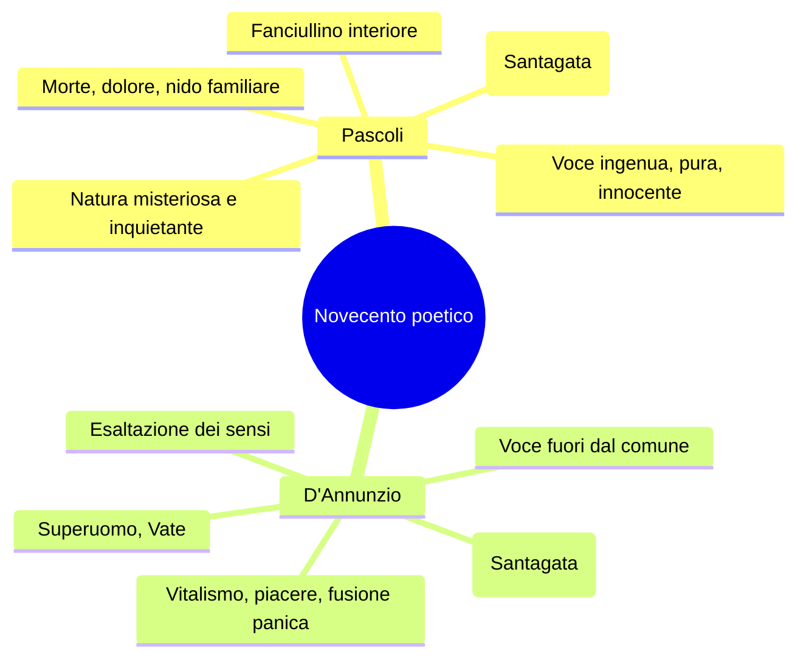
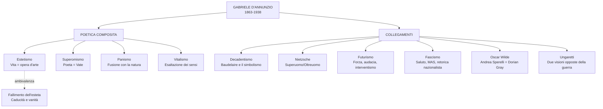

# Gabriele D'Annunzio — Riassunto

---

## Date fondamentali

| Anno | Evento |
|------|--------|
| **1863** | Nasce a Pescara, in Abruzzo |
| **1879** | Pubblica *Primo vere*, prima raccolta poetica |
| **1889** | Pubblica *Il Piacere* |
| **1894** | Primo incontro con Eleonora Duse a Venezia |
| **1903** | Pubblica *Alcyone*, con *La pioggia nel pineto* |
| **1910-1915** | Esilio volontario in Francia per sfuggire ai creditori |
| **1916** | Ferito all'occhio destro; compone il *Notturno* |
| **1918** | Beffa di Buccari (febbraio); Volo su Vienna (agosto) |
| **1919** | Occupa Fiume con un gruppo di legionari |
| **1921-1938** | Si stabilisce al Vittoriale degli Italiani, sul Lago di Garda |
| **1 marzo 1938** | Muore di emorragia cerebrale al tavolo da lavoro |

---

## 1. Biografia

### 1.1 Origini e formazione

Gabriele D'Annunzio nasce a Pescara nel 1863, in un piccolo borgo di circa quattromila abitanti. Il rapporto con il padre Francesco Paolo è conflittuale, ma Gabriele riconosce di aver ereditato da lui qualità decisive: "la potenza, l'impeto, la sensualità, la crudeltà, la prodigalità, l'amore dei cani e dei cavalli". Cresce viziato dalla madre e dalle tre sorelle come un piccolo principe.

A undici anni viene iscritto al Reale Collegio Cicognini di Prato, uno dei licei più prestigiosi dell'epoca, che ricorderà come "un gran serraglio di cani, istituito per isterilire e inaridire le più fervide sementi". Già durante gli studi liceali pubblica *Primo vere* (1879), prima raccolta poetica, apprezzata dalla critica.

### 1.2 Il periodo romano (1881-1891)

Nel 1881 D'Annunzio si trasferisce a Roma, dove frequenta pochissimo le aule universitarie ma si afferma rapidamente come conversatore brillante e poeta. Fisicamente piccolo — un metro e sessantaquattro — con occhi grigi acuti e barba bionda, pubblica cronache mondane sulla *Cronaca Bizantina* e si costruisce un'immagine pubblica di grande protagonista della scena culturale e mondana.

A vent'anni si innamora della diciannovenne duchessina Maria Hardouin di Gallese, organizza una fuga d'amore tenendo avvertiti i giornali, e il matrimonio diventa inevitabile. Avranno tre figli, ma la vita domestica si rivela presto soffocante. Nel 1889, ritiratosi per cinque mesi a Francavilla al Mare, pubblica *Il Piacere*, il romanzo della sua consacrazione letteraria.

> **Roma** è il palcoscenico sul quale D'Annunzio inizia la sua vita da protagonista, non solo della letteratura ma anche della moda e del costume. La chiama "Roma Bizantina": una Roma decadente che si modernizza.

### 1.3 L'amore con Eleonora Duse e il periodo toscano

D'Annunzio incontra a Venezia nel 1894 la "divina" Eleonora Duse, stella del teatro internazionale. Nasce un idillio che travolge entrambi. Nel 1897 si ritirano alla Capponcina, una villa toscana vicino a Firenze, dove il poeta compone le opere della maturità: le raccolte delle *Laudi* (tra cui *Alcyone*, 1903) e romanzi come *Il Fuoco* (1900). L'estate versiliese trascorsa con Duse è al centro della lirica più celebre, *La pioggia nel pineto*.

La relazione si incrina quando Duse si trova ritratta ne *Il Fuoco* come un'attrice matura innamorata di un uomo più giovane che la maltratta. L'oltraggio finale è trovare nel letto di Gabriele la forcina di una nuova amante. La Duse brucerà le sue lettere, ma gli dirà: "Ti perdono di avermi sfruttata, rovinata, umiliata. Ti perdono tutto, perché ho amato."

### 1.4 L'esilio francese e il ritorno in guerra

Nel 1910 D'Annunzio deve lasciare l'Italia per sfuggire ai creditori che mettono all'asta la Capponcina. Va a Parigi definendo questo esilio forzato "esilio volontario", attribuendogli un'aura di sacralità. In Francia compone *Le Martyre de Saint Sébastien*, musicato da Debussy, che suscita violente polemiche della Chiesa. Il Vaticano mette all'indice l'intera sua opera.

Nel 1915 rientra in Italia e si schiera con gli interventisti. Il 4 maggio 1915, pochi giorni prima dell'entrata in guerra, tiene discorsi appassionati incitando i giovani a difendere l'onore della Patria: "Beati quelli che più hanno perché più potranno dare, più potranno ardere."

### 1.5 Le imprese belliche: dall'occhio ferito a Fiume

D'Annunzio partecipa alla guerra come soldato, compiendo imprese che ne accrescono il mito:

- **Volo su Trieste** (agosto 1915): lancia volantini con scritto "Coraggio fratelli, coraggio e costanza".
- **Ferita all'occhio** (gennaio 1916): un impatto violento al rientro da una missione lo ferisce alla tempia e all'occhio destro. Si definisce **"l'Orbo Veggente"** — un ossimoro superomistico: pur ferito, conserva la capacità di vedere ciò che gli altri non vedono. Durante la convalescenza compone il *Notturno* su striscioline di carta, quasi al buio.
- **Beffa di Buccari** (10-11 febbraio 1918): tre motoscafi MAS penetrano nella baia croata di Buccari. L'azione è militarmente irrilevante ma di grande impatto morale: D'Annunzio lascia bottigliette con messaggi beffardi legate con nastro tricolore. L'acronimo MAS diventa **"Memento Audere Semper"** — "Ricorda di osare sempre".
- **Volo su Vienna** (9 agosto 1918): undici aerei partono da San Pelagio; solo sette raggiungono Vienna, dove sganciano 390.000 volantini. Militarmente irrilevante, desta enorme impressione.
- **Occupazione di Fiume** (12 settembre 1919): alla testa di un gruppo di legionari occupa la città, fonda la Reggenza Italiana del Carnaro con una propria costituzione. D'Annunzio conia l'espressione **"vittoria mutilata"** per descrivere l'esito deludente della guerra per l'Italia.

L'esperienza fiumana si conclude con il "Natale di sangue" (24 dicembre 1920), quando l'esercito italiano bombarda la città su ordine di Giolitti.

### 1.6 Il Vittoriale e gli ultimi anni

Scoraggiato ma orgoglioso, D'Annunzio si ritira sul Lago di Garda a Villa Cargnacco, che trasforma nel **Vittoriale degli Italiani**: un monumento a se stesso e all'Italia che occupa un'intera collina affacciata sul lago. La dimora riflette un *horror vacui* straordinario — tendaggi, arazzi, tappeti, circa 900 oggetti nel solo bagno — e D'Annunzio stesso la considera un'opera d'arte: "ogni oggetto da me scelto e raccolto fu sempre per me un modo di espressione, un modo di rivelazione spirituale, come uno dei miei poemi".

I rapporti con Mussolini sono ambigui: D'Annunzio accetta la presidenza dell'Accademia d'Italia (1937) ma mantiene un atteggiamento distaccato. Mussolini diceva di lui: **"D'Annunzio è come un dente guasto: o lo si estirpa o lo si copre d'oro"**. Quando Mussolini andò al Vittoriale nel 1925, D'Annunzio lo fece aspettare nella Sala del Mascheraio, su uno sgabello di legno, con lo specchio recante la scritta: **"Ricordati che tu sei vetro e contro l'acciaio"**.

Negli ultimi anni la cocaina e il deperimento fisico segnano la sua esistenza reclusa. Il 1° marzo 1938 muore di emorragia cerebrale al tavolo da lavoro.

---

## 2. La poetica

La poetica di D'Annunzio è **composita ed eterogenea**: non è riducibile a un'unica etichetta, ma si articola attorno a tre pilastri fondamentali.

### 2.1 L'estetismo: la vita come opera d'arte

L'estetismo si fonda sull'equazione **vita = opera d'arte** e si realizza attraverso alcuni principi fondamentali.

Il **rifiuto della democrazia per ragioni estetiche**: la democrazia, con il suo principio di uguaglianza, sommerge le cose belle in un **"grigio diluvio democratico"**. L'ideale di vita è **aristocratico ed elitario** — solo pochi sanno apprezzare e produrre la bellezza.

L'**esaltazione del piacere sensuale**: la bellezza si ricava dai cinque sensi e non esiste separazione tra esperienza estetica ed erotica. L'arte di D'Annunzio è profondamente sensuale.

L'ideale di un **vivere inimitabile**: una vita fuori dal comune, lontana dalla monotonia borghese. D'Annunzio cerca di vivere concretamente questi ideali, influenzando i costumi italiani, dettando le mode, costruendo un personaggio di brillante mondanità.

### 2.2 Il superomismo

Il superomismo nasce dall'incontro con la filosofia di Nietzsche, di cui D'Annunzio dà però un'**interpretazione piuttosto superficiale**. Il poeta si riconosce come **superuomo** — un uomo fuori dal comune con il compito di rivelare alle folle il vero significato dell'esistenza. È **Vate**, voce dotata di verità superiori e misteriose, che deve collocarsi ai vertici della gerarchia sociale.

Il superuomo ha il compito di **rovesciare l'impotenza in onnipotenza** attraverso l'esaltazione della lotta e del dominio. L'"Orbo Veggente" è la perfetta autorappresentazione superomistica: pur ferito, vede ciò che gli altri non vedono. Queste posizioni anticipano in parte l'ideologia fascista, con le quali però D'Annunzio ha un rapporto complesso.

### 2.3 Il panismo

Il panismo deriva dal greco *pas, pasa, pan* (= "tutto") e indica un **processo di fusione estatica tra il poeta e la natura**, che si articola in un duplice movimento di metamorfosi:

- **Arborizzazione dell'essere umano**: l'io lirico e la donna amata si trasformano in elementi vegetali. Ne *La pioggia nel pineto*, Ermione "par da scorza tu esca" — sembra uscire dalla corteccia degli alberi.
- **Antropomorfizzazione della natura**: la natura assume tratti umani. Le gocce di pioggia diventano "innumerevoli dita" che suonano strumenti diversi.

Il panismo è al centro dell'*Alcyone* ed è il più alto esempio della poetica dannunziana.

### 2.4 Gli altri elementi della poetica

Attorno ai tre pilastri si organizzano altri elementi essenziali:

L'**irrazionalismo**: la conoscenza non avviene attraverso la ragione ma attraverso i sensi, l'intuizione, l'illuminazione. La bellezza è valore supremo al di là di qualsiasi morale.

Il **vitalismo**: adesione totale a tutti gli aspetti della vita, al di là del bene e del male. È una "vitalità amorale" che esalta la forza e il coraggio.

L'**esaltazione dell'io**: Santagata parla per D'Annunzio di **"gigantismo dell'io"**, in opposizione al "piccolo io" di Pascoli. L'io dannunziano è grandioso, capace di esperienze eccezionali — si congiunge persino con l'estate personificata (*Stabat nuda Aestas*).

### 2.5 L'ambivalenza e lo stile

Un aspetto cruciale è la costante **ambivalenza** tra celebrazione vitalistica e senso della caducità. In *Canta la gioia*, dopo l'inno alla vita, D'Annunzio invita ad "adorare ogni fuggevole forma, ogni immagine vanante, ogni grazia caduca, ogni apparenza nell'ora breve" — la bellezza è sempre accompagnata dalla consapevolezza della fine.

La poesia dannunziana è **poesia di secondo grado**: letteratura fatta di altra letteratura, che si nutre di citazioni e recuperi stilistici. D'Annunzio rilegge la tradizione — dalla lirica provenzale al *Cantico delle Creature* — in chiave puramente estetica.

Dal punto di vista linguistico adotta un **linguaggio aulico, forbito, raffinato**, con termini scelti per la loro musicalità. Gli strumenti stilistici principali sono: fonosimbolismo, allitterazioni, onomatopee ("crosciare", "crepitìo"), sinestesie ("freschi pensieri"), lessico botanico ricercato, polisindeto.

---

## 3. D'Annunzio influencer e il cinema

D'Annunzio è stato il **primo influencer della storia**, capace di influenzare i costumi di un'intera nazione. Ha espresso anche una precoce sensibilità pubblicitaria, venendo pagato per "battezzare" prodotti commerciali:

- **La Rinascente**: il grande magazzino di lusso in Galleria a Milano
- **La penna Aurora**: logo e nome della marca
- **L'Aurum**: il liquore abruzzese
- **L'automobile**: D'Annunzio decise che la parola fosse femminile — "questa ha la grazia, la snellezza, la vivacità di una seduttrice; ha inoltre una virtù ignota alle donne: la perfetta obbedienza"

Capì anche le potenzialità del cinema, appena nato, e scrisse le didascalie per *Cabiria* (1914), uno dei colossal del cinema muto.

---

## 4. La produzione narrativa

### 4.1 Le fasi del romanzo

| Fase | Opere principali | Caratteristiche |
|------|-----------------|-----------------|
| **Verista** | *Novelle della Pescara* | Abruzzo primitivo e barbarico |
| **Estetismo** | *Il Piacere* (1889) | Vita come opera d'arte, Roma barocca |
| **Bontà** | *Giovanni Episcopo*, *L'Innocente* | Ripiegamento interiore |
| **Superomistica** | *Le Vergini delle Rocce*, *Il Fuoco* (1900) | Dominio dell'aristocrazia |
| **Intimista** | *Notturno* | Prosa interiore, crepuscolare |

### 4.2 *Il Piacere* (1889): il romanzo dell'esteta

*Il Piacere* è il romanzo cardine della fase estetica, pubblicato nello stesso anno di *Mastro-don Gesualdo* di Verga — dato che mostra quanto fossero distanti le due voci della narrativa italiana di fine Ottocento.

**La vicenda** è esile: un intreccio amoroso che ha come protagonista **Andrea Sperelli**, giovane conte che incarna la figura dell'esteta ed è un **alter ego** di D'Annunzio. Andrea vive circondato da arte, lusso e oggetti raffinati in un nobile palazzo del centro di Roma.

Lo **sfondo** è la Roma barocca del Seicento — non la Roma dei Cesari e dei fori, ma la Roma delle ville, delle fontane, delle chiese. "Egli avrebbe dato tutto il Colosseo per la Villa Medici, il Campo Vaccino per la Piazza di Spagna." Il Barocco, con la sua ricchezza ornamentale, prelude già alla decadenza — la solita ambivalenza dannunziana.

**I personaggi femminili** incarnano le due facce dell'ideale amoroso:
- **Elena Muti**: rappresenta l'Eros, la passione sensuale irresistibile; abbandona Andrea per sposare un lord inglese.
- **Maria Ferres**: moglie dell'ambasciatore guatemalteco, rappresenta l'amore puro e la spiritualità.

Il sogno irrealizzabile di Andrea è riunire sensualità e purezza. Questo desiderio impossibile lo conduce al fallimento: nel momento in cui è abbracciato con Maria, pronuncia il nome di Elena. Questo **lapsus** distrugge la relazione — Maria fugge disgustata. Il romanzo si chiude con l'asta degli averi di lei, dove Andrea si congeda da tutta la sua vita di esteta, che lo ha portato solo al **fallimento esistenziale**.

#### Il ritratto di Andrea Sperelli

Andrea appartiene a "una stirpe di gentiluomini e d'artisti eleganti". Il padre gli ha trasmesso "il gusto delle cose d'arte, il culto passionato della bellezza, il paradossale disprezzo de' pregiudizi, l'avidità del piacere" e soprattutto la **massima fondamentale**: **"Bisogna fare la propria vita come si fa un'opera d'arte."**

Un'altra massima paterna è in latino: **"Habere non haberi"** — **possedere, non essere posseduti** dalle convenzioni e dall'omologazione. Ma c'è il **rovescio della medaglia**: "l'espansione di quella sua forza era la distruzione in lui di un'altra forza: della forza morale." Come cresce il desiderio di bellezza, si deprime il discernimento tra bene e male. La menzogna "divenne un abito così aderente alla coscienza ch'egli giunse a non poter mai essere interamente sincero." Andrea Sperelli è il Dorian Gray italiano, l'incarnazione dell'esteta che fa della propria vita un'opera d'arte — con esiti analoghi a quelli del romanzo di Oscar Wilde.

---

## 5. La poesia: l'Alcyone e le Laudi

### 5.1 Struttura delle Laudi

Le **Laudi del cielo del mare della terra e degli eroi** sono la grande opera poetica della maturità. **Alcyone** (1903), terzo libro, contiene i vertici della lirica dannunziana ed è interamente legato all'**estate versiliese** trascorsa con Eleonora Duse.

### 5.2 *Canta la gioia* (da *Canto novo*)

Questo componimento è un manifesto dell'ideale estetico: l'invocazione a celebrare la gioia di vivere.

> **Canta l'immensa gioia di vivere**, d'esser forte, d'esser giovane, di mordere i frutti terrestri con saldi e bianchi denti voraci, di porre le mani audaci e cupide su ogni dolce cosa tangibile [...] e di adorare ogni fuggevole forma, ogni segno vago, ogni immagine vanante, ogni grazia caduca, ogni apparenza nell'ora breve.

L'amata è chiamata con il **senhal** "Ospite" — espediente recuperato dalla **lirica provenzale**, dove serviva a nascondere l'identità della donna amata, sempre sposata. Il cuore del testo è l'esaltazione dei cinque sensi: mordere i frutti con "saldi e bianchi denti voraci" (vitalismo), "ascoltar tutte le musiche", "guardar con occhi fiammei il volto divino del mondo". La vita terrestre è una divinità da ammirare.

Poi si incrina qualcosa: "adorare ogni fuggevole forma [...] ogni grazia caduca" introduce la riflessione sulla **brevità della vita** e sulla morte. Chi del dolore fa la sua veste è "un misero schiavo" — D'Annunzio esalta la forza e il coraggio come unica risposta al senso di caducità.

### 5.3 *La pioggia nel pineto* (da *Alcyone*, 1903)

La lirica più celebre di D'Annunzio e il più alto esempio di **panismo** nella poesia italiana.

#### La situazione

L'io lirico passeggia con la donna amata — trasfigurata nella ninfa mitologica **Ermione** — nella pineta della Versilia durante una pioggia estiva. L'intera poesia riproduce attraverso ritmo e musicalità il cadere incessante della pioggia sulla vegetazione.

#### Analisi per strofe

**Prima strofa** — Si apre con l'imperativo "Taci": un'apostrofe rivolta ad Ermione e al lettore, che viene così assorbito nella situazione. Il primo elemento sensoriale è l'**udito**: "non odo parole che dici umane; ma odo parole più nuove che parlano gocciole e foglie lontane." Segue la celebre sequenza delle piogge sulle piante: tamerici, pini, mirti divini (sacri a Venere), ginestre, ginepri "folti di coccole aulenti". La pioggia cade infine "su i nostri volti **silvani**" (della selva — inizia la metamorfosi panica), "su i freschi pensieri" (sinestesia), "su la favola bella che ieri t'illuse, che oggi m'illude, o Ermione" — la "favola bella" è l'**amore**, bello ma illusorio.

**Seconda strofa** — "Odi?" D'Annunzio registra le oscillazioni sonore della pioggia che varia "nell'aria secondo le fronde più rade, men rade". "E il pino ha un suono, e il mirto altro suono, e il ginepro altro ancora, strumenti diversi sotto innumerevoli dita" — le gocce sono **dita** che suonano strumenti diversi: **antropomorfizzazione della natura**. "E immersi noi siam nello spirto silvestre, d'arborea vita viventi" — l'io lirico e Ermione partecipano della sostanza della natura: **arborizzazione dell'essere umano**. "Il tuo volto ebro è molle di pioggia come una foglia. Le tue chiome auliscono come le chiare ginestre, o creatura terrestre che hai nome Ermione": la donna è già parte della vegetazione.

**Terza strofa** — "Ascolta, ascolta." Il canto delle cicale si fa più sordo sotto la pioggia che cresce; un canto "più roco" sale dall'umida ombra: è la rana. "Sola una nota ancor trema, si spegne, risorge, trema, si spegne" — ogni minima oscillazione sonora viene registrata. "La figlia dell'aria è muta" — bellissima metafora per la cicala che ha smesso di cantare. "Ma la figlia del limo lontana, la rana, canta nell'ombra più fonda, chi sa dove, chi sa dove!" — il limo è il fango; la rana canta da una lontananza favolosa.

**Quarta strofa** — Il culmine della metamorfosi panica. "Non bianca ma quasi fatta **virente**, par da scorza tu esca" — Ermione è diventata verdeggiante, sembra uscire dalla corteccia degli alberi. La **fusione panica è compiuta**. Seguono similitudini tra tratti fisici della donna ed elementi naturali: "il cuor nel petto è come pesca intatta, tra le palpebre gli occhi son come polle tra l'erbe, i denti negli alveoli son come mandorle acerbe". La poesia si chiude riprendendo la strofa iniziale con un'inversione significativa: "che ieri **m'illuse**, che oggi **t'illude**".

#### La struttura musicale

L'intera poesia è costruita su una **trama musicale** che riproduce il ritmo della pioggia: ripetizione di parole chiave ("piove", "ascolta", "Ermione"), polisindeto ("e il pino… e il mirto… e il ginepro…"), allitterazioni, rime interne, verbi uditivi ricorrenti ("odo", "ascolta", "odi").

> Nel 1971 Eugenio Montale scrisse una **parodia** di questo testo intitolata semplicemente *Piove*, rovesciando la dimensione panica e l'esaltazione estetica di D'Annunzio.

### 5.4 *Stabat nuda Aestas* (da *Alcyone*)

Il titolo latino significa "L'estate giaceva nuda" — *Aestas* è scritto in maiuscolo perché è l'estate **personificata** come divinità. Il poeta insegue in una caccia amorosa una figura femminile misteriosa tra i pini: "Primamente intravidi il suo piè stretto / scorrere su per gli aghi arsi dei pini." L'aria "estuava" con grande tremito, le cicale tacevano, la resina "gemette" giù per i tronchi. Nel bosco degli ulivi "palladii" (sacri ad Atena) la raggiunge, finché "distesa cadde tra le sabbie e l'acque. Il Ponente schiumò ne' suoi capegli, immensa apparve, immensa nudità." Il congiungimento tra il poeta e l'estate è suggerito, non esplicitato.

Questo testo è al centro del saggio di Santagata sul "gigantismo dell'io" dannunziano: solo il superuomo può vivere un'esperienza così eccezionale come congiungersi con l'estate personificata.

### 5.5 *La sera fiesolana* (da *Alcyone*)

Un testo composto da tre strofe più un **ritornello** che riprende il *Cantico delle Creature* di San Francesco: **"Laudata sii o sera"**.

La situazione è nella campagna toscana (Fiesole), in **primavera**. Non c'è un centro narrativo preciso: è un libero affiorare di immagini paesaggistiche.

**Prima strofa**: "Le mie parole siano per te nella sera fresche come il fruscio che fan le foglie" — sinestesia e allitterazione della F: "fresche", "fruscio", "fan", "foglie". Le foglie del gelso si smaterializzano nella sensazione uditiva che producono. Un contadino "s'attarda all'opra lenta / su l'alta scala" — reminiscenza leopardiana del *Sabato del villaggio*. "Il nostro sogno" riprende la "favola bella" della *Pioggia nel pineto*: l'illusione dell'amore.

**Ritornello**: "Laudata sii per lo tuo viso di perla, o sera, e per i tuoi grandi umidi occhi ove si tace l'acqua del cielo" — la sera è personificata come una figura femminile con un "viso di perla" (luce lunare) e "grandi umidi occhi" (cielo carico di pioggia). D'Annunzio recupera il *Cantico delle Creature* svuotandolo del valore religioso originario e riempiendolo di valore **estetico e musicale**.

**Seconda strofa**: "Dolci le mie parole nella sera ti sien come la pioggia che bruiva" — "bruiva" è un francesismo onomatopeico. Segue una vasta elencazione in **polisindeto** degli elementi della campagna: gelsi, olmi, viti, "pini dai novelli rosei diti" (le gemme come dita rosee — antropomorfizzazione), "fratelli olivi" con linguaggio francescano.

**Terza strofa**: "Io ti dirò verso quali reami d'amor ci chiami il fiume" — l'Arno fiorentino. "Le colline su i limpidi orizzonti s'incurvino come labbra che un divieto chiuda" — le colline come labbra femminili che custodiscono un segreto. La rivelazione del poeta-veggente è promessa ma non si dà mai. "Laudata sii per la tua pura morte, o sera, e per l'attesa che in te fa palpitar le prime stelle."

---

## 6. D'Annunzio e Pascoli: il confronto

D'Annunzio e Pascoli sono le due voci che fondano il Novecento poetico italiano, ma rappresentano **visioni radicalmente opposte**:

| Aspetto | Pascoli | D'Annunzio |
|---------|---------|------------|
| L'io | "Piccolo io" | "Gigantismo dell'io" |
| Il poeta | Fanciullino | Vate, superuomo |
| Tono | Malinconico, intimo, dolente | Esaltato, vitalistico, sontuoso |
| Natura | Misteriosa, piena di presagi | Luogo di fusione panica ed estasi |
| Temi | Morte, lutto, nido familiare | Piacere, bellezza, eros, forza |
| Linguaggio | Sperimentale, umile ma ricco | Aulico, forbito, erudito |

---

## 7. D'Annunzio nel contesto: collegamenti

**Con il Decadentismo e il Simbolismo**: D'Annunzio è la maggiore voce del decadentismo italiano insieme a Pascoli. La concezione della natura come depositaria di corrispondenze segrete rimanda a Baudelaire.

**Con Nietzsche**: il superomismo si ispira a Nietzsche, ma con un'interpretazione superficiale; la figura dell'oltreuomo nietzscheano è più complessa di come D'Annunzio la declina.

**Con il Futurismo**: i futuristi condividono con D'Annunzio l'esaltazione della forza e le posizioni interventiste. Tuttavia il Futurismo vuole **distruggere** la tradizione letteraria, mentre D'Annunzio se ne nutre continuamente.

**Con il Fascismo**: il fascismo attinge dal repertorio dannunziano — il saluto, l'"Eia Eia Alalà", il "Memento Audere Semper". Ma D'Annunzio non è propriamente fascista: è un "anarca" superomista che si sente superiore alla politica. Il rapporto con Mussolini è di reciproca diffidenza mascherata da ossequio.

**Con Ungaretti**: D'Annunzio considera l'aspetto eroico e glorioso della guerra; Ungaretti racconta dalla trincea la sofferenza e la solitudine. Sono due visioni complementari della stessa esperienza.
