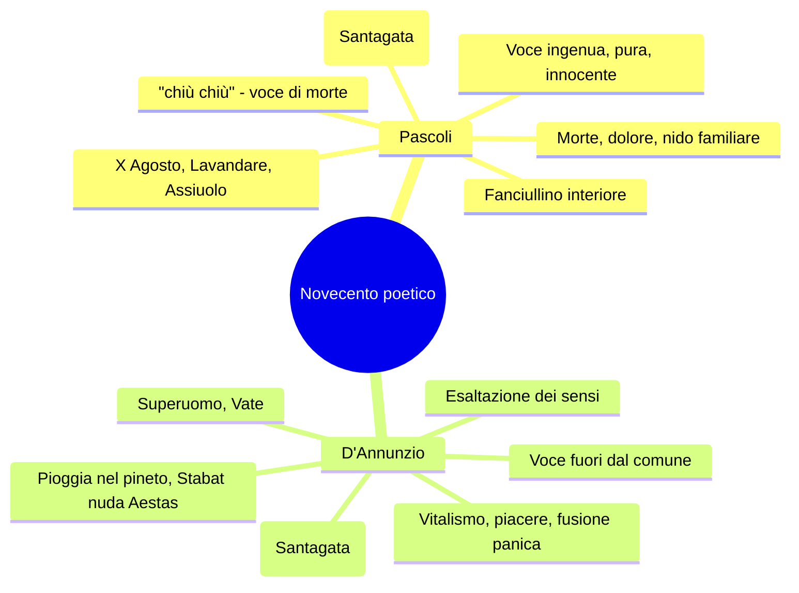
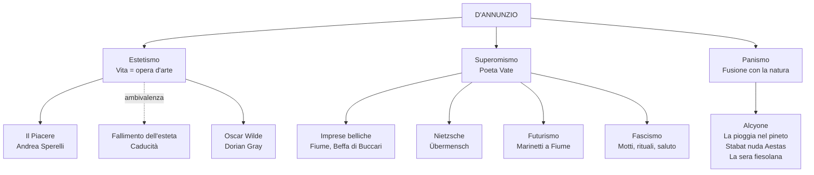

# Gabriele D'Annunzio — Riassunto

---

## Date fondamentali

| Anno | Evento |
|------|--------|
| **1863** | Nasce a Pescara, in Abruzzo |
| **1879** | Pubblica *Primo vere*, prima raccolta poetica |
| **1881-1891** | Periodo romano: *Canto novo*, matrimonio con Maria Hardouin di Gallese |
| **1889** | Pubblica *Il Piacere* (stesso anno di *Mastro-don Gesualdo* di Verga) |
| **1894** | Primo incontro con Eleonora Duse a Venezia |
| **1897** | Si ritira alla Capponcina con la Duse |
| **1903** | *Alcyone* (terzo libro delle *Laudi*), contenente *La pioggia nel pineto* |
| **1910-1915** | Esilio in Francia per debiti |
| **1915** | Rientro in Italia, interventismo; partecipa alla guerra |
| **1916** | Ferito all'occhio; compone il *Notturno* su striscioline di carta |
| **1918** | Beffa di Buccari (febbraio); Volo su Vienna (agosto) |
| **1919** | Occupa Fiume; conia l'espressione "vittoria mutilata" |
| **1921-1938** | Si stabilisce al Vittoriale degli Italiani, sul Lago di Garda |
| **1 marzo 1938** | Muore di emorragia cerebrale al tavolo da lavoro |

---

## 1. Biografia

### Origini e formazione

D'Annunzio nasce a Pescara nel 1863, appena due anni dopo l'Unità d'Italia. Cresce in una famiglia agiata, accudito dalla madre e dalle sorelle "come un principe". A undici anni entra al Reale Collegio Cicognini di Prato — che ricorderà come "un gran serraglio di cani, istituito per isterilire e inaridire le più fervide sementi". Già durante gli anni liceali pubblica la prima raccolta *Primo vere* (1879), in una fase iniziale vicina al gusto **verista**, raccontando l'Abruzzo aspro e rurale.

### Il periodo romano e l'ascesa mondana (1881-1891)

Nel 1881 si trasferisce a Roma: è incantato dalla "Roma Bizantina" — non la Roma dei Cesari e dei fori, ma la Roma decadente e barocca del Seicento, che diventa il suo palcoscenico. Scrive per la *Cronaca Bizantina* e *La Tribuna*, si fa conoscere come conversatore impeccabile e poeta di razza.

> [!note] Dalla lezione
> Roma è diventata la capitale d'Italia ma non è ancora una metropoli all'altezza delle grandi capitali europee. D'Annunzio la chiama la "Roma Bizantina", la Roma decadente che si sta però modernizzando. È il palcoscenico sul quale Gabriele inizia la sua vita da protagonista, non solo della letteratura ma anche della scena, della moda e del costume.

A vent'anni sposa la duchessina Maria Hardouin di Gallese con una fuga romantica organizzata ad arte. Avranno tre figli, ma la vita domestica lo opprime. Nel 1889 scrive *Il Piacere* che segna la consacrazione letteraria. D'Annunzio è il **primo influencer della storia**: detta le mode, lancia prodotti (**La Rinascente**, la **penna Aurora**, l'**Aurum**, l'**automobile** resa femminile), scrive le didascalie per *Cabiria* (1914).

> [!note] Dalla lezione
> "Un po' come Fabrizio Corona, ma un po' più colto il buon Gabriele."

### Eleonora Duse e il periodo toscano

Nel 1894, a Venezia, D'Annunzio conosce Eleonora Duse, stella assoluta del teatro internazionale. Il suo temperamento è travolgente. Nel 1897 si ritirano alla Capponcina (Settignano, Firenze), dove Eleonora invia regolarmente denaro che Gabriele dilapida per arredare la residenza.

> [!note] Dalla lezione
> "Ti perdono di avermi sfruttata, rovinata, umiliata. Ti perdono tutto, perché ho amato." — La professoressa aggiunge: "Ragazze, non prendete esempio da questo."

È il periodo più prolifico: D'Annunzio compone le *Laudi* (*Alcyone*, 1903) e *Il Fuoco* (1900). Proprio *Il Fuoco* segna la fine della relazione: D'Annunzio vi ritrae Eleonora come un'attrice matura innamorata di un uomo più giovane che la maltratta. L'oltraggio finale è trovare nel suo letto la forcina di una nuova amante. Eleonora brucerà tutte le lettere di Gabriele.

### Le imprese belliche: dall'occhio ferito a Fiume

Sommerso dai debiti, nel 1910 D'Annunzio lascia l'Italia per sfuggire ai creditori che mettono all'asta la Capponcina. Si trasferisce a Parigi, definendo l'esilio forzato "esilio volontario". In Francia compone *Le Martyre de Saint Sébastien*, musicato da Debussy, che suscita violente polemiche: il Vaticano mette all'indice l'intera sua opera.

Rientra in Italia nel 1915 schierandosi con forza con gli interventisti. Partecipa alla guerra come soldato, collezionando imprese leggendarie. Ferito all'occhio in un incidente aereo nel 1916, si autodefinisce **"l'Orbo Veggente"** — ossimoro superomistico: pur ferito, conserva la capacità di vedere ciò che gli altri non vedono. Durante la convalescenza compone il *Notturno* su striscioline di carta, quasi al buio. Nella **Beffa di Buccari** (febbraio 1918) tre motoscafi penetrano nella baia nemica lasciando bottigliette beffarde con nastro tricolore. L'acronimo MAS diventa **"Memento Audere Semper"**. Il **Volo su Vienna** (agosto 1918) porta undici aerei su Vienna con 390.000 volantini. Infine, il 12 settembre 1919, occupa **Fiume** fondando la Reggenza Italiana del Carnaro con propria costituzione, rischiando di scatenare un nuovo conflitto mondiale.

> [!note] Dalla lezione
> D'Annunzio conia l'espressione **"vittoria mutilata"** per descrivere l'esito della Prima Guerra Mondiale per l'Italia, che pur tra i vincitori non ottenne tutto ciò che sperava. I futuristi partecipano all'impresa di Fiume — Marinetti è tra i primi a raggiungere la città.

L'esperienza fiumana si conclude con il "Natale di sangue" (24 dicembre 1920), quando l'esercito italiano bombarda la città su ordine di Giolitti.

### Il Vittoriale e gli ultimi anni

Scoraggiato ma orgoglioso, D'Annunzio si ritira al **Vittoriale degli Italiani** sul Lago di Garda: un monumento a se stesso che occupa un'intera collina con anfiteatro, mausoleo e una nave da guerra incastonata nel terreno. La dimora è un trionfo di *horror vacui*: tendaggi, arazzi, circa 900 oggetti nel solo bagno. I rapporti con Mussolini sono ambigui: il fascismo attinge dal suo repertorio (il saluto, l'"Eia Eia Alalà", il "Memento Audere Semper") ma D'Annunzio mantiene un distacco superomistico. Mussolini diceva: **"D'Annunzio è come un dente guasto: o lo si estirpa o lo si copre d'oro"**.

> [!note] Dalla lezione
> Quando Mussolini andò al Vittoriale nel 1925, D'Annunzio lo fece aspettare a lungo su uno sgabello di legno. Sullo specchio aveva fatto scrivere: **"Ricordati che tu sei vetro e contro l'acciaio"**.

Il 1 marzo 1938 muore di emorragia cerebrale al tavolo da lavoro.

---

## 2. La poetica

La poetica di D'Annunzio è una **poetica composita**, non riducibile a una sola etichetta. Si articola in tre dimensioni fondamentali — estetismo, superomismo, panismo — attorno alle quali gravitano altri elementi: irrazionalismo, vitalismo, esaltazione dell'io, mito del barbarico.

### Estetismo: la vita come opera d'arte

L'estetismo attraversa soprattutto *Il Piacere* e si fonda sull'equazione **vita = opera d'arte**. Ne conseguono il **rifiuto della democrazia** (il "grigio diluvio democratico" sommerge le cose belle), l'**esaltazione del piacere sensuale** e l'ideale di un **vivere inimitabile** e aristocratico. Il collegamento con **Oscar Wilde** è immediato: Andrea Sperelli è il "Dorian Gray italiano", l'esteta che fa della propria vita un'opera d'arte — e come lui va incontro al fallimento morale.

### Superomismo: il Vate e la volontà di potenza

Il superomismo nasce dalla lettura (piuttosto superficiale) di **Nietzsche**. D'Annunzio riconosce in sé un **superuomo**, un uomo fuori dal comune che ha il compito di rivelare alle folle il vero significato dell'esistenza. Il poeta è **Vate** — una voce che porta verità superiori — e si colloca ai vertici della gerarchia sociale. Il superuomo deve **rovesciare l'impotenza in onnipotenza** attraverso l'esaltazione della lotta e del dominio. L'"Orbo Veggente" ne è l'incarnazione: pur ferito, conserva la visione superiore. Qui emergono posizioni interventiste e militariste che anticipano l'ideologia fascista, con collegamenti diretti al **Futurismo** (esaltazione della forza, del coraggio, del disprezzo per la democrazia).

### Panismo: la fusione con la natura

Il panismo — dal greco *pas, pasa, pan* (= "tutto"), lo stesso prefisso di "pangea" e "panteismo" — indica un **processo di fusione estatica tra il poeta e la natura**. Si articola in un duplice movimento di metamorfosi: l'**arborizzazione dell'essere umano** (Ermione "par da scorza tu esca" — sembra uscire dalla corteccia degli alberi) e l'**antropomorfizzazione della natura** (le gocce di pioggia diventano "innumerevoli dita" che suonano strumenti diversi). È il più alto esempio della poetica dannunziana ed è al centro dell'*Alcyone*.

> [!note] Dalla lezione
> La professoressa spiega l'etimologia: "Pan-gea: *gea* = terra, la Pangea è il continente unico. Pan-teismo: Dio presente in tutte le forme della realtà. Pan-ismo: fusione con il tutto."

### L'ambivalenza e lo stile

Tratto cruciale: non c'è mai una celebrazione *tout court* del vitalismo. Accanto all'esaltazione c'è sempre il senso della **caducità** — "ogni fuggevole forma, ogni grazia caduca, ogni apparenza nell'ora breve". La parabola di Andrea Sperelli mostra come l'estetismo conduca inevitabilmente al fallimento esistenziale.

La poesia dannunziana è **poesia di secondo grado**: letteratura che si nutre di altra letteratura, recuperando la tradizione (lirica provenzale, *Cantico delle Creature*) ma sempre in chiave puramente **estetica**. Il linguaggio è **aulico, forbito, raffinato**; gli strumenti stilistici fondamentali sono **fonosimbolismo**, **sinestesie** ("freschi pensieri"), **onomatopee** ("crepitìo", "bruire"), ricco **lessico botanico** (tamerici, mirti, ginepri) e **polisindeto** ("e il pino... e il mirto... e il ginepro..."). Santagata definisce questo **"gigantismo dell'io"**, contrapposto al "piccolo io" di Pascoli.

---

## 3. *Il Piacere* (1889): il ritratto di Andrea Sperelli

*Il Piacere* è il romanzo cardine della fase estetica, pubblicato nello stesso anno di *Mastro-don Gesualdo* di Verga — un dato che mostra la distanza tra le due voci della narrativa italiana. Il protagonista **Andrea Sperelli** è un giovane conte romano, alter ego di D'Annunzio, che incarna la figura dell'esteta nella Roma barocca del Seicento. "Egli avrebbe dato tutto il Colosseo per la Villa Medici, il Campo Vaccino per la Piazza di Spagna, l'Arco di Tito per la fontanella delle Tartarughe."

#### Il ritratto del protagonista

Andrea è "l'ideal tipo del giovine signore italiano del diciannovesimo secolo, il legittimo campione d'una stirpe di gentiluomini e d'artisti eleganti". Il padre gli ha trasmesso la **massima fondamentale**: **"Bisogna fare la propria vita come si fa un'opera d'arte"**, e il principio latino **"Habere non haberi"** — **possedere, non essere posseduti** dalle convenzioni e dal conformismo.

Ma c'è il **rovescio della medaglia**: "l'espansione di quella sua forza era la distruzione in lui di un'altra forza: della forza morale". L'esaltazione del bello si paga con la perdita del discernimento tra bene e male; "la menzogna verso se stesso divenne un abito così aderente alla coscienza ch'egli giunse a non poter mai essere interamente sincero".

#### I personaggi femminili e il fallimento

Due figure incarnano l'ideale amoroso: **Elena Muti** (Eros, passione sensuale) e **Maria Ferres** (amore puro, spiritualità). Andrea sogna di riunirle in una sola donna, ma nel momento in cui è con Maria pronuncia il nome di Elena: questo **lapsus** distrugge tutto. Il romanzo si chiude all'asta dei beni di Maria: Andrea si congeda da una vita di esteta che lo ha portato solo al **fallimento esistenziale**.

La lingua è agli antipodi di Verga: **forbita, raffinata, aulica**, con termini scelti per la loro musicalità, in linea con l'aristocrazia barocca che è il suo soggetto.

---

## 4. Le poesie dell'Alcyone

### *Canta la gioia* (da *Canto novo*)

Manifesto dell'ideale estetico: invocazione a celebrare la gioia di vivere, rivolta a un "tu" che D'Annunzio chiama "Ospite" — un **senhal** dalla **lirica provenzale**, dove serviva a nascondere l'identità dell'amata. È poesia di secondo grado, letteratura che si nutre di altra letteratura.

> **Canta l'immensa gioia di vivere**, d'esser forte, d'esser giovane, di mordere i frutti terrestri con saldi e bianchi denti voraci, di porre le mani audaci e cupide su ogni dolce cosa tangibile, di tender l'arco su ogni preda novella che il desio miri, e di ascoltar tutte le musiche, e di guardar con occhi fiammei il volto divino del mondo, come l'amante guarda l'amata, e di adorare ogni fuggevole forma, ogni segno vago, ogni immagine vanante, ogni grazia caduca, ogni apparenza nell'ora breve.

Il testo esalta tutti i sensi: mordere, toccare, ascoltare, guardare. La vita terrestre è una divinità. Ma già nell'inno si incrina qualcosa: "ogni fuggevole forma, ogni grazia caduca, ogni apparenza nell'ora breve" introduce la consapevolezza della **brevità della vita**. Chi del dolore fa la sua veste è "un misero schiavo" — la **volontà di potenza** esclude il ripiegamento malinconico.

### *La pioggia nel pineto* (da *Alcyone*, 1903)

La lirica più celebre di D'Annunzio, il più alto esempio di **panismo** nella poesia italiana. L'io lirico passeggia con la donna amata — trasfigurata nella ninfa mitologica **Ermione** — nella pineta della Versilia, durante una pioggia estiva. L'intera poesia riproduce, attraverso ritmo e musicalità dei versi, il cadere incessante della pioggia sulla vegetazione.

La poesia si struttura in quattro strofe guidate da imperativi sensoriali ("Taci", "Ascolta", "Odi?"). La **prima strofa** introduce l'udito come senso dominante — "non odo parole che dici umane; ma odo parole più nuove che parlano gocciole e foglie lontane" — e declina la pioggia su tamerici, pini, mirti (sacri a Venere), ginestre, ginepri; poi "su i nostri volti **silvani**" (qui inizia la trasformazione) e "su i freschi pensieri" (sinestesia). Si chiude sulla "favola bella che ieri t'illuse, che oggi m'illude, o Ermione": l'**amore** come illusione destinata a svanire.

Nella **seconda strofa** le gocce diventano "innumerevoli dita" che suonano strumenti diversi — **antropomorfizzazione della natura**. I due amanti vivono "d'arborea vita" (**arborizzazione dell'essere umano**): "o creatura terrestre che hai nome Ermione" — nata dalla terra come una pianta. Nella **terza strofa** le cicale ammutoliscono; sale dall'ombra un canto "più roco": è la rana, "la figlia del limo". "La figlia dell'aria è muta": metafora della cicala che ha cessato il canto.

Nella **quarta strofa** la metamorfosi panica si compie: "Non bianca ma quasi fatta **virente**, par da scorza tu esca" — Ermione è diventata verdeggiante, sembra uscire dalla corteccia degli alberi. Ogni parte del corpo si dissolve nella natura: "il cuor nel petto è come pesca intatta, tra le palpebre gli occhi son come polle tra l'erbe, i denti negli alveoli son come mandorle acerbe".

> [!note] Dalla lezione
> La professoressa collega questa metamorfosi all'**Apollo e Dafne** di Bernini: la ninfa che si trasforma in alloro. "Se noi dovessimo immaginarla nella storia dell'arte, forse quella sarebbe un'immagine calzante."

La struttura musicale si fonda su ripetizioni ("piove", "ascolta", "Ermione"), polisindeto ("e il pino... e il mirto... e il ginepro..."), allitterazioni, onomatopee ("crepitìo", "bruire") e **fonosimbolismo**. La poesia si chiude con un'inversione: "che ieri **m'illuse**, che oggi **t'illude**" — un ciclo continuo di illusioni amorose.

### *Stabat nuda Aestas* (da *Alcyone*)

Il titolo latino significa "L'estate giaceva nuda" — con *Aestas* in maiuscolo perché è l'estate **personificata** come divinità. Il poeta insegue una figura femminile misteriosa in una "caccia amorosa" attraverso una natura afosa: "Primamente intravidi il suo piè stretto / scorrere su per gli aghi arsi dei pini". L'aria "estuava" (ribolliva), le cicale tacciono, la resina "gemette" dai tronchi. Il poeta la riconosce "dal sentore" — dall'odore — e la raggiunge nel bosco degli ulivi "palladii" (sacri a Pallade Atena). La donna cade distesa "tra le sabbie e l'acque"; il congiungimento con l'estate è suggerito, non esplicitato: "immensa apparve, immensa nudità." In tutto il testo si intrecciano **vista**, **udito** e **olfatto** in fusione panica.

> [!note] Dalla lezione
> Questo testo è al centro del saggio di Santagata sul "gigantismo dell'io" dannunziano: il poeta si congiunge con l'estate stessa personificata — esperienza fuori dal comune riservata al superuomo. In opposizione al "piccolo io" di Pascoli.

### *La sera fiesolana* (da *Alcyone*)

Un testo composto da tre strofe più un ritornello che riprende il *Cantico delle Creature* di San Francesco: **"Laudata sii o sera"**. L'ambientazione è la campagna toscana (Fiesole), in **primavera** — a differenza della *Pioggia nel pineto*, ambientata in estate. Non c'è un nucleo narrativo preciso: è un libero affiorare di immagini paesaggistiche e di estasi poetica.

La **prima strofa** si apre con una sinestesia ("le mie parole... fresche come il fruscio che fan le foglie" — udito + tatto) e una tessitura fonica in F: "fresche", "fruscio", "fan", "foglie". Le foglie del gelso si **smaterializzano** nel puro fruscio che producono. La luna "par che innanzi a sé distenda un velo" e "il nostro sogno" richiama la "favola bella" della *Pioggia nel pineto*: l'illusione dell'amore.

Il **ritornello** — "Laudata sii per lo tuo viso di perla, o sera, e per i tuoi grandi umidi occhi ove si tace l'acqua del cielo" — personifica la sera come figura femminile con "viso di perla" (luce della luna) e "grandi umidi occhi" (cielo carico di pioggia). Il recupero del *Cantico delle Creature* è **estetico**, svuotato del valore religioso.

> [!note] Dalla lezione
> "Il *Cantico delle Creature* di San Francesco è il primo testo della letteratura italiana, 1220, in volgare umbro, appartenente al genere della lauda. D'Annunzio ne recupera il ritornello svuotandolo del valore religioso e riempiendolo di valore estetico."

La **seconda strofa** introduce "bruiva" — francesismo onomatopeico (*bruire* = mormorare) — e un'ampia elencazione in **polisindeto**: gelsi, olmi, viti, "pini dai novelli rosei diti" (le gemme come dita — **antropomorfizzazione**), "fratelli olivi" (linguaggio francescano). La **terza strofa** promette una rivelazione ("Io ti dirò...") che non giunge mai: le colline "s'incurvino come labbra che un divieto chiuda" — custodiscono un segreto taciuto, in linea con il simbolismo baudelairiano. "Laudata sii per la tua pura morte, o sera, e per l'attesa che in te fa palpitar le prime stelle."

---

## 5. Confronto D'Annunzio-Pascoli

D'Annunzio e Pascoli sono le due voci che fondano il Novecento poetico italiano, entrambi decadenti ma con esiti radicalmente opposti. Santagata sintetizza: **"piccolo io"** (Pascoli) vs **"gigantismo dell'io"** (D'Annunzio). Pascoli porta il *fanciullino* — voce ingenua e dolorosamente innocente che racconta morte, lutto, nido familiare, il "chiù chiù" dell'assiuolo; D'Annunzio incarna il Vate, il superuomo, che domina la realtà con i sensi e canta l'eros, il piacere, la fusione panica.

> [!note] Dalla lezione
> "Se da una parte c'è la rondine che cade tra spine, l'eco che rimane muto degli occhi di un grido, le lavandare, l'aratro, la maggese, un campo vuoto, l'assiuolo che canta *chiù chiù*, la voce di morte, il pianto del cielo... qui invece abbiamo un'esaltazione proprio dei sensi, un'esaltazione di tutto ciò di cui si può godere coi sensi."

| Aspetto | Pascoli | D'Annunzio |
|---------|---------|------------|
| L'io | "Piccolo io" | "Gigantismo dell'io" |
| Il poeta | Fanciullino | Vate, superuomo |
| Tono | Malinconico, intimo, dolente | Esaltato, vitalistico, sontuoso |
| Natura | Misteriosa, inquietante, piena di presagi | Luogo di fusione panica, di estasi |
| Temi | Morte, lutto, nido familiare | Piacere, bellezza, eros, forza |
| Linguaggio | Sperimentale, umile ma ricco | Aulico, forbito, erudito |

Entrambi condividono la **radice decadente**: rifiuto del positivismo, valore conoscitivo irrazionale della poesia, suggestioni simboliste. Ma Pascoli porta la crisi del soggetto verso l'intimismo e il ripiegamento; D'Annunzio la risolve nell'espansione sensoriale e nell'affermazione superomistica.

---

## 6. D'Annunzio nel contesto: collegamenti

**Con Oscar Wilde**: Andrea Sperelli è il "Dorian Gray italiano". Entrambi i romanzi incarnano la filosofia estetica e mostrano come fare della vita un'opera d'arte conduca non alla felicità ma al vuoto interiore.

**Con Nietzsche**: il superomismo si ispira alla *volontà di potenza* e all'Übermensch, ma con un'interpretazione superficiale che riduce il complesso progetto nietzscheano a una glorificazione dell'io straordinario.

**Con il Futurismo**: D'Annunzio e Marinetti condividono l'esaltazione della forza, dell'audacia, il disprezzo per la democrazia, le posizioni interventiste. Marinetti è tra i primi a raggiungere D'Annunzio a Fiume. La divergenza fondamentale: il Futurismo vuole **distruggere** la tradizione letteraria, mentre D'Annunzio se ne nutre continuamente.

**Con il Fascismo**: il regime attinge a piene mani dal repertorio dannunziano — il saluto romano, l'"Eia Eia Alalà", il "Memento Audere Semper", la retorica nazionalista. Ma D'Annunzio non è propriamente fascista: è un superomista che si sente superiore a qualsiasi schieramento politico contingente.

**Con Ungaretti**: D'Annunzio vede la guerra dall'alto, come eroismo e gloria; Ungaretti racconta dalla trincea la sofferenza, la solitudine, la morte anonima.

**Con Montale**: nel 1971 Montale scrive la **parodia** *Piove*, che rovescia la dimensione panica e l'esaltazione estetica de *La pioggia nel pineto*.
