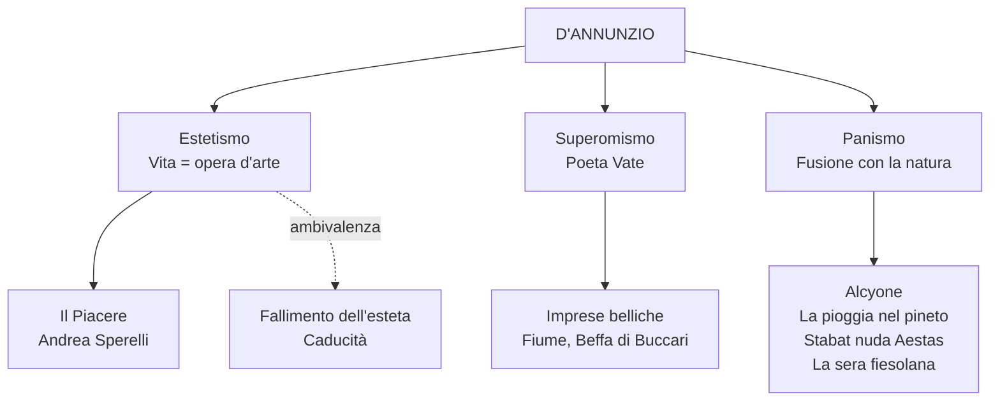

# Gabriele D'Annunzio — Riassunto

---

## Date fondamentali

| Anno | Evento |
|------|--------|
| **1863** | Nasce a Pescara |
| **1879** | Prima raccolta poetica, *Primo vere* |
| **1881-1891** | Periodo romano: *Canto novo*, matrimonio con Maria Hardouin di Gallese |
| **1889** | Pubblica *Il Piacere* |
| **1894** | Primo incontro con Eleonora Duse |
| **1903** | *Alcyone* (terzo libro delle *Laudi*), contenente *La pioggia nel pineto* |
| **1910-1915** | Esilio in Francia per debiti |
| **1915** | Rientro in Italia, interventismo, partecipazione alla guerra |
| **1916** | Ferito all'occhio; compone il *Notturno* |
| **1918** | Beffa di Buccari; Volo su Vienna |
| **1919** | Occupa Fiume; conia l'espressione "vittoria mutilata" |
| **1921-1938** | Si ritira al Vittoriale degli Italiani, sul Lago di Garda |
| **1 marzo 1938** | Muore di emorragia cerebrale |

---

## 1. Biografia

### Origini e formazione

D'Annunzio nasce a Pescara nel 1863, due anni dopo l'Unità d'Italia. Cresce in una famiglia agiata, accudito dalla madre e dalle sorelle che lo trattano "come un principe". A undici anni entra al prestigioso Liceo Cicognini di Prato, dove pubblica giovanissimo la prima raccolta poetica *Primo vere*. La prima fase della sua produzione segue un gusto vicino al **Verismo**, legato all'Abruzzo aspro e rurale.

### Roma e l'ascesa (1881-1891)

Si trasferisce a Roma nel 1881 e viene incantato dalla "Roma Bizantina" — non la Roma classica dei Cesari, ma la Roma decadente e barocca. Scrive per la *Cronaca Bizantina* e *La Tribuna*. Sposa la duchessina Maria Hardouin di Gallese con una fuga d'amore organizzata ad arte, con tutti i giornali avvertiti. Avranno tre figli, ma la vita domestica lo opprime. Nel 1889 pubblica *Il Piacere*, il romanzo della consacrazione.

### Eleonora Duse e il periodo toscano

La relazione con Eleonora Duse, "la divina" del teatro internazionale, inizia nel 1894 a Venezia. Si stabiliscono alla Capponcina (Settignano, vicino Firenze). In questo periodo — il più prolifico — compone le *Laudi* e l'*Alcyone* (1903), l'estate versiliese ispira *La pioggia nel pineto*. La relazione si spezza quando D'Annunzio la ritrae spietatamente ne *Il Fuoco* e la tradisce con altre donne.

### Esilio, guerra e imprese

Sommerso dai debiti, fugge in Francia nel 1910. Rientra nel 1915 come interventista e partecipa alla Prima guerra mondiale da soldato. Ferito all'occhio, si autodefinisce **"l'Orbo Veggente"** e compone il *Notturno* su striscioline di carta. Compie la **Beffa di Buccari** (1918), il **Volo su Vienna** (1918) e occupa **Fiume** (1919) rischiando di provocare un nuovo conflitto mondiale. Conia l'espressione **"vittoria mutilata"**.

### Il Vittoriale e la morte

Dal 1921 si ritira al **Vittoriale degli Italiani** sul Lago di Garda, trasformando una cascina in un monumento a se stesso: un horror vacui di tendaggi, arazzi, cimeli di guerra, 900 oggetti nel solo bagno. I rapporti con Mussolini sono ambigui — D'Annunzio accetta le gratificazioni del regime ma mantiene un distacco. Mussolini diceva: "D'Annunzio è come un dente guasto: o lo si estirpa o lo si copre d'oro". Muore il 1 marzo 1938 di emorragia cerebrale al tavolo da lavoro.

---

## 2. La poetica

### Estetismo

L'estetismo è la corrente che attraversa soprattutto *Il Piacere*: la **vita come opera d'arte**. Si fonda sul rifiuto della democrazia per ragioni estetiche (il "grigio diluvio democratico" sommerge le cose belle), sull'esaltazione del piacere dei sensi, sull'ideale di un **vivere inimitabile** e aristocratico. D'Annunzio stesso vive questi principi: detta le mode, lancia prodotti (La Rinascente, la penna Aurora, l'Aurum), scrive didascalie per il cinema (*Cabiria*, 1914).

### Superomismo

Nasce dalla lettura (piuttosto superficiale) di Nietzsche. Il poeta è **Vate**: ha il compito di rivelare alle folle il vero significato dell'esistenza, rovesciando l'impotenza in onnipotenza attraverso l'esaltazione della lotta e del dominio. Si colloca ai vertici della gerarchia sociale.

### Panismo

Dal greco *pan* = "tutto". È il **processo di fusione estatica tra il poeta e la natura**, attraverso un duplice movimento di metamorfosi: l'**arborizzazione dell'essere umano** (Ermione "par da scorza tu esca") e l'**antropomorfizzazione della natura** (le gocce di pioggia come "innumerevoli dita"). È al centro dell'*Alcyone*.

### Vitalismo e altri elementi

La poetica include anche l'**irrazionalismo** (conoscenza attraverso i sensi), il **vitalismo** (adesione a tutti gli aspetti della vita al di là del bene e del male), l'esaltazione dell'io (Santagata parla di **"gigantismo dell'io"** in contrapposizione al "piccolo io" di Pascoli), il mito del barbarico e del primitivo.

### L'ambivalenza

Tratto cruciale: non c'è mai una celebrazione *tout court* del vitalismo. Accanto all'esaltazione c'è sempre il senso della **caducità**: "ogni fuggevole forma, ogni grazia caduca, ogni apparenza nell'ora breve". La parabola di Andrea Sperelli mostra come l'estetismo conduca al fallimento esistenziale.

---

## 3. *Il Piacere* (1889)

Romanzo della fase estetica, pubblicato lo stesso anno di *Mastro-don Gesualdo*. Il protagonista **Andrea Sperelli** è l'alter ego di D'Annunzio: un conte che fa della vita un'opera d'arte nella Roma barocca. Il padre gli trasmette la massima fondamentale: **"Bisogna fare la propria vita come si fa un'opera d'arte"** e il principio latino **"Habere non haberi"** (possedere, non essere posseduti).

Due figure femminili incarnano l'ideale amoroso: **Elena Muti** (Eros, passione) e **Maria Ferres** (amore puro). Andrea sogna di riunire sensualità e purezza, ma pronunciando il nome di Elena mentre è con Maria, distrugge tutto. Il romanzo si chiude all'asta dei beni di Maria: Andrea si congeda dalla vita di esteta, ormai condotta al fallimento.

La lingua è **aulica, forbita, erudita**, piena di riferimenti alla storia dell'arte — agli antipodi del linguaggio di Verga.

---

## 4. Le poesie dell'Alcyone

### *Canta la gioia* (da *Canto novo*)

Manifesto dell'ideale estetico: invocazione a celebrare "l'immensa gioia di vivere, d'esser forte, d'esser giovane". Esaltazione di tutti i sensi. La donna è chiamata "Ospite" — un **senhal** dalla lirica provenzale. Emerge però la consapevolezza della brevità: "ogni fuggevole forma, ogni grazia caduca". Chi vive nel dolore è "un misero schiavo".

### *La pioggia nel pineto* (1903)

La lirica più celebre di D'Annunzio, il più alto esempio di **panismo**. L'io lirico passeggia con **Ermione** nella pineta versiliese sotto la pioggia. L'intera poesia riproduce il ritmo della pioggia attraverso allitterazioni, rime interne, onomatopee ("crepitìo", "crosciare").

Struttura: "Taci" → "Ascolta" → "Odi?" → la metamorfosi panica. La pioggia cade su tamerici, pini, mirti (sacri a Venere), ginestre, ginepri. Le gocce sono "innumerevoli dita" che suonano strumenti diversi (**antropomorfizzazione**). I due amanti vivono "d'arborea vita" (**arborizzazione**). Ermione diventa "virente", sembra uscire dalla scorza degli alberi. Ogni parte del corpo è assimilata alla natura: cuore-pesca, occhi-polle, denti-mandorle. La "favola bella" è l'amore illusorio.

### *Stabat nuda Aestas*

L'estate personificata come una figura femminile divina che il poeta insegue in una "caccia amorosa" attraverso una natura afosa (aghi arsi, aria che "estuava", cicale mute, resina che stilla). La raggiunge nel bosco degli ulivi (immagine sacra recuperata in chiave estetica), la donna cade distesa tra sabbie e acque — il congiungimento è suggerito, non esplicitato. È il testo del **"gigantismo dell'io"** secondo Santagata.

### *La sera fiesolana*

Tre strofe più ritornello ("Laudata sii o sera") dal *Cantico delle Creature* di San Francesco, recuperato in chiave estetica. Ambientata nella campagna fiesolana in **primavera**. Non c'è un nucleo narrativo: solo suggestioni paesaggistiche e la smaterializzazione degli elementi (le foglie diventano fruscio). La sera è personificata come figura femminile con "viso di perla" e "grandi umidi occhi". La terza strofa promette una rivelazione ("Io ti dirò...") che però non arriva mai.

---

## 5. Confronto D'Annunzio-Pascoli

| Aspetto | Pascoli | D'Annunzio |
|---------|---------|------------|
| L'io | "Piccolo io" | "Gigantismo dell'io" |
| Il poeta | Fanciullino | Vate, superuomo |
| Tono | Malinconico, intimo | Esaltato, vitalistico |
| Natura | Misteriosa, inquietante | Luogo di fusione panica |
| Temi | Morte, lutto, nido | Piacere, eros, forza |
| Linguaggio | Sperimentale, umile | Aulico, forbito, erudito |

---

## 6. Collegamenti

- **Oscar Wilde**: Andrea Sperelli = Dorian Gray italiano
- **Nietzsche**: superomismo (interpretazione superficiale)
- **Baudelaire**: corrispondenze segrete della natura
- **San Francesco**: "Laudata sii" recuperato in chiave estetica
- **Futurismo**: esaltazione della forza, interventismo, nazionalismo; Marinetti a Fiume
- **Fascismo**: il regime attinge dal repertorio dannunziano (motti, rituali, saluto)
- **Ungaretti**: la guerra vista dall'alto (D'Annunzio, eroismo) vs. dal basso (Ungaretti, sofferenza)
- **Montale**: parodia della *Pioggia nel pineto* in *Piove* (1971)

