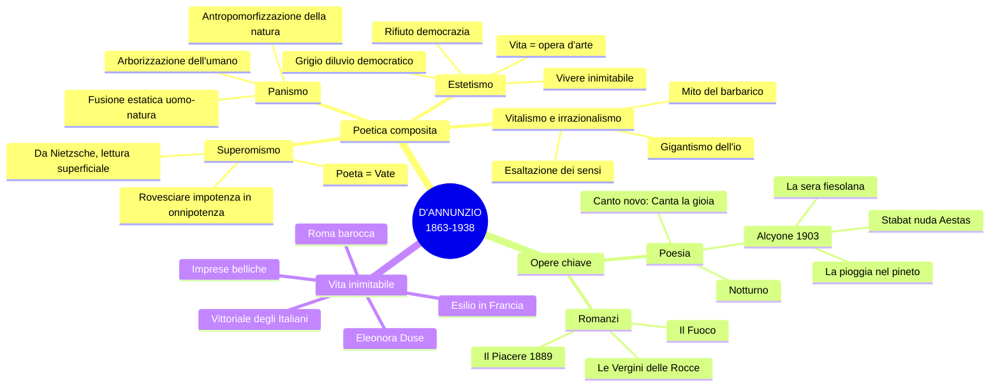

# Gabriele D'Annunzio — Ripasso veloce

---

## Mappa riepilogativa generale



---

## Biografia in pillole

**Pescara 1863** → famiglia agiata, Abruzzo aspro → **Liceo Cicognini di Prato** (1874) → *Primo vere* a 16 anni.

**Roma 1881-1891**: cronista mondano, sposa la duchessina Maria Hardouin di Gallese (fuga d'amore sui giornali), pubblica *Canto novo*, scrive *Il Piacere* (1889) — stesso anno di *Mastro-don Gesualdo*.

**Periodo toscano**: relazione con **Eleonora Duse** (dal 1894), villa della Capponcina. Produce le **Laudi** e l'**Alcyone** (1903). Vita lussuosa, debiti enormi.

**Francia 1910-1915**: "esilio volontario" (in realtà fuga dai creditori). *Le Martyre de Saint Sébastien* (musicato da Debussy, messo all'indice dal Vaticano).

**Guerra 1915-1918**: interventista appassionato. Ferito all'occhio → **"Orbo Veggente"** → compone il *Notturno* su striscioline di carta. **Beffa di Buccari** (MAS = "Memento Audere Semper"), **Volo su Vienna** (volantini), conia **"vittoria mutilata"**.

**Fiume 1919**: occupa la città con i legionari, fonda la Reggenza del Carnaro. Natale di sangue 1920.

**Vittoriale 1921-1938**: villa-monumento sul Lago di Garda. Horror vacui, cimeli, Stanza della Cheli. Rapporto ambiguo con Mussolini ("D'Annunzio è come un dente guasto: o lo si estirpa o lo si copre d'oro"). Ultimi anni: cocaina, deperimento. **Muore il 1 marzo 1938** al tavolo da lavoro.

---

## La poetica — Concetti chiave

**Estetismo** = la vita come opera d'arte. Rifiuto della democrazia per ragioni estetiche ("grigio diluvio democratico"). Ideale aristocratico, elitario. Piacere dei sensi. Vivere inimitabile.

**Superomismo** = il poeta è Vate, rivela verità superiori. Si erge sopra la massa. Derivato da Nietzsche (interpretazione superficiale). Volontà di potenza, esaltazione della lotta.

**Panismo** = fusione estatica uomo-natura. Doppia metamorfosi: **arborizzazione** dell'umano + **antropomorfizzazione** della natura. Esempio massimo: *La pioggia nel pineto*.

**Ambivalenza** = mai celebrazione pura del vitalismo. Sempre presente il senso della caducità, del fallimento, della morte. "Ogni fuggevole forma, ogni grazia caduca."

**Stile** = linguaggio aulico, forbito, erudito. Fonosimbolismo. Lessico botanico ricercato. Poesia di **secondo grado** (letteratura fatta di altra letteratura).

---

## Opere — Cosa sapere

### *Il Piacere* (1889)

- Protagonista: **Andrea Sperelli** = alter ego di D'Annunzio, esteta nella Roma barocca
- Massima: **"Bisogna fare la propria vita come si fa un'opera d'arte"**
- *Habere non haberi*: possedere, non essere posseduti
- Due donne: **Elena Muti** (Eros) e **Maria Ferres** (amore puro)
- Lapsus fatale: pronuncia il nome di Elena con Maria → fallimento
- L'asta finale = congedo dalla vita di esteta
- Lingua aulica, erudita, piena di riferimenti storico-artistici — opposta a Verga

### *La pioggia nel pineto* (Alcyone, 1903)

- Passeggiata con **Ermione** nella pineta versiliese sotto la pioggia
- Trama musicale che riproduce il ritmo della pioggia
- "Taci" → "Ascolta" → "Odi?" → metamorfosi panica
- Pioggia su: tamerici, pini, **mirti divini** (sacri a Venere), ginestre, ginepri
- Gocce = "innumerevoli dita" su strumenti diversi → **antropomorfizzazione**
- "D'arborea vita viventi" → **arborizzazione**
- "Par da scorza tu esca" — Ermione esce dalla corteccia
- "La favola bella che ieri t'illuse, che oggi m'illude" — l'amore illusorio
- Figlia dell'aria = cicala; figlia del limo = rana

### *Stabat nuda Aestas* (Alcyone)

- L'estate personificata come divinità femminile
- Caccia amorosa: il poeta insegue, la raggiunge nel bosco degli ulivi (immagine sacra in chiave estetica)
- Lei cade, lui la raggiunge → congiungimento suggerito
- Santagata: esempio del **"gigantismo dell'io"**
- Intreccio di vista, udito, olfatto

### *La sera fiesolana* (Alcyone)

- Campagna toscana in primavera, nessun nucleo narrativo
- Ritornello **"Laudata sii o sera"** dal *Cantico delle Creature* (recupero estetico, non religioso)
- Prima strofa: 14 versi = 1 unico periodo (ipotassi magistrale)
- Sera personificata: "viso di perla", "grandi umidi occhi"
- "Io ti dirò..." → rivelazione promessa ma mai data
- Smaterializzazione degli elementi (foglie → fruscio)
- "Fratelli ulivi" = linguaggio francescano

### *Canta la gioia* (Canto novo)

- Manifesto del vitalismo dannunziano
- "Ospite" = **senhal** dalla lirica provenzale
- Esaltazione di tutti i sensi: mordere, toccare, ascoltare, guardare
- Ambivalenza: "ogni grazia caduca, ogni apparenza nell'ora breve"

---

## Confronto Pascoli-D'Annunzio

```mermaid
flowchart LR
    A[PASCOLI] --- B["Piccolo io"<br/>Fanciullino<br/>Morte, lutto, nido<br/>Malinconia<br/>Linguaggio sperimentale]
    C[D'ANNUNZIO] --- D["Gigantismo dell'io"<br/>Vate superuomo<br/>Piacere, eros, forza<br/>Esaltazione vitalistica<br/>Linguaggio aulico"]
    A ---|fondano il<br/>Novecento poetico| C
```

---

## Collegamenti rapidi

| Collegamento | Cosa dire |
|-------------|-----------|
| **Oscar Wilde** | Andrea Sperelli = Dorian Gray italiano |
| **Nietzsche** | Superomismo, lettura superficiale dell'oltreuomo |
| **Baudelaire** | Corrispondenze segrete, natura misteriosa |
| **San Francesco** | "Laudata sii" recuperato in chiave estetica |
| **Futurismo** | Condividono forza, audacia, interventismo; Marinetti a Fiume |
| **Fascismo** | Motti, rituali, saluto fascista derivati da D'Annunzio |
| **Ungaretti** | Guerra: D'Annunzio (eroismo) vs. Ungaretti (sofferenza) |
| **Montale** | *Piove* (1971) = parodia della *Pioggia nel pineto* |
| **Verga** | Stesso anno (1889): *Il Piacere* vs. *Mastro-don Gesualdo* — lingue opposte |

---

## D'Annunzio influencer

- **La Rinascente** — nome del grande magazzino
- **Penna Aurora** — logo e nome
- **Aurum** — liquore
- **Automobile** — la parola, declinata al femminile
- **Cabiria** (1914) — didascalie del film, cinema come settima arte
- **"Eia Eia Alalà"**, **"Memento Audere Semper"** — motti poi fascisti
