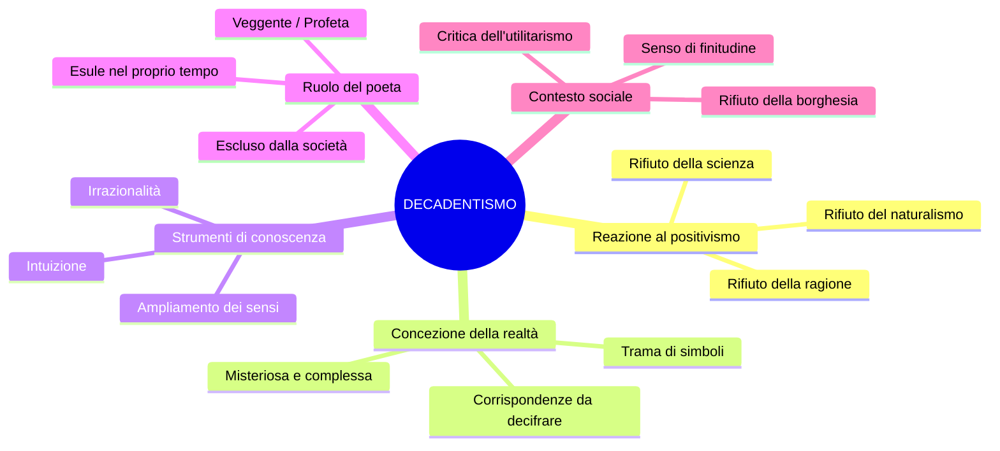
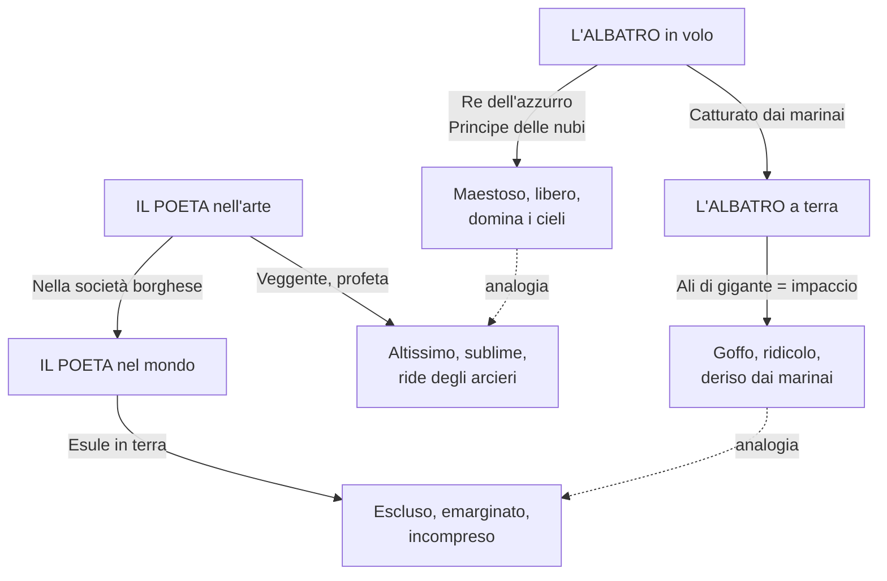
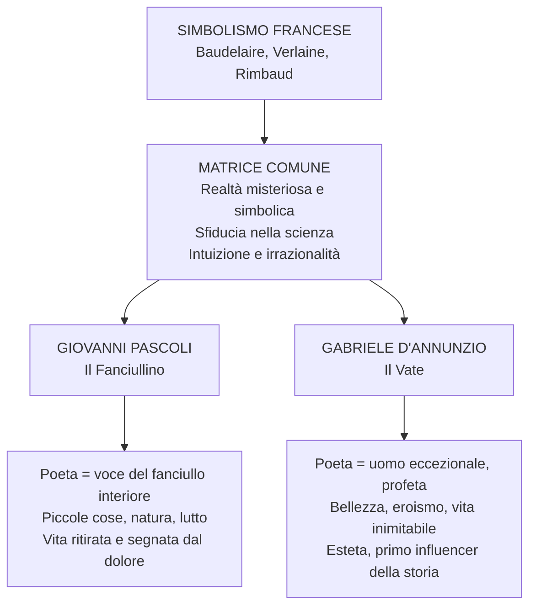
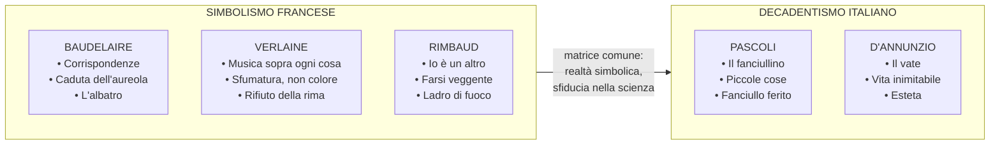

# Decadentismo e Simbolismo — Studio completo

---

## Date e riferimenti fondamentali

| Anno / Periodo | Evento |
|----------------|--------|
| **1857** | Baudelaire pubblica *I fiori del male* (*Les Fleurs du mal*), con il sonetto *Corrispondenze* |
| **Anni '60-'70 dell'800** | Baudelaire scrive *Lo Spleen di Parigi* (raccolta in prosa, contiene *La caduta dell'aureola*) |
| **1874** | Verlaine scrive *Arte poetica* (*Ars poetica*) |
| **Anni '80 dell'800** | Il decadentismo si afferma come fase storico-letteraria in Francia e poi in Italia |
| **1854-1891** | Vita di Arthur Rimbaud (muore a 37 anni a Marsiglia) |
| **Fine '800 - inizio '900** | Pascoli e D'Annunzio portano il decadentismo in Italia |

---

## 1. Il Decadentismo: caratteri generali

### 1.1 Una reazione al positivismo e al naturalismo

Il decadentismo è una fase storico-letteraria che inizia intorno agli **anni Ottanta dell'Ottocento**. Per comprenderne la portata bisogna partire da ciò a cui si oppone: il naturalismo e il verismo, cioè quella tradizione che riponeva piena fiducia nel fatto che la realtà fosse conoscibile attraverso gli strumenti della **ragione** e della **scienza**. Secondo Zola il romanzo doveva essere sperimentale, al pari del lavoro dello scienziato in laboratorio; l'uomo stesso era indagabile con metodo scientifico, come qualsiasi altro oggetto della realtà.

Il decadentismo rovescia completamente questa prospettiva. Sul piano socio-economico si configura come un momento di **rifiuto della società borghese e della sua normalità**: una società tutta volta all'utile, al profitto, al progresso materiale e disinteressata a ciò che non produce un guadagno — ovvero l'arte e la poesia. Sul piano culturale e letterario, è un **moto di reazione al naturalismo e al positivismo**, e dunque al primato della ragione.

Se non è la ragione a conoscere la realtà, che cosa rimane? L'**irrazionalità**, l'**intuizione**, l'**illuminazione**. La realtà non si fotografa: si decifra.

### 1.2 Una concezione della realtà misteriosa e simbolica

Per i decadenti la realtà è **misteriosa**, **illusoria** e **complessa**. Non è trasparente, non si offre all'osservazione diretta: è una **trama di corrispondenze simboliche** che deve essere decifrata. Ciò che appare — la realtà fenomenica, dal greco *phainomai*, "apparire" — non è che la superficie. Sotto di essa si nasconde una dimensione profonda, accessibile soltanto attraverso l'ampliamento dei sensi, l'intuizione, l'esperienza irrazionale.

> [!note] Dalla lezione
> La professoressa ha posto la domanda alla classe: «Se non è la ragione, se non è la razionalità, che cosa rimane per conoscere la realtà?». Uno studente ha risposto «la fede», un altro «l'edonismo». La risposta: «Ma manco per niente. È l'irrazionalità.»

### 1.3 Il senso di esclusione del poeta

In una società borghese improntata al progresso e alla fiducia nel domani, questi poeti rivendicano il loro senso di **esclusione**, di **emarginazione**, di **isolamento**. Non si riconoscono in un mondo che non li comprende, che deride chiunque non produca un utile concreto. L'arte, la poesia, vengono considerate inutili dalla società — e il poeta ne paga il prezzo diventando un estraneo, un esule nel suo stesso tempo.

Questa corrente letteraria, per la sua forte carica soggettiva e la rivalutazione dell'irrazionalità, si lega idealmente al **Romanticismo**: la spinta dell'io, l'attenzione al mistero, alla morte, alla finitudine. Ma il soggettivismo decadente non è quello romantico: non è l'io monolitico di Leopardi che parla del proprio dolore personale con valenza universale. È un io **frantumato**, molteplice, che si scopre "altro" rispetto a se stesso.

### 1.4 I caratteri fondamentali — Sintesi

I tratti che definiscono il decadentismo possono essere riassunti così:

- **Sfiducia nella scienza**: la scienza non spiega la realtà, non ne coglie il mistero
- **Individualismo e soggettivismo**: forte carica soggettiva, rivalutazione dell'io interiore
- **Rivalutazione dell'irrazionalità**: intuizione, illuminazione, disordine dei sensi
- **Rifiuto della società borghese**: marginalità del poeta, critica dell'utilitarismo
- **Senso di finitudine e di morte**: il mistero domina la vita
- **Realtà come trama di simboli**: corrispondenze da decifrare attraverso la poesia

---

## 2. Il Simbolismo francese: i poeti maledetti

### 2.1 Chi sono i poeti maledetti

Il decadentismo italiano prende le mosse da una corrente francese: il **simbolismo**. I suoi protagonisti sono tre poeti — **Charles Baudelaire**, **Paul Verlaine** e **Arthur Rimbaud** — noti come *les poètes maudits*, i **poeti maledetti**. Baudelaire ne è il padre putativo, appartenendo alla generazione precedente; Verlaine e Rimbaud, più giovani, ne incarnano lo spirito più radicale.

Perché "maledetti"? Perché conducono un'esistenza **al di fuori dei canoni borghesi** e confidano nel fatto che la realtà sia conoscibile attraverso un **ampliamento dei sensi** e delle funzioni psichiche. Questo ampliamento si realizza anche attraverso l'uso di **droghe** — in particolare l'oppio e l'assenzio — che consentono di avvicinarsi a quella realtà profonda che non si vede dalla superficie fenomenica. Sono poeti che non esitano a calarsi in tutte le esperienze del dolore, dell'amore, della follia — a sprofondare negli abissi della realtà per riportarne il significato agli uomini.

La definizione stessa di "decadentismo" è recuperata a partire dalla lirica *Languore* di Verlaine, i cui versi di apertura — *«Sono l'impero alla fine della decadenza»* — rimandano a una dimensione di **finitudine e di esaurimento**, segnata dal passaggio dei «grandi barbari bianchi», coloro che hanno determinato la fine di un impero, di una potenza.

> [!note] Dalla lezione
> La professoressa ha aperto la lezione leggendo i versi di *Languore* e chiedendo alla classe se il loro significato si cogliesse attraverso la ragione o l'intuizione. La risposta è stata chiara: «Attraverso l'intuizione.» Questi versi non forniscono un messaggio diretto, non veicolano un insegnamento pratico; sono allusivi, simbolici, e rimandano a una concezione della realtà che va decifrata.

---

## 3. Charles Baudelaire

### 3.1 *Corrispondenze* — Il manifesto della realtà simbolica

Il testo che meglio esemplifica la concezione decadente della realtà è il sonetto *Corrispondenze* di Charles Baudelaire, tratto da *I fiori del male* (*Les Fleurs du mal*, 1857). È il testo fondamentale del simbolismo: rappresenta più di ogni altro la concezione che della realtà propongono i poeti simbolisti.

#### Il testo

> La Natura è un tempio dove pilastri vivi
> mormorano a tratti indistinte parole;
> l'uomo passa lì tra foreste di simboli
> che lo osservano con sguardi familiari.
>
> Come echi che a lungo e da lontano
> tendono a una profonda, tenebrosa unità,
> grande come le tenebre o la luce,
> i profumi, i colori e i suoni si rispondono.
>
> Profumi freschi come la carne d'un bambino,
> dolci come l'oboe, verdi come i prati,
> — e altri d'una corrotta, trionfante ricchezza,
>
> con tutta l'espansione delle cose infinite:
> l'ambra e il muschio, l'incenso e il benzoino,
> che cantano il trasporto della mente e dei sensi.

#### Analisi

La Natura (con la N maiuscola, sinonimo di "realtà" nella sua totalità) è assimilata all'immagine di un **tempio** in cui dei **pilastri vivi mormorano parole indistinte**. La realtà, cioè, è complessa e sembra parlare al pari dell'uomo, ma sussurrando parole **non comprensibili** — parole che devono essere decifrate. L'uomo ne fa parte, ci passa in mezzo: attraversa «foreste di simboli» che lo osservano con «sguardi familiari», che lo riconoscono come parte di loro. I pilastri vivi, le foreste, evocano gli alberi di un tempio naturale in cui tutto comunica, tutto si corrisponde.

La seconda strofa introduce una similitudine: come **echi** che da lontano tendono a una «profonda, tenebrosa unità», tutti i dati sensoriali — profumi, colori e suoni — **si rispondono** tra loro. Il cuore della poesia è qui: la realtà è un'unità misteriosa in cui tutto è collegato, ma questa unità è **tenebrosa**, oscura, non afferrabile con la sola ragione.

Nella terza e quarta strofa Baudelaire dà corpo a questa teoria attraverso una cascata di **sinestesie** — la figura retorica centrale del testo:

| Sinestesia | Dato sensoriale 1 | Dato sensoriale 2 |
|------------|--------------------|--------------------|
| «Profumi freschi come la carne d'un bambino» | Olfattivo (profumi) | Tattile (carne) |
| «Dolci come l'oboe» | Olfattivo (profumi) | Uditivo (oboe) |
| «Verdi come i prati» | Olfattivo (profumi) | Visivo (verdi) |
| «L'ambra e il muschio... che cantano» | Olfattivo (ambra, muschio) | Uditivo (cantano) |

La sinestesia è una figura **evocativa e allusiva** che non presenta un nesso causa-effetto spiegabile razionalmente. È proprio attraverso l'ampliamento delle percezioni sensoriali, qui così insistite, che è possibile accedere al **mistero della realtà** — una realtà costituita da simboli che devono essere decifrati attraverso la poesia.

> [!note] Dalla lezione
> La professoressa ha sintetizzato così il senso del testo: «La realtà è fatta di simboli. È attraverso l'ampliamento delle percezioni sensoriali che è possibile accedere al mistero della realtà. Questa è la sintesi.» Ha poi aggiunto: «La sinestesia è una figura evocativa che non si può spiegare logicamente — e proprio per questo è la figura centrale del simbolismo.»

### 3.2 *La caduta dell'aureola* — Il poeta nella modernità

Baudelaire scrive un testo in prosa contenuto nella raccolta *Lo Spleen di Parigi*. Lo **spleen** (parola inglese) indica uno stato di malinconia, tristezza, noia — una condizione esistenziale ricorrente nella poesia decadente.

Il concetto centrale del testo è la **caduta dell'aureola**: un'espressione che va imparata perché condensa il senso dell'intera riflessione sul ruolo del poeta nella modernità. L'aureola — l'anello di luce che portano sul capo i santi e gli angeli, segno della loro sacralità — è il simbolo del ruolo sacro che il poeta aveva nella tradizione. Baudelaire sostiene che il poeta ha **perso l'aureola**: è diventato un uomo comune, non ha più nulla di sacro da insegnare.

#### Il testo (estratti)

> «Ehi, ma come? Voi qui, carissimo? Voi in un posto malfamato? Voi, il degustatore di quintessenze? Voi, il divoratore di ambrosia? Sul serio, c'è di che stupirsi».

Un avventore — un uomo qualunque — incontra il poeta in un **bordello** mentre si ubriaca, e si stupisce di trovare proprio lui in quel luogo, lui che dovrebbe frequentare il Parnaso e nutrirsi del nettare degli dei. Il Parnaso è il monte sacro alla poesia nell'antica Grecia; l'ambrosia è il nutrimento degli dei. Questa è tutta la cultura classica che circonda la figura del poeta come essere superiore.

> «Mio caro, voi conoscete il terrore che ho dei cavalli e delle carrozze. Poco fa, mentre attraversavo di gran premura il boulevard e saltellavo nella melma in mezzo a questo caos frenetico dove la morte accorre al galoppo da tutte le parti e in un sol tempo, la mia aureola, a un movimento brusco, mi è scivolata di testa nella fanghiglia del macadam».

Il contesto è quello della vita **urbana, frenetica, alienante** di Parigi: i boulevard, i cavalli e le carrozze (oggi diremmo il traffico stradale), il caos. L'aureola scivola nel fango — il segno distintivo della sacralità del poeta finisce nella melma della città moderna.

> «Non ho avuto il coraggio di raccoglierla. [...] Ora posso andarmene in giro in incognito, compiere le azioni più vili [...]. E immagino con gioia che qualche poeta spregevole la raccatterà e impudente se ne acconcerà la testa. Farlo felice, che gioia!»

Il poeta non raccoglie l'aureola: con **ironia** amara rivendica la propria nuova condizione di marginalità. Non è più tenuto a frequentare il Parnaso, dunque può frequentare tutti i luoghi dell'abiezione e del degrado. E se qualche poeta mediocre raccatterà quell'aureola, tanto meglio — sarà comico vederlo pavoneggiarsi con un titolo ormai vuoto.

L'atteggiamento è duplice: da una parte la **critica** alla vacuità della società contemporanea, alla vita cittadina disumana e alienante; dall'altra la **rivendicazione orgogliosa** della propria posizione di marginalità. Il poeta non è più sacro, ma proprio per questo è finalmente libero.

### 3.3 *L'albatro* — Il poeta tra cielo e terra

*L'albatro* è un testo in versi tratto anch'esso da *I fiori del male*. L'albatro — un grande uccello marino simile a un gabbiano — raffigura simbolicamente l'essenza del **nuovo poeta**: **ridicolo** nella vita di tutti i giorni, **altissimo** quando si alza nei cieli dell'arte.

#### Il testo

> Spesso, per divertirsi, i marinai
> prendono degli albatri, grandi uccelli dei mari,
> indolenti compagni di viaggio delle navi
> in lieve corsa sugli abissi amari.
>
> L'hanno appena posato sulla tolda,
> e già il re dell'azzurro, maldestro e vergognoso,
> pietosamente accanto a sé trascina,
> come fossero remi, le grandi ali bianche.
>
> Com'è fiacco e sinistro il viaggiatore alato!
> E comico e brutto, lui prima così bello!
> Chi gli mette una pipa sotto il becco,
> chi imita zoppicando lo storpio che volava.
>
> Il poeta è come lui, principe delle nubi,
> che sta con l'uragano e ride degli arcieri;
> esule in terra tra gli scherni,
> non lo lasciano camminare le sue ali di gigante.

#### Analisi

La poesia si costruisce interamente su un'**analogia** tra l'albatro e il poeta. Nella prima strofa i marinai catturano per divertimento degli albatri, definiti «indolenti» — quasi svogliati, che si abbandonano al cammino della navigazione. L'aggettivo "indolenti" non indica insofferenza ma una sorta di pigra maestosità.

Nella seconda strofa si compie la trasformazione: appena posato sulla **tolda** (il ponte scoperto della nave), il «**re dell'azzurro**» diventa maldestro e vergognoso. Le grandi ali bianche, che gli consentono di dominare i cieli, a terra diventano un **impaccio**: le trascina come fossero remi. L'espressione «re dell'azzurro» è una metafora che indica l'albatro nella sua dimensione di dominio del cielo — e per estensione il poeta nella sua dimensione sublime.

La terza strofa insiste sul contrasto: il «**viaggiatore alato**» è fiacco, sinistro, comico e brutto — lui che prima era così bello. I marinai lo beffano: gli mettono una pipa sotto il becco, imitano zoppicando «lo storpio che volava». È la dimensione dello **scherno**: gli uomini comuni (i marinai) non riconoscono il valore del poeta e anzi lo deridono.

L'ultima strofa rende esplicita l'analogia. Il poeta è come l'albatro: è «**principe delle nubi**», abituato a misurarsi con l'uragano — con tutto ciò che è disturbante, inquietante, misterioso — e ride degli arcieri, si fa beffe di chi lo vuole colpire. Ma sulla terra è un **esule**, un estraneo tra gli scherni. Le sue «**ali di gigante**» — l'immaginazione, l'intelletto, la capacità artistica — non gli consentono di restare nella dimensione bassa e terrena, perché quella che gli appartiene è la dimensione alta, elevata, del cielo.

**Espressioni chiave da ricordare** (metafore del poeta):
- **Re dell'azzurro**: il poeta come dominatore dei cieli
- **Viaggiatore alato**: il poeta come essere in viaggio, dotato di ali
- **Principe delle nubi**: il poeta come figura regale delle altezze

> [!note] Dalla lezione
> La professoressa ha insistito su queste espressioni: «Queste ve le sottolineo perché le dovete imparare.» E ha sintetizzato il messaggio: «Il poeta, come l'albatro, deve coltivare le altezze sublimi dell'arte e non il mondo prosastico del consumo, del guadagno, dell'utile, della fretta, del caos. Perché per natura il poeta è un'altra cosa.»

---

## 4. Paul Verlaine

### 4.1 Vita e personalità

Paul Verlaine condusse una **vita inquieta** e all'insegna della **sregolatezza**. A diciotto anni inizia a bere e contrae il vizio dell'alcolismo, che diventerà la sua rovina. Dalla provincia si trasferisce a Parigi, frequenta scrittori e poeti, e la sua vita diventa sempre più disordinata. Si sposa a circa trent'anni con una diciassettenne dalla quale avrà un figlio, ma nel frattempo intrattiene una corrispondenza epistolare con un giovane poeta, Arthur Rimbaud.

Quando Rimbaud lo raggiunge a Parigi, i due stringono una **relazione molto appassionata** che distrugge la vita familiare di Verlaine. La passione tra i due sfocia anche in grandi conflitti, al punto che Verlaine cerca persino di **uccidere Rimbaud sparandogli**. Per questo viene condannato a due anni di reclusione. Le sue opere entrano nell'antologia de *I poeti maledetti* (*Les Poètes maudits*) e sono una delle pietre miliari della storia della poesia contemporanea.

### 4.2 Poetica: la musicalità del verso

Dal punto di vista della poetica, Verlaine è da ricordare soprattutto per la **musicalità del verso**. Il suo principio fondamentale è espresso nella formula: ***«De la musique avant toute chose»*** — la musica sopra ogni cosa. La musica ha un linguaggio universale, si sottrae ai contenuti specifici e parla a tutti: per questo Verlaine attribuisce un'importanza capitale al **significante**, al suono della parola.

La sua lirica sarà dunque dominata dalle **figure retoriche del suono**: allitterazione, assonanza, consonanza. Verlaine al contrario **rifiuta la rima**, che considera la «morte della poesia»: la rima ingabbia il verso, gli impone una costruzione prestabilita, uno schema che soffoca la libertà espressiva. Allo stesso modo rifiuta la metrica tradizionale — è un rifiuto della tradizione nel suo complesso.

> [!note] Dalla lezione
> Una studentessa ha spiegato così il rifiuto della rima: «Perché le rime non rendono il verso libero, cioè sono qualcosa che dà una costruzione, una forma al verso, già destinata dall'inizio perché c'è uno schema di rime da rispettare.» La professoressa ha confermato: «Certo, perché ingabbia la poesia.»

### 4.3 *Languore* — Il nome del decadentismo

I versi iniziali di *Languore* sono quelli da cui il decadentismo prende il nome: **«Sono l'impero alla fine della decadenza»**. Il poeta si identifica con un impero al suo tramonto, che compone «indolenti acrostici / in uno stile dorato in cui danza il languore del sole». Sono versi composti senza utilità pratica, senza insegnamento, senza denuncia: danzano nel languore. Rimandano a una dimensione di **finitudine e di esaurimento**, un senso di fine che permea tutta la corrente decadente.

### 4.4 *Arte poetica* (1874) — Il manifesto di Verlaine

*Arte poetica* (*Ars poetica*) è il manifesto letterario di Verlaine. Si apre con la dichiarazione programmatica fondamentale e sviluppa punto per punto la sua concezione della poesia. Va tenuto presente che noi leggiamo questi testi in traduzione, e dunque tutta la dimensione della musicalità, del suono, del ritmo non è pienamente verificabile — ma il contenuto resta chiarissimo.

#### Estratti e analisi

**«Musica sopra ogni cosa»** — La poesia-manifesto si apre con questa dichiarazione di poetica assoluta. «E perciò preferisci il ritmo impari, più vago e solubile nell'aria, senza nulla che pesi o che posi.» Il verso deve essere leggero, vago, quasi evanescente: nulla deve pesare o posare, fermarsi.

**«È necessario poi che tu non scelga le tue parole senza qualche svista»** — La scelta delle parole non deve essere troppo precisa, troppo calcolata: deve mantenere un margine di indeterminatezza, di imprecisione voluta.

**«Perché vogliamo ancora la sfumatura, non il colore, sol la sfumatura»** — Questo è un altro verso da memorizzare. La parola poetica non deve **delineare** ma **suggerire**. Solo la sfumatura, solo l'allusione. Siamo ad anni luce dal naturalismo, dove la parola doveva essere fedele alla cosa, rispecchiarla come una fotografia. Qui il poeta vuole solo la sfumatura.

**«Prendi l'eloquenza e torcile il collo»** — Prendi l'arte del bel parlare e uccidila. L'eloquenza costruita nei secoli — con le sue regole, i suoi schemi — deve essere distrutta in nome della libertà espressiva.

**«Oh, chi dirà i torti della rima? [...] quel gioiello da un soldo che suona vuoto e falso sotto la lima?»** — La rima è un gioiello da poco, suona **vuota e falsa** sotto la lima del *labor limae* — quell'espressione latina che indica l'elaborazione stilistica, le rifiniture del testo. La rima è artificiale, meccanica, morta.

**«Musica ancora e sempre! E tutto il resto è letteratura.»** — La chiusura è fulminante. «Tutto il resto è letteratura» significa: tutto il resto è ciò che è stato conosciuto, apprezzato, codificato, che è entrato nel canone — e dunque appartiene a un mondo morto, passato, che deve essere superato. Conta solo la musica.

---

## 5. Arthur Rimbaud

### 5.1 Una vita sregolata e raminga

Arthur Rimbaud (1854-1891) è fin da giovane un ragazzo **ribelle** che invia le proprie prove poetiche a Paul Verlaine. Dopo averne fatto la conoscenza, i due intrecciano una relazione turbolenta, vivendo di espedienti e chiedendo soldi alla madre di Verlaine.

Dopo la rottura — la lite e il ferimento per mano di Verlaine — Rimbaud inizia a **vagabondare a piedi per l'Europa**. In Olanda si arruola nell'esercito coloniale, ma poi diserta. Lavora in un circo, arriva fino in Norvegia. Si trasferisce a Cipro dove lavora come capo cantiere. Infine, nel 1880, si trasforma in **mercante di pelli e di caffè** — abbandonando completamente la poesia.

Nel 1891 viene colpito da violenti dolori al ginocchio: gli viene diagnosticato un cancro e gli viene **amputata la gamba**. Muore qualche mese dopo a Marsiglia, a soli **37 anni**. Una vita assolutamente sregolata e raminga — una biografia che incarna in pieno lo spirito dei poeti maledetti.

### 5.2 *Lettera del veggente* — Il poeta come ladro di fuoco

La *Lettera del veggente* è un testo in prosa che funge da **dichiarazione di poetica** di Rimbaud. Si apre con una delle frasi più celebri della letteratura moderna:

> **«Io è un altro.»**

Questa formula sembra semplice ma è rivoluzionaria. Non si tratta del soggettivismo romantico di Leopardi, dove l'io parla del proprio dolore personale e poi lo carica di valenza universale. Qui Rimbaud dice che l'identità non è univoca, non è monolitica: l'identità di ciascuno è **caos**. L'io non coincide con se stesso — è un altro, è molteplice, è straniero a se stesso.

E aggiunge:

> **«Io dico che bisogna esser veggente, farsi veggente.»**

Il **veggente** è colui che vede ciò che all'uomo comune è negato: il futuro, il mistero, la realtà profonda. Il poeta si muove nella dimensione della **profezia**, in cui tutto può essere rivelato e può risultare vero e falso nello stesso tempo. Il ruolo del poeta è questo: farsi veggente, cogliere nella realtà e negli uomini ciò che altri non vedono.

Come si fa a farsi veggente? Come si fa a vedere oltre, a penetrare il mistero della realtà? Rimbaud risponde:

> **«Il poeta si fa veggente mediante un lungo, immenso e ragionato disordine di tutti i sensi.»**

Attraverso il **disordine di tutti i sensi** — tutte le forme d'amore, di sofferenza, di pazzia — il poeta cerca se stesso e giunge all'ignoto, poiché ha coltivato la sua anima, «già ricca più di qualsiasi altra».

Da questa concezione deriva l'immagine del poeta come **«ladro di fuoco»**, in analogia con Prometeo. Perché ladro di fuoco? Perché il poeta non esita a calarsi in tutte le esperienze del dolore, dell'amore, della follia; non esita a sprofondare nell'**abisso della realtà**, anche nelle sue parti più inquietanti. In questo modo attinge a una verità profonda, coglie i simboli della realtà — e ne porta il significato agli uomini, così come Prometeo rubò il fuoco agli dei per consegnarlo agli uomini.

> [!note] Dalla lezione
> La professoressa ha ripetuto il concetto due volte perché una studentessa aveva chiesto di riformularlo: «Il poeta non esita a calarsi in tutte le esperienze del dolore, dell'amore, della pazzia, non esita a calarsi nell'abisso della realtà, anche nelle sue parti più inquietanti. E in questo modo attinge a una verità, coglie i simboli della realtà e ne porta il significato agli uomini, così come Prometeo ha rubato il fuoco agli dei per consegnarlo agli uomini.»

### 5.3 *Vocali* — Sinestesia radicale

*Vocali* è uno dei testi più noti di Rimbaud, in cui il poeta **associa suoni e colori in assoluta libertà**, quasi a riprodurre attraverso la poesia il linguaggio profondo e misterioso della realtà.

#### Il testo

> **A nera, E bianca, I rossa, U verde, O blu.**
> Vocali. Io dirò un giorno i vostri ascosi nascimenti.
>
> **A**, nero vello al corpo delle mosche lucenti
> che ronzano al di sopra dei crudeli fetori, golfi d'ombra.
>
> **E**, candori di vapori e di tende,
> lance di ghiaccio, brividi di umbelle, bianchi re.
>
> **I**, porpore, rigurgito di sangue, labbra belle
> che ridono di collera, di ebrezza penitente.
>
> **U**, cicli, vibrazioni sacre dei mari viridi,
> quiete di bestie al pascolo, quiete delle ampie rughe
> che alle fronti studiose imprime l'alchimia.
>
> **O**, la suprema tuba piena di stridi strani,
> silenzi attraversati dagli angeli e dai mondi.
> O, l'omega e il raggio violetto dei suoi occhi.

#### Analisi

Il principio è enunciato nel primo verso con una semplicità disarmante: a ciascuna vocale viene associato un colore. **A nera, E bianca, I rossa, U verde, O blu.** È un'associazione che non ha alcun fondamento logico — la O non è "blu" in nessun senso razionale — ma è proprio questa libertà assoluta a costituire il senso del testo.

Per ogni vocale, Rimbaud costruisce poi una rete di **analogie ardite** e sinestesie:

| Vocale | Colore | Immagini associate | Sensi coinvolti |
|--------|--------|-------------------|-----------------|
| **A** | Nera | Corpo delle mosche lucenti, crudeli fetori, golfi d'ombra | Vista, olfatto |
| **E** | Bianca | Candori di vapori, lance di ghiaccio, brividi di umbelle (infiorescenze), bianchi re | Vista, tatto |
| **I** | Rossa | Porpore, rigurgito di sangue, labbra belle, collera, ebrezza | Vista, sensazione fisica |
| **U** | Verde | Mari viridi, quiete di bestie al pascolo, fronti studiose | Vista, udito |
| **O** | Blu | Suprema tuba, stridi strani, silenzi, angeli e mondi, omega | Udito, vista |

La poesia non si può afferrare razionalmente: è tutta basata su aspetti **fonetici**, **musicali** e **sinestetici**. È una fitta trama di sinestesie con associazioni fantasiose e immaginifiche. Questi sono i simboli di cui parlano i poeti maledetti: simboli che devono essere decifrati attraverso la poesia, non attraverso la ragione.

> [!note] Dalla lezione
> La professoressa ha chiesto alla classe se la poesia si potesse comprendere razionalmente: «Noi la possiamo afferrare razionalmente questa poesia? Eh, insomma. È tutta basata su aspetti fonetici, musicali e sugli aspetti sinestetici della realtà.»

---

## 6. Dal simbolismo francese al decadentismo italiano: Pascoli e D'Annunzio

### 6.1 Due figure agli antipodi?

I due maggiori rappresentanti del decadentismo italiano in poesia sono **Giovanni Pascoli** e **Gabriele D'Annunzio**. A prima vista sembrano agli antipodi: per biografia, per temperamento, per poetica. In realtà — e questo è il punto fondamentale — condividono la stessa **matrice decadente**, la stessa concezione della realtà che abbiamo visto nei simbolisti francesi.

Entrambi partono dallo stesso presupposto: la **sfiducia nella scienza**, la convinzione che la realtà non si conosca attraverso la ragione, gli esperimenti, le cause e gli effetti, ma attraverso l'**intuizione**, l'**illuminazione**, l'**irrazionalità** — che consentono di cogliere quei nessi simbolici che sono da decifrare. La realtà per entrambi è **misteriosa**, **complessa**, **allusiva**. Però gli esiti a cui arrivano sono opposti.

### 6.2 Giovanni Pascoli — Il fanciullino

#### La poetica

La poetica di Pascoli è incentrata sulla figura del **fanciullino**. Secondo Pascoli, è poeta solo colui che anche da adulto riesce a sentire cristallina e limpida dentro di sé la voce del proprio **fanciullino interiore**. Il fanciullo, a differenza dell'adulto, conosce la realtà come una **scoperta**, rimanendone ogni volta meravigliato e stupito. Questa capacità di guardare il reale ogni volta come se fosse nuovo è propria del fanciullo e viene a smarrirsi con il passare del tempo, condizionata dall'educazione, dalle convenzioni sociali.

Ma il fanciullino di Pascoli non è un fanciullo gioioso e vitale come quello di Leopardi. È un **fanciullo ferito**, angosciato, turbato, ripiegato su se stesso — segnato dal lutto che ha devastato la sua infanzia. La poetica pascoliana è fatta essenzialmente di **piccole cose**, di oggetti umili che risultano straordinari perché osservati attraverso gli occhi del fanciullino: il mondo contadino, la flora e la fauna della Romagna, la vita rurale tra la collina e il mare.

> [!note] Dalla lezione
> La professoressa ha definito la condizione che pervade l'intera vita e opera di Pascoli: quella di **orfano**. «La vicenda che lo segna di più è sicuramente la morte del padre, quando Pascoli ha dodici anni. Lo segna a tal punto che la critica letteraria, studiando la sua opera, interpreta tutta la produzione di Pascoli come una sorta di tentativo di rielaborazione del lutto.»

#### Biografia essenziale

Pascoli nasce a **San Mauro Pascoli**, tra Cesenatico e Rimini, in Romagna. La Romagna ritorna frequentemente nella sua poesia: i campi, il lavoro agricolo, il mondo contadino (scrisse persino un'ode alla piadina). Conduce una vita molto **ritirata** a partire dall'infelicissima infanzia.

L'evento spartiacque è la **morte del padre**, ucciso in un agguato di notte in circostanze misteriose, i cui colpevoli rimasero impuniti e sconosciuti, mentre stava tornando a casa dalla famiglia. Pascoli ha dodici anni. L'anno dopo muore la madre, poi una sorella, un fratello — una serie di lutti in successione che segnerà tutta la sua esistenza e la sua produzione poetica.

La morte del padre torna, ad esempio, nella celeberrima poesia **X Agosto**: il padre fu assassinato la notte di San Lorenzo.

Dal punto di vista ideologico, Pascoli è inizialmente vicino al **socialismo** (seguace di Andrea Costa), per il quale viene anche incarcerato a Bologna. In seguito si avvicina al **nazionalismo**.

I temi fondamentali della sua poesia:
- La **natura** (il paesaggio romagnolo, la vita rurale)
- Il **lutto** e la **morte** (la perdita del padre, della madre)
- La **perdita** e l'**abbandono** (la condizione di orfano)
- Le **piccole cose** osservate con lo sguardo del fanciullino

### 6.3 Gabriele D'Annunzio — Il Vate

#### La poetica

Se la poetica di Pascoli ruota attorno al fanciullino ferito, quella di D'Annunzio ruota attorno a una figura opposta: il **vate**. Quattro lettere che indicano un uomo di straordinarie capacità, che riesce a vedere ciò che gli altri non vedono, che si erge al di sopra dell'uomo comune, che conduce una **vita inimitabile**. Il vate è un profeta, un essere eccezionale — tutto il contrario della modestia umile del fanciullino.

D'Annunzio è un **esteta**: vuole fare della vita un'opera d'arte. La sua poetica è fatta di bellezza, di eroismo, di grandezza. I suoi temi: gli amori, il bello, la lotta. La sua ambizione è quella di vivere in modo eccezionale e di trasfigurare questa eccezionalità nella poesia.

> [!note] Dalla lezione
> La professoressa ha definito D'Annunzio «il primo influencer della storia». Un uomo che partecipa attivamente alle vicende del suo tempo — occupò Fiume con un esercito, fondò la Reggenza del Carnaro, fu poeta soldato — e che propone un'immagine di sé eroica, fuori dal comune, adornandosi di donne sublimi come l'attrice di teatro drammatico Eleonora Duse.

#### Biografia essenziale

D'Annunzio è l'opposto di Pascoli anche nella biografia: non è un uomo ritirato ma un **protagonista assoluto** della scena pubblica. È un poeta soldato, un uomo d'azione, un seduttore. Tra le sue imprese più clamorose, l'**occupazione di Fiume** dopo la Prima Guerra Mondiale, dove fondò la Reggenza del Carnaro con un esercito personale. Tra le sue relazioni più celebri, quella con **Eleonora Duse**, la più grande attrice di teatro drammatico dell'inizio del Novecento.

### 6.4 Il fanciullino e il vate: la matrice comune

Nonostante le differenze apparentemente inconciliabili, Pascoli e D'Annunzio **condividono la stessa radice decadente**. Entrambi rifiutano il positivismo, entrambi credono che la realtà sia misteriosa e simbolica, entrambi la indagano attraverso l'intuizione e l'irrazionalità — non attraverso la ragione e la scienza. La concezione della realtà è la stessa di Baudelaire in *Corrispondenze*: una trama di simboli da decifrare.

Ciò che li differenzia è il **modo di rispondere** a questa concezione:

| Aspetto | Pascoli | D'Annunzio |
|---------|---------|------------|
| **Figura del poeta** | Il fanciullino (voce interiore, ferita) | Il vate (profeta, essere eccezionale) |
| **Atteggiamento** | Ripiegamento su di sé, vita ritirata | Esaltazione eroica, vita inimitabile |
| **Temi** | Piccole cose, natura, lutto, perdita | Bellezza, eroismo, amori, lotta |
| **Biografia** | San Mauro Pascoli, Romagna, lutti familiari | Fiume, Eleonora Duse, poeta soldato |
| **Sguardo sulla realtà** | Dal basso, attraverso le cose umili | Dall'alto, attraverso la grandezza |
| **Matrice comune** | Decadentismo: realtà misteriosa, sfiducia nella scienza, intuizione | Idem |

---

## 7. Schema riassuntivo delle poetiche

---

## 8. Concetti chiave da ricordare per l'esame

### Espressioni fondamentali

| Espressione | Autore | Significato |
|-------------|--------|-------------|
| **Caduta dell'aureola** | Baudelaire | Perdita della sacralità del poeta nella modernità |
| **Re dell'azzurro / Principe delle nubi / Viaggiatore alato** | Baudelaire | Metafore del poeta come essere sublime ma escluso |
| **Esule in terra** | Baudelaire | Il poeta come estraneo nella società borghese |
| **De la musique avant toute chose** | Verlaine | La musica sopra ogni cosa — primato del suono |
| **Sol la sfumatura** | Verlaine | La parola deve suggerire, non definire |
| **Tutto il resto è letteratura** | Verlaine | Ciò che è codificato nel canone è morto |
| **Io è un altro** | Rimbaud | L'identità è caos, non è univoca |
| **Farsi veggente** | Rimbaud | Il poeta deve vedere ciò che è negato all'uomo comune |
| **Lungo, immenso e ragionato disordine di tutti i sensi** | Rimbaud | Il metodo per accedere alla verità profonda |
| **Ladro di fuoco** | Rimbaud | Il poeta come Prometeo che porta la verità agli uomini |
| **Il fanciullino** | Pascoli | La voce interiore innocente che è la vera poesia |
| **Il vate** | D'Annunzio | Il poeta come profeta e uomo eccezionale |

### Figure retoriche centrali

- **Sinestesia**: fusione di campi sensoriali diversi (olfattivo-tattile, olfattivo-uditivo, olfattivo-visivo) — figura chiave del simbolismo, evocativa e non razionale (cfr. *Corrispondenze*, *Vocali*)
- **Analogia**: accostamento di immagini senza nesso logico esplicito (cfr. le associazioni di *Vocali*)
- **Allitterazione, assonanza, consonanza**: figure del suono, centrali nella poetica di Verlaine

### Opposizioni fondamentali

| Positivismo / Naturalismo | Decadentismo / Simbolismo |
|---------------------------|---------------------------|
| Ragione, scienza | Irrazionalità, intuizione |
| Realtà conoscibile, trasparente | Realtà misteriosa, da decifrare |
| Parola = fotografia del reale | Parola = allusione, sfumatura |
| Romanzo sperimentale (Zola) | Poesia simbolica, musicalità |
| Fiducia nel progresso | Senso di finitudine e crisi |
| Poeta inserito nella società | Poeta escluso, esule, maledetto |
