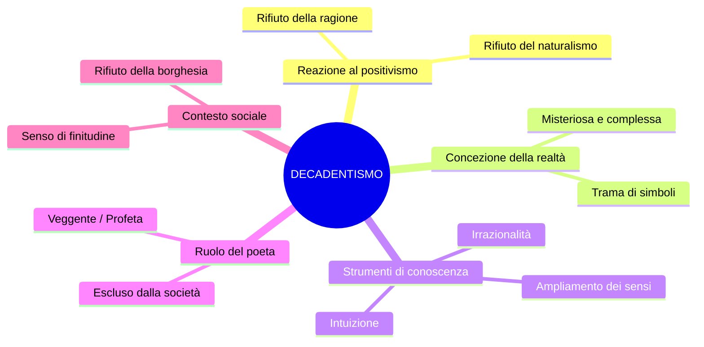
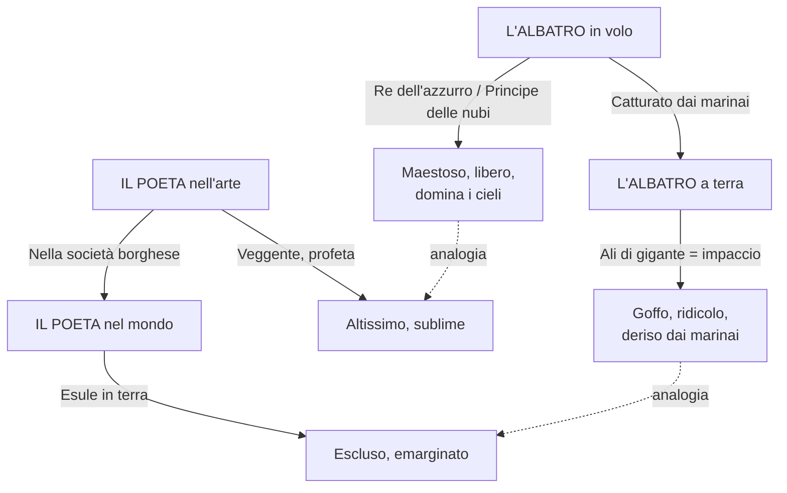
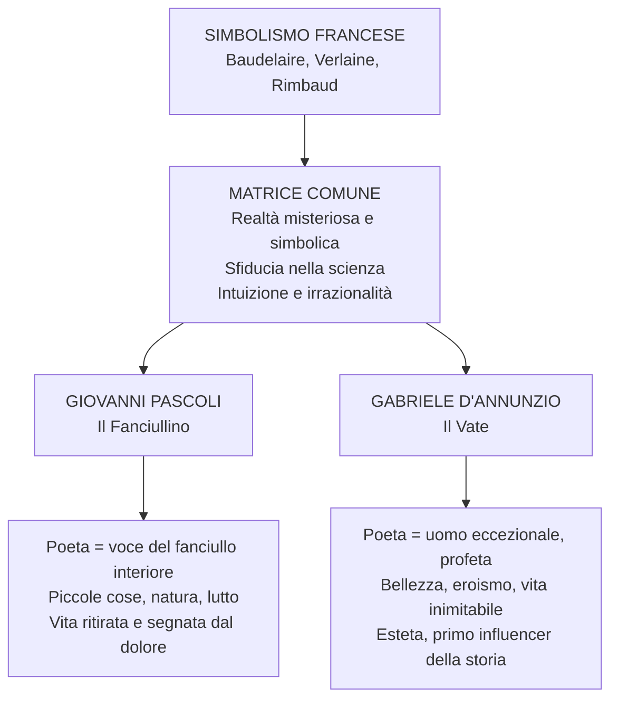

# Decadentismo e Simbolismo — Riassunto

---

## Date e riferimenti fondamentali

| Anno / Periodo | Evento |
|----------------|--------|
| **1857** | Baudelaire pubblica *I fiori del male*, con il sonetto *Corrispondenze* |
| **Anni '60-'70 dell'800** | Baudelaire scrive *Lo Spleen di Parigi* (contiene *La caduta dell'aureola*) |
| **1874** | Verlaine scrive *Arte poetica* |
| **Anni '80 dell'800** | Il decadentismo si afferma come fase storico-letteraria in Francia e poi in Italia |
| **1854-1891** | Vita di Arthur Rimbaud (muore a 37 anni a Marsiglia) |
| **Fine '800 - inizio '900** | Pascoli e D'Annunzio portano il decadentismo in Italia |

---

## 1. Il Decadentismo: caratteri generali

### 1.1 Una reazione al positivismo e al naturalismo

Il decadentismo è una fase storico-letteraria che prende avvio intorno agli **anni Ottanta dell'Ottocento**. Per capirne la portata bisogna partire da ciò a cui si oppone: il naturalismo e il verismo, tradizioni che riponevano piena fiducia nel fatto che la realtà fosse conoscibile attraverso la **ragione** e la **scienza**. Secondo Zola il romanzo doveva essere sperimentale come il lavoro di uno scienziato in laboratorio.

Il decadentismo rovescia questa prospettiva. Sul piano sociale è un **rifiuto della società borghese**: una società tutta volta all'utile e al profitto, disinteressata all'arte e alla poesia. Sul piano culturale è una **reazione al naturalismo e al positivismo**, e dunque al primato della ragione. Se non è la ragione a conoscere la realtà, che cosa rimane? L'**irrazionalità**, l'**intuizione**, l'**illuminazione**. La realtà non si fotografa: si decifra.

### 1.2 Concezione della realtà, esclusione del poeta e caratteri fondamentali

Per i decadenti la realtà è **misteriosa**, **illusoria** e **complessa**: è una **trama di corrispondenze simboliche** che deve essere decifrata. Ciò che appare in superficie non è che un velo; sotto si nasconde una dimensione profonda, accessibile soltanto attraverso l'ampliamento dei sensi e l'intuizione.

In una società borghese improntata al progresso, questi poeti rivendicano il proprio **isolamento** e la propria **emarginazione**: l'arte è inutile per la società borghese, e il poeta ne paga il prezzo diventando un estraneo nel suo stesso tempo. Il soggettivismo decadente si lega al **Romanticismo**, ma è diverso: non è l'io monolitico di Leopardi, bensì un io **frantumato**, molteplice, che si scopre "altro" rispetto a se stesso.

I tratti fondamentali del decadentismo:

- **Sfiducia nella scienza**: la scienza non coglie il mistero della realtà
- **Individualismo e soggettivismo**: forte carica soggettiva, rivalutazione dell'io interiore
- **Rivalutazione dell'irrazionalità**: intuizione, illuminazione, disordine dei sensi
- **Rifiuto della società borghese**: marginalità del poeta, critica dell'utilitarismo
- **Realtà come trama di simboli**: corrispondenze da decifrare attraverso la poesia

---

## 2. Il Simbolismo francese: i poeti maledetti

Il decadentismo italiano prende le mosse dal **simbolismo francese**, i cui protagonisti sono **Charles Baudelaire**, **Paul Verlaine** e **Arthur Rimbaud**, noti come *les poètes maudits* — i **poeti maledetti**. Baudelaire ne è il padre putativo; Verlaine e Rimbaud, più giovani, ne incarnano lo spirito più radicale.

Perché "maledetti"? Perché conducono un'esistenza **al di fuori dei canoni borghesi** e confidano nel fatto che la realtà sia conoscibile attraverso un **ampliamento dei sensi**, realizzato anche tramite l'uso di droghe — oppio e assenzio — che consentono di avvicinarsi alla dimensione profonda della realtà. Il termine "decadentismo" deriva dalla lirica *Languore* di Verlaine, i cui versi di apertura — *«Sono l'impero alla fine della decadenza»* — rimandano a una dimensione di **finitudine e di esaurimento**.

---

## 3. Charles Baudelaire

### 3.1 *Corrispondenze* — Il manifesto della realtà simbolica

Il sonetto *Corrispondenze*, tratto da *I fiori del male* (1857), è il testo fondamentale del simbolismo. La Natura (con la N maiuscola, sinonimo di "realtà nella sua totalità") è assimilata a un **tempio** in cui dei **pilastri vivi mormorano parole indistinte**: la realtà sembra parlare, ma sussurra parole non comprensibili che devono essere decifrate. L'uomo attraversa «foreste di simboli» che lo osservano con «sguardi familiari», riconoscendolo come parte di loro.

La seconda strofa introduce la similitudine degli **echi** che tendono a una «profonda, tenebrosa unità»: tutti i dati sensoriali — profumi, colori e suoni — **si rispondono** tra loro. Questa unità è però **tenebrosa**, non afferrabile con la sola ragione.

Nelle ultime strofe Baudelaire dà corpo alla teoria attraverso una cascata di **sinestesie**:

| Sinestesia | Dato sensoriale 1 | Dato sensoriale 2 |
|------------|--------------------|--------------------|
| «Profumi freschi come la carne d'un bambino» | Olfattivo | Tattile |
| «Dolci come l'oboe» | Olfattivo | Uditivo |
| «Verdi come i prati» | Olfattivo | Visivo |
| «L'ambra e il muschio… che cantano» | Olfattivo | Uditivo |

La sinestesia è una figura **evocativa e allusiva**, non spiegabile razionalmente: è proprio attraverso l'ampliamento delle percezioni sensoriali che è possibile accedere al **mistero della realtà**, costituita da simboli da decifrare attraverso la poesia.

### 3.2 *La caduta dell'aureola* — Il poeta nella modernità

In questo testo in prosa, contenuto in *Lo Spleen di Parigi*, il concetto centrale è la **caduta dell'aureola**: l'anello di luce dei santi, simbolo del ruolo sacro del poeta nella tradizione. Baudelaire afferma che il poeta ha **perso l'aureola** ed è diventato un uomo comune.

Un avventore incontra il poeta in un bordello e si stupisce di trovare lì proprio «il degustatore di quintessenze», colui che dovrebbe nutrirsi dell'ambrosia degli dei. Il poeta spiega che, attraversando i boulevard di Parigi — la città frenetica e alienante — l'aureola gli è «scivolata di testa nella fanghiglia del macadam». Non ha il coraggio di raccoglierla; con **ironia** amara rivendica la propria nuova condizione di marginalità: non è più tenuto a frequentare il Parnaso e può finalmente aggirarsi in incognito in tutti i luoghi dell'abiezione.

### 3.3 *L'albatro* — Il poeta tra cielo e terra

*L'albatro*, tratto da *I fiori del male*, costruisce un'**analogia** tra il grande uccello marino e il poeta. I marinai catturano per divertimento degli albatri; appena posato sulla tolda, il «**re dell'azzurro**» diventa maldestro: le ali che gli consentono di dominare i cieli diventano a terra un impaccio, trascinate come fossero remi. I marinai lo deridono — «lo storpio che volava» — incarnando lo **scherno** degli uomini comuni verso chi non produce un utile concreto.

L'ultima strofa esplicita l'analogia: il poeta è «**principe delle nubi**», abituato a misurarsi con l'uragano, ma sulla terra è un **esule** tra gli scherni. Le sue «**ali di gigante**» — l'immaginazione e la capacità artistica — lo rendono goffo nel mondo basso e terreno.

**Espressioni chiave** (metafore del poeta):
- **Re dell'azzurro / Principe delle nubi**: il poeta come dominatore dei cieli
- **Viaggiatore alato**: il poeta come essere dotato di ali
- **Esule in terra**: il poeta come estraneo nella società borghese

---

## 4. Paul Verlaine

### 4.1 Vita e poetica

Verlaine condusse una **vita inquieta** segnata dall'alcolismo. Trasferitosi a Parigi, stringe una **relazione appassionata e turbolenta** con il giovane Arthur Rimbaud, che distrugge la sua vita familiare: la passione sfocia in gravi conflitti, al punto che Verlaine cerca di **uccidere Rimbaud sparandogli** e viene condannato a due anni di reclusione.

La sua poetica ruota attorno alla **musicalità del verso**: il principio fondamentale è ***«De la musique avant toute chose»*** — la musica sopra ogni cosa. La musica ha un linguaggio universale e si sottrae ai contenuti specifici; per questo Verlaine attribuisce importanza capitale al **significante**, al suono della parola. La sua lirica è dominata dalle **figure retoriche del suono**: allitterazione, assonanza, consonanza. Al contrario, **rifiuta la rima** — che considera «la morte della poesia» perché ingabbia il verso e ne soffoca la libertà — e rifiuta la metrica tradizionale nel suo complesso.

### 4.2 *Arte poetica* (1874) — Il manifesto di Verlaine

*Arte poetica* è il manifesto letterario di Verlaine. I suoi punti fondamentali:

- **«Musica sopra ogni cosa»** — apertura programmatica assoluta. «Preferisci il ritmo impari, più vago e solubile nell'aria, senza nulla che pesi o che posi.» Il verso deve essere leggero, quasi evanescente.
- **«Perché vogliamo ancora la sfumatura, non il colore, sol la sfumatura»** — la parola poetica non deve delineare ma **suggerire**. Solo l'allusione, solo la sfumatura: siamo all'opposto del naturalismo, dove la parola doveva rispecchiare il reale come una fotografia.
- **«Prendi l'eloquenza e torcile il collo»** — prendi l'arte del bel parlare, codificata nei secoli, e uccidila in nome della libertà espressiva.
- **«Quel gioiello da un soldo che suona vuoto e falso sotto la lima?»** — la rima è artificiale, meccanica, morta.
- **«Musica ancora e sempre! E tutto il resto è letteratura.»** — chiusura fulminante: ciò che è stato codificato nel canone appartiene a un mondo morto, che deve essere superato. Conta solo la musica.

---

## 5. Arthur Rimbaud

### 5.1 Una vita sregolata

Arthur Rimbaud (1854-1891) è fin da giovane **ribelle**, che invia le proprie prove poetiche a Verlaine. Dopo la rottura con lui, **vagabonda per l'Europa**, si arruola nell'esercito coloniale e poi diserta, lavora in un circo, arriva in Norvegia. Nel 1880 abbandona la poesia e diventa **mercante di pelli e di caffè**. Nel 1891 gli viene diagnosticato un cancro e la **gamba amputata**; muore qualche mese dopo a Marsiglia, a soli **37 anni** — una vita che incarna in pieno lo spirito dei poeti maledetti.

### 5.2 *Lettera del veggente* — Il poeta come ladro di fuoco

La *Lettera del veggente* è la **dichiarazione di poetica** di Rimbaud. Si apre con:

> **«Io è un altro.»**

Questa formula è rivoluzionaria: l'identità non è univoca né monolitica, è **caos**. L'io non coincide con se stesso — è molteplice, straniero a se stesso. Diverso dal soggettivismo romantico di Leopardi, dove l'io universalizza il proprio dolore.

> **«Io dico che bisogna esser veggente, farsi veggente.»**

Il **veggente** vede ciò che all'uomo comune è negato: il mistero, la realtà profonda. Come si diventa veggente?

> **«Il poeta si fa veggente mediante un lungo, immenso e ragionato disordine di tutti i sensi.»**

Da questa concezione deriva l'immagine del poeta come **«ladro di fuoco»**, in analogia con Prometeo: il poeta si cala in tutte le esperienze del dolore e della follia, sprofonda nell'**abisso della realtà** per attingerne una verità profonda e portarne il significato agli uomini, così come Prometeo rubò il fuoco agli dei per consegnarlo all'umanità.

### 5.3 *Vocali* — Sinestesia radicale

In *Vocali* Rimbaud **associa suoni e colori** in assoluta libertà. Il primo verso enuncia il principio: **A nera, E bianca, I rossa, U verde, O blu.** È un'associazione senza alcun fondamento logico — e proprio questa libertà assoluta costituisce il senso del testo. Per ogni vocale viene costruita una rete di analogie ardite e sinestesie:

| Vocale | Colore | Immagini associate |
|--------|--------|--------------------|
| **A** | Nera | Corpo delle mosche lucenti, crudeli fetori, golfi d'ombra |
| **E** | Bianca | Candori di vapori, lance di ghiaccio, bianchi re |
| **I** | Rossa | Porpore, rigurgito di sangue, labbra belle, collera |
| **U** | Verde | Mari viridi, quiete di bestie al pascolo |
| **O** | Blu | Suprema tuba, stridi strani, silenzi, angeli e mondi |

La poesia non si può afferrare razionalmente: è tutta basata su aspetti **fonetici**, **musicali** e **sinestetici**. Questi sono i simboli di cui parlano i poeti maledetti: simboli da decifrare attraverso la poesia, non attraverso la ragione.

---

## 6. Dal simbolismo francese al decadentismo italiano: Pascoli e D'Annunzio

I due maggiori rappresentanti del decadentismo italiano sono **Giovanni Pascoli** e **Gabriele D'Annunzio**. A prima vista sembrano agli antipodi; in realtà condividono la stessa **matrice decadente**: entrambi rifiutano il positivismo, credono che la realtà sia misteriosa e simbolica, e la indagano attraverso l'intuizione e l'irrazionalità. Però gli esiti a cui arrivano sono opposti.

### 6.1 Giovanni Pascoli — Il fanciullino

La poetica di Pascoli è incentrata sulla figura del **fanciullino**. Secondo Pascoli, è poeta solo chi riesce a sentire cristallina dentro di sé la voce del proprio **fanciullino interiore**. Il fanciullo conosce la realtà come una **scoperta continua**, rimanendone ogni volta meravigliato. Questa capacità si smarrisce con il passare del tempo, condizionata dalle convenzioni sociali. Ma il fanciullino di Pascoli non è un fanciullo gioioso: è un **fanciullo ferito**, angosciato, segnato dal lutto. La sua poetica è fatta di **piccole cose** — oggetti umili osservati con stupore: il mondo contadino romagnolo, la flora e la fauna locale.

Pascoli nasce a **San Mauro Pascoli**, in Romagna. L'evento spartiacque della sua vita è la **morte del padre**, ucciso in un agguato notturno in circostanze misteriose quando Pascoli ha dodici anni. Poi muoiono la madre, una sorella, un fratello: una serie di lutti in successione che segnerà tutta la sua produzione poetica. La critica letteraria interpreta l'intera opera di Pascoli come un tentativo di rielaborazione del lutto. La morte del padre torna, ad esempio, nella celeberrima **X Agosto**, perché il padre fu assassinato la notte di San Lorenzo.

I temi fondamentali: la **natura** romagnola, il **lutto** e la **morte**, la **perdita** e l'abbandono, le **piccole cose** osservate con lo sguardo del fanciullino.

### 6.2 Gabriele D'Annunzio — Il Vate

La poetica di D'Annunzio ruota attorno a una figura opposta: il **vate**. Quattro lettere che indicano un uomo di straordinarie capacità, che vede ciò che gli altri non vedono, che si erge al di sopra dell'uomo comune e conduce una **vita inimitabile**. D'Annunzio è un **esteta**: vuole fare della vita un'opera d'arte. I suoi temi sono la bellezza, l'eroismo, gli amori, la lotta.

D'Annunzio è anche l'opposto di Pascoli nella biografia: è un **protagonista assoluto** della scena pubblica. Tra le sue imprese più clamorose figura l'**occupazione di Fiume** dopo la Prima Guerra Mondiale, dove fondò la Reggenza del Carnaro con un esercito personale. Tra le sue relazioni più celebri, quella con **Eleonora Duse**, la più grande attrice di teatro drammatico dell'epoca. È stato definito «il primo influencer della storia»: un uomo che costruisce e propone di sé un'immagine eroica e fuori dal comune.

### 6.3 Confronto tra le due figure

| Aspetto | Pascoli | D'Annunzio |
|---------|---------|------------|
| **Figura del poeta** | Il fanciullino (voce interiore, ferita) | Il vate (profeta, essere eccezionale) |
| **Atteggiamento** | Ripiegamento su di sé, vita ritirata | Esaltazione eroica, vita inimitabile |
| **Temi** | Piccole cose, natura, lutto, perdita | Bellezza, eroismo, amori, lotta |
| **Sguardo sulla realtà** | Dal basso, attraverso le cose umili | Dall'alto, attraverso la grandezza |
| **Matrice comune** | Decadentismo: realtà misteriosa, sfiducia nella scienza, intuizione | Idem |

---

## 7. Concetti chiave da ricordare

### Espressioni fondamentali

| Espressione | Autore | Significato |
|-------------|--------|-------------|
| **Caduta dell'aureola** | Baudelaire | Perdita della sacralità del poeta nella modernità |
| **Re dell'azzurro / Principe delle nubi** | Baudelaire | Metafore del poeta come essere sublime ma escluso |
| **Esule in terra** | Baudelaire | Il poeta come estraneo nella società borghese |
| **De la musique avant toute chose** | Verlaine | La musica sopra ogni cosa — primato del suono |
| **Sol la sfumatura** | Verlaine | La parola deve suggerire, non definire |
| **Tutto il resto è letteratura** | Verlaine | Ciò che è codificato nel canone è morto |
| **Io è un altro** | Rimbaud | L'identità è caos, non è univoca |
| **Farsi veggente** | Rimbaud | Il poeta deve vedere ciò che è negato all'uomo comune |
| **Ladro di fuoco** | Rimbaud | Il poeta come Prometeo che porta la verità agli uomini |
| **Il fanciullino** | Pascoli | La voce interiore innocente che è la vera poesia |
| **Il vate** | D'Annunzio | Il poeta come profeta e uomo eccezionale |

### Figure retoriche centrali

- **Sinestesia**: fusione di campi sensoriali diversi (olfattivo-tattile, olfattivo-uditivo, olfattivo-visivo) — figura chiave del simbolismo, evocativa e non razionale (cfr. *Corrispondenze*, *Vocali*)
- **Analogia**: accostamento di immagini senza nesso logico esplicito (cfr. le associazioni di *Vocali*)
- **Allitterazione, assonanza, consonanza**: figure del suono, centrali nella poetica di Verlaine

### Opposizioni fondamentali

| Positivismo / Naturalismo | Decadentismo / Simbolismo |
|---------------------------|---------------------------|
| Ragione, scienza | Irrazionalità, intuizione |
| Realtà conoscibile, trasparente | Realtà misteriosa, da decifrare |
| Parola = fotografia del reale | Parola = allusione, sfumatura |
| Romanzo sperimentale (Zola) | Poesia simbolica, musicalità |
| Fiducia nel progresso | Senso di finitudine e crisi |
| Poeta inserito nella società | Poeta escluso, esule, maledetto |
