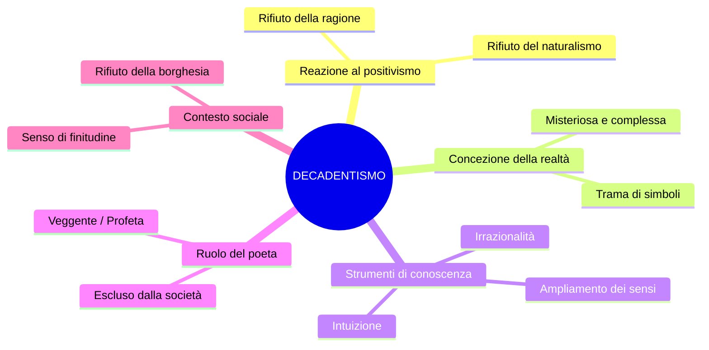
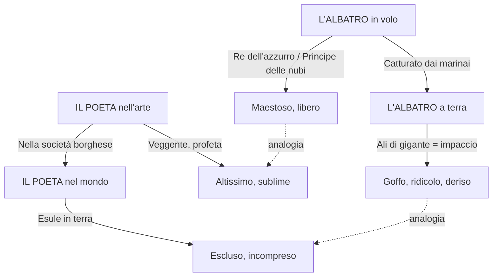
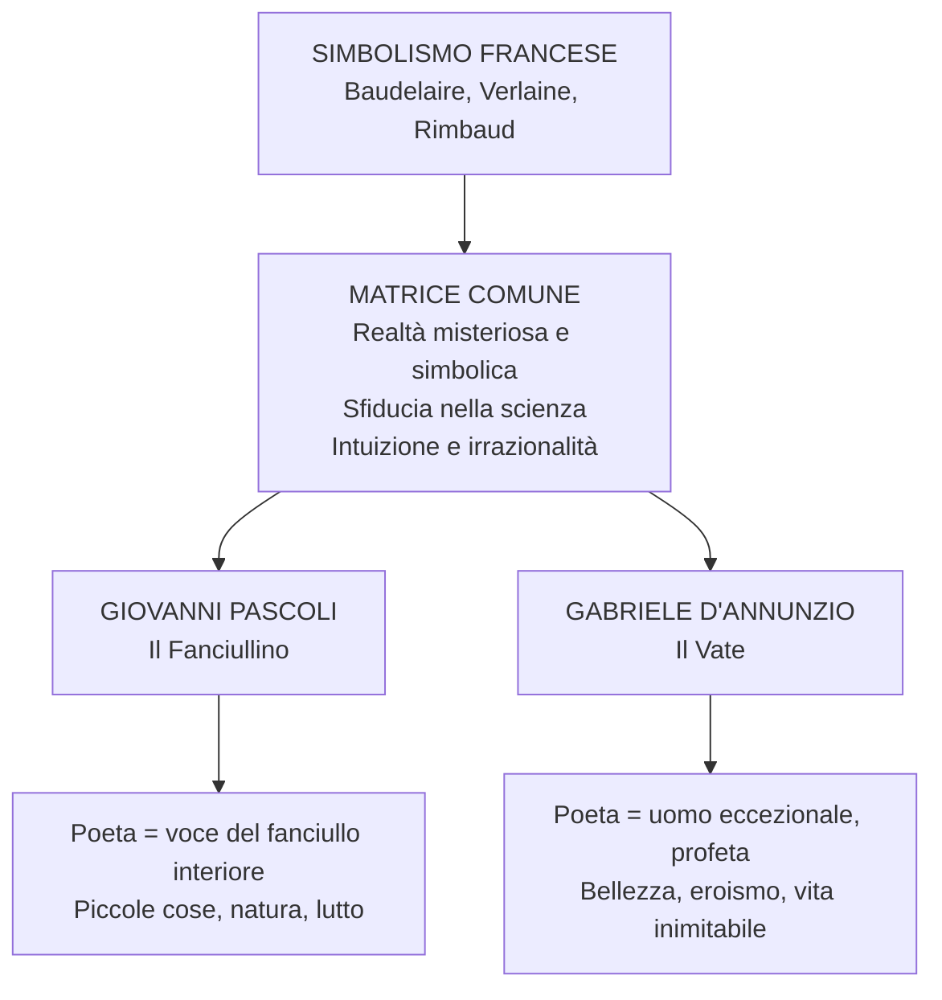

# Decadentismo e Simbolismo — Riassunto

---

## Date e riferimenti fondamentali

| Anno / Periodo | Evento |
|----------------|--------|
| **1857** | Baudelaire pubblica *I fiori del male* con *Corrispondenze* e *L'albatro* |
| **Anni '60-'70 dell'800** | Baudelaire scrive *Lo Spleen di Parigi* (contiene *La caduta dell'aureola*) |
| **1874** | Verlaine scrive *Arte poetica* |
| **Anni '80 dell'800** | Il decadentismo si afferma come fase storico-letteraria |
| **1854-1891** | Vita di Arthur Rimbaud (muore a 37 anni a Marsiglia) |
| **Fine '800 - inizio '900** | Pascoli e D'Annunzio portano il decadentismo in Italia |

---

## 1. Il Decadentismo: caratteri generali

Il decadentismo è una fase storico-letteraria degli **anni Ottanta dell'Ottocento** che si configura come **reazione al naturalismo, al verismo e al positivismo**. Quella tradizione riponeva piena fiducia nella **ragione** e nella **scienza** come strumenti di conoscenza della realtà. Il decadentismo rovescia questa prospettiva: la realtà non si fotografa con la ragione — si decifra attraverso l'**irrazionalità**, l'**intuizione**, l'**illuminazione**.

Sul piano sociale esprime il **rifiuto della società borghese**, tutta volta all'utile e al profitto. Per i decadenti la realtà è **misteriosa**, **illusoria** e **complessa**: non si offre all'osservazione diretta, è una **trama di corrispondenze simboliche** da decifrare. Ciò che appare — la realtà fenomenica — è solo la superficie; sotto si nasconde una dimensione profonda accessibile soltanto attraverso l'ampliamento dei sensi. Il poeta diventa così un **escluso**, un esule nel suo stesso tempo.

> [!note] Dalla lezione
> La professoressa ha posto la domanda: «Se non è la ragione, che cosa rimane per conoscere la realtà?». Uno studente ha risposto «la fede», un altro «l'edonismo». La risposta: «Ma manco per niente. È l'irrazionalità.»

I sei **caratteri fondamentali** del decadentismo: sfiducia nella scienza; individualismo e soggettivismo; rivalutazione dell'irrazionalità; rifiuto della società borghese; senso di finitudine e di morte; realtà come trama di simboli da decifrare.

---

## 2. I poeti maledetti (*les poètes maudits*)

Il decadentismo italiano prende le mosse dal **simbolismo francese**, i cui protagonisti — **Charles Baudelaire**, **Paul Verlaine** e **Arthur Rimbaud** — sono noti come *les poètes maudits*, i **poeti maledetti**. Sono "maledetti" perché conducono un'esistenza **al di fuori dei canoni borghesi** e credono che la realtà sia conoscibile attraverso un **ampliamento dei sensi**, realizzato anche mediante l'uso di **droghe** (oppio e assenzio). Non esitano a calarsi in tutte le esperienze del dolore, dell'amore, della follia per riportarne il significato agli uomini. La definizione stessa di "decadentismo" viene dai versi di Verlaine in *Languore*: **«Sono l'impero alla fine della decadenza»** — un'immagine di finitudine e di esaurimento, il tramonto segnato dai «grandi barbari bianchi».

> [!note] Dalla lezione
> La professoressa ha letto i versi di *Languore* chiedendo se il loro significato si cogliesse con la ragione o con l'intuizione. La risposta: «Attraverso l'intuizione.» Questi versi sono allusivi, simbolici, da decifrarsi — non da spiegare logicamente.

---

## 3. Charles Baudelaire

### *Corrispondenze* — Il manifesto della realtà simbolica

Il sonetto *Corrispondenze* da *I fiori del male* (1857) è il testo-manifesto del simbolismo. La Natura (sinonimo di "realtà") è assimilata a un **tempio** dove «**pilastri vivi mormorano parole indistinte**»: la realtà sembra parlare ma con parole non comprensibili, da decifrare. L'uomo attraversa «**foreste di simboli**» che lo osservano con «sguardi familiari». Come echi tendenti a una «**profonda, tenebrosa unità**», tutti i dati sensoriali — profumi, colori, suoni — **si rispondono** tra loro.

> Profumi freschi come la carne d'un bambino,
> dolci come l'oboe, verdi come i prati,
> — e altri d'una corrotta, trionfante ricchezza,
> con tutta l'espansione delle cose infinite:
> l'ambra e il muschio, l'incenso e il benzoino,
> che cantano il trasporto della mente e dei sensi.

La figura centrale è la **sinestesia** — fusione di percezioni di sensi diversi — che non ha nesso logico razionale:

| Sinestesia | Dato sensoriale 1 | Dato sensoriale 2 |
|------------|--------------------|--------------------|
| «Profumi freschi come la carne d'un bambino» | Olfattivo | Tattile |
| «Dolci come l'oboe» | Olfattivo | Uditivo |
| «Verdi come i prati» | Olfattivo | Visivo |
| «L'ambra e il muschio... che cantano» | Olfattivo | Uditivo |

Attraverso l'ampliamento delle percezioni sensoriali si accede al **mistero della realtà**, costituita da simboli da decifrare attraverso la poesia.

> [!note] Dalla lezione
> «La realtà è fatta di simboli. È attraverso l'ampliamento delle percezioni sensoriali che è possibile accedere al mistero della realtà. La sinestesia è una figura evocativa che non si può spiegare logicamente — e proprio per questo è la figura centrale del simbolismo.»

### *La caduta dell'aureola* — Il poeta nella modernità

Testo in prosa da *Lo Spleen di Parigi*. L'**aureola** — segno della sacralità di santi e angeli — simboleggia il ruolo sacro del poeta nella tradizione. Baudelaire sostiene che il poeta ha **perso l'aureola**: un avventore lo incontra in un **bordello** stupendosi di trovarlo lì, lui «divoratore di ambrosia»:

> «Ehi, ma come? Voi qui, carissimo? Voi in un posto malfamato? Voi, il degustatore di quintessenze? Voi, il divoratore di ambrosia?»

Il poeta spiega che l'aureola gli è scivolata nella fanghiglia mentre attraversava il **boulevard** nel caos frenetico di Parigi:

> «la mia aureola, a un movimento brusco, mi è scivolata di testa nella fanghiglia del macadam».

Il poeta non la raccoglie — con **ironia** amara rivendica la propria marginalità:

> «Non ho avuto il coraggio di raccoglierla. [...] Ora posso andarmene in giro in incognito, compiere le azioni più vili [...]. E immagino con gioia che qualche poeta spregevole la raccatterà e impudente se ne acconcerà la testa.»

L'atteggiamento è duplice: **critica** alla vita urbana alienante e **rivendicazione orgogliosa** della propria marginalità. Il poeta non è più sacro, ma proprio per questo è finalmente libero.

### *L'albatro* — Il poeta tra cielo e terra

La poesia si costruisce sull'**analogia** tra l'albatro e il poeta. I marinai catturano l'uccello per divertimento; sulla **tolda** il «**re dell'azzurro**» diventa maldestro: le grandi ali, che dominano i cieli, a terra diventano un impaccio, le trascina come fossero remi. I marinai beffano il «**viaggiatore alato**» — gli mettono una pipa sotto il becco, imitano zoppicando «lo storpio che volava». L'ultima strofa esplicita l'analogia:

> Il poeta è come lui, principe delle nubi,
> che sta con l'uragano e ride degli arcieri;
> esule in terra tra gli scherni,
> non lo lasciano camminare le sue ali di gigante.

Il poeta è «**principe delle nubi**», si misura con l'uragano. Ma sulla terra è un **esule**. Le **ali di gigante** — l'immaginazione e la capacità artistica — non gli consentono di restare nella dimensione bassa e terrena.

> [!note] Dalla lezione
> «Queste espressioni ve le sottolineo perché le dovete imparare. Il poeta, come l'albatro, deve coltivare le altezze sublimi dell'arte e non il mondo prosastico del consumo, del guadagno, dell'utile, della fretta, del caos.»

---

## 4. Paul Verlaine

### Vita sregolata

Verlaine conduce una **vita sregolata**: alcolismo dall'adolescenza, relazione turbolenta con Rimbaud che distrugge la sua famiglia, tentativo di **uccidere Rimbaud sparandogli** e due anni di reclusione.

### Poetica e *Arte poetica* (1874)

Verlaine è da ricordare per la **musicalità del verso**: ***«De la musique avant toute chose»*** — la musica sopra ogni cosa. La musica parla a tutti universalmente; per questo Verlaine privilegia il **significante**, il suono. Le sue liriche sono dominate dalle **figure del suono** (allitterazione, assonanza, consonanza). Al contrario **rifiuta la rima**, che ingabbia il verso imponendogli uno schema precostituito che soffoca la libertà espressiva.

> [!note] Dalla lezione
> «Perché le rime non rendono il verso libero, cioè sono qualcosa che dà una costruzione, una forma al verso, già destinata dall'inizio perché c'è uno schema di rime da rispettare.» — La professoressa ha confermato: «Certo, perché ingabbia la poesia.»

*Arte poetica* enuncia i principi fondamentali con affermazioni programmatiche da memorizzare:

- **«preferisci il ritmo impari»** — il verso deve essere leggero, vago, «solubile nell'aria, senza nulla che pesi o che posi»
- **«vogliamo ancora la sfumatura, non il colore, sol la sfumatura»** — la parola deve **suggerire**, non delineare; ad anni luce dal naturalismo dove la parola rispecchiava la cosa come una fotografia
- **«Prendi l'eloquenza e torcile il collo»** — l'arte del bel parlare codificata nei secoli va uccisa
- **«quel gioiello da un soldo che suona vuoto e falso sotto la lima»** — la rima è artificiale e morta
- **«Musica ancora e sempre! E tutto il resto è letteratura»** — tutto ciò che è codificato nel canone appartiene a un mondo morto da superare

---

## 5. Arthur Rimbaud

### Vita sregolata e raminga

Rimbaud (1854-1891) è un ragazzo **ribelle** che entra in contatto con Verlaine. Dopo la rottura violenta — la lite in cui Verlaine gli spara — inizia a **vagabondare per l'Europa**: esercito coloniale in Olanda, circo, Norvegia, Cipro come capo cantiere. Nel 1880 abbandona la poesia e diventa **mercante di pelli e di caffè**. Nel 1891 gli viene diagnosticato un cancro al ginocchio, gli viene **amputata la gamba**, muore a Marsiglia a **37 anni** — una vita che incarna in pieno lo spirito dei poeti maledetti.

### *Lettera del veggente* — «Io è un altro»

La *Lettera del veggente* è la **dichiarazione di poetica** di Rimbaud. Si apre con la frase rivoluzionaria:

> **«Io è un altro.»**

Non è il soggettivismo romantico di Leopardi: l'identità non è univoca, è **caos**. L'io è molteplice, straniero a se stesso. Aggiunge:

> **«Io dico che bisogna esser veggente, farsi veggente.»**

Il **veggente** vede ciò che all'uomo comune è negato — il mistero, la realtà profonda. Come ci si fa veggenti?

> **«Il poeta si fa veggente mediante un lungo, immenso e ragionato disordine di tutti i sensi.»**

Attraverso il **disordine di tutti i sensi** — amore, sofferenza, pazzia — il poeta giunge all'ignoto. Da questa concezione deriva l'immagine del poeta come **«ladro di fuoco»**, in analogia con Prometeo: sprofonda nell'**abisso della realtà**, ne coglie i simboli e li porta agli uomini, come Prometeo rubò il fuoco agli dei.

> [!note] Dalla lezione
> «Il poeta non esita a calarsi in tutte le esperienze del dolore, dell'amore, della pazzia, non esita a calarsi nell'abisso della realtà, anche nelle sue parti più inquietanti. E in questo modo attinge a una verità, coglie i simboli della realtà e ne porta il significato agli uomini, così come Prometeo ha rubato il fuoco agli dei per consegnarlo agli uomini.»

### *Vocali* — Sinestesia radicale

In *Vocali* Rimbaud associa suoni e colori in assoluta libertà:

> **A nera, E bianca, I rossa, U verde, O blu.**
> Vocali. Io dirò un giorno i vostri ascosi nascimenti.
>
> **A**, nero vello al corpo delle mosche lucenti / che ronzano al di sopra dei crudeli fetori, golfi d'ombra.
> **E**, candori di vapori e di tende, / lance di ghiaccio, brividi di umbelle, bianchi re.
> **I**, porpore, rigurgito di sangue, labbra belle / che ridono di collera, di ebrezza penitente.
> **U**, cicli, vibrazioni sacre dei mari viridi, / quiete di bestie al pascolo, quiete delle ampie rughe / che alle fronti studiose imprime l'alchimia.
> **O**, la suprema tuba piena di stridi strani, / silenzi attraversati dagli angeli e dai mondi. / O, l'omega e il raggio violetto dei suoi occhi.

L'associazione vocale-colore non ha fondamento logico — è proprio questa libertà assoluta a costruire il senso del testo. Per ogni vocale una rete di **analogie ardite** e sinestesie:

| Vocale | Colore | Immagini associate | Sensi coinvolti |
|--------|--------|-------------------|-----------------|
| **A** | Nera | Corpo delle mosche lucenti, crudeli fetori, golfi d'ombra | Vista, olfatto |
| **E** | Bianca | Candori di vapori, lance di ghiaccio, brividi di umbelle, bianchi re | Vista, tatto |
| **I** | Rossa | Porpore, rigurgito di sangue, labbra belle, collera, ebrezza | Vista, sensazione fisica |
| **U** | Verde | Mari viridi, quiete di bestie al pascolo, fronti studiose | Vista, udito |
| **O** | Blu | Suprema tuba, stridi strani, silenzi, angeli e mondi, omega | Udito, vista |

La poesia è tutta basata su aspetti **fonetici**, **musicali** e **sinestetici** — non si afferra razionalmente. Questi sono i simboli di cui parlano i poeti maledetti: da decifrare attraverso la poesia, non attraverso la ragione.

> [!note] Dalla lezione
> «Noi la possiamo afferrare razionalmente questa poesia? Eh, insomma. È tutta basata su aspetti fonetici, musicali e sugli aspetti sinestetici della realtà.»

---

## 6. Dal simbolismo al decadentismo italiano: Pascoli e D'Annunzio

### La matrice comune

I due maggiori rappresentanti del decadentismo italiano — **Giovanni Pascoli** e **Gabriele D'Annunzio** — sembrano agli antipodi per biografia e poetica, ma condividono la stessa **matrice decadente**: sfiducia nella scienza, convinzione che la realtà sia misteriosa e conoscibile solo attraverso l'**intuizione** e l'**irrazionalità** — la stessa concezione di Baudelaire in *Corrispondenze*. Gli esiti, però, sono opposti.

### Giovanni Pascoli — Il fanciullino

La poetica di Pascoli è incentrata sul **fanciullino**: è poeta solo colui che da adulto sente ancora la voce del proprio **fanciullo interiore**, capace di guardare la realtà ogni volta come una **scoperta**, con meraviglia. Ma il fanciullino di Pascoli è un **fanciullo ferito** — angosciato, ripiegato su se stesso — segnato dal lutto devastante dell'infanzia.

Pascoli nasce a **San Mauro Pascoli** (Romagna). L'evento spartiacque è la **morte del padre**, ucciso in un agguato notturno in circostanze misteriose (i colpevoli rimasero impuniti) quando Pascoli ha dodici anni. L'anno dopo muore la madre, poi una sorella, un fratello. La critica interpreta tutta la sua produzione come tentativo di **rielaborazione del lutto**. La morte del padre ritorna nella celeberrima **X Agosto** (assassinato la notte di San Lorenzo).

> [!note] Dalla lezione
> «La vicenda che lo segna di più è sicuramente la morte del padre, quando Pascoli ha dodici anni. Lo segna a tal punto che la critica letteraria interpreta tutta la produzione di Pascoli come una sorta di tentativo di rielaborazione del lutto.»

La sua poesia è fatta di **piccole cose** — oggetti umili straordinari attraverso gli occhi del fanciullino: il paesaggio romagnolo, la flora e la fauna, il mondo contadino. Politicamente: prima vicino al **socialismo** (Andrea Costa), poi al **nazionalismo**.

### Gabriele D'Annunzio — Il Vate

D'Annunzio propone l'immagine opposta: il **vate**, uomo di straordinarie capacità che si erge sopra l'uomo comune e conduce una **vita inimitabile**. È un **esteta** che vuole fare della vita un'opera d'arte; i suoi temi sono bellezza, eroismo, amori, lotta.

> [!note] Dalla lezione
> La professoressa ha definito D'Annunzio «il primo influencer della storia»: poeta soldato, occupò Fiume con un esercito personale, fondò la Reggenza del Carnaro, ebbe una relazione celebre con l'attrice **Eleonora Duse**.

D'Annunzio è l'opposto di Pascoli anche nella biografia: **protagonista assoluto** della scena pubblica, uomo d'azione e seduttore.

### Tabella comparativa

| Aspetto | Pascoli | D'Annunzio |
|---------|---------|------------|
| **Figura del poeta** | Il fanciullino (voce interiore, ferita) | Il vate (profeta, essere eccezionale) |
| **Atteggiamento** | Ripiegamento su di sé, vita ritirata | Esaltazione eroica, vita inimitabile |
| **Temi** | Piccole cose, natura, lutto, perdita | Bellezza, eroismo, amori, lotta |
| **Biografia** | San Mauro Pascoli, Romagna, lutti familiari | Fiume, Eleonora Duse, poeta soldato |
| **Sguardo sulla realtà** | Dal basso, attraverso le cose umili | Dall'alto, attraverso la grandezza |
| **Matrice comune** | Decadentismo: realtà misteriosa, intuizione | Idem |

---

## 7. Espressioni fondamentali da ricordare per l'esame

| Espressione | Autore | Significato |
|-------------|--------|-------------|
| **Caduta dell'aureola** | Baudelaire | Perdita della sacralità del poeta nella modernità |
| **Re dell'azzurro / Principe delle nubi / Viaggiatore alato** | Baudelaire | Metafore del poeta sublime ma escluso |
| **Esule in terra** | Baudelaire | Il poeta come estraneo nella società borghese |
| **Ali di gigante** | Baudelaire | Le capacità del poeta che a terra diventano un impaccio |
| **De la musique avant toute chose** | Verlaine | La musica sopra ogni cosa — primato del suono |
| **Sol la sfumatura** | Verlaine | La parola deve suggerire, non definire |
| **Tutto il resto è letteratura** | Verlaine | Ciò che è codificato nel canone è morto |
| **Io è un altro** | Rimbaud | L'identità è caos, non è univoca |
| **Farsi veggente** | Rimbaud | Il poeta deve vedere ciò che è negato all'uomo comune |
| **Lungo, immenso e ragionato disordine di tutti i sensi** | Rimbaud | Il metodo per accedere alla verità profonda |
| **Ladro di fuoco** | Rimbaud | Il poeta come Prometeo che porta la verità agli uomini |
| **Il fanciullino** | Pascoli | La voce interiore innocente e ferita che è la vera poesia |
| **Il vate** | D'Annunzio | Il poeta come profeta e uomo eccezionale |

### Opposizioni fondamentali

| Positivismo / Naturalismo | Decadentismo / Simbolismo |
|---------------------------|---------------------------|
| Ragione, scienza | Irrazionalità, intuizione |
| Realtà conoscibile, trasparente | Realtà misteriosa, da decifrare |
| Parola = fotografia del reale | Parola = allusione, sfumatura |
| Romanzo sperimentale (Zola) | Poesia simbolica, musicalità |
| Fiducia nel progresso | Senso di finitudine e crisi |
| Poeta inserito nella società | Poeta escluso, esule, maledetto |
