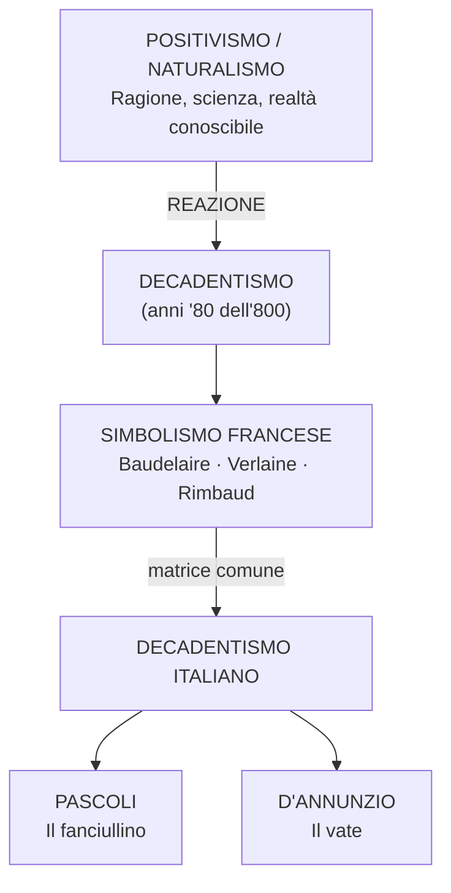
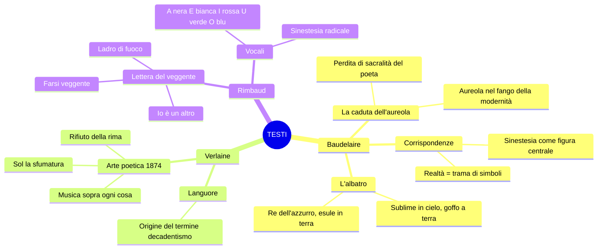

# Decadentismo e Simbolismo — Ripasso veloce

---

## Il quadro d'insieme

**Decadentismo** = reazione al positivismo/naturalismo. Rifiuto della ragione e della scienza. La realtà è **misteriosa**, fatta di **simboli** da decifrare attraverso **irrazionalità, intuizione, ampliamento dei sensi**. Il poeta è **escluso** dalla società borghese, che è tutta volta all'utile e al profitto.

---

## I poeti maledetti — Poetiche

**Baudelaire** — La realtà è una **trama di corrispondenze simboliche** (*Corrispondenze*: «foreste di simboli», sinestesie). Il poeta ha **perso l'aureola** — non è più sacro nella modernità (*La caduta dell'aureola*). Come l'**albatro**, è sublime in volo ma goffo e deriso a terra: «re dell'azzurro», «principe delle nubi», «esule in terra» (*L'albatro*).

**Verlaine** — ***«De la musique avant toute chose»***: primato della musicalità del verso. Rifiuto della rima («morte della poesia»). **«Sol la sfumatura, non il colore»**: la parola deve suggerire, non definire. «Prendi l'eloquenza e torcile il collo.» *Arte poetica*, 1874.

**Rimbaud** — **«Io è un altro»**: l'identità è caos, non è univoca. **«Farsi veggente»** attraverso «un lungo, immenso e ragionato **disordine di tutti i sensi**» — amore, dolore, follia. Il poeta è un **«ladro di fuoco»** come Prometeo. *Vocali*: sinestesia radicale, A nera, E bianca, I rossa, U verde, O blu.

---

## Pascoli vs D'Annunzio

Stessa **matrice decadente** (realtà misteriosa, sfiducia nella scienza, intuizione), esiti **opposti**:

| | **Pascoli** | **D'Annunzio** |
|--|-------------|----------------|
| Poeta = | **Fanciullino** (voce interiore ferita) | **Vate** (profeta, uomo eccezionale) |
| Vita | Ritirata, segnata dal lutto | Inimitabile, eroica, pubblica |
| Temi | Piccole cose, natura, morte, perdita | Bellezza, eroismo, amori |
| Luogo | San Mauro Pascoli, Romagna | Fiume, Roma, il mondo |
| Evento chiave | Morte del padre (X Agosto) | Occupazione di Fiume |

> Pascoli: fanciullino ferito, rielaborazione del lutto, oggetti umili visti con meraviglia.
> D'Annunzio: «il primo influencer della storia», esteta, poeta soldato, Eleonora Duse.

---

## Testi chiave — Mappa rapida

---

## Le 12 espressioni da sapere

1. **Caduta dell'aureola** (Baudelaire) — il poeta non è più sacro
2. **Re dell'azzurro** (Baudelaire) — il poeta come dominatore dei cieli
3. **Principe delle nubi** (Baudelaire) — il poeta nelle altezze dell'arte
4. **Esule in terra** (Baudelaire) — il poeta estraneo nella società
5. **De la musique avant toute chose** (Verlaine) — musica sopra ogni cosa
6. **Sol la sfumatura** (Verlaine) — suggerire, non definire
7. **Tutto il resto è letteratura** (Verlaine) — il canone è morto
8. **Io è un altro** (Rimbaud) — l'identità è caos
9. **Farsi veggente** (Rimbaud) — vedere l'invisibile
10. **Disordine di tutti i sensi** (Rimbaud) — il metodo del veggente
11. **Ladro di fuoco** (Rimbaud) — il poeta come Prometeo
12. **Fanciullino / Vate** (Pascoli / D'Annunzio) — le due risposte italiane al decadentismo

---

## Opposizione fondamentale

| Naturalismo / Positivismo | Decadentismo / Simbolismo |
|---------------------------|---------------------------|
| Ragione e scienza | Irrazionalità e intuizione |
| Realtà trasparente | Realtà misteriosa, da decifrare |
| Parola = fotografia | Parola = sfumatura, allusione |
| Poeta inserito nella società | Poeta escluso, esule, maledetto |
