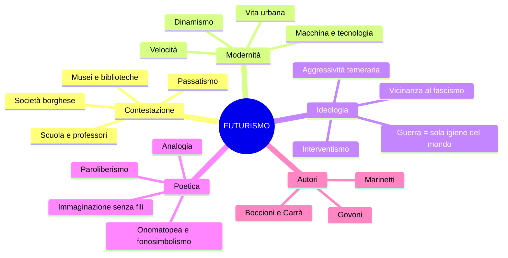
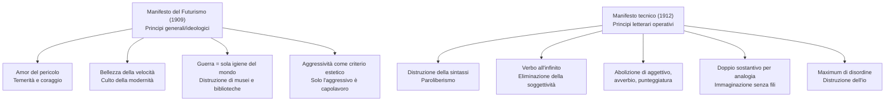
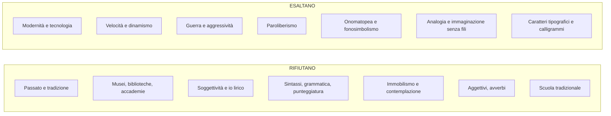

# Il Futurismo — Schema di studio completo

---

## Date fondamentali

| Anno / Data | Evento |
|-------------|--------|
| **1899** | Fondazione della FIAT — simbolo dell'industrializzazione nascente |
| **20 febbraio 1909** | Pubblicazione del *Manifesto del Futurismo* su *Le Figaro* (Parigi) |
| **1912** | *Manifesto tecnico della letteratura futurista* |
| **1913** | Inizio pubblicazione della rivista **Lacerba** (Firenze) |
| **1914** | Pubblicazione di **Zang Tumb Tumb** di Marinetti |
| **1915** | *Rarefazioni e parole in libertà* di Corrado Govoni |
| **1911** | *Manifesto dei pittori futuristi* (Boccioni, Carrà, Russolo) |

---

## 1. Contesto storico e nascita del movimento

### 1.1 Il primo movimento d'avanguardia

Il Futurismo si configura come il **primo movimento d'avanguardia** che si sviluppa in Italia tra il primo e il secondo decennio del Novecento. La parola stessa — *avanguardia* — appartiene al lessico militare: indica quei soldati che precedono la guardia, che vanno in **avanscoperta**, che entrano in un territorio prima degli altri. E proprio come un reparto d'avanscoperta, il Futurismo si propone di esplorare qualcosa che non era mai stato fatto: di **innovare**, rompendo con tutto ciò che lo precede.

Questo movimento non si limita alla letteratura. I futuristi conducono una contestazione **globale**: letteratura, arte, teatro, persino la cucina vengono investiti dalla loro furia rinnovatrice. Il gruppo pubblica una serie di **manifesti** che si propongono di dare regole nuove per uscire da un passato sentito come anacronistico e superato.

### 1.2 La contestazione della società borghese

L'obiettivo polemico dei futuristi è la **società borghese**, accusata di essere indifferente e repressiva nei confronti dell'arte. Questo motivo non è del tutto nuovo: i **poeti maledetti** francesi — Baudelaire in testa con le immagini della "perdita dell'aureola" e dell'"Albatros" — avevano già espresso il disgusto per una società che non riconosce più il ruolo del poeta. I futuristi raccolgono questa eredità, ma la radicalizzano: non si limitano a un ripiegamento malinconico, ma lanciano una vera e propria sfida aggressiva al mondo borghese.

L'artista futurista si scopre **antagonista della classe dominante**. Si dichiara **disgustato, declassato, disoccupato**. Con la nuova società capitalistico-industriale si conclude il mito della beata solitudine dell'artista: l'artista partecipa al processo produttivo e accetta le regole del mercato. Ciò che non diventa merce — dice Marinetti — merita di andare distrutto.

### 1.3 L'irruzione della modernità

Ciò che interessa ai futuristi è la **modernità**: una modernità fatta di progresso tecnologico, urbanizzazione, industrializzazione nascente. L'Italia all'inizio del Novecento è ancora un paese prevalentemente agricolo, ma il processo di industrializzazione sta prendendo avvio — basti pensare alla fondazione della FIAT nel 1899, una delle più grandi industrie automobilistiche. La macchina, l'automobile, è il **mito** dell'inizio del secolo: un bene di lusso che si guarda con grande ammirazione, non ancora alla portata di tutti (lo sarà solo negli anni Cinquanta e Sessanta).

> [!note] Dalla lezione
> A proposito di automobile: la parola stessa è stata inventata da **D'Annunzio**, il quale decise che fosse di genere femminile con una motivazione provocatoria: «L'automobile è femminile. Questa ha la grazia, la snellezza, la vivacità di una seduttrice; ha inoltre una virtù ignota alle donne: la perfetta obbedienza. Ma per contro, delle donne ha la disinvolta levità nel superare ogni scabrezza.» Un'interpretazione suggestiva e, come era nel suo stile, piuttosto misogina.

Con le avanguardie, la letteratura italiana abbandona l'idillio e il mito della condizione agreste e le tematiche naturalistiche. Irrompe quello che Baudelaire chiama l'**eroismo della vita moderna**: la vita cittadina, il traffico dei boulevard, le luci delle fabbriche, i macchinari, l'elettricità.

### 1.4 L'opera d'arte riproducibile

Un aspetto fondamentale della poetica futurista riguarda la concezione dell'opera d'arte. Per i futuristi, l'opera d'arte non è più **irripetibile** — come una poesia di Pascoli o una tela di Rembrandt — bensì **riproducibile**. Le tecniche utilizzate sono quelle che rendono un contenuto riproducibile su larga scala: la **tipografia**, la **stampa**, la **fotografia**. La pratica artistica è intesa come attività che tende alla produzione di massa sulla base di modelli tecnici.

### 1.5 Il rapporto con D'Annunzio e il passato

Il rapporto del Futurismo con D'Annunzio è complesso e ambivalente. Da un lato, i futuristi condividono con D'Annunzio l'esaltazione della forza, dell'aggressività, della temerità, del vitalismo. I temi dell'interventismo, della glorificazione della guerra, del disprezzo per la debolezza e l'umiltà sono comuni ai futuristi e al superomismo dannunziano. Dall'altro lato, però, i futuristi rifiutano esplicitamente il culto del passato che D'Annunzio incarna: la sua ammirazione per la tradizione classica, per il mito, per la bellezza antica è esattamente ciò che il Futurismo vuole distruggere.

Questo rapporto conflittuale emerge con chiarezza nel testo *Contro i professori*, dove Marinetti prende le distanze anche da **Nietzsche** — filosofo del Superuomo caro a D'Annunzio — perché il suo pensiero rimane legato alla grandezza della cultura greca e della mitologia: «Il suo Superuomo è un prodotto dell'immaginazione ellenica, costruito coi tre grandi cadaveri putrefatti di Apollo, di Marte e di Bacco.»

---

## 2. L'ideologia futurista

### 2.1 La sconsacrazione del passato

Il cuore del programma futurista è un progetto di **eversione**: un sovvertimento radicale nella direzione della distruzione della tradizione. Il passato perde qualsiasi sacralità. Le formule sono celebri e provocatorie:

- **«Bruciamo i musei»**: i musei contengono il passato che non ha più nulla da dire al presente
- **«Uccidiamo il chiaro di luna»**: il chiaro di luna è un simbolo della tradizione poetica da Petrarca a Leopardi, e va abbattuto
- La **museificazione** dell'arte è un atto di morte: museificare le opere significa ucciderle, cristallizzarle nell'immobilismo

La tradizione è vista come un **carcere**, una prigione da cui liberarsi. Ogni forma di culto del passato — dalla scuola ai musei, dalle biblioteche alle accademie — rappresenta un ostacolo alla creatività e all'energia vitale.

### 2.2 Dinamismo, velocità, aggressività

Il rinnovamento proposto dal Futurismo coincide con la **mimesi del mondo contemporaneo**: l'arte deve imitare la modernità. Gli elementi centrali sono tre:

Il **dinamismo** è il principio fondamentale. La città moderna, con il suo traffico e la sua frenesia, è il nuovo paesaggio dell'arte. La **velocità** dell'automobile, del velivolo, dell'aereo, del treno in corsa è elevata a valore estetico supremo: «La magnificenza del mondo si è arricchita di una bellezza nuova: la bellezza della velocità.» L'**aggressività temeraria** completa il quadro: l'amore per il pericolo, il coraggio, la ribellione sono elementi essenziali della nuova poesia.

I temi prediletti della produzione futurista riflettono questa poetica: auto, treni in corsa, aeroplani in volo, ambienti urbani, la folla in movimento, fabbriche e officine, luci elettriche, la guerra e le battaglie, i colpi di cannone e le mitragliatrici, palloni volanti e laceranti esplosioni.

### 2.3 La glorificazione della guerra

L'ideologia sottesa al Futurismo è la **glorificazione della guerra**. La guerra viene interpretata come manifestazione della forza che spazza via la debolezza e l'umiltà. I futuristi la definiscono con un'espressione che va memorizzata: la guerra come **«sola igiene del mondo»**.

A questa si accompagna l'esaltazione dell'istinto e dell'aggressività. Non è un caso che i rappresentanti del movimento, operanti tra il 1909 e il 1912, si collocano tra gli **interventisti** negli anni immediatamente precedenti alla Prima guerra mondiale, e successivamente saranno vicini al **fascismo**.

> [!note] Dalla lezione
> Le serate futuriste finivano sempre a bottigliate, a cazzotti. Non era un interesse per lo sport o per il fisico in senso positivo: era qualcosa di più aggressivo, che aveva a che fare con la guerra, con la lotta, con le risse. Un'iconoclastia di questo tipo.

---

## 3. I Manifesti

### 3.1 Il Manifesto del Futurismo (1909)

Il *Manifesto del Futurismo* viene pubblicato il **20 febbraio 1909** su *Le Figaro*, una rivista francese — il fatto che la prima pubblicazione avvenga in francese e su una rivista straniera è significativo della vocazione internazionale del movimento. In questo manifesto sono esplicitati i **principi generali** a cui si ispira il Futurismo. Il testo è suddiviso in punti, una sorta di elencazione dei principi fondamentali con cui i futuristi si presentano e chiedono di far valere il loro programma.

Dal punto di vista stilistico, il linguaggio del manifesto è significativo quanto il contenuto. Il ritmo è quasi **militaresco**, scandito dal ricorso all'**asindeto** (l'uso della punteggiatura al posto delle congiunzioni) e dal **climax ascendente** delle elencazioni. Lo stile rispecchia il contenuto: è aggressivo, ritmato, incalzante.

#### Analisi dei principi fondamentali

**Sull'amor del pericolo e la temerità:**
«Noi vogliamo cantare l'amor del pericolo, l'abitudine all'energia e alla temerità.» La temerità è un coraggio che si avvicina alla sfrontatezza. «Il coraggio, l'audacia, la ribellione saranno elementi essenziali della nostra poesia.» Si noti la frattura radicale con il passato: Pascoli e prima Leopardi avevano dato vita a una letteratura del ripiegamento soggettivo, dell'estasi e dell'immobilità pensosa. Il Futurismo ribalta tutto: «La letteratura esaltò fino ad oggi l'immobilità pensosa, l'estasi e il sonno. Noi vogliamo esaltare il movimento aggressivo, l'insonnia febbrile, il passo di corsa, il salto mortale, lo schiaffo e il pugno.»

**Sulla bellezza della velocità:**
«Noi affermiamo che la magnificenza del mondo si è arricchita di una bellezza nuova: la bellezza della velocità.» La celebrazione della modernità e dell'innovazione tecnologica è il cuore del messaggio. L'uomo al volante viene celebrato con solennità: «Noi vogliamo inneggiare all'uomo che tiene il volante, la cui asta attraversa la terra, lanciata a corsa essa pure sul circuito della sua orbita.»

**Sull'aggressività come criterio estetico:**
«Non vi è più bellezza se non nella lotta. Nessuna opera che non abbia un carattere aggressivo può essere un capolavoro.» Questa affermazione è radicale: tutti i capolavori riconosciuti del periodo precedente — da Petrarca in poi — vengono di fatto scartati.

**Sulla guerra e la distruzione:**
«Noi vogliamo glorificare la guerra — sola igiene del mondo — il militarismo, il patriottismo, il gesto distruttore.» «Noi vogliamo distruggere i musei, le biblioteche, le accademie d'ogni specie e combattere contro il moralismo, il femminismo e contro ogni viltà opportunistica o utilitaria.»

**Sulla sostituzione del sacro:**
I futuristi si sentono «sul patrimonio estremo dei secoli», privilegiati a vivere nel tempo in cui vivono, che ritengono superiore a tutte le epoche precedenti. Hanno sostituito al Dio tradizionale un nuovo Dio: quello della modernità, dell'«eterna velocità onnipresente».

**Sulla conclusione del manifesto:**
«Noi canteremo le locomotive dall'ampio petto» — la locomotiva viene personificata ed elevata a un livello quasi di eroismo — «il volo scivolante degli aeroplani. Ed è dall'Italia che lanciamo questo manifesto di violenza travolgente e incendiaria, col quale fondiamo oggi il Futurismo.»

### 3.2 Il Manifesto tecnico della letteratura futurista (1912)

Il secondo manifesto fondamentale è il *Manifesto tecnico della letteratura futurista*, che stabilisce i principi specifici che il Futurismo intende realizzare **in letteratura**. Se il primo manifesto enuncia l'ideologia, questo secondo ne definisce gli strumenti operativi. È qui che nasce il concetto di **paroliberismo** — parole in libertà — che diventa il tratto distintivo della letteratura futurista.

#### Le regole della scrittura futurista

**Distruzione della sintassi:**
«Bisogna distruggere la sintassi, disponendo i sostantivi a caso, come nascono.» La parola *sintassi* deriva dal greco *syn-tassein* ("ordinare insieme") e rappresenta tutte le regole convenzionali del linguaggio. Per i futuristi queste regole sono una gabbia: le parole devono essere **in libertà**.

**Il verbo all'infinito:**
«Si deve usare il verbo all'infinito, perché si adatti elasticamente al sostantivo e non lo sottoponga all'io dello scrittore che osserva o immagina. Il verbo all'infinito può solo dare il senso della continuità della vita e l'elasticità dell'intuizione che la percepisce.» Il verbo all'infinito ha una doppia funzione: da un lato **elimina la soggettività** (essendo senza persona, non vincola l'azione a un soggetto), dall'altro esprime il **dinamismo** perché non è impedito dal pronome e si colloca in una dimensione astratta che richiama la velocità.

**Abolizione dell'aggettivo:**
«Si deve abolire l'aggettivo, perché il sostantivo nudo conservi il suo colore essenziale. L'aggettivo, avendo in sé un carattere di sfumatura, è incompatibile con la nostra visione dinamica, poiché suppone una sosta, una meditazione.» L'aggettivo rallenta la comunicazione, presuppone una pausa riflessiva incompatibile con il dinamismo futurista.

**Abolizione dell'avverbio:**
«Si deve abolire l'avverbio, vecchia fibbia che tiene unite l'una all'altra le parole. L'avverbio conserva alla frase una fastidiosa unità di tono.»

**Il doppio sostantivo per analogia:**
«Ogni sostantivo deve avere il suo doppio, cioè il sostantivo deve essere seguito, senza congiunzione, dal sostantivo a cui è legato per analogia.» L'**analogia** è una delle figure retoriche più frequenti nella produzione futurista. Gli esempi del manifesto lo chiariscono: «Uomo-torpediniera, donna-golfo, folla-risacca, piazza-imbuto, porta-rubinetto.» Il nesso tra i due sostantivi accoppiati è spesso molto difficile da cogliere — le analogie futuriste sono fantasiose, ardite, volutamente oscure. Marinetti arriva a proporre qualcosa di ancora più radicale: del doppio sostantivo, eliminare il primo e lasciare **solo il secondo**.

**Abolizione della punteggiatura:**
«Essendo soppressi gli aggettivi, gli avverbi e le congiunzioni, la punteggiatura è naturalmente annullata nella continuità varia di uno stile vivo che si crea da sé, senza le soste assurde delle virgole e dei punti.»

**Il massimo disordine:**
«Siccome ogni specie di ordine è fatalmente un prodotto dell'intelligenza cauta e guardinga, bisogna orchestrare le immagini disponendole secondo un maximum di disordine.» L'ordine rappresenta una gabbia, e i futuristi le gabbie vogliono distruggerle.

**Distruzione dell'io:**
«Distruggere nella letteratura l'io. L'uomo completamente avariato dalla biblioteca e dal museo non offre assolutamente più interesse alcuno.» La cultura e l'educazione allontanano l'uomo dall'istinto, dall'impulsività, dall'energia vitale.

**L'immaginazione senza fili:**
«Noi inventeremo insieme ciò che io chiamo l'immaginazione senza fili.» Questa è un'espressione chiave del Futurismo. L'immaginazione senza fili indica un'immaginazione libera da ogni vincolo logico, sintattico, tradizionale — le associazioni di immagini procedono liberamente, senza i "fili" della logica e della grammatica a legarle. Marinetti aggiunge: «Giungeremo un giorno ad un'arte ancor più essenziale quando oseremo sopprimere tutti i primi termini delle nostre analogie per non dare più altro che il seguito ininterrotto dei secondi termini.»

---

## 4. Gli autori e le opere

### 4.1 Filippo Tommaso Marinetti

Marinetti è l'**animatore del gruppo** futurista, il suo punto di riferimento teorico e organizzativo. È lui che pubblica i manifesti, che organizza le serate futuriste, che elabora la poetica del movimento. La rivista che raccoglie i testi di Marinetti e dei suoi compagni è **Lacerba**, pubblicata a Firenze a partire dal 1913, organo ufficiale del Futurismo in Italia. Su questa rivista compaiono frequentemente, oltre a Marinetti, i nomi di **Boccioni** e **Carrà** (pittori futuristi).

#### Zang Tumb Tumb (1914)

L'opera poetica più celebre di Marinetti è **Zang Tumb Tumb** (1914), una descrizione **fonosimbolica** di un episodio della guerra d'Africa. Già il titolo è significativo: è costituito da un'**onomatopea** che riproduce il suono della guerra, delle esplosioni, dei colpi.

Il testo mette in pratica tutti i principi enunciati nel Manifesto tecnico: le parole sono in libertà, la sintassi è distrutta, il ritmo riproduce i suoni della battaglia. Marinetti fa ricorso all'**onomatopea propria** per riprodurre i suoni della guerra e utilizza i **caratteri tipografici** come strumento espressivo: il grassetto che si amplifica corrisponde a un ampliamento della voce, gli spazi bianchi esprimono il silenzio in rapporto al suono, la distanza tra le lettere produce variazioni nel ritmo che si intensifica o si affievolisce. Troviamo anche **segni grafici** (linee verticali), **segni algebrici** (più, meno, diviso, parentesi), **ripetizioni di lettere** interne alle parole (come «vibraaaare») e persino **disegni**.

#### Marcia futurista — Parole in libertà

La *Marcia futurista*, sottotitolata "Parole in libertà", è un testo tratto da *Zang Tumb Tumb* che rappresenta un esempio paradigmatico di poesia futurista. Il testo è costruito interamente su onomatopee: «Iró iró iró, pic pic, iró iró iró, pac pac. Ma-ga-la, ma-ga-la. Ran ran ran za, ran ran ran za.»

> [!note] Dalla lezione
> La professoressa ha chiesto a degli studenti di leggere il testo ad alta voce: la modalità di lettura deve variare a seconda dei caratteri tipografici — le scritte più grandi si leggono con voce più forte, i caratteri più piccoli con voce più sottile. La lettura stessa diventa una performance in cui il corpo riproduce i suoni della marcia.

Il testo presenta una **simultaneità di percezioni** ottenuta attraverso i caratteri tipografici, che esprimono variazioni di ritmo e di tono. Si trovano anche esempi di **calligramma**: le parole o le lettere riproducono il disegno dell'oggetto a cui si riferiscono (come nel caso del «pallone frenato turco», dove la disposizione delle parole sulla pagina riproduce la forma dell'oggetto). Il calligramma ha una tradizione nella poesia francese — basti pensare ad Apollinaire con *Il pleut*, dove le parole scendono sulla pagina come gocce di pioggia.

> [!note] Dalla lezione
> Marinetti alterava persino le proprie fotografie in modo che riproducessero il **movimento** e il **dinamismo**, rifiutando l'immagine monodimensionale e statica della fotografia tradizionale.

#### Contro i professori

Il testo *Contro i professori* (o *Lettera ai professori*) si colloca all'interno della polemica futurista nei confronti del **passatismo**. Il progetto di eversione dei futuristi riguarda non soltanto la letteratura, ma la società tutta — e dunque anche la **scuola**.

**Il rifiuto di Nietzsche:**
Il testo si apre con un rifiuto sorprendente: i futuristi rinneghiano Nietzsche, il filosofo del Superuomo. Il motivo è preciso: il Superuomo nietzschiano, pur essendo un simbolo di potenza, è «generato nel culto filosofico della tragedia greca» e presuppone «un ritorno appassionato verso il paganesimo e la mitologia». Nietzsche è dunque interpretato come un **cultore del passato**, un difensore della grandezza e della bellezza antiche: «È un passatista che cammina arditamente sulle cime dei monti tessalici coi piedi disgraziatamente impacciati da lunghi testi greci. Il suo Superuomo è un prodotto dell'immaginazione ellenica, costruito coi tre grandi cadaveri putrefatti di Apollo, di Marte e di Bacco.»

**L'uomo moltiplicato:**
All'Übermensch greco di Nietzsche, i futuristi oppongono **l'uomo moltiplicato per opera propria**: «Nemico del libro, amico dell'esperienza personale, allievo della macchina, coltivatore accanito della propria volontà, lucido nell'ampio della sua ispirazione, munito di fiuto felino, di fulminei calcoli, di istinto selvaggio, di astuzia e di temerità.» È l'uomo della modernità, forgiato dalla macchina e non dalla biblioteca. Si noti la prosa ritmata e agguerrita, i "fulminei calcoli, istinto selvaggio, intuizione, astuzia, temerità" — che ricordano inevitabilmente D'Annunzio.

**L'attacco all'accademia:**
I futuristi disprezzano le università come «grandi fogne dell'intellettualità». La cultura sull'uomo produce un effetto devastante: lo guasta, lo allontana dall'istinto, dall'impulsività, dall'energia vitale. Nella notte Marinetti e i suoi compagni immaginano di scrivere sulle porte di accademie, musei, biblioteche e università: «Al terremoto, loro unico alleato, i futuristi dedicano queste rovine di Roma e di Atene.»

**I tre nemici dell'arte:**
Marinetti identifica tre nemici irriducibili: **l'imitazione, la prudenza e il denaro**, che si riducono a uno solo: la **viltà**. «Viltà contro gli ammirabili e contro le formule acquisite, viltà contro il bisogno d'amore, contro la paura della miseria che minacciano la vita necessariamente eroica dell'artista.» L'artista deve lottare ovunque, «dentro e fuori di sé», perché il mondo ha bisogno soltanto di **eroismo**.

**La scuola e i professori passatisti:**
«I professori passatisti sono i soli responsabili di questo assassinio. I professori passatisti che vogliono soffocare l'indomabile energia della gioventù italiana.» La scuola è il simbolo del culto del passato: un sapere ormai superato che diventa convenzione e viene trasmesso alle giovani generazioni. I giovani devono ribellarsi a questo *status quo* per esprimere la creatività, l'energia, il genio in modo libero. «Quando si finirà di castrare gli spiriti che devono creare l'avvenire?»

**La scuola futurista:**
Il progetto di scuola futurista consiste nell'introdurre un **corso regolare di rischi e pericoli fisici**: i ragazzi sarebbero sottoposti, indipendentemente dalla loro volontà, alla necessità di affrontare continuamente una serie di pericoli — incendi, annegamenti, crolli — «sempre più terribili l'uno dell'altro, sapientemente preparati e sempre imprevisti». Una scuola che tempri il corpo e lo spirito, non attraverso lo sport, ma attraverso l'esperienza diretta del pericolo. Una visione coerente con l'esaltazione della violenza e del rischio propria del movimento.

> [!note] Dalla lezione
> Emerge il paradosso di una scuola che «sopprime il pensiero critico e superiore» — come ha osservato uno studente durante la lezione. La professoressa ha confermato: l'interesse futurista per il fisico non è un interesse per lo sport, ma qualcosa di più aggressivo che ha a che fare con la guerra, con la lotta, con le risse.

### 4.2 Corrado Govoni (1884-1965)

Corrado Govoni è l'altro autore futurista studiato nel programma, rappresentante della **poesia visiva** futurista. La sua raccolta principale è *Rarefazioni e parole in libertà* (1915).

#### Il palombaro (1915)

*Il palombaro*, tratto da *Rarefazioni e parole in libertà*, è uno degli esempi più celebri di poesia visiva futurista. Il testo riproduce il fermento della **vita sottomarina** attraverso il ricorso combinato a disegni, caratteri tipografici delle parole e analogie.

La poesia si percepisce in modo **simultaneo**: l'evocazione delle immagini e dei suoni avviene attraverso i segni visivi — disegni, disposizione delle parole sulla pagina, variazioni tipografiche. Tra le analogie presenti nel testo:

- La **medusa** è associata a un «ombrello dimenticante» — un'analogia abbastanza intuitiva, che gioca sulla somiglianza di forma tra il corpo della medusa e un ombrello
- L'**attinia** (una pianta acquatica) è descritta come «ceppo insanguinato dove lasciarono i capelli serpentine le sirene decapitate» — un'immagine fantasiosa e analogica: le alghe rosse o le foglie verdi dell'attinia, con il loro andamento ondulatorio e flessibile, ricordano i capelli serpentini delle sirene decapitate

#### Altre opere di Govoni

Già nelle immagini della raccolta è evidente il ricorso alla poesia visiva. Un esempio: «bucato + bagno + ballo = primo amore», dove si mescolano parole e segni algebrici. Oppure la serie «Sole, schiuma, onde, mare», sotto cui il disegno dell'andamento ondulatorio del mare è riprodotto da una serie di **"m"** che ne riproducono visivamente l'andamento: un esempio di come la lettera diventa immagine.

---

## 5. La pittura futurista

Anche i pittori futuristi composero il proprio manifesto: il *Manifesto dei pittori futuristi* (1911), firmato da **Boccioni**, **Carrà** e **Russolo**. Il principio fondamentale è lo stesso della letteratura: riprodurre il **movimento** e il **dinamismo**.

L'esempio più celebre è *Dinamismo di un cane al guinzaglio* di **Giacomo Balla**: il movimento viene riprodotto dalle zampe del cagnolino in rapida sequenza, collegato al movimento della lunga gonna della dama che lo conduce. Per rappresentare il movimento in un'immagine statica, Balla ricorre a una rapida sequenza di posizioni successive — un espediente ingegnoso che anticipa il linguaggio del cinema.

Un altro capolavoro è *Forme uniche della continuità nello spazio* di **Umberto Boccioni** (la scultura riprodotta sui venti centesimi di euro): attraverso un materiale pesante come il bronzo, Boccioni riesce a esprimere il dinamismo e il movimento attraverso linee fluide e continue.

> [!note] Dalla lezione
> La professoressa ha fatto notare come Boccioni realizzi in scultura lo stesso principio che Marinetti applica in letteratura: rendere dinamico ciò che per sua natura è statico — il bronzo, la pagina stampata. In entrambi i casi, la sfida è la stessa: catturare il movimento.

---

## 6. Sintesi della poetica futurista

Il Futurismo rappresenta una frattura radicale nella storia della letteratura italiana. È il primo movimento a rifiutare programmaticamente tutto ciò che lo precede — non per superarlo, ma per distruggerlo. La sua influenza si estende ben oltre la letteratura, investendo l'arte, il teatro, la musica, la pubblicità, il design. Se le sue posizioni ideologiche — la glorificazione della guerra, il disprezzo per la cultura, la vicinanza al fascismo — ne fanno un movimento controverso, le sue innovazioni formali — il paroliberismo, la poesia visiva, la simultaneità delle percezioni — restano acquisizioni fondamentali della modernità artistica.

---

## 7. Esercizio pratico: come si scrive un testo futurista

> [!note] Dalla lezione
> La professoressa ha fatto svolgere in classe un esercizio pratico per far comprendere i principi del Futurismo:
> 1. Scrivere su un foglio bianco una frase di 10-15 parole (disposizione libera: orizzontale, verticale, diagonale)
> 2. Cancellare tutti gli **aggettivi**
> 3. Cancellare tutti gli **avverbi**
> 4. Togliere la **punteggiatura**
> 5. Sottolineare i **verbi** e metterli all'**infinito**
> 6. Togliere i **pronomi**
> 7. Accanto ad ogni **sostantivo** mettere un trattino e un altro sostantivo collegato **per analogia**
> 8. Disporre in **ordine casuale** quello che resta
> 9. Aggiungere **onomatopee**
> 10. Aggiungere **disegni**, **linee**, variazioni di **caratteri grafici** (grassetto, corsivo)
>
> Il risultato è un testo futurista. L'esercizio dimostra concretamente come i principi del Manifesto tecnico si traducono in pratica.
