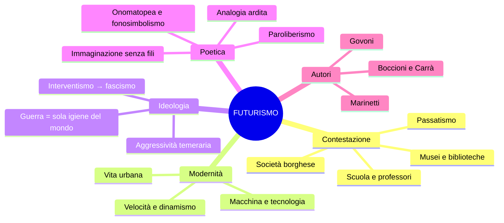
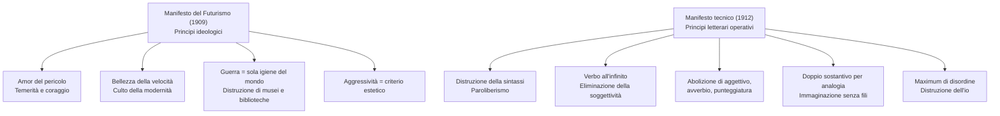

# Il Futurismo — Riassunto

---

## Date fondamentali

| Anno / Data | Evento |
|-------------|--------|
| **1899** | Fondazione della FIAT — simbolo dell'industrializzazione nascente |
| **20 febbraio 1909** | *Manifesto del Futurismo* su *Le Figaro* (Parigi) |
| **1911** | *Manifesto dei pittori futuristi* (Boccioni, Carrà, Russolo) |
| **1912** | *Manifesto tecnico della letteratura futurista* |
| **1913** | Inizio pubblicazione di **Lacerba** (Firenze) |
| **1914** | **Zang Tumb Tumb** di Marinetti |
| **1915** | *Rarefazioni e parole in libertà* di Govoni |

---

## 1. Contesto storico e nascita del movimento

Il Futurismo è il **primo movimento d'avanguardia** italiano, attivo tra il primo e il secondo decennio del Novecento. La parola *avanguardia* viene dal lessico militare — i soldati che vanno in avanscoperta — e indica la volontà di esplorare qualcosa che non era mai stato fatto: innovare radicalmente, rompendo con tutto ciò che precede. Il movimento non si limita alla letteratura: la contestazione è **globale**, investendo arte, teatro, cucina, scuola. Il gruppo pubblica **manifesti** per dare regole nuove a un'arte che vuole uscire da un passato sentito come anacronistico.

L'obiettivo polemico è la **società borghese**, indifferente e repressiva. I **poeti maledetti** francesi (Baudelaire, "perdita dell'aureola", "l'Albatros") avevano già espresso questo disgusto — i futuristi lo radicalizzano in chiave aggressiva: non un ripiegamento malinconico, bensì una sfida diretta. L'artista si scopre **disgustato, declassato, disoccupato**.

Ciò che interessa ai futuristi è la **modernità**: progresso tecnologico, urbanizzazione, industrializzazione nascente. L'automobile è il mito dell'inizio del secolo.

> [!note] Dalla lezione
> La parola *automobile* è stata inventata da **D'Annunzio**, il quale la volle femminile con una motivazione provocatoria: «L'automobile è femminile. Questa ha la grazia, la snellezza, la vivacità di una seduttrice; ha inoltre una virtù ignota alle donne: la perfetta obbedienza.» Un'interpretazione suggestiva e, come era nel suo stile, piuttosto misogina.

Con le avanguardie la letteratura italiana abbandona l'idillio agreste: irrompe l'**eroismo della vita moderna** (Baudelaire) — la vita cittadina, le fabbriche, l'elettricità. L'opera d'arte non è più **irripetibile** ma **riproducibile** attraverso tipografia, stampa, fotografia.

### Il rapporto con D'Annunzio e Nietzsche

Il rapporto con D'Annunzio è ambivalente: i futuristi ne condividono il vitalismo e l'aggressività, ma rifiutano il suo culto della tradizione classica, che è esattamente ciò che vogliono distruggere. Stesso discorso per Nietzsche: nel testo *Contro i professori*, Marinetti rigetta il filosofo del Superuomo perché il suo pensiero resta legato alla grandezza greca — «Il suo Superuomo è un prodotto dell'immaginazione ellenica, costruito coi tre grandi cadaveri putrefatti di Apollo, di Marte e di Bacco» — rendendolo un passatista «coi piedi impacciati da lunghi testi greci».

---

## 2. L'ideologia futurista

Il cuore del programma è un progetto di **eversione**: la distruzione della tradizione. Le formule sono celebri — **«Bruciamo i musei»** (il passato non ha più nulla da dire), **«Uccidiamo il chiaro di luna»** (la tradizione poetica da Petrarca a Leopardi va abbattuta). Museificare le opere significa ucciderle, cristallizzarle nell'immobilismo.

Il rinnovamento coincide con la **mimesi del mondo contemporaneo**: l'arte deve imitare la modernità. I tre valori fondamentali sono il **dinamismo** (la frenesia della città moderna), la **velocità** («La magnificenza del mondo si è arricchita di una bellezza nuova: la bellezza della velocità») e l'**aggressività temeraria**. L'ideologia sottesa è la **glorificazione della guerra**, definita **«sola igiene del mondo»**: manifestazione della forza che spazza via la debolezza. I futuristi sono interventisti e poi vicini al **fascismo**.

> [!note] Dalla lezione
> Le serate futuriste finivano sempre a bottigliate, a cazzotti. Non era un interesse per lo sport: era qualcosa di più aggressivo, che aveva a che fare con la guerra, con la lotta, con le risse. Un'iconoclastia di questo tipo.

---

## 3. I Manifesti

### 3.1 Il Manifesto del Futurismo (1909)

Pubblicato il **20 febbraio 1909** su *Le Figaro* — rivista francese, a significare la vocazione internazionale del movimento. Il testo enuncia i **principi generali** con uno stile militaresco, ritmato dall'**asindeto** e dal **climax ascendente**: la forma rispecchia il contenuto, aggressivo e incalzante.

I principi fondamentali coprono l'intera gamma ideologica del movimento. Sul coraggio: «Noi vogliamo cantare l'amor del pericolo, l'abitudine all'energia e alla temerità. Il coraggio, l'audacia, la ribellione saranno elementi essenziali della nostra poesia.» È una frattura radicale rispetto a Pascoli e Leopardi, la cui letteratura dell'immobilità pensosa viene rovesciata: «Noi vogliamo esaltare il movimento aggressivo, l'insonnia febbrile, il passo di corsa, il salto mortale, lo schiaffo e il pugno.» Sulla velocità: «Noi affermiamo che la magnificenza del mondo si è arricchita di una bellezza nuova: la bellezza della velocità.» Sull'aggressività come criterio estetico: «Non vi è più bellezza se non nella lotta. Nessuna opera che non abbia un carattere aggressivo può essere un capolavoro.» Sulla guerra: «Noi vogliamo glorificare la guerra — sola igiene del mondo — il militarismo, il patriottismo, il gesto distruttore. Noi vogliamo distruggere i musei, le biblioteche, le accademie d'ogni specie.» Il manifesto si chiude con tono epico: «Noi canteremo le locomotive dall'ampio petto, il volo scivolante degli aeroplani. Ed è dall'Italia che lanciamo questo manifesto di violenza travolgente e incendiaria, col quale fondiamo oggi il Futurismo.»

### 3.2 Il Manifesto tecnico della letteratura futurista (1912)

Se il primo manifesto enuncia l'ideologia, questo secondo ne definisce gli strumenti operativi in letteratura. È qui che nasce il **paroliberismo** — parole in libertà — tratto distintivo della scrittura futurista.

La **distruzione della sintassi** è il primo principio: «Bisogna distruggere la sintassi, disponendo i sostantivi a caso, come nascono.» Il verbo va usato **all'infinito** perché «si adatti elasticamente al sostantivo e non lo sottoponga all'io dello scrittore»: senza persona, non vincola l'azione a un soggetto ed esprime il dinamismo. L'**aggettivo va abolito** perché «suppone una sosta, una meditazione» incompatibile con il dinamismo; stesso destino per l'avverbio («vecchia fibbia che tiene unite le parole») e la punteggiatura (le virgole e i punti sono «soste assurde»).

Il principio dell'**analogia** è fondamentale: ogni sostantivo deve essere seguito dal sostantivo «a cui è legato per analogia» — senza congiunzione. Gli esempi: «Uomo-torpediniera, donna-golfo, folla-risacca, piazza-imbuto, porta-rubinetto.» I nessi sono arditi, volutamente oscuri. Marinetti propone di spingersi oltre: del doppio sostantivo, eliminare il primo e lasciare solo il secondo. Il tutto va disposto con «il maximum di disordine», poiché «ogni specie di ordine è fatalmente un prodotto dell'intelligenza cauta». Va distrutto anche l'**io**: «L'uomo completamente avariato dalla biblioteca e dal museo non offre assolutamente più interesse alcuno.»

Il concetto più suggestivo è l'**immaginazione senza fili**: un'immaginazione libera da ogni vincolo logico e sintattico, in cui le immagini si associano senza i "fili" della grammatica. «Giungeremo un giorno ad un'arte ancor più essenziale quando oseremo sopprimere tutti i primi termini delle nostre analogie per non dare più altro che il seguito ininterrotto dei secondi termini.»

---

## 4. Le tecniche: paroliberismo, calligrammi, tavole parolibere

Il paroliberismo si traduce in tecniche concrete che rivoluzionano l'aspetto visivo della pagina. La **tavola parolibera** tratta la pagina come superficie pittorica: parole, lettere, segni grafici e disegni si mescolano liberamente, rifiutando la linearità convenzionale della scrittura. I **caratteri tipografici** diventano strumenti espressivi — il grassetto amplificato corrisponde a voce più forte, gli spazi bianchi esprimono il silenzio, la distanza tra le lettere produce variazioni di ritmo.

Il **calligramma** dispone parole o lettere sulla pagina in modo da riprodurre visivamente l'oggetto descritto. La tradizione è francese — Apollinaire e *Il pleut*, dove le parole scendono come gocce di pioggia — ma i futuristi la mescolano con onomatopee, segni algebrici (più, meno, diviso, parentesi) e veri e propri disegni, ottenendo esiti ancora più radicali.

---

## 5. Autori e opere

### 5.1 Filippo Tommaso Marinetti

Marinetti è l'**animatore del gruppo**: pubblica i manifesti, organizza le serate futuriste, elabora la poetica del movimento. La rivista ufficiale è **Lacerba**, pubblicata a Firenze dal 1913.

**Zang Tumb Tumb** (1914) è la sua opera più celebre: una descrizione **fonosimbolica** di un episodio della guerra d'Africa. Il titolo è un'**onomatopea** che riproduce esplosioni e colpi d'artiglieria. Il testo mette in pratica tutti i principi del Manifesto tecnico: sintassi distrutta, onomatopee proprie, caratteri tipografici come strumento espressivo, segni grafici e algebrici, ripetizioni di lettere («vibraaaare»), disegni. La *Marcia futurista* — tratta da *Zang Tumb Tumb* — è costruita interamente su onomatopee: «Iró iró iró, pic pic, iró iró iró, pac pac. Ma-ga-la, ma-ga-la. Ran ran ran za, ran ran ran za.»

> [!note] Dalla lezione
> La professoressa ha chiesto a degli studenti di leggere il testo ad alta voce: la modalità di lettura deve variare a seconda dei caratteri tipografici — le scritte più grandi si leggono con voce più forte, i caratteri più piccoli con voce più sottile. La lettura stessa diventa una performance in cui il corpo riproduce i suoni della marcia.

**Contro i professori** attacca la scuola come simbolo del passatismo. Il testo si apre con il rifiuto di Nietzsche: il suo Superuomo è «un prodotto dell'immaginazione ellenica, costruito coi tre grandi cadaveri putrefatti di Apollo, di Marte e di Bacco» — dunque un passatista. All'Übermensch greco i futuristi oppongono **l'uomo moltiplicato per opera propria**: «Nemico del libro, amico dell'esperienza personale, allievo della macchina, munito di fiuto felino, di fulminei calcoli, di istinto selvaggio, di astuzia e di temerità.» I tre nemici dell'arte sono **imitazione, prudenza e denaro** — tutti riducibili alla **viltà**. Le università sono «grandi fogne dell'intellettualità»; i professori «vogliono soffocare l'indomabile energia della gioventù italiana». Il progetto di scuola futurista prevede un **corso regolare di rischi e pericoli fisici** — incendi, annegamenti, crolli — per temprare il corpo attraverso l'esperienza diretta del pericolo.

> [!note] Dalla lezione
> Emerge il paradosso di una scuola che «sopprime il pensiero critico». L'interesse futurista per il fisico non è per lo sport in senso positivo, ma per qualcosa di più aggressivo che ha a che fare con la guerra e le risse.

### 5.2 Corrado Govoni — Il palombaro (1915)

Corrado Govoni (1884–1965) è il principale rappresentante della **poesia visiva** futurista. La raccolta *Rarefazioni e parole in libertà* (1915) raccoglie le sue sperimentazioni. *Il palombaro* riproduce la **vita sottomarina** attraverso disegni, variazioni tipografiche e analogie ardite: la **medusa** è un «ombrello dimenticante» (somiglianza di forma), l'**attinia** è un «ceppo insanguinato dove lasciarono i capelli serpentine le sirene decapitate» (le foglie ondulate dell'attinia richiamano i capelli delle sirene). La poesia si percepisce in modo **simultaneo**, attraverso i segni visivi. Altrove nella raccolta compare la fusione tra parole e segni algebrici: «bucato + bagno + ballo = primo amore», e la serie «Sole, schiuma, onde, mare» dove una sequenza di **"m"** riproduce visivamente l'andamento ondulatorio del mare — la lettera diventa immagine.

---

## 6. La pittura futurista

Il *Manifesto dei pittori futuristi* (1911, Boccioni, Carrà, Russolo) applica gli stessi principi all'arte visiva: riprodurre il movimento in un medium statico. *Dinamismo di un cane al guinzaglio* di **Giacomo Balla** rappresenta il movimento come rapida sequenza di posizioni successive delle zampe del cagnolino e della gonna della dama — un espediente che anticipa il cinema. *Forme uniche della continuità nello spazio* di **Umberto Boccioni** — la scultura riprodotta sui venti centesimi di euro — realizza lo stesso principio nel bronzo: attraverso linee fluide e continue, un materiale pesante diventa dinamismo.

> [!note] Dalla lezione
> Boccioni realizza in scultura lo stesso principio che Marinetti applica in letteratura: rendere dinamico ciò che per natura è statico — il bronzo, la pagina stampata. La sfida è la stessa: catturare il movimento.

---

## 7. Rapporto col passato e col fascismo

Sul versante della rottura, la posizione futurista è netta: tutto il passato va distrutto. «Al terremoto, loro unico alleato, i futuristi dedicano queste rovine di Roma e di Atene.» In questo il Futurismo si separa radicalmente da D'Annunzio, che pur condividendo il vitalismo rimane legato al mito classico. Sul versante politico, l'esaltazione della guerra e del gesto distruttore converge nell'**interventismo** e poi nella vicinanza al **fascismo** — Marinetti stesso vi aderì inizialmente. Questa vicinanza ideologica rende il Futurismo storicamente controverso: la sua eredità artistica va letta separandola dalle sue implicazioni politiche. Le innovazioni formali — paroliberismo, poesia visiva, simultaneità delle percezioni, calligrammi, tavole parolibere — restano acquisizioni fondamentali della modernità artistica.
