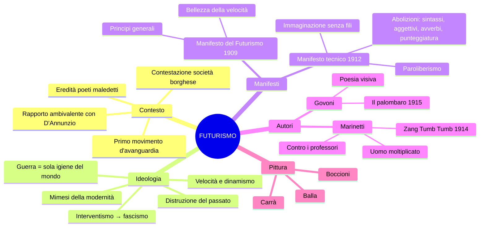

# Il Futurismo — Riassunto

---

## Date fondamentali

| Anno | Evento |
|------|--------|
| **1909** | *Manifesto del Futurismo* su *Le Figaro* (Parigi) |
| **1912** | *Manifesto tecnico della letteratura futurista* |
| **1913** | Inizio pubblicazione di **Lacerba** (Firenze) |
| **1914** | **Zang Tumb Tumb** di Marinetti |
| **1915** | *Rarefazioni e parole in libertà* di Govoni |

---

## 1. Il movimento e il suo contesto

Il Futurismo è il **primo movimento d'avanguardia** italiano, attivo tra il primo e il secondo decennio del Novecento. Il termine *avanguardia* viene dal lessico militare (i soldati che vanno in avanscoperta) e indica la volontà di esplorare territori inesplorati, di innovare radicalmente.

La contestazione futurista è **globale**: non riguarda solo la letteratura, ma anche l'arte, il teatro, la società intera. L'obiettivo polemico è la **società borghese**, indifferente e repressiva nei confronti dell'arte — un tema già presente nei poeti maledetti francesi (Baudelaire, "perdita dell'aureola"), che i futuristi però radicalizzano in chiave aggressiva. L'artista si scopre **disgustato, declassato, disoccupato**.

Ciò che interessa ai futuristi è la **modernità**: il progresso tecnologico, l'urbanizzazione, l'industrializzazione nascente. La macchina — l'automobile, il treno, l'aereo — è il nuovo mito. La letteratura abbandona l'idillio agreste e le tematiche naturalistiche: irrompe quello che Baudelaire chiama l'**eroismo della vita moderna**. L'opera d'arte non è più irripetibile, bensì **riproducibile** attraverso tipografia, stampa, fotografia.

Il rapporto con **D'Annunzio** è ambivalente: i futuristi condividono il vitalismo e l'aggressività dannunziana, ma rifiutano il suo culto della tradizione classica e del mito. Lo stesso vale per **Nietzsche**: il suo Superuomo viene rigettato perché legato alla grandezza greca — «un passatista coi piedi impacciati da lunghi testi greci».

---

## 2. L'ideologia

Il cuore del Futurismo è un progetto di **eversione** — la distruzione della tradizione. Le formule celebri riassumono il programma: **«Bruciamo i musei»** (il passato non ha nulla da dire), **«Uccidiamo il chiaro di luna»** (la tradizione poetica da Petrarca a Leopardi va abbattuta). Museificare le opere d'arte significa ucciderle.

Il rinnovamento coincide con la **mimesi del mondo contemporaneo**: l'arte deve imitare la modernità. I tre valori fondamentali sono il **dinamismo** (la frenesia della vita urbana), la **velocità** (dell'automobile, del treno, dell'aereo) e l'**aggressività temeraria** (l'amore per il pericolo e la lotta).

L'ideologia sottesa è la **glorificazione della guerra**, definita **«sola igiene del mondo»**: manifestazione della forza che spazza via la debolezza. I futuristi sono **interventisti** e poi vicini al **fascismo**. Esaltano l'istinto, l'aggressività, il combattimento.

---

## 3. I Manifesti

### 3.1 Manifesto del Futurismo (1909)

Pubblicato su *Le Figaro* il **20 febbraio 1909**, enuncia i **principi generali** del movimento. Lo stile è militaresco, ritmato dall'**asindeto** e dal **climax ascendente**. Principi chiave:

- Esaltazione del pericolo, del coraggio, della ribellione contro l'immobilità e l'estasi del passato
- «La magnificenza del mondo si è arricchita di una bellezza nuova: **la bellezza della velocità**»
- «**Nessuna opera che non abbia un carattere aggressivo può essere un capolavoro**»
- La guerra come **sola igiene del mondo**; distruzione di musei, biblioteche, accademie
- La modernità come nuovo Dio: l'«eterna velocità onnipresente» ha sostituito il sacro tradizionale

### 3.2 Manifesto tecnico della letteratura futurista (1912)

Definisce gli **strumenti operativi** della scrittura futurista — il **paroliberismo** (parole in libertà):

| Principio | Motivazione |
|-----------|-------------|
| **Distruzione della sintassi** | Sostantivi disposti a caso, come nascono |
| **Verbo all'infinito** | Elimina la soggettività e esprime dinamismo |
| **Abolizione dell'aggettivo** | Rallenta la comunicazione, presuppone una sosta |
| **Abolizione dell'avverbio** | «Vecchia fibbia» che conserva un'unità di tono fastidiosa |
| **Doppio sostantivo per analogia** | Es. uomo-torpediniera, donna-golfo, folla-risacca |
| **Abolizione della punteggiatura** | Le virgole e i punti sono «soste assurde» |
| **Maximum di disordine** | L'ordine è prodotto dell'intelligenza cauta |
| **Distruzione dell'io** | L'uomo «avariato» dalla cultura è senza interesse |
| **Immaginazione senza fili** | Associazioni libere, senza vincoli logici o sintattici |

L'espressione **immaginazione senza fili** è fondamentale: indica un'immaginazione libera da ogni vincolo, in cui le immagini si associano senza i "fili" della logica e della grammatica.

---

## 4. Autori e opere

### 4.1 Marinetti — Animatore del gruppo

Marinetti è il punto di riferimento teorico e organizzativo del Futurismo. La rivista del movimento è **Lacerba**, pubblicata a Firenze dal 1913.

**Zang Tumb Tumb** (1914): descrizione fonosimbolica di un episodio della guerra d'Africa. Il titolo stesso è un'**onomatopea**. Il testo usa onomatopee proprie, **caratteri tipografici** (grassetto = voce più forte, spazi bianchi = silenzio, distanza tra lettere = variazione di ritmo), **segni grafici e algebrici**, ripetizioni di lettere («vibraaaare»), **calligrammi** (parole disposte a riprodurre la forma dell'oggetto) e disegni. Si realizza una **simultaneità di percezioni** attraverso la vista e l'evocazione sonora.

**Contro i professori**: attacco alla scuola come simbolo del passatismo. I professori «castrano gli spiriti che devono creare l'avvenire». All'Übermensch di Nietzsche i futuristi oppongono l'**uomo moltiplicato per opera propria**: nemico del libro, amico dell'esperienza, allievo della macchina. I tre nemici dell'arte sono **imitazione, prudenza e denaro** = la **viltà**. Il progetto di scuola futurista prevede un «corso regolare di rischi e pericoli fisici».

### 4.2 Govoni — Il palombaro (1915)

Corrado Govoni (1884-1965), autore di **poesia visiva**, pubblica *Rarefazioni e parole in libertà* (1915). *Il palombaro* riproduce la vita sottomarina con disegni, caratteri tipografici e analogie: la medusa è un «ombrello dimenticante», l'attinia un «ceppo insanguinato dove lasciarono i capelli serpentine le sirene decapitate». La poesia si percepisce in modo **simultaneo**: immagini e suoni evocati attraverso segni visivi.

---

## 5. La pittura futurista

Il *Manifesto dei pittori futuristi* (1911, Boccioni, Carrà, Russolo) applica gli stessi principi all'arte visiva. Opere chiave:

- **Balla**, *Dinamismo di un cane al guinzaglio*: il movimento rappresentato come rapida sequenza di posizioni successive
- **Boccioni**, *Forme uniche della continuità nello spazio*: il dinamismo espresso nel bronzo attraverso linee fluide (la scultura sui venti centesimi)

Il principio è lo stesso di Marinetti in letteratura: rendere dinamico ciò che per natura è statico.

