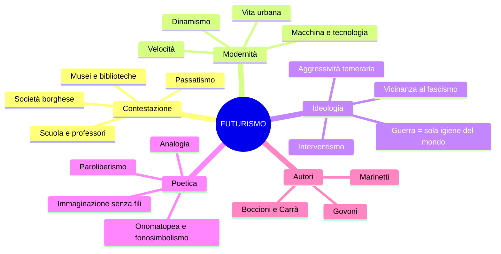
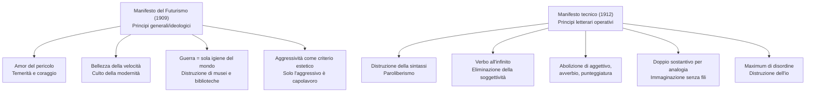
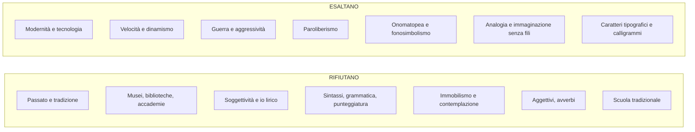

# Il Futurismo — Riassunto

---

## Date fondamentali

| Anno / Data | Evento |
|-------------|--------|
| **1899** | Fondazione della FIAT — simbolo dell'industrializzazione nascente |
| **20 febbraio 1909** | Pubblicazione del *Manifesto del Futurismo* su *Le Figaro* (Parigi) |
| **1911** | *Manifesto dei pittori futuristi* (Boccioni, Carrà, Russolo) |
| **1912** | *Manifesto tecnico della letteratura futurista* |
| **1913** | Inizio pubblicazione della rivista **Lacerba** (Firenze) |
| **1914** | Pubblicazione di **Zang Tumb Tumb** di Marinetti |
| **1915** | *Rarefazioni e parole in libertà* di Corrado Govoni |

---

## 1. Contesto storico e nascita del movimento

### 1.1 Il primo movimento d'avanguardia

Il Futurismo è il **primo movimento d'avanguardia** italiano, sviluppatosi nel primo decennio del Novecento. Il termine *avanguardia* viene dal lessico militare: indica i soldati che precedono la guardia, che esplorano il territorio prima degli altri. Allo stesso modo, il Futurismo si propone di **innovare** rompendo con tutto ciò che lo precede, investendo con la sua furia rinnovatrice non soltanto la letteratura, ma anche l'arte, il teatro e persino la cucina. Per affermare il proprio programma, il gruppo pubblica una serie di **manifesti** che stabiliscono regole nuove contro un passato sentito come anacronistico.

### 1.2 La contestazione della società borghese

L'obiettivo polemico dei futuristi è la **società borghese**, accusata di essere indifferente e repressiva verso l'arte. I **poeti maledetti** francesi — Baudelaire in testa — avevano già espresso il disgusto per una società che non riconosce più il ruolo del poeta. I futuristi raccolgono questa eredità e la radicalizzano, lanciando una sfida aggressiva al mondo borghese. L'artista futurista si scopre **antagonista della classe dominante**, si dichiara disgustato e declassato. Con la nuova società industriale si conclude il mito della solitudine creativa: l'artista partecipa al processo produttivo e accetta le regole del mercato.

### 1.3 L'irruzione della modernità

I futuristi sono affascinati dalla **modernità**: progresso tecnologico, urbanizzazione, industrializzazione. L'Italia del primo Novecento è ancora prevalentemente agricola, ma il processo industriale è in pieno avvio — basti pensare alla fondazione della FIAT nel 1899. L'automobile è il **mito** dell'epoca: un bene di lusso ammirato, non ancora alla portata di tutti. Con le avanguardie, la letteratura italiana abbandona il mito agreste e il paesaggio naturalistico per abbracciare quello che Baudelaire chiama l'**eroismo della vita moderna**: la città, il traffico, le luci delle fabbriche, l'elettricità.

> [!note] Dalla lezione
> La parola *automobile* è stata inventata da **D'Annunzio**, che decise fosse di genere femminile con una motivazione provocatoria: «L'automobile è femminile. Questa ha la grazia, la snellezza, la vivacità di una seduttrice; ha inoltre una virtù ignota alle donne: la perfetta obbedienza.»

### 1.4 Il rapporto con D'Annunzio

Il rapporto del Futurismo con D'Annunzio è ambivalente. Da un lato i futuristi condividono con lui l'esaltazione della forza, dell'aggressività e del vitalismo; dall'altro rifiutano il culto del passato che D'Annunzio incarna — la sua ammirazione per la tradizione classica e per la bellezza antica è esattamente ciò che il Futurismo vuole distruggere. Nel testo *Contro i professori*, Marinetti prende le distanze anche da **Nietzsche** — caro a D'Annunzio — perché il suo pensiero è ancora legato alla grandezza della cultura greca: «Il suo Superuomo è un prodotto dell'immaginazione ellenica, costruito coi tre grandi cadaveri putrefatti di Apollo, di Marte e di Bacco.»

---

## 2. L'ideologia futurista

### 2.1 La sconsacrazione del passato

Il cuore del programma futurista è un progetto di **eversione radicale**: il passato perde ogni sacralità. Le formule sono celebri e provocatorie:

- **«Bruciamo i musei»**: i musei conservano un passato che non ha più nulla da dire al presente
- **«Uccidiamo il chiaro di luna»**: il chiaro di luna è un simbolo della tradizione poetica da Petrarca a Leopardi, e va abbattuto
- La **museificazione** dell'arte è un atto di morte: cristallizza le opere nell'immobilismo

La tradizione è vista come un **carcere** da cui liberarsi. Ogni forma di culto del passato — dalla scuola ai musei, dalle biblioteche alle accademie — rappresenta un ostacolo alla creatività.

### 2.2 Dinamismo, velocità, aggressività

Il rinnovamento futurista coincide con la **mimesi del mondo contemporaneo**: l'arte deve imitare la modernità. Il **dinamismo** è il principio fondamentale, e la **velocità** viene elevata a valore estetico supremo: «La magnificenza del mondo si è arricchita di una bellezza nuova: la bellezza della velocità.» L'**aggressività temeraria** completa il quadro: l'amore per il pericolo e la ribellione sono elementi essenziali della nuova poesia. I temi prediletti riflettono questa poetica: auto e treni in corsa, aeroplani, fabbriche, folla, luci elettriche, guerra e battaglie.

### 2.3 La glorificazione della guerra

L'ideologia futurista si fonda sulla **glorificazione della guerra**, definita con un'espressione fondamentale: la guerra come **«sola igiene del mondo»**. A questa si accompagna l'esaltazione dell'istinto e dell'aggressività. Non è un caso che i futuristi si collocassero tra gli **interventisti** prima della Prima guerra mondiale, per poi avvicinarsi al **fascismo**.

---

## 3. I Manifesti

### 3.1 Il Manifesto del Futurismo (1909)

Il *Manifesto del Futurismo* viene pubblicato il **20 febbraio 1909** su *Le Figaro* — il fatto che la prima pubblicazione avvenga in francese e su una rivista straniera è significativo della vocazione internazionale del movimento. Il manifesto enuncia i **principi generali** dell'ideologia futurista in punti numerati, con un linguaggio quasi **militaresco**, scandito dall'**asindeto** e dal **climax ascendente**: lo stile rispecchia il contenuto, è aggressivo e incalzante.

I punti fondamentali sono:
- **Amor del pericolo e temerità**: «Il coraggio, l'audacia, la ribellione saranno elementi essenziali della nostra poesia», in rottura con la letteratura dell'immobilità pensosa di Pascoli e Leopardi.
- **Bellezza della velocità**: «La magnificenza del mondo si è arricchita di una bellezza nuova: la bellezza della velocità.»
- **Aggressività come criterio estetico**: «Non vi è più bellezza se non nella lotta. Nessuna opera che non abbia un carattere aggressivo può essere un capolavoro.»
- **Guerra e distruzione**: «Noi vogliamo glorificare la guerra — sola igiene del mondo — il militarismo, il patriottismo, il gesto distruttore.»
- **Distruzione di musei e biblioteche**: «Noi vogliamo distruggere i musei, le biblioteche, le accademie d'ogni specie.»

### 3.2 Il Manifesto tecnico della letteratura futurista (1912)

Il *Manifesto tecnico* stabilisce i principi operativi della scrittura futurista. Se il primo manifesto enuncia l'ideologia, questo secondo ne definisce gli strumenti. Nasce qui il concetto di **paroliberismo** — parole in libertà — tratto distintivo della letteratura futurista.

Le regole fondamentali sono:
- **Distruzione della sintassi**: «Bisogna distruggere la sintassi, disponendo i sostantivi a caso, come nascono.» La sintassi è una gabbia da abbattere.
- **Verbo all'infinito**: elimina la soggettività (essendo senza persona, non vincola l'azione a un soggetto) ed esprime il **dinamismo**, perché non è impedito dal pronome.
- **Abolizione dell'aggettivo**: rallenta la comunicazione e presuppone una pausa riflessiva incompatibile con il dinamismo. «Il sostantivo nudo deve conservare il suo colore essenziale.»
- **Abolizione dell'avverbio**: «vecchia fibbia che tiene unite l'una all'altra le parole».
- **Abolizione della punteggiatura**: conseguenza naturale della soppressione di aggettivi, avverbi e congiunzioni.
- **Doppio sostantivo per analogia**: «Ogni sostantivo deve avere il suo doppio, cioè il sostantivo deve essere seguito, senza congiunzione, dal sostantivo a cui è legato per analogia.» Esempi: «Uomo-torpediniera, donna-golfo, folla-risacca, piazza-imbuto.»
- **Maximum di disordine**: «Bisogna orchestrare le immagini disponendole secondo un maximum di disordine.»
- **Immaginazione senza fili**: un'immaginazione libera da ogni vincolo logico, sintattico e tradizionale.

---

## 4. Gli autori e le opere

### 4.1 Filippo Tommaso Marinetti

Marinetti è l'**animatore del gruppo** futurista, punto di riferimento teorico e organizzativo. È lui che pubblica i manifesti e organizza le serate futuriste. La rivista **Lacerba**, pubblicata a Firenze dal 1913, è l'organo ufficiale del movimento in Italia.

**Zang Tumb Tumb (1914):** l'opera poetica più celebre di Marinetti è una descrizione **fonosimbolica** di un episodio della guerra d'Africa. Il titolo stesso è un'**onomatopea** che riproduce i suoni delle esplosioni. Il testo mette in pratica tutti i principi del Manifesto tecnico: la sintassi è distrutta, il ritmo riproduce i suoni della battaglia. Marinetti usa i **caratteri tipografici** come strumento espressivo: il grassetto amplificato corrisponde a una voce più forte, gli spazi bianchi esprimono il silenzio, la distanza tra le lettere varia il ritmo. Compaiono anche **segni algebrici**, **ripetizioni di lettere** («vibraaaare») e **disegni**.

**Contro i professori:** il testo si colloca nella polemica futurista contro il **passatismo** scolastico. Marinetti rifiuta Nietzsche perché il suo Superuomo è «un prodotto dell'immaginazione ellenica, costruito coi tre grandi cadaveri putrefatti di Apollo, di Marte e di Bacco». Al Superuomo greco, i futuristi oppongono **l'uomo moltiplicato**: «Nemico del libro, amico dell'esperienza personale, allievo della macchina, lucido nell'ampio della sua ispirazione, munito di fiuto felino, di fulminei calcoli, di istinto selvaggio.» Le università sono definite «grandi fogne dell'intellettualità». Tre sono i nemici dell'arte: **l'imitazione, la prudenza e il denaro**, riducibili a uno solo: la **viltà**. La scuola futurista consisterebbe nell'introdurre un corso regolare di **rischi fisici** — incendi, annegamenti, crolli — per temprare il corpo e lo spirito.

### 4.2 Corrado Govoni (1884-1965)

Govoni è il principale rappresentante della **poesia visiva** futurista. La sua raccolta *Rarefazioni e parole in libertà* (1915) offre esempi paradigmatici di come le parole diventino immagine.

**Il palombaro (1915):** poesia che riproduce il fermento della vita sottomarina attraverso disegni, caratteri tipografici e analogie ardite. La poesia si percepisce in modo **simultaneo**, attraverso segni visivi e variazioni tipografiche. Tra le analogie: la **medusa** è un «ombrello dimenticante» (per la somiglianza di forma), l'**attinia** è descritta come «ceppo insanguinato dove lasciarono i capelli serpentine le sirene decapitate». Un altro esempio govoniano: «bucato + bagno + ballo = primo amore», che mescola parole e segni algebrici.

---

## 5. La pittura futurista

I pittori futuristi composero il *Manifesto dei pittori futuristi* (1911), firmato da **Boccioni**, **Carrà** e **Russolo**. Il principio fondamentale è lo stesso della letteratura: riprodurre il **movimento** e il **dinamismo**.

*Dinamismo di un cane al guinzaglio* di **Giacomo Balla** rappresenta il movimento attraverso una rapida sequenza di posizioni successive delle zampe — un espediente che anticipa il linguaggio del cinema. *Forme uniche della continuità nello spazio* di **Umberto Boccioni** (la scultura sui venti centesimi di euro) riesce a esprimere il dinamismo attraverso il bronzo grazie a linee fluide e continue: è la stessa sfida di Marinetti in letteratura — rendere dinamico ciò che per sua natura è statico.

---

## 6. Sintesi della poetica futurista

Il Futurismo rappresenta una **frattura radicale** nella storia della letteratura italiana: il primo movimento a rifiutare programmaticamente tutto ciò che lo precede, non per superarlo ma per distruggerlo. Le sue posizioni ideologiche — glorificazione della guerra, disprezzo per la cultura, vicinanza al fascismo — ne fanno un movimento controverso; le sue innovazioni formali — paroliberismo, poesia visiva, simultaneità delle percezioni — restano acquisizioni fondamentali della modernità artistica.
