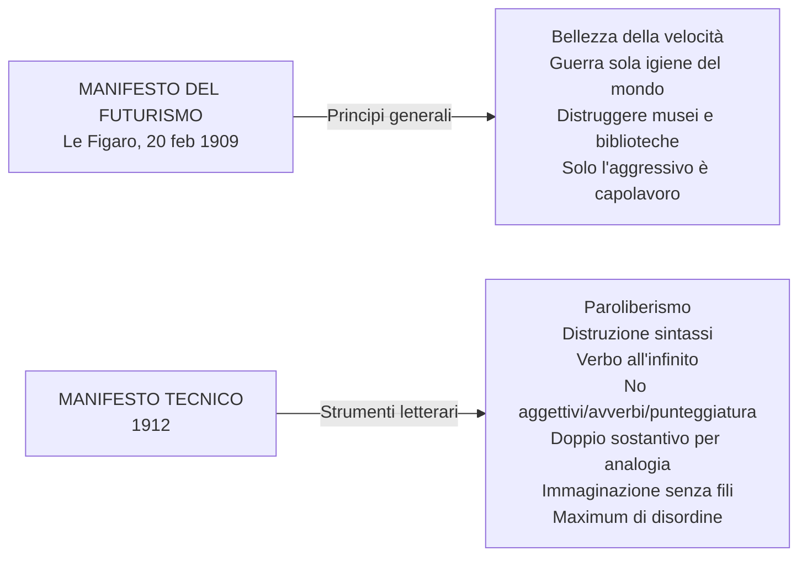
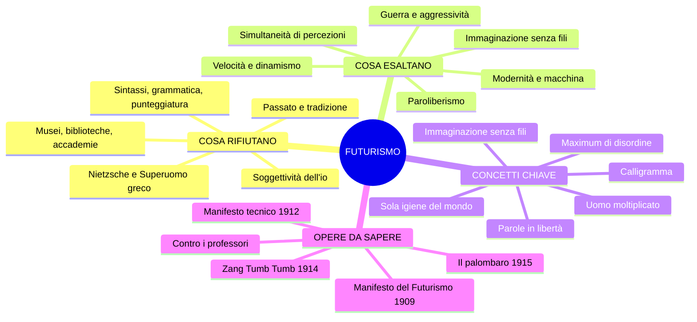

# Il Futurismo — Ripasso veloce

---

## Quadro d'insieme

Il Futurismo è il **primo movimento d'avanguardia** italiano (1909-1920 ca.). *Avanguardia* = termine militare, chi va in avanscoperta. Contestazione **globale** (non solo letteraria) della società borghese e della tradizione. L'artista si sente **disgustato, declassato, disoccupato**. Il modello è l'**eroismo della vita moderna** (Baudelaire): velocità, macchine, vita urbana, industria. L'opera d'arte diventa **riproducibile** (tipografia, stampa, fotografia).

Rapporto con **D'Annunzio**: condividono il vitalismo e l'aggressività, ma rifiutano il suo culto del passato. Rifiutano anche **Nietzsche** (Superuomo legato alla cultura greca = passatismo).

---

## Ideologia

**Sconsacrazione del passato** → «Bruciamo i musei», «Uccidiamo il chiaro di luna». La tradizione è un carcere. Museificare = uccidere.

**Tre valori fondamentali**: dinamismo, velocità, aggressività temeraria.

**Guerra = «sola igiene del mondo»** → interventismo → vicinanza al fascismo.

---

## I due Manifesti

**Paroliberismo** = parole in libertà. **Verbo all'infinito** perché elimina la soggettività e esprime dinamismo. **Aggettivo abolito** perché rallenta (presuppone una sosta). **Doppio sostantivo per analogia**: uomo-torpediniera, donna-golfo, folla-risacca. **Immaginazione senza fili**: associazioni libere, senza vincoli logici. Obiettivo: **maximum di disordine**, distruzione dell'io.

---

## Autori e opere

### Marinetti — Animatore del gruppo

Rivista: **Lacerba** (Firenze, dal 1913). Collaboratori: Boccioni, Carrà.

**Zang Tumb Tumb** (1914): descrizione fonosimbolica della guerra d'Africa. Titolo = onomatopea. Tecniche: onomatopea propria, **caratteri tipografici** (grassetto = voce forte, spazi = silenzio), segni grafici/algebrici, **calligrammi** (parole che disegnano l'oggetto), ripetizioni di lettere. → **Simultaneità di percezioni**.

**Contro i professori**: attacco al passatismo. Rifiuto di Nietzsche (il suo Superuomo è greco = passatista). L'alternativa futurista: **l'uomo moltiplicato per opera propria** — nemico del libro, allievo della macchina. Tre nemici dell'arte: imitazione, prudenza, denaro = **viltà**. I professori «castrano gli spiriti». La scuola futurista: «corso regolare di rischi e pericoli fisici».

### Govoni — Il palombaro (1915)

Da *Rarefazioni e parole in libertà*. **Poesia visiva**: la vita sottomarina resa con disegni, caratteri tipografici, analogie. Medusa = «ombrello dimenticante». Attinia = «ceppo insanguinato dove lasciarono i capelli serpentine le sirene decapitate». Percezione **simultanea** (vista + suono).

---

## Pittura futurista

Manifesto dei pittori futuristi (1911): Boccioni, Carrà, Russolo.

- **Balla**, *Dinamismo di un cane al guinzaglio*: sequenza rapida di posizioni → movimento
- **Boccioni**, *Forme uniche della continuità nello spazio*: dinamismo nel bronzo (la scultura sui 20 centesimi)

---

## Schema riepilogativo

---

## Checklist pre-esame

- [ ] Sai spiegare perché il Futurismo è il "primo movimento d'avanguardia"?
- [ ] Sai dire cos'è il **paroliberismo** e l'**immaginazione senza fili**?
- [ ] Ricordi la data del Manifesto del Futurismo (1909) e dove fu pubblicato (Le Figaro)?
- [ ] Sai elencare almeno 5 principi del Manifesto tecnico?
- [ ] Sai spiegare cosa sono **Zang Tumb Tumb** e **Il palombaro** e le tecniche usate?
- [ ] Sai spiegare il rapporto dei futuristi con D'Annunzio e con Nietzsche?
- [ ] Ricordi la definizione di guerra come «sola igiene del mondo»?
- [ ] Sai spiegare *Contro i professori* e il concetto di «uomo moltiplicato»?
