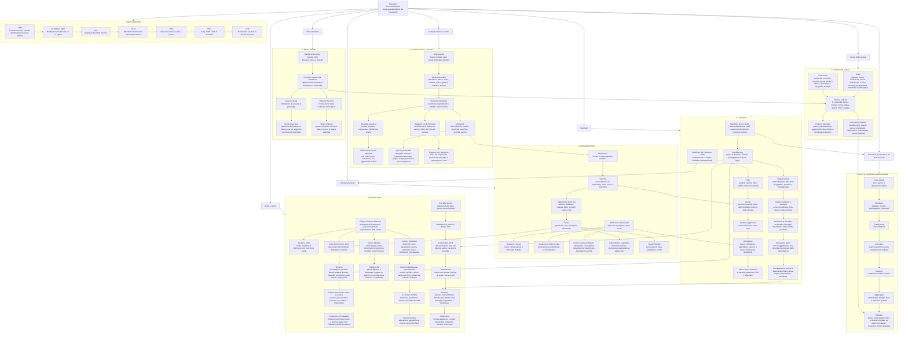

```mermaid
flowchart TD
    F["Futurismo<br/>primo movimento d'avanguardia italiano del Novecento"] --> C["Contesto storico e nascita"]
    F --> I["Ideologia futurista"]
    F --> M["Manifesti"]
    F --> A["Autori e opere"]
    F --> P["Pittura futurista"]
    F --> S["Sintesi della poetica"]
    F --> T["Procedura per costruire un testo futurista"]

    subgraph DATE["Date fondamentali"]
        D1899["1899<br/>Fondazione FIAT: simbolo dell'industrializzazione italiana"]
        D1909["20 febbraio 1909<br/>Manifesto del Futurismo su Le Figaro"]
        D1911["1911<br/>Manifesto dei pittori futuristi"]
        D1912["1912<br/>Manifesto tecnico della letteratura futurista"]
        D1913["1913<br/>Nasce la rivista Lacerba a Firenze"]
        D1914["1914<br/>Zang Tumb Tumb di Marinetti"]
        D1915["1915<br/>Rarefazioni e parole in libertà di Govoni"]
        D1899 --> D1909 --> D1911 --> D1912 --> D1913 --> D1914 --> D1915
    end
    F --> DATE

    subgraph CONTESTO["1. Contesto storico e nascita"]
        C1["Avanguardia<br/>lessico militare: stare avanti, precedere il tempo"]
        C2["Movimento totale<br/>letteratura, pittura, teatro, musica, cucina, grafica, costume, società"]
        C3["Strumento principale<br/>manifesto programmatico, pubblico e provocatorio"]
        C4["Bersaglio polemico<br/>società borghese repressiva e indifferente all'arte"]
        C5["Differenza dai poeti maledetti<br/>non malinconia o isolamento, ma aggressività e sfida"]
        C6["Modernità<br/>città, fabbriche, traffico, elettricità, macchine, velocità, rumore"]
        C7["Opera riproducibile<br/>tipografia, stampa e fotografia trasformano pagina e impaginazione in mezzi espressivi"]
        C8["Rapporto con D'Annunzio<br/>condivisione di vitalismo e azione, rifiuto del culto del passato"]
        C9["Rapporto con Nietzsche<br/>rifiuto del Superuomo perché ancora legato a cultura greca e mito"]
        C1 --> C2 --> C3
        C3 --> C4 --> C5
        C3 --> C6 --> C7
        C3 --> C8 --> C9
    end
    C --> CONTESTO

    subgraph IDEOLOGIA["2. Ideologia futurista"]
        I1["Distruzione del passato<br/>il passato è prigione e peso morto"]
        I2["Bruciamo i musei<br/>contro conservazione e immobilità dell'arte"]
        I3["Uccidiamo il chiaro di luna<br/>contro poesia sentimentale e contemplativa"]
        I4["Contro scuola, professori, biblioteche e accademie<br/>istituzioni che trasformano il passato in autorità"]
        I5["Dinamismo<br/>mondo in trasformazione continua"]
        I6["Velocità<br/>nuova bellezza di automobile, treno, aereo e macchina"]
        I7["Aggressività temeraria<br/>pericolo, ribellione, coraggio fisico, schiaffo, pugno, lotta"]
        I8["Guerra<br/>glorificata come sola igiene del mondo"]
        I9["Interventismo e fascismo<br/>vicinanza politica e ideologica al nazionalismo aggressivo"]
        I10["Serate futuriste<br/>provocazione, risse, bottigliate e scontri"]
        I1 --> I2
        I1 --> I3
        I1 --> I4
        I5 --> I6 --> I7
        I7 --> I8 --> I9
        I8 --> I10
    end
    I --> IDEOLOGIA

    subgraph MANIFESTI["3. I manifesti"]
        M1909["Manifesto del Futurismo, 1909<br/>pubblicato su Le Figaro: ambizione internazionale"]
        M1909A["Stile<br/>asindeti, elenchi, ritmo rapido, climax ascendenti"]
        M1909B["Nuclei<br/>pericolo, temerità, rifiuto dell'immobilità, bellezza della velocità"]
        M1909C["Estetica aggressiva<br/>nessuna bellezza senza lotta"]
        M1909D["Distruzione<br/>guerra, militarismo, patriottismo, attacco a musei, biblioteche, accademie"]
        M1909E["Nuovo sacro moderno<br/>la velocità sostituisce il Dio tradizionale"]
        M1912["Manifesto tecnico della letteratura futurista, 1912<br/>trasforma l'ideologia in regole di scrittura"]
        M1912A["Paroliberismo<br/>parole in libertà da sintassi, punteggiatura e vincoli logici"]
        M1912B["Regole formali<br/>verbo all'infinito, abolizione di aggettivo, avverbio e punteggiatura"]
        M1912C["Doppio sostantivo e analogia<br/>uomo-torpediniera, folla-risacca, piazza-imbuto"]
        M1912D["Maximum di disordine<br/>orchestrare immagini disordinate contro l'ordine prudente"]
        M1912E["Distruzione dell'io<br/>non il soggetto lirico, ma l'energia impersonale della vita moderna"]
        M1912F["Immaginazione senza fili<br/>associazioni libere senza logica, grammatica e tradizione"]
        M1909 --> M1909A --> M1909B --> M1909C --> M1909D --> M1909E
        M1912 --> M1912A --> M1912B --> M1912C --> M1912D --> M1912E --> M1912F
    end
    M --> MANIFESTI
    M1909 --> I
    M1912 --> T

    subgraph AUTORI["4. Autori e opere"]
        MAR["Filippo Tommaso Marinetti<br/>animatore del movimento, autore di manifesti, organizzatore delle serate"]
        LAC["Lacerba, 1913<br/>rivista fiorentina di riferimento con Boccioni e Carrà"]
        ZTT["Zang Tumb Tumb, 1914<br/>descrizione fonosimbolica della guerra d'Africa"]
        ZTT1["Tecniche<br/>onomatopee, parole in libertà, sintassi distrutta, tipografia espressiva, spazi bianchi, segni grafici"]
        ZTT2["Pagina come spazio visivo e acustico<br/>volume, pausa e ritmo passano da caratteri e disposizione"]
        ZTT3["Confronto con Ungaretti<br/>entrambi valorizzano vuoto e parola isolata, ma il Futurismo glorifica la guerra"]
        MF["Marcia futurista<br/>onomatopee e ritmo performativo trasformano la lettura in performance"]
        MF1["Calligramma<br/>parole disposte a disegnare l'oggetto, in dialogo con poesia visiva francese e Apollinaire"]
        CP["Contro i professori<br/>polemica contro passatismo, scuola, università, musei, biblioteche e accademie"]
        CP1["Uomo moltiplicato per opera propria<br/>nemico del libro, allievo della macchina, guidato da volontà e temerità"]
        CP2["Tre nemici dell'arte<br/>imitazione, prudenza e denaro, ricondotti alla viltà"]
        CP3["Scuola futurista<br/>educazione aggressiva al rischio e ai pericoli fisici"]
        GOV["Corrado Govoni<br/>rappresentante della poesia visiva futurista"]
        RPL["Rarefazioni e parole in libertà, 1915"]
        PAL["Il palombaro, 1915<br/>vita sottomarina resa con disegni, parole, caratteri e analogie"]
        PAL1["Simultaneità<br/>lettura non lineare: insieme di segni visivi e sonori"]
        PAL2["Analogie<br/>medusa come ombrello dimenticante; attinia come immagine inquietante e fantasiosa"]
        PAL3["Segni misti<br/>formule algebriche e lettere trasformate in disegno, come le m del mare"]
        MAR --> LAC
        MAR --> ZTT --> ZTT1 --> ZTT2 --> ZTT3
        MAR --> MF --> MF1
        MAR --> CP --> CP1 --> CP2 --> CP3
        GOV --> RPL --> PAL --> PAL1 --> PAL2 --> PAL3
    end
    A --> AUTORI

    subgraph PITTURA["5. Pittura futurista"]
        P1["Manifesto dei pittori futuristi, 1911<br/>Boccioni, Carrà e Russolo"]
        P2["Principio comune alla letteratura<br/>rappresentare movimento, dinamismo e modernità"]
        P3["Giacomo Balla<br/>Dinamismo di un cane al guinzaglio"]
        P4["Tecnica figurativa<br/>ripetizione delle zampe e della gonna per suggerire successione temporale"]
        P5["Umberto Boccioni<br/>Forme uniche della continuità nello spazio"]
        P6["Sfida condivisa<br/>rendere dinamico ciò che è statico: bronzo e pagina stampata"]
        P1 --> P2
        P2 --> P3 --> P4
        P2 --> P5 --> P6
    end
    P --> PITTURA

    subgraph SINTESI["6. Sintesi della poetica"]
        S1["Rifiuti<br/>passato, musei, biblioteche, scuola tradizionale, io lirico, sintassi, punteggiatura, immobilità contemplativa"]
        S2["Esaltazioni<br/>modernità, macchina, velocità, guerra, parole in libertà, onomatopee, tipografia, analogie"]
        S3["Frattura radicale<br/>la modernità diventa metodo: forma, lingua, grafica, ritmo e pagina"]
        S4["Problemi ideologici<br/>guerra, antiumanesimo, aggressività, interventismo, vicinanza al fascismo"]
        S5["Innovazioni durature<br/>paroliberismo, poesia visiva, simultaneità, calligramma, onomatopea, rottura sintattica"]
        S1 --> S3
        S2 --> S3
        S3 --> S4
        S3 --> S5
    end
    S --> SINTESI

    subgraph PROCEDURA["7. Come si costruisce un testo futurista"]
        T1["Frase iniziale<br/>10-15 parole in disposizione libera"]
        T2["Eliminare<br/>aggettivi, avverbi, punteggiatura e pronomi"]
        T3["Trasformare<br/>verbi all'infinito"]
        T4["Accostare<br/>a ogni sostantivo un altro sostantivo per analogia"]
        T5["Disporre<br/>materiale in ordine casuale"]
        T6["Aggiungere<br/>onomatopee, disegni, linee e variazioni grafiche"]
        T7["Risultato<br/>poesia come oggetto visivo e dinamico fondato su suono, immagine, posizione, ritmo e analogia"]
        T1 --> T2 --> T3 --> T4 --> T5 --> T6 --> T7
    end
    T --> PROCEDURA

    C6 --> I5
    I1 --> M1909D
    I6 --> M1909B
    I8 --> ZTT
    M1912A --> ZTT1
    M1912A --> PAL
    M1912F --> PAL2
    P2 --> S3
    S5 --> T7
```
