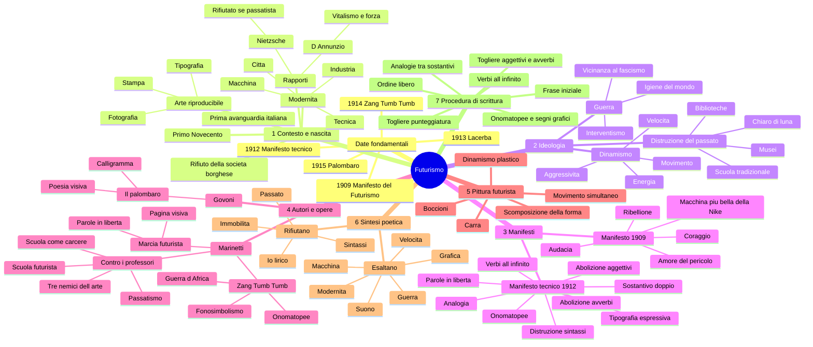

# Schema mentale stampabile — Futurismo

Schema unico e compatto, disposto nello stesso ordine del `riassunto.md`.

```mermaid
mindmap
  root((Futurismo))
    Date fondamentali
      1909 Manifesto del Futurismo
      1912 Manifesto tecnico
      1913 Lacerba
      1914 Zang Tumb Tumb
      1915 Palombaro
    1 Contesto e nascita
      Primo Novecento
      Prima avanguardia italiana
      Rifiuto della societa borghese
      Modernita
        Industria
        Macchina
        Citta
        Tecnica
      Arte riproducibile
        Tipografia
        Stampa
        Fotografia
      Rapporti
        D Annunzio
          Vitalismo e forza
        Nietzsche
          Rifiutato se passatista
    2 Ideologia
      Distruzione del passato
        Musei
        Biblioteche
        Scuola tradizionale
        Chiaro di luna
      Dinamismo
        Velocita
        Movimento
        Energia
        Aggressivita
      Guerra
        Interventismo
        Igiene del mondo
        Vicinanza al fascismo
    3 Manifesti
      Manifesto 1909
        Amore del pericolo
        Coraggio
        Audacia
        Ribellione
        Macchina piu bella della Nike
      Manifesto tecnico 1912
        Distruzione sintassi
        Verbi all infinito
        Abolizione aggettivi
        Abolizione avverbi
        Sostantivo doppio
        Analogia
        Parole in liberta
        Onomatopee
        Tipografia espressiva
    4 Autori e opere
      Marinetti
        Zang Tumb Tumb
          Guerra d Africa
          Fonosimbolismo
          Onomatopee
        Marcia futurista
          Parole in liberta
          Pagina visiva
        Contro i professori
          Passatismo
          Scuola come carcere
          Tre nemici dell arte
          Scuola futurista
      Govoni
        Il palombaro
          Calligramma
          Poesia visiva
    5 Pittura futurista
      Boccioni
      Carra
      Dinamismo plastico
      Movimento simultaneo
      Scomposizione della forma
    6 Sintesi poetica
      Rifiutano
        Passato
        Io lirico
        Sintassi
        Immobilita
      Esaltano
        Modernita
        Macchina
        Velocita
        Guerra
        Suono
        Grafica
    7 Procedura di scrittura
      Frase iniziale
      Togliere aggettivi e avverbi
      Togliere punteggiatura
      Verbi all infinito
      Analogie tra sostantivi
      Ordine libero
      Onomatopee e segni grafici
```
