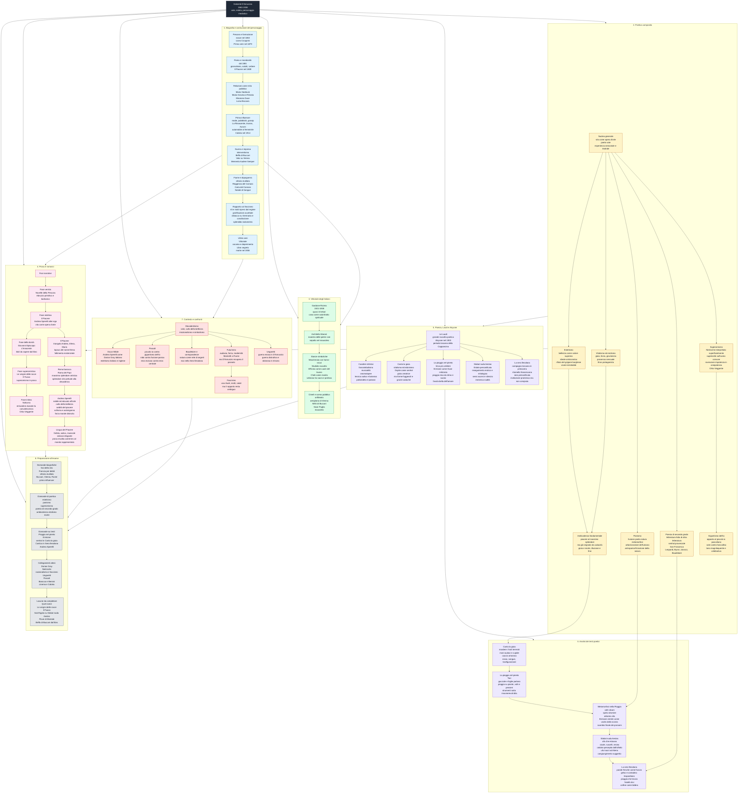

# Schema visuale: Gabriele D'Annunzio

Diagramma unico per riordinare biografia, poetica, opere, testi e collegamenti d'esame.

```mermaid
flowchart TD
    DA["Gabriele D'Annunzio<br/>1863-1938<br/>vate, esteta, personaggio mediatico"]

    DA --> BIO
    DA --> POET
    DA --> VITT
    DA --> PROSA
    DA --> POESIA
    DA --> CONTESTO
    DA --> ESAME

    subgraph BIO["1. Biografia e costruzione del personaggio"]
        direction TD
        B1["Pescara e formazione<br/>nasce nel 1863<br/>Liceo Cicognini<br/>Primo vere nel 1879"]
        B2["Roma e mondanità<br/>dal 1881<br/>giornalismo, salotti, Lettere<br/>Il Piacere nel 1889"]
        B3["Relazioni come mito pubblico<br/>Maria Hardouin<br/>Maria Gravina e Renata<br/>Eleonora Duse<br/>Luisa Baccara"]
        B4["Primo influencer<br/>mode, pubblicità, gossip<br/>La Rinascente, Aurora, Aurum<br/>automobile al femminile<br/>Cabiria nel 1914"]
        B5["Guerra e impresa<br/>interventismo<br/>Beffa di Buccari<br/>Volo su Vienna<br/>Memento Audere Semper"]
        B6["Fiume e dopoguerra<br/>vittoria mutilata<br/>Reggenza del Carnaro<br/>Carta del Carnaro<br/>Natale di Sangue"]
        B7["Rapporto col fascismo<br/>riti e motti ripresi dal regime<br/>gratificazioni accettate<br/>distacco su Germania e conciliazione<br/>splendido isolamento"]
        B8["Ultimi anni<br/>Vittoriale<br/>cocaina e deperimento<br/>Libro segreto<br/>morte nel 1938"]
        B1 --> B2 --> B3 --> B4 --> B5 --> B6 --> B7 --> B8
    end

    subgraph POET["2. Poetica composita"]
        direction TD
        P0["Nucleo generale<br/>vita come opera d'arte<br/>poeta vate<br/>esperienza sensoriale e teatrale"]
        P1["Estetismo<br/>bellezza come valore supremo<br/>ideale aristocratico<br/>rifiuto del grigiore borghese<br/>vivere inimitabile"]
        P2["Superomismo<br/>Nietzsche interpretato superficialmente<br/>superiorità sull'uomo comune<br/>rovesciare impotenza in onnipotenza<br/>Orbo Veggente"]
        P3["Panismo<br/>fusione poeta natura<br/>metamorfosi<br/>arborizzazione dell'umano<br/>antropomorfizzazione della natura"]
        P4["Vitalismo ed erotismo<br/>gioia, forza, giovinezza<br/>possesso sensuale<br/>Eros protagonista"]
        P5["Ambivalenza fondamentale<br/>piacere al massimo splendore<br/>ma già segnato da caducità<br/>gioia e morte, illusione e fine"]
        P6["Poesia di secondo grado<br/>letteratura fatta di altra letteratura<br/>senhal provenzale<br/>San Francesco<br/>Leopardi, Byron, classici, Baudelaire"]
        P7["Gigantismo dell'io<br/>opposto al piccolo io pascoliano<br/>vate contro fanciullino<br/>tono magniloquente e celebrativo"]
        P0 --> P1
        P0 --> P2
        P0 --> P3
        P0 --> P4
        P1 --> P5
        P4 --> P5
        P0 --> P6
        P2 --> P7
    end

    subgraph VITT["3. Vittoriale degli Italiani"]
        direction TD
        V1["Gardone Riviera<br/>1921-1938<br/>quasi 10 ettari<br/>casa come autoritratto spirituale"]
        V2["Architetto Maroni<br/>maestro delle pietre vive<br/>sepolto nel mausoleo"]
        V3["Stanze simboliche<br/>Mascheraio con horror vacui<br/>Studiolo raccolto<br/>Officina come cuore del lavoro<br/>Cheli come monito<br/>Lebroso tra sacro e profano"]
        V4["Cimeli e scena pubblica<br/>anfiteatro<br/>aeroplano di Vienna<br/>MAS di Buccari<br/>Nave Puglia<br/>mausoleo"]
        V1 --> V2 --> V3 --> V4
    end

    subgraph PROSA["4. Prosa e romanzi"]
        direction TD
        R0["Fasi narrative"]
        R1["Fase verista<br/>Novelle della Pescara<br/>Abruzzo primitivo e barbarico"]
        R2["Fase estetica<br/>Il Piacere<br/>Andrea Sperelli alter ego<br/>vita come opera d'arte"]
        R3["Fase della bontà<br/>Giovanni Episcopo<br/>L'Innocente<br/>titoli da sapere dal libro"]
        R4["Fase superomistica<br/>Le vergini delle rocce<br/>Il Fuoco<br/>superomismo in prosa"]
        R5["Fase intima<br/>Notturno<br/>striscioline durante la convalescenza<br/>Orbo Veggente"]
        R6["Il Piacere<br/>triangolo Andrea, Elena, Maria<br/>lapsus del nome Elena<br/>fallimento esistenziale"]
        R7["Roma barocca<br/>Roma dei Papi<br/>massimo splendore artistico<br/>splendore che prelude alla decadenza"]
        R8["Andrea Sperelli<br/>nobile ed educato all'arte<br/>culto della bellezza<br/>avidità del piacere<br/>sofisma e autoinganno<br/>forza morale distrutta"]
        R9["Lingua del Piacere<br/>forbita, aulica, musicale<br/>sintassi elegante<br/>prosa erudita coerente col mondo rappresentato"]
        R0 --> R1 --> R2 --> R3 --> R4 --> R5
        R2 --> R6 --> R7 --> R8 --> R9
    end

    subgraph POESIA["5. Poesia, Laudi e Alcyone"]
        direction TD
        L1["Le Laudi<br/>grande raccolta poetica<br/>Alcyone nel 1903<br/>periodo toscano della Capponcina"]
        L2["Caratteri stilistici<br/>fonosimbolismo<br/>musicalità<br/>onomatopee<br/>lessico aulico e botanico<br/>polisindeto e ipotassi"]
        L3["Canta la gioia<br/>vitalismo ed edonismo<br/>Ospite come senhal<br/>gioia creatrice<br/>ma forme fuggevoli e grazie caduche"]
        L4["La pioggia nel pineto<br/>lirica più celebre<br/>Ermione come Duse mitizzata<br/>pioggia resa da ritmo e suono<br/>favola bella dell'amore"]
        L5["Stabat nuda Aestas<br/>Estate personificata<br/>inseguimento erotico e mitologico<br/>sensi accesi e silenzio<br/>immensa nudità"]
        L6["La sera fiesolana<br/>campagna toscana in primavera<br/>ritornello francescano<br/>sera personificata<br/>rivelazione promessa ma non compiuta"]
        L1 --> L2
        L1 --> L3
        L1 --> L4
        L1 --> L5
        L1 --> L6
    end

    subgraph TESTI["6. Analisi dei testi poetici"]
        direction TD
        T1["Canta la gioia<br/>mordere i frutti terrestri<br/>mani audaci e cupide<br/>caccia amorosa<br/>rosso, sangue, trasfigurazione"]
        T2["La pioggia nel pineto<br/>Taci<br/>gocciole e foglie parlano<br/>pioggia su piante, volti e pensieri<br/>strumenti sotto innumerevoli dita"]
        T3["Metamorfosi nella Pioggia<br/>volti silvani<br/>spirto silvestre<br/>arborea vita<br/>Ermione virente come uscita dalla scorza<br/>scambio finale dei pronomi"]
        T4["Stabat nuda Aestas<br/>afa che estuava<br/>cicale, ruscelli, resina<br/>colubro percepito dall'olfatto<br/>ulivi sacri ad Atena<br/>congiungimento suggerito"]
        T5["La sera fiesolana<br/>parole fresche come fruscio<br/>gelso e contadino leopardiano<br/>pioggia che bruiva<br/>fratelli olivi<br/>colline come labbra"]
        T1 --> T2 --> T3 --> T4 --> T5
    end

    POESIA --> TESTI
    P3 --> T3
    P5 --> T1
    P6 --> T5

    subgraph CONTESTO["7. Contesto e confronti"]
        direction TD
        C1["Decadentismo<br/>vate, culto della bellezza<br/>irrazionalismo e simbolismo"]
        C2["Oscar Wilde<br/>Andrea Sperelli come Dorian Gray italiano<br/>estetismo italiano e inglese"]
        C3["Pascoli<br/>piccolo io contro gigantismo dell'io<br/>nido contro fusione panica<br/>eros escluso contro eros centrale"]
        C4["Ungaretti<br/>guerra eroica in D'Annunzio<br/>guerra distruttiva e dolorosa in trincea"]
        C5["Futurismo<br/>audacia, forza, modernità<br/>Marinetti a Fiume<br/>ma D'Annunzio recupera il passato"]
        C6["Fascismo<br/>usa rituali, motti, saluti<br/>ma il rapporto resta ambiguo"]
        C7["Baudelaire e corrispondenze<br/>natura come rete di segreti<br/>eco nella Sera fiesolana"]
        C1 --> C2
        C1 --> C3
        C1 --> C7
        C1 --> C5 --> C6
        C1 --> C4
    end

    subgraph ESAME["8. Preparazione all'esame"]
        direction TD
        E1["Domande biografiche<br/>fasi della vita<br/>Francia per debiti<br/>vittoria mutilata<br/>Buccari, Vienna, Fiume<br/>primo influencer"]
        E2["Domande di poetica<br/>estetismo<br/>panismo<br/>superomismo<br/>poesia di secondo grado<br/>ambivalenza vitalismo morte"]
        E3["Domande sui testi<br/>Pioggia nel pineto<br/>Ermione<br/>senhal in Canta la gioia<br/>Cantico in Sera fiesolana<br/>Andrea Sperelli"]
        E4["Collegamenti attesi<br/>Dorian Gray<br/>Nietzsche<br/>nazionalismo e fascismo<br/>Ungaretti<br/>Pascoli<br/>Barocco e Bernini<br/>cinema e Cabiria"]
        E5["Lacune da completare<br/>Quel nome<br/>Le vergini delle rocce<br/>Il Fuoco<br/>Sant'Agata su Stabat nuda Aestas<br/>Piove di Montale<br/>Beffa di Buccari dal libro"]
        E1 --> E2 --> E3 --> E4 --> E5
    end

    BIO --> VITT
    BIO --> PROSA
    BIO --> CONTESTO
    POET --> PROSA
    POET --> POESIA
    PROSA --> ESAME
    POESIA --> ESAME
    CONTESTO --> ESAME

    classDef center fill:#1f2937,stroke:#111827,color:#ffffff,stroke-width:2px
    classDef bio fill:#e0f2fe,stroke:#0369a1,color:#0f172a
    classDef poet fill:#fef3c7,stroke:#b45309,color:#111827
    classDef place fill:#dcfce7,stroke:#15803d,color:#111827
    classDef prose fill:#fce7f3,stroke:#be185d,color:#111827
    classDef poetry fill:#ede9fe,stroke:#7c3aed,color:#111827
    classDef context fill:#fee2e2,stroke:#b91c1c,color:#111827
    classDef exam fill:#e5e7eb,stroke:#374151,color:#111827

    class DA center
    class B1,B2,B3,B4,B5,B6,B7,B8 bio
    class P0,P1,P2,P3,P4,P5,P6,P7 poet
    class V1,V2,V3,V4 place
    class R0,R1,R2,R3,R4,R5,R6,R7,R8,R9 prose
    class L1,L2,L3,L4,L5,L6,T1,T2,T3,T4,T5 poetry
    class C1,C2,C3,C4,C5,C6,C7 context
    class E1,E2,E3,E4,E5 exam
```
