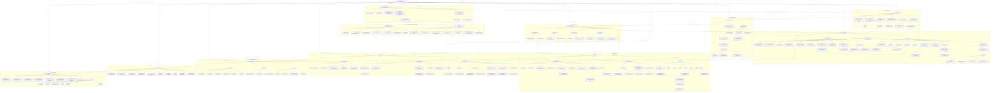

# Decadentismo e Simbolismo francese - schema Mermaid

```mermaid
flowchart TD
    A["Decadentismo e Simbolismo francese<br/>Lezione 12-02-26"] --> B["1. Quadro storico letterario"]
    A --> C["2. Caratteri fondamentali"]
    A --> D["3. Realtà simbolica"]
    A --> E["4. Poeti maledetti"]
    A --> F["5. Baudelaire"]
    A --> G["6. Verlaine"]
    A --> H["7. Rimbaud"]
    A --> I["8. Espressioni da sapere"]
    A --> L["9. Glossario essenziale"]
    A --> M["10. Lacune e testi da studiare"]

    subgraph S1["1. Quadro storico letterario"]
        B --> B1["Anni 80 dell'Ottocento"]
        B --> B2["Origine in Francia"]
        B --> B3["Simbolismo francese<br/>madre del Decadentismo italiano"]
        B --> B4["Nome da Languore di Verlaine<br/>impero alla fine della decadenza"]
        B --> B5["Discontinuità da Naturalismo e Verismo"]
        B --> B6["Ricollegamento ideale al Romanticismo"]
        B6 --> B6a["Spinta soggettiva dell'io"]
        B6 --> B6b["Senso di fine morte mistero"]
    end

    subgraph S2["2. Caratteri fondamentali"]
        C --> C1["Sfiducia nella scienza<br/>la scienza non spiega la realtà"]
        C --> C2["Forte carica soggettiva<br/>individualismo non romantico"]
        C --> C3["Rivalutazione dell'irrazionalità"]
        C3 --> C3a["Intuizione"]
        C3 --> C3b["Illuminazione"]
        C3 --> C3c["Ampliamento dei sensi"]
        C --> C4["Senso della fine e della morte"]
        C --> C5["Mistero che domina la vita"]
        C --> C6["Esclusione ed emarginazione del poeta"]
        C6 --> C6a["Rifiuto della società borghese"]
        C6 --> C6b["Critica dell'utile e del profitto"]
    end

    subgraph S3["Naturalismo contro Simbolismo Decadentismo"]
        N1["Naturalismo e Verismo"] --> N1a["Ragione e scienza"]
        N1 --> N1b["Realtà conoscibile oggettiva fenomenica"]
        N1 --> N1c["Linguaggio fotografico"]
        N1 --> N1d["Parola che rispecchia il reale"]
        N1 --> N1e["Romanzo sperimentale di Zola"]
        N1 --> N1f["Metrica e convenzioni"]
        N1 --> N1g["Positivismo"]

        N2["Simbolismo e Decadentismo"] --> N2a["Irrazionalità intuizione illuminazione"]
        N2 --> N2b["Realtà misteriosa illusoria complessa"]
        N2 --> N2c["Linguaggio allusivo simbolico evocativo"]
        N2 --> N2d["Parola che suggerisce la sfumatura"]
        N2 --> N2e["Poesia come profezia e decodifica"]
        N2 --> N2f["Verso libero e rifiuto della metrica tradizionale"]
        N2 --> N2g["Rifiuto del positivismo"]
    end
    B5 --> N1
    B5 --> N2

    subgraph S4["3. La realtà secondo i simbolisti"]
        D --> D1["La realtà è misteriosa illusoria complessa"]
        D1 --> D2["Deve essere decifrata"]
        D2 --> D3["Trama di corrispondenze simboliche"]
        D3 --> D4["Simboli da leggere oltre la ragione"]
        D4 --> D5["Accesso al mistero"]
        D5 --> D5a["Droghe<br/>oppio assenzio"]
        D5 --> D5b["Esperienze estreme<br/>amore follia sofferenza"]
        D5 --> D5c["Poesia come strumento di decodifica"]
        D --> D6["Realtà fenomenica"]
        D6 --> D6a["Dal greco phainomai<br/>apparire"]
        D6 --> D6b["Quello che si vede"]
        D2 --> D7["Obiettivo dei poeti<br/>indagare ciò che sta sotto il visibile"]
    end

    subgraph S5["4. I poeti maledetti"]
        E --> E1["Charles Baudelaire"]
        E1 --> E1a["Padre putativo e precursore"]
        E1 --> E1b["Autore fondamentale"]
        E --> E2["Paul Verlaine"]
        E2 --> E2a["Protagonista del Simbolismo"]
        E2 --> E2b["Vita sregolata e alcolismo"]
        E --> E3["Arthur Rimbaud"]
        E3 --> E3a["Giovane ribelle"]
        E3 --> E3b["Vita raminga e morte a 37 anni"]
        E --> E4["Perché maledetti"]
        E4 --> E4a["Esistenza fuori dai canoni borghesi"]
        E4 --> E4b["Fiducia nell'ampliamento dei sensi"]
        E4 --> E4c["Uso di droghe e funzioni psichiche ampliate"]
    end

    subgraph S6["5. Charles Baudelaire"]
        F --> F1["Corrispondenze<br/>I fiori del male 1857"]
        F1 --> F1a["Testo manifesto della realtà simbolista"]
        F1 --> F1b["Natura come tempio e sinonimo di realtà"]
        F1 --> F1c["Pilastri vivi con parole indistinte"]
        F1 --> F1d["Foreste di simboli"]
        F1 --> F1e["Uomo dentro la realtà simbolica"]
        F1 --> F1f["Profumi colori suoni si rispondono"]
        F1f --> F1g["Unità misteriosa e tenebrosa dei sensi"]
        F1g --> F1h["Sinestesia"]
        F1h --> F1i["Figura evocativa e allusiva"]
        F1h --> F1j["Unisce olfatto tatto udito vista"]
        F1h --> F1k["Non ha nesso razionale causa effetto"]

        F --> F2["La caduta dell'aureola<br/>Lo Spleen di Parigi"]
        F2 --> F2a["Dialogo in un bordello tra poeta e uomo qualunque"]
        F2 --> F2b["Spleen<br/>malinconia tristezza noia"]
        F2 --> F2c["Aureola come sacralità del poeta"]
        F2c --> F2d["Caduta nella fanghiglia del macadam"]
        F2d --> F2e["Perdita della sacralità nella società moderna"]
        F2 --> F2f["Parigi urbana frenetica alienante caotica"]
        F2 --> F2g["Il poeta non raccoglie l'aureola"]
        F2g --> F2h["Orgoglio della marginalità"]
        F2 --> F2i["Doppio atteggiamento"]
        F2i --> F2j["Critica della società contemporanea disumana"]
        F2i --> F2k["Rivendicazione della propria emarginazione"]

        F --> F3["L'Albatro"]
        F3 --> F3a["Albatro come nuovo poeta moderno"]
        F3a --> F3b["Nel cielo dell'arte è altissimo"]
        F3a --> F3c["Sulla terra sociale è ridicolo"]
        F3 --> F3d["Re dell'azzurro"]
        F3 --> F3e["Viaggiatore alato"]
        F3 --> F3f["Principe delle nubi"]
        F3 --> F3g["Esule in terra"]
        F3 --> F3h["Ali di gigante"]
        F3h --> F3i["Immaginazione intelletto arte poesia"]
        F3i --> F3j["Grandezza che impedisce la vita terrena"]
        F3 --> F3k["Marinai come uomini comuni che deridono il poeta"]
        F3 --> F3l["Messaggio<br/>il poeta deve coltivare le altezze dell'arte"]
    end

    subgraph S7["6. Paul Verlaine"]
        G --> G1["Biografia essenziale"]
        G1 --> G1a["Alcolismo dalla giovinezza"]
        G1 --> G1b["Provincia poi Parigi"]
        G1 --> G1c["Matrimonio famiglia e rapporto con Rimbaud"]
        G1 --> G1d["Spara a Rimbaud<br/>due anni di reclusione"]
        G1 --> G1e["Vita all'insegna della sregolatezza"]

        G --> G2["Poetica della musicalità"]
        G2 --> G2a["De la musique avant toute chose"]
        G2a --> G2b["La musica sopra ogni cosa"]
        G2 --> G2c["Musica come linguaggio universale"]
        G2 --> G2d["Importanza del significante e del suono"]
        G2d --> G2e["Allitterazione assonanza consonanza"]
        G2 --> G2f["Rifiuto della rima"]
        G2f --> G2g["La rima ingabbia la poesia"]
        G2 --> G2h["Rifiuto della metrica e della tradizione"]

        G --> G3["Arte poetica 1874"]
        G3 --> G3a["Ritmo impari"]
        G3a --> G3b["Vago solubile leggero libero"]
        G3 --> G3c["Canzone grigia"]
        G3c --> G3d["L'incerto si unisce al preciso"]
        G3 --> G3e["Sol la sfumatura"]
        G3e --> G3f["Parola poetica che suggerisce non delinea"]
        G3e --> G3g["Allusione non descrizione"]
        G3 --> G3h["Prendi l'eloquenza e torcile il collo"]
        G3h --> G3i["Liberarsi dagli schemi del bel parlare"]
        G3 --> G3j["Rima vuota e falsa sotto la lima"]
        G3j --> G3k["Labor limae come rifinitura stilistica"]
        G3 --> G3l["Tutto il resto è letteratura"]
        G3l --> G3m["Canone morto da superare"]
    end

    subgraph S8["7. Arthur Rimbaud"]
        H --> H1["Biografia essenziale"]
        H1 --> H1a["Nato nel 1854"]
        H1 --> H1b["Ragazzo ribelle"]
        H1 --> H1c["Versi inviati a Verlaine e relazione turbolenta"]
        H1 --> H1d["Vagabondaggio in Europa"]
        H1 --> H1e["Esercito coloniale olandese poi diserzione"]
        H1 --> H1f["Circo Norvegia Cipro"]
        H1 --> H1g["Mercante di pelli e caffè dal 1880"]
        H1 --> H1h["1891 cancro amputazione morte a Marsiglia"]

        H --> H2["Lettera del Veggente"]
        H2 --> H2a["Io è un altro"]
        H2a --> H2b["Non soggettivismo romantico"]
        H2a --> H2c["Identità non univoca ma caos"]
        H2 --> H2d["Farsi veggente"]
        H2d --> H2e["Vede ciò che all'uomo comune è negato"]
        H2d --> H2f["Dimensione della profezia"]
        H2 --> H2g["Lungo immenso e ragionato disordine di tutti i sensi"]
        H2g --> H2h["Amore sofferenza pazzia"]
        H2 --> H2i["Poeta come ladro di fuoco"]
        H2i --> H2j["Analogia con Prometeo"]
        H2j --> H2k["Prometeo ruba il fuoco agli dei"]
        H2j --> H2l["Poeta scende negli abissi della realtà"]
        H2l --> H2m["Coglie simboli e mistero"]
        H2m --> H2n["Li porta agli uomini con la poesia"]

        H --> H3["Vocali"]
        H3 --> H3a["Associa suoni e colori in libertà"]
        H3a --> H3b["Riproduce il linguaggio profondo della realtà"]
        H3 --> H3c["A nera"]
        H3 --> H3d["È bianca"]
        H3 --> H3e["I rossa"]
        H3 --> H3f["U verde"]
        H3 --> H3g["O blu"]
        H3 --> H3h["Fitta trama di sinestesie"]
        H3h --> H3i["Associazioni fantasiose e immaginifiche"]
        H3h --> H3j["Aspetti fonetici musicali e sinestetici"]
    end

    subgraph S9["8. Espressioni e concetti da sapere"]
        I --> I1["Baudelaire"]
        I1 --> I1a["Caduta dell'aureola"]
        I1 --> I1b["Re dell'azzurro"]
        I1 --> I1c["Viaggiatore alato"]
        I1 --> I1d["Principe delle nubi"]
        I1 --> I1e["Esule in terra"]
        I1 --> I1f["Ali di gigante"]
        I --> I2["Verlaine"]
        I2 --> I2a["La musica sopra ogni cosa"]
        I2 --> I2b["Sol la sfumatura"]
        I2 --> I2c["Torcere il collo all'eloquenza"]
        I --> I3["Rimbaud"]
        I3 --> I3a["Io è un altro"]
        I3 --> I3b["Farsi veggente"]
        I3 --> I3c["Disordine ragionato di tutti i sensi"]
        I3 --> I3d["Ladro di fuoco"]
    end

    subgraph S10["9. Glossario essenziale"]
        L --> L1["Fenomeno<br/>ciò che appare e si vede"]
        L --> L2["Spleen<br/>malinconia tristezza noia"]
        L --> L3["Parnaso<br/>monte sacro alla poesia"]
        L --> L4["Sinestesia<br/>fusione di sensi diversi"]
        L --> L5["Tolda<br/>ponte scoperto della nave"]
        L --> L6["Umbelle<br/>chioma del fiore"]
        L --> L7["Benzoino<br/>resina profumata"]
        L --> L8["Tuba<br/>tromba"]
        L --> L9["Labor limae<br/>rifinitura stilistica"]
        L --> L10["Macadam<br/>pavimentazione stradale"]
    end

    subgraph S11["10. Lacune e testi da studiare"]
        M --> M1["Schema basato su una sola lezione"]
        M --> M2["Decadentismo italiano non trattato"]
        M --> M3["Languore citata ma non analizzata"]
        M --> M4["Contesto storico sociale da approfondire"]
        M --> M5["Rapporto con Romanticismo non sviluppato"]
        M --> M6["I fiori del male studiati solo tramite Corrispondenze"]
        M --> M7["Rimbaud senza Una stagione all'inferno e Illuminazioni"]
        M --> M8["Mallarmé non menzionato"]
        M --> M9["Testi sul libro"]
        M9 --> M9a["Corrispondenze"]
        M9 --> M9b["L'Albatro"]
        M9 --> M9c["Lettera del Veggente"]
        M9 --> M9d["Vocali"]
        M9 --> M9e["Languore"]
        M9 --> M9f["Arte poetica"]
    end

    B --> C
    C --> D
    D --> E
    E --> F
    E --> G
    E --> H
    F --> I
    G --> I
    H --> I
    I --> L
    L --> M

    D3 -.-> F1d
    D5c -.-> F1a
    D5c -.-> G2
    D5c -.-> H2
    C6 -.-> F2e
    C6 -.-> F3g
    N2d -.-> G3e
    F1h -.-> H3h
```
