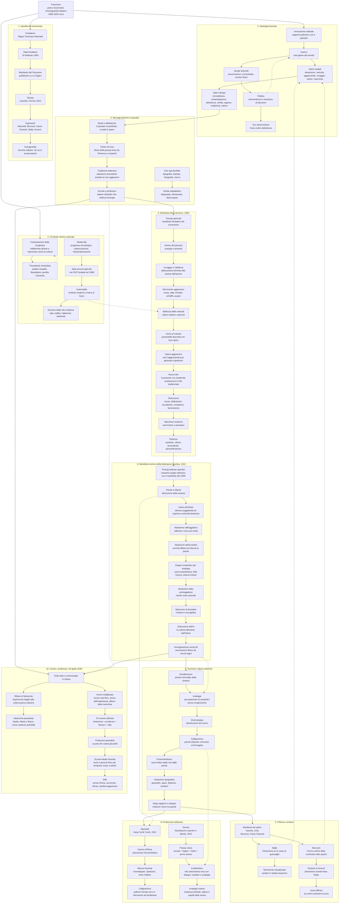

# Futurismo — schema Mermaid

```mermaid
flowchart TD
  F["Futurismo<br/>primo movimento d'avanguardia italiano<br/>1909-1920 circa"]

  subgraph A["1. Identità del movimento"]
    A1["Fondatore<br/>Filippo Tommaso Marinetti"]
    A2["Data fondativa<br/>20 febbraio 1909"]
    A3["Manifesto del Futurismo<br/>pubblicato su Le Figaro"]
    A4["Rivista<br/>Lacerba, Firenze 1913"]
    A5["Esponenti<br/>Marinetti, Boccioni, Carrà, Russolo, Balla, Govoni"]
    A6["Avanguardia<br/>termine militare: chi va in avanscoperta"]
  end

  subgraph B["2. Contesto storico-culturale"]
    B1["Contestazione della borghesia<br/>indifferente all'arte e repressiva verso la cultura"]
    B2["Precedente simbolista<br/>poètes maudits, Baudelaire, perdita d'aureola"]
    B3["Modernità<br/>progresso tecnologico, urbanizzazione, industrializzazione"]
    B4["Italia ancora agricola<br/>ma FIAT fondata nel 1899"]
    B5["Automobile<br/>simbolo moderno e bene di lusso"]
    B6["Eroismo della vita moderna<br/>città, traffico, fabbriche, elettricità"]
  end

  subgraph C["3. Ideologia futurista"]
    C1["Innovazione radicale<br/>rapporto polemico con il passato"]
    C2["Guerra<br/>sola igiene del mondo"]
    C3["Valori esaltati<br/>dinamismo, velocità, aggressività, coraggio, istinto, macchina"]
    C4["Valori rifiutati<br/>immobilismo, contemplazione, debolezza, umiltà, ragione, tradizione, natura"]
    C5["Serate futuriste<br/>provocazione, iconoclastia, scontro fisico"]
    C6["Politica<br/>interventismo e vicinanza al fascismo"]
    C7["Eco dannunziana<br/>forza contro debolezza"]
  end

  subgraph D["4. Bersagli polemici e passato"]
    D1["Musei e biblioteche<br/>il passato museificato uccide le opere"]
    D2["Chiaro di luna<br/>rifiuto della poesia lirica da Petrarca a Leopardi"]
    D3["Tradizione letteraria<br/>capolavori precedenti scartati se non aggressivi"]
    D4["Scuola e professori<br/>sapere obsoleto che soffoca l'energia"]
    D5["Arte riproducibile<br/>tipografia, stampa, fotografia, merce"]
    D6["Artista capitalistico<br/>disgustato, declassato, disoccupato"]
  end

  subgraph E["5. Manifesto del Futurismo, 1909"]
    E1["Principi generali<br/>manifesto fondativo del movimento"]
    E2["Amore del pericolo<br/>energia e temerità"]
    E3["Coraggio e ribellione<br/>dalla poesia intimista alla poesia dell'azione"]
    E4["Movimento aggressivo<br/>corsa, salto mortale, schiaffo, pugno"]
    E5["Bellezza della velocità<br/>valore estetico supremo"]
    E6["Uomo al volante<br/>automobile descritta con tono epico"]
    E7["Opera aggressiva<br/>solo l'aggressività può generare capolavori"]
    E8["Nuovo Dio<br/>il presente e la modernità sostituiscono il Dio tradizionale"]
    E9["Distruzione<br/>musei, biblioteche, accademie, moralismo, femminismo"]
    E10["Macchine moderne<br/>locomotive e aeroplani"]
    E11["Retorica<br/>asindeto, climax ascendente, personificazione"]
  end

  subgraph G["6. Manifesto tecnico della letteratura futurista, 1912"]
    G1["Principi letterari specifici<br/>massimo pregio letterario con il manifesto del 1909"]
    G2["Parole in libertà<br/>distruzione della sintassi"]
    G3["Verbo all'infinito<br/>elimina soggettività ed esprime continuità dinamica"]
    G4["Abolizione dell'aggettivo<br/>rallenta e crea una sosta"]
    G5["Abolizione dell'avverbio<br/>vecchia fibbia che blocca le parole"]
    G6["Doppio sostantivo per analogia<br/>uomo-torpediniera, folla-risacca, piazza-imbuto"]
    G7["Abolizione della punteggiatura<br/>niente soste assurde"]
    G8["Maximum di disordine<br/>l'ordine è una gabbia"]
    G9["Distruzione dell'io<br/>la cultura allontana dall'istinto"]
    G10["Immaginazione senza fili<br/>associazioni libere da vincoli logici"]
  end

  subgraph H["7. Tecniche e figure retoriche"]
    H1["Paroliberismo<br/>parole svincolate dalla sintassi"]
    H2["Analogia<br/>accostamento di sostantivi senza congiunzione"]
    H3["Onomatopea<br/>riproduzione del suono"]
    H4["Calligramma<br/>parole disposte a formare un'immagine"]
    H5["Fonosimbolismo<br/>suoni della realtà resi dalle parole"]
    H6["Variazione tipografica<br/>grassetto, spazi, distanze, caratteri"]
    H7["Segni algebrici e disegni<br/>relazioni visive tra parole"]
  end

  subgraph I["8. Produzione letteraria"]
    I1["Marinetti<br/>Zang Tumb Tumb, 1914"]
    I2["Guerra d'Africa<br/>descrizione fonosimbolica"]
    I3["Marcia futurista<br/>onomatopee, ripetizioni, ritmo militare"]
    I4["Calligramma<br/>pallone frenato turco e riferimento ad Apollinaire"]
    I5["Govoni<br/>Rarefazioni e parole in libertà, 1915"]
    I6["Poesia visiva<br/>bucato + bagno + ballo = primo amore"]
    I7["Il palombaro<br/>vita sottomarina resa con disegni, caratteri e analogie"]
    I8["Analogie marine<br/>medusa-ombrello, attinia e capelli delle sirene"]
  end

  subgraph L["9. Pittura e scultura"]
    L1["Manifesto dei pittori futuristi, 1911<br/>Boccioni, Carrà, Russolo"]
    L2["Balla<br/>Dinamismo di un cane al guinzaglio"]
    L3["Movimento visualizzato<br/>zampe in rapida sequenza"]
    L4["Boccioni<br/>Forme uniche della continuità nello spazio"]
    L5["Scultura in bronzo<br/>dinamismo tramite linee fluide"]
    L6["Icona diffusa<br/>sui venti centesimi di euro"]
  end

  subgraph M["10. Contro i professori, 09 aprile 2026"]
    M1["Testo letto e commentato in classe"]
    M2["Rifiuto di Nietzsche<br/>Superuomo legato alla cultura greca classica"]
    M3["Nietzsche passatista<br/>Apollo, Marte e Bacco come cadaveri putrefatti"]
    M4["Uomo moltiplicato<br/>nemico del libro, amico dell'esperienza, allievo della macchina"]
    M5["Tre nemici dell'arte<br/>imitazione + prudenza + denaro = viltà"]
    M6["Professori passatisti<br/>scuola che castra gli spiriti"]
    M7["Scuola ideale futurista<br/>rischi e pericoli fisici per temprare corpo e spirito"]
    M8["Stile<br/>prosa ritmica, accumulo, climax, iperboli aggressive"]
  end

  F --> A1
  F --> B1
  F --> C1
  C4 --> D1
  D4 --> E1
  E11 --> G1
  G10 --> H1
  H7 --> I1
  H7 --> L1
  D4 --> M1
  G10 --> M1

  A1 --> A2 --> A3 --> A4 --> A5 --> A6
  B1 --> B2
  B3 --> B4 --> B5 --> B6
  C1 --> C2 --> C3 --> C4
  C2 --> C5 --> C6 --> C7
  D1 --> D2 --> D3 --> D4
  D5 --> D6
  E1 --> E2 --> E3 --> E4 --> E5 --> E6 --> E7 --> E8 --> E9 --> E10 --> E11
  G1 --> G2 --> G3 --> G4 --> G5 --> G6 --> G7 --> G8 --> G9 --> G10
  H1 --> H2 --> H3 --> H4 --> H5 --> H6 --> H7
  I1 --> I2 --> I3 --> I4
  I5 --> I6 --> I7 --> I8
  L1 --> L2 --> L3
  L1 --> L4 --> L5 --> L6
  M1 --> M2 --> M3
  M1 --> M4 --> M5 --> M6 --> M7 --> M8

  B2 -.-> B1
  B5 -.-> E5
  C6 -.-> C2
  D4 -.-> M1
  G2 -.-> I1
  G10 -.-> H2
  H4 -.-> I7
  L2 -.-> C3
  L4 -.-> C3
```
