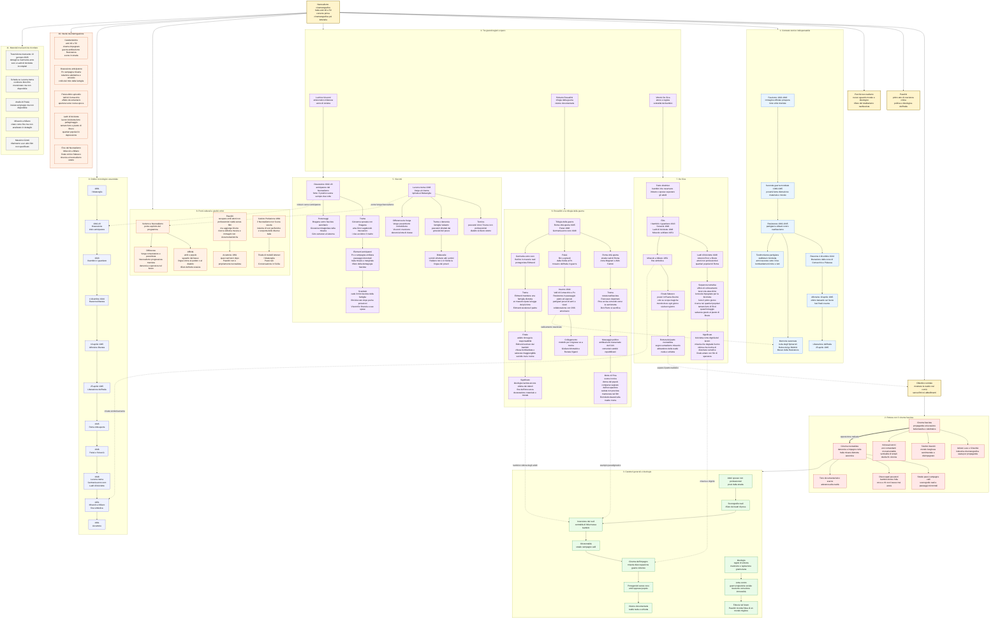

# Schema Mermaid: Neorealismo cinematografico

Diagramma unico per ripassare in ordine il riassunto: contesto, principi, registi, opere, collegamenti e date.

```mermaid
flowchart TD
    N["Neorealismo cinematografico<br/>Italia anni 40 e 50<br/>corrente prima cinematografica poi letteraria"] --> DEF["Obiettivo centrale<br/>mostrare la realtà così com'è<br/>senza filtri né abbellimenti"]
    N --> PAS["Pasolini<br/>primo atto di coscienza critica<br/>politica e ideologica dell'Italia"]
    N --> NEO["Perché neo realismo<br/>nuovo sguardo morale e ideologico<br/>rifiuto del totalitarismo nazifascista"]

    subgraph CONTESTO["1. Contesto storico indispensabile"]
        C1["Fascismo 1922-1943<br/>immagine ufficiale prospera forte virile trionfale"]
        C2["Seconda guerra mondiale 1940-1945<br/>povertà fame distruzione materiale e morale"]
        C3["Resistenza 1943-1945<br/>partigiani e Alleati contro nazifascismo"]
        C4["Ravenna 4 dicembre 1944<br/>liberazione dalle zone di Comacchio e Pialassa"]
        C5["Alfonsine 10 aprile 1945<br/>ultimo baluardo sul Senio<br/>fasi finali cruente"]
        C6["Liberazione dell'Italia<br/>25 aprile 1945"]
        C7["Memoria ravennate<br/>Isola degli Spinaroni<br/>Bulow Arrigo Boldrini<br/>Museo della Resistenza"]
        C8["Testimonianza partigiana<br/>staffetta in bicicletta<br/>armi nascoste sotto il riso<br/>bombardamenti mine e lutti"]
        C1 --> C2 --> C3 --> C4 --> C5 --> C6
        C3 --> C7
        C3 --> C8
    end
    N --> CONTESTO

    subgraph ROTTURA["2. Rottura con il cinema fascista"]
        FASC["Cinema fascista<br/>propaganda ed evasione<br/>Italia fasulla e celebrativa"]
        LUCE["Istituto Luce e Cinecittà<br/>industria cinematografica usata per propaganda"]
        BIANCHI["Telefoni bianchi<br/>mondo borghese sentimentale e disimpegnato"]
        KOL["Kolossal storici<br/>eroi comandanti monumentalità<br/>verticalità di templi obelischi colonne"]
        NEOREAL["Cinema neorealista<br/>denuncia e impegno civile<br/>Italia misera distrutta autentica"]
        ESTERNI["Strade paesi campagne valli<br/>scenografie reali e paesaggi orizzontali"]
        UMILI["Disoccupati pescatori bambini donne folla<br/>voce a chi non l'aveva mai avuta"]
        DOCUMENTO["Tono documentaristico scarno<br/>aderenza alla realtà"]
        FASC --> LUCE
        FASC --> BIANCHI
        FASC --> KOL
        FASC == "opposizione radicale" ==> NEOREAL
        NEOREAL --> ESTERNI
        NEOREAL --> UMILI
        NEOREAL --> DOCUMENTO
    end
    DEF --> ROTTURA

    subgraph PRINCIPI["3. Caratteri generali e ideologia"]
        P1["Attori spesso non professionisti<br/>presi dalla strada"]
        P2["Scenografie reali<br/>rifiuto dei teatri di posa"]
        P3["Inversione dei ruoli<br/>centralità di folla massa bambini"]
        P4["Orizzontalità<br/>strade campagne valli"]
        P5["Cinema dell'impegno<br/>miseria disoccupazione guerra violenze"]
        P6["Protagonisti senza voce<br/>umili oppressi popolo"]
        P7["Visione documentaria<br/>realtà nuda e schietta"]
        IDEO["Ideologia<br/>registi di sinistra<br/>marxismo e ispirazione gramsciana"]
        LOTTE["Lotta contro<br/>guerra ingiustizia sociale fascismo corruzione immoralità"]
        FUT["Fiducia nel futuro<br/>Pasolini ricorda l'idea di un mondo migliore"]
        P1 --> P2 --> P3 --> P4 --> P5 --> P6 --> P7
        IDEO --> LOTTE --> FUT
    end
    NEOREAL --> PRINCIPI

    subgraph REGISTI["4. Tre grandi registi e opere"]
        VIS["Luchino Visconti<br/>aristocratico milanese<br/>uomo di sinistra"]
        ROS["Roberto Rossellini<br/>trilogia della guerra<br/>visione documentaria"]
        DES["Vittorio De Sica<br/>attore e regista<br/>centralità dei bambini"]
    end
    N --> REGISTI

    subgraph VISCONTI["5. Visconti"]
        OSS["Ossessione 1942-43<br/>anticipatore del Neorealismo<br/>fonte: Il postino suona sempre due volte"]
        OSS_TRAMA["Trama<br/>Giovanna sposata con Bragana<br/>ama Gino vagabondo meccanico<br/>i due uccidono il marito"]
        OSS_NEO["Elementi anticipatori<br/>Po e campagna emiliana<br/>paesaggi orizzontali<br/>Italia misera e marginale<br/>rifiuto della demagogia fascista"]
        OSS_SCANDALO["Scandalo<br/>cade il mito fascista della famiglia<br/>film bloccato dopo poche proiezioni<br/>Visconti lo finanzia a sue spese"]
        OSS_PERSONAGGI["Personaggi<br/>Bragana uomo fascista autoritario<br/>Giovanna intrappolata nella miseria<br/>Gino estraneo al sistema"]
        TERRA["La terra trema 1948<br/>Verga al cinema<br/>ispirata ai Malavoglia"]
        TERRA_TEC["Tecnica<br/>pescatori di Aci Trezza non professionisti<br/>dialetto siciliano stretto"]
        TERRA_TRAMA["Trama e denuncia<br/>famiglia Valastro<br/>pescatori sfruttati dai grossisti del pesce"]
        TERRA_DID["Didascalie<br/>uomini sfruttano altri uomini<br/>l'italiano non è in Sicilia la lingua dei poveri"]
        VERGA_DIFF["Differenza da Verga<br/>Verga: pessimismo immobilismo<br/>Visconti: marxismo denuncia lotta di classe"]
        OSS --> OSS_TRAMA --> OSS_NEO --> OSS_SCANDALO
        OSS --> OSS_PERSONAGGI
        TERRA --> TERRA_TEC
        TERRA --> TERRA_TRAMA --> TERRA_DID
        TERRA --> VERGA_DIFF
    end
    VIS --> VISCONTI

    subgraph ROSSELLINI["6. Rossellini e la trilogia della guerra"]
        TRIL["Trilogia della guerra<br/>Roma città aperta 1945<br/>Paisà 1946<br/>Germania anno zero 1948"]
        ROMA["Roma città aperta<br/>strade reali di Roma<br/>Anna Magnani e Aldo Fabrizi"]
        ROMA_TRAMA["Trama<br/>retata nazifascista<br/>Francesco deportato<br/>Pina uccisa correndo verso la camionetta<br/>Don Pietro si sacrifica"]
        ROMA_POL["Messaggio politico<br/>antifascismo trasversale del CLN<br/>comunisti cattolici repubblicani"]
        ROMA_SCENA["Morte di Pina<br/>scena iconica<br/>donna del popolo<br/>comparse segnate dall'occupazione<br/>caduta non prevista mantenuta nel film<br/>Romoletto davanti alla madre morta"]
        PAISA["Paisà<br/>film a episodi<br/>dalla Sicilia al Po<br/>mosaico dell'Italia in guerra"]
        PAISA_PO["Inverno 1944<br/>Valli di Comacchio e Po<br/>Resistenza in paesaggio piatto ed esposto<br/>partigiani poveri di armi e viveri<br/>collaborazione con OSS americano"]
        PAISA_AGN["Collegamento<br/>modello per L'Agnese va a morire<br/>Giuliano Montaldo e Renata Viganò"]
        GER["Germania anno zero<br/>Berlino in macerie reali<br/>protagonista Edmund"]
        GER_TRAMA["Trama<br/>Edmund mantiene una famiglia distrutta<br/>ex maestro ripete la legge del più forte<br/>Edmund avvelena il padre"]
        GER_FIN["Finale<br/>adulto rinnega la responsabilità<br/>Edmund escluso dai bambini<br/>chiesa bombardata e salvezza irraggiungibile<br/>suicidio tra le rovine"]
        GER_SIGN["Significato<br/>ideologia nazista ancora vittima dei deboli<br/>fine dell'innocenza<br/>devastazione materiale e morale"]
        TRIL --> ROMA --> ROMA_TRAMA --> ROMA_POL --> ROMA_SCENA
        TRIL --> PAISA --> PAISA_PO --> PAISA_AGN
        TRIL --> GER --> GER_TRAMA --> GER_FIN --> GER_SIGN
    end
    ROS --> ROSSELLINI

    subgraph DESICA["7. De Sica"]
        DES_TRATTO["Tratto distintivo<br/>bambini che osservano imitano e spesso superano gli adulti"]
        DES_FILM["Film<br/>I bambini ci guardano 1943<br/>Sciuscià 1946<br/>Ladri di biciclette 1948<br/>Miracolo a Milano 1951"]
        LADRI["Ladri di biciclette 1948<br/>Antonio Ricci e Bruno<br/>attori non professionisti<br/>quartieri popolari di Roma"]
        LADRI_SEQ["Sequenza narrativa<br/>ufficio di collocamento<br/>lavoro da attacchino<br/>lenzuola impegnate per la bicicletta<br/>furto il primo giorno<br/>ricerca nei quartieri popolari<br/>tentato furto di Ricci<br/>quasi linciaggio<br/>salvezza grazie al pianto di Bruno"]
        LADRI_SIGN["Significato<br/>bicicletta come dignità del lavoro<br/>miseria che degrada l'uomo<br/>vittima che rischia di diventare carnefice<br/>finale amaro con filo di speranza"]
        MIR["Miracolo a Milano 1951<br/>fine simbolica"]
        MIR_FINE["Finale fiabesco<br/>poveri in Piazza Duomo<br/>volo su scope magiche<br/>mondo dove ogni giorno sia buon giorno"]
        MIR_ROTTURA["Rottura del patto neorealista<br/>sogno surrealismo miracolo<br/>abbandono della realtà nuda e schietta"]
        DES_TRATTO --> DES_FILM
        DES_FILM --> LADRI --> LADRI_SEQ --> LADRI_SIGN
        DES_FILM --> MIR --> MIR_FINE --> MIR_ROTTURA
    end
    DES --> DESICA

    subgraph PONTI["8. Ponti culturali e giudizi critici"]
        VERISMO["Verismo e Neorealismo<br/>ponte esplicito del programma"]
        AFF["Affinità<br/>umili e popolo<br/>sguardo dal basso<br/>lingua vicina al parlato o al dialetto<br/>rifiuto dell'arte evasiva"]
        DIFF["Differenze<br/>Verga conservatore e pessimista<br/>Neorealismo progressista marxista<br/>denuncia e speranza nel futuro"]
        PASOLINI["Pasolini<br/>recupera umili attori non professionisti realtà senza filtri<br/>ma aggiunge lirismo ricerca stilistica musica e immagini non documentaristiche"]
        ACC["Accattone 1961<br/>quasi vent'anni dopo<br/>Pasolini non è propriamente neorealista"]
        CALVINO["Calvino Prefazione 1964<br/>il Neorealismo non fu una scuola<br/>insieme di voci periferiche e scoperta delle diverse Italie"]
        TRIAD["Triade di modelli letterari<br/>I Malavoglia<br/>Paesi tuoi<br/>Conversazione in Sicilia"]
        VERISMO --> AFF
        VERISMO --> DIFF
        PASOLINI --> ACC
        CALVINO --> TRIAD
    end
    N --> PONTI

    subgraph CRONO["9. Ordine cronologico essenziale"]
        D1881["1881<br/>I Malavoglia"]
        D1942["1942-43<br/>Ossessione<br/>inizio anticipatore"]
        D1943["1943<br/>I bambini ci guardano"]
        D1944["4 dicembre 1944<br/>Ravenna liberata"]
        D1945A["10 aprile 1945<br/>Alfonsine liberata"]
        D1945B["25 aprile 1945<br/>Liberazione dell'Italia"]
        D1945C["1945<br/>Roma città aperta"]
        D1946["1946<br/>Paisà e Sciuscià"]
        D1948["1948<br/>La terra trema<br/>Germania anno zero<br/>Ladri di biciclette"]
        D1951["1951<br/>Miracolo a Milano<br/>fine simbolica"]
        D1961["1961<br/>Accattone"]
        D1881 --> D1942 --> D1943 --> D1944 --> D1945A --> D1945B --> D1945C --> D1946 --> D1948 --> D1951 --> D1961
    end
    N --> CRONO

    subgraph ORALI["10. Nuclei da interrogazione"]
        Q1["Caratteristiche<br/>anni 40 e 50<br/>cinema impegnato<br/>guerra antifascismo Resistenza<br/>scene in strada"]
        Q2["Ossessione anticipatore<br/>Po campagna miseria<br/>relazione adulterina e omicidio<br/>crollo del mito della famiglia"]
        Q3["Paisà ultimo episodio<br/>Valli di Comacchio<br/>effetto documentario<br/>apertura verso nuova epoca"]
        Q4["Ladri di biciclette<br/>lavoro bicicletta furto pellegrinaggio<br/>tentato furto e pianto di Bruno<br/>quartieri popolari in depressione"]
        Q5["Fine del Neorealismo<br/>Miracolo a Milano<br/>finale onirico fiabesco<br/>rinuncia al neorealismo stretto"]
    end
    N --> ORALI

    subgraph LACUNE["11. Materiali mancanti da ricordare"]
        L1["Trascrizione mancante 13 gennaio 2026<br/>dettagli su Germania anno zero e Ladri di biciclette incompleti"]
        L2["Scheda su La terra trema<br/>confronto libro film menzionato ma non disponibile"]
        L3["Analisi di Paisà<br/>inviata sul gruppo ma non disponibile"]
        L4["Miracolo a Milano<br/>citato come fine ma non analizzato in dettaglio"]
        L5["Massimo Girotti<br/>riferimento a un altro film non specificato"]
    end
    N --> LACUNE

    OSS -. "inizia in senso anticipatore" .-> D1942
    MIR -. "chiude simbolicamente" .-> D1951
    TERRA -. "ponte Verga Neorealismo" .-> VERISMO
    PAISA_PO -. "radicamento ravennate" .-> C7
    ROMA_SCENA -. "esempio paradigmatico" .-> P3
    LADRI_SIGN -. "miseria e dignità" .-> P5
    GER_SIGN -. "bambino vittima degli adulti" .-> P3
    MIR_ROTTURA -. "supera il patto realistico" .-> DEF

    classDef centro fill:#fff4cc,stroke:#8a6d00,stroke-width:2px,color:#111;
    classDef contesto fill:#e8f4ff,stroke:#2563eb,color:#111;
    classDef rottura fill:#ffe8e8,stroke:#b91c1c,color:#111;
    classDef principi fill:#e9fbe8,stroke:#15803d,color:#111;
    classDef film fill:#f3e8ff,stroke:#7e22ce,color:#111;
    classDef critica fill:#fff1e6,stroke:#c2410c,color:#111;
    classDef date fill:#eef2ff,stroke:#4338ca,color:#111;
    classDef lacune fill:#f5f5f5,stroke:#525252,color:#111;

    class N,DEF,PAS,NEO centro;
    class C1,C2,C3,C4,C5,C6,C7,C8 contesto;
    class FASC,LUCE,BIANCHI,KOL,NEOREAL,ESTERNI,UMILI,DOCUMENTO rottura;
    class P1,P2,P3,P4,P5,P6,P7,IDEO,LOTTE,FUT principi;
    class VIS,ROS,DES,OSS,OSS_TRAMA,OSS_NEO,OSS_SCANDALO,OSS_PERSONAGGI,TERRA,TERRA_TEC,TERRA_TRAMA,TERRA_DID,VERGA_DIFF,TRIL,ROMA,ROMA_TRAMA,ROMA_POL,ROMA_SCENA,PAISA,PAISA_PO,PAISA_AGN,GER,GER_TRAMA,GER_FIN,GER_SIGN,DES_TRATTO,DES_FILM,LADRI,LADRI_SEQ,LADRI_SIGN,MIR,MIR_FINE,MIR_ROTTURA film;
    class VERISMO,AFF,DIFF,PASOLINI,ACC,CALVINO,TRIAD,ORALI,Q1,Q2,Q3,Q4,Q5 critica;
    class D1881,D1942,D1943,D1944,D1945A,D1945B,D1945C,D1946,D1948,D1951,D1961 date;
    class L1,L2,L3,L4,L5 lacune;
```
