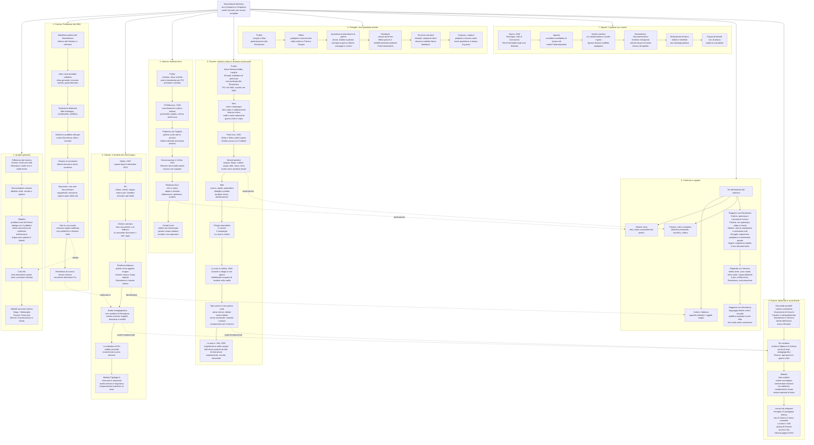

# Schema Mermaid: Neorealismo letterario

Diagramma unico per riordinare definizione, poetica, autori, opere e punti da ricordare.

```mermaid
flowchart TD
    A["Neorealismo letterario<br/>anni Quaranta e Cinquanta<br/>confini sfumati, non scuola compatta"]

    subgraph Q["1. Quadro generale"]
        Q1["Differenza dal cinema<br/>cinema: confini più netti<br/>letteratura: molte voci e molte forme"]
        Q2["Denominatore comune<br/>dibattito civile, sociale e politico"]
        Q3["Obiettivi<br/>problemi reali del Paese<br/>dialogo con il pubblico<br/>rifiuto classicismo ed estetismo<br/>antifascismo<br/>lingua verso parlato e dialetti"]
        Q4["Carlo Bo<br/>tanti neorealismi quanti sono i principali narratori"]
        Q5["Modelli secondo Calvino<br/>Verga: I Malavoglia<br/>Pavese: Paesi tuoi<br/>Vittorini: Conversazione in Sicilia"]
    end

    subgraph P["2. Calvino: Prefazione del 1964"]
        P1["Manifesto poetico del Neorealismo<br/>rilettura del Sentiero a vent'anni"]
        P2["Libro come prodotto collettivo<br/>clima generale, tensione morale, gusto letterario"]
        P3["Esplosione letteraria<br/>fatto fisiologico, esistenziale, collettivo"]
        P4["Scrittore e pubblico alla pari<br/>contro Ermetismo, élite e oscurità"]
        P5["Smania di raccontare<br/>libertà ritrovata e storie condivise"]
        P6["Esprimere, non solo documentare<br/>soggettività, emozione, sapore aspro della vita"]
        P7["Non fu una scuola<br/>nessuna regola codificata<br/>voci periferiche e diverse Italie"]
        P8["Resistenza di scorcio<br/>evitare retorica<br/>raccontare attraverso Pin"]
    end

    subgraph C["3. Calvino: Il sentiero dei nidi di ragno"]
        C1["Opera: 1947<br/>Liguria dopo 8 settembre 1943"]
        C2["Pin<br/>orfano, isolato, troppo maturo per i bambini<br/>estraneo agli adulti"]
        C3["Evento narrativo<br/>ruba una pistola a un tedesco<br/>la nasconde dove fanno i nidi i ragni"]
        C4["Realismo fiabesco<br/>pistola come oggetto magico<br/>sentiero, bosco, luogo segreto<br/>Resistenza e miseria storica"]
        C5["Scelta antiagiografica<br/>non santifica la Resistenza<br/>mostra eroismo, fragilità, disordine e conflitti"]
        C6["La solitudine di Pin<br/>nebbia nel petto<br/>smarrimento e peso interiore"]
        C7["Metodo Tipologia A<br/>riassunto in sequenze<br/>analisi retorica e linguistica<br/>interpretazione aderente al testo"]
    end

    subgraph V["4. Vittorini: realismo lirico"]
        V1["Profilo<br/>siciliano, attivo al Nord<br/>azioni clandestine per PCI<br/>animatore culturale"]
        V2["Il Politecnico, 1945<br/>svecchiamento cultura italiana<br/>psicanalisi, popolo, cultura americana"]
        V3["Polemica con Togliatti<br/>politica vuole arte al servizio<br/>Vittorini difende autonomia artistica"]
        V4["Conversazione in Sicilia, 1941<br/>Silvestro torna dalla madre<br/>incontri con il popolo"]
        V5["Realismo lirico<br/>mito e storia<br/>utopia e simbolo<br/>allitterazioni, ripetizioni, anafore"]
        V6["Astratti furori<br/>rabbia non direzionata<br/>genere umano perduto<br/>accidia e non speranza"]
    end

    subgraph PA["5. Pavese: realismo mitico e dramma esistenziale"]
        PA1["Profilo<br/>Santo Stefano Belbo, Langhe<br/>Einaudi, traduttore di americani<br/>non partecipa alla Resistenza<br/>PCI nel 1948, suicidio nel 1950"]
        PA2["Temi<br/>città e campagna<br/>terra natìa e sradicamento<br/>infanzia mitica<br/>collina come isolamento<br/>guerra civile e colpa"]
        PA3["Paesi tuoi, 1941<br/>Berto e Talino nelle Langhe<br/>Gisella uccisa con il tridente"]
        PA4["Simboli primitivi<br/>sangue, fango, sudore, acqua, latte, fuoco, terra<br/>morte come sacrificio rituale"]
        PA5["Stile<br/>scarno, rapido, paratattico<br/>dialoghi e parlato<br/>barbarie senza idealizzazione"]
        PA6["Trilogia neorealista<br/>Il carcere<br/>Il compagno<br/>La casa in collina"]
        PA7["La casa in collina, 1948<br/>Corrado si rifugia e non agisce<br/>intellettuale incapace di incidere sulla realtà"]
        PA8["Ogni guerra è una guerra civile<br/>senso storico: italiani contro italiani<br/>senso universale: umanità comune<br/>compassione per il nemico"]
        PA9["La luna e i falò, 1950<br/>Anguilla torna nelle Langhe<br/>falò rituali sostituiti da falò di distruzione<br/>sradicamento, ricordo, estraneità"]
    end

    subgraph F["6. Fenoglio: Una questione privata"]
        F1["Profilo<br/>Langhe e Alba<br/>partecipazione alla Resistenza"]
        F2["Milton<br/>partigiano ossessionato dalla verità su Fulvia e Giorgio"]
        F3["Questione privata dentro la guerra<br/>amore, dubbio e gelosia travolgono guerra, libertà, compagni e nemici"]
        F4["Flashback<br/>campo da tennis<br/>Milton povero e intellettualmente profondo<br/>Fulvia benestante"]
        F5["Tecniche narrative<br/>dialoghi, sequenze brevi<br/>discorso indiretto libero<br/>flashback"]
        F6["Crepassi, creperei<br/>poliptoto e lessico crudo<br/>morte quotidiana in tempo di guerra"]
    end

    subgraph AG["7. Viganò: L'Agnese va a morire"]
        AG1["Opera: 1949<br/>Romagna, Valli di Comacchio<br/>film di Montaldo negli anni Settanta"]
        AG2["Agnese<br/>contadina analfabeta di mezza età<br/>marito Palita deportato"]
        AG3["Svolta narrativa<br/>un soldato tedesco uccide il gatto<br/>Agnese diventa staffetta partigiana"]
        AG4["Neorealismo documentaristico<br/>territorio romagnolo<br/>articolo davanti al nome<br/>lessico del parlato"]
        AG5["Motivazione emotiva<br/>rabbia e vendetta<br/>non ideologia politica"]
        AG6["Figura femminile<br/>non di rottura<br/>materna e prudente"]
    end

    subgraph R["8. Confronti e rapporti"]
        R1["Tre declinazioni del realismo"]
        R2["Calvino: fiabesco<br/>sguardo infantile e oggetti magici"]
        R3["Vittorini: lirico<br/>mito, storia e procedimenti poetici"]
        R4["Pavese: mitico simbolico<br/>elementi primordiali, sacrificio, collina"]
        R5["Rapporto con Resistenza<br/>Calvino: partecipa e racconta di scorcio<br/>Pavese: non partecipa, colpa e inerzia<br/>Vittorini: azione clandestina e autonomia arte<br/>Fenoglio: esperienza partigiana e ossessione privata<br/>Viganò: esperienza diretta e tono documentario"]
        R6["Rapporto con Verismo<br/>realtà umile, voce corale, Italia rurale, lingua dialettale<br/>in più: antifascismo, Resistenza, comunicazione"]
        R7["Rapporto con Ermetismo<br/>linguaggio diretto contro oscurità<br/>pubblico popolare contro élite<br/>temi reali contro astrazione"]
    end

    subgraph E["9. Esame: domande e avvertimenti"]
        E1["Domande possibili<br/>cinema neorealista<br/>Ossessione di Visconti<br/>Pasolini e sottoproletariato<br/>Naturalismo e Verismo<br/>ideale dell'ostrica<br/>tracce d'esame"]
        E2["Da ricordare<br/>realismo fiabesco di Calvino<br/>punto di vista antiagiografico<br/>Pavese: ogni guerra è guerra civile"]
        E3["Metodo<br/>fare scaletta<br/>ordine cronologico<br/>commentare citazioni<br/>non attribuire caratteristiche errate<br/>restare aderenti al testo"]
        E4["Lacune da integrare<br/>Fenoglio e Il partigiano Johnny<br/>vita di Calvino e trama completa<br/>La luna e i falò<br/>poesia di Pavese<br/>Uomini e No<br/>Vittorini pagine 60-63"]
    end

    A --> Q
    A --> P
    A --> C
    A --> V
    A --> PA
    A --> F
    A --> AG
    A --> R
    A --> E

    Q1 --> Q2 --> Q3 --> Q4 --> Q5
    P1 --> P2 --> P3 --> P4 --> P5 --> P6 --> P7 --> P8
    C1 --> C2 --> C3 --> C4 --> C5 --> C6 --> C7
    V1 --> V2 --> V3 --> V4 --> V5 --> V6
    PA1 --> PA2 --> PA3 --> PA4 --> PA5 --> PA6 --> PA7 --> PA8 --> PA9
    F1 --> F2 --> F3 --> F4 --> F5 --> F6
    AG1 --> AG2 --> AG3 --> AG4 --> AG5 --> AG6
    R1 --> R2
    R1 --> R3
    R1 --> R4
    R1 --> R5
    R5 --> R6 --> R7
    E1 --> E2 --> E3 --> E4

    C4 -. "declinazione" .-> R2
    V5 -. "declinazione" .-> R3
    PA4 -. "declinazione" .-> R4
    P7 -. "spiega" .-> Q4
    P8 -. "realizzato in" .-> C5
    PA8 -. "punto fondamentale" .-> E2
    C5 -. "punto fondamentale" .-> E2
```
