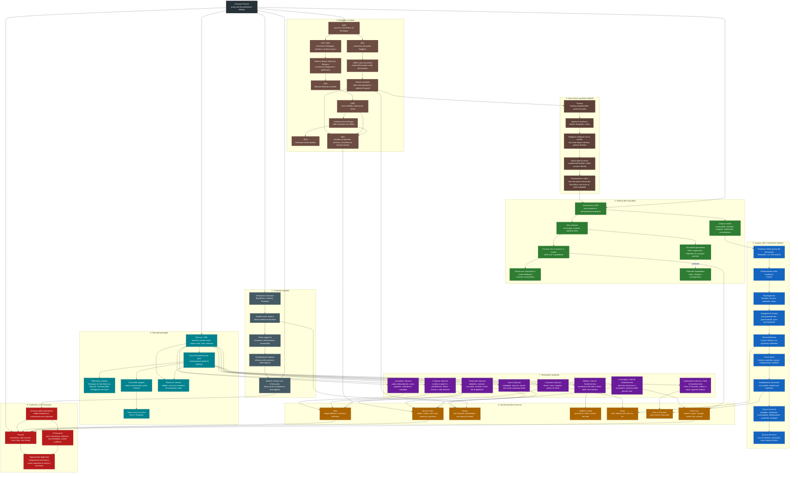

# Schema Mermaid — Giovanni Pascoli

```mermaid
flowchart TD
    A["Giovanni Pascoli<br/>poeta del Decadentismo italiano"]

    subgraph S1["1. Contesto culturale"]
        B1["Simbolismo francese<br/>Baudelaire, Verlaine, Rimbaud"]
        B2["Realtà come mistero<br/>rete di simboli da decifrare"]
        B3["Poeta veggente<br/>intuizione, illuminazione, irrazionalità"]
        B4["Decadentismo italiano<br/>sfiducia nella scienza e nella ragione"]
        B5["Matrice comune con D'Annunzio<br/>stesso punto di partenza, esiti opposti"]
    end

    subgraph S2["2. Biografia e trauma"]
        C1["1855<br/>nascita a San Mauro di Romagna"]
        C2["1867<br/>assassinio del padre Ruggero"]
        C3["1868 e anni successivi<br/>morte della madre e altri lutti familiari"]
        C4["1873-1882<br/>Università di Bologna, Carducci, laurea in greco"]
        C5["Matera, Massa, Messina, Bologna<br/>carriera di insegnante e professore"]
        C6["1891<br/>Myricae dedicata al padre"]
        C7["1895<br/>anno terribile: matrimonio di Ida"]
        C8["Castelvecchio di Barga<br/>nido ricostruito con Maria"]
        C9["1912<br/>morte per cirrosi epatica"]
        C10["Evento fondante<br/>lutto senza giustizia e colpevoli impuniti"]
        C11["Nido<br/>famiglia, protezione, chiusura, resistenza al mondo esterno"]
    end

    subgraph S3["3. Caso clinico secondo Andreoli"]
        D1["Trauma<br/>frattura prodotta dalla morte del padre"]
        D2["Ipotesi di alcolismo<br/>lettere, fotografie, cirrosi"]
        D3["Rapporto morboso con le sorelle<br/>Ida come figura materna, gelosia di Maria"]
        D4["Maria dopo la morte<br/>custode dell'eredità e delle versioni ufficiali"]
        D5["Rivalutazione critica<br/>non solo poeta sereno del fanciullino, ma vicino ai poeti maledetti"]
    end

    subgraph S4["4. Poetica del Fanciullino"]
        E1["Il Fanciullino, 1897<br/>prosa poetica e dichiarazione di poetica"]
        E2["Voce interiore<br/>meraviglia, stupore, sguardo puro"]
        E3["Il nuovo non si inventa, si scopre<br/>umili cose e quotidiano"]
        E4["Poesia non educativa in modo deliberato<br/>funzione consolatrice"]
        E5["Fanciullino pascoliano<br/>ferito, angosciato, rimpianto di una pace perduta"]
        E6["Fanciullo leopardiano<br/>vitale, energico, immaginativo"]
        E7["Cinque cardini<br/>irrazionalità, analogia, scoperta, simbolismo, consolazione"]
    end

    subgraph S5["5. Lingua, stile e rivoluzione poetica"]
        F1["Fondatore della poesia del Novecento<br/>Mengaldo: con D'Annunzio"]
        F2["Rivoluzionario nella tradizione<br/>Contini"]
        F3["Plurilinguismo<br/>familiare, tecnico, dialettale, latino"]
        F4["Categorie di Contini<br/>pre-grammaticale, grammaticale, post-grammaticale"]
        F5["Fonosimbolismo<br/>il suono allude a un significato simbolico"]
        F6["Verso franto<br/>lineette, parentesi, pause, interpunzione variabile"]
        F7["Ampliamento semantico<br/>una parola contiene più significati"]
        F8["Figure ricorrenti<br/>analogia, sinestesia, onomatopea, allitterazione, anastrofe, enallage"]
        F9["Musica del verso<br/>eco di Verlaine: musicalità come trama fonetica"]
    end

    subgraph S6["6. Raccolte principali"]
        G1["Myricae, 1891<br/>tamerici, piccole cose, natura, lutto, nido, assenza"]
        G2["Canti di Castelvecchio, 1907<br/>continuazione ideale di Myricae"]
        G3["Differenza centrale<br/>Romagna di San Mauro in Myricae, Toscana della Garfagnana nei Canti"]
        G4["Ciclo delle stagioni<br/>ordine rassicurante contro il dolore"]
        G5["Tema nuovo nei Canti<br/>Eros e Thanatos"]
        G6["Elemento comune<br/>nebbia, cari morti, tentativo di ricostituire il nido"]
    end

    subgraph S7["7. Testi poetici analizzati"]
        H1["Arano, Myricae<br/>madrigale, autunno, lavoro dei campi, speranza finale"]
        H2["Lavandare, Myricae<br/>aratro abbandonato, canto popolare, solitudine e nostalgia"]
        H3["X Agosto, Myricae<br/>rondine e padre in parallelismo, dolore cosmico, nido distrutto"]
        H4["Nebbia, Canti di Castelvecchio<br/>protezione del nido e rifiuto delle cose lontane"]
        H5["Temporale, Myricae<br/>bubbolio, contrasti cromatici, casolare come ala di gabbiano"]
        H6["L'assiuolo, Myricae<br/>climax: voce, singulto, pianto di morte"]
        H7["Il gelsomino notturno, Canti di Castelvecchio<br/>Eros e Thanatos, natura e sposi, sguardo esterno"]
        H8["La tovaglia, Canti di Castelvecchio<br/>morti da minacciosi a consolatori, memoria delle piccole cose"]
    end

    subgraph S8["8. Nuclei simbolici ricorrenti"]
        I1["Nido<br/>rifugio affettivo e chiusura difensiva"]
        I2["Morte e lutto<br/>padre, madre, cari morti, assenza di giustizia"]
        I3["Natura<br/>non bozzetto naturalistico, ma trama di simboli"]
        I4["Nebbia e siepe<br/>protezione, limite, recinto del nido"]
        I5["Suoni<br/>chiù, tintinno, don don, fru fru"]
        I6["Eros e Thanatos<br/>vita e morte intrecciate"]
        I7["Umili cose<br/>tamerici, pane, tovaglia, aratro, fiori, animali"]
    end

    subgraph S9["9. Confronto con D'Annunzio"]
        L1["Pascoli<br/>fanciullino, nido, piccole cose, lutto, vita ritirata"]
        L2["D'Annunzio<br/>vate, superuomo, bellezza, vita inimitabile, azione pubblica"]
        L3["Comune radice decadente<br/>realtà misteriosa e conoscenza non razionale"]
        L4["Opposizione degli esiti<br/>ripiegamento domestico contro espansione eroica e mondana"]
    end

    A --> B1
    B1 --> B2 --> B3 --> B4 --> B5
    B5 --> A

    A --> C1 --> C2 --> C3 --> C10
    C1 --> C4 --> C5 --> C6 --> C7 --> C8 --> C9
    C10 --> C11
    C7 --> C11
    C8 --> C11

    C10 --> D1 --> D2 --> D3 --> D4 --> D5
    D5 --> E1

    A --> E1 --> E2 --> E3 --> E4
    E2 --> E5
    E5 -. "contrasto" .-> E6
    E1 --> E7

    E7 --> F1 --> F2
    F2 --> F3 --> F4 --> F5 --> F6 --> F7 --> F8 --> F9
    F5 --> I5
    F7 --> I6

    A --> G1
    G1 --> G2 --> G3
    G2 --> G4 --> G5
    G1 --> G6
    G2 --> G6

    G1 --> H1
    G1 --> H2
    G1 --> H3
    G2 --> H4
    G1 --> H5
    G1 --> H6
    G2 --> H7
    G2 --> H8

    H1 --> I3
    H2 --> I1
    H3 --> I2
    H3 --> I1
    H4 --> I4
    H5 --> I3
    H5 --> I1
    H6 --> I5
    H6 --> I2
    H7 --> I6
    H8 --> I7
    H8 --> I2

    C11 --> I1
    C10 --> I2
    E3 --> I7
    B2 --> I3

    A --> L1
    B5 --> L3
    L3 --> L1
    L3 --> L2
    L1 --> L4
    L2 --> L4

    I1 --> L1
    I2 --> L1
    I7 --> L1

    classDef centro fill:#263238,color:#ffffff,stroke:#111111,stroke-width:2px
    classDef contesto fill:#455a64,color:#ffffff,stroke:#263238
    classDef bio fill:#6d4c41,color:#ffffff,stroke:#3e2723
    classDef clinico fill:#5d4037,color:#ffffff,stroke:#3e2723
    classDef poetica fill:#2e7d32,color:#ffffff,stroke:#1b5e20
    classDef stile fill:#1565c0,color:#ffffff,stroke:#0d47a1
    classDef opere fill:#00838f,color:#ffffff,stroke:#006064
    classDef testi fill:#6a1b9a,color:#ffffff,stroke:#4a148c
    classDef simboli fill:#ad6500,color:#ffffff,stroke:#7a4300
    classDef confronto fill:#b71c1c,color:#ffffff,stroke:#7f0000

    class A centro
    class B1,B2,B3,B4,B5 contesto
    class C1,C2,C3,C4,C5,C6,C7,C8,C9,C10,C11 bio
    class D1,D2,D3,D4,D5 clinico
    class E1,E2,E3,E4,E5,E6,E7 poetica
    class F1,F2,F3,F4,F5,F6,F7,F8,F9 stile
    class G1,G2,G3,G4,G5,G6 opere
    class H1,H2,H3,H4,H5,H6,H7,H8 testi
    class I1,I2,I3,I4,I5,I6,I7 simboli
    class L1,L2,L3,L4 confronto
```
