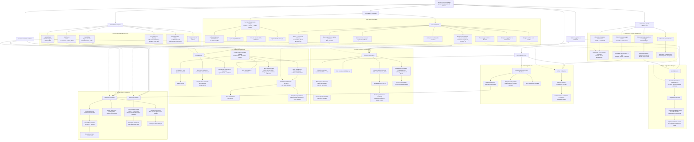

# Il romanzo del Novecento — Schema Mermaid

```mermaid
flowchart TD
    RN["Romanzo del Novecento<br/>preparazione esame di Italiano"]

    RN --> NOV["Innovazioni rispetto all'Ottocento"]
    RN --> TEMPO["Tempo soggettivo e interiorita"]
    RN --> PERS["Personaggio in fieri"]
    RN --> MOD["Modernismo europeo"]
    RN --> TEC["Tecniche narrative centrali"]
    RN --> STUDIO["Da studiare e ripassare"]

    subgraph S1["1. Innovazioni rispetto all'Ottocento"]
        O_NAR["Ottocento: narratore onnisciente<br/>sa tutto e commenta"]
        N_NAR["Novecento: punto di vista soggettivo<br/>coincide con un personaggio"]
        O_TEM["Ottocento: tempo oggettivo e cronologico<br/>come l'orologio"]
        N_TEM["Novecento: tempo soggettivo e interiore<br/>durata bergsoniana"]
        O_PER["Ottocento: personaggio stabile<br/>coerente e a tutto tondo"]
        N_PER["Novecento: personaggio in fieri<br/>ambiguo, isolato, in divenire"]
        O_STR["Ottocento: trama lineare"]
        N_STR["Novecento: nuclei tematici<br/>piani temporali sovrapposti"]

        O_NAR --> N_NAR
        O_TEM --> N_TEM
        O_PER --> N_PER
        O_STR --> N_STR
    end

    NOV --> O_NAR
    NOV --> O_TEM
    NOV --> O_PER
    NOV --> O_STR

    subgraph S2["2. Tempo soggettivo e Bergson"]
        BERG["Henri Bergson"]
        DUR["Durata: i momenti si compenetrano<br/>non sono una successione ordinata"]
        INT["Tempo dell'interiorita"]
        VAR["Il tempo rallenta o accelera<br/>secondo desideri, aspettative e percezione"]
        CRON["I protagonisti non vivono<br/>in un quadro cronologico certo"]

        BERG --> DUR --> INT --> VAR --> CRON
    end

    TEMPO --> BERG
    N_TEM --> BERG

    subgraph S3["3. Personaggio in fieri"]
        IFIERI["In fieri: in divenire"]
        TRATTI["Ambiguo, incerto, complesso, sfumato"]
        ESIS["Estraniamento, isolamento e solitudine<br/>rispetto al mondo"]
        FREUD["Influenza della psicanalisi freudiana"]
        GEN["Rapporti con i genitori<br/>determinano lo sviluppo psichico"]
        PF["Tema padre-figlio centrale"]
        ASS["Libere associazioni<br/>base della psicanalisi"]

        IFIERI --> TRATTI --> ESIS
        FREUD --> GEN
        FREUD --> PF
        FREUD --> ASS
    end

    PERS --> IFIERI
    PERS --> FREUD
    N_PER --> IFIERI

    subgraph S4["4. Autori europei del Modernismo"]
        PROUST["Marcel Proust<br/>Francia<br/>Alla ricerca del tempo perduto, 1913-1927"]
        KAFKA["Franz Kafka<br/>lingua tedesca<br/>La metamorfosi, 1916"]
        JOYCE["James Joyce<br/>Irlanda e inglese<br/>Ulisse, 1922"]
        SVEVO["Italo Svevo<br/>Italia<br/>La coscienza di Zeno, 1923"]
        PIR["Luigi Pirandello<br/>Italia<br/>Il fu Mattia Pascal<br/>Uno nessuno e centomila"]
        WOOLF["Virginia Woolf<br/>antologia"]
    end

    MOD --> PROUST
    MOD --> KAFKA
    MOD --> JOYCE
    MOD --> SVEVO
    MOD --> PIR
    MOD --> WOOLF

    subgraph S5["5. Proust: memoria involontaria"]
        MI["Memoria involontaria"]
        SENSOR["Stimolo sensoriale<br/>soprattutto olfatto e gusto"]
        PASS["Riemergono sensazioni intere del passato<br/>non solo un ricordo"]
        SPONT["Accade spontaneamente<br/>non viene cercata"]
        NDV["Non coincide con il deja vu"]
        MAD["Episodio della madeleine<br/>Dalla parte di Swann, 1913"]
        TEA["Madeleine intinta nel te"]
        COMB["Riemerge l'infanzia a Combray<br/>zia Leonie, giardino, strade, chiesa"]
        METP["Metafora dei pezzetti di carta giapponesi<br/>nell'acqua si aprono in figure"]
        RICESP["Il ricordo si espande<br/>da una piccola sensazione"]

        MI --> SENSOR --> PASS --> SPONT
        MI --> NDV
        MI --> MAD --> TEA --> COMB
        MI --> METP --> RICESP
    end

    PROUST --> MI
    TEMPO --> MI

    subgraph S6["6. Kafka: La metamorfosi"]
        TRK["Trama: Gregor Samsa si sveglia<br/>trasformato in un enorme insetto"]
        ISOK["La famiglia lo isola progressivamente"]
        MORTE["Gregor muore"]
        STRAN["Straniamento"]
        CONS["Evento straordinario presentato come consueto"]
        REAZ["Gregor cerca di fare un altro dormitino<br/>nessun terrore"]
        SPAES["Surreale piu descrizione realistica<br/>spaesamento del lettore"]
        TEMA1["Tema: isolamento e diversita"]
        TEMA2["Tema: autobiografia<br/>Kafka escluso dalla famiglia per la vocazione letteraria"]
        TEMA3["Tema: alienazione dell'intellettuale<br/>nella societa moderna"]
        ALIEN["Alienazione: estraneita a se stessi<br/>dal latino alienum"]
        MARX["Marx: alienazione dell'operaio"]
        CHAP["Chaplin, Tempi moderni:<br/>bulloni avvitati anche fuori dalla fabbrica"]

        TRK --> ISOK --> MORTE
        STRAN --> CONS --> REAZ
        STRAN --> SPAES
        TRK --> TEMA1
        TRK --> TEMA2
        TRK --> TEMA3 --> ALIEN
        ALIEN --> MARX
        ALIEN --> CHAP
    end

    KAFKA --> TRK
    KAFKA --> STRAN
    PERS --> TEMA1

    subgraph S7["7. Joyce: flusso di coscienza"]
        FDC["Flusso di coscienza"]
        MIM["Rappresentazione mimetica del pensiero"]
        NOF["Senza filtro narrativo<br/>su logica e sintassi"]
        LIB["Procede per libere associazioni"]
        ULI["Ulisse: assenza di punteggiatura<br/>pensieri concatenati"]
        MONO["Monologo interiore"]
        MONO_C["Prima persona, come rivolto a interlocutore<br/>filtro presente, grammatica rispettata"]
        MONO_E["Esempio: Preambolo<br/>La coscienza di Zeno"]
        FDC_C["Spontaneo e alogico<br/>filtro assente, grammatica violata"]
        FDC_E["Esempio: Ulisse di Joyce"]

        FDC --> MIM --> NOF --> LIB
        FDC --> ULI
        MONO --> MONO_C --> MONO_E
        FDC --> FDC_C --> FDC_E
    end

    JOYCE --> FDC
    ASS --> FDC
    SVEVO --> MONO
    TEC --> MI
    TEC --> STRAN
    TEC --> FDC
    TEC --> MONO

    subgraph S8["8-9. Studio e checklist"]
        LIBRO["Sul libro: Modernismo europeo<br/>romanzo e poesia, p. 496 e seguenti"]
        K_ST["Kafka: incipit della Metamorfosi<br/>e Lettera al padre"]
        J_ST["Joyce: incipit dell'Ulisse"]
        P_ST["Proust: episodio della Madeleine"]
        W_ST["Virginia Woolf: antologia"]
        CHECK["Checklist finale"]
        C1["Narratore soggettivo vs onnisciente"]
        C2["Bergson: tempo come durata"]
        C3["Personaggio in fieri: in divenire"]
        C4["Memoria involontaria: stimolo sensoriale<br/>sensazioni del passato, non deja vu"]
        C5["Straniamento: consueto uguale straordinario"]
        C6["Alienazione: estraneita a se stessi"]
        C7["Monologo interiore: prima persona<br/>filtro presente"]
        C8["Flusso di coscienza: mimetico<br/>nessun filtro, libere associazioni"]

        LIBRO --> K_ST
        LIBRO --> J_ST
        LIBRO --> P_ST
        LIBRO --> W_ST
        CHECK --> C1
        CHECK --> C2
        CHECK --> C3
        CHECK --> C4
        CHECK --> C5
        CHECK --> C6
        CHECK --> C7
        CHECK --> C8
    end

    STUDIO --> LIBRO
    STUDIO --> CHECK
    C1 -.-> N_NAR
    C2 -.-> DUR
    C3 -.-> IFIERI
    C4 -.-> MI
    C5 -.-> STRAN
    C6 -.-> ALIEN
    C7 -.-> MONO
    C8 -.-> FDC
```
