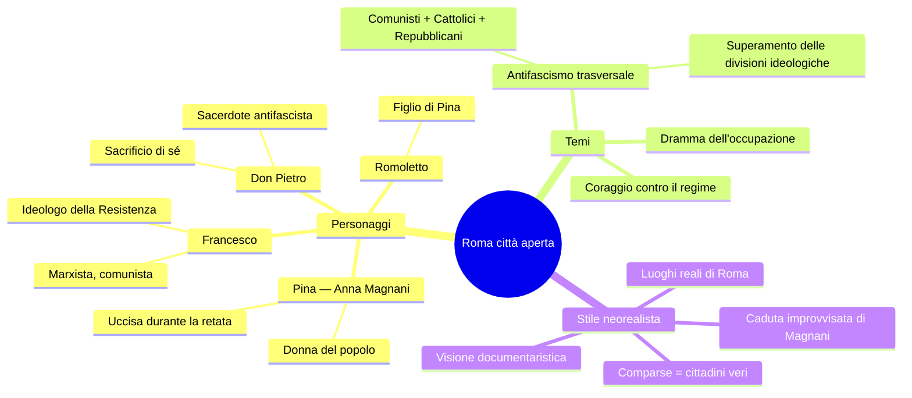
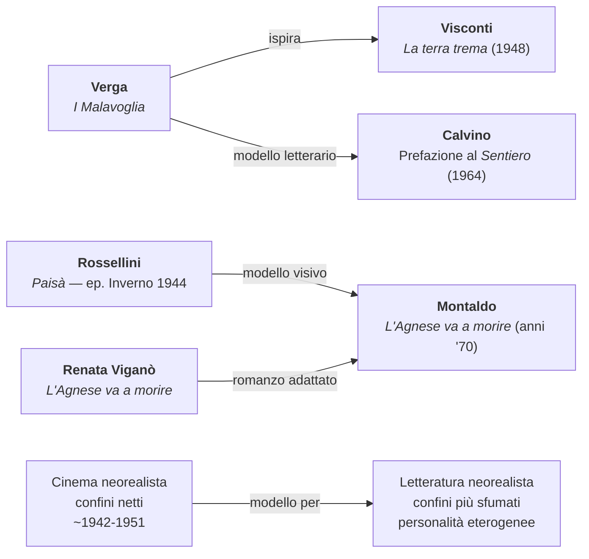
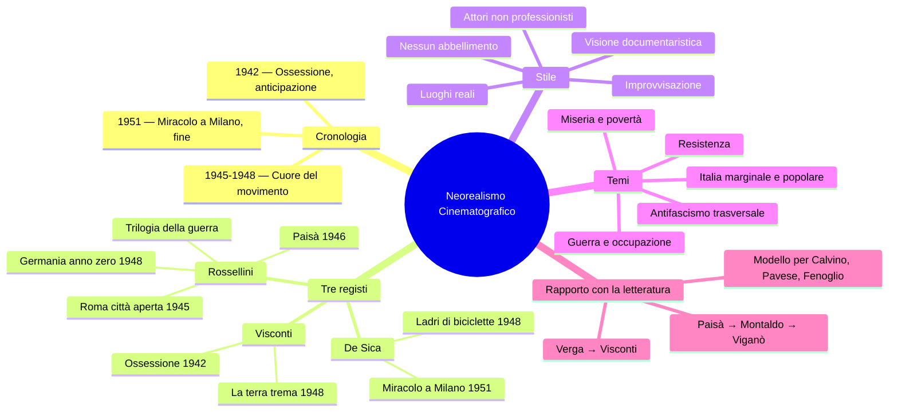

# Il Neorealismo Cinematografico

---

## Cronologia essenziale

| Anno | Film / Evento |
|------|---------------|
| **1942** | *Ossessione* di Visconti — anticipazione del neorealismo |
| **1945** | *Roma città aperta* di Rossellini — primo film della Trilogia della guerra |
| **1946** | *Paisà* di Rossellini — secondo film della Trilogia |
| **1948** | *Germania anno zero* di Rossellini — chiusura della Trilogia |
| **1948** | *La terra trema* di Visconti — tratto da *I Malavoglia* di Verga |
| **1948** | *Ladri di biciclette* di De Sica |
| **1951** | *Miracolo a Milano* di De Sica — fine simbolica del neorealismo cinematografico |

---

## 1. Caratteri generali del neorealismo cinematografico

Il neorealismo cinematografico è una corrente artistica che nasce nell'Italia della Seconda guerra mondiale e del primo dopoguerra, in un momento in cui il cinema italiano — come sottolinea la professoressa — «faceva scuola» nel mondo. Il movimento si sviluppa come risposta diretta all'esperienza della guerra, dell'occupazione nazifascista e della miseria che ne derivò, e propone una **visione documentaria della realtà**: ciò significa che i film neorealisti rimangono quanto più possibile aderenti alla realtà così com'è, senza abbellimenti, senza filtri, con una messa in scena scarna ed essenziale.

I confini cronologici del neorealismo cinematografico sono relativamente precisi. Il punto di partenza convenzionale è *Ossessione* di Luchino Visconti (1942), considerato il film che **anticipa** il movimento. La conclusione simbolica è invece rappresentata da *Miracolo a Milano* di Vittorio De Sica (1951), con la sua apertura al sogno e al surrealismo che segna una rottura rispetto al rigore documentaristico neorealista. Il fenomeno dura dunque, in senso stretto, **circa un decennio**. In senso più ampio, però, molta storia del cinema italiano ha continuato idealmente a proseguire su questo filone ben oltre gli anni Cinquanta.

### Tratti distintivi dello stile neorealista

Il modo di girare dei registi neorealisti si distingue nettamente dal cinema di finzione tradizionale. Alcuni elementi ricorrono in tutte le opere principali:

- **Luoghi reali** al posto dei set in studio: i registi scendono con la macchina da presa per le strade, nelle piazze, nei paesaggi autentici dell'Italia devastata dalla guerra
- **Attori non professionisti** mescolati a professionisti, o talvolta usati in modo esclusivo, per ottenere una recitazione più naturale e spontanea
- **Improvvisazione controllata**: agli attori venivano indicate, in linea di massima, le azioni da compiere, ma si lasciava spazio all'imprevisto — ciò che accadeva realmente durante le riprese poteva diventare parte del film
- **Contenuti legati alla realtà sociale**: guerra, miseria, povertà, Resistenza, condizioni di vita degli italiani comuni
- **Assenza di estetizzazione**: rifiuto della bellezza formale fine a sé stessa in favore di una rappresentazione cruda e diretta

---

## 2. I tre protagonisti

I nomi fondamentali del cinema neorealista, quelli che la professoressa chiede di ricordare, sono tre: **Luchino Visconti**, **Roberto Rossellini** e **Vittorio De Sica**.

> [!note] Dalla lezione
> «Vittorio De Sica, cioè il padre di Christian De Sica, che poi ha fatto un'altra carriera un po' diversa rispetto a quella del padre.»

> [!note] Dalla lezione
> «Roberto Rossellini, non so se avete presente Isabella Rossellini, attrice, è stata moglie di David Lynch, che è morto l'anno scorso... era il padre di Isabella Rossellini e marito di Ingrid Bergman, che è stata una delle attrici di culto, una delle donne più belle del cinema mondiale di tutti i tempi.»

---

## 3. Luchino Visconti

Per quanto riguarda Visconti, i titoli da ricordare e contestualizzare nell'ambito del neorealismo sono due.

### 3.1 *Ossessione* (1942)

*Ossessione* è la pellicola che viene convenzionalmente indicata come **anticipazione** del neorealismo, pur essendo stata girata durante la guerra, dunque prima della fioritura vera e propria del movimento. Il film inaugura quello sguardo sulla realtà quotidiana, spogliato di ogni retorica, che diventerà il tratto fondante della corrente.

### 3.2 *La terra trema* (1948)

*La terra trema* del 1948 è l'altro film neorealista fondamentale di Visconti. Si tratta di un'opera che ha un rapporto diretto con la letteratura: è infatti tratta da *I Malavoglia* di Giovanni Verga. Il legame con il verismo è dunque esplicito — Visconti traduce nel linguaggio cinematografico quella stessa attenzione per il mondo dei "vinti", per la realtà dei pescatori siciliani, che era stata al cuore del progetto narrativo verghiano. Non è un caso che *I Malavoglia* vengano poi indicati dallo stesso Calvino, nella celebre Prefazione al *Sentiero dei nidi di ragno* (1964), come uno dei tre modelli fondamentali per gli scrittori neorealisti.

---

## 4. Roberto Rossellini e la Trilogia della guerra

La produzione di Roberto Rossellini è partita dal neorealismo ma ha poi spaziato enormemente nel corso dei decenni successivi. I film più rappresentativi ascrivibili a questa corrente sono tre, che offrono una **visione documentaria della realtà** e vengono raggruppati sotto il nome di **Trilogia della guerra**: *Roma città aperta* (1945), *Paisà* (1946) e *Germania anno zero* (1948).

### 4.1 *Roma città aperta* (1945)

#### La trama

*Roma città aperta* viene girato nel 1945, cioè nell'ultimo anno della Seconda guerra mondiale. Rossellini scende con la macchina da presa **per le vie di Roma** e racconta la storia di **Pina**, interpretata da **Anna Magnani**, nel giorno in cui deve sposare **Francesco**, un ideologo della Resistenza, un marxista e comunista. Ma proprio quel giorno viene compiuta una **retata** dai nazifascisti: Francesco viene portato via e Pina, nel disperato tentativo di inseguire la camionetta che lo sta portando via, viene uccisa da un colpo di fucile.

> [!note] Dalla lezione
> «Forse Anna Magnani la conoscete, è anche la protagonista di *Mamma Roma* di Pier Paolo Pasolini, ad esempio. È un'attrice di culto nel cinema italiano.»

La donna morente viene raggiunta dal suo **figlioletto piccolo**, avuto da una precedente relazione, e da un **sacerdote antifascista** (Don Pietro), che anche lui finirà per fare sacrificio di sé per la difesa dei propri ideali. Il film si struttura dunque attorno a tre figure principali: Francesco (il comunista), Pina (la donna del popolo) e il sacerdote (il cattolico antifascista).

#### La scena paradigmatica

La scena della morte di Pina è considerata dalla professoressa **paradigmatica di tutto il neorealismo**. In essa troviamo due elementi fondamentali:

1. **Il contenuto**: il coraggio di una donna che cerca di opporsi al regime e ne finisce vittima
2. **La forma**: una messa in scena che esemplifica il modo di girare dei registi neorealisti

Un dettaglio significativo riguarda la **caduta di Anna Magnani** durante le riprese. All'attrice fu indicato, in linea di massima, quali azioni compiere davanti alla macchina da presa, ma la caduta mentre inseguiva la camionetta sotto i colpi di fucile **non era prevista**: avvenne casualmente, e il regista decise di tenerla nel montaggio finale. Questo episodio illustra perfettamente il principio neorealista secondo cui **tutto ciò che accadeva nella realtà diventava oggetto di rappresentazione**.

> [!note] Dalla lezione
> «La scena a cui sto facendo riferimento... è una delle scene più **iconiche** del cinema italiano di tutti i tempi. Chi si dica così eventualmente appassionato di cinema, se non conosce questa, almeno questa, cioè non conosce niente.»

#### L'uso dei luoghi reali e delle comparse

I luoghi in cui Rossellini gira sono i **luoghi reali** di Roma. La folla addossata ai muri durante il rastrellamento è composta da **cittadini e cittadine romani** che fino a pochi mesi prima avevano vissuto il dramma dell'occupazione nazifascista. Le comparse non erano attori: erano persone che avevano realmente subito ciò che stavano "recitando".

> [!note] Dalla lezione
> «Queste persone che parteciparono al film come comparse rilasciarono delle dichiarazioni all'epoca e dissero di essere rimasti molto turbati dal fatto di dover impersonare un ruolo che in realtà avevano vissuto in prima persona fino a pochi mesi prima; quindi di aver sperimentato di nuovo quella paura, quel terrore che erano molto diffusi nel momento in cui c'erano delle traversie, degli eventi simili.»

#### Il messaggio politico: l'antifascismo trasversale

Attraverso i personaggi di Francesco (marxista) e del sacerdote (cattolico antifascista), Rossellini mette in luce il fatto che l'**antifascismo fu un fenomeno trasversale**, capace di superare le divisioni ideologiche e di parte. Al **Comitato di Liberazione Nazionale** parteciparono membri di tutte le forze politiche: comunisti, cattolici, repubblicani. La Resistenza non fu un fatto di partito, ma un'unione che andò oltre le appartenenze — ed è questo che il film vuole rappresentare.

### 4.2 *Paisà* (1946)

#### Struttura e significato del titolo

*Paisà* è un film **ad episodi**, sempre di Roberto Rossellini. Il titolo riprende l'appellativo con cui i soldati, soprattutto quelli del Sud Italia, si chiamavano tra di loro: **«paisà»**, cioè «paesano», «compaesano». Il film ripercorre molti luoghi dell'Italia in una sorta di **mosaico che va dalla Sicilia fino al Po**, e ha come tema conduttore quello della guerra, della miseria, della povertà e delle condizioni di vita in cui versavano gli italiani. Come *Roma città aperta*, anche questo è un film realizzato **immediatamente dopo la fine della guerra**.

#### L'episodio "Inverno 1944"

L'episodio su cui si concentra la lezione è l'ultimo del film, intitolato **Inverno 1944**, girato nella zona delle **valli** — un territorio molto vicino alla zona della classe (Comacchio, le valli del Po). La scelta ambientale è significativa: la lotta di Resistenza è comunemente associata alla **montagna** e alla **collina** (le Langhe piemontesi di Fenoglio e Pavese, ad esempio), ma in queste zone pianeggianti e paludose la guerriglia ebbe caratteristiche completamente diverse e comportò **moltissime difficoltà**. Un paesaggio piatto ed esposto, in cui anche ricevere i rifornimenti significava spesso rimetterci la vita.

L'episodio racconta lo scontro tra **partigiani e alleati** da una parte e **nazifascisti** dall'altra, nella fase conclusiva della guerra — quella che fu anche la **più cruenta**. La voce fuori campo del film introduce la scena: «Al di là delle linee, partigiani italiani e soldati americani dell'OSS, fraternamente uniti, combattono una battaglia di ogni giorno, una delle più dure e difficili di tutta la campagna d'Italia...»

Ciò che il film mostra è il quadro che Rossellini offre della Resistenza: i partigiani e gli alleati in **condizioni estremamente ostili**, poco armati, male armati, sprovvisti di viveri, in un paesaggio (le valli di Comacchio, il Po) dove la lotta era fatta di rappresaglie, vendette, e dove la sopravvivenza quotidiana era una sfida continua.

#### Il legame con *L'Agnese va a morire*

Questo episodio di *Paisà* ha un'importanza che va oltre il film stesso: sarà il **modello** a cui negli anni Settanta si ispirerà il regista **Giuliano Montaldo** per la realizzazione di *L'Agnese va a morire*, tratto dal romanzo neorealista omonimo di **Renata Viganò**. Il collegamento tra cinema e letteratura neorealista è dunque diretto: un episodio cinematografico del 1946 diventa il modello visivo per un'opera degli anni Settanta che, a sua volta, rielabora un romanzo della letteratura neorealista.

> [!note] Dalla lezione
> «Questo film, in particolare questo episodio, sarà il modello a cui si ispirerà negli anni Settanta il regista Montaldo per la realizzazione di *L'Agnese va a morire*. [...] Ne guarderemo delle scene perché faremo dei collegamenti.»

### 4.3 *Germania anno zero* (1948)

*Germania anno zero* è il terzo e ultimo film della Trilogia della guerra. Completa lo sguardo di Rossellini sui devastanti effetti del conflitto, spostandosi questa volta fuori dall'Italia, nella **Berlino distrutta** del dopoguerra. Il film mantiene la stessa coerenza stilistica e tematica degli altri due: la visione documentaristica, l'attenzione alla miseria e alla distruzione, la rappresentazione senza filtri delle conseguenze della guerra sui civili, in particolare sui più vulnerabili. (Nota: questa lezione non è stata trattata in modo approfondito nelle trascrizioni disponibili.)

---

## 5. Vittorio De Sica

Vittorio De Sica è il terzo grande protagonista del neorealismo cinematografico. La professoressa indica che i suoi film dovevano essere trattati in una lezione successiva, ma dalla lezione del 22 gennaio emergono due elementi fondamentali.

### 5.1 *Ladri di biciclette* (1948)

*Ladri di biciclette* è uno dei capolavori del neorealismo, girato da De Sica nel 1948. Il film rappresenta un esempio perfetto della poetica neorealista: la storia di un uomo comune nella Roma del dopoguerra, alle prese con la miseria e la disperazione quotidiana. (Nota: il film è citato nel programma ma la lezione dedicata non è presente nelle trascrizioni disponibili.)

### 5.2 *Miracolo a Milano* (1951) — La fine del neorealismo

*Miracolo a Milano* è il film che viene convenzionalmente indicato come la **fine simbolica del neorealismo cinematografico**. Con la sua apertura al **sogno** e al **surrealismo**, questo film segna un'uscita dalla rigida aderenza alla realtà che aveva caratterizzato il movimento. Non è più la rappresentazione cruda e documentaristica del reale, ma un'immaginazione che si libera dai vincoli del realismo — un segnale che la stagione neorealista in senso stretto si stava chiudendo.

---

## 6. Il neorealismo cinematografico come modello per la letteratura

Il rapporto tra cinema e letteratura neorealista è strettissimo. Il cinema arriva prima e in modo più compatto: i confini del neorealismo cinematografico sono **più definiti e netti** rispetto a quelli della letteratura, sia per quanto riguarda i contenuti che lo stile e i riferimenti cronologici. Il cinema neorealista funziona come un modello e un punto di riferimento per gli scrittori che, negli stessi anni, cominciano a raccontare l'Italia del dopoguerra.

Questo legame è visibile in diversi modi:

- *La terra trema* di Visconti nasce da *I Malavoglia* di Verga — il cinema neorealista guarda alla tradizione verista
- L'episodio di *Paisà* sulle valli di Comacchio ispira il film *L'Agnese va a morire* — il cinema neorealista diventa modello per adattamenti cinematografici della letteratura neorealista
- Calvino, nella Prefazione al *Sentiero dei nidi di ragno* (1964), indica *I Malavoglia* come uno dei tre modelli della triade fondante del neorealismo letterario — la stessa opera da cui Visconti aveva tratto *La terra trema*

---

## 7. Sintesi: la poetica del neorealismo cinematografico

Il neorealismo cinematografico si può riassumere in una serie di princìpi che attraversano tutte le opere principali del movimento:

La **realtà irrompe** nel cinema. Non si tratta di costruire storie in studio, di adornare, di filtrare. Si tratta di portare la macchina da presa nei luoghi reali, tra le persone vere, e di raccontare ciò che il Paese sta vivendo: la guerra, la miseria, la Resistenza, la distruzione, la ricostruzione. I registi scendono in strada — letteralmente — e filmano ciò che trovano, con attori che spesso non sono professionisti e con una tecnica che privilegia l'autenticità sulla perfezione formale.

Come dice la professoressa a proposito di *Roma città aperta*: una **visione documentaristica**, senza abbellimenti, senza filtri, una visione scarna ed essenziale del dramma che è stata la guerra in Italia.

Il neorealismo cinematografico è, in definitiva, il momento in cui il cinema italiano diventa coscienza civile del Paese — uno specchio che riflette senza deformazioni la realtà di un'Italia uscita distrutta dalla guerra, ma determinata a raccontarsi con onestà.

