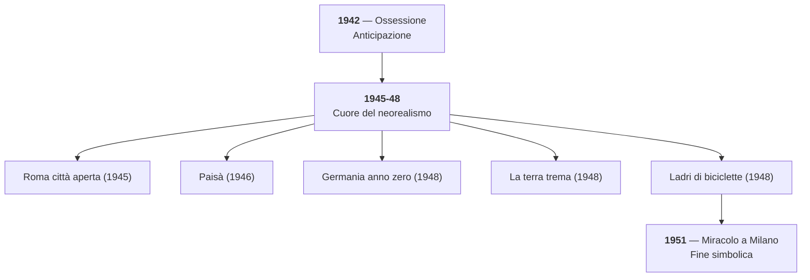

# Il Neorealismo Cinematografico — Riassunto

---

## Coordinate generali

Il neorealismo cinematografico è una corrente che nasce nell'Italia della Seconda guerra mondiale e del primo dopoguerra. I suoi confini cronologici sono relativamente precisi: si va da *Ossessione* di Visconti (**1942**), considerato l'anticipazione del movimento, fino a *Miracolo a Milano* di De Sica (**1951**), la cui apertura al sogno e al surrealismo ne segna la conclusione simbolica. In senso stretto, il fenomeno dura **circa un decennio**.

Il tratto fondante è la **visione documentaristica della realtà**: i registi scendono in strada con la macchina da presa, girano in **luoghi reali**, usano **attori non professionisti** accanto a professionisti, e lasciano spazio all'improvvisazione. Tutto ciò che accade realmente durante le riprese può diventare parte del film. Nessun abbellimento, nessun filtro: una messa in scena scarna ed essenziale.

I tre protagonisti da ricordare sono **Luchino Visconti**, **Roberto Rossellini** e **Vittorio De Sica**.

---

## Visconti

Due titoli fondamentali: *Ossessione* (1942), che anticipa il neorealismo, e *La terra trema* (1948), tratto da *I Malavoglia* di Verga. Quest'ultimo film stabilisce un legame diretto tra la tradizione verista e il cinema neorealista: la stessa attenzione per il mondo dei "vinti" e per la realtà dei pescatori siciliani.

---

## Rossellini — La Trilogia della guerra

I tre film di Rossellini più rappresentativi formano la **Trilogia della guerra**: *Roma città aperta* (1945), *Paisà* (1946) e *Germania anno zero* (1948).

### Roma città aperta (1945)

Rossellini racconta la storia di **Pina** (Anna Magnani), uccisa dai nazifascisti mentre tenta di inseguire la camionetta che porta via il suo futuro marito **Francesco**, ideologo della Resistenza. La scena della morte di Pina è **paradigmatica di tutto il neorealismo**: la caduta di Anna Magnani non era prevista nel copione, avvenne casualmente, e il regista decise di tenerla. Le comparse sono cittadini romani veri, che avevano vissuto in prima persona il dramma dell'occupazione fino a pochi mesi prima.

Il film ha un forte messaggio politico: attraverso Francesco (marxista) e il sacerdote antifascista, Rossellini mostra che l'**antifascismo fu un fenomeno trasversale**, capace di superare le divisioni ideologiche.

### Paisà (1946)

Film ad episodi che va dalla Sicilia al Po. L'episodio chiave è **Inverno 1944**, ambientato nelle **valli di Comacchio**: racconta la lotta partigiana in un paesaggio piatto e esposto, molto diverso dalla montagna tradizionalmente associata alla Resistenza. Partigiani e alleati affrontano condizioni estremamente ostili, poco armati, sprovvisti di viveri. Questo episodio sarà il **modello** per il film *L'Agnese va a morire* di Giuliano Montaldo (anni '70), tratto dal romanzo omonimo di Renata Viganò.

### Germania anno zero (1948)

Completa la trilogia spostando lo sguardo sulla Berlino distrutta del dopoguerra, con la stessa coerenza documentaristica e lo stesso rigore formale.

---

## De Sica

*Ladri di biciclette* (1948) è uno dei capolavori del neorealismo. *Miracolo a Milano* (1951), con la sua apertura al sogno e al surrealismo, segna la **fine simbolica** del neorealismo cinematografico: il rigido realismo documentaristico cede il passo all'immaginazione.

---

## Rapporto cinema-letteratura

Il cinema neorealista funziona come **modello** per la letteratura. I suoi confini sono più netti rispetto a quelli del neorealismo letterario, dove personalità eterogenee come Calvino, Fenoglio e Pavese rendono il quadro più sfumato. Il legame è visibile nella catena Verga → Visconti (*La terra trema*) → Calvino (che indica *I Malavoglia* tra i modelli), e nel percorso Rossellini (*Paisà*) → Montaldo → Viganò (*L'Agnese va a morire*).

