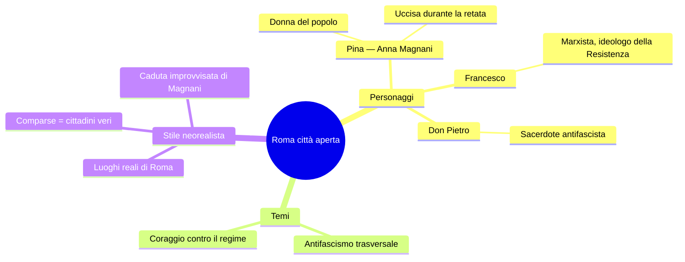
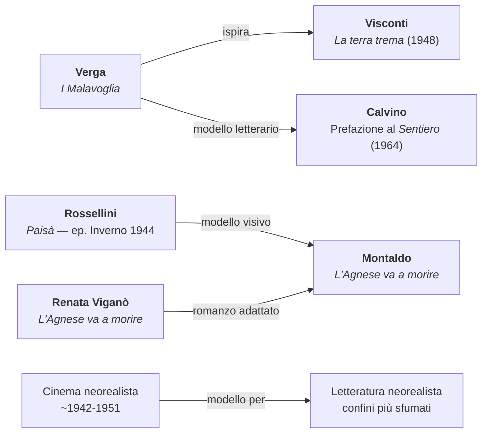
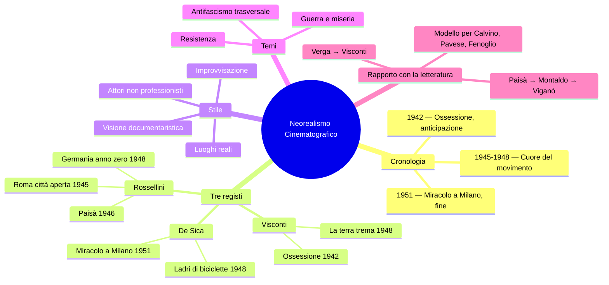

# Il Neorealismo Cinematografico — Riassunto

---

## Cronologia essenziale

| Anno | Film / Evento |
|------|---------------|
| **1942** | *Ossessione* di Visconti — anticipazione del neorealismo |
| **1945** | *Roma città aperta* di Rossellini — primo film della Trilogia della guerra |
| **1946** | *Paisà* di Rossellini — secondo film della Trilogia |
| **1948** | *Germania anno zero* di Rossellini — chiusura della Trilogia |
| **1948** | *La terra trema* di Visconti — tratto da *I Malavoglia* di Verga |
| **1948** | *Ladri di biciclette* di De Sica |
| **1951** | *Miracolo a Milano* di De Sica — fine simbolica del neorealismo |

---

## 1. Caratteri generali

Il neorealismo cinematografico è una corrente artistica nata nell'Italia della Seconda guerra mondiale e del primo dopoguerra, quando il cinema italiano «faceva scuola» nel mondo. Il movimento si sviluppa come risposta diretta all'esperienza della guerra, dell'occupazione nazifascista e della miseria, proponendo una **visione documentaria della realtà**: i film neorealisti rimangono aderenti alla realtà senza abbellimenti né filtri, con una messa in scena scarna ed essenziale.

I confini cronologici del neorealismo sono precisi: il punto di partenza convenzionale è *Ossessione* di Visconti (1942), che **anticipa** il movimento; la conclusione simbolica è *Miracolo a Milano* di De Sica (1951), con la sua apertura al sogno che segna una rottura rispetto al rigore documentaristico. Il fenomeno dura circa **un decennio**.

### Tratti distintivi dello stile neorealista

- **Luoghi reali** al posto dei set in studio: i registi scendono con la macchina da presa per le strade e i paesaggi autentici dell'Italia devastata
- **Attori non professionisti** mescolati a professionisti, per una recitazione più naturale e spontanea
- **Improvvisazione controllata**: si indicavano le azioni agli attori ma si lasciava spazio all'imprevisto, che poteva entrare nel film
- **Contenuti legati alla realtà sociale**: guerra, miseria, Resistenza, vita degli italiani comuni
- **Assenza di estetizzazione**: rifiuto della bellezza formale fine a sé stessa in favore di una rappresentazione cruda

---

## 2. I tre protagonisti

I nomi fondamentali del cinema neorealista sono tre: **Luchino Visconti**, **Roberto Rossellini** e **Vittorio De Sica** (padre di Christian De Sica). Rossellini è anche padre di Isabella Rossellini e marito di Ingrid Bergman, una delle attrici più celebrate del cinema mondiale.

---

## 3. Luchino Visconti

**Ossessione** (1942) è l'**anticipazione** del neorealismo, girata durante la guerra prima della fioritura vera e propria del movimento. Inaugura quello sguardo sulla realtà quotidiana, spogliato di ogni retorica, che diventerà il tratto fondante della corrente.

**La terra trema** (1948) è tratto da *I Malavoglia* di Giovanni Verga. Il legame con il verismo è esplicito: Visconti traduce nel cinema la stessa attenzione per il mondo dei «vinti» e per la realtà dei pescatori siciliani al cuore del progetto narrativo verghiano. Non è un caso che *I Malavoglia* vengano indicati da Calvino, nella Prefazione al *Sentiero dei nidi di ragno* (1964), come uno dei tre modelli fondamentali per gli scrittori neorealisti.

---

## 4. Roberto Rossellini e la Trilogia della guerra

I tre film più rappresentativi di Rossellini formano la **Trilogia della guerra**: *Roma città aperta* (1945), *Paisà* (1946) e *Germania anno zero* (1948), accomunati da una **visione documentaria della realtà**.

### *Roma città aperta* (1945)

Rossellini gira nel 1945 **per le vie di Roma** la storia di **Pina** (interpretata da **Anna Magnani**), che nel giorno del matrimonio con **Francesco** — ideologo marxista della Resistenza — assiste a una **retata** nazifascista. Nel tentativo di inseguire la camionetta che porta via Francesco, Pina viene uccisa da un colpo di fucile. La raggiungono il figlioletto e **Don Pietro**, sacerdote antifascista che anch'egli sacrificherà sé stesso per i propri ideali.

La scena della morte di Pina è considerata **paradigmatica di tutto il neorealismo**. La **caduta di Anna Magnani** durante le riprese non era prevista: avvenne casualmente e il regista la tenne nel montaggio finale, illustrando il principio per cui **tutto ciò che accadeva nella realtà diventava oggetto di rappresentazione**. I luoghi sono i **luoghi reali** di Roma e le comparse sono **cittadini romani** che avevano vissuto l'occupazione nazifascista pochi mesi prima, rimasti profondamente turbati nel rivivere quella paura.

Attraverso Francesco (marxista) e Don Pietro (cattolico antifascista), Rossellini mostra che l'**antifascismo fu trasversale**: al **Comitato di Liberazione Nazionale** parteciparono comunisti, cattolici e repubblicani, superando le divisioni ideologiche.

### *Paisà* (1946)

*Paisà* è un film **ad episodi** che percorre l'Italia in un **mosaico dalla Sicilia fino al Po**, con tema conduttore la guerra e la miseria degli italiani. Il titolo riprende l'appellativo con cui i soldati del Sud si chiamavano tra loro («paesano»).

L'episodio più importante per la lezione è l'ultimo, **Inverno 1944**, girato nella zona delle **valli** (Comacchio, il Po): in queste zone pianeggianti e paludose la guerriglia ebbe caratteristiche molto diverse dalla Resistenza di montagna. Rossellini mostra partigiani e alleati in condizioni estremamente ostili, poco armati e privi di viveri, nella fase più cruenta della guerra.

Questo episodio diventerà il **modello** a cui negli anni Settanta si ispirerà **Giuliano Montaldo** per *L'Agnese va a morire*, tratto dall'omonimo romanzo di **Renata Viganò**.

### *Germania anno zero* (1948)

*Germania anno zero* chiude la Trilogia spostandosi nella **Berlino distrutta** del dopoguerra, mantenendo la stessa coerenza stilistica: visione documentaristica, attenzione alla miseria, rappresentazione senza filtri delle conseguenze della guerra sui civili più vulnerabili.

---

## 5. Vittorio De Sica

**Ladri di biciclette** (1948) è uno dei capolavori del neorealismo: racconta la storia di un uomo comune nella Roma del dopoguerra alle prese con la miseria quotidiana, esempio perfetto della poetica neorealista.

**Miracolo a Milano** (1951) è convenzionalmente la **fine simbolica del neorealismo**: con la sua apertura al **sogno** e al **surrealismo**, segna un'uscita dalla rigida aderenza alla realtà in favore di un'immaginazione che si libera dai vincoli del realismo.

---

## 6. Il neorealismo come modello per la letteratura

Il rapporto tra cinema e letteratura neorealista è strettissimo. I confini del neorealismo cinematografico sono **più definiti e netti** rispetto a quelli della letteratura, e il cinema funziona come punto di riferimento per gli scrittori che cominciano a raccontare l'Italia del dopoguerra.

---

## 7. Sintesi

Il neorealismo cinematografico si riassume in un principio: la **realtà irrompe** nel cinema. I registi portano la macchina da presa nei luoghi reali, tra le persone vere, e raccontano ciò che il Paese sta vivendo: la guerra, la miseria, la Resistenza, la distruzione. Il neorealismo è il momento in cui il cinema italiano diventa **coscienza civile del Paese** — uno specchio che riflette senza deformazioni la realtà di un'Italia uscita distrutta dalla guerra, ma determinata a raccontarsi con onestà.

