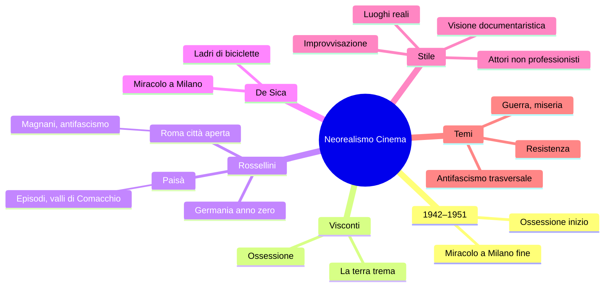

# Il Neorealismo Cinematografico — Ripasso

---

## Confini e definizione

Corrente del cinema italiano (~1942–1951). Visione **documentaristica** della realtà: luoghi reali, attori non professionisti, improvvisazione, nessun abbellimento. Inizio: *Ossessione* di Visconti (1942). Fine simbolica: *Miracolo a Milano* di De Sica (1951), che apre al sogno e al surrealismo.

---

## I tre registi

**Visconti** — *Ossessione* (1942, anticipazione); *La terra trema* (1948, da *I Malavoglia* di Verga).

**Rossellini** — Trilogia della guerra:
- *Roma città aperta* (1945): Pina (Anna Magnani) uccisa durante retata. Caduta improvvisata tenuta nel film. Comparse = cittadini romani veri. Messaggio: **antifascismo trasversale** (Francesco marxista + sacerdote cattolico).
- *Paisà* (1946): film a episodi, dalla Sicilia al Po. Episodio "Inverno 1944" nelle **valli di Comacchio** — lotta partigiana in pianura. Modello per *L'Agnese va a morire* di Montaldo (da Renata Viganò).
- *Germania anno zero* (1948): Berlino distrutta.

**De Sica** — *Ladri di biciclette* (1948); *Miracolo a Milano* (1951, fine del neorealismo).

---

## Rapporto cinema → letteratura

Cinema neorealista = confini più netti della letteratura (~10 anni). Funziona come modello per gli scrittori (Calvino, Fenoglio, Pavese). Catena: Verga → Visconti → Calvino indica *I Malavoglia* come modello. Rossellini (*Paisà*) → Montaldo adatta Viganò.

---

## Mappa riepilogativa

