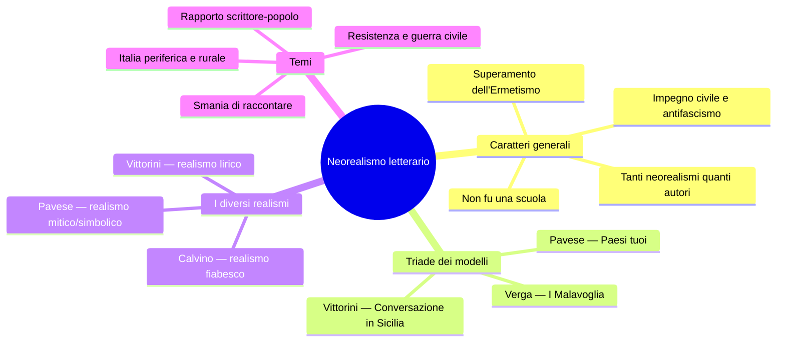
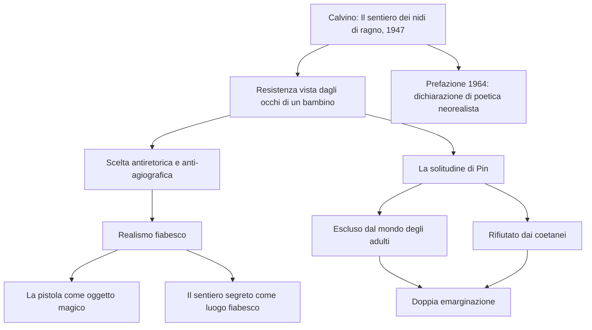
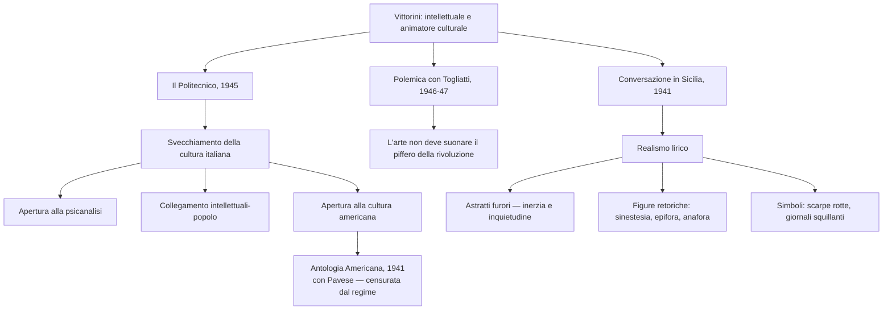
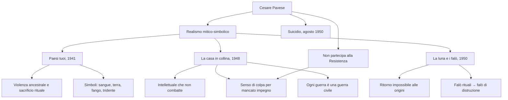
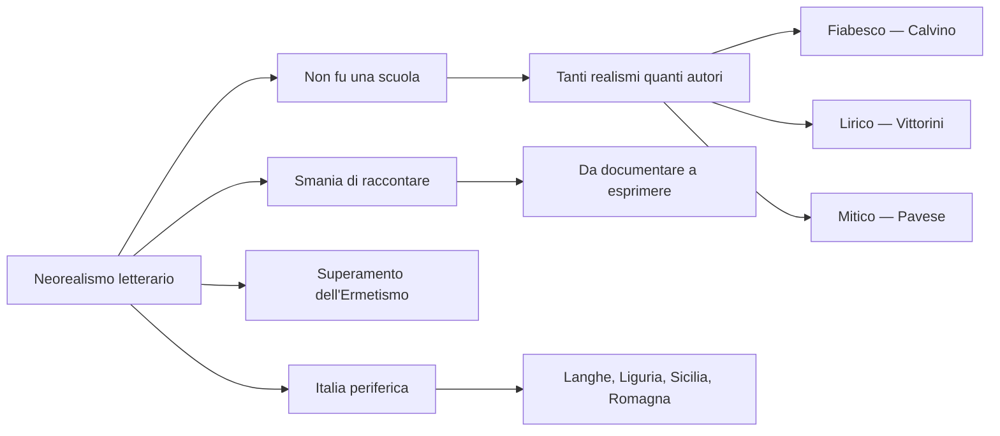

# Il Neorealismo letterario — Studio completo

---

## Quadro cronologico

| Anno | Evento |
|------|--------|
| **1941** | Pavese pubblica *Paesi tuoi*; Vittorini pubblica *Conversazione in Sicilia*; Vittorini e Pavese curano l'antologia *Americana* |
| **1942** | Visconti gira *Ossessione* (anticipazione del neorealismo cinematografico) |
| **1945** | Vittorini pubblica *Uomini e No*; fonda la rivista **Il Politecnico** a Milano |
| **1946-47** | Polemica Vittorini-Togliatti sull'autonomia dell'arte |
| **1947** | Calvino pubblica *Il sentiero dei nidi di ragno*; Pavese pubblica *Il compagno* |
| **1948** | Pavese pubblica *La casa in collina*; si iscrive al PCI |
| **1950** | Pavese pubblica *La luna e i falò*; si suicida all'Hotel Roma di Torino |
| **1963** | Fenoglio pubblica postumo *Una questione privata* (muore nel febbraio 1963) |
| **1964** | Calvino ripubblica *Il sentiero dei nidi di ragno* con la celebre Prefazione |

---

## 1. I caratteri generali del Neorealismo in letteratura

### 1.1 Definizione e limiti di un "non-movimento"

Se nel cinema il Neorealismo ha confini cronologici relativamente netti — da *Ossessione* di Visconti (1942) a *Miracolo a Milano* di De Sica (circa 1951), una stagione di circa un decennio — nella letteratura la situazione è assai più sfumata. Gli autori che vengono ricondotti al Neorealismo letterario — Calvino, Fenoglio, Pavese, Vittorini, Viganò — presentano personalità eterogenee, percorsi diversi, stili inconciliabili tra loro. Ciò che li accomuna è piuttosto una **disponibilità al dibattito civile, sociale e politico** e un orientamento antifascista di fondo.

Il critico **Carlo Bo** ha chiarito questo punto con grande lucidità:

> [!note] Dalla lezione
> «La parola neorealismo usata in letteratura non definisce niente di intrinseco che sia comune a tutti i nostri scrittori o anche solo a una gran parte di essi. Via via che dici la parola, tu la devi riempire di un significato speciale. In sostanza, tu hai tanti neorealismi quanti sono i principali narratori.»

La formula di Bo è rivelatrice: non esiste **un** neorealismo letterario, ma tanti neorealismi quanti sono gli autori. Calvino stesso, nella celebre Prefazione del 1964 al *Sentiero dei nidi di ragno*, ribadisce che **il neorealismo non fu una scuola** — cioè non fu una corrente con canoni, regole e codici condivisi (come lo era stata, per esempio, la Scuola Siciliana del Duecento), ma piuttosto «un insieme di voci in gran parte periferiche, una molteplice scoperta delle diverse Italie».

### 1.2 Gli obiettivi comuni

Pur nella diversità delle voci, si possono individuare dei tratti condivisi. Il Neorealismo letterario si propone di:

- Occuparsi dei **problemi reali del Paese**
- Creare un **dialogo con il pubblico**, superando la distanza tra scrittore ed élite intellettuale
- Rifiutare il **classicismo** e le **forme estetizzanti** per privilegiare i contenuti
- Esprimere una posizione **antifascista**

Per raggiungere questi obiettivi, anche la lingua si adegua: la prosa va nella direzione del parlato, con lessico e sintassi che accolgono il dialetto, le espressioni idiomatiche, la spontaneità del linguaggio quotidiano.

### 1.3 Il superamento dell'Ermetismo

Per comprendere la portata della rottura neorealista, bisogna guardare a ciò che la precede. Negli anni Trenta si era sviluppata in Italia la corrente dell'**Ermetismo**: una poesia difficile, oscura, stilisticamente levigata ma lontana dai problemi reali del Paese — una poesia estetizzante destinata a un pubblico di intellettuali, a un'élite. La generazione neorealista vuole recuperare in primo piano il **rapporto tra scrittore e popolo**: non più una letteratura per pochi, ma una letteratura che nasce da esperienze condivise, comuni a tutti.

### 1.4 La triade dei modelli

Calvino, nella Prefazione del '64, indica tre opere come modelli fondamentali per gli scrittori della sua generazione:

| Opera | Autore | Anno |
|-------|--------|------|
| ***I Malavoglia*** | Giovanni Verga | 1881 |
| ***Paesi tuoi*** | Cesare Pavese | 1941 |
| ***Conversazione in Sicilia*** | Elio Vittorini | 1941 |

Da Verga gli scrittori neorealisti ereditano l'attenzione alla realtà più umile, la voce del popolo, la rappresentazione della miseria senza filtri. Da Pavese e Vittorini traggono la lezione di come calare quella tradizione nel presente, nell'Italia delle campagne e delle periferie, con le sue tensioni storiche e politiche.

### 1.5 Le diverse Italie: voci periferiche e regionali

Uno dei tratti più originali del Neorealismo letterario è l'ingresso nella letteratura di un'**Italia rurale, contadina, operaia, regionale, marginale, periferica** — un'Italia che fino ad allora non era mai stata al centro del romanzo (se non nella tradizione verista). Ogni autore racconta il **proprio** paesaggio e il **proprio** lessico locale: la Liguria di Calvino, il Piemonte delle Langhe di Pavese e Fenoglio, la Romagna di Renata Viganò, la Sicilia di Vittorini. Come scrive Calvino: «Il mio paesaggio era qualcosa di gelosamente mio».

---

## 2. La Prefazione al *Sentiero dei nidi di ragno* (1964) — Dichiarazione di poetica

### 2.1 Il clima generale e la collettività anonima

La Prefazione che Calvino scrive nel 1964 per la riedizione del suo primo romanzo è considerata una vera e propria **dichiarazione di poetica del neorealismo letterario**. A distanza di quasi vent'anni, Calvino riflette su ciò che il Neorealismo è stato e su come è nato.

Il primo concetto fondamentale è questo: rileggendo il romanzo, Calvino non lo riconosce come un'opera individuale, ma come un libro «nato anonimamente da un **clima generale** di un'epoca, da una **tensione morale**, da un **gusto letterario** che era quello in cui la nostra generazione si riconosceva dopo la fine della Seconda Guerra Mondiale». Il libro non è suo, ma di una **collettività anonima** — e qui si sente un'eco della lezione verghiana, della voce impersonale del narratore popolare.

### 2.2 Vincitori, non vinti

Calvino e i suoi coetanei avevano vissuto la guerra e, i più giovani, avevano combattuto come partigiani. Eppure non si sentivano «schiacciati, vinti, bruciati», bensì **vincitori**, «spinti dalla carica propulsiva della battaglia appena conclusa, depositari esclusivi di una sua eredità». Da questo senso di vittoria e di energia nasce la spinta creativa.

### 2.3 La smania di raccontare

L'esperienza condivisa della guerra — guerra e guerra civile, perché italiani combattevano contro italiani — aveva stabilito un'**immediatezza di comunicazione tra lo scrittore e il suo pubblico**. Scrittore e pubblico si trovavano in una posizione paritaria, accomunati dalle stesse esperienze. «Si era faccia a faccia, alla pari, carichi di storie da raccontare: ognuno aveva avuto la sua, ognuno aveva vissuto vite irregolari, drammatiche, avventurose. Ci si strappava la parola di bocca.»

Questa forza interiore che porta a condividere le esperienze vissute — tragiche, avventurose, emotivamente coinvolgenti — Calvino la chiama **smania di raccontare**. La descrive con un'immagine memorabile: «Nei treni che riprendevano a funzionare, gremiti di persone, di sacchi di farina e bidoni d'olio, ogni passeggero raccontava agli sconosciuti le vicissitudini che gli erano occorse, e così ogni avventore ai tavoli delle mense del popolo, ogni donna nelle code ai negozi.»

### 2.4 Documentare vs. esprimere

Calvino precisa però che la molla della scrittura non stava semplicemente nella volontà di **documentare e informare**, ma in quella di **esprimere**. La parola "esprimere" viene dal latino *ex-premo*: ciò che preme dall'interno e ha bisogno di uscire. Comporta una dimensione soggettiva, emotiva, personale. La distinzione è cruciale: il Neorealismo non è mero documentarismo, non è cronaca, ma rielaborazione artistica di un'esperienza vissuta.

> [!note] Dalla lezione
> La professoressa insiste sulla distinzione tra "documentare" ed "esprimere": documentare è un atto oggettivo, riferire i fatti; esprimere implica una dimensione interiore, la necessità di dar voce a ciò che preme dal di dentro. Il Neorealismo letterario sta in questa tensione: è radicato nella realtà, ma non rinuncia alla dimensione soggettiva dell'arte.

### 2.5 La Resistenza come imperativo narrativo

Scrivere il romanzo della Resistenza si poneva come un **imperativo**: era un obbligo morale, ma anche un problema aperto, perché raccontare fatti così brucianti a così poca distanza temporale era enormemente difficile.

> [!note] Dalla lezione
> La professoressa fa un parallelo illuminante con *Se questo è un uomo* di Primo Levi: quando uscì per la prima volta, subito dopo la guerra, nessuno voleva pubblicarlo. Fu stampato in pochissime copie, non ebbe alcun riscontro. Solo a distanza di dieci-quindici anni divenne il successo mondiale che conosciamo. Perché? Perché nell'imminenza di quei fatti nessuno ne voleva sapere — era una sorta di **rimozione**. Dovevano passare degli anni perché quelle vicende fossero metabolizzate.

Calvino confessa che la responsabilità di scrivere il romanzo della Resistenza lo faceva sentire il tema «troppo impegnativo e solenne» per le sue forze. E allora decise di affrontarlo «non di petto, ma **di scorcio**» — cioè non frontalmente, ma tangenzialmente, obliquamente. Di qui la scelta del punto di vista di un bambino.

---

## 3. Italo Calvino e il realismo fiabesco

### 3.1 *Il sentiero dei nidi di ragno* (1947)

Il primo romanzo di Calvino è ambientato in Liguria, dopo l'8 settembre 1943, nel pieno della Resistenza. Il protagonista è **Pin**, un ragazzino orfano di madre che vive con la sorella, la Nera, che si prostituisce. Pin cresce per strada, abbandonato a se stesso: troppo maturo per giocare coi bambini, estraneo per la sua età al mondo degli adulti. Un giorno ruba una pistola a un soldato tedesco, cliente della sorella, e la nasconde in un luogo noto a lui solo: quello dove i ragni fanno il nido.

La scelta di far vedere la Resistenza attraverso gli occhi di un bambino è programmatica. Calvino vuole sottrarsi al rischio della **retorica**, della **celebrazione**, della **mitizzazione**. Non vuole offrire un ritratto **agiografico** della Resistenza — dove "agiografico" significa letteralmente "relativo alle vite dei santi" (dal greco *hagiographia*): evitare l'agiografia vuol dire evitare la santificazione dei protagonisti di quella lotta.

> [!note] Dalla lezione
> La professoressa spiega che Calvino lo dice esplicitamente: raccontare la Resistenza dal suo punto di vista di scrittore adulto e borghese sarebbe stato come mentire. Avrebbe significato mettere una sovrastruttura ideologica, interpretare i fatti. Calarsi nel punto di vista di un bambino gli consente invece di raccontare con maggiore autenticità una lotta di popolo, con tutto il suo eroismo ma anche con tutte le sue incertezze, fragilità, la disorganizzazione, i conflitti interni.

### 3.2 La dimensione fiabesca

Perché si parla di **realismo fiabesco**? A prima vista l'espressione è contraddittoria: il realismo è aderenza alla realtà, la fiaba è invenzione. Ma in Calvino le due dimensioni si fondono. La pistola rubata — strumento di morte — nelle mani di Pin e soprattutto nella sua immaginazione diventa un **oggetto magico**, come nelle fiabe. Un oggetto così misterioso e prezioso che Pin sceglie di seppellirlo in un luogo segreto: il sentiero dove i ragni fanno il nido. E già questo sfondo — il bosco, il sentiero, l'oggetto magico — rimanda al racconto fiabesco.

Calvino non offre una visione documentaristica della guerra: si cala nel punto di vista di un bambino per fornire una descrizione **antiretorica** della Resistenza, in cui la realtà storica si intreccia con la dimensione dell'avventura e della scoperta propria dell'infanzia.

### 3.3 La solitudine di Pin — Analisi del brano

Il brano letto in classe, intitolato convenzionalmente "**La solitudine di Pin**", mostra il protagonista in una condizione di profondo **isolamento** ed **emarginazione**:

Pin aspira all'integrazione nel mondo degli adulti, ma non può raggiungerla per la sua giovane età. Cerca allora la compagnia dei coetanei, ma viene rifiutato e picchiato perché è maleducato, volgare, abituato a frequentare l'osteria e a cantare le canzoni sporche dei grandi. Le madri proibiscono ai figli di stare con lui. Pin è dunque **doppiamente escluso**: dal mondo degli adulti che non lo accoglie e da quello dei bambini che lo respinge.

> «A volte il fare uno scherzo cattivo lascia un gusto amaro, e Pin si trova solo a girare nei vicoli, con tutti che gli gridano improperi e lo cacciano via.»

Il brano si chiude con un'immagine di grande intensità poetica: «Tutto per smaltire la **nebbia di solitudine** che ti si condensa nel petto le sere come quella.» La metafora della "nebbia di solitudine" è significativa: la nebbia evoca smarrimento, perdita dell'orientamento, indeterminatezza, impossibilità di trovare una strada. Il verbo "condensa" suggerisce un peso che si aggruma nel petto, un groviglio interiore.

> [!note] Dalla lezione
> La professoressa sottolinea che il tema della solitudine di Pin è un tema **esistenziale universale**: il sentimento di inadeguatezza e la difficoltà di collocarsi nel mondo sono comuni a tutte le generazioni. In Pin si rispecchia il passaggio traumatico dall'infanzia alla maturità — un tema che nel cinema neorealista ritorna in *Germania anno zero* (dove il bambino Edmund, schiacciato dal trauma storico, si toglie la vita) e in *Ladri di biciclette* (dove il figlio di Antonio vive i problemi della sopravvivenza familiare come un adulto).

### 3.4 Stile e tecniche del brano

Dal punto di vista stilistico, nel brano di Calvino si trovano:

- **Ripetizioni** ed **enumerazioni** che creano un ritmo incalzante
- **Metafore** («nebbia di solitudine che ti si condensa nel petto»)
- Lessico che oscilla tra il registro colloquiale-popolare (improperi, scappezzonare, carruggio) e una prosa di grande eleganza e raffinatezza
- **Calchi dal parlato** e forme tipiche della lingua orale
- Una costruzione sintattica che alterna periodi lunghi e ipotattici a frasi brevi e incisive

---

## 4. Elio Vittorini e il realismo lirico

### 4.1 La figura di Vittorini: intellettuale e animatore culturale

Elio Vittorini nasce in Sicilia e poi si trasferisce al Nord. Durante la guerra partecipa ad azioni clandestine per conto del Partito Comunista — non è un semplice "partecipante alla vita politica" nel senso parlamentare, ma un uomo che rischia la vita nella lotta clandestina. A Milano, nel 1945, fonda la rivista **Il Politecnico**, con cui propone uno **svecchiamento della cultura italiana**: apertura alla psicanalisi (disciplina ancora relativamente nuova, fondata simbolicamente da Freud nel 1900), collegamento tra intellettuali e popolo (un tema caro anche a Gramsci), e soprattutto **apertura alla cultura americana**.

Questo ultimo punto è fondamentale: nel 1941, in pieno regime fascista, Vittorini e Pavese realizzano un'antologia intitolata **Americana**, in cui antologizzano scrittori americani, andando a contrastare frontalmente il **mito della superiorità italica** propagandato dal fascismo. L'opera viene censurata.

### 4.2 La polemica con Togliatti: l'arte non deve "suonare il piffero della rivoluzione"

Tra il 1946 e il 1947 si consuma una polemica celebre tra Vittorini e **Palmiro Togliatti**, segretario del PCI. Per Togliatti la letteratura e l'arte dovrebbero essere **al servizio della politica**, strumenti di propaganda ideologica. Vittorini ribatte che l'arte deve essere **autonoma**: possiede una componente naturale di impegno che agisce anche al di fuori della volontà dell'artista. L'arte, dice Vittorini con un'espressione divenuta proverbiale, **non deve suonare il piffero della rivoluzione** — non deve essere sottomessa ai dettami del partito, ma restare indipendente.

> [!note] Dalla lezione
> La professoressa fa notare come anche Vittorini, pur essendo un intellettuale di sinistra, abbia rapporti turbolenti col PCI — così come Pasolini, che fu addirittura espulso dal partito perché omosessuale. Il PCI non voleva compromettersi con un omosessuale: «sarebbe stata pessima pubblicità».

### 4.3 *Conversazione in Sicilia* (1941): il capolavoro

La critica riconosce *Conversazione in Sicilia* come l'unico e autentico **capolavoro** di Vittorini. È anche il romanzo che Calvino inserisce nella triade dei modelli per la stagione neorealista. La storia: il protagonista, **Silvestro Ferrauto**, dalla nativa Sicilia si è trasferito al Nord. Un giorno decide di tornare nella terra d'origine per far visita alla madre, che lavora come una sorta di infermiera facendo le iniezioni a domicilio. Questo giro delle iniezioni diventa l'occasione per incontrare diversi personaggi del popolo.

Il realismo di Vittorini viene definito dalla critica come **realismo lirico** o **realismo idilliaco**: lo scrittore sembra oscillare tra il **mito** e la **storia**, coniugando una realtà utopistica e simbolica con il processo storico in atto. Il linguaggio è ricco di procedimenti tipici della poesia: **allitterazioni**, **ripetizioni**, **anafore**, **epifore**, **sinestesie**.

### 4.4 L'incipit: gli "astratti furori"

L'incipit di *Conversazione in Sicilia* è una delle pagine più celebri della letteratura italiana del Novecento:

> «Io ero, quell'inverno, preda ad **astratti furori**. Non dirò quali, non di questo mi sono messo a raccontare, ma bisogna dita che erano astratti, non eroici, non vivi. Furori, in qualche modo per il genere umano perduto.»

L'espressione **«astratti furori»** è diventata proverbiale. I "furori" rimandano a una condizione interiore di profonda inquietudine, rabbia — ma sono "astratti", cioè **non direzionati**, non rivolti verso qualcosa di preciso. Non sono "eroici" (non conducono all'azione), non sono "vivi" (non si manifestano all'esterno). Si tratta di un'inquietudine per il «genere umano perduto» — un'allusione mai del tutto esplicitata, ma che si riferisce alla violenza della guerra e delle dittature, in particolare alla **Guerra civile spagnola** degli anni Trenta.

### 4.5 Un climax di inerzia e le figure retoriche

Nel prosieguo dell'incipit, Silvestro descrive una condizione di totale **inerzia** e **stallo**:

> «Vedevo manifesti di giornali squillanti e chinavo il capo.»

L'espressione «giornali squillanti» è una **sinestesia**: unisce un dato visivo (i giornali si leggono con gli occhi) a un dato uditivo ("squillante" richiama il suono di una campana, qualcosa che scuote, mette in allerta). I giornali squillanti sono quelli che riportano le notizie terribili della guerra — ma il protagonista "china il capo" in segno di rassegnazione.

Il gesto del "chinare il capo" viene ripetuto come un'**epifora** (la ripetizione della stessa espressione alla fine di periodi successivi): «stavo con loro senza dire una parola, chinavo il capo (...) anche con lei chinavo il capo». Indica una condizione di **distacco**, di mancanza di partecipazione emotiva a tutto ciò che rende vivi — l'amicizia, l'amore.

Poi ritorna l'immagine simbolica, ricorrente e concretissima, delle **scarpe rotte**: «pioveva intanto e passavano i giorni, i mesi, e io avevo le scarpe rotte. L'acqua che mi entrava nelle scarpe». Le scarpe rotte simboleggiano molto concretamente la **povertà** e, più simbolicamente, la **fatica del vivere** aggravata dalla presenza incessante della guerra.

> [!note] Dalla lezione
> La professoressa collega la condizione di Silvestro all'**accidia** petrarchesca: quell'unione di ansia e inerzia, la mancanza di voglia di tutto, l'indifferenza verso il mondo esterno. «Non mi importava che la mia ragazza mi aspettasse (...) sfogliare il dizionario per me era lo stesso e uscire a vedere gli amici o restare in casa era per me lo stesso. Ero quieto, ero come se non avessi mai avuto un giorno di vita.» Quiete, sordo, muti: l'ambito semantico è tutto quello dell'immobilità.

La pagina si chiude in un circolo perfetto: «Ma mi agitavo entro di me per astratti furori e pensavo il genere umano perduto, chinavo il capo e pioveva, non dicevo una parola agli amici e l'acqua mi entrava nelle scarpe.» È una pagina che la professoressa definisce «memorabile, di una bellezza indescrivibile, notevolissima».

---

## 5. Cesare Pavese e il realismo mitico-simbolico

### 5.1 Il profilo dell'autore

Cesare Pavese è uno dei maggiori intellettuali del Novecento italiano: romanziere, poeta, traduttore, editore. Lavora per la casa editrice **Einaudi** a Torino. Come Vittorini, è un profondo studioso della **letteratura americana**: traduce opere capitali come *Moby Dick*. Si iscrive al PCI nel 1948, a guerra finita — quasi a risarcimento del suo mancato impegno nella Resistenza, alla quale, a differenza di Calvino e Fenoglio, **non partecipa**.

Questo mancato impegno è una ferita che attraversa tutta l'opera di Pavese. Si suicida il **27 agosto 1950** all'Hotel Roma di Torino, a soli 42 anni, dopo una vita segnata da amori brucianti ma infelici. Lascia un biglietto d'addio all'interno di una copia di *Dialoghi con Leucò*: **«Perdono tutti e a tutti chiedo perdono. Va bene? Non fate troppi pettegolezzi.»**

### 5.2 I temi fondamentali

Nella produzione di Pavese ritornano costantemente alcuni temi:

- La contrapposizione tra **città e campagna**
- Il mito della **terra natìa** e dell'**infanzia** come età perduta
- La **collina** come simbolo di isolamento, solitudine, ma anche di ritorno alle origini
- La **solitudine dell'intellettuale** incapace di agire, di incidere sulla realtà
- Il **senso di colpa** per il mancato impegno nella Resistenza
- Elementi **primordiali e ancestrali** (sangue, terra, latte, fuoco) che si caricano di un significato simbolico e mitico

Ecco perché si parla di **realismo mitico** o **realismo simbolico**: il racconto è radicato nella realtà storica (gli anni Trenta-Quaranta, le campagne piemontesi), ma è costellato di elementi che rimandano a una dimensione primigenia, archetipica, universale.

### 5.3 *Paesi tuoi* (1941): violenza ancestrale nelle campagne

*Paesi tuoi* è uno dei primi romanzi di Pavese e uno dei tre modelli indicati da Calvino per la stagione neorealista. Racconta una storia **cupa e violenta** di vita contadina ambientata in Piemonte, sulle Langhe, attraverso uno stile rapido e incisivo.

La trama: due ragazzi, **Berto** (il narratore) e **Talino**, escono dal carcere a Torino. Talino era stato incarcerato perché piromane, accusato di aver incendiato delle cascine. Tornano insieme nella casa di campagna di Talino, dove vive una tipica famiglia contadina della prima metà del Novecento. All'interno di questo contesto segnato dal lavoro e dai tempi ciclici della campagna, si consuma una vicenda di **violenza**, **incesto** e **morte**: Talino uccide la sorella **Gisella** con un tridente, accecato dalla gelosia scatenata da una relazione incestuosa.

La morte di Gisella è presentata come una sorta di **sacrificio rituale**. Si rintraccia una dimensione selvaggia, ancestrale, violenta, con un'insistenza frequente su elementi primordiali caricati di significato simbolico: il **sangue** che sgorga, la **terra** e il **fango** nero, il **sudore**, il **latte** (le mammelle scoperte di Gisella, che rimandano alla maternità e ai cicli della natura). Anche il **tridente**, strumento di lavoro contadino, ritorna in modo quasi ossessivo nel testo, come presagio inquietante di ciò che accadrà.

> [!note] Dalla lezione
> La professoressa legge l'intera scena dell'uccisione di Gisella, sottolineando gli elementi rituali: «Talino aveva fatto due occhi da bestia e, dando indietro un salto, le aveva piantato il tridente nel collo (...) Gisella tossiva e vomitava sangue, e quel fango era nero.» L'immagine delle mammelle scoperte viene collegata all'iconografia cristiana della maternità e ai cicli della natura — un elemento mitico che ritorna anche ne *La casa in collina*.

Dal punto di vista stilistico, *Paesi tuoi* presenta una prosa **scarsa e rapida** in cui prevale la **paratassi** (frasi brevi, coordinate), frequenti **sequenze dialogiche** e un **lessico semplice** che ricalca il parlato contadino con espressioni idiomatiche e modi di dire. Il mondo contadino è rappresentato senza alcuna idealizzazione: ne emergono la **barbarie**, la **violenza**, la **bestialità**.

### 5.4 La trilogia neorealista di Pavese

Le opere più apertamente ascrivibili al Neorealismo formano un'ideale trilogia:

| Opera | Data | Caratteristiche |
|-------|------|-----------------|
| ***Il carcere*** | 1938-39 (composizione) | Prima opera, ambientazione carceraria |
| ***Il compagno*** | 1947 | Romanzo di formazione (**Bildungsroman**): il giovane Pablo, sfaccendato, aderisce al comunismo e conduce una lotta clandestina fino alla piena coscienza politica. È il romanzo più impegnato in senso politico, ma anche il più debole: un romanzo a tesi, con esiti formali discutibili |
| ***La casa in collina*** | 1948 | Capolavoro. La vicenda di Corrado, intellettuale che durante la Resistenza si rifugia in collina rifiutando di prendere posizione |

### 5.5 *La casa in collina* (1948): l'intellettuale che non combatte

*La casa in collina* è uno dei **capolavori assoluti** di Pavese. Racconta la vicenda di **Corrado**, un intellettuale che nel pieno della guerra si rifugia sulle colline rifiutando di partecipare alla Resistenza. In questa vicenda Pavese riversa la propria **autobiografia**: lui stesso non partecipò alla Resistenza, e in questa consapevolezza del mancato impegno si consuma l'inquietudine sia di Corrado sia dell'autore.

La **collina** diventa il simbolo dell'**isolamento** e della **solitudine** dell'intellettuale incapace di agire. Alla vicenda storica si intreccia una vicenda privata: Corrado, tornato nei luoghi dell'infanzia, incontra **Cate**, una donna con cui aveva avuto una relazione, che ha un figlio piccolo, **Dino**. Non può fare a meno di chiedersi se quel figlio sia suo — e resta sospeso in un'inerzia investigativa che lo paralizza ulteriormente.

### 5.6 Analisi del brano: «Niente è accaduto»

Il brano letto in classe si apre con una formula che condensa l'intero atteggiamento del protagonista: **«Niente è accaduto»**. Corrado si trova in una posizione di **marginalità** rispetto agli orrori della storia: li sente, ma lontani. A lui personalmente la guerra procura «soltanto qualche fastidio»:

> «Tolto questo e gli allarmi e le scomode fughe nelle forre (...) tolto il fastidio e la vergogna, niente accade.»

L'espressione «niente accade» ritorna più volte con cadenza quasi lirica. E tuttavia, in questo isolamento, emerge indirettamente un **senso di colpa**: «Questa guerra ci brucia le case (...) finirà per costringerci a combattere anche noi, per strapparci un consenso attivo. E verrà il giorno che nessuno sarà fuori dalla guerra, né i vigliacchi, né i tristi, né i soli.»

L'immobilità del protagonista favorisce il ricordo: «Adesso che la campagna è brulla, torno a girarla, salgo e scendo la collina e ripenso alla lunga illusione da cui ha preso le mosse questo racconto della mia vita.» Il confronto tra passato e presente genera una vertiginosa sensazione di **alienazione**: «l'io (...) si sente un altro, si sente staccato, come se tutto ciò che ha fatto, detto e subito gli fosse soltanto accaduto davanti. Faccenda altrui, storia trascorsa.»

E poi un'immagine bellissima che descrive l'intera parabola del personaggio:

> «M'accorgo che ho vissuto un solo **lungo isolamento**, una **futile vacanza**, come un ragazzo che giocando a nascondersi entra dentro un cespuglio e ci sta bene, guarda il cielo da sotto le foglie e si dimentica di uscire mai più.»

### 5.7 «Ogni guerra è una guerra civile»

Il brano culmina in una delle riflessioni più celebri e potenti di tutta la letteratura italiana del Novecento. Pavese medita sulla Resistenza come **guerra civile** — guerra di italiani contro italiani, partigiani contro repubblichini — e poi allarga la riflessione fino a comprendere **ogni guerra**:

> «Ho visto i morti sconosciuti, i morti repubblichini. Sono questi che mi hanno svegliato. Se un ignoto, un nemico, diventa morendo una cosa simile, se ci si arresta e si ha paura a scavallarlo, vuol dire che anche vinto il nemico è qualcuno, che dopo averne sparso il sangue bisogna placarlo, dare una voce a questo sangue, giustificare chi l'ha sparso. Guardare certi morti è umiliante.»

E la conclusione, che la professoressa chiede di **tenere a mente**:

> «Per questo **ogni guerra è una guerra civile**: ogni caduto somiglia a chi resta, e gliene chiede ragione.»

La compassione per il nemico morto nasce dalla consapevolezza che «al posto del morto potremmo essere noi: non ci sarebbe differenza, e se viviamo lo dobbiamo al cadavere imbrattato». È un'affermazione di profondo **umanesimo**: il nemico, morendo, perde la sua qualità di nemico e diventa semplicemente un essere umano — uguale a noi.

> [!note] Dalla lezione
> La professoressa definisce questo passo «paradigmatico, bellissimo» e chiede esplicitamente di memorizzarlo. La frase «ogni guerra è una guerra civile: ogni caduto somiglia a chi resta, e gliene chiede ragione» è una delle citazioni fondamentali del Novecento italiano.

### 5.8 *La luna e i falò* (1950): il ritorno impossibile

*La luna e i falò* è l'ultimo romanzo di Pavese, pubblicato lo stesso anno del suicidio. Il protagonista, **Anguilla**, dopo essersi allontanato per anni, ritorna nella terra natale sulle colline delle Langhe. Incontra qualche vecchio amico, ma soprattutto si rende conto del tempo che ha cambiato le cose e le persone: molti non ci sono più.

Il titolo è simbolico: i **falò rituali** che un tempo venivano accesi per propiziare il lavoro dei campi e chiedere raccolti abbondanti, durante la guerra sono stati sostituiti dai **falò di distruzione** — non solo delle cose, ma anche delle persone. Il tema è quello dello **sradicamento**, del ricordo, dell'estraneità al mondo in cui ci si trova.

---

## 6. Beppe Fenoglio e *Una questione privata*

### 6.1 Il romanzo

*Una questione privata*, pubblicato postumo nel 1963, è il romanzo di Fenoglio che la classe ha letto e analizzato in dettaglio. Come Pavese, anche Fenoglio è un autore delle **Langhe** — la stessa area geografica, gli stessi paesaggi collinari intorno ad Alba. Ma mentre Pavese è l'intellettuale che si sottrae alla lotta, Fenoglio è il partigiano che combatte.

Il protagonista è **Milton**, un giovane partigiano colto, magro, poetico, follemente innamorato di **Fulvia**. Nel mezzo della guerra partigiana, Milton viene ossessionato da una **questione privata**: il sospetto che Fulvia abbia avuto una relazione con **Giorgio**, un suo compagno. Questa ossessione diventa così totalizzante che la guerra, la libertà, i compagni, i nemici — tutto passa in secondo piano.

> «Non ne posso più (...) il fatto è che più niente mi importa, di colpo più niente: la guerra, la libertà, i compagni, i nemici. Solo più quella verità.»

### 6.2 L'intreccio di pubblico e privato

Il titolo stesso del romanzo è programmatico: la "questione privata" — cioè l'ossessione amorosa — irrompe prepotentemente nella dimensione pubblica della guerra e della Resistenza. Le due dimensioni si intrecciano inestricabilmente. Milton, incaricato dal comandante **Leo** di fare ricognizioni, risponde meccanicamente alle domande sulla situazione militare, ma i suoi pensieri sono tutti per Fulvia. Basta un dettaglio — un campo da tennis, un luogo fisico — perché scatti il ricordo:

> «Il bunker, Milton, l'ho veduto (...) Domina non solo lo stradale, ma batte anche i campi aperti sul fiume. Avrai presente verso la segheria e il campo da tennis. **Fulvia ci giocava con Giorgio, sempre in singolo.**»

### 6.3 Il ritratto di Milton attraverso il flashback

Il flashback che si apre dal ricordo del campo da tennis è un piccolo capolavoro di caratterizzazione indiretta. In poche righe capiamo chi è Milton:

- È **povero** («senza i soldi per pagarsi una bibita»)
- Fulvia è **benestante** (il campo da tennis rullato e innaffiato da Giorgio «con particolare cura»)
- Milton è **a disagio**, timido, insicuro del proprio aspetto fisico («sedeva scomodo, smuovendo senza sosta le lunghe gambe, i pugni serrati nelle tasche per non dar tensione e mascherare la piattezza delle cosce»)
- È un **intellettuale colto**: in fondo alla tasca ha «un foglietto con la versione di una poesia di Yeats» — *When you are old and grey and full of sleep*, una poesia del **romanticismo inglese** carica di malinconia e nostalgia

### 6.4 L'alternanza delle tecniche narrative

In poco più di una pagina, Fenoglio mette in campo una notevole varietà di **tecniche narrative**:

- **Sequenze dialogiche** che ricalcano in modo realistico il parlato (il linguaggio tra Milton e Leo è naturale, non forzato né altisonante)
- Brevi **sequenze narrative** in terza persona
- **Flussi di coscienza**: i pensieri del protagonista che irrompono nel racconto
- **Flashback** che aprono finestre sul passato
- **Scelte lessicali** crude e realistiche: Leo che compie trent'anni dice «se anche crepassi domani, creperei vergognosamente vecchio. È un vero record». La coppia **crepassi/creperei** — la stessa parola coniugata in modo diverso (una figura retorica di **poliptoto**) — esprime con crudezza la quotidianità della morte per i giovani partigiani.

> [!note] Dalla lezione
> La professoressa sottolinea il risvolto amaro della battuta di Leo: morire a trent'anni significava morire «vecchi» nel contesto della guerra partigiana. La leggerezza apparente del tono nasconde un dramma profondo — il fatto che i partigiani avevano a che fare con la morte ogni giorno.

### 6.5 Lo stile di Fenoglio

Lo stile di Fenoglio in *Una questione privata* si caratterizza per:

- Una prosa **asciutta e rapida**, che alterna dialogo e narrazione con grande efficacia
- Un linguaggio **autentico**, vicino al parlato, senza orpelli letterari
- L'uso sapiente del **flashback** per intrecciare passato e presente, dimensione privata e dimensione pubblica
- Un registro che sa passare dalla crudezza («crepassi», «creperei») alla delicatezza del ricordo amoroso

---

## 7. *L'Agnese va a morire* di Renata Viganò

Il romanzo di **Renata Viganò** è il primo testo neorealista affrontato dalla classe. Racconta la storia di Agnese, una staffetta partigiana nella Romagna della Resistenza. È stato trasposto in un film diretto da **Giuliano Montaldo**, con **Ingrid Thulin** nel ruolo della protagonista.

> [!note] Dalla lezione
> La lezione del 22 gennaio si apre con l'ascolto della **testimonianza diretta** di una ex staffetta partigiana romagnola, che racconta la propria esperienza: il trasporto di notizie e armi in bicicletta tra Taglio Corelli e Lavezzola, l'incontro con un uomo travestito da donna sull'argine del Reno, la granata che le è caduta vicino, la partecipazione alle riprese del film di Montaldo. La testimone racconta anche la miseria della vita contadina sotto il fascismo — sei persone in due stanze, mezzo pulcino diviso in sei — e l'episodio del padre, bracciante forzato a iscriversi al Fascio, picchiato dai fascisti per aver tentato di partecipare al funerale del primo maggio. La professoressa sottolinea la precisione dei ricordi a distanza di decenni: luoghi, nomi, momenti, emozioni.

---

## 8. Quadro sinottico degli autori

| | **Calvino** | **Vittorini** | **Pavese** | **Fenoglio** | **Viganò** |
|---|---|---|---|---|---|
| **Tipo di realismo** | Fiabesco | Lirico | Mitico-simbolico | Crudo, asciutto | Documentaristico |
| **Opera chiave** | *Il sentiero dei nidi di ragno* (1947) | *Conversazione in Sicilia* (1941) | *La casa in collina* (1948) | *Una questione privata* (1963) | *L'Agnese va a morire* (1949) |
| **Paesaggio** | Liguria | Sicilia | Langhe (Piemonte) | Langhe (Piemonte) | Romagna |
| **Punto di vista** | Bambino (Pin) | Intellettuale in crisi (Silvestro) | Intellettuale che non combatte (Corrado) | Partigiano innamorato (Milton) | Staffetta partigiana (Agnese) |
| **Tema dominante** | Resistenza e solitudine infantile | Inerzia e astratti furori | Senso di colpa, isolamento | Ossessione privata nella guerra | Lotta partigiana dal basso |
| **Partecipazione alla Resistenza** | Sì | Sì (clandestina) | No | Sì | Sì (staffetta) |
| **Rapporto col PCI** | Iscritto, poi distaccato | Polemico (Togliatti) | Iscritto nel '48, tardi | — | — |

---

## 9. I nodi concettuali per l'esame

### 9.1 Il Neorealismo non fu una scuola

Concetto ribadito sia da Calvino sia da Carlo Bo: non esistono canoni condivisi, ma personalità diverse unite da un comune impegno civile e dalla smania di raccontare.

### 9.2 Ogni autore ha il proprio realismo

Calvino è fiabesco, Vittorini è lirico, Pavese è mitico. Questa diversità non è un'eccezione: è la regola del Neorealismo letterario.

### 9.3 La smania di raccontare

L'esperienza della guerra genera un bisogno collettivo di condivisione. La scrittura neorealista nasce da questo impulso — non come documentarismo freddo, ma come bisogno di *esprimere*.

### 9.4 Il superamento dell'Ermetismo

Gli scrittori neorealisti recuperano il rapporto tra scrittore e popolo, abbandonando la poesia oscura e d'élite degli anni Trenta.

### 9.5 L'Italia periferica

La letteratura neorealista è un'esplorazione delle «diverse Italie»: le Langhe, la Liguria, la Sicilia, la Romagna. Il paesaggio è sempre specifico, locale, regionale.

### 9.6 Ogni guerra è una guerra civile

La frase di Pavese è una delle più importanti del Novecento italiano. Il nemico morto perde la sua qualità di nemico e diventa un essere umano uguale a noi: «ogni caduto somiglia a chi resta, e gliene chiede ragione».

### 9.7 La questione privata dentro la storia

In Fenoglio la dimensione privata (l'ossessione amorosa) irrompe nella dimensione pubblica (la guerra). Le due sfere non si possono separare: la vita degli uomini non si divide in compartimenti stagni.

### 9.8 L'autonomia dell'arte

Vittorini rivendica l'indipendenza dell'arte dalla politica: l'arte non deve «suonare il piffero della rivoluzione». È naturalmente impegnata, ma non può essere strumento di propaganda.

