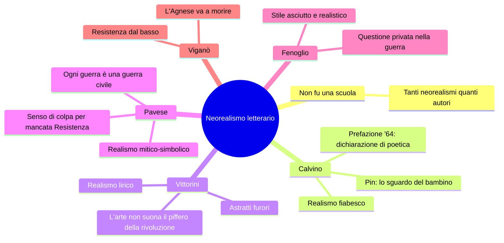

# Il Neorealismo letterario — Riassunto

---

## 1. Caratteri generali

### Definizione e limiti

A differenza del Neorealismo cinematografico, che ha confini cronologici abbastanza netti (da *Ossessione* del 1942 a *Miracolo a Milano*), il Neorealismo letterario è molto più sfumato. Il critico **Carlo Bo** ha colto il punto: «Tu hai tanti neorealismi quanti sono i principali narratori.» Calvino nella Prefazione del '64 ribadisce: **il neorealismo non fu una scuola** — non aveva canoni, regole o codici condivisi. Era piuttosto «un insieme di voci in gran parte periferiche, una molteplice scoperta delle diverse Italie».

Il denominatore comune è una **disponibilità al dibattito civile, sociale e politico**, con un orientamento antifascista. Gli obiettivi condivisi: occuparsi dei problemi reali del Paese, creare un dialogo con il pubblico, rifiutare classicismo ed estetismo, privilegiare i contenuti sulla forma. Anche la lingua si adegua, andando nella direzione del parlato e accogliendo dialetti e lessico popolare.

### Superamento dell'Ermetismo e triade dei modelli

Il Neorealismo reagisce all'**Ermetismo** degli anni Trenta: una poesia oscura, levigata, destinata a un'élite di intellettuali e lontana dai problemi reali. Gli scrittori neorealisti recuperano il **rapporto tra scrittore e popolo**.

Calvino indica tre modelli: ***I Malavoglia*** di Verga (1881), ***Paesi tuoi*** di Pavese (1941), ***Conversazione in Sicilia*** di Vittorini (1941). Ogni autore sviluppa il proprio tipo di realismo: **fiabesco** (Calvino), **lirico** (Vittorini), **mitico-simbolico** (Pavese).

### L'Italia periferica

Una novità fondamentale: entra nella letteratura un'Italia **rurale, contadina, operaia, regionale, periferica** — la Liguria di Calvino, il Piemonte delle Langhe di Pavese e Fenoglio, la Sicilia di Vittorini, la Romagna di Viganò. Ogni autore racconta il proprio paesaggio e il proprio lessico locale.

---

## 2. La Prefazione del '64: dichiarazione di poetica

Nella Prefazione alla riedizione del *Sentiero dei nidi di ragno* (1964), Calvino riflette sul Neorealismo a quasi vent'anni di distanza. È considerata una vera dichiarazione di poetica.

**I concetti chiave:**

Il romanzo non è un'opera individuale ma il prodotto di un **clima generale**, una **tensione morale**, un **gusto letterario** condiviso. Calvino quasi non lo riconosce come suo, ma come il libro di una **collettività anonima** (eco della voce impersonale verghiana).

L'esperienza condivisa della guerra stabilisce un'**immediatezza di comunicazione tra scrittore e pubblico**: «Si era faccia a faccia, alla pari, carichi di storie da raccontare.» Nasce una **smania di raccontare** — un bisogno fisiologico, collettivo, di condividere le esperienze vissute. Ma non è mero documentarismo: la molla è **esprimere** (dal latino *ex-premo*, ciò che preme da dentro), non semplicemente informare.

Scrivere il romanzo della Resistenza era un **imperativo**, ma anche un problema aperto: raccontare fatti brucianti a così poca distanza era difficilissimo. Calvino, sentendo il tema «troppo impegnativo e solenne», decide di affrontarlo **di scorcio** — non frontalmente, ma attraverso gli occhi di un bambino.

---

## 3. Italo Calvino: il realismo fiabesco

### *Il sentiero dei nidi di ragno* (1947)

Ambientato in Liguria dopo l'8 settembre 1943. Il protagonista **Pin**, ragazzino orfano, vive con la sorella che si prostituisce. Ruba una pistola a un soldato tedesco e la nasconde dove i ragni fanno il nido. La Resistenza è vista attraverso i suoi occhi.

La scelta del punto di vista infantile è programmatica: Calvino vuole evitare la **retorica**, la **celebrazione**, il ritratto **agiografico** (cioè "santificatore") della Resistenza. Raccontarla da adulto borghese sarebbe stato come mentire. Lo sguardo di Pin gli consente di mostrare la lotta partigiana con autenticità — eroismo ma anche incertezze, fragilità, conflitti interni.

### La dimensione fiabesca

La pistola, strumento di morte, diventa nelle mani di Pin un **oggetto magico**. Il sentiero segreto dei ragni è un **luogo fiabesco**. Calvino fonde realtà storica e dimensione dell'avventura infantile: di qui il "realismo fiabesco".

### La solitudine di Pin

Pin è **doppiamente escluso**: dal mondo degli adulti (troppo giovane) e da quello dei coetanei (troppo volgare e maleducato). L'immagine conclusiva del brano — «la **nebbia di solitudine** che ti si condensa nel petto» — è una metafora potente: la nebbia come smarrimento, il verbo "condensa" come peso interiore.

> [!note] Dalla lezione
> Il tema della solitudine di Pin è esistenziale e universale: il passaggio traumatico dall'infanzia alla maturità. Paralleli nel cinema neorealista: Edmund in *Germania anno zero*, il bambino in *Ladri di biciclette*.

---

## 4. Elio Vittorini: il realismo lirico

### L'intellettuale e l'animatore culturale

Vittorini è siciliano, poi si trasferisce al Nord. Partecipa alla lotta clandestina per il PCI. Nel 1945 fonda **Il Politecnico** a Milano: propone lo svecchiamento della cultura italiana (apertura alla psicanalisi, collegamento intellettuali-popolo, apertura alla cultura americana). Nel 1941 cura con Pavese l'antologia **Americana** — censurata dal regime perché contrastava il mito della superiorità italica.

La polemica con **Togliatti** (1946-47) è celebre: per Togliatti l'arte deve servire la politica; Vittorini ribatte che l'arte **non deve suonare il piffero della rivoluzione** — è naturalmente impegnata ma deve restare autonoma.

### *Conversazione in Sicilia* (1941)

Riconosciuto dalla critica come il suo unico autentico capolavoro. Il protagonista **Silvestro** torna in Sicilia dalla madre, che fa iniezioni a domicilio. Il giro delle iniezioni è l'occasione per incontrare il popolo.

L'incipit è celeberrimo: «Io ero, quell'inverno, preda ad **astratti furori**» — un'inquietudine profonda ma non direzionata, per il «genere umano perduto» (allusione alla guerra, alla guerra civile spagnola, alle dittature). Silvestro è in una condizione di **inerzia** e **stallo** — collega petrarchescamente all'**accidia**: «chinavo il capo», ripetuto come un'**epifora**.

L'espressione «giornali squillanti» è una **sinestesia** (visivo + uditivo). Le **scarpe rotte** simboleggiano la povertà e la fatica del vivere. Il linguaggio è ricco di figure retoriche liriche: anafore, epifore, climax, sinestesie — di qui il "realismo lirico".

---

## 5. Cesare Pavese: il realismo mitico-simbolico

### L'autore

Romanziere, poeta, traduttore (traduce *Moby Dick*), editore per **Einaudi**. Studioso di letteratura americana. **Non partecipa alla Resistenza** — a differenza di Calvino e Fenoglio. Si iscrive al PCI nel 1948, tardi, quasi a risarcimento. Si suicida il **27 agosto 1950** all'Hotel Roma di Torino, a 42 anni. Biglietto d'addio: «Perdono tutti e a tutti chiedo perdono. Va bene? Non fate troppi pettegolezzi.»

### Temi fondamentali

Contrapposizione città/campagna, mito della terra natìa e dell'infanzia, la collina come simbolo di isolamento e ritorno alle origini, solitudine dell'intellettuale incapace di agire, senso di colpa per il mancato impegno, elementi primordiali e ancestrali (sangue, terra, latte, fuoco) caricati di significato simbolico. Di qui il **realismo mitico/simbolico**.

### *Paesi tuoi* (1941)

Modello della triade calviniana. Storia cupa e violenta sulle Langhe: Berto e Talino escono dal carcere, tornano alla famiglia contadina di Talino. L'uccisione di **Gisella** da parte del fratello Talino (con un tridente, per gelosia legata a un rapporto incestuoso) è presentata come un **sacrificio rituale**, con insistenza su elementi primordiali: sangue, terra, fango, sudore, mammelle scoperte. Stile: prosa rapida, paratassi, lessico semplice e parlato. Il mondo contadino è mostrato nella sua **barbarie**, senza idealizzazione.

### *La casa in collina* (1948) — Capolavoro

**Corrado**, intellettuale, durante la Resistenza si rifugia in collina rifiutando di combattere. È l'**autobiografia** di Pavese. La collina simboleggia l'isolamento. Corrado incontra Cate, un ex amore, che ha un figlio (Dino) — forse suo. Resta paralizzato dall'inerzia.

Il brano letto in classe si apre con **«Niente è accaduto»**: Corrado è marginale rispetto alla storia, la guerra gli procura solo «fastidio e vergogna». Ma affiora il senso di colpa: «Verrà il giorno che nessuno sarà fuori dalla guerra.»

L'immagine chiave: «Ho vissuto un solo **lungo isolamento**, una **futile vacanza**, come un ragazzo che giocando a nascondersi entra dentro un cespuglio e ci sta bene, guarda il cielo da sotto le foglie e si dimentica di uscire mai più.»

### «Ogni guerra è una guerra civile»

La citazione più importante:

> «Per questo **ogni guerra è una guerra civile**: ogni caduto somiglia a chi resta, e gliene chiede ragione.»

Il nemico morto perde la qualità di nemico: al suo posto potremmo esserci noi. È un'affermazione di profondo umanesimo — da **memorizzare per l'esame**.

### *La luna e i falò* (1950)

Ultimo romanzo, pubblicato l'anno del suicidio. Il protagonista **Anguilla** torna nelle Langhe dopo anni: i falò rituali per propiziare i raccolti sono stati sostituiti dai **falò di distruzione**. Tema dello sradicamento e del ritorno impossibile.

---

## 6. Beppe Fenoglio: *Una questione privata*

Pubblicato postumo nel 1963. Fenoglio è delle Langhe come Pavese, ma a differenza di lui è un **partigiano che combatte**. Il protagonista **Milton** è un giovane partigiano colto e sensibile, innamorato di **Fulvia**. La sua **questione privata** — il sospetto che Fulvia abbia avuto una relazione con Giorgio — diventa un'ossessione che sovrasta tutto: «più niente mi importa (...) la guerra, la libertà, i compagni, i nemici. Solo più quella verità.»

Il flashback del campo da tennis rivela Milton: **povero**, a disagio accanto alla benestante Fulvia, insicuro del suo aspetto, ma **colto** (porta in tasca una poesia di Yeats). L'alternanza di tecniche narrative — dialoghi realistici, sequenze narrative, flussi di coscienza, flashback — è notevole. Lo stile è asciutto e rapido, il linguaggio autentico. La battuta di Leo («se anche **crepassi** domani, **creperei** vergognosamente vecchio» — **poliptoto**) esprime con crudezza la quotidianità della morte tra i partigiani.

---

## 7. Quadro sinottico

