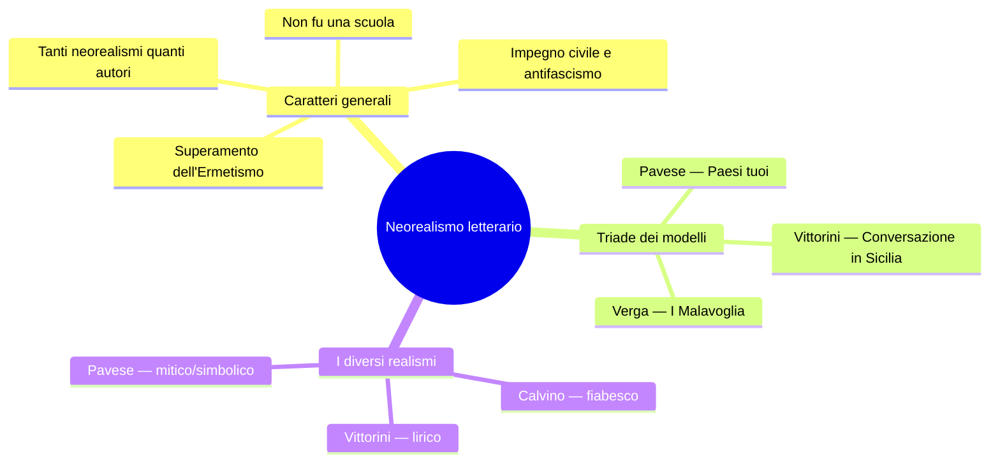
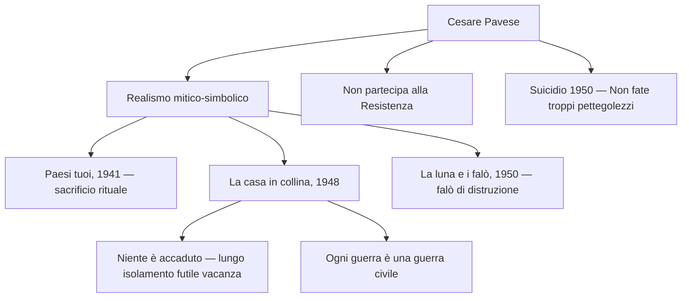
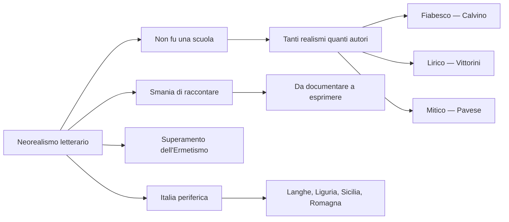

# Il Neorealismo letterario — Riassunto

---

## 1. Caratteri generali

### Definizione: non una scuola, ma tanti neorealismi

A differenza del Neorealismo cinematografico — da *Ossessione* di Visconti (1942) a *Miracolo a Milano*, circa un decennio di stagione compatta — il Neorealismo letterario è assai più sfumato. Gli autori che vi vengono ricondotti — Calvino, Fenoglio, Pavese, Vittorini, Viganò — presentano personalità eterogenee, percorsi diversi, stili inconciliabili tra loro.

Il critico **Carlo Bo** ha colto questo punto con grande lucidità:

> [!note] Dalla lezione
> «La parola neorealismo usata in letteratura non definisce niente di intrinseco che sia comune a tutti i nostri scrittori o anche solo a una gran parte di essi. Via via che dici la parola, tu la devi riempire di un significato speciale. In sostanza, tu hai tanti neorealismi quanti sono i principali narratori.»

Non esiste dunque **un** neorealismo letterario, ma tanti neorealismi quanti sono gli autori. Calvino stesso, nella Prefazione del 1964 al *Sentiero dei nidi di ragno*, ribadisce che **il neorealismo non fu una scuola** — non aveva canoni, regole o codici condivisi come la Scuola Siciliana del Duecento, ma era piuttosto «un insieme di voci in gran parte periferiche, una molteplice scoperta delle diverse Italie». Il denominatore comune è una **disponibilità al dibattito civile, sociale e politico** e un orientamento antifascista di fondo. Gli obiettivi condivisi: occuparsi dei problemi reali del Paese, creare un dialogo con il pubblico, rifiutare classicismo ed estetismo, privilegiare i contenuti sulla forma. La lingua si adegua di conseguenza, andando nella direzione del parlato e accogliendo dialetti e lessico popolare.

### Superamento dell'Ermetismo, triade dei modelli, Italia periferica

Il Neorealismo reagisce all'**Ermetismo** degli anni Trenta: una poesia oscura, levigata, destinata a un'élite di intellettuali e lontana dai problemi reali del Paese. La generazione neorealista recupera il **rapporto tra scrittore e popolo**: non più una letteratura per pochi, ma una letteratura che nasce da esperienze condivise.

Calvino indica tre modelli per la sua generazione: ***I Malavoglia*** di Verga (1881), ***Paesi tuoi*** di Pavese (1941), ***Conversazione in Sicilia*** di Vittorini (1941). Ogni autore sviluppa poi il proprio tipo di realismo: **fiabesco** (Calvino), **lirico** (Vittorini), **mitico-simbolico** (Pavese). Una novità fondamentale è l'ingresso nella letteratura di un'Italia **rurale, contadina, operaia, regionale, periferica**: la Liguria di Calvino, il Piemonte delle Langhe di Pavese e Fenoglio, la Sicilia di Vittorini, la Romagna di Viganò. Come scrive Calvino: «Il mio paesaggio era qualcosa di gelosamente mio».

---

## 2. La Prefazione del '64: dichiarazione di poetica

La Prefazione che Calvino scrive nel 1964 per la riedizione del *Sentiero dei nidi di ragno* è considerata una vera **dichiarazione di poetica del neorealismo letterario**. A quasi vent'anni di distanza, Calvino riflette su ciò che il Neorealismo è stato e su come è nato.

Il romanzo non è, per Calvino, un'opera individuale, ma un libro «nato anonimamente da un **clima generale** di un'epoca, da una **tensione morale**, da un **gusto letterario** che era quello in cui la nostra generazione si riconosceva». È il libro di una **collettività anonima** — eco della voce impersonale verghiana. Calvino e i suoi coetanei non si sentivano «schiacciati, vinti, bruciati», bensì **vincitori**, «spinti dalla carica propulsiva della battaglia appena conclusa». Da questo senso di vittoria nasce la spinta creativa.

L'esperienza condivisa della guerra — guerra e guerra civile, perché italiani combattevano contro italiani — aveva stabilito un'**immediatezza di comunicazione tra scrittore e pubblico**: «Si era faccia a faccia, alla pari, carichi di storie da raccontare: ognuno aveva avuto la sua, ognuno aveva vissuto vite irregolari, drammatiche, avventurose.» Questa forza Calvino la chiama **smania di raccontare**, illustrandola con un'immagine memorabile: «Nei treni che riprendevano a funzionare, gremiti di persone, di sacchi di farina e bidoni d'olio, ogni passeggero raccontava agli sconosciuti le vicissitudini che gli erano occorse.»

Calvino precisa però che la molla della scrittura non stava semplicemente nel voler **documentare e informare**, ma nell'**esprimere**. La parola "esprimere" viene dal latino *ex-premo*: ciò che preme dall'interno e ha bisogno di uscire. Il Neorealismo non è mero documentarismo, ma rielaborazione artistica di un'esperienza vissuta.

> [!note] Dalla lezione
> La professoressa insiste sulla distinzione tra "documentare" ed "esprimere": documentare è un atto oggettivo, riferire i fatti; esprimere implica una dimensione interiore. Il Neorealismo sta in questa tensione: è radicato nella realtà, ma non rinuncia alla dimensione soggettiva dell'arte. Parallelo con *Se questo è un uomo* di Primo Levi: quando uscì per la prima volta, nessuno voleva pubblicarlo — fu una sorta di **rimozione** collettiva. Dovevano passare anni perché quelle vicende fossero metabolizzate.

Scrivere il romanzo della Resistenza si poneva come un **imperativo**, ma Calvino sentiva il tema «troppo impegnativo e solenne» per le sue forze. Decise allora di affrontarlo «non di petto, ma **di scorcio**» — tangenzialmente, attraverso gli occhi di un bambino.

---

## 3. Italo Calvino: il realismo fiabesco

### *Il sentiero dei nidi di ragno* (1947)

Ambientato in Liguria dopo l'8 settembre 1943. Il protagonista **Pin**, ragazzino orfano di madre, vive con la sorella che si prostituisce. Ruba una pistola a un soldato tedesco e la nasconde dove i ragni fanno il nido. La Resistenza è vista attraverso i suoi occhi. La scelta del punto di vista infantile è programmatica: Calvino vuole evitare la **retorica**, la **celebrazione**, il ritratto **agiografico** (cioè "santificatore") della Resistenza.

> [!note] Dalla lezione
> Calvino lo dice esplicitamente nella Prefazione: raccontare la Resistenza dal suo punto di vista di scrittore adulto e borghese sarebbe stato come mentire — avrebbe significato mettere una sovrastruttura ideologica. Lo sguardo del bambino gli consente invece di mostrare la lotta partigiana con autenticità: eroismo ma anche incertezze, fragilità, disorganizzazione, conflitti interni.

La pistola, strumento di morte, diventa nelle mani di Pin un **oggetto magico**, come nelle fiabe. Il sentiero segreto dei ragni è un **luogo fiabesco**. Calvino fonde realtà storica e dimensione dell'avventura infantile: di qui il **realismo fiabesco**.

### La solitudine di Pin e la «nebbia di solitudine»

Il brano letto in classe mostra Pin in una condizione di profondo isolamento. È **doppiamente escluso**: dal mondo degli adulti (troppo giovane) e da quello dei coetanei (troppo volgare, frequenta l'osteria, le madri proibiscono ai figli di stare con lui). Il brano si chiude con un'immagine di grande intensità poetica: «Tutto per smaltire la **nebbia di solitudine** che ti si condensa nel petto le sere come quella.» La nebbia evoca smarrimento e perdita dell'orientamento; il verbo "condensa" suggerisce un peso che si aggruma nel petto.

> [!note] Dalla lezione
> Il tema della solitudine di Pin è esistenziale e universale: il passaggio traumatico dall'infanzia alla maturità. Paralleli nel cinema neorealista: Edmund in *Germania anno zero*, il bambino in *Ladri di biciclette*.

---

## 4. Elio Vittorini: il realismo lirico

### Il Politecnico, l'Americana e la polemica con Togliatti

Vittorini è siciliano, poi si trasferisce al Nord e partecipa alla lotta clandestina per il PCI. A Milano, nel 1945, fonda la rivista **Il Politecnico**: propone lo svecchiamento della cultura italiana (apertura alla psicanalisi, collegamento intellettuali-popolo, apertura alla cultura americana). Nel 1941 cura con Pavese l'antologia **Americana** — censurata dal regime fascista, che ne vede il contrasto con il mito della superiorità italica.

La polemica con **Togliatti** (1946-47) è celebre: per Togliatti l'arte deve servire la politica; Vittorini ribatte con una frase divenuta proverbiale che l'arte **non deve suonare il piffero della rivoluzione** — è naturalmente impegnata ma deve restare autonoma.

> [!note] Dalla lezione
> La professoressa fa notare che anche Vittorini, pur essendo un intellettuale di sinistra, ha rapporti turbolenti col PCI — così come Pasolini, espulso dal partito perché omosessuale: «sarebbe stata pessima pubblicità».

### *Conversazione in Sicilia* (1941): astratti furori, inerzia, accidia

La critica riconosce *Conversazione in Sicilia* come l'unico autentico **capolavoro** di Vittorini — ed è il romanzo che Calvino inserisce nella triade dei modelli. Il protagonista **Silvestro** torna dalla nativa Sicilia a far visita alla madre, che fa iniezioni a domicilio: il giro delle iniezioni è l'occasione per incontrare il popolo. Il realismo di Vittorini è definito **lirico** o **idilliaco**: oscilla tra mito e storia, e il linguaggio è ricco di procedimenti poetici — allitterazioni, anafore, **epifore**, **sinestesie**.

L'incipit è tra le pagine più celebri del Novecento italiano:

> «Io ero, quell'inverno, preda ad **astratti furori**. Non dirò quali, non di questo mi sono messo a raccontare, ma bisogna dita che erano astratti, non eroici, non vivi. Furori, in qualche modo per il genere umano perduto.»

I "furori" sono un'inquietudine profonda, ma "astratti": **non direzionati**, non "eroici" (non conducono all'azione), non "vivi" (non si manifestano). Sono furori per il «genere umano perduto» — allusione alla guerra civile spagnola, alle dittature. Silvestro è in una condizione di totale **inerzia** e **stallo**: «Vedevo manifesti di giornali squillanti e chinavo il capo.» L'espressione «giornali squillanti» è una **sinestesia** (visivo + uditivo). Il gesto del "chinare il capo" si ripete come **epifora** alla fine di periodi successivi, indicando distacco e mancanza di partecipazione emotiva. Le **scarpe rotte** — «pioveva intanto (...) e io avevo le scarpe rotte. L'acqua che mi entrava nelle scarpe» — simboleggiano povertà e fatica del vivere.

> [!note] Dalla lezione
> La professoressa collega la condizione di Silvestro all'**accidia** petrarchesca: quell'unione di ansia e inerzia, la mancanza di voglia di tutto, l'indifferenza verso il mondo. «Non mi importava che la mia ragazza mi aspettasse (...) sfogliare il dizionario per me era lo stesso e uscire a vedere gli amici o restare in casa era per me lo stesso. Ero quieto.» La pagina si chiude in circolo perfetto — «mi agitavo entro di me per astratti furori e pensavo il genere umano perduto, chinavo il capo e pioveva, non dicevo una parola agli amici e l'acqua mi entrava nelle scarpe» — che la professoressa definisce «memorabile, di una bellezza indescrivibile».

---

## 5. Cesare Pavese: il realismo mitico-simbolico

### Il profilo: mancata Resistenza e suicidio

Romanziere, poeta, traduttore (traduce *Moby Dick*), editore per **Einaudi**. Studioso profondo della letteratura americana. **Non partecipa alla Resistenza** — a differenza di Calvino e Fenoglio. Si iscrive al PCI nel 1948, quasi a risarcimento. Si suicida il **27 agosto 1950** all'Hotel Roma di Torino, a 42 anni. Biglietto d'addio su una copia di *Dialoghi con Leucò*: **«Perdono tutti e a tutti chiedo perdono. Va bene? Non fate troppi pettegolezzi.»**

### Temi fondamentali e realismo mitico-simbolico

I temi costanti di Pavese: contrapposizione **città/campagna**, mito della **terra natìa** e dell'infanzia, la **collina** come simbolo di isolamento, la **solitudine dell'intellettuale** incapace di agire, il **senso di colpa** per il mancato impegno, e soprattutto elementi **primordiali e ancestrali** — sangue, terra, latte, fuoco — caricati di significato simbolico. Perciò si parla di **realismo mitico-simbolico**: il racconto è radicato nella realtà storica piemontese, ma è costellato di elementi che rimandano a una dimensione primigenia e archetipica.

### *Paesi tuoi* (1941): violenza ancestrale e sacrificio rituale

Uno dei tre modelli indicati da Calvino. Storia cupa e violenta sulle Langhe: **Berto** (narratore) e **Talino** escono dal carcere a Torino e tornano alla famiglia contadina di Talino. Qui si consuma una vicenda di violenza: Talino uccide la sorella **Gisella** con un tridente, accecato dalla gelosia legata a un rapporto incestuoso. La morte di Gisella è presentata come **sacrificio rituale**, con insistenza su elementi primordiali: il **sangue**, la **terra** e il **fango** nero, il **sudore**, le mammelle scoperte di Gisella (richiamo alla maternità e ai cicli della natura). Il tridente, strumento di lavoro contadino, ritorna come presagio inquietante.

> [!note] Dalla lezione
> La professoressa legge la scena dell'uccisione di Gisella: «Talino aveva fatto due occhi da bestia e, dando indietro un salto, le aveva piantato il tridente nel collo (...) Gisella tossiva e vomitava sangue, e quel fango era nero.» L'immagine delle mammelle scoperte viene collegata all'iconografia cristiana della maternità e ai cicli della natura — elemento mitico che ritorna anche ne *La casa in collina*.

Stile di *Paesi tuoi*: prosa scarna, **paratassi** (frasi brevi e coordinate), sequenze dialogiche, lessico semplice che ricalca il parlato contadino. Il mondo contadino è mostrato senza idealizzazione, nella sua barbarie e violenza.

### *La casa in collina* (1948): «Niente è accaduto» e «ogni guerra è una guerra civile»

Capolavoro di Pavese. **Corrado**, intellettuale, durante la Resistenza si rifugia sulle colline rifiutando di combattere: è l'**autobiografia** di Pavese. La collina simboleggia l'isolamento dell'intellettuale incapace di agire. Corrado incontra **Cate**, un ex amore che ha un figlio piccolo, **Dino** — forse suo — e resta paralizzato dall'inerzia.

Il brano letto in classe si apre con **«Niente è accaduto»**: Corrado è marginale rispetto alla storia, la guerra gli procura solo «fastidio e vergogna». Ma affiora il senso di colpa: «Questa guerra ci brucia le case (...) finirà per costringerci a combattere anche noi. E verrà il giorno che nessuno sarà fuori dalla guerra, né i vigliacchi, né i tristi, né i soli.» L'immagine chiave descrive l'intera parabola del personaggio:

> «M'accorgo che ho vissuto un solo **lungo isolamento**, una **futile vacanza**, come un ragazzo che giocando a nascondersi entra dentro un cespuglio e ci sta bene, guarda il cielo da sotto le foglie e si dimentica di uscire mai più.»

Il brano culmina in una delle riflessioni più potenti del Novecento italiano. Pavese medita sulla Resistenza come guerra civile — guerra di italiani contro italiani — e allarga la riflessione:

> «Ho visto i morti sconosciuti, i morti repubblichini. Sono questi che mi hanno svegliato. Se un ignoto, un nemico, diventa morendo una cosa simile, se ci si arresta e si ha paura a scavalcarlo, vuol dire che anche vinto il nemico è qualcuno, che dopo averne sparso il sangue bisogna placarlo, dare una voce a questo sangue, giustificare chi l'ha sparso. Guardare certi morti è umiliante.»

E la conclusione da **tenere a mente**:

> «Per questo **ogni guerra è una guerra civile**: ogni caduto somiglia a chi resta, e gliene chiede ragione.»

Il nemico morto perde la sua qualità di nemico e diventa semplicemente un essere umano uguale a noi: è un'affermazione di profondo **umanesimo**.

> [!note] Dalla lezione
> La professoressa definisce questo passo «paradigmatico, bellissimo» e chiede esplicitamente di memorizzarlo. È una delle citazioni fondamentali del Novecento italiano.

### *La luna e i falò* (1950): il ritorno impossibile

Ultimo romanzo di Pavese, pubblicato l'anno del suicidio. Il protagonista **Anguilla** torna nelle Langhe dopo anni. I **falò rituali** per propiziare i raccolti sono stati sostituiti dai **falò di distruzione** durante la guerra — non solo delle cose, ma anche delle persone. Tema: lo sradicamento, il ricordo, l'impossibilità del ritorno alle origini.

---

## 6. Beppe Fenoglio e *Una questione privata*

### La «questione privata» nella guerra pubblica

*Una questione privata*, pubblicato postumo nel 1963, è il romanzo di Fenoglio che la classe ha letto in dettaglio. Come Pavese, Fenoglio è delle **Langhe** piemontesi — ma mentre Pavese è l'intellettuale che si sottrae alla lotta, Fenoglio è il partigiano che combatte.

Il protagonista è **Milton**, giovane partigiano colto e sensibile, innamorato di **Fulvia**. Nel pieno della guerra viene ossessionato da una **questione privata**: il sospetto che Fulvia abbia avuto una relazione con **Giorgio**, un suo compagno. L'ossessione diventa così totalizzante che la guerra, la libertà, i compagni, i nemici — tutto passa in secondo piano:

> «Non ne posso più (...) il fatto è che più niente mi importa, di colpo più niente: la guerra, la libertà, i compagni, i nemici. Solo più quella verità.»

Il titolo è programmatico: la "questione privata" — l'ossessione amorosa — irrompe prepotentemente nella dimensione pubblica della guerra. Le due dimensioni si intrecciano inestricabilmente. Milton, incaricato dal comandante **Leo** di fare ricognizioni, risponde meccanicamente alle domande militari, ma i suoi pensieri sono tutti per Fulvia. Basta un dettaglio — il **campo da tennis** — perché scatti il ricordo: «Avrai presente verso la segheria e il campo da tennis. **Fulvia ci giocava con Giorgio, sempre in singolo.**»

### Il ritratto di Milton e le tecniche narrative

Il flashback dal campo da tennis è un capolavoro di caratterizzazione indiretta. In poche righe capiamo chi è Milton: è **povero** («senza i soldi per pagarsi una bibita»), mentre Fulvia è benestante; è a disagio, timido, insicuro fisicamente («sedeva scomodo, smuovendo senza sosta le lunghe gambe, i pugni serrati nelle tasche»); ma è un **intellettuale colto** — in fondo alla tasca porta «un foglietto con la versione di una poesia di Yeats» (*When you are old and grey and full of sleep*, poesia romantica inglese carica di malinconia).

Fenoglio mette in campo una notevole varietà di tecniche narrative: **dialoghi** realistici, sequenze narrative, **flussi di coscienza**, **flashback**. Le scelte lessicali sono crude: Leo che compie trent'anni dice «se anche **crepassi** domani, **creperei** vergognosamente vecchio. È un vero record.» La coppia crepassi/creperei — la stessa parola coniugata diversamente — è una figura di **poliptoto** che esprime con crudezza la quotidianità della morte tra i partigiani.

> [!note] Dalla lezione
> La professoressa sottolinea il risvolto amaro: morire a trent'anni significava morire «vecchi» nella guerra partigiana. La leggerezza apparente del tono nasconde il dramma profondo dei partigiani, che avevano a che fare con la morte ogni giorno.

---

## 7. Renata Viganò e *L'Agnese va a morire*

Il romanzo di **Renata Viganò** è il primo testo neorealista affrontato dalla classe. Racconta la storia di Agnese, una **staffetta partigiana** nella Romagna della Resistenza. È stato trasposto in un film diretto da **Giuliano Montaldo**, con Ingrid Thulin nel ruolo della protagonista.

> [!note] Dalla lezione
> La lezione si apre con la testimonianza diretta di una ex staffetta partigiana romagnola: il trasporto di notizie e armi in bicicletta tra Taglio Corelli e Lavezzola, l'incontro con un uomo travestito da donna sull'argine del Reno, la granata cadutale vicino, la partecipazione alle riprese del film di Montaldo. La testimone racconta anche la miseria della vita contadina sotto il fascismo — sei persone in due stanze, mezzo pulcino diviso in sei — e il padre bracciante forzato a iscriversi al Fascio, picchiato per aver tentato di partecipare al funerale del primo maggio. La professoressa sottolinea la precisione dei ricordi a distanza di decenni.

---

## 8. Quadro sinottico degli autori

| | **Calvino** | **Vittorini** | **Pavese** | **Fenoglio** | **Viganò** |
|---|---|---|---|---|---|
| **Tipo di realismo** | Fiabesco | Lirico | Mitico-simbolico | Crudo, asciutto | Documentaristico |
| **Opera chiave** | *Il sentiero* (1947) | *Conversazione in Sicilia* (1941) | *La casa in collina* (1948) | *Una questione privata* (1963) | *L'Agnese va a morire* (1949) |
| **Paesaggio** | Liguria | Sicilia | Langhe (Piemonte) | Langhe (Piemonte) | Romagna |
| **Punto di vista** | Bambino (Pin) | Intellettuale in crisi (Silvestro) | Intellettuale che non combatte (Corrado) | Partigiano innamorato (Milton) | Staffetta partigiana (Agnese) |
| **Tema dominante** | Resistenza e solitudine infantile | Inerzia e astratti furori | Senso di colpa, isolamento | Ossessione privata nella guerra | Lotta partigiana dal basso |
| **Resistenza** | Sì | Sì (clandestina) | No | Sì | Sì |
| **PCI** | Iscritto, poi distaccato | Polemico (Togliatti) | Iscritto nel '48 | — | — |

