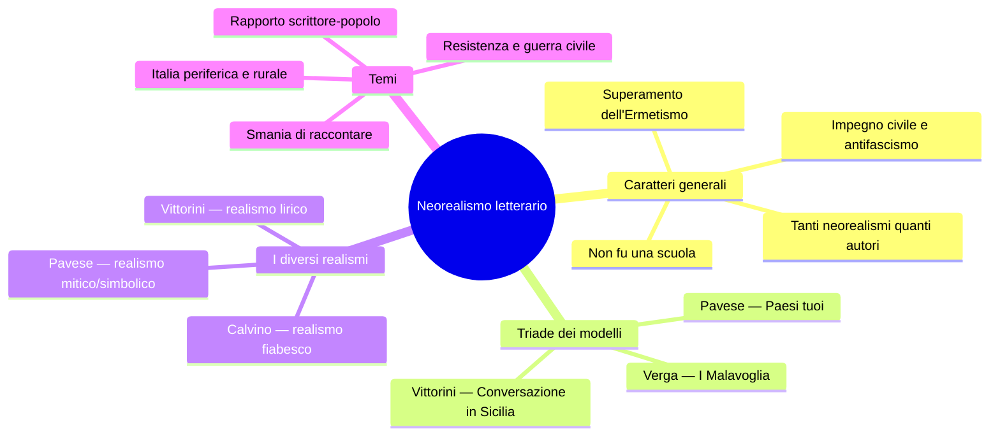
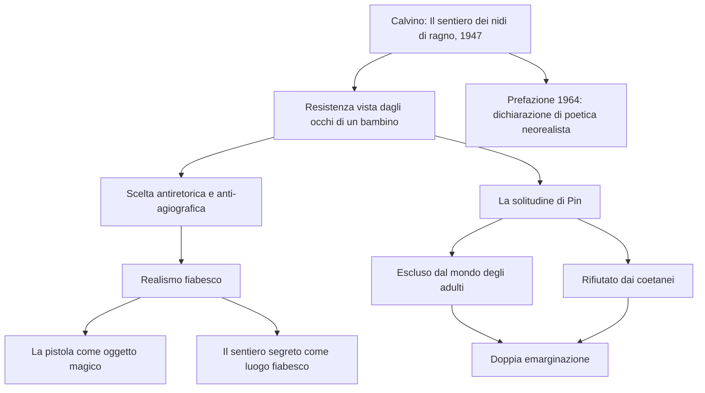
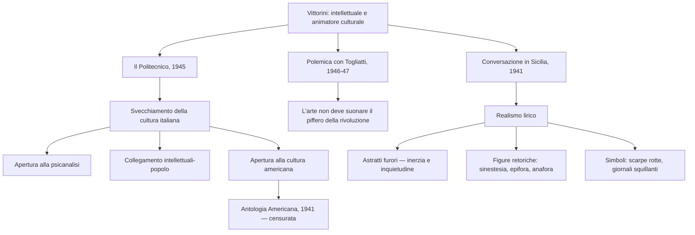
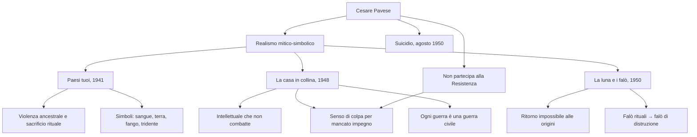
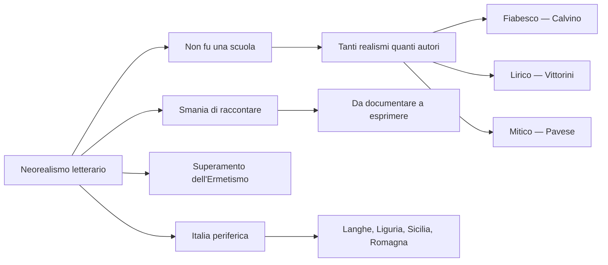

# Il Neorealismo letterario — Riassunto

---

## Quadro cronologico

| Anno | Evento |
|------|--------|
| **1941** | Pavese pubblica *Paesi tuoi*; Vittorini pubblica *Conversazione in Sicilia*; i due curano l'antologia *Americana* |
| **1942** | Visconti gira *Ossessione* (anticipazione del neorealismo cinematografico) |
| **1945** | Vittorini pubblica *Uomini e No*; fonda **Il Politecnico** a Milano |
| **1946-47** | Polemica Vittorini-Togliatti sull'autonomia dell'arte |
| **1947** | Calvino pubblica *Il sentiero dei nidi di ragno*; Pavese pubblica *Il compagno* |
| **1948** | Pavese pubblica *La casa in collina* e si iscrive al PCI |
| **1950** | Pavese pubblica *La luna e i falò* e si suicida a Torino |
| **1963** | Fenoglio pubblica postumo *Una questione privata* |
| **1964** | Calvino ripubblica *Il sentiero* con la celebre Prefazione |

---

## 1. I caratteri generali del Neorealismo

### 1.1 Un "non-movimento" eterogeneo

Nel cinema il Neorealismo ha confini cronologici abbastanza netti, mentre nella letteratura la situazione è assai più sfumata. Gli autori ricondotti al movimento — Calvino, Fenoglio, Pavese, Vittorini, Viganò — presentano personalità eterogenee e stili inconciliabili. Ciò che li accomuna è una **disponibilità al dibattito civile e politico** e un orientamento antifascista. Il critico **Carlo Bo** ha chiarito il punto:

> «La parola neorealismo usata in letteratura non definisce niente di intrinseco comune a tutti. In sostanza, hai tanti neorealismi quanti sono i principali narratori.»

Calvino stesso, nella Prefazione del 1964 al *Sentiero dei nidi di ragno*, ribadisce che **il neorealismo non fu una scuola** — non una corrente con canoni condivisi, ma «un insieme di voci in gran parte periferiche, una molteplice scoperta delle diverse Italie».

### 1.2 Obiettivi comuni e modelli

Pur nella diversità, si possono individuare tratti condivisi: occuparsi dei **problemi reali del Paese**, creare un **dialogo con il pubblico**, rifiutare le forme estetizzanti, esprimere una posizione **antifascista**. La lingua si adegua: la prosa va nella direzione del parlato, con dialetto, espressioni idiomatiche e sintassi colloquiale.

Per comprendere la rottura neorealista, bisogna ricordare che negli anni Trenta dominava l'**Ermetismo**: una poesia oscura e d'élite, lontana dai problemi reali. La generazione neorealista vuole recuperare il **rapporto tra scrittore e popolo**. Calvino indica tre modelli fondamentali:

| Opera | Autore | Anno |
|-------|--------|------|
| ***I Malavoglia*** | Giovanni Verga | 1881 |
| ***Paesi tuoi*** | Cesare Pavese | 1941 |
| ***Conversazione in Sicilia*** | Elio Vittorini | 1941 |

Un tratto originale è l'ingresso in letteratura di un'**Italia rurale, contadina e periferica**: la Liguria di Calvino, le Langhe di Pavese e Fenoglio, la Romagna di Viganò, la Sicilia di Vittorini.

---

## 2. La Prefazione al *Sentiero dei nidi di ragno* (1964)

La Prefazione che Calvino scrive nel 1964 è una vera **dichiarazione di poetica del neorealismo**. Il romanzo non gli appartiene come opera individuale, ma è nato «anonimamente da un **clima generale**, da una **tensione morale**, da un **gusto letterario** che era quello in cui la nostra generazione si riconosceva dopo la guerra». Calvino e i suoi coetanei si sentivano **vincitori** — «spinti dalla carica propulsiva della battaglia appena conclusa» — non vinti. L'esperienza condivisa della guerra aveva stabilito un'**immediatezza di comunicazione tra scrittore e pubblico**: «Si era faccia a faccia, alla pari, carichi di storie da raccontare. Ci si strappava la parola di bocca.» Calvino chiama questa forza **smania di raccontare**.

La molla della scrittura non stava però nella volontà di **documentare**, ma di **esprimere** — parola che viene dal latino *ex-premo*, ciò che preme dall'interno. Il Neorealismo non è mero documentarismo, ma rielaborazione artistica di un'esperienza vissuta. Scrivere il romanzo della Resistenza era un **imperativo morale**, ma anche enormemente difficile. Calvino sentiva il tema «troppo impegnativo e solenne» e decise di affrontarlo «non di petto, ma **di scorcio**» — obliquamente, attraverso il punto di vista di un bambino.

---

## 3. Italo Calvino e il realismo fiabesco

### 3.1 *Il sentiero dei nidi di ragno* (1947)

Il protagonista è **Pin**, un ragazzino orfano di madre che vive con la sorella prostituta e cresce per strada in Liguria durante la Resistenza. Un giorno ruba una pistola a un soldato tedesco e la nasconde dove i ragni fanno il nido. La scelta del punto di vista infantile è programmatica: Calvino vuole sottrarsi alla **retorica** e all'**agiografia**, evitando un ritratto santificato della Resistenza e raccontandola con tutta la sua eroicità ma anche le sue fragilità. Si parla di **realismo fiabesco** perché la pistola rubata, strumento di morte, diventa nelle mani di Pin un **oggetto magico**, e il sentiero segreto rimanda al bosco delle fiabe.

### 3.2 La solitudine di Pin

Il brano "La solitudine di Pin" mostra il protagonista **doppiamente escluso**: dal mondo degli adulti che non lo accoglie per la sua età e da quello dei bambini che lo respinge perché troppo volgare e maleducato. Il brano si chiude con una metafora di grande intensità: «Tutto per smaltire la **nebbia di solitudine** che ti si condensa nel petto le sere come quella.» La nebbia evoca smarrimento; il verbo "condensa" suggerisce un peso che si aggruma nel petto. Stilisticamente il brano presenta **ripetizioni**, **enumerazioni**, metafore efficaci, un lessico che oscilla tra il colloquiale-popolare e una prosa di grande eleganza.

---

## 4. Elio Vittorini e il realismo lirico

### 4.1 L'intellettuale, Il Politecnico e la polemica con Togliatti

Vittorini nasce in Sicilia, si trasferisce al Nord e partecipa ad azioni clandestine per il PCI. Nel 1945 fonda a Milano la rivista **Il Politecnico**, con cui propone uno **svecchiamento della cultura italiana**: apertura alla psicanalisi, collegamento tra intellettuali e popolo, e soprattutto **apertura alla cultura americana**. Nel 1941, in pieno regime fascista, lui e Pavese realizzano l'antologia **Americana**, che viene censurata dal regime.

Tra il 1946 e il 1947 si consuma la celebre polemica con **Palmiro Togliatti**, segretario del PCI, che vuole la letteratura **al servizio della politica**. Vittorini ribatte che l'arte deve essere **autonoma**: non deve «suonare il piffero della rivoluzione», non può essere ridotta a strumento di propaganda.

### 4.2 *Conversazione in Sicilia* (1941): gli astratti furori

Il **capolavoro** di Vittorini — anche uno dei tre modelli di Calvino per il Neorealismo. Il protagonista **Silvestro Ferrauto**, siciliano emigrato al Nord, torna nella terra d'origine per far visita alla madre. Il realismo di Vittorini è definito **lirico o idilliaco**: oscilla tra mito e storia con un linguaggio ricco di **allitterazioni**, **anafore**, **epifore** e **sinestesie**.

L'incipit è tra le pagine più celebri del Novecento italiano:

> «Io ero, quell'inverno, preda ad **astratti furori**. Non dirò quali, non di questo mi sono messo a raccontare, ma bisogna che si sappia che erano astratti, non eroici, non vivi. Furori, in qualche modo per il genere umano perduto.»

I "furori" sono **non direzionati**, non eroici (non conducono all'azione) e non vivi (non si manifestano). È l'inquietudine per il «genere umano perduto» — allusione alla violenza delle dittature e alla **Guerra civile spagnola**. Segue una condizione di totale **inerzia**: «Vedevo manifesti di giornali squillanti e chinavo il capo.» L'espressione «giornali squillanti» è una **sinestesia** (visivo + uditivo). Il gesto del "chinare il capo" si ripete come un'**epifora**. Le **scarpe rotte** — «pioveva intanto e io avevo le scarpe rotte» — simboleggiano la povertà e la fatica del vivere aggravata dalla guerra.

---

## 5. Cesare Pavese e il realismo mitico-simbolico

### 5.1 Il profilo: l'intellettuale che non combatte

Pavese è romanziere, poeta, traduttore ed editore per **Einaudi** a Torino. Come Vittorini, è studioso della **letteratura americana** (traduce *Moby Dick*). Si iscrive al PCI nel 1948, a guerra finita — quasi a risarcimento del fatto che, **a differenza di Calvino e Fenoglio, non partecipa alla Resistenza**. Questo mancato impegno è una ferita che attraversa tutta la sua opera. Si suicida il **27 agosto 1950** all'Hotel Roma di Torino, lasciando un biglietto: **«Perdono tutti e a tutti chiedo perdono. Va bene? Non fate troppi pettegolezzi.»**

I temi fondamentali sono: la contrapposizione **città/campagna**, il mito della **terra natìa** e dell'**infanzia** come età perduta, la **collina** come simbolo di isolamento, la **solitudine dell'intellettuale**, il **senso di colpa** per il mancato impegno, e la presenza di elementi **primordiali** (sangue, terra, latte, fuoco) con valore simbolico e mitico — da cui il nome **realismo mitico-simbolico**.

### 5.2 *Paesi tuoi* (1941): violenza ancestrale

Uno dei tre modelli indicati da Calvino. Due ragazzi, **Berto** e **Talino**, escono dal carcere e tornano nella campagna piemontese. La vicenda culmina in una scena di **violenza rituale**: Talino uccide la sorella **Gisella** con un tridente in un gesto che ricorda un sacrificio ancestrale: «Talino aveva fatto due occhi da bestia e le aveva piantato il tridente nel collo (...) Gisella tossiva e vomitava sangue, e quel fango era nero.» Elementi primordiali — **sangue**, **terra**, **fango**, **latte** — si caricano di significato mitico. La prosa è **rapida e paratattica**, con un lessico semplice che ricalca il parlato contadino, e rappresenta il mondo rurale senza alcuna idealizzazione.

### 5.3 *La casa in collina* (1948): «ogni guerra è una guerra civile»

**Capolavoro assoluto** di Pavese. L'intellettuale **Corrado** si rifugia sulle colline durante la Resistenza, rifiutando di combattere. In questo personaggio Pavese riversa la propria autobiografia. Il brano letto in classe si apre con la formula che condensa tutto: **«Niente è accaduto»**. A lui la guerra porta «soltanto qualche fastidio», ma il senso di colpa affiora: «verrà il giorno che nessuno sarà fuori dalla guerra, né i vigliacchi, né i tristi, né i soli.» L'inerzia genera alienazione: l'io «si sente un altro, staccato, come se tutto ciò che ha fatto gli fosse soltanto accaduto davanti. Faccenda altrui, storia trascorsa.»

Il brano culmina in una riflessione paradigmatica. Pavese medita sui morti repubblichini — il nemico — e arriva alla conclusione più importante:

> «Per questo **ogni guerra è una guerra civile**: ogni caduto somiglia a chi resta, e gliene chiede ragione.»

Il nemico morto perde la sua qualità di nemico e diventa semplicemente un essere umano uguale a noi: è un'affermazione di profondo **umanesimo**.

### 5.4 *La luna e i falò* (1950) e la trilogia

| Opera | Data | Caratteristiche |
|-------|------|-----------------|
| ***Il compagno*** | 1947 | Bildungsroman: il giovane Pablo aderisce al comunismo. Il più impegnato politicamente, ma il più debole formalmente |
| ***La casa in collina*** | 1948 | Capolavoro. L'intellettuale Corrado si rifugia in collina rifiutando di combattere |
| ***La luna e i falò*** | 1950 | Anguilla torna nella terra natale e trova un mondo cambiato. I falò rituali che propiziavano i raccolti sono diventati **falò di distruzione**. Tema: lo sradicamento e il ritorno impossibile |

---

## 6. Beppe Fenoglio — *Una questione privata*

### 6.1 Il romanzo e l'ossessione di Milton

*Una questione privata* (postumo, 1963) è ambientato nelle **Langhe**, la stessa area geografica di Pavese, ma con un autore opposto: dove Pavese è l'intellettuale che non combatte, Fenoglio è il partigiano che combatte. Il protagonista **Milton** è un giovane partigiano colto e follemente innamorato di **Fulvia**. Nel mezzo della guerra, lo ossessiona il sospetto che Fulvia abbia avuto una relazione con il compagno **Giorgio**. Tutto il resto passa in secondo piano: «più niente mi importa, di colpo: la guerra, la libertà, i compagni, i nemici. Solo più quella verità.»

### 6.2 Tecniche narrative e stile

Il titolo è programmatico: la **questione privata** irrompe nella dimensione pubblica della guerra. Basta un campo da tennis — dettaglio fisico — perché scatti il ricordo di Fulvia che ci giocava con Giorgio. Il flashback che si apre da quel ricordo è una caratterizzazione indiretta straordinaria: Milton è **povero**, insicuro, a disagio; è un **intellettuale** che porta in tasca la versione di una poesia di **Yeats** — *When you are old and grey and full of sleep* — carica di malinconia romantica.

In poco più di una pagina Fenoglio usa **sequenze dialogiche** realistiche, **flussi di coscienza**, **flashback** e scelte lessicali crude. Il **poliptoto** «se anche crepassi domani, creperei vergognosamente vecchio» esprime con crudezza la quotidianità della morte tra i giovani partigiani: morire a trent'anni significava morire "vecchi" nel contesto della Resistenza. Lo stile è **asciutto e rapido**, autentico, vicino al parlato, capace di passare dalla crudezza alla delicatezza del ricordo amoroso.

---

## 7. *L'Agnese va a morire* di Renata Viganò

Il romanzo di **Renata Viganò** racconta la storia di Agnese, una staffetta partigiana nella Romagna della Resistenza. È stato trasposto in un film diretto da **Giuliano Montaldo**, con **Ingrid Thulin** nel ruolo della protagonista. Il realismo di Viganò è **documentaristico**: la realtà della lotta partigiana è raccontata dal basso, con attenzione precisa al territorio e alla vita contadina di chi quella lotta la viveva ogni giorno.

---

## 8. Quadro sinottico degli autori

| | **Calvino** | **Vittorini** | **Pavese** | **Fenoglio** | **Viganò** |
|---|---|---|---|---|---|
| **Tipo di realismo** | Fiabesco | Lirico | Mitico-simbolico | Crudo, asciutto | Documentaristico |
| **Opera chiave** | *Il sentiero dei nidi di ragno* (1947) | *Conversazione in Sicilia* (1941) | *La casa in collina* (1948) | *Una questione privata* (1963) | *L'Agnese va a morire* (1949) |
| **Paesaggio** | Liguria | Sicilia | Langhe (Piemonte) | Langhe (Piemonte) | Romagna |
| **Punto di vista** | Bambino (Pin) | Intellettuale in crisi (Silvestro) | Intellettuale che non combatte (Corrado) | Partigiano innamorato (Milton) | Staffetta partigiana (Agnese) |
| **Tema dominante** | Resistenza e solitudine infantile | Inerzia e astratti furori | Senso di colpa, isolamento | Ossessione privata nella guerra | Lotta partigiana dal basso |
| **Resistenza** | Sì | Sì (clandestina) | No | Sì | Sì (staffetta) |

---

## 9. I nodi concettuali fondamentali

### 9.1 Il Neorealismo non fu una scuola
Non esistono canoni condivisi, ma personalità diverse unite da impegno civile e smania di raccontare, come ribadiscono sia Calvino sia Carlo Bo.

### 9.2 Ogni autore ha il proprio realismo
Calvino è fiabesco, Vittorini è lirico, Pavese è mitico. Questa diversità non è un'eccezione: è la regola del Neorealismo letterario.

### 9.3 La smania di raccontare
L'esperienza della guerra genera un bisogno collettivo di condivisione. La scrittura neorealista nasce da questo impulso — non come documentarismo freddo, ma come bisogno di *esprimere* ciò che preme dall'interno.

### 9.4 Il superamento dell'Ermetismo
Gli scrittori neorealisti recuperano il rapporto tra scrittore e popolo, abbandonando la poesia oscura degli anni Trenta in favore di una letteratura aperta, radicata nella realtà quotidiana.

### 9.5 L'Italia periferica
La letteratura neorealista è un'esplorazione delle «diverse Italie»: le Langhe, la Liguria, la Sicilia, la Romagna. Il paesaggio è sempre locale e regionale — «gelosamente mio», come scrive Calvino.

### 9.6 Ogni guerra è una guerra civile
La frase di Pavese è una delle più importanti del Novecento italiano: «ogni caduto somiglia a chi resta, e gliene chiede ragione.» Il nemico morto perde la sua qualità di nemico e diventa un essere umano uguale a noi.

### 9.7 La questione privata dentro la storia
In Fenoglio la dimensione privata irrompe nella dimensione pubblica della guerra. Le due sfere non si possono separare: la vita degli uomini non si divide in compartimenti stagni.

### 9.8 L'autonomia dell'arte
Vittorini rivendica l'indipendenza dell'arte dalla politica: l'arte non deve «suonare il piffero della rivoluzione», ma mantenersi autonoma anche se naturalmente impegnata.

