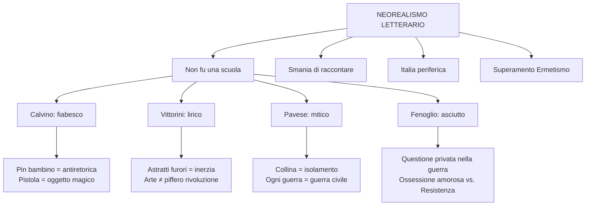

# Il Neorealismo letterario — Ripasso veloce

---

## Caratteri generali

Il Neorealismo letterario **non fu una scuola** (Calvino, Prefazione '64): non aveva canoni condivisi. Come dice Carlo Bo, «tanti neorealismi quanti sono i principali narratori». Il denominatore comune è la disponibilità al **dibattito civile e politico**, l'orientamento **antifascista**, il rifiuto dell'estetismo, il rapporto diretto tra **scrittore e popolo** (contro l'Ermetismo degli anni '30, poesia oscura e d'élite).

La letteratura neorealista porta al centro un'**Italia periferica e rurale**: le Langhe, la Liguria, la Sicilia, la Romagna. Ogni autore racconta il proprio paesaggio.

**Triade dei modelli** (indicata da Calvino): *I Malavoglia* (Verga), *Paesi tuoi* (Pavese, 1941), *Conversazione in Sicilia* (Vittorini, 1941).

---

## La Prefazione del '64 — Concetti chiave

Calvino rilegge il *Sentiero dei nidi di ragno* e non lo riconosce come suo: è nato da un **clima generale**, una **tensione morale** condivisa → libro di una **collettività anonima**.

La guerra crea un'**immediatezza di comunicazione** tra scrittore e pubblico (stesse esperienze, posizione paritaria) → nasce la **smania di raccontare**: bisogno collettivo di condividere. Ma non documentarismo: la molla è **esprimere** (lat. *ex-premo*, ciò che preme da dentro).

Scrivere della Resistenza = **imperativo** → Calvino lo affronta **di scorcio**, non di petto → punto di vista di un bambino.

---

## Calvino — Realismo fiabesco

***Il sentiero dei nidi di ragno*** (1947): **Pin**, ragazzino orfano in Liguria, ruba una pistola a un tedesco e la nasconde dove i ragni fanno il nido. La Resistenza vista da un bambino → scelta **anti-agiografica** (evitare la santificazione dei partigiani), **antiretorica**.

La pistola diventa **oggetto magico**, il sentiero è un **luogo fiabesco** → realtà storica + dimensione dell'avventura infantile.

Pin è **doppiamente escluso**: dagli adulti (troppo giovane) e dai coetanei (troppo volgare). Immagine chiave: «la **nebbia di solitudine** che ti si condensa nel petto» → metafora di smarrimento e peso interiore.

---

## Vittorini — Realismo lirico

Siciliano, lotta clandestina col PCI. Fonda **Il Politecnico** (1945): svecchiamento culturale, apertura alla cultura americana. Con Pavese cura l'antologia **Americana** (1941, censurata).

**Polemica con Togliatti** (1946-47): l'arte **non deve suonare il piffero della rivoluzione** → autonomia dell'arte dalla politica.

***Conversazione in Sicilia*** (1941): Silvestro torna in Sicilia dalla madre. Incipit celebre: «**astratti furori**» → inquietudine profonda ma non direzionata, per il «genere umano perduto». Condizione di **inerzia/accidia**: «chinavo il capo» (epifora). «Giornali squillanti» = sinestesia. **Scarpe rotte** = povertà e fatica del vivere. Linguaggio ricco di figure retoriche liriche.

---

## Pavese — Realismo mitico-simbolico

Romanziere, poeta, traduttore (*Moby Dick*), editore Einaudi. **Non partecipa alla Resistenza**. PCI dal '48. **Suicidio** il 27 agosto 1950 (Hotel Roma, Torino, 42 anni). Biglietto: «Perdono tutti e a tutti chiedo perdono. Non fate troppi pettegolezzi.»

**Temi**: città vs. campagna, terra natìa e infanzia come mito, collina = isolamento, solitudine dell'intellettuale che non agisce, senso di colpa, elementi ancestrali (sangue, terra, latte, fuoco).

***Paesi tuoi*** (1941): storia cupa sulle Langhe. Talino uccide la sorella Gisella con un tridente → **sacrificio rituale**. Elementi simbolici: sangue, fango, tridente, mammelle scoperte. Mondo contadino = barbarie senza idealizzazione. Stile: paratassi, lessico parlato.

***La casa in collina*** (1948): **Corrado**, intellettuale, si rifugia in collina durante la Resistenza → autobiografia di Pavese. «Niente è accaduto» → marginalità rispetto alla storia + **senso di colpa**. Immagine chiave: «un solo **lungo isolamento**, una **futile vacanza**, come un ragazzo che entra in un cespuglio e si dimentica di uscire mai più.»

**Citazione fondamentale** (da memorizzare):

> «Per questo **ogni guerra è una guerra civile**: ogni caduto somiglia a chi resta, e gliene chiede ragione.»

***La luna e i falò*** (1950): Anguilla torna nelle Langhe → i falò rituali sono diventati **falò di distruzione**. Sradicamento, ritorno impossibile.

---

## Fenoglio — *Una questione privata*

Postumo, 1963. Delle Langhe come Pavese, ma lui **combatte** come partigiano. **Milton**, giovane partigiano colto, è ossessionato dal sospetto che Fulvia (la donna amata) abbia avuto una relazione con Giorgio → la **questione privata** sovrasta tutto: «più niente mi importa (...) la guerra, la libertà. Solo più quella verità.»

Flashback del campo da tennis → Milton è povero, colto (poesia di Yeats in tasca), insicuro; Fulvia è benestante. Tecniche: dialoghi realistici, flashback, flusso di coscienza. Stile asciutto. La battuta di Leo: «crepassi/creperei» (**poliptoto**) = quotidianità della morte.

---

## Mappa riepilogativa

## Citazioni da ricordare

| Autore | Citazione | Concetto |
|--------|-----------|----------|
| **Calvino** | «Il neorealismo non fu una scuola» | Pluralità delle voci |
| **Calvino** | «Smania di raccontare» | Impulso collettivo post-bellico |
| **Calvino** | «Non di petto, ma di scorcio» | Scelta del punto di vista infantile |
| **Carlo Bo** | «Tanti neorealismi quanti i narratori» | Eterogeneità del movimento |
| **Vittorini** | «Non deve suonare il piffero della rivoluzione» | Autonomia dell'arte |
| **Vittorini** | «Astratti furori» | Inquietudine senza direzione |
| **Pavese** | «Ogni guerra è una guerra civile: ogni caduto somiglia a chi resta» | Umanesimo universale |
| **Pavese** | «Perdono tutti e a tutti chiedo perdono» | Biglietto d'addio |
| **Fenoglio** | «Più niente mi importa (...) Solo più quella verità» | Ossessione privata |
