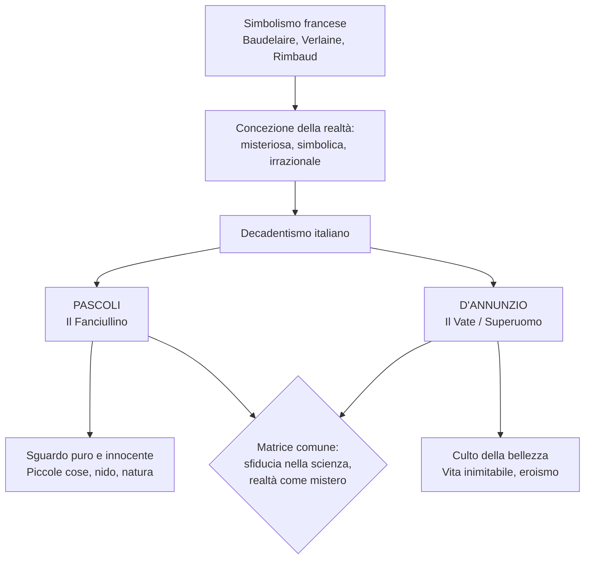
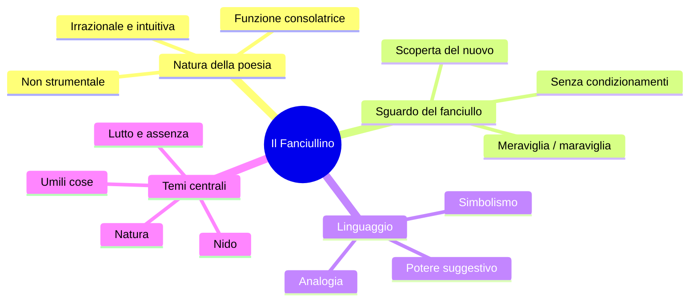
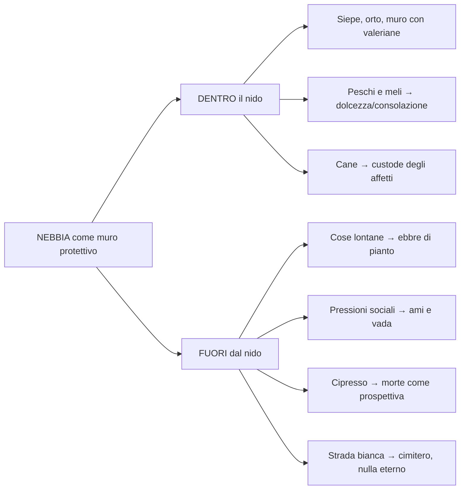
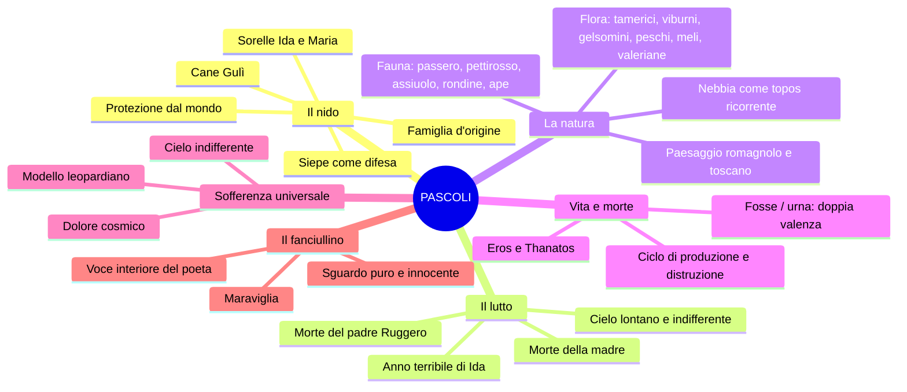
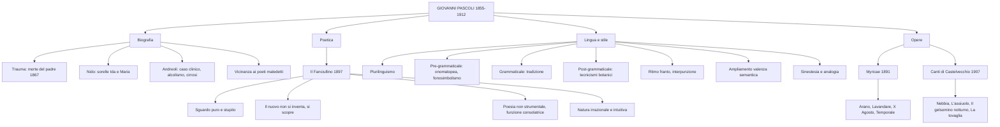

# Giovanni Pascoli — Studio completo per la maturità

---

## Date fondamentali

| Anno | Evento |
|------|--------|
| **1855** | Nasce a San Mauro di Romagna (oggi San Mauro Pascoli) |
| **1867** | Assassinio del padre Ruggero, la notte del **10 agosto** |
| **1868** | Morte della madre Caterina Allocatelli Vincenzi |
| **Anni successivi** | Muoiono anche una sorella e un fratello |
| **1871-1873** | Frequenta il liceo a Rimini |
| **Studi universitari** | Si iscrive a Lettere all'Università di Bologna; si laurea in greco |
| **Breve parentesi** | Militanza politica socialista (seguace di Andrea Costa); incarcerato a Bologna e poi liberato |
| **Post-laurea** | Cattedra al liceo di Matera (con l'interessamento di Carducci), poi trasferito a Massa |
| **Anni '80-'90** | Si trasferisce in Toscana; chiama a vivere con sé le sorelle Ida e Maria |
| **1891** | Prima edizione di **Myricae** |
| **1895** | Matrimonio della sorella Ida → **"anno terribile"** |
| **1897** | Pubblica *Il Fanciullino* (prosa poetica sulla sua concezione della poesia) |
| **1897-1903** | Insegna letteratura latina all'Università di Messina |
| **1902** | Acquista la casa di Castelvecchio di Barga (vendendo 5 medaglie d'oro di concorsi di poesia latina) |
| **1904** | *Poemi conviviali* e *Primi poemetti* |
| **1905** | Succede a Carducci nella cattedra di letteratura italiana a Bologna |
| **1907** | Edizione definitiva dei *Canti di Castelvecchio* |
| **6 aprile 1912** | Muore a Castelvecchio di **cirrosi epatica** (diagnosi a lungo taciuta) |

---

## 1. Il contesto: Decadentismo e ruolo del poeta

### 1.1 Dal Simbolismo francese al Decadentismo italiano

Per comprendere Pascoli occorre partire dal quadro culturale in cui si inserisce. Le lezioni prendono le mosse dal **Simbolismo francese** — Baudelaire, Verlaine, Rimbaud — e dalla concezione della realtà che questi poeti esprimono. Due testi di Baudelaire sono fondamentali: la prosa sulla *perdita dell'aureola* (dallo *Spleen di Parigi*), che rappresenta la perdita di sacralità del poeta in una società improntata all'utile; e *L'albatro* (da *I fiori del male*), metafora dell'isolamento e della marginalità del poeta nella società borghese — un grande uccello re dell'azzurro, impacciato e ridicolo quando costretto a camminare sulla tolda di una nave.

Il testo chiave per la concezione della realtà è *Corrispondenze* di Baudelaire: la realtà non è indagabile razionalmente, ma è un **mistero** fatto di simboli da decifrare. La conoscenza vera passa attraverso l'**intuizione**, l'**illuminazione**, l'**irrazionalità**, non attraverso la scienza e il metodo sperimentale. Questa è la matrice comune del Decadentismo.

### 1.2 I due poli del Decadentismo italiano: il Fanciullino e il Vate

I due maggiori rappresentanti del Decadentismo poetico italiano sono **Giovanni Pascoli** e **Gabriele D'Annunzio**. Nella vulgata appaiono come personaggi agli antipodi, sia nella biografia sia nella poetica. Ma condividono una radice profonda: la **sfiducia nella scienza** e la convinzione che la realtà si conosca solo attraverso l'intuizione e l'irrazionalità.

Il poeta, come dice Rimbaud nella *Lettera del Veggente*, deve farsi **veggente** — essere in grado di vedere ciò che l'uomo comune non vede, disvelando il mistero dell'esistenza. In Pascoli questa capacità visionaria si esplica attraverso lo sguardo puro e stupito del **fanciullino**; in D'Annunzio attraverso il culto della bellezza e la personalità straordinaria del **superuomo** (o **vate**).

> [!note] Dalla lezione
> La professoressa definisce D'Annunzio "il primo influencer della storia": autore di imprese fuori dal comune, poeta-soldato che occupò Fiume con un esercito, fondò la Reggenza del Carnaro, ebbe innumerevoli relazioni amorose (la più celebre con l'attrice **Eleonora Duse**), e propose di sé un'immagine eroica, di uomo eccezionale che voleva fare della vita un'opera d'arte. D'Annunzio scrive di Pascoli: "Giovanni Pascoli è il più grande e originale poeta apparso in Italia dopo il Petrarca".

---

## 2. Biografia

### 2.1 Infanzia e trauma: San Mauro di Romagna

Giovanni Pascoli nasce nel **1855** a **San Mauro di Romagna** (oggi San Mauro Pascoli), una cittadina tra Cesenatico e Rimini. Il padre, **Ruggero Pascoli**, svolgeva un lavoro molto ambito: era **amministratore della tenuta "La Torre"** dei principi Torlonia — un incarico ben remunerato. La Romagna dell'epoca era una terra violenta, di banditi e fuorilegge.

La frattura che segna in modo irreversibile l'esistenza del poeta arriva il **10 agosto 1867**: il padre Ruggero viene **assassinato** in un agguato, la sera della notte di San Lorenzo, mentre sta tornando a casa dal lavoro. Le circostanze rimangono misteriose; i colpevoli non vengono mai assicurati alla giustizia. Probabilmente il padre fu ucciso da due sicari inviati per conto di un altro uomo che aspirava a ricoprire il suo stesso ruolo di amministratore. Per il poeta dodicenne questo fatto rappresenta un **trauma** nel senso etimologico della parola: una frattura, una rottura dell'esistenza.

L'anno successivo, tra i dodici e i tredici anni, muore anche la **madre**, Caterina Allocatelli Vincenzi. In rapida successione se ne vanno anche una sorella e un fratello. Pascoli rimane con i fratelli e le sorelle di cui si sente responsabile.

> [!note] Dalla lezione
> La prof racconta che qualche settimana prima della lezione era andato in onda sulla Rai il film *Zvanì* (soprannome dialettale per "Giovannino") di Giuseppe Piccioni, che racconta la vicenda umana di Pascoli. Il giudizio della prof: "A me non è piaciuto, non sono neanche riuscita a guardarlo tutto — non me la sento di consigliarvelo."

### 2.2 Studi e carriera accademica

Pascoli studia prima presso i **Padri Scolopi a Urbino** (collegio religioso), poi frequenta il liceo a Rimini tra il 1871 e il 1873, per iscriversi infine alla **facoltà di Lettere dell'Università di Bologna**, dove si laurea in greco. È dunque un cultore della classicità greca e latina.

Una breve parentesi politica lo vede vicino al **socialismo** di **Andrea Costa**, per cui viene incarcerato a Bologna e poi liberato. Ma la sua partecipazione attiva alle vicende del suo tempo si esaurisce qui — a differenza di D'Annunzio, che è un poeta-soldato, Pascoli conduce una vita ritirata.

Con l'interessamento di **Giosué Carducci** — poeta riconosciuto e celebrato, amico e mentore che riconosce subito il talento di Pascoli, premio Nobel per la letteratura — ottiene una cattedra al **liceo di Matera**, poi viene trasferito al **liceo di Massa**. Tutta la sua vita professionale è quella dell'insegnante, prima al liceo e poi all'università. Tra il 1897 e il 1903 insegna letteratura latina all'**Università di Messina**, tornando spesso a Castelvecchio di Barga. Nel **1905** succede al suo maestro Carducci nella **cattedra di letteratura italiana all'Università di Bologna**.

### 2.3 Il nido: Castelvecchio, le sorelle, e l'"anno terribile"

I luoghi fondamentali della vita di Pascoli sono due: **San Mauro** (infanzia e adolescenza, la Romagna) e **Castelvecchio di Barga** (maturità, vicino a Lucca, in Toscana). Qui affitta una casa di campagna che nel **1902** riesce ad acquistare vendendo le **cinque medaglie d'oro** conquistate ai concorsi internazionali di poesia latina ad Amsterdam.

Ma il fatto biografico più significativo per la comprensione della poetica è il tentativo di **ricostruzione del nido familiare**. Trasferitosi in Toscana, Pascoli chiama a vivere con sé le sorelle **Ida** (la maggiore) e **Maria** (la minore, soprannominata **Mariù**). Questo gesto ha un profondo valore simbolico: Pascoli cerca di ricreare la **famiglia d'origine**, quella che si è disgregata così precocemente. A livello psichico, la critica individua nella sorella Ida una proiezione della figura materna.

Quando nel **1895** la sorella Ida si sposa e lascia il nucleo familiare per trasferirsi a Sogliano, per Pascoli è un nuovo lutto: lo definisce l'**"anno terribile"**. Il nido che aveva faticosamente ricostituito si disgrega di nuovo. Questo ripiegamento sull'infanzia, sul tempo passato, su ciò che non si è vissuto, tradisce anche una resistenza al cambiamento, al mondo esterno, alla possibilità di costruirsi una famiglia propria.

Da quel momento Pascoli vive a Castelvecchio con la sola sorella **Maria**, presenza costante — e in un certo senso ossessionante — della sua vita, insieme al cane **Gulì**, che è davvero un componente della famiglia.

### 2.4 L'interpretazione di Andreoli: Pascoli come "caso clinico"

Lo psichiatra **Vittorino Andreoli** ha dedicato a Pascoli un libro illuminante: ***I segreti di casa Pascoli. Il poeta e lo psichiatra***. Andreoli ha condotto un'indagine a posteriori sulla vita del poeta, studiando non solo le opere e gli scritti privati (lettere, appunti, abbozzi), ma anche i suoi oggetti, le fotografie, gli indumenti — aprendo armadi, visitando i luoghi in cui visse. L'obiettivo era tracciarne un **quadro clinico**, affrontando la vita di Pascoli come un **caso clinico**.

Ciò che fa di Pascoli un caso clinico, secondo Andreoli, è innanzitutto il **trauma** per la morte del padre — una morte rimasta senza colpevoli, senza giustizia, del tutto inaspettata. Questo trauma viene amplificato dalla successione ravvicinata dei lutti familiari.

La seconda osservazione di Andreoli riguarda l'ipotesi dell'**alcolismo**. Lo psichiatra la avanza a partire dall'analisi dei documenti fotografici — mettendo a confronto le foto di Pascoli e notando, ad esempio, la **circonferenza dell'addome** tipica di un consumatore assiduo di alcol — e dalla lettura degli scritti privati. In una lettera a Maria, Pascoli scrive:

> "Vado a letto quasi sempre con la **testa piena di cognac**."

E ancora, nella stessa lettera, emergono tutte le inquietudini del poeta:

> "Non sono sereno. Questo è l'anno terribile. Dell'anno terribile questo è il mese più terribile. Non sono sereno, sono disperato. Siete sorelle e amate e siete amate da sorelle, così dici. Va bene, ma dimmi in coscienza, senza diplomazia, dimmi Mariù: **tu mi ami da sorella, perché ti dà dispiacere che io ami una donna da amante, da sposa, da marito?**"

Questa lettera privata rivela un Pascoli che affoga i dolori nell'alcol, disperato per il matrimonio della sorella Ida, e che nutre verso le sorelle sentimenti che sfociano forse in qualcosa di **morboso, di incestuoso**. E contemporaneamente emerge la **gelosia ossessiva** di Mariù, che considera il fratello non tanto come un fratello quanto come un **marito** da tenere sotto controllo.

> [!note] Dalla lezione
> La prof racconta un dettaglio inquietante: Maria aveva stabilito che le camere da letto sua e di Giovanni fossero adiacenti e di mettere, ogni volta che si coricavano, un **filo ancorato a un dito del piede di ciascuno** per verificare che non ci fossero spostamenti notturni. A Maria non è mai venuto in mente di cercarsi un fidanzato o un marito. Pascoli, invece, in una certa fase della sua vita cerca di svincolarsi da questo legame così profondo ma anche così limitante.

Andreoli parla del cane **Gulì** come del **"figlio di una coppia sterile"**: a livello psichico, il cane è il perno fondamentale dell'unione affettiva tra Giovanni e Mariù.

> [!note] Dalla lezione
> La prof nota come l'ambiente in cui è ritratto Pascoli nelle foto sia sempre agreste, rurale, semplice — "da molto si potrebbe pensare che D'Annunzio si potesse ritrarre così" (anticipando il confronto con l'estetismo dannunziano).

### 2.5 La morte e la verità taciuta

Alla morte del poeta, Maria diventa la **depositaria dell'intera eredità letteraria** e colei che fornisce le versioni ufficiali sulla sua vita. Fece seppellire il fratello in una cappella privata annessa alla casa di Castelvecchio e nel sepolcro lasciò due aperture attraverso le quali poter mettere le mani per **toccarne i piedi e la testa**.

Vittorino Andreoli, studiando i documenti dell'ospedale, conclude:

> "Giovanni Pascoli muore alle 15:20 del 6 aprile 1912 di **cirrosi epatica**."

La cirrosi epatica — malattia del fegato legata all'abuso di alcol — indica un rapporto di **dipendenza** da una sostanza senza la quale la mente non funziona e si avvertono i sintomi dell'astinenza. Questa diagnosi fu **taciuta** all'epoca: alla morte di Pascoli, commozione e celebrazioni attraversarono tutta Italia, e il vizio dell'alcol avrebbe mal figurato accanto alla retorica del poeta maestro di classicità e perfezione dello spirito. L'ipotesi è confermata anche dal ritrovamento di **pancere** nei cassetti di casa — fasce enormi per altezza e circonferenza, indispensabili negli ultimi anni.

### 2.6 Pascoli e i poeti maledetti

Per molto tempo Pascoli è stato ritenuto semplicemente il "poeta del fanciullino", in un'aura serena, arcadica. La rivalutazione a partire dagli anni '50 del Novecento ha proposto un'immagine rassicurante del poeta. In realtà, Pascoli si avvicina molto per inquietudini, interiorità e sensibilità ai **poeti maledetti francesi**. Quelli facevano uso di assenzio, di droghe, di esperienze ai limiti della norma; Pascoli ha vissuto interiormente una serie di inquietudini — il trauma della morte del padre, l'alcolismo, la dipendenza affettiva morbosa — che di fatto lo avvicinano a un poeta maledetto, nonostante l'immagine ufficiale.

---

## 3. La poetica: *Il Fanciullino*

### 3.1 L'opera e il suo significato

La poetica di Pascoli è espressa in una **prosa del 1897** intitolata ***Il Fanciullino***, che presenta un dialogo tra un poeta adulto e la sua anima di fanciullo. Alla luce della biografia, il fanciullino non è solo un concetto teorico: è un **rimpianto**, un **ricordo**, la dimensione perduta che Pascoli ricerca per tutta la vita — quella della pace che ha perso e di cui va alla ricerca dolorosa per sempre.

Per Pascoli, è poeta solo colui che anche da adulto riesce a sentire cristallina e limpida dentro di sé la voce del proprio **fanciullino interiore**. Il fanciullo, a differenza dell'adulto, conosce la realtà come una **scoperta**, rimanendone ogni volta meravigliato e stupito. Questa capacità di guardare il reale ogni volta come se fosse nuovo è propria del bambino e viene a smarrirsi col passare del tempo, con l'educazione, le convenzioni sociali, i condizionamenti.

Il fanciullino di Pascoli non è però il fanciullo vitale ed energico di Leopardi. È un **fanciullo ferito**, **angosciato, turbato, ripiegato su se stesso** — segnato dal lutto e dalla perdita.

### 3.2 Lettura commentata del testo

La prosa del *Fanciullino* è, nella definizione della professoressa, "bellissima, bellissima". Ne leggiamo alcuni passaggi fondamentali.

> "È dentro noi un fanciullino che non solo ha brividi, ma lagrime e ancora, ancora i gridi suoi. Quando la nostra età è tuttavia tenera, egli confonde la sua voce con la nostra, e dei due fanciulli che ruzzano e contendono tra loro, e insieme sempre temono, sperano, godono, piangono, si sente un palpito solo, uno strillare e un guarire solo."

Dentro di noi c'è un fanciullino la cui voce, quando siamo piccoli, coincide con la nostra. I due fanciulli — il bambino reale e il fanciullino interiore — **ruzzano** (scherzano, giocano), temono, sperano, godono, piangono insieme.

Ma poi cresciamo:

> "Noi accendiamo negli occhi un nuovo desiderare, ed egli vi tiene fissa la sua antica serena **maraviglia**."

Il fanciullino conserva ciò che l'adulto perde: la **maraviglia**, la capacità di stupirsi.

> "Noi ingrossiamo e arrugginiamo la voce, ed egli fa sentire tuttavia e sempre il suo **tinnulo squillo** come di campanello."

L'adulto ingrossa e arrugginisce la voce (diventa profonda, roca); il fanciullino fa sentire un **tinnulo squillo come di campanello** — squillante, limpido, cristallino. Queste parole sono **onomatopeiche**: il significante (il suono delle lettere) corrisponde al significato, richiamando un suono cristallino. Abbiamo anche una **similitudine** ("come di campanello") e un'**allitterazione** ("tinnulo squillo campanello"). Tutto questo è **fonosimbolismo**: il suono che richiama un significato simbolico.

### 3.3 Il poeta non è maestro: la funzione consolatrice

Un passaggio ulteriore del *Fanciullino* chiarisce il rapporto tra poesia e morale:

> "Tu sei savio e mi contendo. Non vuoi né ripetere il già detto, né trovare l'indicibile. Non vuoi essere né un'inutilità né una vanità. Vuoi il nuovo, ma sai che nelle cose è il nuovo, per chi sa vederlo, e non ti indurrai a trovarlo affatturando e sofisticando. **Il nuovo non si inventa, si scopre.**"

Frase da sottolineare e ricordare: **il nuovo non si inventa, si scopre**. Il fanciullino ha la capacità di vedere il nuovo nelle cose di tutti i giorni e di meravigliarsene.

> "Poesia è trovare nelle cose, come a dire, il loro sorriso e la loro lacrima; e ciò si fa da due occhi infantili che guardano semplicemente e serenamente di tra l'oscuro tumulto della nostra anima."

Lo sguardo innocente del fanciullino guarda la realtà **senza artifici, senza pregiudizi, senza condizionamenti** — e dunque è più vicino al mistero dell'esistenza, che è compito del poeta scoprire e consegnare agli uomini.

> "Il poeta, se è e quando è veramente poeta, cioè tale che significhi solo ciò che il fanciullo detta dentro, riesce ispiratore di buoni civili costumi, d'amor patrio e familiare e umano; ma il poeta non deve farlo apposta."

Il poeta **non** si propone un fine pedagogico, educativo, morale. Tuttavia, i valori morali e civili emergono **naturalmente** quando il poeta lascia parlare il fanciullino. Se ci si chiede: "La poesia di Pascoli ha uno scopo educativo?", la risposta è: no, non in senso intenzionale. Ma la dimensione educativa emerge come intrinsecamente propria della poesia.

> "Il poeta è poeta, non oratore o predicatore, non filosofo, non istorico, non maestro, non tribuno o demagogo, non uomo di Stato o di corte."

Il poeta non si riconosce in nessun altro ruolo se non nel fanciullino.

### 3.4 I punti cardine del Fanciullino (schema riassuntivo)

1. **Natura irrazionale e intuitiva della poesia** — coerente con il Decadentismo: la conoscenza poetica non è razionale ma intuitiva.
2. **Potere analogico e suggestivo della poesia** — la poesia esprime, attraverso analogie, i segreti legami della realtà. L'analogia è una metafora difficile, ardita, in cui è difficile cogliere il legame tra un elemento e l'altro. È una delle figure retoriche più frequenti in Pascoli.
3. **La poesia come scoperta delle umili cose** — il nuovo non si inventa, si scopre. Al centro ci sono le cose di tutti i giorni.
4. **Simbolismo** — la realtà è complessa, oscura, misteriosa, fatta di simboli da decifrare (Baudelaire, *Corrispondenze*).
5. **Uso non strumentale della poesia** — non si propone una finalità educativa, ma solo una **funzione consolatrice**.

---

## 4. Lingua e stile: la rivoluzione pascoliana

### 4.1 Pascoli fondatore della poesia del Novecento

Lo storico della lingua **Pier Vincenzo Mengaldo** riconosce in Pascoli e D'Annunzio i **fondatori della poesia del Novecento**. Questo significa che rispetto alla tradizione precedente c'è una frattura profonda. Il critico **Gianfranco Contini** lo definisce **"rivoluzionario nella tradizione"** — Pascoli recupera modelli tradizionali ma li reinventa. Un altro critico lo chiama il **"disintegratore della forma poetica tradizionale"**, per sottolinearne la portata innovativa. **Pier Paolo Pasolini** scrive che Pascoli è uno degli autori che più di tutti incide sulle sperimentazioni del Novecento.

### 4.2 Il plurilinguismo

Pascoli utilizza un linguaggio straordinariamente vario, che mescola registri diversi:
- Un **registro basso**, familiare, colloquiale, quasi gergale
- Un **linguaggio tecnico-settoriale**, soprattutto legato alla **botanica** e alla **zoologia** (flora e fauna)
- Un **linguaggio vernacolare**, ricco di inflessioni e parole dialettali — romagnolo e toscano, i dialetti dei due luoghi fondamentali della sua vita
- **Termini latini** e della tradizione classica, coerenti con la sua formazione di cultore del greco e del latino

### 4.3 Le tre categorie di Contini: pre-grammaticale, grammaticale, post-grammaticale

Il critico **Gianfranco Contini** teorizza tre categorie per classificare il linguaggio pascoliano:

**Linguaggio pre-grammaticale** — Ciò che viene *prima* della grammatica. Prima di imparare a parlare, i bambini si esprimono con gesti e suoni inarticolati. In poesia, questi suoni costituiscono le **onomatopee**. Pascoli fa largo uso di un linguaggio pre-grammaticale, che è il linguaggio del **fanciullino**: onomatopee (proprie e improprie) e, in generale, **fonosimbolismo**.

L'**onomatopea propria** simula direttamente il suono (es. "tic tac", "miao", "don don", "tin tin"). L'**onomatopea impropria** è una parola che richiama il suono nel suo significante (es. "ticchettare", "miagolare", "sciabordare").

Il **fonosimbolismo** è il procedimento stilistico centrale di Pascoli: il suono, l'aspetto fonetico di una parola (il significante), allude a un elemento di contenuto simbolico. Il suono si carica di un significato simbolico.

> [!note] Dalla lezione — L'assiuolo
> La prof spiega il fonosimbolismo con un esempio tratto dalla poesia *L'assiuolo*. L'assiuolo è un rapace notturno che emette il verso "chiù". In classe viene fatto sentire il verso dell'animale. Questo suono, che si chiude sulla "u" accentata, evoca un'idea di angoscia, di lutto, di inquietudine. Nella poesia, il verso dell'assiuolo diventa **simbolo dell'angoscia** per la perdita del padre. "Chiù" — il suono ci comunica il senso di angoscia. Questo è fonosimbolismo: un suono si carica di un significato simbolico.

> [!note] Dalla lezione — I viburni
> Un altro esempio di fonosimbolismo riguarda i **viburni** — comunemente detti "palle di neve", arbusti con bellissime infiorescenze bianche. Pascoli sceglie il nome botanico "viburno" proprio per il suo suono: la presenza delle vocali "u" e "o" evoca oscurità, cupezza, mistero. Non a caso li colloca nell'atmosfera notturna del *Gelsomino notturno*.

**Linguaggio grammaticale** — Il linguaggio codificato dalle convenzioni della grammatica, il linguaggio convenzionale che si colloca all'interno della tradizione poetica.

**Linguaggio post-grammaticale** — Ciò che va *oltre* la convenzione grammaticale: tutto il **linguaggio specialistico**, i tecnicismi della botanica, della zoologia, dell'agricoltura (es. "viburni", "pampano", "marra", "porche", "maggese").

### 4.4 Il ritmo franto

Una delle novità più significative dello stile pascoliano è il **ritmo**. Il verso è spesso **franto**, spezzato. All'interno dell'endecasillabo (il verso tradizionale della poesia italiana), Pascoli inserisce lineette, parentesi, incidentali — procedimenti inauditi nella tradizione (in Petrarca, in Leopardi, non si vedono mai parentesi all'interno di un verso).

Il ritmo viene spezzato attraverso una **grande variabilità di segni di interpunzione**: virgole, punti e virgola, due punti, punti fermi, puntini di sospensione. Pause brevi e pause lunghe si alternano, frammentando l'andamento del verso e creando un senso di **sospensione e indeterminatezza**.

### 4.5 Il linguaggio metaforico e l'ampliamento della valenza semantica

Il linguaggio di Pascoli è fortemente **metaforico**: la realtà è sempre allusiva a qualcos'altro, perché è difficile da interpretare. Ma la vera innovazione è l'**ampliamento della valenza semantica** — una parola assume più significati contemporaneamente.

> [!note] Dalla lezione — "Fosse" e "urna"
> La prof illustra il concetto con due esempi tratti dal *Gelsomino notturno*:
> 
> **"Fosse"**: nel verso "cresce l'erba sopra le fosse", la parola indica sia i **fossati** (senso letterale) sia le **sepolture** (senso simbolico). Se si legge solo in senso letterale, la poesia sembra un quadretto naturalistico; ma il rimando alle tombe introduce la dimensione della **morte** in contrapposizione alla vita. In un solo verso, Pascoli evidenzia il ciclo di produzione e distruzione — molto simile a quello di Leopardi.
> 
> **"Urna"**: indica sia l'**urna cineraria** (dimensione mortuaria) sia il **calice del fiore** che viene impollinato (dimensione vitale). Una parola che evoca la morte contiene anche la nascita. **Eros e Thanatos**, vita e morte.
>
> Per molti anni la poesia pascoliana è stata intesa solo come bozzetto naturalistico, quadretto di paesaggio. Non si era capita la profondità della sua poesia, che è invece densissima di rimandi analogici.

### 4.6 Sinestesia e analogia

Il linguaggio metaforico si basa anche su una percezione simultanea che si esprime attraverso due figure retoriche particolarmente ricorrenti:

**Sinestesia** — Associa sfere sensoriali diverse. Il verso celeberrimo è **"odore di fragole rosse"**: associa il profumo delle fragole (olfatto) al colore delle fragole (vista). È una conoscenza illogica, irrazionale, intuitiva — come la realtà stessa.

**Analogia** — Una metafora ardita, difficile, in cui il legame tra i due elementi del paragone è oscuro, da decifrare. L'analogia consente alla poesia di esprimere i segreti legami della realtà.

---

## 5. Le raccolte poetiche

### 5.1 *Myricae* (1891)

La prima raccolta poetica di Pascoli, pubblicata nel **1891** e dedicata al padre Ruggero. Il titolo è un recupero virgiliano — *Myricae* indica le **tamerici**, arbusti che crescono nelle zone sabbiose costiere, in ambienti difficili per la vita vegetale. Le tamerici sono il simbolo della **poesia fatta di piccole cose**, di oggetti umili. Se la rosa, il giglio, l'alloro appartengono alla tradizione letteraria elevata, le tamerici sono piante umili che attecchiscono in ambienti semplici — un po' come la finestra di Leopardi.

**Temi centrali** di *Myricae*: la **natura**, le **umili cose**, il **nido**, l'**assenza**, il **lutto**, i **morti**.

### 5.2 *Canti di Castelvecchio* (1907, edizione definitiva)

La seconda raccolta fondamentale, legata alla fase della maturità trascorsa in Toscana. Condivide con *Myricae* molti temi (la natura, il lutto, il nido) ma in una dimensione spesso più meditativa e inquieta. La nebbia, ad esempio, è un elemento del paesaggio ricorrente in entrambe le raccolte — tipica sia del paesaggio romagnolo sia di quello toscano.

> [!note] Dalla lezione
> La prof ricorda: "Quando vi chiedo le poesie di Pascoli, vi chiedo anche a quale raccolta appartengono — se a *Myricae* o ai *Canti di Castelvecchio* — e quali sono le caratteristiche dell'una e dell'altra, e anche gli elementi in comune."

---

## 6. Analisi delle poesie

### 6.1 *Arano* (da *Myricae*)

#### Testo

> Al campo, dove roggio nel filare
> qualche pampano brilla, e dalle fratte
> sembra la nebbia mattinal fumare,
>
> arano: a lente grida, uno le lente
> vacche spinge; altri semina; un ribatte
> le porche con sua marra pazïente;
>
> ché il passero saputo in cor già gode,
> e tutto spia dai rami irti del moro;
> e il pettirosso: nelle siepi s'ode
> il suo sottil tintinno come d'oro.

#### Struttura

Due terzine e una quartina di versi endecasillabi — il metro tradizionale della poesia italiana. Ma già a colpo d'occhio l'endecasillabo pascoliano presenta un **ritmo interrotto**, frammentato, visibile dalla frequenza dei segni di interpunzione.

#### Analisi strofa per strofa

**Prima terzina — La scena visiva, l'atmosfera**

La poesia si apre su una scena di **vita contadina** romagnola tra fine Ottocento e inizio Novecento. L'indicazione spaziale "Al campo" è **indeterminata** — non un campo preciso, ma il campo, in generale. "Dove roggio nel filare qualche pampano brilla": c'è un'**anastrofe** (inversione dell'ordine logico, poiché "roggio" è aggettivo concordato con "pampano", non col filare). Il **filare** è quello delle viti; il **pampano** è la foglia della vite, diventata rossa (**roggio** = rosseggiante). Siamo in una stagione **autunnale**. "E dalle fratte" (dai cespugli) "la nebbia mattinal sembra fumare": la nebbia mattutina sembra alzarsi come fumo. Tutta la strofa è dominata dal **dato visivo**: immaginiamo un mare di nebbia costellato dalla luce delle foglie rosse.

**Seconda terzina — L'aratura, la fatica, la monotonia**

"**Arano**": il primo verbo arriva senza soggetti esplicitati — scelta che contribuisce al senso di **sospensione e indeterminatezza**. Non dice "i contadini arano", dice semplicemente "arano". I soggetti compaiono solo dopo: "uno le lente vacche spinge; altri semina; un ribatte le porche con sua marra pazïente".

"A lente grida, uno le lente vacche spinge": accompagnandosi con lamenti cadenzati, un contadino conduce avanti le lente vacche. Il dato è ora **uditivo**. L'aggettivo **"lente"** — riferito prima alle grida, poi alle vacche — rimanda alla **monotonia**, alla fatica del lavoro che si ripete sempre uguale.

"Un ribatte le porche con sua marra pazïente": **ribatte** = rivolta; **porche** = zolle di terra (termine tecnico dell'agricoltura); **marra** = zappa (termine tecnico). L'aggettivo **"paziente"** è concordato con "marra" (la zappa), ma logicamente si riferisce al contadino: è una figura retorica chiamata **enallage** (o **ipallage**), uno scambio di funzioni logiche che crea un effetto di straniamento.

I due puntini sulla "i" di "pazïente" sono una **dieresi** che segna uno **iato**: la separazione delle due vocali nel computo metrico delle sillabe, per mantenere l'endecasillabo (le-por-che-con-sua-mar-ra-paz-ï-en-te = 11 sillabe). Anche "paziente" si ricollega semanticamente a "lente": la dimensione della monotonia, del ripetersi delle stesse azioni.

**Quartina finale — L'apertura sonora**

"Ché il passero **saputo** in cor già gode": il passero **saputo** (accorto, avveduto, scaltro) gode in cuor suo perché ha osservato la semina — avrà cibo. "E il tutto spia dai rami **irti** del moro": il **moro** è il gelso; "irti" sono i rami appuntiti. Qui il **fonosimbolismo** è dato dall'**allitterazione** aspra. Il **polisindeto** ("e... e... e...") scandisce l'accumulo.

"E il pettirosso: nelle siepi s'ode / il suo sottil tintinno come d'oro": i versi finali sono tutti centrati sulla percezione **uditiva**, resa attraverso: **allitterazioni** (siepi, s'ode, suo, sottil), **onomatopea** ("tintinno" — originariamente "tin tin"), e una **similitudine** che è anche **sinestesia**: "come d'oro" associa un dato uditivo (il suono) a un dato visivo (il colore dell'oro). Un "tintinno come d'oro" è un suono dolce, cristallino, limpido. La poesia si chiude con un'**apertura alla solarità e alla speranza**, in contrasto con l'indeterminatezza nebbiosa della prima parte.

---

### 6.2 *Lavandare* (da *Myricae*)

#### Testo

> Nel campo mezzo grigio e mezzo nero
> resta un aratro senza buoi, che pare
> dimenticato, tra il vapor leggero.
>
> E cadenzato dalla gora viene
> lo sciabordare delle lavandare
> con tonfi spessi e lunghe cantilene.
>
> Il vento soffia e nevica la frasca,
> e tu non torni ancora al tuo paese!
> quando partisti, come son rimasta!
> come l'aratro in mezzo alla maggese.

#### Struttura

Due terzine e una quartina: forma del **madrigale**, legata alla poesia popolare, che Pascoli recupera.

#### Analisi strofa per strofa

**Prima terzina — La solitudine dell'aratro**

La poesia si apre su un dato **visivo**: un campo diviso in due colori — **mezzo grigio** (terra non arata) e **mezzo nero** (zolle rivoltate). In questo campo "resta un aratro senza buoi, che pare dimenticato, tra il vapor leggero" (la nebbia che si alza dal suolo). L'aratro solo, senza buoi, dimenticato: esprime **solitudine**. L'atmosfera è **indefinita**, i contorni sfumati dalla nebbia.

La **nebbia** è uno dei *topos* più frequenti nella poesia pascoliana e si carica di significati opposti: da una parte è un **muro protettivo** rispetto al mondo esterno; dall'altra è un **ostacolo** che impedisce di uscire dall'isolamento.

**Seconda terzina — Il dato uditivo**

Il dato percettivo dominante diventa **uditivo**: "e cadenzato dalla gora viene / lo sciabordare delle lavandare / con tonfi spessi e lunghe cantilene". La **gora** è un canale; lo **sciabordare** (parola **onomatopeica**) è il suono prodotto dalle donne che lavavano i panni al fiume. I **tonfi** (altra onomatopea) sono i colpi ritmici. Le **lunghe cantilene** — con il loro stesso numero di sillabe — riproducono la cadenza monotona del canto. Troviamo anche una **rima interna** (sciabordare / lavandare). Lo stato d'animo che emerge è di **fatica** e **monotonia**: un gesto che si ripete sempre uguale a sé stesso.

**Quartina — Il canto popolare e la struttura circolare**

I due punti introducono le parole del canto popolare che accompagna il lavoro. "Il vento soffia e nevica la frasca": **"nevica"** è usato transitivamente (licenza poetica: far cadere le foglie dai rami); **"soffia"** è verbo onomatopeico; "soffia / frasca" presenta **allitterazione**. "E tu non torni ancora al tuo paese": quel "tu" si riferisce a un affetto lontano, un amore perduto — il canto esprime **malinconia, nostalgia, rimpianto** per un **abbandono**.

"Quando partisti, come son rimasta! / come l'aratro in mezzo alla maggese": struttura **circolare** — il componimento si chiude sull'immagine dell'aratro, questa volta riferito a uno stato d'animo simbolico. La **maggese** è il terreno lasciato incolto nella **rotazione triennale** perché le sostanze nutritive possano rigenerarsi. L'aratro in mezzo alla maggese è il simbolo estremo della **solitudine** e dell'**abbandono** — una condizione interiore, non solo un paesaggio.

Le poesie di Pascoli non sono dunque semplici quadretti naturalistici: rappresentano una **fitta trama di riferimenti simbolici**.

---

### 6.3 *X Agosto* (da *Myricae*)

#### Testo

> San Lorenzo, io lo so perché tanto
> di stelle per l'aria tranquilla
> arde e cade, perché sì gran pianto
> nel concavo cielo sfavilla.
>
> Ritornava una rondine al tetto:
> l'uccisero: cadde tra spini:
> ella aveva nel becco un insetto:
> la cena dei suoi rondinini.
>
> Ora è là, come in croce, che tende
> quel verme a quel cielo lontano;
> e il suo nido è nell'ombra, che attende,
> che pigola sempre più piano.
>
> Anche un uomo tornava al suo nido:
> l'uccisero: disse: Perdono;
> e restò negli aperti occhi un grido:
> portava due bambole in dono...
>
> Ora là, nella casa romita,
> lo aspettano, aspettano in vano:
> egli immobile, attonito, addita
> le bambole al cielo lontano.
>
> E tu, Cielo, dall'alto dei mondi
> sereni, infinito, immortale,
> oh! d'un pianto di stelle lo inondi
> quest'atomo opaco del male!

#### Premessa

Il **10 agosto** è la data in cui il padre di Pascoli, **Ruggero**, viene ucciso. Il giorno di **San Lorenzo** è noto per il fenomeno delle stelle cadenti. La poesia costruisce un **parallelismo simmetrico** tra la rondine che torna al tetto e il padre che torna al nido — i loro destini si incrociano e si scambiano.

#### Analisi strofa per strofa

**Prima strofa — L'apostrofe a San Lorenzo**

"San Lorenzo, io lo so perché tanto / di stelle per l'aria tranquilla / arde e cade": il poeta si rivolge direttamente a San Lorenzo (**apostrofe**). Il soggetto di "arde e cade" è **"tanto"** — non "tante stelle", ma "tanto di stelle", dove "tanto" è un **sostantivo astratto** e "di stelle" un **complemento partitivo**. La differenza espressiva è significativa: "tanto di stelle" esprime un'idea di **vastità cosmica** che "tante stelle" non renderebbe. "Per l'aria tranquilla" è un complemento di **moto per luogo**. Il fenomeno delle stelle cadenti viene associato a un **pianto**: "sì gran pianto nel concavo cielo sfavilla". Le stelle cadenti sono le **lacrime del cielo**. Già qui c'è un presagio sinistro, luttuoso — oltre alla meraviglia, la dimensione del **lutto**.

**Seconda strofa — La rondine**

"Ritornava una rondine al **tetto**": sottolineare "tetto" — non "nido" — perché c'è uno **scambio di funzioni** con la strofa del padre. "Tetto" (che sta per casa) è una **metonimia**, ma è riferito alla rondine. "L'uccisero: cadde tra **spini**": le spine, l'essere uccisi, la parola "spini" rimandano alla **Passione di Cristo**. "Ella aveva nel becco un insetto: la cena dei suoi rondinini": notare la sfumatura affettuosa di "rondinini" e la **personificazione** della rondine — non si parla di pasto o cibo, ma di "**cena**", come per una famiglia.

**Terza strofa — La rondine in croce**

"Ora è là, come in **croce**": la rondine uccisa giace con le ali aperte. La dimensione **cristologica** è esplicita, non perché Pascoli sia un credente (non lo è), ma perché recupera il simbolo del sacrificio di Cristo per esemplificare il **dolore del mondo**. "Che tende quel verme a quel **cielo lontano**": rimasta bloccata nel gesto di offrire il cibo ai piccoli, tende il verme al cielo. Il cielo — sede del paradiso, di Dio — è **lontano**: non si può raggiungere. Le preghiere degli uomini rimangono sospese, inascoltate. Non c'è possibilità di salvezza o consolazione. Posizione molto simile a quella di **Leopardi** con la Luna. "E il suo nido è nell'ombra, che attende, che **pigola** sempre più piano": i rondinini stanno morendo, privati di chi doveva nutrirli e proteggerli. **"Pigola"** è onomatopea; "pigola più piano" è **allitterazione**.

**Quarta strofa — Il padre**

"Anche un uomo tornava al suo **nido**": l'indeterminato "un uomo" ha un evidente riflesso autobiografico — è il padre. E si dice "nido" per indicare la famiglia, il calore, la sicurezza. Lo scambio è compiuto: della rondine si dice "tetto", del padre si dice "nido". "L'uccisero: disse: Perdono": Pascoli immagina che le ultime parole del padre siano state queste — perdono verso un assassino sconosciuto. "E restò negli aperti occhi un grido": un grido che rimane *negli occhi* — è una **sinestesia** (dato uditivo + dato visivo). Il mistero della morte rimase negli occhi aperti del padre; il grido di aiuto non poté essere ascoltato da nessuno. "Portava due bambole in dono...": come la rondine portava la cena, il padre portava regali per le figlie. I **puntini di sospensione** sono una **reticenza** — un lasciare in sospeso, non dire tutto il dolore che quell'evento ha comportato, cioè la disgregazione di una famiglia.

**Quinta strofa — L'attesa vana**

"Ora là, nella casa **romita**" (isolata, abbandonata, solitaria), "lo aspettano, aspettano **invano**": la famiglia attende inutilmente. La ripetizione del verbo "aspettano" forma un **chiasmo** (lo aspettano / aspettano invano). Non c'è possibilità di incontro, nessuna fede in un mondo ultraterreno. "Egli immobile, **attonito**" (atterrito, immobilizzato dalla paura) "**addita** le bambole al cielo lontano": il padre, nell'immobilità della morte, porge le bambole al cielo che non risponde.

**Sesta strofa — L'apostrofe al Cielo**

"E tu, **Cielo**": la C maiuscola è una **personificazione** che rimanda alla dimensione ultraterrena — quasi "e tu, Dio". Il Cielo "dall'alto dei mondi sereni, infinito, immortale" appartiene a una dimensione di serenità, non toccata dai dolori umani; è infinito e immortale, non conosce la morte e la finitudine. "Oh! d'un pianto di stelle lo inondi / quest'**atomo opaco del male**": ancora le stelle-lacrime (ripresa dalla prima strofa → **struttura circolare**). La Terra è un **"atomo opaco del male"** — **perifrasi** che la configura per la sua piccolezza, insignificanza, mancanza di luce, e come regno del dolore.

Il tema è quello della **sofferenza universale** che accomuna tutti gli esseri senzienti — animali e uomini soffrono in un dolore cosmico. Modello: **Leopardi** e *La Ginestra*.

> [!note] Dalla lezione
> La prof definisce X Agosto "una delle poesie più costruite di Pascoli — infatti non è la mia preferita, perché è tutta elaborata e organizzata in modo molto preciso sulla simmetria". È una poesia dove l'architettura formale è particolarmente evidente.

---

### 6.4 *Nebbia* (dai *Canti di Castelvecchio*)

#### Testo

> Nascondi le cose lontane,
> tu, nebbia impalpabile e scialba,
> tu, fumo che ancora rampolli
> su l'alba
> da' lampi notturni e da' crolli
> d'aeree frane.
>
> Nascondi le cose lontane,
> nascondimi quello ch'è morto!
> ch'io veda soltanto la siepe
> dell'orto,
> la mura ch'ha piene le crepe
> di valeriane.
>
> Nascondi le cose lontane,
> le cose son ebbre di pianto!
> ch'io veda i due peschi, i due meli
> soltanto,
> che danno soave lor miele
> pel nero mio pane.
>
> Nascondi le cose lontane
> che vogliono ch'ami e che vada!
> ch'io veda là solo quel bianco
> di strada,
> che un giorno ho da fare tra stanco
> don don di campane.
>
> Nascondi le cose lontane,
> nascondile, involale al volo
> del cuore! ch'io veda il cipresso
> là solo,
> qui solo quest'orto, cui presso
> sonnecchia il mio cane.

#### Analisi strofa per strofa

**La nebbia come invocazione protettiva**

Il testo è una **invocazione alla nebbia** a cui il poeta rivolge l'invito a creare un **muro protettivo** intorno a sé e a una dimensione ridotta, domestica, familiare. La nebbia — elemento del paesaggio ricorrente sia in *Myricae* che nei *Canti di Castelvecchio*, tipica sia del paesaggio romagnolo che di quello toscano — svolge qui una funzione di **protezione** rispetto alla minaccia del mondo esterno.

**Prima strofa — L'invocazione**

"Nascondi le cose lontane, tu, nebbia **impalpabile** e **scialba**": il poeta si rivolge direttamente alla nebbia (apostrofe). "Impalpabile" = inconsistente; "scialba" = biancastra, lattiginosa, senza colore — entrambi aggettivi che rimandano all'indefinito e all'indeterminato, e costituiscono una **sinonimia**. "Tu fumo che ancora rampolli sull'alba": la nebbia è associata al fumo (come in *Arano*: "la nebbia mattinal fumare"). "Rampolli" = ti sollevi. "Da' lampi notturni e da' crolli d'aeree frane": immagine metaforica che evoca una **tempesta** che si acquieta sul far del giorno.

**Seconda strofa — Nascondere ciò che è morto**

"Nascondi le cose lontane, **nascondimi** quello ch'è morto": il passaggio da "nascondi" a "nascondimi" è un **poliptoto**. Il poeta chiede di nascondere ciò che è perduto — i lutti, il passato doloroso. "Ch'io veda soltanto la **siepe** dell'orto": la **siepe** è parola di memoria **leopardiana**, ma qui assume un significato **opposto**. Nell'*Infinito* di Leopardi la siepe è l'ostacolo fisico che consente di immaginare, di andare oltre nel processo immaginativo. La siepe di Pascoli svolge invece una **funzione protettiva**: delimita uno spazio circoscritto dal quale il poeta non vuole uscire. La sicurezza è possibile solo all'interno del **nido**. "La mura ch'ha piene le crepe di **valeriane**" (anastrofe): il muro dell'orto ha crepe in cui crescono le valeriane, pianta associata al sonno e alla **pace** — l'unica serenità possibile è in questo fazzoletto di terra.

**Terza strofa — Il dolore fuori dal nido**

"Nascondi le cose lontane, le cose son **ebbre di pianto**!": tutto ciò che si trova al di fuori della dimensione domestica è impregnato di dolore. "Ebbre di pianto" = letteralmente "ubriache di lacrime", cioè intrise di sofferenza. "Ch'io veda i due peschi, i due meli soltanto, che danno soave lor **miele** pel **nero** mio pane": i due alberi da frutto dell'orto, la marmellata dolce per il pane nero. L'**antitesi** tra i "soavi mieli" e il "nero pane" oppone la dolcezza/consolazione del nido alla fatica/angoscia/sofferenza della condizione interiore.

**Quarta strofa — La rinuncia e la strada del cimitero**

"Nascondi le cose lontane che vogliono ch'ami e che vada!": le cose esterne — le **pressioni sociali**, ma forse anche un desiderio interiore — chiedono al poeta di amare, di allontanarsi, di farsi una vita diversa. L'amore diverso da quello per le sorelle, una famiglia propria. Da una parte c'è il **rifiuto**, dall'altra c'è anche l'**attrazione**: nel chiedere alla nebbia di nascondere queste cose, il poeta rivela il desiderio che tenta di soffocare.

"Ch'io veda là solo quel **bianco di strada**, che un giorno ho da fare tra stanco **don don** di campane": una strada bianca di campagna che conduce al **cimitero**. "Ho da fare" = è destino che percorra. "Don don" è **onomatopea propria** (campane a morto). Le vocali **cupe** ("o") dominano. La **reticenza** dopo "campane" lascia intuire la fine. Per Pascoli, come per Foscolo, la morte è un **nulla eterno**.

**Quinta strofa — Cipresso e cane**

"Nascondile, involale al volo del cuore!": rubale al volo del cuore, all'aspirazione del cuore — un sussulto, un ultimo desiderio di vedere cosa c'è oltre; ma il poeta sceglie la rinuncia. "Ch'io veda il **cipresso** là solo": albero cimiteriale per antonomasia, ancora linguaggio della botanica. Il cipresso in lontananza è la **prospettiva sul futuro** (la morte). "Qui solo quest'orto, cui presso sonnecchia il mio **cane**": la **considerazione sul presente** — l'orto, la casa, la famiglia. Il cane è il **custode degli affetti familiari**.

> [!note] Dalla lezione
> La prof conclude: "Qui ritroviamo tutto Pascoli, la poetica pascoliana la troviamo qui dentro, sia per quanto riguarda i contenuti sia per quanto riguarda lo stile."

---

### 6.5 *Temporale* (da *Myricae*)

#### Testo

> Un bubbolìo lontano...
> Rosseggia l'orizzonte,
> come affocato, a mare;
> nero di pece, a monte,
> stracci di nubi chiare:
> tra il nero un casolare:
> bianco.

#### Analisi

Questa brevissima poesia — appena sette versi — è un esempio straordinario della capacità pascoliana di condensare un paesaggio e un'atmosfera in pochissime parole. Si apre con un'**onomatopea** ("bubbolìo" = il rombo lontano del tuono) seguita dai puntini di sospensione che creano **sospensione**. Domina poi il dato **visivo-cromatico**: l'orizzonte rosseggia verso il mare, nero di pece verso i monti, con stracci di nubi chiare. L'atmosfera è inquietante, minacciosa.

La chiusa è folgorante: "tra il nero un casolare: / bianco." Il casolare bianco che emerge dal nero del temporale è un'**analogia** potentissima — il **nido** familiare che resiste, piccolo e fragile, nella tempesta del mondo. La parola "bianco", isolata e definitiva, produce un effetto di improvvisa luce e speranza. La struttura è **impressionistica**: Pascoli procede per immagini giustapposte, senza verbi nella parte centrale, come pennellate su una tela.

---

### 6.6 *L'assiuolo* (dai *Canti di Castelvecchio*)

#### Testo

> Dov'era la luna? ché il cielo
> notava in un'alba di perla,
> ed ergersi il mandorlo e il melo
> pareva a cercarla.
>
> Venivano soffi di lampi
> da un nero di nubi laggiù;
> veniva una voce dai campi:
> chiù...
>
> Le stelle lucevano rare
> tra mezzo alla nebbia di latte:
> sentivo il frusciare del mare,
> sentivo un fruscìo tra le fratte;
> e intanto sentivo non so che trepido battere, tremulo, a me,
> come un cuore
> che dopo molto, molto, si schiuse,
> là in fondo al cuore,
> una voce dai campi:
> chiù...
>
> Su tutte le lucide vette
> tremava un sospiro di vento;
> squassavano le cavallette
> finissimi sistri d'argento
> (tintinni a tremiti, squilli
> a singhiozzi) —
> e là, tremula, stridula, crebbe
> la voce dai campi:
> chiù...

#### Analisi

*L'assiuolo* è una delle poesie più rappresentative del **fonosimbolismo** pascoliano. L'assiuolo è un rapace notturno il cui verso — **"chiù"** — viene ripetuto alla fine di ogni strofa come un **ritornello** che si carica progressivamente di significato.

Il paesaggio è **notturno**, immerso in atmosfere indefinite: la luna assente, il cielo che "notava in un'alba di perla", la "nebbia di latte". La poesia procede per percezioni sensoriali: visive (le stelle rare, le vette lucide), uditive (il frusciare del mare, il fruscìo tra le fratte, i "finissimi sistri d'argento" delle cavallette), tattili (i soffi di lampi).

Il verso "chiù" si chiude sulla "u" accentata, evocando un'idea di **angoscia, lutto, inquietudine**. Nella prima strofa è appena una "voce dai campi"; nella seconda si associa a un battito misterioso; nella terza "crebbe / la voce" — diventa "tremula, stridula". Il verso dell'assiuolo diventa progressivamente il **simbolo dell'angoscia** del poeta per la perdita del padre, in una dimensione indeterminata ma opprimente.

Le figure retoriche sono fittissime: **sinestesie** ("soffi di lampi", "nebbia di latte"), **onomatopee** ("chiù", "frusciare", "fruscìo", "tintinni", "squilli"), **allitterazioni** pervasive ("tremava", "tremulo", "trepido", "tremiti"), **analogie** ("finissimi sistri d'argento" per il frinire delle cavallette). La parentetica "(tintinni a tremiti, squilli / a singhiozzi)" esemplifica il **ritmo franto** tipico di Pascoli — le lineette e le parentesi all'interno del verso che spezzano l'andamento metrico.

---

### 6.7 *Il gelsomino notturno* (dai *Canti di Castelvecchio*)

#### Testo

> E s'aprono i fiori notturni,
> nell'ora che penso a' miei cari.
> Sono apparse in mezzo ai viburni
> le farfalle crepuscolari.
>
> Da un pezzo si tacquero i gridi:
> là sola una casa bisbiglia.
> Sotto l'ali dormono i nidi,
> come gli occhi sotto le ciglia.
>
> Dai calici aperti si esala
> l'odore di fragole rosse.
> Splende un lume là nella sala.
> Nasce l'erba sopra le fosse.
>
> Un'ape tardiva sussurra
> trovando già prese le celle.
> La Chioccetta per l'aia azzurra
> va col suo pigolio di stelle.
>
> Per tutta la notte s'esala
> l'odore che passa col vento.
> Passa il lume su per la scala;
> brilla al primo piano: s'è spento...
>
> È l'alba: si chiudono i petali
> un poco gualciti; si cova,
> dentro l'urna molle e segreta,
> non so che felicità nuova.

#### Analisi

*Il gelsomino notturno* — il gelsomino che si schiude solo di notte — è una delle poesie più dense e stratificate di Pascoli, costruita sull'**ampliamento della valenza semantica** e sull'intreccio tra **Eros e Thanatos**, vita e morte.

La poesia è stata composta per le nozze di un amico e allude, attraverso il linguaggio della natura, alla **notte nuziale** e al concepimento di una nuova vita. Ma questo tema è intrecciato costantemente con la dimensione della **morte**.

I **viburni** — arbusti dalle infiorescenze bianche, qui scelti per il suono cupo delle vocali "u" e "o" che evoca oscurità e mistero — collocano la scena in un'atmosfera notturna. "Nell'ora che penso a' miei cari": i cari sono i **morti**, non i vivi. La **sinestesia** celeberrima "**odore di fragole rosse**" associa olfatto e vista in una conoscenza irrazionale, intuitiva.

Il verso chiave per comprendere l'ampliamento semantico è "nasce l'erba sopra le **fosse**": le fosse sono sia i **fossati** (senso letterale) sia le **sepolture** (senso simbolico). Vita e morte coesistono: l'erba nuova nasce sui morti. L'**urna** dell'ultima strofa è sia l'**urna cineraria** sia il **calice del fiore** impollinato — morte e nascita nella stessa parola. "Non so che felicità nuova" allude alla nuova vita concepita nella notte nuziale.

La "Chioccetta per l'aia azzurra / va col suo pigolio di stelle" è un'**analogia** complessa: la Chioccetta è la costellazione delle Pleiadi, l'aia azzurra è il cielo, il pigolio di stelle è lo scintillio. L'ape tardiva che "trova già prese le celle" è un'altra analogia: chi arriva tardi e non trova più posto — come il poeta stesso, escluso dalla dimensione dell'amore e della vita.

---

### 6.8 *La tovaglia* (dai *Canti di Castelvecchio*)

#### Testo (frammento)

> Oh! Tovaglia, che nonna ha filato,
> tovaglia di puro lino,
> la tovaglia che abbiamo trovato
> nel cassone di nonna, bambino!
> [...]

#### Analisi

*La tovaglia* è una poesia incentrata sulla dimensione del **ricordo** e del **nido** familiare. La tovaglia — oggetto umile, quotidiano, filato dalla nonna — diventa il simbolo della continuità familiare e della memoria. Come in tutta la poetica pascoliana, un oggetto concreto e modesto si carica di significati profondi: la tovaglia è il legame con il passato, con i morti, con la famiglia perduta. È un esempio perfetto della poesia delle "**umili cose**" — le *myricae* — che attraverso lo sguardo del fanciullino diventano straordinarie.

---

## 7. Temi ricorrenti e confronti

### 7.1 Mappa tematica

### 7.2 Confronto Pascoli-Leopardi

Pascoli ha con Leopardi un rapporto complesso, fatto di riprese e rovesciamenti:
- La **siepe**: in Leopardi (*L'Infinito*) è ostacolo che consente l'immaginazione e l'infinito; in Pascoli (*Nebbia*) è protezione dal mondo esterno, limite voluto.
- Il **cielo lontano/indifferente**: in Leopardi la Luna è interlocutrice muta del pastore errante; in Pascoli il Cielo è lontano, irraggiungibile, separato dalla sofferenza umana.
- La **sofferenza universale**: in Leopardi (*La Ginestra*) il dolore cosmico accomuna tutti gli esseri; in Pascoli (*X Agosto*) animali e uomini soffrono nello stesso "atomo opaco del male".
- Il **ciclo vita-morte**: in Leopardi è il materialismo della natura che produce e distrugge; in Pascoli è l'"erba che nasce sopra le fosse", l'urna che è insieme cineraria e calice fecondato.
- L'**assenza di consolazione ultraterrena**: per entrambi, la morte è un nulla eterno; non c'è fede in un ricongiungimento.

### 7.3 Confronto Pascoli-D'Annunzio

| Aspetto | Pascoli | D'Annunzio |
|---------|---------|------------|
| **Ruolo del poeta** | Fanciullino interiore | Vate / Superuomo |
| **Sguardo sulla realtà** | Puro, innocente, stupito | Eroico, estetico, dominante |
| **Temi** | Piccole cose, nido, lutto, natura | Bellezza, amore, azione, eroismo |
| **Vita** | Ritirata, domestica, dolorosa | Inimitabile, mondana, avventurosa |
| **Matrice comune** | Sfiducia nella scienza, realtà come mistero, irrazionalismo |
| **Ruolo storico** | Entrambi: fondatori della poesia del Novecento (Mengaldo) |

### 7.4 Pascoli e il Simbolismo francese

La matrice simbolista di Pascoli emerge in diversi aspetti:
- La **musica del verso**: come teorizzato da Verlaine ("la musica prima di ogni cosa"), le poesie di Pascoli sono pensate per essere lette ad alta voce, con un'insistita trama fonetica che rende i versi musicali.
- La **realtà come mistero**: la concezione baudelairiana delle *Corrispondenze* — la realtà fatta di simboli da decifrare attraverso l'intuizione — è alla base di tutta la poetica pascoliana.
- La **conoscenza irrazionale**: la sinestesia ("odore di fragole rosse"), l'analogia ardita, il fonosimbolismo sono tutti strumenti di una conoscenza che rifiuta la razionalità.

---

## 8. Riepilogo finale

