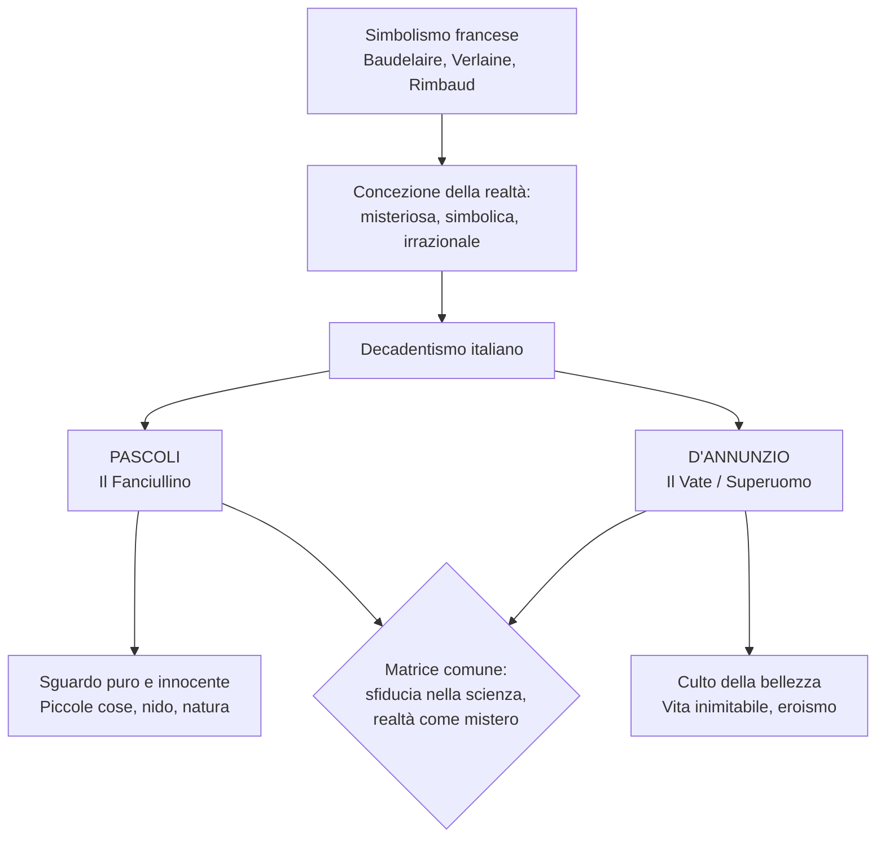
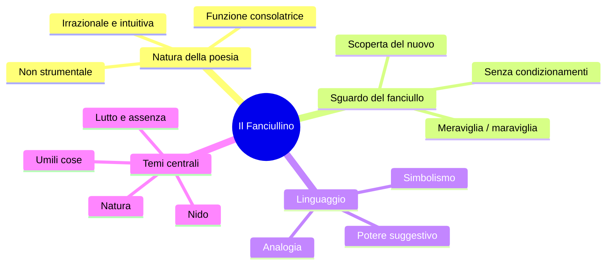
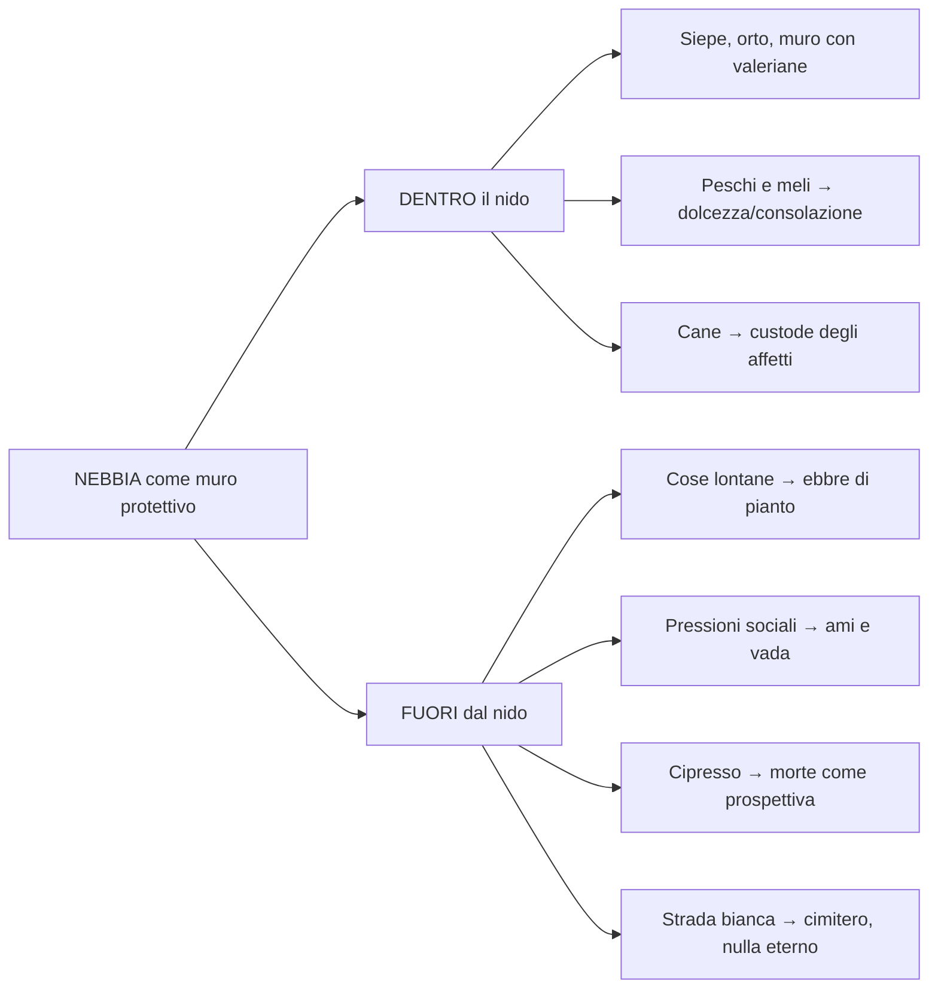
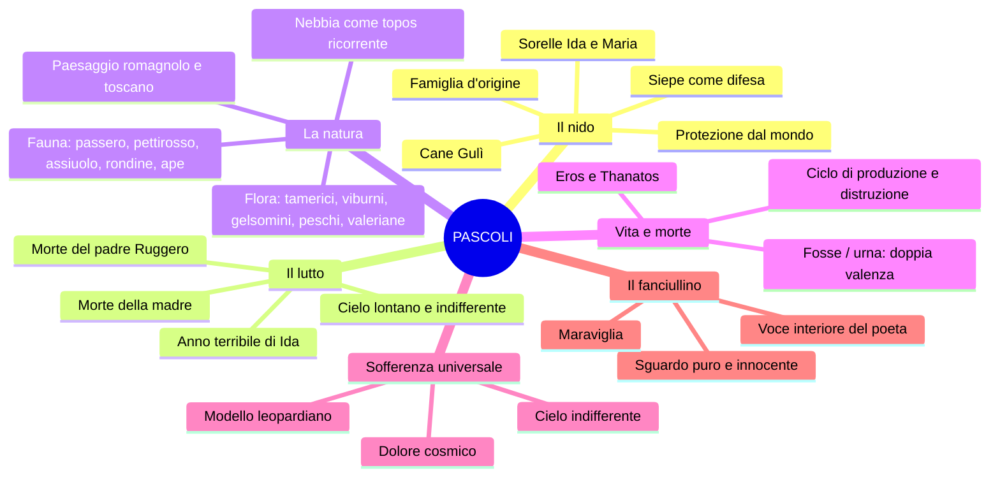
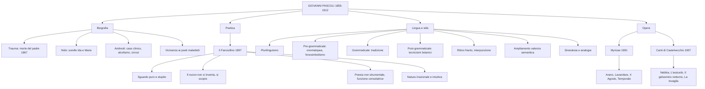

# Giovanni Pascoli — Riassunto per la maturità

---

## Date fondamentali

| Anno | Evento |
|------|--------|
| **1855** | Nasce a San Mauro di Romagna |
| **1867** | Assassinio del padre Ruggero, la notte del **10 agosto** |
| **1868** | Morte della madre Caterina Allocatelli Vincenzi |
| **1891** | Prima edizione di **Myricae** |
| **1895** | Matrimonio della sorella Ida → **"anno terribile"** |
| **1897** | Pubblica *Il Fanciullino* |
| **1902** | Acquista la casa di Castelvecchio di Barga |
| **1905** | Succede a Carducci nella cattedra di letteratura italiana a Bologna |
| **1907** | Edizione definitiva dei *Canti di Castelvecchio* |
| **6 aprile 1912** | Muore di **cirrosi epatica** (diagnosi a lungo taciuta) |

---

## 1. Il contesto: Decadentismo e ruolo del poeta

### 1.1 Dal Simbolismo francese al Decadentismo italiano

Per comprendere Pascoli occorre partire dal **Simbolismo francese** — Baudelaire, Verlaine, Rimbaud — e dalla loro concezione della realtà. Due testi di Baudelaire sono fondamentali: la prosa sulla *perdita dell'aureola* (dal *Poème en prose*), che simboleggia la perdita di sacralità del poeta nella società borghese improntata all'utile; e *L'albatro*, metafora del poeta come grande uccello maestoso in cielo ma impacciato e ridicolo sulla tolda di una nave.

Il testo chiave è *Corrispondenze*: la realtà non è indagabile razionalmente, ma è un **mistero** da decifrare attraverso simboli. La conoscenza vera passa per l'**intuizione** e l'**irrazionalità**, non per la scienza. Questa è la matrice comune del Decadentismo.

### 1.2 I due poli del Decadentismo italiano

I due maggiori rappresentanti del Decadentismo poetico italiano sono **Pascoli** e **D'Annunzio**. In apparenza agli antipodi, condividono una radice profonda: la **sfiducia nella scienza** e la convinzione che la realtà si conosca solo attraverso l'intuizione. Il poeta, come dice Rimbaud nella *Lettera del Veggente*, deve farsi **veggente** — capace di vedere ciò che l'uomo comune non vede. In Pascoli questa capacità si esplica nello sguardo puro del **fanciullino**; in D'Annunzio nel culto della bellezza e nel **superuomo** (o **vate**).

---

## 2. Biografia

### 2.1 Infanzia e trauma

Giovanni Pascoli nasce nel **1855** a **San Mauro di Romagna**. Il padre **Ruggero** era amministratore della tenuta "La Torre" dei principi Torlonia, un incarico ben remunerato. La frattura che segna in modo irreversibile il poeta arriva il **10 agosto 1867**: il padre viene **assassinato** in un agguato mentre torna dal lavoro. I colpevoli non vengono mai assicurati alla giustizia — probabilmente fu ucciso da sicari per conto di chi voleva ricoprire il suo stesso ruolo. Per il dodicenne Pascoli questo è un **trauma** nel senso etimologico: una rottura dell'esistenza. L'anno successivo muore anche la **madre**, e in rapida successione una sorella e un fratello.

### 2.2 Studi e carriera accademica

Pascoli studia dai **Padri Scolopi a Urbino**, poi frequenta il liceo a Rimini e si iscrive alla **facoltà di Lettere dell'Università di Bologna**, dove si laurea in greco. Una breve parentesi lo vede vicino al **socialismo di Andrea Costa**, per cui viene incarcerato e poi liberato. Con l'aiuto di **Giosué Carducci** — suo mentore e premio Nobel — ottiene una cattedra al **liceo di Matera**, poi a Massa. Tra il 1897 e il 1903 insegna letteratura latina all'**Università di Messina**. Nel **1905** succede a Carducci nella **cattedra di letteratura italiana a Bologna**.

### 2.3 Il nido: Castelvecchio e le sorelle

I luoghi fondamentali della sua vita sono **San Mauro** (infanzia) e **Castelvecchio di Barga** (maturità). Qui acquista nel **1902** una casa di campagna vendendo le **cinque medaglie d'oro** dei concorsi internazionali di poesia latina ad Amsterdam.

Il fatto biografico più significativo per la poetica è il tentativo di **ricostruzione del nido familiare**: Pascoli chiama a vivere con sé le sorelle **Ida** e **Maria** (soprannominata **Mariù**), cercando di ricreare la famiglia perduta. Quando nel **1895** Ida si sposa, per Pascoli è un nuovo lutto: lo definisce l'"**anno terribile**". Da quel momento vive a Castelvecchio con la sola Maria e il cane **Gulì**, vero e proprio componente della famiglia.

### 2.4 L'interpretazione di Andreoli: Pascoli come caso clinico

Lo psichiatra **Vittorino Andreoli**, nel libro *I segreti di casa Pascoli*, ha tracciato un **quadro clinico** del poeta studiandone lettere, fotografie, oggetti e indumenti. Il punto centrale è il **trauma** per la morte del padre — amplificato dalla serie di lutti familiari — e l'ipotesi dell'**alcolismo**. Dalle fotografie emerge la circonferenza dell'addome tipica di un bevitore; dagli scritti privati emerge ancora più chiaramente: in una lettera a Maria, Pascoli scrive:

> "Vado a letto quasi sempre con la **testa piena di cognac**."

Nella stessa lettera affiora il dramma del matrimonio di Ida:

> "Non sono sereno, sono disperato. **Tu mi ami da sorella, perché ti dà dispiacere che io ami una donna da amante, da sposa, da marito?**"

Pascoli affoga i dolori nell'alcol, prova sentimenti morbosi verso le sorelle, e Maria dal canto suo lo controlla quasi come un marito: aveva stabilito che le loro camere fossero adiacenti con un **filo ancorato a un dito del piede di ciascuno** per sorvegliarne gli spostamenti notturni. Andreoli definisce il cane Gulì il "**figlio di una coppia sterile**" — il perno affettivo dell'unione tra Giovanni e Mariù.

Pascoli muore il **6 aprile 1912 di cirrosi epatica** — malattia legata all'abuso di alcol, **taciuta** all'epoca per non offuscare l'immagine del poeta maestro di classicità. La diagnosi è confermata anche dal ritrovamento di **pancere** enormi nei cassetti di casa. Nonostante l'immagine ufficiale serena, Pascoli si avvicina, per le sue inquietudini interiori, ai **poeti maledetti francesi**.

---

## 3. La poetica: *Il Fanciullino*

### 3.1 L'opera e il suo significato

La poetica di Pascoli è espressa nella **prosa del 1897** intitolata *Il Fanciullino*. Alla luce della biografia, il fanciullino non è solo un concetto teorico: è un **rimpianto**, la dimensione perduta che Pascoli ricerca per tutta la vita. Per Pascoli è poeta solo chi riesce a sentire dentro di sé la voce del proprio **fanciullino interiore**: il fanciullo conosce la realtà come una **scoperta**, rimanendone meravigliato ogni volta. Questa capacità si smarrisce con l'educazione e i condizionamenti sociali. Il fanciullino pascoliano, però, non è il fanciullo vitale di Leopardi: è un **fanciullo ferito, angosciato, ripiegato su se stesso** — segnato dal lutto.

### 3.2 Passaggi fondamentali del testo

> "È dentro noi un fanciullino che non solo ha brividi, ma lagrime e ancora, ancora i gridi suoi. Quando la nostra età è tuttavia tenera, egli confonde la sua voce con la nostra."

Dentro di noi c'è un fanciullino la cui voce, quando siamo piccoli, coincide con la nostra. Ma poi cresciamo:

> "Noi accendiamo negli occhi un nuovo desiderare, ed egli vi tiene fissa la sua antica serena **maraviglia**."

Il fanciullino conserva ciò che l'adulto perde: la **meraviglia**. E la voce adulta si arrugginisce, mentre il fanciullino fa sentire il suo "**tinnulo squillo come di campanello**" — suono cristallino reso attraverso **fonosimbolismo**, **similitudine** e **allitterazione**.

Frase cruciale: **"Il nuovo non si inventa, si scopre."** Il fanciullino ha la capacità di vedere il nuovo nelle cose di tutti i giorni. Il poeta non si propone un fine pedagogico: i valori civili emergono **naturalmente** dal lasciar parlare il fanciullino, senza intenzione. La poesia non è strumento di educazione, ma ha una **funzione consolatrice**.

### 3.3 I punti cardine del Fanciullino

1. **Natura irrazionale e intuitiva della poesia** — la conoscenza poetica non è razionale ma intuitiva.
2. **Potere analogico e suggestivo** — la poesia esprime, attraverso analogie ardite, i segreti legami della realtà.
3. **La poesia come scoperta delle umili cose** — al centro ci sono le cose di tutti i giorni.
4. **Simbolismo** — la realtà è complessa, oscura, misteriosa, fatta di simboli (Baudelaire, *Corrispondenze*).
5. **Uso non strumentale della poesia** — non ha finalità educativa, solo **funzione consolatrice**.

---

## 4. Lingua e stile: la rivoluzione pascoliana

### 4.1 Pascoli fondatore della poesia del Novecento

Lo storico della lingua **Pier Vincenzo Mengaldo** riconosce in Pascoli e D'Annunzio i **fondatori della poesia del Novecento**. Il critico **Gianfranco Contini** lo definisce **"rivoluzionario nella tradizione"**: recupera modelli tradizionali ma li reinventa. È anche detto **"disintegratore della forma poetica tradizionale"**. **Pier Paolo Pasolini** scrive che Pascoli è uno degli autori che più incide sulle sperimentazioni del Novecento.

### 4.2 Il plurilinguismo

Pascoli mescola registri diversissimi:
- Un **registro basso**, familiare e colloquiale
- Un **linguaggio tecnico-settoriale** legato alla botanica e alla zoologia
- Un **linguaggio vernacolare** con inflessioni dialettali (romagnolo e toscano)
- **Termini latini** e della tradizione classica

### 4.3 Le tre categorie di Contini

**Linguaggio pre-grammaticale** — Prima della grammatica vengono i suoni inarticolati. In poesia, questi si manifestano come **onomatopee** e **fonosimbolismo**. L'onomatopea propria simula il suono ("tic tac", "don don"); l'onomatopea impropria richiama il suono nel significante ("ticchettare", "sciabordare"). Il **fonosimbolismo** è il procedimento centrale: il suono si carica di un significato simbolico. L'assiuolo emette il verso "chiù", che si chiude sulla "u" accentata evocando **angoscia e lutto**. I **viburni** del *Gelsomino notturno* sono scelti proprio per il suono cupo delle vocali "u" e "o".

**Linguaggio grammaticale** — Il linguaggio codificato dalla tradizione poetica convenzionale.

**Linguaggio post-grammaticale** — Va oltre la convenzione: tecnicismi di botanica, zoologia, agricoltura (es. "viburni", "pampano", "marra", "porche", "maggese").

### 4.4 Il ritmo franto e il linguaggio metaforico

Il verso pascoliano è spesso **franto**, spezzato: dentro l'endecasillabo tradizionale Pascoli inserisce lineette, parentesi, incidentali — inauditi nella tradizione. Una grande variabilità di segni di interpunzione (virgole, punti e virgola, puntini di sospensione) crea **sospensione e indeterminatezza**.

Il linguaggio è fortemente **metaforico** e basato sull'**ampliamento della valenza semantica**: una parola assume più significati contemporaneamente. "**Fosse**" indica sia i fossati sia le sepolture. "**Urna**" indica sia l'urna cineraria sia il calice del fiore impollinato — **Eros e Thanatos** nella stessa parola.

Due figure retoriche particolarmente ricorrenti: la **sinestesia** ("**odore di fragole rosse**": olfatto + vista, conoscenza irrazionale) e l'**analogia** (metafora ardita, oscura, in cui il legame tra i due elementi è difficile da cogliere).

---

## 5. Le raccolte poetiche

### 5.1 *Myricae* (1891)

Prima raccolta poetica, dedicata al padre Ruggero. Il titolo è un recupero virgiliano: le **tamerici** sono arbusti umili che crescono in ambienti difficili — simbolo della **poesia fatta di piccole cose**. **Temi centrali**: la natura, le umili cose, il nido, l'assenza, il lutto, i morti.

### 5.2 *Canti di Castelvecchio* (1907)

La raccolta della maturità toscana. Condivide con *Myricae* i temi principali (natura, lutto, nido) ma in una dimensione più meditativa e inquieta. La nebbia, elemento del paesaggio ricorrente in entrambe le raccolte, è tipica sia del paesaggio romagnolo sia di quello toscano.

---

## 6. Analisi delle poesie

### 6.1 *Arano* (da *Myricae*)

**Struttura**: due terzine e una quartina di endecasillabi — metro tradizionale, ma con ritmo interrotto dall'interpunzione.

**Prima terzina**: scena di vita contadina autunnale. "Dove roggio nel filare qualche pampano brilla" — **anastrofe** (inversione logica); il **pampano** è la foglia della vite, rosseggiante in autunno. La nebbia mattutina "sembra fumare" tra i cespugli. Domina il dato **visivo**.

**Seconda terzina**: "**Arano**" — il verbo senza soggetto esplicito produce **sospensione e indeterminatezza**. "A lente grida, uno le lente vacche spinge": il dato è ora **uditivo**, e l'aggettivo "lente" (grida e vacche) rimanda alla **monotonia** del lavoro. "Un ribatte le porche con sua marra pazïente": **porche** = zolle, **marra** = zappa (tecnicismi agricoli); "paziente" è concordato con la marra ma logicamente si riferisce al contadino — **enallage**. La dieresi su "pazïente" è uno iato metrico.

**Quartina finale**: il passero "**saputo**" (accorto, scaltro) gode del grano seminato. "E il pettirosso: nelle siepi s'ode / il suo sottil tintinno come d'oro" — **allitterazione** (s-s-s), **onomatopea** ("tintinno"), **sinestesia** ("come d'oro": uditivo + visivo). La poesia si chiude con un'apertura luminosa e speranzosa.

---

### 6.2 *Lavandare* (da *Myricae*)

**Struttura**: due terzine e una quartina — forma del **madrigale**, legata alla poesia popolare.

**Prima terzina**: un campo "mezzo grigio e mezzo nero" con "un aratro senza buoi, che pare dimenticato". L'aratro solo esprime **solitudine**; la nebbia sfuma i contorni. La **nebbia** è topos pascoliano con valenza doppia: muro protettivo ma anche ostacolo all'uscita dall'isolamento.

**Seconda terzina**: domina il dato **uditivo**. "Lo **sciabordare** delle lavandare" (onomatopea) con "tonfi spessi e lunghe cantilene" — gesto che si ripete monotono, cadenzato. C'è anche una **rima interna** (sciabordare/lavandare).

**Quartina**: il canto popolare che accompagna il lavoro. "Il vento soffia e nevica la frasca" — "nevica" usato transitivamente (licenza poetica); "don don" è l'onomatopea della campanella. "E tu non torni ancora al tuo paese" — malinconia per un abbandono. Struttura **circolare**: si chiude sull'immagine dell'aratro. La **maggese** è il terreno lasciato incolto per rigenerarsi — simbolo estremo di solitudine e abbandono interiore.

---

### 6.3 *X Agosto* (da *Myricae*)

Il **10 agosto** è la data dell'assassinio del padre Ruggero — la notte di San Lorenzo, delle stelle cadenti. La poesia costruisce un **parallelismo simmetrico** tra la rondine che torna al tetto e il padre che torna al nido.

**Prima strofa**: apostrofe a San Lorenzo. "Tanto di stelle" — "tanto" come sostantivo astratto con "di stelle" partitivo esprime **vastità cosmica**. Le stelle cadenti sono le **lacrime del cielo**.

**Seconda strofa**: "Ritornava una rondine al **tetto**" — non "nido", per uno scambio simbolico con la strofa del padre. "L'uccisero: cadde tra spini": le spine rimandano alla **Passione di Cristo**. Ella aveva "la cena dei suoi rondinini": **personificazione** della rondine attraverso la parola "cena".

**Terza strofa**: "Ora è là, come in **croce**" — dimensione **cristologica** del sacrificio. "Che tende quel verme a quel **cielo lontano**": il cielo è irraggiungibile, le preghiere rimangono inascoltate. "Pigola sempre più piano" — **onomatopea** e **allitterazione**; i rondinini stanno morendo.

**Quarta strofa**: "Anche un uomo tornava al suo **nido**" — scambio compiuto: della rondine si dice "tetto", del padre "nido". "Disse: Perdono" — ultima parola del padre verso l'assassino sconosciuto. "E restò negli aperti occhi un grido" — **sinestesia** (dato uditivo + visivo). "Portava due bambole in dono..." — i puntini sono **reticenza**, non si dice tutto il dolore della disgregazione familiare.

**Quinta e sesta strofa**: "lo aspettano, aspettano invano" — **chiasmo**. Il padre "attonito addita le bambole al cielo lontano". L'apostrofe finale: "E tu, **Cielo**" (C maiuscola = personificazione/Dio). La Terra è un "**atomo opaco del male**" — **perifrasi** che ne configura la piccolezza e la sofferenza. Struttura **circolare**: le stelle-lacrime tornano dalla prima strofa. Il tema è la **sofferenza universale** di animali e uomini — vicina a Leopardi e *La Ginestra*.

---

### 6.4 *Nebbia* (dai *Canti di Castelvecchio*)

Il testo è una **invocazione alla nebbia** perché crei un muro protettivo intorno a una dimensione domestica. Cinque strofe dalla struttura identica, con l'anafora "Nascondi le cose lontane" a ogni inizio.

**Prima strofa**: "tu, nebbia **impalpabile** e **scialba**" — sinonimia di aggettivi che rimandano all'indefinito. La nebbia è associata al fumo che si alza sull'alba.

**Seconda strofa**: "Nascondimi quello ch'è morto" — **poliptoto** (da "nascondi" a "nascondimi"). La **siepe** dell'orto — parola leopardiana — qui ha significato opposto: non apre all'infinito ma **protegge**, delimita lo spazio del nido. Le valeriane (pianta associata al sonno) crescono nelle crepe del muro — l'unica pace è in questo fazzoletto di terra.

**Terza strofa**: "le cose son **ebbre di pianto**" — tutto fuori dal nido è impregnato di dolore. "I due peschi, i due meli" danno "soave lor miele pel **nero** mio pane" — **antitesi** tra dolcezza/consolazione del nido e fatica/angoscia interiore.

**Quarta strofa**: "le cose lontane che vogliono ch'ami e che vada!" — le pressioni esterne chiedono al poeta di costruirsi una vita diversa. "Quel bianco di strada che un giorno ho da fare tra stanco **don don** di campane" — la strada bianca che conduce al **cimitero**; "don don" è **onomatopea propria** delle campane a morto.

**Quinta strofa**: "involale al volo del cuore!" — rubare al desiderio del cuore. Il **cipresso** in lontananza è la prospettiva sulla morte; il **cane** che sonnecchia è il custode degli affetti familiari. Qui ritroviamo tutta la poetica pascoliana.

---

### 6.5 *Temporale* (da *Myricae*)

Brevissima poesia di sette versi. Si apre con "Un **bubbolìo** lontano..." — **onomatopea** del tuono + puntini di sospensione. Domina il dato **visivo-cromatico**: l'orizzonte rosseggia verso il mare, "nero di pece" verso i monti, con "stracci di nubi chiare". La chiusa è folgorante: "tra il nero un casolare: / **bianco**." Il casolare bianco che emerge dal nero del temporale è un'**analogia** potente — il **nido** che resiste, piccolo e fragile, nella tempesta del mondo. Struttura **impressionistica**: immagini giustaposte, senza verbi, come pennellate su una tela.

---

### 6.6 *L'assiuolo* (dai *Canti di Castelvecchio*)

Una delle poesie più rappresentative del **fonosimbolismo** pascoliano. L'assiuolo è un rapace notturno il cui verso — **"chiù"** — si ripete alla fine di ogni strofa come un ritornello che si carica progressivamente di significato.

Il paesaggio è **notturno** e indefinito: la luna assente, il cielo che "notava in un'alba di perla", la "nebbia di latte". La poesia procede per percezioni sensoriali: visive (stelle rare, vette lucide), uditive (frusciare del mare, fruscìo tra le fratte, "finissimi sistri d'argento" delle cavallette), tattili (soffi di lampi).

Il verso "chiù" — che si chiude sulla "u" accentata — evoca **angoscia e lutto**. Nella prima strofa è "una voce dai campi"; nella seconda si associa a un battito misterioso; nella terza "crebbe la voce — tremula, stridula". Diventa progressivamente il **simbolo dell'angoscia** per la perdita del padre.

Figure retoriche fittissime: **sinestesie** ("soffi di lampi", "nebbia di latte"), **onomatopee** ("chiù", "frusciare", "tintinni", "squilli"), **allitterazioni** ("tremava, tremulo, trepido, tremiti"), **analogie** ("finissimi sistri d'argento" per il frinire delle cavallette). La parentetica "(tintinni a tremiti, squilli / a singhiozzi)" è esempio perfetto di **ritmo franto**.

---

### 6.7 *Il gelsomino notturno* (dai *Canti di Castelvecchio*)

Poesia densa e stratificata, costruita sull'**ampliamento della valenza semantica** e sull'intreccio tra **Eros e Thanatos**. Composta per le nozze di un amico, allude attraverso il linguaggio della natura alla **notte nuziale** e al concepimento, intrecciandosi con la dimensione della **morte**.

I **viburni** (scelti per il suono cupo delle vocali "u" e "o") collocano la scena in un'atmosfera notturna. "Nell'ora che penso a' miei cari": i cari sono i **morti**. La **sinestesia** celeberrima "**odore di fragole rosse**" associa olfatto e vista in una conoscenza irrazionale.

"Nasce l'erba sopra le **fosse**": le fosse sono sia fossati sia sepolture — vita e morte coesistono. L'"**urna**" finale è sia l'urna cineraria sia il calice del fiore impollinato. "Non so che felicità nuova" allude alla vita concepita nella notte nuziale.

La "Chioccetta per l'aia azzurra / va col suo pigolio di stelle" è un'**analogia** complessa: la Chioccetta è la costellazione delle Pleiadi, l'aia azzurra è il cielo, il pigolio di stelle è lo scintillio. L'ape tardiva che "trova già prese le celle" è chi arriva tardi e non trova più posto — come il poeta stesso, escluso dalla dimensione dell'amore.

---

## 7. Temi ricorrenti e confronti

### 7.1 Mappa tematica

### 7.2 Confronto Pascoli-Leopardi

Pascoli ha con Leopardi un rapporto complesso, fatto di riprese e rovesciamenti:
- La **siepe**: in Leopardi (*L'Infinito*) consente l'immaginazione e l'infinito; in Pascoli (*Nebbia*) è protezione dal mondo, limite voluto.
- Il **cielo indifferente**: in Leopardi la Luna è interlocutrice muta; in Pascoli il Cielo è lontano e irraggiungibile.
- La **sofferenza universale**: in Leopardi (*La Ginestra*) accomuna tutti gli esseri; in Pascoli (*X Agosto*) animali e uomini soffrono nello stesso "atomo opaco del male".
- Il **ciclo vita-morte**: in Leopardi è il materialismo della natura; in Pascoli è l'"erba che nasce sopra le fosse", l'urna insieme cineraria e calice fecondato.
- L'**assenza di consolazione ultraterrena**: per entrambi la morte è un nulla eterno; nessuna fede in un ricongiungimento.

### 7.3 Confronto Pascoli-D'Annunzio

| Aspetto | Pascoli | D'Annunzio |
|---------|---------|------------|
| **Ruolo del poeta** | Fanciullino interiore | Vate / Superuomo |
| **Sguardo sulla realtà** | Puro, innocente, stupito | Eroico, estetico, dominante |
| **Temi** | Piccole cose, nido, lutto, natura | Bellezza, amore, azione, eroismo |
| **Vita** | Ritirata, domestica, dolorosa | Inimitabile, mondana, avventurosa |
| **Matrice comune** | Sfiducia nella scienza, realtà come mistero, irrazionalismo |
| **Ruolo storico** | Entrambi: fondatori della poesia del Novecento (Mengaldo) |

### 7.4 Pascoli e il Simbolismo francese

La matrice simbolista emerge in diversi aspetti:
- La **musica del verso**: come teorizzato da Verlaine ("la musica prima di ogni cosa"), le poesie di Pascoli sono pensate per essere lette ad alta voce, con una fitta trama fonetica.
- La **realtà come mistero**: la concezione baudelairiana delle *Corrispondenze* è alla base di tutta la poetica pascoliana.
- La **conoscenza irrazionale**: la sinestesia, l'analogia ardita, il fonosimbolismo rifiutano la razionalità.

---

## 8. Riepilogo finale

