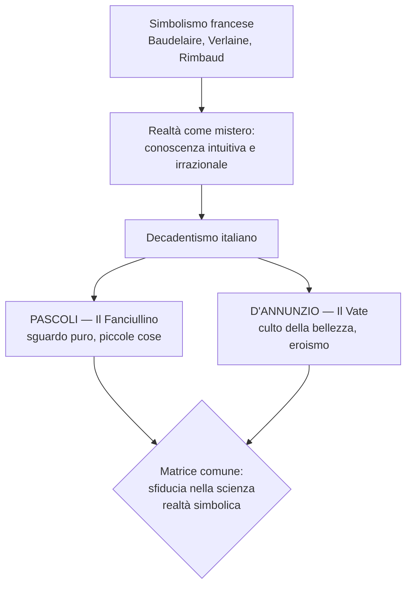
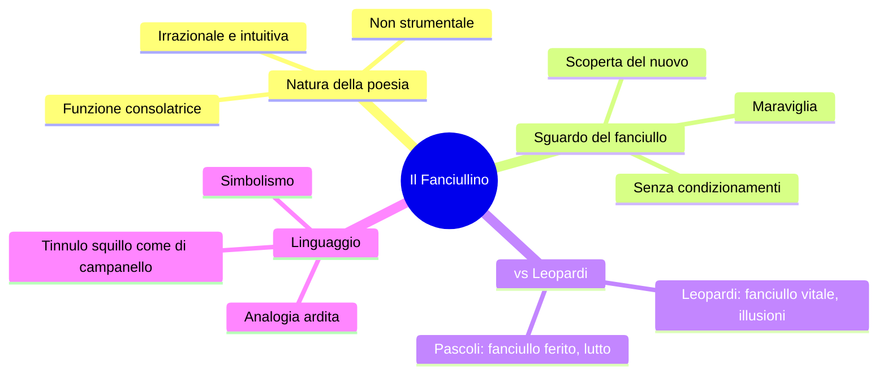
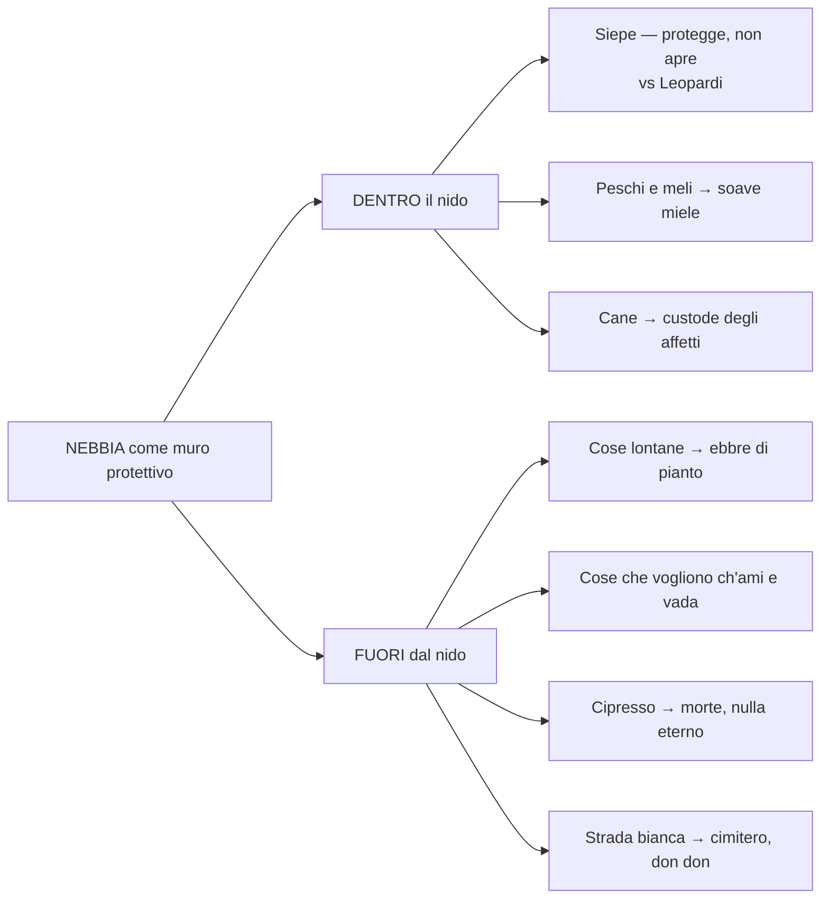
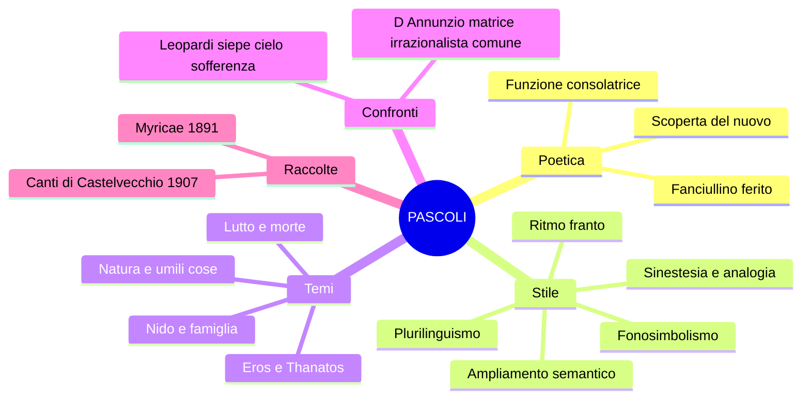

# Giovanni Pascoli — Riassunto

---

## Date fondamentali

| Anno | Evento |
|------|--------|
| **1855** | Nasce a San Mauro di Romagna (oggi San Mauro Pascoli) |
| **1867** | Assassinio del padre Ruggero, notte del 10 agosto (San Lorenzo) |
| **1868** | Morte della madre Caterina Allocatelli Vincenzi |
| **Anni successivi** | Muoiono anche una sorella e un fratello |
| **1891** | Prima edizione di *Myricae* (dedicata al padre) |
| **1895** | Matrimonio della sorella Ida → "anno terribile" |
| **1897** | Pubblica *Il Fanciullino* |
| **1902** | Acquista la casa di Castelvecchio di Barga (vendendo 5 medaglie d'oro) |
| **1905** | Succede a Carducci alla cattedra di Bologna |
| **1907** | Edizione definitiva dei *Canti di Castelvecchio* |
| **6 aprile 1912** | Muore di cirrosi epatica (diagnosi taciuta) |

---

## 1. Il contesto: Decadentismo e ruolo del poeta

Per comprendere Pascoli occorre partire dal **Decadentismo italiano**, che trae le proprie radici dal **Simbolismo francese** di Baudelaire, Verlaine e Rimbaud. La concezione di fondo è che la realtà non sia indagabile razionalmente, ma sia un **mistero** fatto di simboli da decifrare attraverso l'**intuizione** e l'**irrazionalità** — non attraverso la scienza. I due maggiori rappresentanti del Decadentismo poetico italiano sono **Giovanni Pascoli** e **Gabriele D'Annunzio**. Nella vulgata appaiono come personaggi agli antipodi, ma condividono una radice profonda: la sfiducia nella scienza e la convinzione che il poeta debba farsi **veggente** (come dice Rimbaud nella *Lettera del Veggente*) — capace di vedere ciò che l'uomo comune non vede. In Pascoli questa capacità visionaria si esplica attraverso lo sguardo puro del **fanciullino**; in D'Annunzio attraverso il culto della bellezza e la personalità straordinaria del **vate/superuomo**.

> [!note] Dalla lezione
> La professoressa definisce D'Annunzio "il primo influencer della storia": poeta-soldato che occupò Fiume con un esercito, fondò la Reggenza del Carnaro, ebbe innumerevoli relazioni amorose (la più celebre con l'attrice **Eleonora Duse**). D'Annunzio scrisse di Pascoli: "Giovanni Pascoli è il più grande e originale poeta apparso in Italia dopo il Petrarca."

---

## 2. Biografia

### 2.1 Infanzia e trauma: la notte di San Lorenzo

Giovanni Pascoli nasce nel **1855** a **San Mauro di Romagna** (oggi San Mauro Pascoli), tra Cesenatico e Rimini. Il padre, **Ruggero Pascoli**, era **amministratore della tenuta "La Torre"** dei principi Torlonia — un incarico ben remunerato e dunque invidiato in una Romagna violenta, di banditi e fuorilegge.

La frattura che segna in modo irreversibile l'esistenza del poeta arriva il **10 agosto 1867**: il padre viene **assassinato** in un agguato durante la notte di San Lorenzo, mentre torna a casa dal lavoro. I colpevoli non vengono mai assicurati alla giustizia — probabilmente sicari inviati da chi voleva il suo posto. Per il poeta dodicenne questo fatto rappresenta un **trauma** nel senso etimologico: una frattura irreparabile. L'anno successivo muore anche la **madre** Caterina Allocatelli Vincenzi; in rapida successione se ne vanno anche una sorella e un fratello. Questa sequenza di lutti ravvicinati è la chiave interpretativa di tutta la sua opera.

### 2.2 Studi, carriera e traiettoria politica

Pascoli studia prima presso i **Padri Scolopi a Urbino**, poi si iscrive alla **facoltà di Lettere dell'Università di Bologna**, dove si laurea in greco. Una breve parentesi lo vede vicino al **socialismo** di **Andrea Costa**, per cui viene incarcerato e poi liberato; ma la partecipazione attiva si esaurisce qui. Con l'interessamento di **Giosué Carducci** ottiene cattedre al liceo di Matera, poi a Massa; tra il 1897 e il 1903 insegna all'**Università di Messina**; nel **1905** succede al maestro Carducci nella **cattedra di letteratura italiana all'Università di Bologna**. La traiettoria politica compie un'evoluzione significativa: dal socialismo giovanile a posizioni sempre più **nazionaliste**, culminate nel discorso *La grande proletaria si è mossa* (1911) a sostegno della guerra di Libia — la nazione come grande nido collettivo da proteggere.

### 2.3 Il nido: le sorelle e l'"anno terribile"

I luoghi fondamentali della vita di Pascoli sono **San Mauro** (infanzia) e **Castelvecchio di Barga** (maturità, vicino a Lucca), dove nel 1902 acquista una casa vendendo le **cinque medaglie d'oro** conquistate ai concorsi internazionali di poesia latina. Il fatto biografico più significativo per la comprensione della poetica è il tentativo di **ricostruzione del nido familiare**: Pascoli chiama a vivere con sé le sorelle **Ida** e **Maria (Mariù)**, cercando di ricreare la famiglia d'origine. La critica individua nella sorella Ida una proiezione della figura materna. Quando nel **1895** Ida si sposa e lascia il nucleo, per Pascoli è l'"**anno terribile**": il nido si disgrega di nuovo. Da quel momento vive a Castelvecchio con la sola **Maria** e il cane **Gulì** — una resistenza al cambiamento, al mondo esterno, alla possibilità di costruirsi una famiglia propria.

### 2.4 L'interpretazione di Andreoli: il caso clinico

Lo psichiatra **Vittorino Andreoli** ha dedicato a Pascoli il libro ***I segreti di casa Pascoli. Il poeta e lo psichiatra***, affrontando la sua vita come un **caso clinico** — studiando scritti privati, fotografie, oggetti e documenti ospedalieri. Andreoli individua il **trauma** per la morte del padre come elemento fondante, amplificato dalla successione dei lutti; poi avanza l'ipotesi dell'**alcolismo**, basandosi sulla corporatura visibile nelle fotografie e su lettere private come questa, indirizzata a Maria:

> "Vado a letto quasi sempre con la **testa piena di cognac**."

E ancora, nell'anno terribile del matrimonio di Ida:

> "Non sono sereno, sono disperato. [...] dimmi Mariù: **tu mi ami da sorella, perché ti dà dispiacere che io ami una donna da amante, da sposa, da marito?**"

Emerge un Pascoli che affoga i dolori nell'alcol, con sentimenti morbosi verso le sorelle, mentre Mariù esercita una **gelosia ossessiva** sul fratello.

> [!note] Dalla lezione
> La prof racconta un dettaglio inquietante: Maria aveva stabilito che le camere da letto sua e di Giovanni fossero adiacenti e di mettere, ogni volta che si coricavano, un **filo ancorato a un dito del piede di ciascuno** per verificare che non ci fossero spostamenti notturni. Andreoli parla del cane Gulì come del **"figlio di una coppia sterile"**: a livello psichico, il cane è il perno dell'unione affettiva tra Giovanni e Mariù.

La diagnosi di morte fu **cirrosi epatica** — malattia del fegato legata all'abuso di alcol. Questo fu **taciuto** all'epoca per non rovinare l'immagine del poeta maestro di classicità; è confermato dal ritrovamento di **pancere enormi** nei cassetti di casa. La rivalutazione critica a partire dagli anni '50 ha avvicinato Pascoli ai **poeti maledetti francesi** per profondità delle inquietudini interiori, nonostante la diversissima immagine ufficiale.

---

## 3. La poetica: *Il Fanciullino*

### 3.1 Il testo e il suo significato

La poetica di Pascoli è espressa nella **prosa del 1897** intitolata ***Il Fanciullino***, dialogo tra il poeta adulto e la sua anima di fanciullo. Alla luce della biografia, il fanciullino non è solo un concetto teorico: è un **rimpianto**, la dimensione perduta che Pascoli ricerca per tutta la vita. Per lui è poeta solo chi riesce a sentire la voce del proprio **fanciullino interiore**: il fanciullo conosce la realtà come una **scoperta**, meravigliandosene ogni volta, senza condizionamenti. Il fanciullino di Pascoli non è però il fanciullo vitale di Leopardi: è un **fanciullo ferito**, angosciato, ripiegato su se stesso — segnato dal lutto.

### 3.2 Lettura commentata

> "È dentro noi un fanciullino che non solo ha brividi, ma lagrime e ancora, ancora i gridi suoi. Quando la nostra età è tuttavia tenera, egli confonde la sua voce con la nostra [...] si sente un palpito solo, uno strillare e un guarire solo."

> "Noi accendiamo negli occhi un nuovo desiderare, ed egli vi tiene fissa la sua antica serena **maraviglia**."

> "Noi ingrossiamo e arrugginiamo la voce, ed egli fa sentire tuttavia e sempre il suo **tinnulo squillo** come di campanello."

L'adulto ingrossa e arrugginisce la voce; il fanciullino fa sentire un tinnulo squillo limpido e cristallino. Le parole sono **onomatopeiche** nel suono; c'è una **similitudine** e un'**allitterazione** ("tinnulo squillo campanello"). Questo è **fonosimbolismo**: il suono si carica di un significato simbolico. Il nuovo, secondo il *Fanciullino*, **"non si inventa, si scopre"**: il fanciullino vede il nuovo nelle cose di tutti i giorni. Il poeta non si propone fini pedagogici — la poesia ha soltanto una **funzione consolatrice** — ma i valori civili emergono naturalmente quando si lascia parlare il fanciullino.

Il confronto con **Leopardi** è strutturale: entrambi identificano nel fanciullo una conoscenza speciale, ma in Leopardi il fanciullo guarda avanti con meraviglia e speranza (le illusioni come valore positivo); in Pascoli il fanciullino è **ferito** e guarda indietro con dolore — la maraviglia è intrecciata all'angoscia.

---

## 4. Lingua e stile: la rivoluzione pascoliana

**Pier Vincenzo Mengaldo** riconosce in Pascoli e D'Annunzio i **fondatori della poesia del Novecento**. **Gianfranco Contini** lo definisce "**rivoluzionario nella tradizione**" e teorizza tre categorie per il suo linguaggio:

Il **linguaggio pre-grammaticale** è il linguaggio del fanciullino, quello che viene prima della grammatica: **onomatopee proprie** ("chiù", "don don", "tin tin") e **improprie** ("sciabordare", "ticchettare"), e soprattutto il **fonosimbolismo** — il suono della parola si carica di un significato simbolico. Il verso "chiù" dell'assiuolo, con la sua "u" scura e accentata, evoca angoscia e lutto. I "viburni" del *Gelsomino notturno* sono scelti per le loro vocali cupe, evocatrici di oscurità e mistero.

> [!note] Dalla lezione — Fonosimbolismo
> La prof spiega il fonosimbolismo con il verso "chiù" dell'assiuolo: in classe viene fatto sentire il verso del rapace notturno. Il suono si chiude sulla "u" accentata e scura, evocando un'idea di angoscia e lutto. Nella poesia, "chiù" diventa **simbolo dell'angoscia** per la perdita del padre. Stesso meccanismo per i **viburni**: il nome botanico è scelto per il suono, non per l'immagine.

Il **linguaggio grammaticale** è quello della tradizione poetica codificata. Il **linguaggio post-grammaticale** va oltre la norma: è il linguaggio specialistico, i tecnicismi della botanica, della zoologia, dell'agricoltura — "pampano", "marra", "porche", "maggese", "viburni".

Il **plurilinguismo** mescola registro basso/colloquiale, tecnicismi, vernacolare romagnolo e toscano, termini latini — una compresenza inaudita nella tradizione.

Il **ritmo franto** è un'altra novità radicale: dentro l'endecasillabo tradizionale Pascoli inserisce lineette, parentesi, incidentali — mai viste in Petrarca o Leopardi. La frequenza dei segni di interpunzione crea pause brevi e lunghe alternate, un senso di **sospensione e indeterminatezza**.

L'**ampliamento della valenza semantica** consente a una parola di assumere più significati simultaneamente: "**fosse**" indica sia i fossati sia le sepolture; "**urna**" è sia cineraria sia calice del fiore impollinato. Vita e morte coesistono nella stessa parola — **Eros e Thanatos**. La **sinestesia** associa sfere sensoriali diverse ("odore di fragole rosse", olfatto + vista). L'**analogia** è una metafora ardita il cui legame tra elementi è oscuro da decifrare — consente di esprimere i segreti legami della realtà.

---

## 5. Le raccolte poetiche

*Myricae* (1891) è la prima raccolta, dedicata al padre Ruggero. Il titolo è un recupero virgiliano: le **tamerici** sono arbusti umili che crescono in ambienti difficili, simbolo della poesia fatta di piccole cose. Temi centrali: **natura**, **umili cose**, **nido**, **assenza**, **lutto**, **morti**.

I *Canti di Castelvecchio* (edizione definitiva 1907) sono legati alla maturità toscana. Condividono con *Myricae* i temi fondamentali ma in una dimensione più meditativa e inquieta. La **nebbia** ricorre in entrambe — tipica di entrambi i paesaggi vissuti da Pascoli — e si carica di significati opposti: muro protettivo e, insieme, ostacolo che impedisce di uscire dall'isolamento.

---

## 6. Analisi delle poesie

### *Arano* (da *Myricae*)

> Al campo, dove roggio nel filare
> qualche pampano brilla, e dalle fratte
> sembra la nebbia mattinal fumare,
>
> arano: a lente grida, uno le lente
> vacche spinge; altri semina; un ribatte
> le porche con sua marra pazïente;
>
> ché il passero saputo in cor già gode,
> e tutto spia dai rami irti del moro;
> e il pettirosso: nelle siepi s'ode
> il suo sottil tintinno come d'oro.

Due terzine e una quartina di endecasillabi. La prima terzina dipinge una scena di vita contadina autunnale in chiave **visiva**: il campo con pampani rosseggianti e nebbia mattutina. "Roggio" (aggettivo del pampano) è anticipato in **anastrofe**. L'atmosfera è **indeterminata**, sfumata.

La seconda terzina introduce il lavoro: "**arano**" senza soggetti esplicitati — sospensione. I soggetti emergono frammentati dopo. "A lente grida, uno le lente vacche spinge": l'aggettivo **"lente"** ripetuto evoca la **monotonia**. "Marra pazïente" è un'**enallage** — paziente si riferisce al contadino, non alla zappa; la **dieresi** su "pazïente" mantiene l'endecasillabo.

La quartina finale porta il dato **uditivo**: il passero "saputo" (avveduto) che gode per la semina; "sottil tintinno come d'oro" — **allitterazione** + **onomatopea** ("tintinno") + **sinestesia** (suono + colore dell'oro). La chiusura è solare e speranzosa, in contrasto con l'indeterminatezza nebbiosa dell'apertura.

---

### *Lavandare* (da *Myricae*)

> Nel campo mezzo grigio e mezzo nero
> resta un aratro senza buoi, che pare
> dimenticato, tra il vapor leggero.
>
> E cadenzato dalla gora viene
> lo sciabordare delle lavandare
> con tonfi spessi e lunghe cantilene.
>
> Il vento soffia e nevica la frasca,
> e tu non torni ancora al tuo paese!
> quando partisti, come son rimasta!
> come l'aratro in mezzo alla maggese.

**Madrigale** (due terzine + quartina), forma della poesia popolare. La prima terzina è **visiva**: campo grigio e nero, aratro abbandonato nella nebbia — solitudine e indeterminatezza. La seconda è **uditiva**: "sciabordare" (onomatopea per i panni lavati) e "tonfi" evocano la fatica e la monotonia del lavoro che si ripete. I due punti introducono il canto popolare delle lavandaie: un amore lontano, una persona che non torna. "Come l'aratro in mezzo alla **maggese**" (terreno incolto nella rotazione triennale) chiude con una **struttura circolare**: l'aratro diventa simbolo di solitudine e abbandono interiore.

---

### *X Agosto* (da *Myricae*)

> San Lorenzo, io lo so perché tanto
> di stelle per l'aria tranquilla
> arde e cade, perché sì gran pianto
> nel concavo cielo sfavilla.
>
> Ritornava una rondine al tetto:
> l'uccisero: cadde tra spini:
> ella aveva nel becco un insetto:
> la cena dei suoi rondinini.
>
> Ora è là, come in croce, che tende
> quel verme a quel cielo lontano;
> e il suo nido è nell'ombra, che attende,
> che pigola sempre più piano.
>
> Anche un uomo tornava al suo nido:
> l'uccisero: disse: Perdono;
> e restò negli aperti occhi un grido:
> portava due bambole in dono...
>
> Ora là, nella casa romita,
> lo aspettano, aspettano in vano:
> egli immobile, attonito, addita
> le bambole al cielo lontano.
>
> E tu, Cielo, dall'alto dei mondi
> sereni, infinito, immortale,
> oh! d'un pianto di stelle lo inondi
> quest'atomo opaco del male!

Il **10 agosto** è la data dell'assassinio del padre Ruggero; la notte di **San Lorenzo** è quella delle stelle cadenti. La poesia costruisce un **parallelismo simmetrico** tra la rondine che torna al tetto e il padre che torna al nido — destini incrociati con scambio deliberato: della rondine si dice "tetto" (metonimia per casa), del padre si dice "nido".

Nella prima strofa il poeta si rivolge a San Lorenzo in **apostrofe**. "Tanto di stelle" — non "tante stelle" ma "tanto di stelle", dove "tanto" è sostantivo astratto con complemento partitivo: esprime una **vastità cosmica**. Le stelle cadenti sono il **pianto del cielo**. "Cadde tra spini": le spine rimandano alla **Passione di Cristo**, sacrificio innocente. "Pigola sempre più piano": i rondinini stanno morendo; "pigola" è onomatopea, "pigola più piano" è allitterazione.

"L'uccisero: disse: Perdono": Pascoli immagina che le ultime parole del padre siano state il perdono. "Restò negli aperti occhi un grido" è una **sinestesia** potentissima — un suono percepito nella visione. "Portava due bambole in dono...": i puntini di sospensione sono **reticenza**, il dolore non si può dire tutto. "Quest'**atomo opaco del male**" è una **perifrasi** per la Terra — piccola, priva di luce, regno del dolore. La struttura è **circolare** (stelle → pianto → stelle). Il tema è la **sofferenza universale** che accomuna tutti gli esseri, sul modello di Leopardi e *La Ginestra*.

> [!note] Dalla lezione
> La prof definisce *X Agosto* "una delle poesie più costruite di Pascoli — non è la mia preferita, perché è tutta elaborata e organizzata in modo molto preciso sulla simmetria."

---

### *Temporale* (da *Myricae*)

> Un bubbolìo lontano...
> Rosseggia l'orizzonte,
> come affocato, a mare;
> nero di pece, a monte,
> stracci di nubi chiare:
> tra il nero un casolare:
> bianco.

Sette versi impressionistici. "Bubbolìo" è **onomatopea** del rombo lontano del tuono; i puntini creano sospensione. La poesia procede per immagini giustapposte, senza verbi nella parte centrale, come pennellate di un quadro. Domina il contrasto cromatico: rosso all'orizzonte, nero di pece verso i monti, stracci di nubi chiare. La chiusa è folgorante: "tra il nero un casolare: / **bianco**." Il casolare bianco che emerge dal nero è un'**analogia** potente — il **nido** familiare che resiste, piccolo e fragile, nella tempesta del mondo.

---

### *L'assiuolo* (dai *Canti di Castelvecchio*)

> Dov'era la luna? ché il cielo
> notava in un'alba di perla,
> ed ergersi il mandorlo e il melo
> pareva a cercarla.
>
> Venivano soffi di lampi
> da un nero di nubi laggiù;
> veniva una voce dai campi:
> chiù...
>
> Le stelle lucevano rare
> tra mezzo alla nebbia di latte:
> sentivo il frusciare del mare,
> sentivo un fruscìo tra le fratte;
> e intanto sentivo non so che trepido battere, tremulo, a me,
> come un cuore
> che dopo molto, molto, si schiuse,
> là in fondo al cuore,
> una voce dai campi:
> chiù...
>
> Su tutte le lucide vette
> tremava un sospiro di vento;
> squassavano le cavallette
> finissimi sistri d'argento
> (tintinni a tremiti, squilli
> a singhiozzi) —
> e là, tremula, stridula, crebbe
> la voce dai campi:
> chiù...

*L'assiuolo* è la poesia più rappresentativa del **fonosimbolismo** pascoliano. Il verso "**chiù**" del rapace notturno — che si chiude sulla "u" accentata e scura — viene ripetuto alla fine di ogni strofa come un ritornello che si carica progressivamente di angoscia. Nella prima strofa è appena "una voce dai campi"; nella seconda si associa a un misterioso battito interiore; nella terza "crebbe la voce" — "tremula, stridula". Il verso dell'assiuolo diventa il **simbolo dell'angoscia** del poeta per la perdita del padre.

Il paesaggio è **notturno** e indefinito: la luna assente, il cielo che "notava in un'alba di perla", la "nebbia di latte". Percezioni sensoriali stratificate: visive (stelle rare, vette lucide), uditive (frusciare del mare, fruscìo tra le fratte, "finissimi sistri d'argento" delle cavallette). Le figure retoriche sono fittissime: **sinestesie** ("soffi di lampi", "nebbia di latte"), **onomatopee** ("chiù", "frusciare", "tintinni", "squilli"), **allitterazioni** pervasive ("tremava, tremulo, trepido, tremiti"), **analogia** ("finissimi sistri d'argento" per il frinire delle cavallette). La parentetica "(tintinni a tremiti, squilli / a singhiozzi)" esemplifica il **ritmo franto** — lineette e parentesi all'interno del verso che spezzano l'andamento metrico.

---

### *Il gelsomino notturno* (dai *Canti di Castelvecchio*)

> E s'aprono i fiori notturni,
> nell'ora che penso a' miei cari.
> Sono apparse in mezzo ai viburni
> le farfalle crepuscolari.
>
> Da un pezzo si tacquero i gridi:
> là sola una casa bisbiglia.
> Sotto l'ali dormono i nidi,
> come gli occhi sotto le ciglia.
>
> Dai calici aperti si esala
> l'odore di fragole rosse.
> Splende un lume là nella sala.
> Nasce l'erba sopra le fosse.
>
> Un'ape tardiva sussurra
> trovando già prese le celle.
> La Chioccetta per l'aia azzurra
> va col suo pigolio di stelle.
>
> Per tutta la notte s'esala
> l'odore che passa col vento.
> Passa il lume su per la scala;
> brilla al primo piano: s'è spento...
>
> È l'alba: si chiudono i petali
> un poco gualciti; si cova,
> dentro l'urna molle e segreta,
> non so che felicità nuova.

Composta per le nozze di un amico, *Il gelsomino notturno* allude attraverso il linguaggio della natura alla **notte nuziale** e al concepimento di una nuova vita — ma questo tema è costantemente intrecciato con la morte. I **viburni** (arbusti dalle infiorescenze bianche) sono scelti per il suono cupo delle vocali "u" e "o", evocatrici di oscurità. "Nell'ora che penso a' miei cari": i cari sono i **morti**. La **sinestesia** celeberrima "**odore di fragole rosse**" unisce olfatto e vista in una conoscenza irrazionale.

Il verso chiave è "nasce l'erba sopra le **fosse**": le fosse sono sia i fossati (letterale) sia le sepolture (simbolico). Vita e morte coesistono. L'"**urna**" dell'ultima strofa è sia cineraria sia calice del fiore impollinato — **Eros e Thanatos** nella stessa parola. "Non so che felicità nuova" è la nuova vita concepita nel buio. La "Chioccetta per l'aia azzurra" è le Pleiadi nel cielo; l'ape tardiva che "trova già prese le celle" è chi arriva tardi e non trova posto — come il poeta stesso, escluso dall'amore e dalla vita normale.

---

### *La tovaglia* (dai *Canti di Castelvecchio*)

> Oh! Tovaglia, che nonna ha filato,
> tovaglia di puro lino,
> la tovaglia che abbiamo trovato
> nel cassone di nonna, bambino!

La tovaglia — oggetto umile filato dalla nonna — diventa il simbolo della continuità familiare e della memoria affettiva. Come in tutta la poetica pascoliana, un oggetto concreto e modesto si carica di significati profondi attraverso lo sguardo del fanciullino: è il legame con il passato, con i morti, con la famiglia perduta. Esempio perfetto della poesia delle "**umili cose**" — le *myricae* — che diventano straordinarie grazie allo sguardo puro. Il **nido** e la famiglia si condensano in un solo oggetto tessile: un gesto di recupero della memoria affettiva contro la dissoluzione del tempo.

---

### *Nebbia* (dai *Canti di Castelvecchio*)

> Nascondi le cose lontane,
> tu, nebbia impalpabile e scialba,
> tu, fumo che ancora rampolli
> su l'alba
> da' lampi notturni e da' crolli
> d'aeree frane.
>
> Nascondi le cose lontane,
> nascondimi quello ch'è morto!
> ch'io veda soltanto la siepe
> dell'orto,
> la mura ch'ha piene le crepe
> di valeriane.
>
> Nascondi le cose lontane,
> le cose son ebbre di pianto!
> ch'io veda i due peschi, i due meli
> soltanto,
> che danno soave lor miele
> pel nero mio pane.
>
> Nascondi le cose lontane
> che vogliono ch'ami e che vada!
> ch'io veda là solo quel bianco
> di strada,
> che un giorno ho da fare tra stanco
> don don di campane.
>
> Nascondi le cose lontane,
> nascondile, involale al volo
> del cuore! ch'io veda il cipresso
> là solo,
> qui solo quest'orto, cui presso
> sonnecchia il mio cane.

*Nebbia* è una **invocazione** alla nebbia come **muro protettivo** attorno a una dimensione ridotta e domestica. La nebbia — topos di entrambe le raccolte — svolge qui una funzione di protezione dal mondo esterno: il poeta chiede di essere nascosto dai suoi lutti ("nascondimi quello ch'è morto"), dalla vastità dolorosa del reale, dalle pressioni sociali.

"Ch'io veda soltanto la **siepe** dell'orto": qui emerge il confronto fondamentale con Leopardi. La **siepe** dell'*Infinito* leopardiano è l'ostacolo che consente di immaginare l'infinito, di andare oltre — sguardo verso l'esterno. La siepe pascoliana svolge la funzione **opposta**: delimita uno spazio circoscritto da cui il poeta non vuole uscire, protegge dal mondo esterno. L'**antitesi** "soave lor miele / **nero** mio pane" oppone la consolazione del nido al dolore interiore.

"Le cose lontane che vogliono ch'ami e che vada!": le pressioni esterne — ma anche un desiderio interiore represso — chiedono al poeta di amare, di allontanarsi. Nel chiedere alla nebbia di nasconderle, **rivela il desiderio** che tenta di soffocare. "Quel **bianco di strada**, che un giorno ho da fare tra stanco **don don** di campane": la strada bianca che conduce al cimitero; "don don" è **onomatopea propria** delle campane a morto. Per Pascoli, come per Foscolo, la morte è un **nulla eterno**. Il **cipresso** (albero cimiteriale) è la prospettiva sul futuro; l'orto con il **cane** è il presente affettivo — il "figlio" di quella coppia sterile che sono Giovanni e Mariù.

> [!note] Dalla lezione
> La prof conclude: "Qui ritroviamo tutto Pascoli, la poetica pascoliana la troviamo qui dentro, sia per quanto riguarda i contenuti sia per quanto riguarda lo stile."

---

## 7. Confronto con Leopardi e D'Annunzio

### Pascoli e Leopardi

Pascoli ha con Leopardi un rapporto complesso di riprese e rovesciamenti. La **siepe** è il caso emblematico: in Leopardi (*L'Infinito*) è l'ostacolo che consente l'immaginazione e l'infinito; in Pascoli (*Nebbia*) è protezione dal mondo esterno, limite voluto. Il **cielo lontano/indifferente** accomuna entrambi: in Leopardi la Luna è interlocutrice muta; in Pascoli il Cielo di *X Agosto* è irraggiungibile e separato dal dolore umano. La **sofferenza universale** percorre entrambi: in *La Ginestra* il dolore cosmico accomuna tutti gli esseri; in *X Agosto* animali e uomini soffrono nello stesso "atomo opaco del male". Il **ciclo vita-morte**: in Leopardi è il materialismo indifferente della natura; in Pascoli è l'erba che nasce sulle fosse, l'urna che è insieme cineraria e calice fecondato. Per entrambi la **morte è un nulla eterno**, senza consolazione ultraterrena.

La differenza fondamentale sta nel **fanciullino**: Leopardi identifica nel fanciullo il momento della piena vitalità delle illusioni — guarda avanti con speranza. Il fanciullino pascoliano è **ferito**, guarda indietro con dolore — la maraviglia è intrecciata all'angoscia.

### Pascoli e D'Annunzio

| Aspetto | Pascoli | D'Annunzio |
|---------|---------|------------|
| **Ruolo del poeta** | Fanciullino interiore | Vate / Superuomo |
| **Sguardo sulla realtà** | Puro, innocente, stupito | Eroico, estetico, dominante |
| **Temi** | Piccole cose, nido, lutto, natura | Bellezza, amore, azione, eroismo |
| **Vita** | Ritirata, domestica, dolorosa | Inimitabile, mondana, avventurosa |
| **Matrice comune** | Sfiducia nella scienza, realtà come mistero, irrazionalismo ||
| **Ruolo storico** | Entrambi fondatori della poesia del Novecento (Mengaldo) ||

Nonostante le apparenze di totale opposizione, condividono una radice profonda: entrambi rifiutano la conoscenza razionalista e scientifica. Entrambi operano una **rivoluzione del linguaggio** — Pascoli verso il basso (tecnicismi, dialetto, onomatopee), D'Annunzio verso l'alto (musicalità sontuosa, lessico raro). D'Annunzio stesso scrisse: "Giovanni Pascoli è il più grande e originale poeta apparso in Italia dopo il Petrarca."

