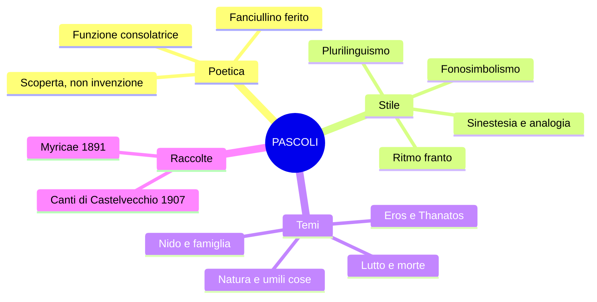

# Giovanni Pascoli — Riassunto

---

## Date fondamentali

| Anno | Evento |
|------|--------|
| **1855** | Nasce a San Mauro di Romagna |
| **1867** | Assassinio del padre Ruggero (notte del 10 agosto) |
| **1868** | Morte della madre |
| **1891** | Prima edizione di *Myricae* |
| **1895** | Matrimonio della sorella Ida → "anno terribile" |
| **1897** | Pubblica *Il Fanciullino* |
| **1902** | Acquista la casa di Castelvecchio di Barga |
| **1905** | Succede a Carducci alla cattedra di Bologna |
| **1907** | Edizione definitiva dei *Canti di Castelvecchio* |
| **6 aprile 1912** | Muore di cirrosi epatica |

---

## 1. Contesto: il Decadentismo

Pascoli e D'Annunzio sono i due maggiori poeti del **Decadentismo italiano**, che prende le mosse dal **Simbolismo francese** (Baudelaire, Verlaine, Rimbaud). La matrice comune è la **sfiducia nella scienza**: la realtà non è indagabile razionalmente, ma è un **mistero** fatto di simboli da decifrare attraverso l'**intuizione** e l'**irrazionalità**. Il poeta deve farsi **veggente** — vedere ciò che l'uomo comune non vede.

In Pascoli questa capacità visionaria si esplica attraverso lo sguardo puro del **fanciullino**; in D'Annunzio attraverso la personalità straordinaria del **vate/superuomo**. Apparentemente agli antipodi, condividono la stessa radice irrazionalista.

---

## 2. Biografia

### Infanzia e trauma

Pascoli nasce a **San Mauro di Romagna**, figlio di Ruggero Pascoli, amministratore della tenuta "La Torre" dei principi Torlonia. Il **10 agosto 1867** il padre viene assassinato in un agguato mentre torna a casa — delitto rimasto senza colpevoli. L'anno dopo muore anche la madre. Questo doppio lutto tra i dodici e i tredici anni rappresenta il **trauma** fondamentale della sua vita: una frattura che la critica legge come chiave interpretativa dell'intera opera.

### Il nido e le sorelle

Trasferitosi in Toscana, Pascoli chiama a vivere con sé le sorelle **Ida** e **Maria (Mariù)**, tentando di ricostruire la **famiglia d'origine** — il **nido**. Quando Ida si sposa nel 1895, per lui è l'"**anno terribile**": il nido si disgrega di nuovo. Resta con Mariù, presenza costante e ossessiva, e il cane **Gulì**. Questo ripiegamento tradisce una resistenza al mondo esterno e alla possibilità di costruirsi una famiglia propria.

### L'interpretazione di Andreoli

Lo psichiatra **Vittorino Andreoli** (*I segreti di casa Pascoli*) affronta il poeta come un **caso clinico**: analizzando scritti privati, fotografie, oggetti e documenti ospedalieri. Emerge un Pascoli alcolista ("vado a letto quasi sempre con la testa piena di cognac"), con sentimenti morbosi verso le sorelle, e una Mariù gelosamente ossessiva che lo controllava con un filo legato al piede durante la notte. La morte per **cirrosi epatica** fu taciuta per non rovinare l'immagine del poeta. Per la professoressa, Pascoli si avvicina ai **poeti maledetti** francesi più di quanto l'immagine ufficiale lasci credere.

### Carriera

Studia dai Padri Scolopi a Urbino, poi Lettere a Bologna (laureato in greco). Insegna al liceo (Matera, Massa) e all'università (Messina, poi Bologna, dove nel 1905 succede a Carducci). La casa di Castelvecchio di Barga viene acquistata vendendo cinque medaglie d'oro di concorsi di poesia latina.

---

## 3. La poetica: *Il Fanciullino* (1897)

La poetica è espressa nella prosa *Il Fanciullino* — dialogo tra il poeta adulto e la sua anima di fanciullo. È poeta solo chi riesce a sentire la voce del proprio **fanciullino interiore**, che conserva la **maraviglia** — la capacità di guardare il reale come una scoperta, senza condizionamenti.

**"Il nuovo non si inventa, si scopre"**: il fanciullino vede il nuovo nelle cose di tutti i giorni. La voce del fanciullino è un "**tinnulo squillo come di campanello**" — limpida, cristallina, opposta alla voce roca dell'adulto. Questo fanciullino non è vitale come quello leopardiano: è un **fanciullo ferito**, angosciato, ripiegato su se stesso.

### Punti cardine

1. **Natura irrazionale e intuitiva** della poesia
2. **Potere analogico e suggestivo**: l'analogia esprime i segreti legami della realtà
3. **Poesia come scoperta delle umili cose**
4. **Simbolismo**: la realtà è misteriosa, fatta di simboli da decifrare
5. **Uso non strumentale**: nessun fine educativo, solo **funzione consolatrice**. Il poeta "non è oratore o predicatore, non filosofo, non maestro"

---

## 4. Lingua e stile

Pascoli è, insieme a D'Annunzio, **fondatore della poesia del Novecento** (Mengaldo). Contini lo definisce "**rivoluzionario nella tradizione**"; Pasolini scrive che è tra gli autori che più incidono sulle sperimentazioni novecentesche.

**Plurilinguismo**: registro basso/colloquiale + linguaggio tecnico (botanica, zoologia) + vernacolare (romagnolo e toscano) + termini latini.

**Le tre categorie di Contini**:
- **Pre-grammaticale**: linguaggio del fanciullino — **onomatopee** (proprie: "chiù", "don don", "tin tin"; improprie: "sciabordare") e **fonosimbolismo** (il suono si carica di significato simbolico: "chiù" evoca angoscia, "viburni" evoca cupezza).
- **Grammaticale**: linguaggio della tradizione poetica codificata.
- **Post-grammaticale**: **tecnicismi** (marra, porche, maggese, viburni, pampano).

**Ritmo franto**: il verso è spezzato da interpunzione frequente, parentetiche, incidentali — innovazione radicale rispetto alla tradizione.

**Ampliamento della valenza semantica**: una parola assume più significati ("fosse" = fossati + sepolture; "urna" = cineraria + calice del fiore). Vita e morte coesistono: **Eros e Thanatos**.

**Figure retoriche principali**: sinestesia ("odore di fragole rosse"), analogia, allitterazione, onomatopea.

---

## 5. Le raccolte

**Myricae** (1891): prima raccolta, dedicata al padre. Titolo da Virgilio: le **tamerici**, arbusti umili, simbolo della poesia delle piccole cose. Temi: natura, umili cose, nido, assenza, lutto.

**Canti di Castelvecchio** (1907): maturità toscana. Temi simili ma dimensione più meditativa e inquieta.

---

## 6. Analisi delle poesie

### *Arano* (Myricae)

Scena di vita contadina autunnale. Due terzine e quartina (endecasillabi). **Prima terzina**: dato visivo — campo con pampani rossi e nebbia. Atmosfera **indeterminata**. **Seconda terzina**: "arano" senza soggetto esplicito → sospensione. "A lente grida, le lente vacche": **monotonia** del lavoro. "Marra pazïente": **enallage** (paziente si riferisce al contadino, non alla zappa); la **dieresi** su pazïente mantiene l'endecasillabo. **Quartina**: percezione uditiva — passero saputo che gode per la semina; "sottil tintinno come d'oro" = allitterazione + onomatopea + **sinestesia** (suono + colore). Chiusura con apertura alla solarità.

### *Lavandare* (Myricae)

**Madrigale** (due terzine + quartina). **Prima terzina**: aratro senza buoi, dimenticato nella nebbia → **solitudine**. **Seconda terzina**: dato uditivo — "sciabordare" e "tonfi" (onomatopee), "lunghe cantilene" → **fatica e monotonia**. **Quartina**: canto popolare delle lavandaie — malinconia per un amore lontano. "Come l'aratro in mezzo alla maggese": **struttura circolare**, l'aratro diventa simbolo dell'**abbandono** interiore.

### *X Agosto* (Myricae)

Parallelismo simmetrico tra la **rondine** (torna al tetto / uccisa / porta la cena ai rondinini) e il **padre** (torna al nido / ucciso / porta bambole alle figlie). I destini si incrociano: del padre si dice "nido", della rondine "tetto" (**metonimia** + scambio). "Tanto di stelle" = **sostantivo astratto** → vastità cosmica. Stelle cadenti = **pianto del cielo**. "Cadde tra spini" e "come in croce": rimando alla **Passione di Cristo** per esemplificare il dolore universale. "Il cielo lontano": irraggiungibile, indifferente alla sofferenza. "Restò negli aperti occhi un grido": **sinestesia**. "Quest'atomo opaco del male": la Terra come regno del dolore. Tema della **sofferenza universale** (modello leopardiano).

### *Nebbia* (Canti di Castelvecchio)

**Invocazione alla nebbia** come muro protettivo. La **siepe** di Pascoli è opposta a quella dell'*Infinito* di Leopardi: non apre all'immaginazione, ma **protegge** dal mondo esterno. Fuori dal nido le cose sono "**ebbre di pianto**". Antitesi tra "soavi mieli" (consolazione) e "nero pane" (dolore). "Che vogliono ch'ami e che vada": le pressioni sociali, ma anche un desiderio interiore represso. La **strada bianca** che conduce al cimitero tra il "don don" (onomatopea) delle campane a morto → la morte come nulla eterno. Il **cipresso** (futuro/morte) contrapposto all'**orto** con il **cane** (presente/affetti).

### *Temporale* (Myricae)

Sette versi impressionistici. "Bubbolìo" = onomatopea del tuono. Contrasto cromatico: rosso all'orizzonte, nero di pece, stracci di nubi chiare. "Tra il nero un casolare: bianco": il **nido** che resiste nel buio — analogia potentissima.

### *L'assiuolo* (Canti di Castelvecchio)

Paesaggio notturno con il verso "**chiù**" dell'assiuolo ripetuto a ogni strofa come ritornello che si carica progressivamente di angoscia. Fonosimbolismo centrale: la "u" accentata evoca lutto e inquietudine. Figure fittissime: sinestesie ("soffi di lampi", "nebbia di latte"), onomatopee, allitterazioni ("tremava, tremulo, trepido, tremiti"). Parentetiche che spezzano il verso → **ritmo franto**.

### *Il gelsomino notturno* (Canti di Castelvecchio)

Allude alla **notte nuziale** attraverso il linguaggio della natura, intrecciando vita e morte. **Viburni** scelti per il suono cupo. "Odore di fragole rosse": sinestesia celeberrima. "Nasce l'erba sopra le **fosse**": doppia valenza (fossati/sepolture). "**Urna**": cineraria e calice del fiore. La Chioccetta = Pleiadi, l'aia azzurra = cielo. **Eros e Thanatos** si fondono.

---

## 7. Confronti

### Pascoli vs Leopardi
- **Siepe**: in Leopardi apre all'infinito, in Pascoli protegge dal mondo
- **Cielo**: in entrambi indifferente al dolore umano
- **Sofferenza universale**: in entrambi dolore cosmico di tutti gli esseri
- **Morte**: per entrambi nulla eterno, nessuna consolazione ultraterrena

### Pascoli vs D'Annunzio
- Fanciullino vs Vate; vita ritirata vs vita inimitabile; piccole cose vs bellezza eroica
- **Matrice comune**: sfiducia nella scienza, realtà come mistero, irrazionalismo
- Entrambi **fondatori della poesia del Novecento**

