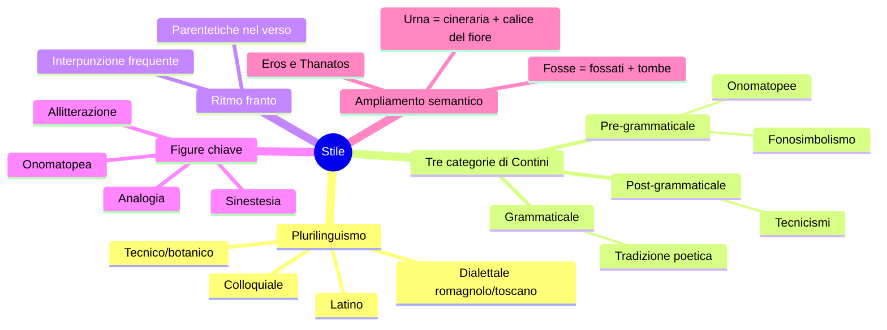
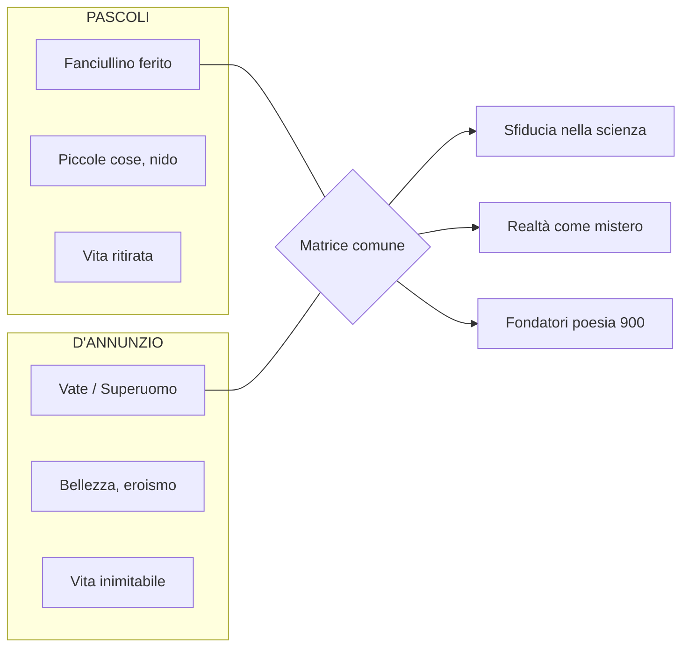

# Giovanni Pascoli — Ripasso veloce

---

## Coordinate essenziali

| | |
|---|---|
| **Nascita** | 1855, San Mauro di Romagna |
| **Morte** | 1912, Castelvecchio di Barga (cirrosi epatica → alcolismo) |
| **Trauma** | Assassinio del padre Ruggero il 10 agosto 1867; morte della madre l'anno dopo |
| **Nido** | Vive con le sorelle Ida e Maria; matrimonio di Ida (1895) = "anno terribile" |
| **Carriera** | Liceo → Università (Messina, poi Bologna, succede a Carducci 1905) |
| **Corrente** | Decadentismo italiano, radice nel Simbolismo francese |
| **Opere chiave** | *Myricae* (1891), *Il Fanciullino* (1897), *Canti di Castelvecchio* (1907) |

---

## La poetica: il Fanciullino

È poeta chi ascolta il suo **fanciullino interiore** — sguardo puro, stupito, innocente che conserva la **maraviglia** (capacità di stupirsi) perduta dall'adulto. **"Il nuovo non si inventa, si scopre."**

Non è il fanciullo vitale di Leopardi: è un **fanciullo ferito**, angosciato.

La poesia non ha scopo educativo ma **funzione consolatrice**. "Il poeta è poeta, non oratore o predicatore, non filosofo, non maestro."

Punti cardine: natura **irrazionale e intuitiva** della poesia; potere **analogico e suggestivo**; poesia come **scoperta delle umili cose**; **Simbolismo** (realtà misteriosa, fatta di simboli); uso **non strumentale**.

---

## Lingua e stile

Pascoli (con D'Annunzio) è **fondatore della poesia del Novecento** (Mengaldo). Contini: "**rivoluzionario nella tradizione**".

**Fonosimbolismo** = il suono si carica di significato simbolico. Es. "chiù" dell'assiuolo → angoscia; "viburni" (vocali u/o) → cupezza.

---

## Temi ricorrenti

- **Nido**: famiglia d'origine, protezione dal mondo, siepe come difesa (≠ Leopardi dove apre all'infinito)
- **Lutto**: morte del padre, della madre; cielo lontano e indifferente; nulla eterno
- **Natura**: paesaggio romagnolo/toscano; nebbia (protezione e ostacolo); flora e fauna con nomi tecnici
- **Vita e morte (Eros/Thanatos)**: coesistono nelle stesse parole e immagini
- **Sofferenza universale**: animali e uomini nel dolore cosmico (modello leopardiano)

---

## Raccolte

**Myricae** (1891): tamerici = piante umili → poesia delle piccole cose. Dedicata al padre. Temi: natura, nido, lutto.

**Canti di Castelvecchio** (1907): fase toscana, più meditativa. Stessi temi ma più inquieti.

---

## Poesie — Scheda rapida

| Poesia | Raccolta | Concetti chiave |
|--------|----------|-----------------|
| **Arano** | Myricae | Vita contadina autunnale; "arano" senza soggetto → indeterminatezza; enallage ("marra paziente"); "tintinno come d'oro" = sinestesia |
| **Lavandare** | Myricae | Madrigale; aratro senza buoi = solitudine; "sciabordare" onomatopea; struttura circolare; maggese = abbandono |
| **X Agosto** | Myricae | Parallelismo rondine/padre; scambio nido-tetto; stelle = pianto del cielo; "cadde tra spini" → Passione di Cristo; "atomo opaco del male" = Terra; sofferenza universale |
| **Temporale** | Myricae | 7 versi impressionistici; "bubbolìo" onomatopea; "tra il nero un casolare: bianco" → nido nella tempesta |
| **Nebbia** | Canti di C. | Invocazione alla nebbia come protezione; siepe opposta a Leopardi; "ebbre di pianto"; don don = cimitero; cipresso vs cane = morte vs affetti |
| **L'assiuolo** | Canti di C. | "Chiù" = fonosimbolismo (angoscia); paesaggio notturno; sinestesie ("soffi di lampi"); ritmo franto |
| **Il gelsomino notturno** | Canti di C. | Notte nuziale; "odore di fragole rosse" sinestesia; "fosse" e "urna" = doppia valenza; Eros e Thanatos |
| **La tovaglia** | Canti di C. | Oggetto umile → memoria familiare; nido; poesia delle piccole cose |

---

## Confronti rapidi

**Pascoli vs Leopardi**: siepe (protezione vs infinito); cielo indifferente in entrambi; sofferenza universale; morte = nulla eterno.

---

## Andreoli: il caso clinico

Lo psichiatra **Vittorino Andreoli** (*I segreti di casa Pascoli*) rivela: trauma del padre; **alcolismo** (lettere private: "testa piena di cognac"); sentimenti morbosi verso le sorelle; gelosia ossessiva di Mariù (filo al piede di notte); morte per **cirrosi epatica** (taciuta). Pascoli è più vicino ai **poeti maledetti** che all'immagine arcadica tradizionale.
